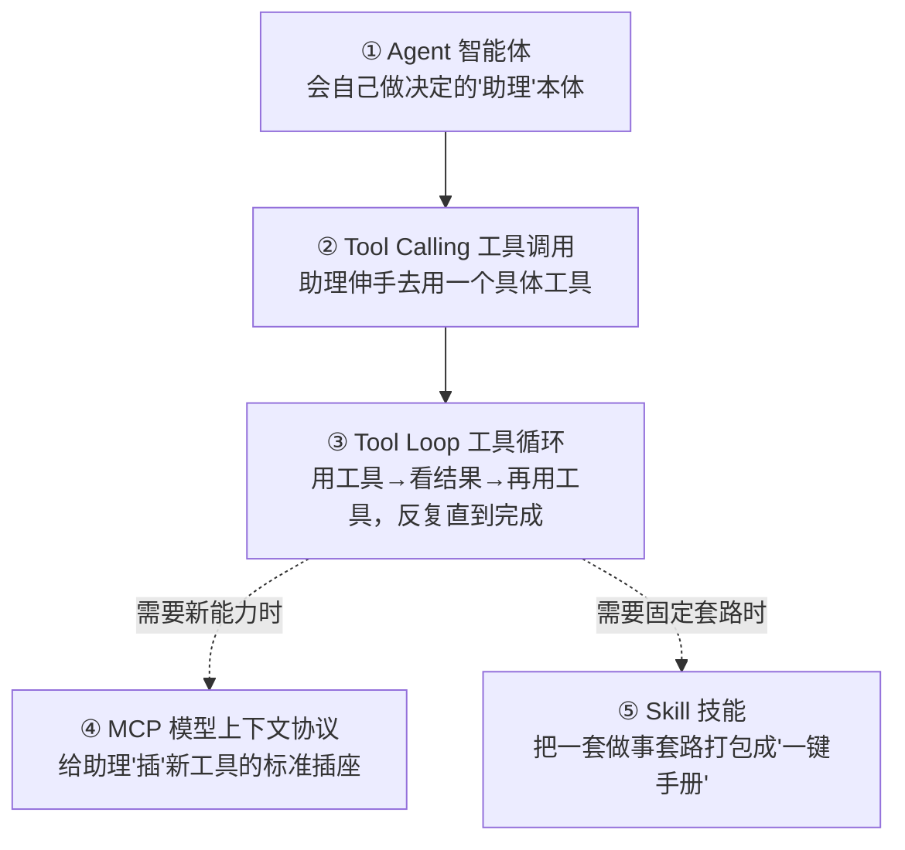
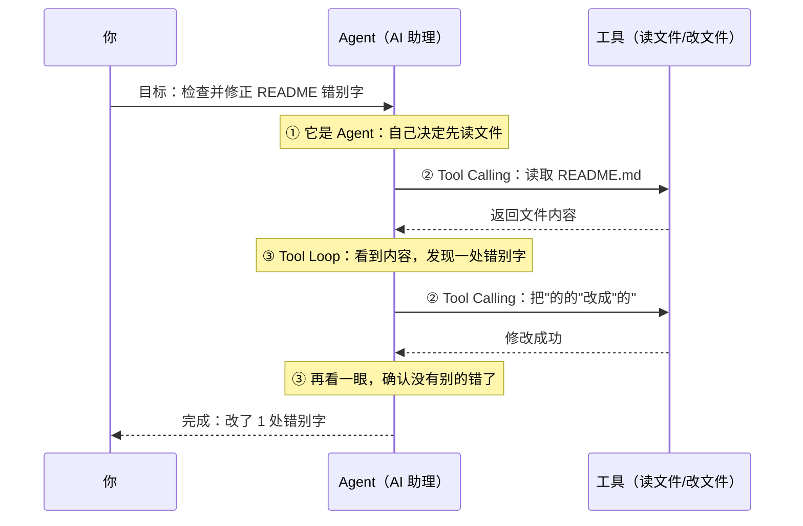
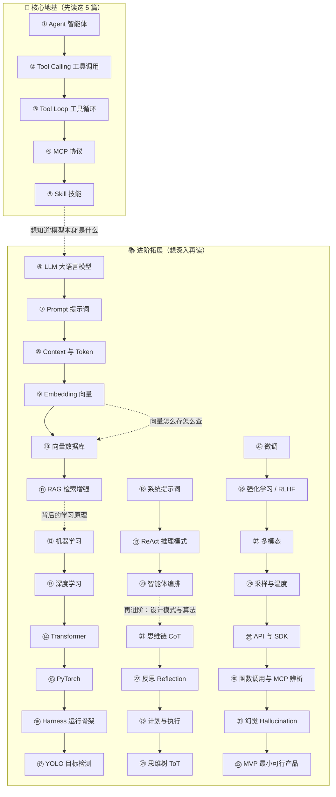

# 概念入门总览：从零看懂 AI 编程助手

> 这份文档是给**完全的新手**看的。你不需要有编程经验，也不需要懂人工智能。
> 我们会用生活里的比喻，把 AI 编程助手（比如 Khy-OS）背后的五个核心概念讲清楚。

Khy-OS 既是一个**真实可用的工具**，也是作者入行 AI 的第一个项目。所以这套文档刻意写得啰嗦、把话说透——**宁可多解释一句，也不让你卡住。**

```callout ask|小白别怕
第一次看到 Agent、Tool Calling 这些词，觉得懵是完全正常的！这套文档会把每个词都拆成生活比喻。你只要**按顺序读**，遇到吉祥物插话就停一下想想，做做小测和翻卡，五个概念自然就串起来了。深呼吸，我们开始～ 🐣
```

---

## 一、先建立一个整体画面

你可以把一个 AI 编程助手想象成一位**会自己动手干活的助理**：

- 你给它一个目标（"帮我修好这个 bug"）；
- 它自己**思考**该怎么做；
- 它会**动手用工具**（读文件、改代码、跑测试）；
- 干完一步看结果，**再决定下一步**；
- 直到目标达成，才回来告诉你"做完了"。

这一整套能力，拆开来看就是下面五个概念。它们像积木一样层层叠起来：



一句话记忆：

| 概念 | 一句话 | 生活比喻 |
|------|--------|----------|
| **Agent** | 会自己拿主意的 AI 助理 | 一个能独立干活的实习生 |
| **Tool Calling** | 助理调用某个具体工具 | 实习生拿起电话打给客户 |
| **Tool Loop** | 反复"用工具→看结果→再决定" | 实习生一步步把任务推进到完成 |
| **MCP** | 给助理接新工具的标准接口 | USB 插座，插上就能用 |
| **Skill** | 打包好的做事套路 | 一本"新员工操作手册" |

---

## 二、建议的阅读顺序

请按顺序读，每一篇都建立在前一篇的基础上：

1. [① 什么是 Agent（智能体）](./[CONCEPT-01]%20什么是Agent-智能体.md)
2. [② 什么是 Tool Calling（工具调用）](./[CONCEPT-02]%20什么是ToolCalling-工具调用.md)
3. [③ 什么是 Tool Loop（工具循环）](./[CONCEPT-03]%20什么是ToolLoop-工具循环.md)
4. [④ 什么是 MCP（模型上下文协议）](./[CONCEPT-04]%20什么是MCP-模型上下文协议.md)
5. [⑤ 什么是 Skill（技能）](./[CONCEPT-05]%20什么是Skill-技能.md)

读完这五篇，你再回到[文档站首页](../index.html)，就能看懂 Khy-OS 其它文档在讲什么了。

---

## 三、一个最小的例子，把五个概念串起来

假设你对 Khy-OS 说：**"帮我看看 README 里有没有错别字，有就改掉。"**



- 它**自己决定**先读后改——这是 **Agent**。
- 它每一次"读文件""改文件"——这是 **Tool Calling**。
- 它"读→发现→改→再检查"这个反复过程——这是 **Tool Loop**。
- 如果这些"读/改文件"的能力是通过标准接口接进来的——那就是 **MCP**。
- 如果"检查错别字"这件事被打包成一个固定套路随时可调用——那就是 **Skill**。

---

## 四、这套概念和 Khy-OS 的关系

Khy-OS 把上面五个概念都做成了真实代码。等你读完概念，可以对照工程实现：

- 工具循环的真实实现：见 [`docs/03_DESIGN_设计`](../03_DESIGN_设计) 里的网关与执行相关设计。
- 技能（Skill）的真实例子：见 [`docs/AI协作预设包/skills`](../AI协作预设包/skills) 目录，里面每个子目录就是一个 Skill。
- 运维与上手：见 [`docs/07_OPS_运维`](../07_OPS_运维)。

> **给自己的提醒**：概念是地图，代码是地形。先看地图（本系列），再走地形（源码），不容易迷路。

```quiz
Q: 五个概念的关系，下面哪个说法对？
- [x] Agent 是"人"，工具调用是"迈一步"，工具循环是"走到终点"，MCP 管"工具从哪来"，Skill 是"做事的剧本"
- [ ] 它们是五个互相竞争、只能选一个用的技术
- [ ] MCP 会取代工具调用，Skill 会取代 Agent
- [ ] 只要懂 Agent 一个词就够了，其它四个是重复的
> 五个概念是**协作**关系不是竞争关系：Agent（谁在干）用工具调用（一次动作）在工具循环（反复接力）里干活，工具可以经 MCP（来源）接入，而 Skill（剧本）告诉它某类事该怎么按套路做。读完五篇再回看这题，会更有底气。
```

---

## 五、进阶阅读：读完五个核心概念之后

上面五篇是**地基**。读透之后，你八成会冒出更细的问题：模型本身到底是什么？为什么它会"忘事"？它怎么"记住"我给的资料？这些问题，下面这条**进阶链**逐个讲透。它们同样面向小白，可以按顺序读，也可以挑你最好奇的那篇：



进阶链清单（点标题直接跳）：

| # | 概念 | 一句话：读了能解决什么困惑 |
|---|------|----------------------------|
| ⑥ | [什么是 LLM（大语言模型）](./[CONCEPT-06]%20什么是LLM-大语言模型.md) | 前五篇一直说的"大模型"到底是什么、怎么来的 |
| ⑦ | [什么是 Prompt（提示词）](./[CONCEPT-07]%20什么是Prompt-提示词.md) | 你打给它的字，为什么写法不同效果差很多 |
| ⑧ | [什么是 Context 与 Token（上下文与令牌）](./[CONCEPT-08]%20什么是Context与Token-上下文与令牌.md) | 为什么它会"忘事"、为什么有"长度限制" |
| ⑨ | [什么是 Embedding（向量）](./[CONCEPT-09]%20什么是Embedding-向量.md) | 文字怎么变成一串数字、机器怎么"懂意思" |
| ⑩ | [什么是向量数据库](./[CONCEPT-10]%20什么是向量数据库.md) | 那些"意思相近"的资料存哪、怎么秒查 |
| ⑪ | [什么是 RAG（检索增强生成）](./[CONCEPT-11]%20什么是RAG-检索增强生成.md) | 它怎么"边查资料边回答"、少编瞎话 |
| ⑫ | [什么是机器学习](./[CONCEPT-12]%20什么是机器学习-MachineLearning.md) | 这一切"会学习"的底层原理 |
| ⑬ | [什么是深度学习](./[CONCEPT-13]%20什么是深度学习-DeepLearning.md) | 现代大模型为什么这么强的技术根子 |
| ⑭ | [什么是 Transformer（变换器）](./[CONCEPT-14]%20什么是Transformer-变换器.md) | 现代大模型的"骨架"、它的绝招"注意力机制"到底神在哪 |
| ⑮ | [什么是 PyTorch（深度学习框架）](./[CONCEPT-15]%20什么是PyTorch-深度学习框架.md) | 工程师用什么"电动工具箱"把模型真正造出来、训出来 |
| ⑯ | [什么是 Harness（智能体运行骨架）](./[CONCEPT-16]%20什么是Harness-智能体运行骨架.md) | 模型只会"吐字"，那到底是谁替它读文件、跑命令、把圈转起来——Khy-OS 的真身 |
| ⑰ | [什么是 YOLO（实时目标检测）](./[CONCEPT-17]%20什么是YOLO-实时目标检测.md) | AI 怎么"一眼"看清一张图里有哪些东西、还框出来——自动驾驶/安防都靠它 |
| ⑱ | [什么是系统提示词（System Prompt）](./[CONCEPT-18]%20什么是系统提示词-SystemPrompt.md) | 为什么它一"出生"就有身份、有规矩、有脾气——那份看不见的"入职手册"在哪 |
| ⑲ | [什么是 ReAct（智能体推理模式）](./[CONCEPT-19]%20什么是ReAct-智能体推理模式.md) | 它做事时"边想边做"的套路叫什么、为什么把思考写出来就更不容易犯傻 |
| ⑳ | [什么是智能体编排（Orchestration）](./[CONCEPT-20]%20什么是智能体编排-Orchestration.md) | 一个 AI 忙不过来时，怎么当"总指挥"拆活、派给一群小 AI、再收结果 |
| ㉑ | [什么是思维链（Chain of Thought）](./[CONCEPT-21]%20什么是思维链-ChainOfThought.md) | 为什么让它"把推理一步步写出来"，答案反而更准、更少犯错 |
| ㉒ | [什么是反思（Reflection）](./[CONCEPT-22]%20什么是反思-Reflection.md) | 它怎么"回头看自己刚才做得对不对"、发现错了再改一遍 |
| ㉓ | [什么是计划与执行（Plan and Execute）](./[CONCEPT-23]%20什么是计划与执行-PlanAndExecute.md) | 面对复杂任务，为什么"先列计划再逐步做"比一步到位更靠谱 |
| ㉔ | [什么是思维树（Tree of Thoughts）](./[CONCEPT-24]%20什么是思维树-TreeOfThoughts.md) | 它怎么"同时想好几条路、比一比再选最优的一条"走下去 |
| ㉕ | [什么是微调（Fine-Tuning）](./[CONCEPT-25]%20什么是微调-FineTuning.md) | 怎么在通用大模型上"再训一小轮"，把它调成你这行的专家 |
| ㉖ | [什么是强化学习（RLHF）](./[CONCEPT-26]%20什么是强化学习-RLHF.md) | 它怎么靠"人给的好评差评"越练越懂人话、越来越会说人味的答案 |
| ㉗ | [什么是多模态（Multimodal）](./[CONCEPT-27]%20什么是多模态-Multimodal.md) | 为什么现在的 AI 不止会读字，还能看图、听声、连起来一起理解 |
| ㉘ | [什么是采样与温度（Sampling）](./[CONCEPT-28]%20什么是采样与温度-Sampling.md) | 同一句话它为什么每次回答都不一样、"temperature"到底调的是什么 |
| ㉙ | [什么是 API 与 SDK](./[CONCEPT-29]%20什么是API与SDK.md) | 你一动手就绕不开的两个词——"约定"与"工具箱"到底谁包着谁、钥匙(Key)为什么绝不能进代码库 |
| ㉚ | [函数调用与 MCP 辨析](./[CONCEPT-30]%20函数调用与MCP辨析.md) | "函数调用/工具调用/MCP"这几个词到底谁管谁、一次调用里各在哪一步登场 |
| ㉛ | [什么是幻觉（Hallucination）](./[CONCEPT-31]%20什么是幻觉-Hallucination.md) | AI 为什么会"一本正经地胡说"、又该怎么防——你入行第一个必须搞懂的坑 |
| ㉜ | [什么是 MVP（最小可行产品）](./[CONCEPT-32]%20什么是MVP-最小可行产品.md) | 点子一大堆，到底先做哪个——怎么砍到"最小但能验证"、先跑起来看反馈再加码 |

> 📌 ⑭ Transformer 与 ⑮ PyTorch 是 **AI 圈最常挂在嘴边的两个词**；⑯ Harness 则是**理解 Khy-OS 自身的钥匙**（它本身就是一个 harness）；⑰ YOLO 帮你看到"AI 不止会读字，还会看图"的另一半江山。最后 ⑱ 系统提示词、⑲ ReAct、⑳ 智能体编排是**理解"智能体怎么被设定、怎么思考、怎么协作"的三块拼图**——⑱ 讲它"出生就带的身份和规矩"，⑲ 讲它"边想边做"的套路，⑳ 讲它当"总指挥"调度一群小 AI。除了 ⑯⑱⑳ 直指本项目，其余 Khy-OS 不一定直接用到——但作为你入行 AI 的第一站，把它们也吃透，日后和人聊 AI 才不露怯。而 ㉑~㉔（思维链 / 反思 / 计划与执行 / 思维树）是四路最常见的 **"AI 设计模式"**，教 AI"怎么想得更稳、更周全"；㉕~㉘（微调 / 强化学习·RLHF / 多模态 / 采样与温度）则补上"模型怎么被训、怎么懂图、怎么随机作答"这几块底子——这八篇合起来，把"智能体的思考模式 + 绕不开的算法概念"补成了一张完整地图。最后 ㉙~㉛（API 与 SDK / 函数调用与 MCP 辨析 / 幻觉）是三篇**"动手接入 + 避坑"**的实战篇：㉙ 讲你一动手就绕不开的"约定与工具箱"、㉚ 掰清"函数调用/MCP"这组最容易混的词、㉛ 讲怎么防 AI"一本正经地胡说"——它们最贴近你真正开始写代码、用工具的那一刻。最后 ㉜（MVP 最小可行产品）把镜头从"AI 概念"拉回到"你自己动手做项目"：点子一大堆时怎么砍到"最小但能验证"的一版先跑起来、用真实反馈校准方向——这是你入行 AI 的第一个项目最该先学会的做事纪律，也正是 Khy-OS 里 `/idea-refine`（点子打磨）技能每次都在帮你做的事。

```callout tip|不用一口气读完
进阶这些篇不是"必修课"。你完全可以只读核心 5 篇就去用 Khy-OS，遇到某个词卡住了，再回来查对应那篇。学习像 +[滚雪球](先有个小内核，用起来遇到问题再往上粘，比一次背完更扎实)——先把地基踩实，其它的用到再补。
```

---

## 六、想换种轻松方式学？读一部修仙小说

如果对着概念文档觉得枯燥，我们还写了一部**修仙长篇小说**——**[《算道天书》：修仙学 AI](../09_STORY_修仙学AI/00_INDEX_修仙学AI-总目录.md)**。

主人公**孔浩原**从山村药童起步，一路修炼成一代 **AI 大师**。他修的每一层境界，都精确对应上面的一个概念：

- **炼气**（接龙诀）＝ [⑥ LLM 大模型](./[CONCEPT-06]%20什么是LLM-大语言模型.md)
- **筑基**（言灵咒 / 纳言之窗）＝ [⑦ Prompt](./[CONCEPT-07]%20什么是Prompt-提示词.md) / [⑧ 上下文与令牌](./[CONCEPT-08]%20什么是Context与Token-上下文与令牌.md)
- **金丹**（驭器术 / 周天循环）＝ [② 工具调用](./[CONCEPT-02]%20什么是ToolCalling-工具调用.md) / [③ 工具循环](./[CONCEPT-03]%20什么是ToolLoop-工具循环.md)
- **元婴 / 化神**（观例悟法 / 神识重楼）＝ [⑫ 机器学习](./[CONCEPT-12]%20什么是机器学习-MachineLearning.md) / [⑬ 深度学习](./[CONCEPT-13]%20什么是深度学习-DeepLearning.md)
- **炼虚 / 合体**（万象坐标 / 藏经阁 / 开卷问道）＝ [⑨ 向量](./[CONCEPT-09]%20什么是Embedding-向量.md) / [⑩ 向量数据库](./[CONCEPT-10]%20什么是向量数据库.md) / [⑪ RAG](./[CONCEPT-11]%20什么是RAG-检索增强生成.md)
- **大乘 / 飞升**（万法归一 / 化身万千）＝ [④ MCP](./[CONCEPT-04]%20什么是MCP-模型上下文协议.md) / [⑤ Skill](./[CONCEPT-05]%20什么是Skill-技能.md) / [① 自主 Agent](./[CONCEPT-01]%20什么是Agent-智能体.md)
- **番外**（观照之眼 / 炼器工坊 / 护道法阵 / 法眼观物）＝ [⑭ Transformer](./[CONCEPT-14]%20什么是Transformer-变换器.md) / [⑮ PyTorch](./[CONCEPT-15]%20什么是PyTorch-深度学习框架.md) / [⑯ Harness](./[CONCEPT-16]%20什么是Harness-智能体运行骨架.md) / [⑰ YOLO](./[CONCEPT-17]%20什么是YOLO-实时目标检测.md)（正传之外的彩蛋，讲大模型的"骨架""铸炉工坊""运行外壳"与"看图神通"）
- **番外·续**（立身法旨 / 思行合一 / 万化调兵）＝ [⑱ 系统提示词](./[CONCEPT-18]%20什么是系统提示词-SystemPrompt.md) / [⑲ ReAct](./[CONCEPT-19]%20什么是ReAct-智能体推理模式.md) / [⑳ 智能体编排](./[CONCEPT-20]%20什么是智能体编排-Orchestration.md)（讲智能体"出生就带的法旨""边想边做的心诀"与"一化万、万归一的调兵之术"）
- **番外·再续**（步步推演 / 回照自省 / 先谋后动 / 万途并参）＝ [㉑ 思维链](./[CONCEPT-21]%20什么是思维链-ChainOfThought.md) / [㉒ 反思](./[CONCEPT-22]%20什么是反思-Reflection.md) / [㉓ 计划与执行](./[CONCEPT-23]%20什么是计划与执行-PlanAndExecute.md) / [㉔ 思维树](./[CONCEPT-24]%20什么是思维树-TreeOfThoughts.md)（四路"AI 设计模式"：把推理显式化、回头挑错、先谋后动、分叉择优）
- **番外·终章**（点化真身 / 赏罚淬心 / 六识同参 / 火候心诀）＝ [㉕ 微调](./[CONCEPT-25]%20什么是微调-FineTuning.md) / [㉖ 强化学习](./[CONCEPT-26]%20什么是强化学习-RLHF.md) / [㉗ 多模态](./[CONCEPT-27]%20什么是多模态-Multimodal.md) / [㉘ 采样与温度](./[CONCEPT-28]%20什么是采样与温度-Sampling.md)（四个绕不开的概念与算法：改内功、按赏罚淬炼、眼耳并用、火候调随机，共**十五篇彩蛋**）

每章末尾都有一节 **📒 凡人笔记**，把"仙法"翻译回真实 AI 术语。**当爽文看会上头，当教材看会开窍。** 👉 [进入《算道天书》](../09_STORY_修仙学AI/00_INDEX_修仙学AI-总目录.md)

---

👉 准备好了就从第一篇开始：[① 什么是 Agent（智能体）](./[CONCEPT-01]%20什么是Agent-智能体.md)

---

> 📊 想知道这套文档站现在做到了什么程度、还剩什么没补？看 [概念入门文档站 · 完成度报告](./00_完成度报告.md)——互动件覆盖、验证门实测、诚实的待办清单，一页看全。
