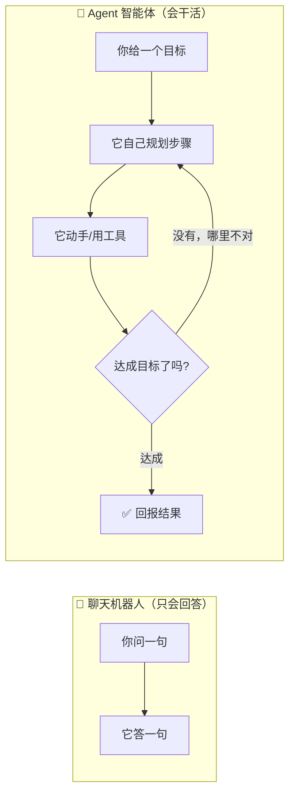
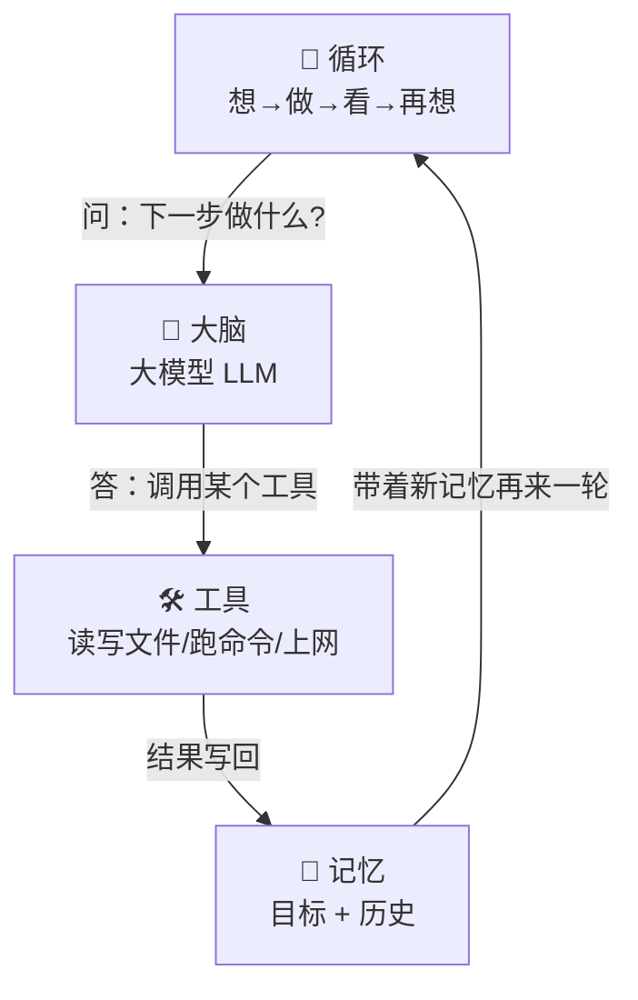
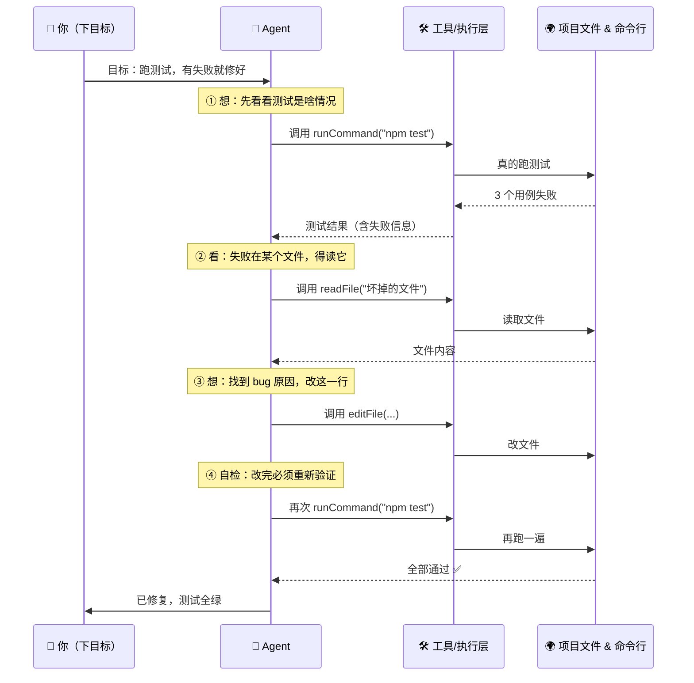
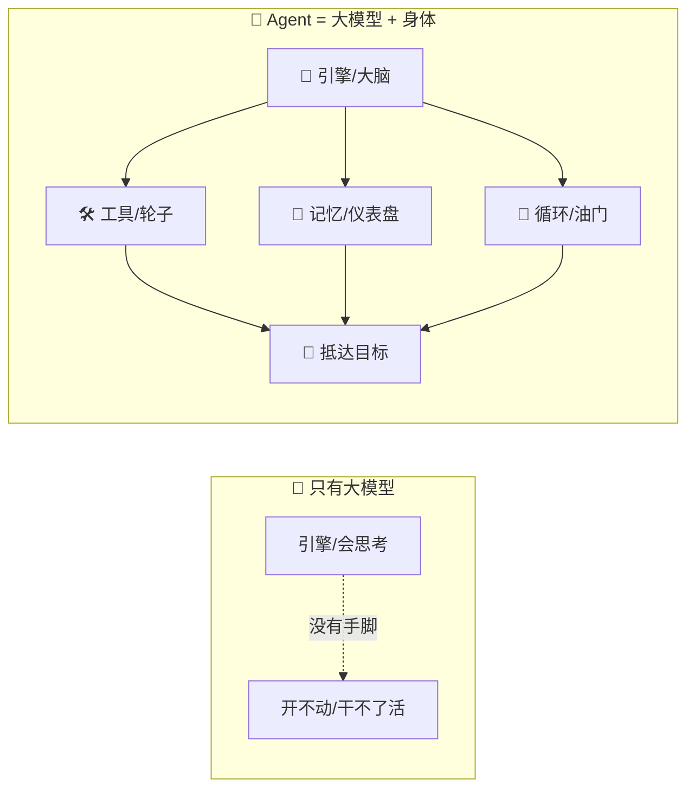
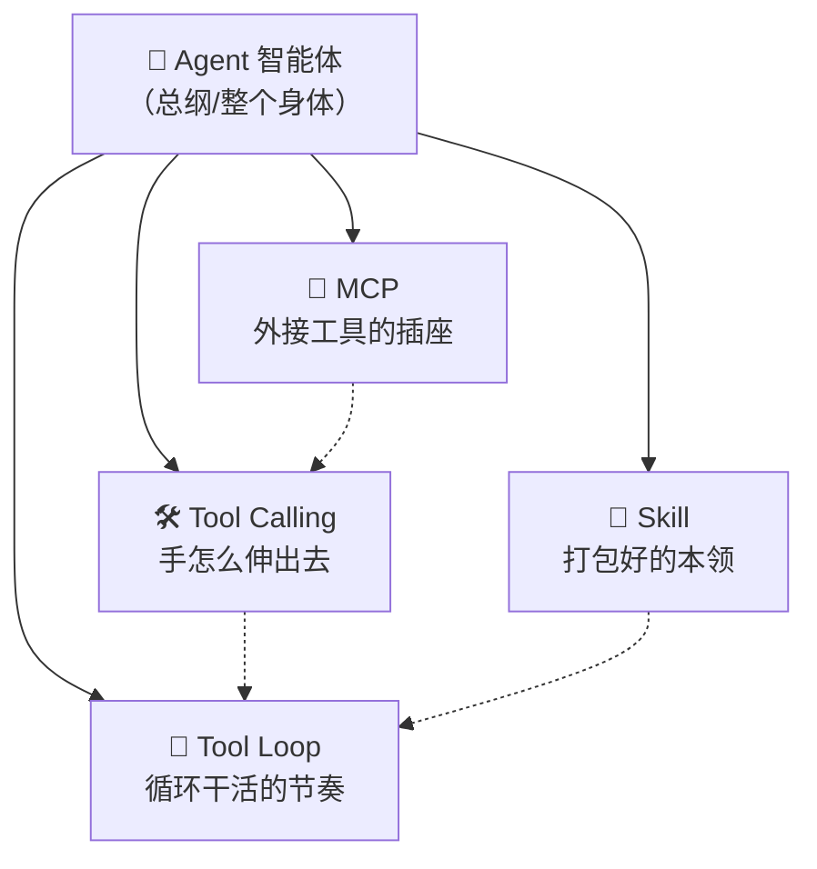

# ① 什么是 Agent（智能体）

> 先读[概念入门总览](./00_INDEX_概念入门-总览.md)会更顺。这一篇只讲一个词：**Agent**。读完你会明白：为什么 Khy-OS 不是"聊天机器人"，而是一个会自己拿主意、自己干活的"数字员工"。

---

## 一、一句话定义

**Agent（智能体）= 一个能自己拿主意、自己动手把任务做完的 AI 助理。**

关键词是"**自己**"。它不是你问一句它答一句的复读机，而是你给它一个**目标**，它自己规划步骤、自己动手、自己检查、发现不对再自己纠正，直到达成目标才回头找你。

如果要把这句话拆成四个能记住的特征，就是下面这张"性格卡"：

| 特征 | 通俗说法 | 一句话解释 |
|------|----------|------------|
| **自主性** | 会自己拿主意 | 不用你一步一步喂，它自己决定下一步做什么 |
| **目标驱动** | 盯着终点跑 | 你给的是"目标"，不是"操作手册"；怎么到达它自己想 |
| **会用工具** | 有手有脚 | 能真的读写文件、跑命令、上网，而不只是嘴上说 |
| **会自我修正** | 撞墙会拐弯 | 中间出错、测试没过，它会回头改，而不是硬着头皮报"完成" |

这四条缺一条，就还不算一个完整的 Agent。后面每一节都在把这四个特征讲透。

```callout ask|小白发问
"自己拿主意"听起来好厉害，那它会不会乱来？——好问题！这正是 +[Tool Loop](工具循环：每做一步都要观察结果再决定下一步，见 CONCEPT-03) 和"成功标准"存在的原因：Agent 的"自由"是被**目标**和**验证**这两根绳子牵着的。放心，后面会讲透。
```

```flip
🤔 猜猜看：你问 AI"帮我把这个项目的测试跑通"，一个**Agent** 和一个普通**聊天机器人**最大的区别是什么？
---
✅ 聊天机器人只会**告诉你**"你应该运行 npm test"；Agent 会**自己去**运行、看到报错、自己改代码、再跑一遍，直到真的绿了才回来找你。区别就一个字：**做**。
```

---

## 二、用生活比喻理解（多个角度看同一个东西）

一个抽象概念，换几个生活场景反复看，才真的记得住。下面用**三个不同的比喻**讲同一个 Agent。

### 比喻一：两种员工

想象两种员工：

- **员工 A（普通聊天机器人）**：你问"北京天气怎么样？"，它答"晴，25 度"。你不问，它不动。它只会**回答**。
- **员工 B（Agent）**：你说"帮我订一张明天去北京的最便宜机票"。它会自己去查航班、比价格、下单、遇到"该航班已满"就换一班、最后回来告诉你"订好了，是 8 点那班，比原计划便宜 120 块"。它会**行动**，还会**随机应变**。

Khy-OS 就是员工 B 这一类。你给目标，它干活。

### 比喻二：导航仪 vs 纸质路书

- **纸质路书（聊天机器人）**：出发前打印好"第 3 个路口左转"。可一旦前方修路，它一无所知，你只能自己抓瞎。
- **导航仪（Agent）**：你只输入**终点**，它自己规划路线；遇到堵车、封路，它**当场重新算路**，继续把你带到目的地。

你看，导航仪最像 Agent 的地方，不是"知道路"，而是"**走错了会重新规划**"——这就是**自我修正**。

### 比喻三：靠谱实习生 vs 只会背书的实习生

- **只会背书的实习生**：你问"公司报销流程是什么"，他能一字不差背出来。但你让他"帮我把这个月的发票报了"，他就傻了——因为背书 ≠ 会办事。
- **靠谱的实习生（Agent）**：你说"把这个月发票报了"，他会自己找发票、填单子、发现某张缺章就跑去补章、最后把回执发给你。他会**为了目标，把一连串琐碎步骤自己串起来**。



三个比喻讲的是同一件事：**Agent 的灵魂不在"懂得多"，而在"能自己把事办成"。**

---

## 三、一个 Agent 由哪几部分组成？

你可以把 Agent 拆成四个零件。缺任何一个，它就不完整。

| 零件 | 作用 | 生活比喻 | 少了它会怎样 |
|------|------|----------|--------------|
| **大脑（大模型 LLM）** | 负责思考、判断、写内容 | 员工的脑子 | 没脑子 = 不会思考，纯执行机器 |
| **工具（Tools）** | 让它能真正影响世界（读写文件、跑命令、上网） | 员工的手和电话 | 没手 = 只能聊天，干不了活 |
| **记忆（Memory / 上下文）** | 记住刚才发生了什么、目标是什么 | 员工的工作笔记本 | 没记忆 = 每一步都失忆，绕圈子 |
| **循环（Loop）** | 驱动它"想→做→看→再想"，直到完成 | 员工的工作节奏 | 没循环 = 只做一步就停，不会接力 |

### 逐个拆开讲

**① 大脑（大模型 LLM）** —— 它是那个会"思考"的核心，输入文字、输出文字。它负责回答"下一步该干嘛"。但注意：**它只会想和说，不会真的动手**。就像一个被绑在椅子上的天才，脑子飞转但四肢动不了。

**② 工具（Tools）** —— 这是给天才松绑、递上的"手"。有了工具，大脑写出的"我要读这个文件"才能变成真的读到文件。工具具体怎么伸出去，是下一篇 [Tool Calling（工具调用）](./[CONCEPT-02]%20什么是ToolCalling-工具调用.md) 的主题。

**③ 记忆（上下文）** —— Agent 每做一步，都要记住"我的目标是什么、刚才做了什么、结果如何"。没有记忆，它做完第 2 步就忘了第 1 步，会不停重复或跑偏。你可以把它想成实习生随身带的那个记满笔记的本子。

**④ 循环（Loop）** —— 这是把前三者驱动起来的"发动机"：想一下 → 动一下手 → 看看结果 → 再想下一步……如此反复，直到目标达成。这个"反复接力"的机制，正是 [Tool Loop（工具循环）](./[CONCEPT-03]%20什么是ToolLoop-工具循环.md) 讲的东西。



一句话总结这张图：**大脑负责想，工具负责做，记忆负责记，循环负责把它们不停地转起来。**

---

## 四、Agent 干活的完整一圈（step-by-step 拆解）

光看零件还不够，我们把一个 Agent 做一件真事时"脑子里发生了什么"一步步走一遍。假设你给的目标是：**"帮我把项目里所有测试跑一遍，如果有失败就修好。"**



把这一圈用大白话复述一遍：

1. **接目标**：你给的是"跑测试并修好"，不是"第一步做 A、第二步做 B"。**怎么做是它自己想的**（目标驱动）。
2. **先侦察**：它没有瞎改，而是先跑一次测试，**根据真实结果**决定下一步（自主性）。
3. **看结果、再决策**：看到某文件出错，就去读那个文件——**上一步的结果决定下一步的动作**（这就是"记忆/上下文"在起作用）。
4. **动手改**：用工具真的修改文件（会用工具）。
5. **自检收尾**：改完**没有直接说"修好了"**，而是重新跑测试确认全绿才回报（自我修正 + 负责任）。

第 5 步是新手最容易忽略、却最能体现"好 Agent"的一步。Khy-OS 把它写成了一条铁律，第六节会讲。

上面那张时序图有点"工程味"。我们把**同一件事**换成一幕小短剧，你就能"看见"Agent 干活时的画面了——注意它每说一句话，背后都在做上面那一圈里的某一步：

```scene 一个 Agent 修 bug 的现场
🙋 你 | 帮我把项目里的测试跑一遍，有失败就修好。
🤖 Agent | 收到。我先别急着改，跑一次看看现在啥情况。
> 🖥️ 叮——命令行返回：3 个测试用例失败，都指向 `login.js`
🤖 Agent | 有 3 个红的，都在 login.js。我读一下这个文件找原因。
📄 文件 | （login.js 的内容摊在它面前）第 42 行少写了个判空……
🤖 Agent | 找到了！第 42 行漏了判空，我改掉。改完**绝不能**直接说修好了——
🤖 Agent | ——得再跑一遍测试自检。
> 🖥️ 叮——命令行返回：全部通过 ✅
🤖 Agent | 全绿了，这才敢回报。搞定：改了 login.js 第 42 行的一处判空。
🙋 你 | 这就是它和"只会答话的机器人"最大的不同——它**真的动了手，还自己验过了**。
```

看懂这幕戏，第四节那张图就活了：**每一句对话，都是"想→做→看→再想"这圈里的一步**；而最关键的那句"改完绝不能直接说修好了，得再跑一遍自检"，正是下面要讲的那条铁律。

---

## 五、Agent 和"大模型"是一回事吗？

**不是。** 这是新手最容易混的一点：

- **大模型（LLM，比如 Claude、GPT）** 只是那个"**大脑**"。它本身只会输入文字、输出文字。
- **Agent** 是把这个大脑**装进一个能动手的身体里**：给它工具、给它记忆、给它一个会反复驱动它的循环。

打个比方：**大模型是"引擎"，Agent 是"整辆车"。** 引擎再强，没有轮子、方向盘、油门、导航，也开不到目的地。

再换个厨房的比喻：**大模型是"会背菜谱的厨师"，Agent 是"真的把菜做出来端上桌的整个后厨"** —— 有炉灶（工具）、有备菜台上的记录（记忆）、有"尝味→调整→再尝"的流程（循环）。只会背菜谱，客人是吃不上饭的。



记住这个等式：**Agent ≈ 大模型 + 工具 + 记忆 + 循环。** 大模型只是其中一块（虽然是最核心的一块）。

---

## 六、常见误区（新手最容易踩的坑）

> 每条都用"❌ 错误理解 / ✅ 正确理解"对照，看完能避开一大半误会。

**误区一：Agent = 更聪明的聊天机器人**
- ❌ 以为 Agent 只是"回答得更好、更长"的 ChatGPT。
- ✅ 区别不在"答得好不好"，而在"**会不会自己动手**"。聊天机器人只输出文字；Agent 会真的读文件、跑命令、改代码。灵魂差异是**行动能力**，不是口才。

**误区二：Agent 越自主 = 越不受控**
- ❌ 以为"自己拿主意"就是"脱缰野马，想干嘛干嘛"。
- ✅ 自主的是**"怎么做"的路径**，不是**"做不做、能不能做"的权限**。像 Khy-OS 就有明确红线：危险命令会被拦、未经点头不许自己 commit/push。**自主 ≠ 无边界**。

**误区三：大模型（LLM）就是 Agent**
- ❌ 把"Claude / GPT 这个模型"直接叫成 Agent。
- ✅ 模型只是**大脑**。没接工具、没有循环的裸模型，只能聊天，不是 Agent。Agent 是"大脑 + 身体"的整套系统（见第五节）。

**误区四：Agent 会一次性把事做完，不会出错**
- ❌ 期待它像"一键完成"的魔法按钮，中间不该有失败。
- ✅ Agent 的正常工作方式恰恰是**"试错—修正"**：它可能改一版没过、再改一版、跑三次测试才绿。**中间的失败和重试是特性，不是 bug**。真正重要的是它最后**验证过再回报**。

**误区五：Agent 说"做完了"就一定做完了**
- ❌ 看到它回报"已完成"就完全放心。
- ✅ 一个负责任的 Agent 会**先自检再回报**；但用户也该知道"完成的定义 = 验证通过"。Khy-OS 专门立了条纪律来治这个（下一节）：**没跑过验证，不许说做完了**。

---

## 七、动手小实验 / 思想实验

> 不用写代码，在脑子里跑一遍，或对着 Khy-OS 观察，就能把概念坐实。

### 思想实验 A：给同一个任务，两种 AI 会怎么反应？

任务：**"这个项目的 README 里有个错别字，帮我改掉。"**

- **聊天机器人**会怎么反应？——它多半回你："请把 README 内容贴给我，我帮你看看哪里有错。" 它**够不到你的文件**，只能等你喂。
- **Agent（Khy-OS）**会怎么反应？——它会自己去**读** README、**找**出错别字、**改**掉、然后告诉你改了哪一处。

你在脑子里比一比这两种反应，就彻底理解了"**会不会动手**"这条分界线。

### 思想实验 B：把"四个零件"抽掉一个，会瘫在哪？

拿第四节那个"跑测试并修 bug"的例子，依次想象抽掉一个零件：

- 抽掉**工具** → 它只能说"你应该跑一下测试"，但跑不了。停在第 1 步。
- 抽掉**记忆** → 它跑完测试就忘了失败信息，下一步不知道该读哪个文件。原地打转。
- 抽掉**循环** → 它读完文件、改完一处就停了，不会主动"再跑一次测试确认"。半途而废。
- 抽掉**大脑** → 根本不知道"失败信息意味着要读哪个文件"。寸步难行。

这个实验能让你牢牢记住：**四个零件是一个都不能少的整体。**

```quiz
Q: 下面哪一个，才算得上是真正的 "Agent"？
- [ ] 你问一句、它答一句，但从不碰你的文件
- [x] 你给一个目标，它自己读文件、动手改、跑测试、失败了再改，直到成功
- [ ] 一个能背出很多知识、但只会输出文字的大模型
- [ ] 一个固定流程的脚本，只能按写死的步骤跑
> 关键在"自己拿主意 + 会动手 + 会自我修正"。只有第二个同时满足了自主性、目标驱动、会用工具、会自我修正这四条。
```

### 观察实验 C：对着真实的 Khy-OS 看它的循环

下次你用 Khy-OS 交一个多步骤任务（比如"加个小功能并加测试"），**盯着它的输出看**，你会亲眼看到第四节那张图的现实版：

1. 它先**读**几个相关文件（在侦察）；
2. 然后**动手改**；
3. 然后**跑验证命令**；
4. 如果红了，它**回头再改**；
5. 全绿了才**回报**。

看它"想→做→看→再想"转圈的过程，比读十遍定义都管用。

---

## 八、为什么 Agent 这么有用？

因为很多真实任务**不是一步能完成的**，需要"走一步看一步"：

- **修 bug**：要先看代码 → 猜原因 → 改 → 跑测试 → 没过再改……
- **写功能**：要先看现有结构 → 设计 → 写 → 验证……
- **查资料并整理**：要先搜 → 读 → 发现不够 → 再搜 → 归纳……

这些活的共同点是：**下一步做什么，取决于上一步的结果**。人类干这类活靠的是"试错—修正"，Agent 恰恰把这套工作方式自动化了。所以凡是"多步、要根据中间结果调整"的任务，都是 Agent 的主场。

反过来，如果一件事**一句话就能答完**（比如"1+1 等于几"），那用不上 Agent，一个聊天机器人足矣。**Agent 的价值，在任务越复杂、步骤越多时越明显。**

---

## 九、和其它概念的关系

Agent 是这一整套概念的"**总纲**"，其它几个概念都是它身上的某个零件或某种能力：

| 概念 | 它是 Agent 的哪一块 | 一句话关系 |
|------|---------------------|------------|
| [Tool Calling 工具调用](./[CONCEPT-02]%20什么是ToolCalling-工具调用.md) | Agent 的"**手**"怎么伸出去 | Agent 想动手，靠的就是一次次工具调用 |
| [Tool Loop 工具循环](./[CONCEPT-03]%20什么是ToolLoop-工具循环.md) | Agent 的"**循环**"发动机 | 把多次工具调用自动接力，就是 Agent 干活的节奏 |
| [MCP 模型上下文协议](./[CONCEPT-04]%20什么是MCP-模型上下文协议.md) | 给 Agent "**外接更多工具**"的标准插座 | 让 Agent 能用上外部世界的工具，像 USB 一样即插即用 |
| [Skill 技能](./[CONCEPT-05]%20什么是Skill-技能.md) | 给 Agent "**打包好的看家本领**" | 把一套做某类事的套路封装好，让 Agent 一键调用 |

读完这一篇，建议顺着 ② → ③ → ④ → ⑤ 一路读下去，你会发现它们像拼图一样，最后拼回到"Agent"这张总图上。



---

## 十、和 Khy-OS 的关系

Khy-OS 本身就是一个 Agent 系统：你在命令行给它目标，它调用一堆工具、循环推进，最后回报。前面讲的四个零件、那一圈"想→做→看→再想"，在 Khy-OS 里都能对上号：

- **大脑** → Khy-OS 背后接的大模型；
- **工具** → Khy-OS 内置的一批工具（读写文件、跑命令、搜代码、抓网页……），它们的设计可以在 [`docs/03_DESIGN_设计`](../03_DESIGN_设计) 里看到概念级的描述；
- **记忆** → Khy-OS 会保留会话上下文和目标；
- **循环** → Khy-OS 的执行主循环，负责一步步驱动到验证通过。

它还特别强调一条纪律——

> **没跑过验证，不许说"做完了"。**

这正是一个**负责任的 Agent** 该有的样子：不仅会动手，还会**自己检查成果**再回报。这条纪律在 Khy-OS 的项目章程里叫 **B2（目标驱动执行）**，配套还有 **B1（先想再写）** 和 **B3（外科手术式改动）**。你可以把这三条理解为：一个**训练有素的 Agent** 的职业素养——先想清楚、只动该动的、干完必自检。

> 想更系统地了解 Khy-OS 的设计与纪律，可以往 [`docs/03_DESIGN_设计`](../03_DESIGN_设计) 目录继续读（本篇只讲概念，不涉及具体实现文件）。

---

## 十一、小结 + 下一步

- **Agent = 会自己拿主意、自己动手完成目标的 AI 助理。** 它的四个特征：自主性、目标驱动、会用工具、会自我修正。
- 它 = **大脑（大模型）+ 工具 + 记忆 + 循环**，四个零件缺一不可。
- 它和"纯聊天大模型"最大的区别：**会行动、会自检**。
- 它的干活方式是"想→做→看→再想"的循环，**中间的试错和重试是特性**。
- 在 Khy-OS 里，这套东西配着一条铁律：**没验证过，不许说做完。**

它的"手"具体怎么伸出去用工具？请看下一篇：

👉 [② 什么是 Tool Calling（工具调用）](./[CONCEPT-02]%20什么是ToolCalling-工具调用.md)
