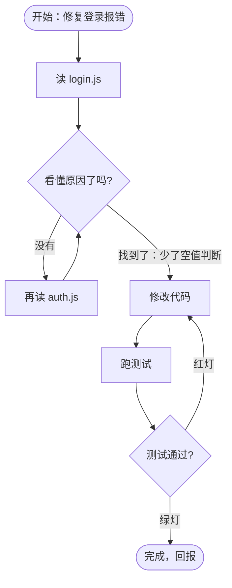
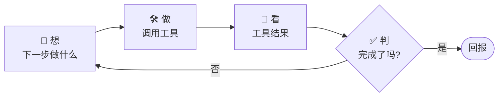
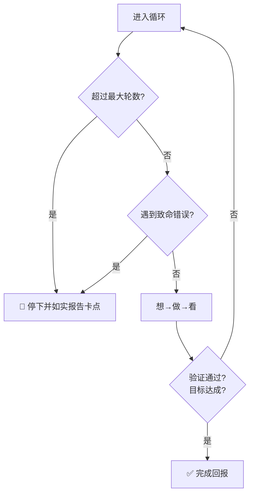
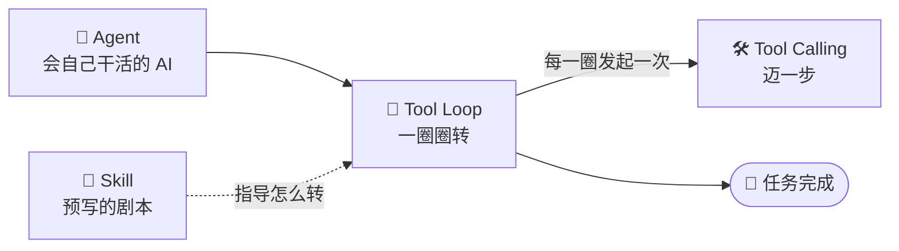

# ③ 什么是 Tool Loop（工具循环）

> 建议先读 [② 什么是 Tool Calling](./[CONCEPT-02]%20什么是ToolCalling-工具调用.md)。这一篇讲：怎么把"很多次工具调用"自动接力成一件完整的活。往后可以接着读 [⑤ 什么是 Skill](./[CONCEPT-05]%20什么是Skill-技能.md)，它给循环准备"剧本"。

---

## 一、一句话定义

**Tool Loop（工具循环）= 让 AI 反复地"思考 → 调用工具 → 看结果 → 再思考"，一圈一圈转，直到任务真正完成。**

它是把 [Agent](./[CONCEPT-01]%20什么是Agent-智能体.md) 从"只会走一步"变成"能走完全程"的**发动机**。

打个最直白的比方：

- [工具调用](./[CONCEPT-02]%20什么是ToolCalling-工具调用.md)是**迈一步**；
- 工具循环是**一步接一步走到目的地**。

一步谁都会迈，难的是"走到哪、看清楚路况、再决定下一步往哪迈"——工具循环干的就是这件事。

```callout note|小笔记
把三个概念连起来记：+[Agent](会拿主意的数字员工) 是"人"，+[工具调用](迈出一步的动作) 是"迈一步"，**工具循环**是"一步接一步走到终点"。少了循环，Agent 就只会走第一步然后停下。
```

```flip
🤔 如果 AI 每一步都不看结果、埋头往下做，会发生什么？
---
😵 它会像蒙着眼走迷宫：撞了墙也不知道，把错误一路带到底。**"看结果再决定下一步"** 正是工具循环最值钱的地方——它让 AI 能发现错、然后拐弯。
```

---

## 二、为什么需要循环？

因为真实任务**做完一步之后，下一步取决于这一步的结果**，事先没法全想好。

这句话有点抽象，我们用四个生活场景把它讲透。它们都在描述同一个循环：**想 → 做 → 看 → 再决定**。

### 比喻一：炒菜时不停"尝味调整"

好厨子从不会一次把所有盐都放进去。他是这样干的：

放一点盐 → **尝一口** → "还差点" → 再放一点 → **再尝** → "够了，起锅"。

他每放一次盐，都要**先尝再决定下一步**。为什么不能一次放够？因为他**放之前根本不知道要放多少**——食材多少、锅气大小、今天口味，都会影响结果。**只有尝过（看结果）才知道下一步**。工具循环里的 AI，就是那个不停"尝味"的厨子。

### 比喻二：走迷宫时试错

进了迷宫，你不可能站在门口就想好整条路。你只能：

往前走 → **撞墙了** → 退回来换一条 → **走通了** → 继续 → **又是死路** → 再换……

每一步都靠**上一步撞没撞墙**来决定往哪走。这就是循环：**没有一次性的完美计划，只有走一步看一步的接力**。

### 比喻三：医生"诊断—检查—再诊断"

你去看病，医生不会一进门就开药。他是这样的：

问诊（觉得像肠胃炎）→ **开个化验单** → 拿到化验结果 → "不对，是阑尾炎" → **再拍个 CT** → 确诊 → 开方子。

医生每做一次检查，都会**根据结果修正自己的判断**，甚至推翻之前的想法。工具循环里的 AI 也一样：读了新文件、跑了测试，就可能**改变对问题的看法**。

### 比喻四：修 bug（回到我们的老本行）

你没读代码之前，根本不知道 bug 在哪，也就没法一次性给出所有步骤：



看到那几个**往回指的箭头**了吗？那就是"循环"。每一圈，AI 都根据**最新看到的结果**决定下一步。这正是人类做菜、走迷宫、看病、调试时共用的方式，工具循环把它自动化了。

> **一句话记住**：如果一件事"下一步要看上一步的结果才知道怎么办"，那它就需要循环，而不是一张写死的清单。

---

## 三、循环的一圈，到底发生了什么？

把一圈拆成四拍（记住这个节奏就懂了）：

| 拍子 | 名字 | 在干嘛 | 生活比喻 |
|------|------|--------|----------|
| 第 1 拍 | **想（Reason）** | 大模型根据目标和已知信息，决定下一步做什么 | 厨子想"该尝味了" |
| 第 2 拍 | **做（Act）** | 发起一次[工具调用](./[CONCEPT-02]%20什么是ToolCalling-工具调用.md)（读文件 / 改代码 / 跑命令…） | 舀一勺尝 |
| 第 3 拍 | **看（Observe）** | 拿到工具返回的结果 | 尝出"偏淡" |
| 第 4 拍 | **判（Decide）** | 结果满足目标了吗？满足 → 结束；不满足 → 回到第 1 拍 | "还差点盐，再来" |



这个"想—做—看—判"的循环，在业界常被叫做 **ReAct**（Reason + Act，推理与行动交替）。你不用记这个词，记住"转圈直到完成"就够了。

### 把一轮再放慢，逐格拆给你看

新手最容易糊涂的是"一轮里到底谁在说话"。我们把**一轮**用对话形式拆开：

1. **模型思考**：它在脑子里盘算——"任务是修登录报错，我还没读过代码，第一步应该先看 `login.js`。"（这一步只有思考，还没动手。）
2. **发起工具调用**：它填一张[申请单](./[CONCEPT-02]%20什么是ToolCalling-工具调用.md)：`readFile("login.js")`，交给执行层。
3. **拿到结果**：执行层真的去读了文件，把内容递回来："这是 login.js 的全部内容……"
4. **判断是否达成目标**：模型看完内容，问自己——"我把 bug 修好了吗？没有，我才刚看完代码。目标没达成。"
5. **决定去留**：既然没达成，就**回到第 1 步**开始下一轮："下一步我该改哪里。"

一轮的关键就是最后那个岔路口：**达成 → 收尾回报；未达成 → 带着新信息进入下一轮**。整个循环就是这个岔路口被反复走。

---

## 四、循环必须有"刹车"，否则会转不停（新手最好奇的一章）

一个只会转圈的循环很危险：万一它永远达不到目标，就会无限循环、烧钱烧时间。所以真实系统都会给循环装几种"刹车"。这是新手问得最多的问题——**它到底靠什么停下来？** 答案是：**三种刹车，任何一种踩下都会停。**

### 刹车一：目标达成（正常停车）

这是最理想的结束方式。前提是**事先说清楚"什么算做完"**。

- "测试全绿" —— 跑测试，绿了就停。
- "README 里不再有错别字" —— 检查一遍，没了就停。
- "文件已成功写入并读回验证一致" —— 验证通过就停。

如果没有一个**可验证的成功标准**，循环就不知道自己到没到终点——就像开车没有目的地，只能一直开。所以"先定义清楚成功长什么样"是循环能健康停下的前提。

### 刹车二：步数上限（安全护栏）

万一目标一直达不成怎么办？不能让它无限转。于是给一个**最大轮数**（比如最多 6 轮）：

> 转到第 6 轮还没完成，就**主动停下来求助**，如实说"我卡在哪了"，而不是硬着头皮继续烧。

这就像考试有交卷铃：**时间到了必须停笔**，哪怕没做完。这条护栏保证再糟的情况也不会失控。

### 刹车三：出错识别（急刹车）

有时候不是没做完，而是**撞上了没法继续的错误**：文件不存在、命令报致命错误、权限不够。这时候硬转下去只会越搞越糟，应该**立刻停下并报告**。

更微妙的是，好的循环还要能**分辨错误的性质**："这个红灯是我刚才改坏的，还是它本来就是坏的？" 分不清就容易瞎改——把本来无关的老问题当成自己的锅，越改越乱。

### 三种刹车放在一张图里



> Khy-OS 的项目纪律把这件事写死了：**每步都要带一个"验证命令"，跑过验证才算这步完成；轮数有上限；到顶还没绿，就如实报告卡在哪——绝不假报成功。** 这套纪律就是给工具循环装的三副刹车。

```quiz
Q: 工具循环为什么必须有"刹车"？（多选，全选对才算过）
- [x] 防止任务卡住时无限循环、烧钱烧时间
- [x] 遇到致命错误时该立刻停下报告，而不是越改越糟
- [x] 达成目标后要能正常停车、回报结果
- [ ] 因为大模型每次只能想一步，没别的办法
> 三副刹车分别对应：步数上限（防死循环）、出错识别（急刹车）、目标达成（正常停车）。第四个是错的——模型能连续推理很多步，"刹车"是为了安全和收敛，不是能力限制。
```

---

## 五、一个具体的循环走一遍

任务："给项目加一个 `hello` 命令"。看它怎么一圈圈推进：

1. **想**：先看看命令是怎么注册的 → **做**：读 `cli.js` → **看**：懂了注册方式 → **判**：还没加，继续。
2. **想**：照着写一个 `hello` → **做**：改 `cli.js` → **看**：改好了 → **判**：还没验证，继续。
3. **想**：得确认没写坏 → **做**：跑 `node --check cli.js` 和测试 → **看**：全绿 → **判**：目标达成，**结束**。

三圈，一件完整的活就做完了，而且**最后一圈是自我验证**。

请特别注意第 3 圈：循环不是"改完就走"，而是**改完还要自己检查一遍**才敢说"做完了"。这就是刹车一（目标达成）在起作用——没跑过验证，它不会宣布胜利。

把上面这三圈演成一幕小短剧，你就能"看见"循环一圈圈转的画面了——留意它每转一圈，都会**回头看结果、再决定要不要继续**：

```scene 工具循环转三圈：给项目加个 hello 命令
🙋 你 | 给项目加一个 hello 命令。
🤖 Agent | 第 1 圈——我还不知道命令怎么注册的，先读一下 `cli.js`。
> 👀 看结果：哦，原来命令是这样一条条注册进去的。还没加，继续转。
🤖 Agent | 第 2 圈——照着葫芦画瓢，把 hello 写进去。改好了。
> 👀 看结果：改是改了，可我还没验证有没有写坏，不能停，继续转。
🤖 Agent | 第 3 圈——跑一下 `node --check` 和测试自检。
> 👀 看结果：全绿 ✅。目标达成——这一圈是"回去验证"，可以踩刹车了。
🤖 Agent | 搞定！三圈下来：先看清、再动手、最后自检，一件完整的活就成了。
```

看懂这幕戏，你会发现循环的形状特别规整：**第一圈几乎总是"先看清现状"，最后一圈几乎总是"回去验证"，中间才是真正动手**。下一节的思想实验，就带你自己当一回"循环引擎"，把这个节奏念出来。

---

## 六、动手小实验：在脑子里跑一遍多轮循环

工具循环光看不练很难有体感。下面给你一个**思想实验**：不用电脑，就在脑子里当一回"循环引擎"，把每一轮的四拍念出来。

**任务**：检查并修正 `README.md` 里的错别字。

试着自己先想一遍，再对照下面的"标准跑法"：

- **第 1 轮**
  - 🧠 想：我还没看过 README，得先读它。
  - 🛠️ 做：`readFile("README.md")`
  - 👀 看：拿到全文，扫到一处"安转"应该是"安装"。
  - ✅ 判：发现了错字，但还没改。目标未达成 → 下一轮。
- **第 2 轮**
  - 🧠 想：把"安转"改成"安装"。
  - 🛠️ 做：`editFile` 把那处改掉。
  - 👀 看：返回"修改成功"。
  - ✅ 判：改是改了，但我没确认还有没有别的错字，也没确认真的改对了 → 下一轮。
- **第 3 轮**
  - 🧠 想：重新读一遍确认。
  - 🛠️ 做：再 `readFile("README.md")`
  - 👀 看：全文再扫一遍，"安装"对了，没有其它错字了。
  - ✅ 判：目标达成（README 无错别字且已验证）→ **收尾回报**。

三轮结束。发现规律了吗？

1. **第一轮几乎总是"先看清楚"**——不了解现状就动手是蒙。
2. **最后一轮几乎总是"回去验证"**——不验证就说"改好了"是吹。
3. 中间才是"真正干活"。

把这个节奏记住，你就理解了绝大多数工具循环的形状。

---

## 七、常见误区（❌ / ✅）

新手对工具循环最容易踩这几个坑，逐条纠正：

- ❌ **以为"循环 = 死循环，会永远转下去"。**
  ✅ 循环一定有刹车（目标达成 / 步数上限 / 出错），它是**会停的**转圈，不是停不下来的旋转木马。

- ❌ **以为"每转一圈都要问用户一次"。**
  ✅ 恰恰相反，循环的价值就是**自己接力、不用一步步烦你**。它只在真正需要（卡住了、或涉及不可逆的危险操作）时才停下来问你。

- ❌ **以为"工具循环 = 多线程 / 一次并行干很多事"。**
  ✅ 工具循环本质是**一步接一步的串行接力**（因为下一步依赖上一步的结果）。它可能在某一拍里同时发几个互不依赖的调用，但整体节奏是"转圈"，不是"多开"。多线程讲的是"同时"，循环讲的是"接力"，两码事。

- ❌ **以为"循环里每一步都是在写代码"。**
  ✅ 大多数步骤其实是**读和看**（读文件、跑测试看输出、搜索代码）。真正"动手改"的步骤往往只占一小部分。循环的智慧主要花在"看清楚再决定"上。

- ❌ **以为"循环转完 = 任务一定成功了"。**
  ✅ 循环停下有三种原因，只有"目标达成"那种才是成功。撞了步数上限或致命错误而停，是**如实报告失败**——这也是循环该有的行为，不是 bug。

---

## 八、和其它概念的关系

工具循环不是孤立的，它把前后几个概念串成一条链：



- **对上：[① Agent](./[CONCEPT-01]%20什么是Agent-智能体.md)**——Agent 是"会自己干活的 AI"，工具循环就是它体内那台**发动机**。没有循环，Agent 就只会走一步。
- **对内：[② Tool Calling](./[CONCEPT-02]%20什么是ToolCalling-工具调用.md)**——循环转的每一圈，第 2 拍"做"就是**一次工具调用**。工具调用是"一步"，循环是"把很多步接起来"。
- **对旁：[⑤ Skill](./[CONCEPT-05]%20什么是Skill-技能.md)**——如果说循环是"临场发挥地走迷宫"，那 **Skill 就是一张走过这类迷宫的老手留下的剧本**。有了 Skill，循环不用每次都从零试错，可以照着"做这类任务通常先干啥、再干啥、怎么验证"来转，少走弯路、更稳。**Skill 给循环剧本，循环照剧本转。**

一句话串起来：**Agent 靠工具循环干活，循环每圈发起一次工具调用，Skill 给循环提供剧本。**

---

## 九、和 Khy-OS 的关系

Khy-OS 的核心就是这样一个工具循环引擎（它把这套方法论叫 **Loop Engineering**，循环工程）。**工具循环是 Khy-OS 网关层 / 执行层的心脏**——用户的一个目标进来，就由这台循环引擎一圈圈推进，直到达标或触发刹车。

它在循环里还叠了很多护栏，全都对应我们前面讲的东西：

- **可验证的成功标准**：每步带验证命令，跑过才算完（对应刹车一）。
- **轮数上限 + 卡住如实报告**：绝不假报成功（对应刹车二、三）。
- **失败识别**：自动区分"我刚搞坏的新问题 vs 本来就有的老问题"，失败自动重试（对应刹车三）。

这些都不是空谈，能在设计与运维文档里看到真实实现（参见 [`docs/03_DESIGN_设计`](../03_DESIGN_设计) 与 [`docs/07_OPS_运维`](../07_OPS_运维)）。想知道循环里那些工具具体长啥样，回头看 [② Tool Calling](./[CONCEPT-02]%20什么是ToolCalling-工具调用.md)；想知道循环怎么被"剧本化"，往后看 [⑤ Skill](./[CONCEPT-05]%20什么是Skill-技能.md)。

---

## 十、循环全景图（把这一篇收进一张图）

```mermaid
sequenceDiagram
  participant User as 🙋 用户
  participant Loop as 🔁 循环引擎
  participant LLM as 🧠 大模型
  participant Runner as ⚙️ 执行层
  User->>Loop: 目标：修好登录报错
  loop 一圈圈转，直到刹车
    Loop->>LLM: 现在的情况 + 目标，下一步做什么?
    LLM-->>Loop: 我要调用 readFile("login.js")
    Loop->>Runner: 执行工具调用
    Runner-->>Loop: 文件内容 / 命令输出
    Loop->>LLM: 这是结果，达成目标了吗?
    alt 未达成且未触发刹车
      LLM-->>Loop: 还没，进入下一轮
    else 达成 / 步数到顶 / 致命错误
      LLM-->>Loop: 该停了
    end
  end
  Loop-->>User: 如实回报（成功 / 或卡在哪）
```

看懂这张图，你就抓住了工具循环的全部精髓：**用户给目标 → 引擎带着模型和执行层一圈圈转 → 三副刹车之一踩下 → 如实回报。**

---

## 十一、小结 + 下一步

- 工具循环 = "想→做→看→判"反复转，直到目标完成。
- 它让 Agent 能走完多步任务，而不是只走一步。
- 一轮的关键是最后那个岔路口：**达成就收尾，没达成就带着新信息进下一轮**。
- 必须有三副刹车：**目标达成、步数上限、出错识别**——所以它不是死循环。
- 大多数步骤其实是"读和看"，最后一圈往往是"自我验证"。
- Agent 靠它干活，每圈发起一次[工具调用](./[CONCEPT-02]%20什么是ToolCalling-工具调用.md)，[Skill](./[CONCEPT-05]%20什么是Skill-技能.md) 给它剧本。

到这里，Agent 已经能自己转圈干活了。但它的工具是**从哪来的**、能不能**方便地加新工具**？这就要讲标准接口 **MCP**。

👉 [④ 什么是 MCP（模型上下文协议）](./[CONCEPT-04]%20什么是MCP-模型上下文协议.md)
