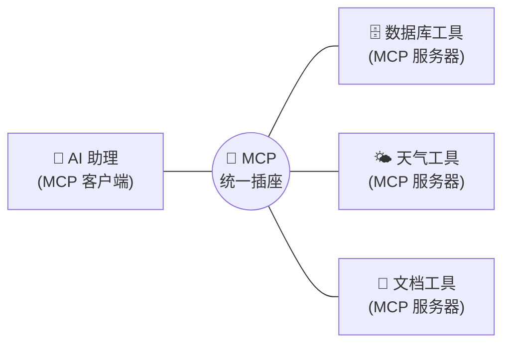
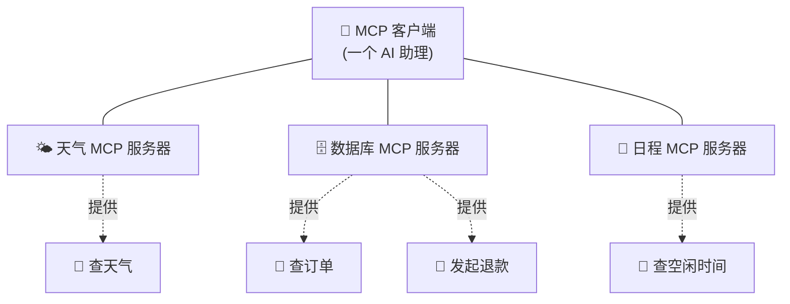
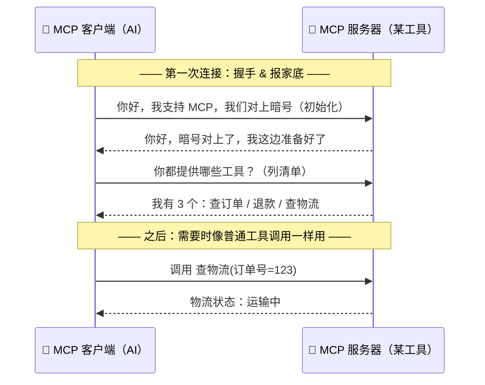
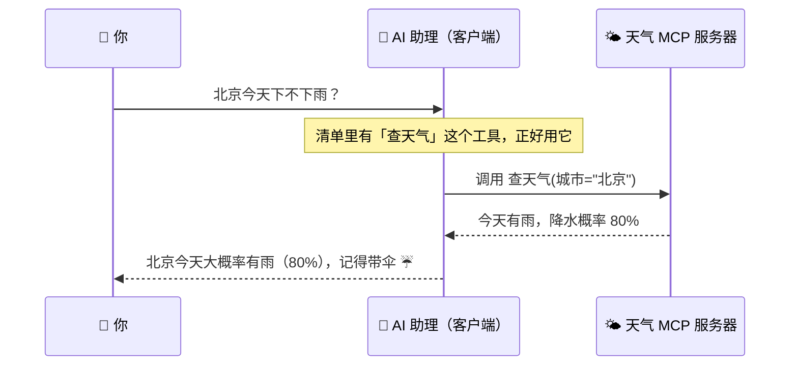
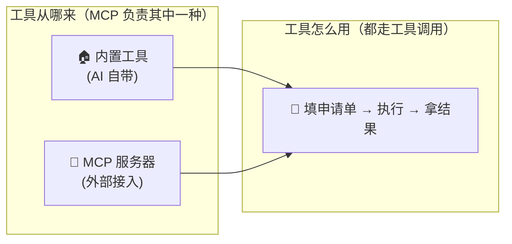

# ④ 什么是 MCP（模型上下文协议）

> 建议先读 [② 工具调用](./[CONCEPT-02]%20什么是ToolCalling-工具调用.md) 和 [③ 工具循环](./[CONCEPT-03]%20什么是ToolLoop-工具循环.md)。这一篇讲：怎么给 AI **标准化地插上新工具**。

MCP 全称 **Model Context Protocol（模型上下文协议）**。名字听着吓人，其实概念很简单——**它就是"给 AI 接工具"这件事的统一标准**。

读完这一篇，你会彻底搞懂三件事：MCP 到底是什么、它解决了谁的痛、它和你已经学过的"工具调用/工具循环"怎么配合。

---

## 一、一句话定义

**MCP = 一个统一的"插座标准"，让任何人做的工具/数据源，都能用同一种方式插到 AI 助理上，即插即用。**

再说得直白一点：**MCP 不是某个软件、也不是某个网站，它是一份"大家都同意遵守的对接规矩"。** 就像"USB 接口"不是某个具体的 U 盘，而是一份"插头长什么样、几个针脚、怎么通电"的约定。

类比先记住这一个：**USB 接口。** 后面我们还会补几个比喻，帮你从不同角度理解同一件事。

```callout tip|一个类比记一辈子
MCP 就是 AI 世界的 +[USB](一份"插头长什么样、怎么通电"的公共约定，不是某个具体设备)。你不用为每个品牌的 U 盘造一个新插孔——大家都遵守 USB，就能即插即用。MCP 让"任何人做的工具"都能用**同一种方式**插到 AI 上。
```

翻卡自测：想清楚"没有 MCP"和"有 MCP"到底差在哪——

```flip
正面：如果**没有** MCP 这种统一插座，别人做了一个新工具（比如"查天气"），要接到 AI 上会遇到什么麻烦？
---
反面：**每接一个新工具，都得为它单独写一套对接代码**——就像每个品牌的 U 盘都要配一个专属插孔，换个工具就得重新改造 AI。有了 MCP，所有工具都遵守同一份"插头约定"，AI 这边一次性支持这个标准，之后**任何遵守 MCP 的新工具插上就能用**，不用再改 AI 本身。这就是"标准化"省下的巨大成本。
```

---

## 二、先建立直觉：四个生活比喻

一个抽象概念，用多个比喻从不同侧面照一遍，就立体了。MCP 的四个比喻：

| 比喻 | 现实里它长什么样 | 对应到 MCP 是什么 |
|------|------------------|-------------------|
| 🔌 **USB 接口** | 电脑一个 USB 口，鼠标/键盘/U盘/打印机都能插 | AI 一个"标准口"，各种工具都能插上就用 |
| ⚡ **电源插座标准** | 家里插座统一，任何电器插头都能插 | 工具只要"插头合规"，接哪个 AI 都行 |
| 📦 **快递驿站统一接口** | 顺丰/圆通/中通都能放进同一个驿站货架 | 不同厂商的工具都能进同一套"货架"被 AI 取用 |
| 🗣️ **翻译官统一协议** | 两国代表各说各话，翻译官用同一套规则居中传话 | AI 和工具各自实现，MCP 规定它俩"怎么对话" |

这四个比喻讲的其实是同一件事：**把"接口"这件事统一了，接入成本就从"每次定制"降成"照标准插上"。**

> 小提醒：比喻是脚手架，用来爬上去看清楚，不是墙的本身。真正的定义永远以"一句话定义"那节为准。

---

## 三、没有 MCP 之前，痛在哪？（N×M 灾难）

设想每家公司都想给 AI 加工具：A 公司做了"查数据库"的工具，B 公司做了"查天气"的工具，C 公司做了"读公司文档"的工具。同时市面上有好几个不同的 AI 助理。

如果没有统一标准，**每个工具接进每个 AI 的方式都不一样**，就会变成一团乱麻——**N 个 AI × M 个工具 = N×M 种对接**，谁都累死：

```mermaid
flowchart LR
  subgraph 没有统一标准（乱）
    AI1["🤖 AI-1"] --- W1["🗄️ 工具A"]
    AI1 --- W2["🌤️ 工具B"]
    AI1 --- W3["📄 工具C"]
    AI2["🤖 AI-2"] --- W1
    AI2 --- W2
    AI2 --- W3
  end
```

每一根线都要单独定制。工具作者要为"AI-1 怎么接、AI-2 又怎么接"各写一套；AI 作者也要为"工具 A 长这样、工具 B 又长那样"各适配一遍。工具一多、AI 一多，就成了一盘**意大利面条**：牵一发动全身，谁也不敢乱改。

用生活比喻说：这就像**每个电器都配一种独家插头，每面墙都开一种独家插孔**。你买回家的吹风机插不进卧室的插座，得专门找师傅改线——荒不荒唐？现实里没这么荒唐，正是因为大家早就统一了插座标准。

---

## 四、有了 MCP，世界清爽了（N+M）

MCP 规定了一套**大家都遵守的对接格式**。于是分工彻底变了：

- 工具作者只要**按 MCP 标准**把工具做成一个"MCP 服务器"，做一次就行；
- 任何**支持 MCP 的 AI**（叫"MCP 客户端"）就能直接用，不用再单独适配。

对接总量从灾难性的 **N×M** 骤降为清爽的 **N+M**——每个 AI 学一次协议、每个工具实现一次协议，就全通了。



就像电脑只有一个 USB 口，鼠标、键盘、U 盘、打印机都能插上去。**MCP 就是 AI 世界的 USB。**

一句话记牢这节：**MCP 把"接工具"从一对一的定制活，变成了照标准来的插拔活。**

---

## 五、MCP 里的两个角色

只需记住两个词——**客户端**和**服务器**：

| 角色 | 是什么 | 生活比喻 |
|------|--------|----------|
| **MCP 客户端（Client）** | 想使用工具的 AI 宿主一侧（比如 Khy-OS） | 你的电脑（带 USB 口的那台） |
| **MCP 服务器（Server）** | 提供某种能力的一个小程序（查库、读文件、连某个 API…） | U 盘 / 打印机（插上就能用的外设） |

注意一个容易反直觉的点：**这里的"服务器"不一定是机房里那种大机器。** 它可以就是你电脑上跑着的一个小程序，甚至一个脚本。"服务器"在这里是**角色名**——"提供能力的那一方"，跟它跑在哪、大不大没关系。

一个 AI 客户端可以**同时插很多个** MCP 服务器，能力就像插排一样叠加起来：插上"天气服务器"→会查天气；再插上"数据库服务器"→又会查库。**能力是累加的。**



---

## 六、一个 MCP 服务器到底暴露些什么？

很多人以为 MCP 服务器只能提供"工具"，其实它能对外暴露**三类东西**。用"图书馆"来打比方：

| 暴露的东西 | 是什么 | 图书馆比喻 |
|------------|--------|-----------|
| **tools（工具）** | AI 可以**调用去执行动作**的功能（查天气、发退款…） | 图书馆的**服务窗口**：你递单子，它替你办事 |
| **resources（资源）** | AI 可以**读取的数据/内容**（某个文件、某段数据库记录…） | 图书馆的**书架**：你去取来读，但不改动它 |
| **prompts（提示模板）** | 预先写好的**提问/任务模板**，帮 AI 更好地干某类活 | 图书馆的**导览手册**：教你"这类问题一般这么查" |

对新手来说，**先牢牢抓住 tools 这一类就够用了**——它和你上一篇学的[工具调用](./[CONCEPT-02]%20什么是ToolCalling-工具调用.md)是同一回事。resources 和 prompts 属于进阶，知道"MCP 服务器不止能给工具，还能给数据和模板"即可。

---

## 七、它们之间是怎么"对话"的？（握手 → 用起来）

MCP 客户端和服务器之间用**统一协议**说话。第一次连上时有个"打招呼"的过程，之后就照常用。看这张时序图：



拆开看两个阶段：

1. **握手 + 报家底**：AI 一连上服务器，先对暗号确认"我俩说同一套协议"，然后问"你都有啥工具/资源/模板？"服务器回一份**清单**。这一步 AI 才知道自己"多了哪些能力"。
2. **正常使用**：真要干活时，AI 就挑一个工具、填好参数发过去，服务器执行完把结果送回来。

看出来了吗？**第 2 步对 AI 来说，和调用内置工具几乎一模一样**——都是[工具调用](./[CONCEPT-02]%20什么是ToolCalling-工具调用.md)那套"填申请单 → 拿结果"。MCP 真正的贡献在**第 1 步**：它规定了"工具**怎么标准地被发现、被接进来**"。

---

## 八、动手小实验（思想实验）：给助理插一个"天气"服务器

不用真写代码，跟着脑补一遍，你就懂了 MCP 的价值。

**实验前**：你的 AI 助理只会读写文件、跑命令。你问它"北京今天下不下雨？"——它只能凭训练时的旧知识猜，或者干脆说"我查不了实时天气"。它没有"手"能伸到天气数据那里。

**动手一步**：你找到（或自己做）一个"天气查询 MCP 服务器"，在配置里把它**插上**。

**实验后**：AI 一连上就走了第七节那套握手——问"你有啥？"，天气服务器回"我有一个工具叫 `查天气(城市)`"。**从这一刻起，AI 的工具清单里就多了一项查天气的能力。** 你再问"北京今天下不下雨？"：



把"插上就多一项能力"这一刻演成一幕小短剧——注意 AI 的本体、代码、脑子**一个字都没改**，它只是"多插了个外设"：

```scene 给助理插一个"天气"服务器的现场
> 实验前：AI 助理只会读写文件、跑命令，没有"手"能碰到实时天气。
🧑 你 | 北京今天下不下雨？
🤖 AI 助理 | 抱歉，我查不了实时天气……我的工具清单里没有这一项。
> 于是你找来一个"天气查询 MCP 服务器"，在配置里把它 +[插上](像插 U 盘一样，不改 AI 本体，只在配置里加一条)。
🤖 AI 助理 | （连上服务器，握手）你好，我支持 MCP，你都提供哪些工具？
🌤️ 天气服务器 | 你好，我有一个工具：`查天气(城市)`。
> 就在这一刻，AI 的工具清单里凭空多了一项能力。你再问同一个问题——
🧑 你 | 北京今天下不下雨？
🤖 AI 助理 | 清单里有「查天气」了！（调用它）北京今天大概率有雨（80%），记得带伞 ☔
> 你没有重新训练 AI，也没改它的核心代码——插上就多能力，拔掉就消失，这就是 MCP 的即插即用。
```

**关键领悟**：你**没有重新训练 AI，也没有改 AI 的核心代码**，只是"插了个外设"，它就凭空多了一项能力。拔掉这个服务器，能力又消失。这种"插上就多能力、拔掉就少能力"的即插即用体验，正是 MCP 想给你的。

---

## 九、常见误区（❌ / ✅）

新手最容易在这几处翻车，逐条纠正：

- ❌ **"MCP 是某个具体的软件/App，下载安装它就行。"**
  ✅ MCP 是一份**协议（约定/规矩）**，不是软件。就像"USB"不是某个 U 盘，而是插头标准。你安装的是"某个 MCP 服务器程序"，它**遵守** MCP，但它本身不叫 MCP。

- ❌ **"MCP 一定要联网，得像 HTTP 那样走网络才行。"**
  ✅ MCP 只规定"两边怎么对话"，**不规定必须走网络**。很多 MCP 服务器就跑在你**本机**，客户端和它通过本地通道说话，全程不联网也成立。联网只是其中一种传输方式，不是前提。

- ❌ **"以后所有工具调用都必须走 MCP。"**
  ✅ 不必。AI 的**内置工具**（自带的读写文件、跑命令等）**根本不走 MCP**，直接就能用。MCP 是给"**第三方/外部**工具"提供的一条标准接入通道。内置工具是"自带的手"，MCP 是"再插外设的口"，两者并存。

- ❌ **"MCP 和工具调用是竞争关系，二选一。"**
  ✅ 它俩**不是一个层面的东西**，不冲突（详见下一节）。MCP 管"工具从哪来"，工具调用管"工具怎么用"。是搭档，不是对手。

- ❌ **"一个 MCP 服务器只能提供一个工具。"**
  ✅ 一个服务器可以一次性暴露**很多个** tools，外加 resources 和 prompts。就像一个 U 盘里能放很多文件。

---

## 十、MCP 和"工具调用"到底什么关系？（正交，不冲突）

这是全篇最该记住的一节。一句话理清：

- **工具调用（Tool Calling）**：AI **用**一个工具的动作——"怎么用"（伸手、填申请单、拿结果）。
- **MCP**：一种**把外部工具标准接进来**的协议——"工具从哪来"（插座、接入的规矩）。

它俩是**正交**的：一个管来源，一个管使用，各管一段，谁也不替代谁。



看这张图就通透了：**不管工具是"自带的"还是"经 MCP 插进来的"，最终用起来都走同一套[工具调用](./[CONCEPT-02]%20什么是ToolCalling-工具调用.md)。** MCP 只是在"来源"那一栏多提供了一条标准通道。

顺带把[工具循环](./[CONCEPT-03]%20什么是ToolLoop-工具循环.md)也串进来：真实任务里，AI 会一步步地反复调用工具直到目标完成（那就是工具循环）。这些被反复调用的工具，**有些是内置的，有些就是从 MCP 服务器来的**——在循环眼里它们没区别，都是"清单上的一个工具"。所以三者的关系是：

> **MCP（工具从哪来） → 工具调用（一次怎么用） → 工具循环（多次自动接力）。**
> 一条清晰的链，各司其职。

```quiz
Q: MCP 和"工具调用"是什么关系？
- [ ] MCP 是工具调用的升级版，会取代它
- [x] 两者正交：MCP 管"工具从哪来"，工具调用管"一次怎么用"
- [ ] 它俩是同一个东西的两个名字
- [ ] 有了 MCP 就不需要工具调用了
> 记住那条链：MCP（来源）→ 工具调用（使用）→ 工具循环（接力）。不管工具是内置的还是经 MCP 插进来的，用起来都走同一套工具调用——MCP 只是在"来源"那栏多提供一条标准通道。
```

---

## 十一、为什么 MCP 对你的项目重要？

因为它让你的 AI 助理**可扩展、可组合**：

- 想让它会查你自己的数据库？做一个 MCP 服务器，插上。
- 想让它会操作某个内部系统？做一个 MCP 服务器，插上。
- 想临时试一个新能力？插上试，不合适就拔掉，**不动 AI 本体**。

这就是"标准化"的威力：**一次约定，处处复用。** 工具作者做一次就能被所有支持 MCP 的 AI 用；AI 支持一次协议，就能用上整个生态里的工具。生态越大，你的助理"能插的外设"就越多。

---

## 十二、和 Khy-OS 的关系

Khy-OS 作为一个 Agent 平台，可以**作为 MCP 客户端**去接入外部 MCP 服务器，从而在不改核心的情况下扩展能力——把别人做好的工具"插上就用"。

同时，Khy-OS 自身也**内置了一批工具**（读写文件、跑命令、搜索代码、抓网页等）。这些内置工具**不走 MCP**，是它"自带的手"；MCP 则是它"再插外设的口"。两者并存、互不干扰：

- **自带的手**（内置工具）：开箱即用，直接调用。
- **外插的口**（MCP 接入）：按需扩展，插拔灵活。

想深入看这些工具与接入机制在代码里长什么样，可以顺着设计文档往下读（参见 [`docs/03_DESIGN_设计`](../03_DESIGN_设计)）。本篇属于概念入门，重点是让你**先建立"MCP = 标准接口"的心智模型**，不需要记具体函数名。

---

## 十三、小结 + 下一步

- **MCP = AI 世界的 USB 插座标准**，让工具即插即用；它是**协议/约定**，不是软件、也不强制联网。
- 记住四个比喻同指一件事：**USB 口 / 电源插座 / 快递驿站 / 翻译官协议**——都在说"把接口统一了"。
- 两个角色：**客户端（AI）** 插 **服务器（工具）**；一个服务器可暴露 **tools / resources / prompts**，能力可叠加。
- 没有标准时是灾难的 **N×M** 定制；有了 MCP 变成清爽的 **N+M**。
- MCP 和[工具调用](./[CONCEPT-02]%20什么是ToolCalling-工具调用.md)**正交**：MCP 管"工具从哪来"，工具调用管"怎么用"，[工具循环](./[CONCEPT-03]%20什么是ToolLoop-工具循环.md)管"多次接力"。内置工具不走 MCP 也能用。
- 在 Khy-OS 里：内置工具是"自带的手"，MCP 是"再插外设的口"，并存互补。

工具的"来源/接入"讲完了。最后一个概念，讲怎么把**一整套做事套路**打包起来复用——**Skill（技能）**。

👉 [⑤ 什么是 Skill（技能）](./[CONCEPT-05]%20什么是Skill-技能.md)
