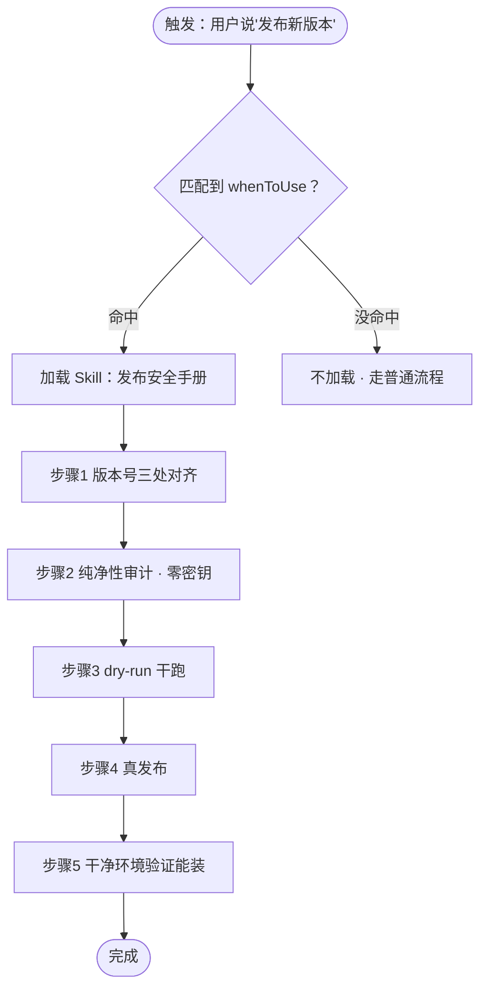
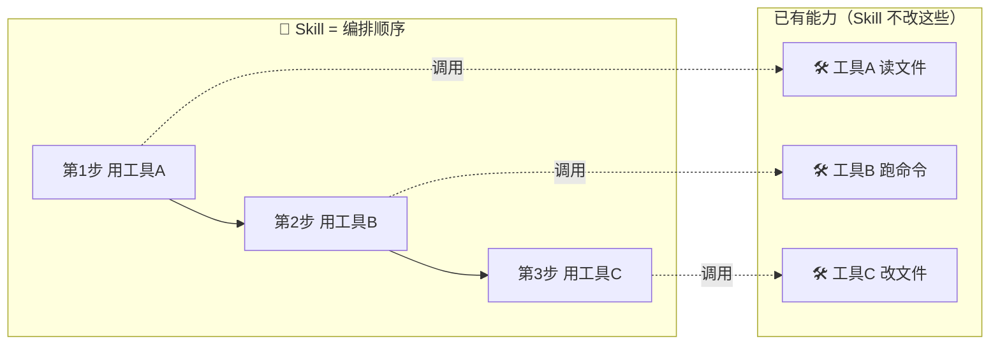
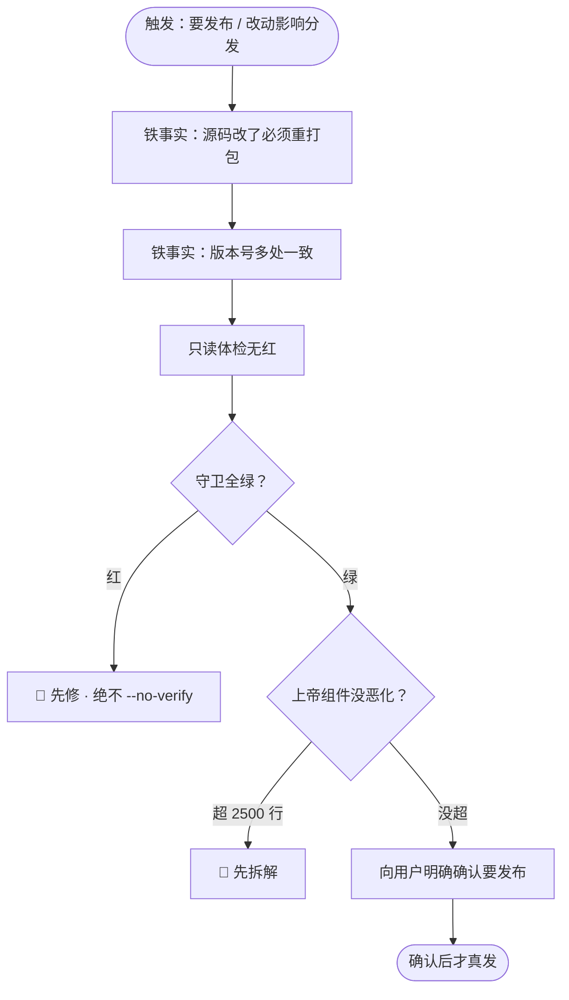
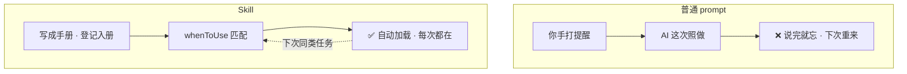
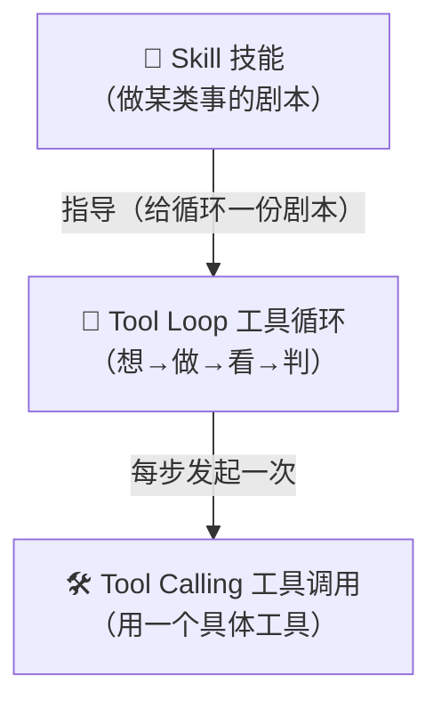
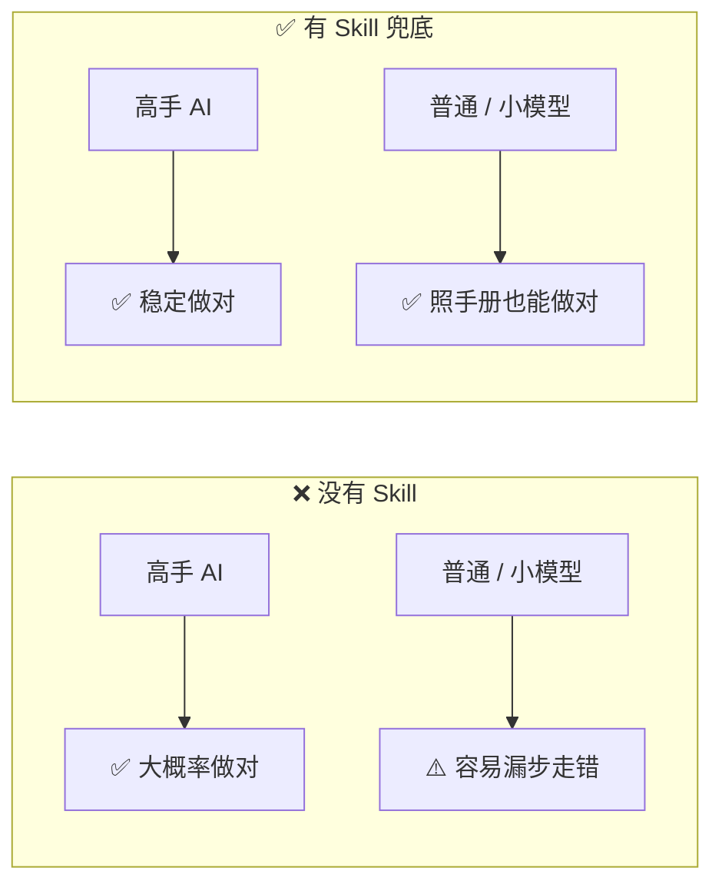
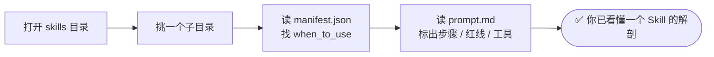
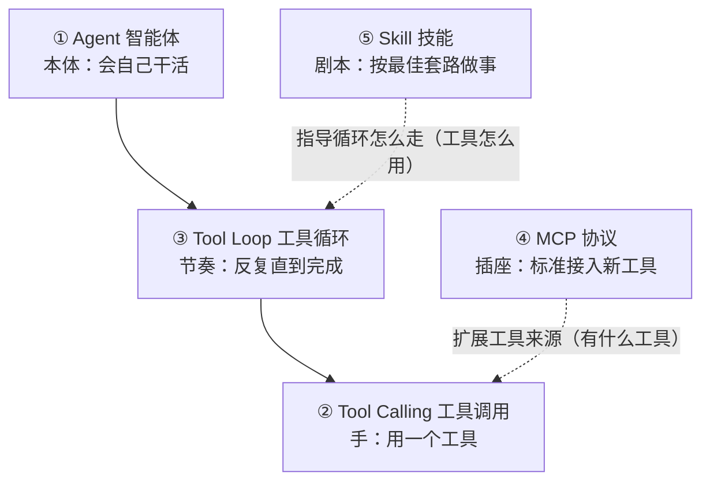

# ⑤ 什么是 Skill（技能）

> 这是概念系列的**最后一篇**。建议先按顺序读完前四篇——[① Agent 智能体](./[CONCEPT-01]%20什么是Agent-智能体.md)、[② Tool Calling 工具调用](./[CONCEPT-02]%20什么是ToolCalling-工具调用.md)、[③ Tool Loop 工具循环](./[CONCEPT-03]%20什么是ToolLoop-工具循环.md)、[④ MCP 模型上下文协议](./[CONCEPT-04]%20什么是MCP-模型上下文协议.md)——因为 Skill 是**站在它们肩膀上**的东西。前四篇讲"AI 有哪些零件、怎么动起来"；这一篇讲：怎么把"一套固定的做事套路"打包成 AI 能一键调用的**技能**，让它每次都按专家水平做事。

---

## 一、一句话定义

**Skill（技能）= 把"做某一类事情的标准套路（什么时候用 + 分几步 + 用哪些工具 + 哪些红线）"写成一份手册，打包登记好，让 AI 需要时自动照着做。**

一次说不清？换四个生活比喻，从四个角度看同一件事：

| 比喻 | Skill 对应的是什么 | 关键点 |
|------|--------------------|--------|
| **新员工操作手册** | 老员工把"怎么正确干这件事"写下来交给新人 | 新人不用聪明，照做就不出错 |
| **菜谱** | "红烧肉"的固定做法：先焯水、再上色、后炖煮 | 步骤、火候、放什么料，全写死 |
| **乐谱** | 一首曲子的音符和节奏 | 谁来弹，都按同一份谱，不会跑调 |
| **手术清单（checklist）** | 手术前"核对病人、核对部位、清点纱布"的逐项打勾 | **靠打勾而不是靠记忆**，漏一项就停 |
| **装修施工图** | 水电走线、承重墙位置都标好 | 施工队照图施工，不会砸错墙 |

这五个比喻的**共同内核**：把"专家脑子里那套经验"从个人身上取出来，**固化成一份谁都能照做的剧本**。这就是 Skill。

> ⚠️ 特别记住那条**手术清单**的比喻——它点出了 Skill 最重要的价值：**不是让人变聪明，而是让人靠"逐项核对"而不是"靠脑子记"来避免犯错。** 后面讲"对小模型友好"时，这条会反复回来。

```callout star|划重点
Skill 的魔力不是"让 AI 更聪明"，而是把 +[专家的套路](什么时候用 + 分几步 + 用哪些工具 + 哪些红线) 固化成一份剧本，让**再普通的 AI（甚至小模型）照着做也不容易出错**。这跟你的项目纪律是同一个思路：靠核对，不靠记忆。
```

```flip
🤔 Skill 和你随手打的一句"帮我发个版"有什么本质区别？
---
📋 一句性指令说完就忘，每次都要重讲、还可能漏步骤；Skill 是**打包登记**好的手册——写清"什么时候该用它、分几步、哪些红线不能碰"，AI 需要时**自动**照着做，稳定可复用。
```

---

## 二、为什么需要 Skill？

因为有些事情，**每次做法都差不多**，但细节很多、容易漏、顺序不能错。与其每次都靠 AI"临场发挥、现场想"，不如把正确套路**沉淀下来**，保证每次都按最佳方式做。

举个 Khy-OS 里真实存在的例子——"**安全地发布一个新版本**"这件事，套路是固定的：

1. 三个渠道的版本号要改成一致（历史上真的出过版本号对不齐的事故）；
2. 跑纯净性审计，确认没把密钥打进包；
3. 先干跑（dry-run）再真发；
4. 发完要装到一个干净环境验证能装上；
5. 发布前先备份、心里过一遍回退路径。

这套流程如果每次都靠 AI 现想，**迟早有一天会漏一步**——而发布是**不可逆的外向动作**，漏一步可能就是线上事故。把它写死在一份"发布安全技能"里，AI 每次发布就照着做，**不会漏步、不会走错顺序**。



注意上图开头那个**菱形判断**：Skill 不是"永远都在生效"，而是**先看这次任务匹不匹配它的触发条件**，匹配上了才加载。这一点很关键，第八节"常见误区"会专门讲。

---

## 三、一个 Skill 里通常有什么？

一份 Skill 手册，通常由这四块组成（对照菜谱来记）：

| 组成 | 作用 | 菜谱比喻 |
|------|------|----------|
| **什么时候用（触发条件 / whenToUse）** | 告诉 AI 遇到哪类任务该拿出这份手册 | 封面写着"这是**红烧肉**的菜谱"——做红烧肉才翻它 |
| **步骤（流程）** | 一步步该做什么、按什么顺序 | 先焯水、再上色、后炖煮 |
| **要用的工具** | 这套流程会用到哪些[工具调用](./[CONCEPT-02]%20什么是ToolCalling-工具调用.md) | 需要锅、铲、酱油 |
| **红线 / 注意事项** | 绝对不能做的事 | 别放糖太多、别烧干、别用铁锅炒酸的 |

所以 Skill **不是一种新的"能力零件"**。它没有给 AI 增加任何新的底层本领——它是**把已有能力（[工具](./[CONCEPT-02]%20什么是ToolCalling-工具调用.md) + [循环](./[CONCEPT-03]%20什么是ToolLoop-工具循环.md)）按最佳顺序编排好的剧本**。

打个比方：会用刀、会用锅、会开火，这些是**能力**（工具）；"红烧肉先焯水再炖"这套顺序，是**Skill**。Skill 不给你多长一只手，它教你已有的手该按什么顺序动。



---

## 四、解剖一个真实 Skill：`khy-release-safety`

光讲抽象结构不够，我们**真的拆开一个** Khy-OS 里存在的 Skill 看看。它就在 [`docs/AI协作预设包/skills/khy-release-safety`](../AI协作预设包/skills/khy-release-safety) 目录里，由两个文件组成：一个 `manifest.json`（登记表：告诉系统"我是谁、什么时候该用我"），一个 `prompt.md`（正文：具体怎么做）。

### 4.1 登记表 `manifest.json`——"什么时候用"写在这里

```json
{
  "name": "khy-release-safety",
  "description": "Khy-OS 发布前自保清单：pip 是唯一命脉……准备发布 pip 包、或改动可能影响分发时激活，按最小闭环逐项确认。",
  "user_invocable": true,
  "trigger": "/khy-release-safety",
  "when_to_use": "准备打包发布 pip、或不确定改动能否安全发布时。"
}
```

看这几个字段——它们正好对应上一节表格里的"**什么时候用**"：

- `when_to_use`：**这就是触发条件**。它明确写着"准备打包发布 pip、或不确定改动能否安全发布时"。AI 遇到发布类任务，才会把这份手册拿出来。
- `trigger` / `user_invocable`：用户也可以**手动**打 `/khy-release-safety` 主动把它叫出来。
- `description`：一句话自我介绍，帮系统在众多 Skill 里挑对的那一份。

### 4.2 正文 `prompt.md`——"步骤 + 红线"写在这里

正文把"发布安全"这套专家经验拆成了几块（这里是真实内容的走查）：

**① 铁事实（先记住的前提）**
- 改了仓库源码，pip 用户拿不到——除非重新打包发版；
- 版本号要多处一致，别只改一处。

**② 发布最小闭环（按顺序，红就停）**——这就是**步骤**：
- 只读体检无红 → 守卫全绿 → 上帝组件没恶化（单文件 ≤2500 行）。

**③ 绝对不要（红线）**——这就是**注意事项**：
- ❌ 守卫红了硬发；
- ❌ 用 `--no-verify` 跳过钩子；
- ❌ 没重打包就以为 pip 用户拿到了新改动；
- ❌ 只改一处版本号就发。

**④ 发布是不可逆的外向动作**——发布前必须明确向用户确认，得到点头再执行。

把这份手册画成流程，就是一条清清楚楚的"施工图"：



对照这张图，你会发现：**一份好的 Skill，其实就是把一张"红了就停"的施工图，用文字固定下来。** 谁来执行——高手 AI、普通 AI、还是照着做的新人——走的都是同一条路，红灯都会在同一处亮。

---

## 五、Skill 和"普通 prompt（一次性指令）"有什么不同？

这是最容易混淆的一点。你可能会想："我每次发布前，自己敲一段话提醒 AI'记得对齐版本号、别把密钥打进包'，不也一样吗？"

不一样。区别在于**可复用、被登记、需要时自动加载**：

| 维度 | 普通 prompt（一次性指令） | Skill（技能） |
|------|--------------------------|---------------|
| **寿命** | 说完就过去了，下次要重说 | **写一次，永久留存** |
| **谁记得** | 靠你（人）每次记得敲 | 系统**登记**在册，AI 自己会想起 |
| **怎么触发** | 你手动打字 | 匹配 `whenToUse` **自动加载**（也可手动叫） |
| **一致性** | 你今天敲的和上周敲的可能不一样 | 每次都是**同一份**，不会走样 |
| **本质** | 一句话 | 一套**结构化手册**（触发+步骤+工具+红线） |

一句话概括：**普通 prompt 是"这次你帮我记着点"；Skill 是"以后这类事都照这本手册做，不用我再提醒"。**



所以：**如果一件事你只做一次，用普通 prompt 就够了；如果一件事会反复做、且做错代价高，就该把它沉淀成 Skill。**

```quiz
Q: 下面哪种情况最值得沉淀成一个 Skill？
- [ ] 你只想问一次"今天天气怎么样"
- [x] "发布上线"这种会反复做、步骤多、做错代价高的事
- [ ] 一句话就能说清、也只做一次的小事
- [ ] 随口让 AI 改一个错别字
> Skill 的性价比来自"反复用 + 做错代价高"。一次性的小事用普通 prompt 就够了；越是高频、多步、易错的流程，写成带红线的 checklist 越划算——让 AI 靠核对而不是靠记忆。
```

---

## 六、Skill 和前面几个概念的关系

这是理解 Skill 的关键，务必看这张图：



- [工具调用](./[CONCEPT-02]%20什么是ToolCalling-工具调用.md) 是**单个动作**（用一次锅）；
- [工具循环](./[CONCEPT-03]%20什么是ToolLoop-工具循环.md) 是**反复做动作直到完成**（一直炒到熟）；
- **Skill 是给这个循环一份"该按什么套路做"的剧本**（先焯水再炖的菜谱）。

一句话：**Skill 让 Agent 的循环变得"有章法"，而不是每次从零乱试。**

没有 Skill，循环也能转——但它是**摸着石头过河**：试一步、看一步、再想下一步。有了 Skill，循环手里就多了一张**地图**：知道下一步该干嘛、哪里有坑。两者不冲突，Skill 是循环的"导航"，不是循环的替代品。

---

## 七、Skill 对新手 / 小模型特别友好

这是 Skill 一个很实在的价值：**降低对"聪明程度"的依赖。**

回到第一节那个**手术清单**的比喻——顶尖外科医生也用清单，不是因为他记不住，而是因为**"靠核对"比"靠记忆"更可靠**。Skill 对 AI 是一样的道理：

- 一个**很聪明**的 AI，也许不用手册也能把发布做对；
- 但一个**普通**的 AI（或新手工程师）就容易漏步、搞错顺序；
- 而**同一个**聪明 AI，在累了、上下文很长、被别的事分心时，**也会漏**。

有了 Skill，就等于把"专家的经验"写进了手册，**让普通选手也能打出专家水平，让高手在状态不好时也不翻车**。



这正是 Khy-OS 反复强调的核心理念之一：为**弱智用户 / 小模型兜底**——把正确套路固化下来，**谁来都不容易出错**。Skill 是这个理念最直接的载体：它把工程纪律从"需要理解才能遵守"变成"照着打勾就能遵守"。

把"靠核对、不靠记忆"演成一幕小短剧。同一件"发布上线"的活，看有没有那份手册差在哪：

```scene 同一份发布手册：谁来都不容易翻车
> 场景一：没有 Skill，全靠 AI 临场发挥。
🤖 小模型 | 发布嘛……版本号我改了 pip 这处，应该够了吧？直接发！
😱 线上 | 💥 npm 那处版本号没对齐，双渠道版本分裂，事故了。
> 场景二：给它一份"发布安全"Skill——一张"红了就停"的施工图。
📋 发布手册 | 第①步：三处版本号对齐。第②步：纯净性审计，零密钥。第③步：dry-run 干跑。第④步：真发。第⑤步：干净环境验证能装。
🤖 小模型 | 那我照着 +[逐项打勾](靠核对而不是靠记忆——这正是"手术清单"的精髓)：①版本三处对齐✅ ②审计零密钥✅ ③干跑✅ ④真发✅ ⑤验证能装✅
🎉 线上 | 稳稳上线，一步没漏。
> 就算换成状态最好的高手 AI，走的也是同一条路、红灯亮在同一处——Skill 让普通选手打出专家水平，也让高手在累了、分心时不翻车。
```

---

## 八、常见误区（照着避坑）

新手对 Skill 最容易踩的几个坑，逐条对照：

**误区 1：以为 Skill 是一种"新的底层能力"**
- ❌ "装了这个 Skill，AI 就多了一项它本来不会的本事。"
- ✅ Skill **不增加任何底层能力**，它只是**把已有工具按最佳顺序编排**。会用刀会用锅是能力，"先焯水再炖"是 Skill。

**误区 2：以为 Skill 就是一个函数 / 一段代码**
- ❌ "Skill 是不是就是调一个 `release()` 函数？"
- ✅ Skill 更像**一份写给 AI 看的手册（自然语言 + 结构）**，它指导 AI 在[循环](./[CONCEPT-03]%20什么是ToolLoop-工具循环.md)里**依次发起多个工具调用**并在中间做判断，不是一次调用就返回结果的函数。

**误区 3：以为"写了 Skill 就一定会被用上"**
- ❌ "我加了个 Skill，AI 怎么没按它做？"
- ✅ Skill 要**匹配 `whenToUse` 才会被加载**（回看第二节流程图开头那个菱形判断）。触发条件没写清、或这次任务对不上，它就**静静躺着不被激活**。写 Skill，`whenToUse` 和写步骤一样重要。

**误区 4：以为 Skill 和 [MCP](./[CONCEPT-04]%20什么是MCP-模型上下文协议.md) 是一回事**
- ❌ "Skill 和 MCP 不都是给 AI 加东西吗？"
- ✅ 两者层次完全不同：**MCP 是"插座"，负责把新工具接进来（扩展 AI 有哪些工具）**；**Skill 是"剧本"，负责教 AI 已有工具该按什么顺序用**。一个管"有什么工具"，一个管"工具怎么用"。

**误区 5：以为 Skill 越多越好、把所有话都塞进去**
- ❌ "我把发布、排障、上手全写进一个超大 Skill。"
- ✅ Skill 应该**一个技能管一类事**（一份菜谱只教一道菜）。混在一起会导致 `whenToUse` 模糊、该触发时触发不准。看 Khy-OS 的做法：发布、安全改动、排障各自独立成一个 Skill。

---

## 九、动手小实验 / 思想实验

看懂了不算会，**打开真东西摸一摸**才算。下面两个小任务，不需要写代码，只需要"读"：

### 实验 A：拆开一个真实 Skill 的结构（10 分钟）

1. 打开目录 [`docs/AI协作预设包/skills`](../AI协作预设包/skills)，你会看到一排子目录，**每个子目录就是一个 Skill**。
2. 随便挑一个，比如 [`khy-troubleshoot`](../AI协作预设包/skills/khy-troubleshoot)（排障）或 [`khy-onboarding`](../AI协作预设包/skills/khy-onboarding)（新人上手），进去看。
3. 找到里面的 `manifest.json`，读它的 `when_to_use` 字段——**这就是这份手册"什么时候被拿出来用"**。
4. 再读 `prompt.md`，用第三节那张表去对照：哪几段是**步骤**？哪几段是**红线（绝对不要）**？哪里提到了要用的**工具**？



### 实验 B：思想实验——把你自己的一件事写成 Skill（不用真写文件）

在脑子里（或纸上）想：**你反复做、且做错很烦的一件事**是什么？比如"每次改完代码提交前的检查"。试着用四块结构把它写出来：

- **什么时候用**：改完代码、准备提交时。
- **步骤**：跑测试 → 看有没有红 → 确认没提交多余文件 → 写清楚 commit 说明。
- **要用的工具**：跑测试的命令、看 diff 的命令。
- **红线**：❌ 测试红了硬提交；❌ 把密钥 / 临时文件提交进去。

写完你会发现——**你刚刚就设计了一个 Skill**。这正是 Khy-OS 里那些 `khy-*` 手册诞生的方式：把工程师脑子里的经验，固化成谁都能照做的剧本。

---

## 十、和 Khy-OS 的关系（有真实例子可看）

Khy-OS 里已经有一批真实的 Skill，就放在这个目录：

- [`docs/AI协作预设包/skills`](../AI协作预设包/skills)

打开看看，每个子目录就是一个技能，这是当前**真实存在**的一批：

| Skill 目录 | 管的是哪类事 | 对应 Khy-OS 纪律 |
|-----------|--------------|------------------|
| [`khy-release-safety`](../AI协作预设包/skills/khy-release-safety) | 发布安全（本文的解剖对象） | 红线：密钥不入包、版本三处一致 |
| [`khy-safe-change`](../AI协作预设包/skills/khy-safe-change) | 安全改动（外科手术式改动的套路） | 章程 B3：只动该动的 |
| [`khy-honest-closure`](../AI协作预设包/skills/khy-honest-closure) | 诚实收尾（没验证过不许说做完） | 章程 B2：没跑过验证不许说"修好了" |
| [`khy-onboarding`](../AI协作预设包/skills/khy-onboarding) | 新人上手 | 先读 `.ai/`、看懂再动手 |
| [`khy-pick-task`](../AI协作预设包/skills/khy-pick-task) | 挑任务 / 定优先级 | 目标驱动、先列 plan |
| [`khy-troubleshoot`](../AI协作预设包/skills/khy-troubleshoot) | 排障套路 | 先定位再动手 |
| [`khy-gateway-fix`](../AI协作预设包/skills/khy-gateway-fix) | 网关类问题修复 | 对症的固定排查路径 |
| [`khy-weak-model-guardrails`](../AI协作预设包/skills/khy-weak-model-guardrails) | 给弱模型的护栏 | 直接对应"为小模型兜底"理念 |

这些 Skill 把 Khy-OS 的工程纪律（章程里的 **B1 先想再写 / B2 目标驱动 / B3 外科手术式改动**、以及各条红线）**变成了 AI 可以直接照做的手册**。换句话说：章程是"法律条文"，Skill 是"照着法律办事的操作流程"——前者讲道理，后者能落地。

特别看一眼 [`khy-weak-model-guardrails`](../AI协作预设包/skills/khy-weak-model-guardrails) 这个名字——它几乎是把第七节"为小模型兜底"的理念直接写成了一个 Skill。**这就是 Khy-OS 用 Skill 兑现"让弱智用户 / 小模型也不容易出错"承诺的地方。**

---

## 十一、五个概念，最终合体

恭喜你读到这里！把五个概念拼起来，就是一个完整的 AI 编程助手：



用一个"厨房"的比喻把它们串成一句话：

- **Agent** 是**厨师本人**（会自己张罗一桌菜的身体）；
- **Tool Calling** 是**厨师的手**（拿起某一件炊具做一个动作）；
- **Tool Loop** 是**做菜的节奏**（尝一口、调一下、再尝，直到做好）；
- **MCP** 是**厨房的插座**（能不断插上新的电器 / 新工具）；
- **Skill** 是**菜谱**（每道菜都按最佳顺序做，不靠临场瞎试）。

五者缺一不可：有身体没手做不了事，有手没节奏会乱，有节奏没插座扩展不了能力，有能力没菜谱则每次都在碰运气。**Khy-OS 把这五样都配齐、并且特别用 Skill 给"手不稳的厨师"兜底**——这就是你读完这一整个系列该带走的整体图景。

---

## 十二、下一步去哪

你已经掌握了看懂 AI 编程助手所需的**全部核心概念**。接下来建议：

1. 回到[文档站首页](../index.html)，浏览 Khy-OS 的其它文档，现在你能看懂它们在讲什么了。
2. 想动手实践，去 [`docs/07_OPS_运维`](../07_OPS_运维) 找上手 / 安装类文档；发布相关的权威手册就在那里（`[OPS-MAN-042] 发布手册`）。
3. 想看这些概念的真实代码实现，去 [`docs/03_DESIGN_设计`](../03_DESIGN_设计)。
4. 想真正摸一个 Skill，回到第九节的**实验 A**，打开 [`docs/AI协作预设包/skills`](../AI协作预设包/skills) 挑一个读它的手册结构。

```callout star|恭喜你读完了核心五篇！
到这里，Agent、Tool Calling、Tool Loop、MCP、Skill 这五块地基你已经踩实了 🎉。如果你还想往下挖——比如"前面一直说的**大模型**到底是什么？""它为什么会**忘事**？""它怎么**记住**我给的资料？"——那就顺着**进阶链**继续：先从 [⑥ 什么是 LLM（大语言模型）](./[CONCEPT-06]%20什么是LLM-大语言模型.md) 开始，一路读到 RAG、机器学习、深度学习。
```

👉 继续深入：[⑥ 什么是 LLM（大语言模型）](./[CONCEPT-06]%20什么是LLM-大语言模型.md)　｜　👈 回到 [概念入门总览](./00_INDEX_概念入门-总览.md)
