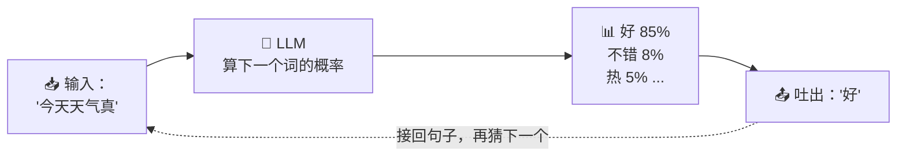
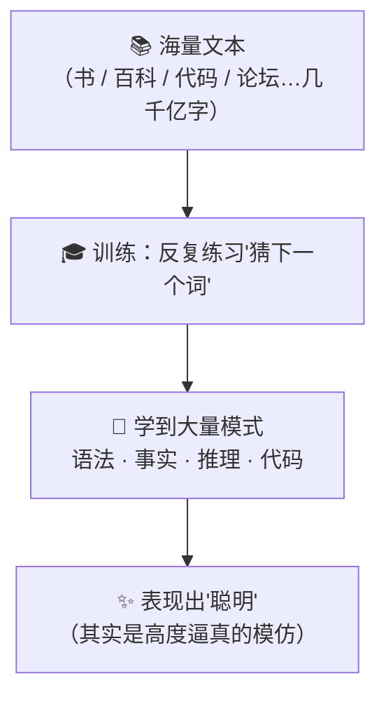
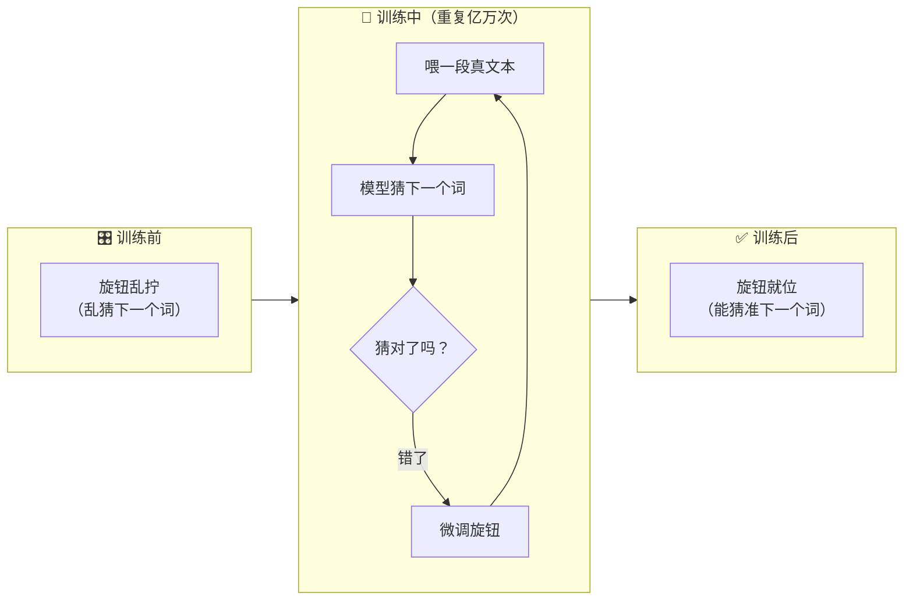
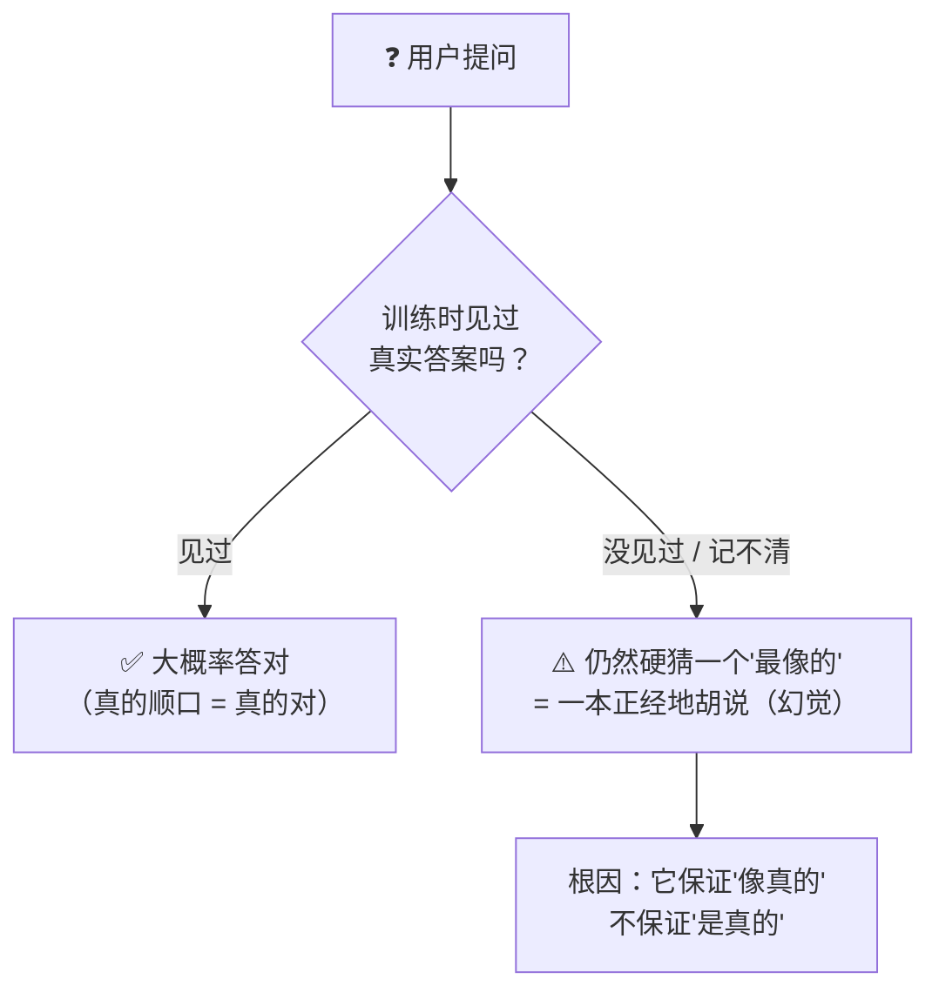
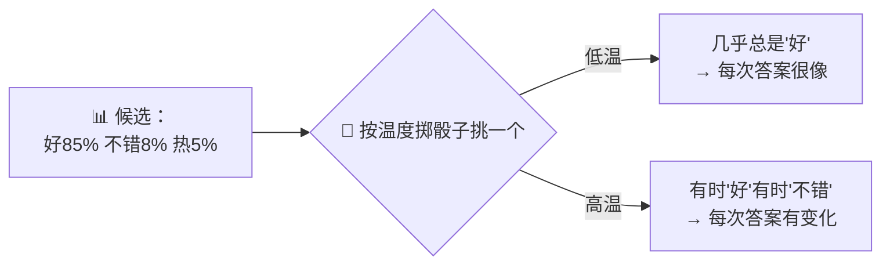
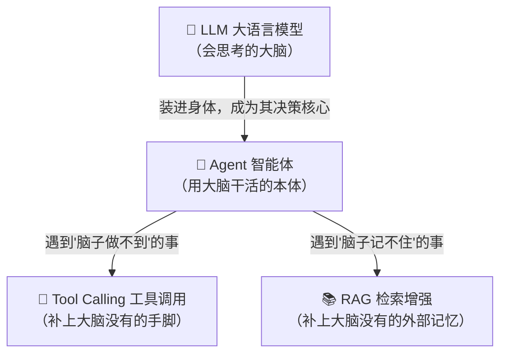

# ⑥ 什么是 LLM（大语言模型）

> 建议先读 [① 什么是 Agent](./[CONCEPT-01]%20什么是Agent-智能体.md)。那一篇讲"会自己干活的 AI"是什么样子；而这一篇要拆开它的**脑子**——那个真正在"思考"的核心，就叫 **LLM（大语言模型）**。读完你会明白：这颗"脑子"其实只会做一件事——**猜下一个词**。也正因为它只会猜，我们才需要给它配"手脚"（[② 工具调用](./[CONCEPT-02]%20什么是ToolCalling-工具调用.md)）来补足它做不到的事。

---

## 一、一句话定义

**LLM（Large Language Model，大语言模型）= 一个吃了海量文本、专门学会"预测下一个词"的超大概率机器。**

如果你只想记住一句话，就记这句：

> **它不是数据库、不是搜索引擎、更不是有意识的人；它是一台"接龙机器"——给它一段话，它猜出最可能的下一个字。**

```callout ask|小白别慌
"大模型"这个词听着高大上，其实它干的事简单到有点好笑：**猜下一个字**。就像你玩 +[成语接龙](你说上句，对方接下句——LLM 就是把这件事练到了极致)一样。别被"几百亿参数""预训练"这些词吓退，这篇会把每个词都拆成生活比喻。跟着读，你会发现它没那么神秘～ 🐣
```
这句话是整篇文档的骨架。后面所有的比喻、图、误区，都是在反复讲透这一句话。请先把三个"它不是"钉在脑子里：

| 你可能以为它是 | 其实它不是，因为 |
|----------------|------------------|
| **数据库** | 数据库是"精确存了什么就查出什么"；LLM 没存原文，它只记住了"模式"，答案是**当场猜出来的** |
| **搜索引擎** | 搜索引擎去互联网找现成网页；LLM **不联网**（除非另配工具），它只凭训练时学到的规律 |
| **有意识的人** | 它没有理解、没有意图、不知道自己在说什么，它只是在做**概率计算** |

---

## 二、核心机理白话版：它只会"接龙"

LLM 做的事，本质上简单到有点让人失望：**给它一段文字，它算出"下一个最可能出现的字/词"，吐出来；然后把这个新字接到句子后面，再算下一个……一个接一个，直到成句成段。**

这个"算一个、接上去、再算下一个"的过程，有个术语叫**自回归生成**（autoregressive）。但你不用记术语，记这几个生活比喻就够了：

- **手机输入法联想**：你打"今天天气真"，输入法弹出"好"。LLM 就是一个**超级加强版的输入法**——它不只联想一个词，而是能一路联想出整段话、整篇文章。
- **填空高手**：给它"床前明月光，疑是地上____"，它填"霜"。它读过海量文本，知道这个空最该填什么。
- **成语接龙**：你说"一心一意"，它接"意气风发"。它永远在做"下一个接什么最顺"的判断。



注意上图那条**虚线回环**：LLM 不是一口气想好整句话，而是**一个词一个词地滚雪球**。它吐出"好"之后，会把"今天天气真好"整个再喂回自己，接着猜下一个字。**它每一步都只看得见"到目前为止的这段话"，然后猜一个字。** 就这么简单，也就这么强大。

---

## 三、为什么"只会猜下一个词"却显得很聪明？

这是最反直觉的地方：一个只会"接龙"的机器，怎么能写代码、答问题、讲道理？

答案是：**因为它是在"海量文本"里学会怎么接龙的。**

想象一个人从小到大读完了**几乎整个互联网**——所有的书、百科、论坛、代码仓库、问答……读了几千亿个字。读到这个量级，他会在不知不觉中掌握大量**模式**：

- 语法规律（"的地得"怎么用、句子怎么组织）；
- 事实关联（"法国的首都是"后面大概率接"巴黎"）；
- 推理套路（看到"因为……所以……"就知道该讲因果）；
- 代码规律（写了 `for (let i = 0;` 后面大概率接 `i < ...`）。

于是，当它为了"猜下一个词"而努力时，**副产品就是它显得懂知识、懂逻辑、懂代码**。它不是"理解"了这些，而是**在无数例子里见过太多次，以至于能高度逼真地模仿**。



> 一句话记住：**它的"聪明"是"见得多"喂出来的，不是"想得通"练出来的。** 这个区别，是理解后面"幻觉"问题的钥匙。

---

## 四、参数、训练、预训练——白话拆解

你会经常听到"这个模型有 700 亿参数""它是预训练出来的"这类话。别被术语吓住，用一个比喻全部拆开。

**把 LLM 想象成一台有无数个旋钮的巨型收音机。**

| 术语 | 白话意思 | 收音机比喻 |
|------|----------|------------|
| **参数（parameter）** | 模型脑子里的"旋钮"，每个旋钮存一点点"该怎么猜词"的经验。参数越多，能装的模式越多 | 收音机上的旋钮数量。旋钮越多，能调出的电台越精细 |
| **训练（training）** | 拿海量文本反复练"猜下一个词"，猜错了就**微调旋钮**，一点点拧到能猜准 | 一遍遍拧旋钮，直到声音最清楚 |
| **预训练（pre-training）** | 最开始那次"读遍整个互联网"的大训练，打下通用语言底子 | 出厂前的总调校，把基础电台都先调好 |

所以"700 亿参数"的意思就是：**这台机器脑子里有 700 亿个旋钮**，训练的过程就是把这 700 亿个旋钮，一点一点拧到"喂进任何一段话都能猜准下一个词"的状态。



**关键直觉**：训练结束后，这些旋钮就**固定住了**。这意味着——模型的知识**停在了训练那一刻**。训练用的是 2024 年的数据，它就不知道 2025 年发生了什么。这也解释了后面误区里"它不会自动知道最新消息"这一条。

---

## 五、幻觉（hallucination）：它会一本正经地胡说

这是 LLM **最重要、也最危险**的特性，必须单独拿出来讲透。

回到第一节的定义：LLM 是一台"猜下一个词、让句子读起来最顺"的机器。请注意——**它优化的目标是"像真的"，不是"是真的"。**

这两者大部分时候是重合的（顺口的答案往往也对），但**不总是重合**。当它不知道真实答案时，它**不会说"我不知道"**，而是会**猜一个读起来最像那么回事的答案**——哪怕这个答案是编的。这就是**幻觉**。

- 你问它一个不存在的函数怎么用，它可能**煞有介事地编出**参数和用法；
- 你问它某本书的某一页写了什么，它可能**编一段听起来很像**的内容；
- 你让它引用文献，它可能**造出一个格式完美、但根本不存在**的出处。



> 记忆口诀：**它不会脸红。** 编造的答案和正确的答案，从它嘴里说出来时**语气一模一样自信**，你光看它的语气分辨不出真假。

**这正是为什么需要工具调用和 RAG。** 既然模型"凭记忆猜"必然会有幻觉，那就别让它凭记忆——

- 让它**用[工具](./[CONCEPT-02]%20什么是ToolCalling-工具调用.md)真的去读文件、跑命令、查网络**，拿到真相再回答（把"闭卷考试"变成"开卷考试"）；
- 让它用 **RAG（检索增强，后面会讲）** 先从可信资料里查到相关内容，再基于查到的内容作答，而不是凭空编。

一句话：**幻觉不是 bug，是这类模型的天性；对付它的办法不是"骂模型"，而是"给它配上能核实的手脚"。**

翻卡自测，看你有没有真的抓住"幻觉"的根子：

```flip
正面：LLM 为什么会"一本正经地胡说"？它是故意骗人吗？
---
反面：**不是故意骗人，是它的训练目标决定的。** 它被训练成"让句子读起来最顺、最像真的"，而不是"保证是真的"。大多数时候顺口的答案恰好也对，但当它不知道真答案时，它**不会说"我不知道"**，而是照样猜一个"最像那么回事"的答案——语气和说真话时一样自信。所以幻觉不是 bug，是天性；解药是给它配上能**核实**的工具（工具调用 / RAG）。
```


---

## 六、温度 / 随机性：为什么同一个问题答案会变

你可能注意到：同一个问题问两次，LLM 的回答**措辞会略有不同**。这不是它"记不住"，而是**故意设计成带一点随机的**。

回到第二节那张概率图：模型每一步算出的不是"唯一答案"，而是一串**候选词的概率**（好 85%、不错 8%、热 5%……）。接下来怎么从这串候选里挑一个，由一个叫 **温度（temperature）** 的旋钮控制：

| 温度 | 挑词方式 | 效果 | 生活比喻 |
|------|----------|------|----------|
| **低温（接近 0）** | 几乎总挑概率最高的那个 | 稳定、保守、几乎每次一样 | 老实人：怎么稳怎么来 |
| **高温** | 偶尔也挑排第二第三的词 | 多变、有创意、每次不太一样 | 爱发挥的人：换着花样说 |

因为通常温度不为零，所以模型每次挑词**掺了一点掷骰子的成分**，于是同一个问题，两次回答的用词、顺序就会有细微差别。**意思往往一样，但不是一字不差。**



> 记住这一点，第八节的**动手小实验**就是让你亲眼看见这种"每次略有不同"。

---

## 七、常见误区（新手最容易踩的坑）

这一节请务必逐条读完。这些误解会让你对整个系统的理解跑偏。

### 误区 1：以为它在"联网实时查"

- ❌ **错误理解**：我一问它，它就上网搜了一下再回答。
- ✅ **正确理解**：光秃秃的 LLM **不联网**。它的回答全凭训练时"背下来"的东西。它能联网，**是因为外面给它配了[工具](./[CONCEPT-02]%20什么是ToolCalling-工具调用.md)（比如网页搜索工具）**——那是工具调用的功劳，不是 LLM 本身的能力。

### 误区 2：以为它"记得住"你之前说的话

- ❌ **错误理解**：我上周跟它聊过，它应该记得我。
- ✅ **正确理解**：LLM 本身**没有记忆**。它每次回答，只能看见"这一次喂给它的那段文字"。之所以在一次对话里它"记得"你前面说的话，是因为**系统每次都把之前的对话历史一起重新喂给它**。关掉对话，这份"记忆"就没了。它更像**每次都失忆、全靠你把笔记重新递给他看**的人。

### 误区 3：以为它算数很准

- ❌ **错误理解**：它这么聪明，`3847 × 2913` 肯定算得对。
- ✅ **正确理解**：它不是计算器，它是**"猜下一个数字看起来对不对"**。对于没见过的大数运算，它可能猜出一个**很像但错误**的结果。真要算准，得给它配一个**计算工具**——又回到"给脑子配手脚"这件事上。

### 误区 4：以为它"懂"了你说的意思

- ❌ **错误理解**：它回答得头头是道，它一定是理解了。
- ✅ **正确理解**：它在做的是**极其逼真的模式匹配和续写**，不是人类意义上的"理解"。它不知道"苹果"是能吃的、红色的、甜的——它只知道"苹果"这个词常和哪些词一起出现。表现像懂，不等于真懂。

### 误区 5：以为它说的都是真的

- ❌ **错误理解**：它说得这么肯定，应该是对的。
- ✅ **正确理解**：回看第五节——**它保证"像真的"，不保证"是真的"**。它编造时的语气和说真话时一模一样自信。**凡是重要的事实，都要用工具去核实，别只信它一张嘴。**

---

## 八、动手小实验 / 思想实验

理论看再多，不如亲手（或在脑子里）走一遍。

### 实验 A：观察"每次答案略有不同"（5 分钟）

打开任何一个能聊天的 AI（Khy-OS 或别的助手），做这件事：

1. 问它一个**开放性问题**，比如"用一句话形容大海"。记下它的回答。
2. **开一个新对话**（很重要，别在同一条对话里追问，否则它会看见上一句），**一字不差地再问同一句**。
3. 对比两次回答。

你多半会看到：**两次的用词、比喻不完全一样**——这就是第六节说的"温度带来的随机性"在起作用。你亲眼看见了：LLM 不是查表返回固定答案的机器，它每次都是**当场重新"接龙"生成**的。


### 实验 B：思想实验——你自己就是一个"迷你 LLM"

在脑子里做：我给你开头"从前有座山，山里有座____"。

你几乎不假思索就想到了"庙"。**问你自己：你是"查"到的，还是"猜"到的？** 你没去数据库里查——你是因为**从小听过无数遍这个句式**，所以"山里有座"后面**最顺的接词**就是"庙"。

这就是 LLM 干的事，只不过它读的不是几遍儿歌，而是**几千亿字**。你刚刚亲身体会了一次"自回归接龙"。

> 再追问一步：如果我给你"从前有座山，山里住着一位量子物理学家，他每天____"——你会发现你也能编下去，而且编得很顺。**注意：顺，不代表真的有这么个故事。** 这就是"像真的 ≠ 是真的"，也就是幻觉的来源。

把这个"你就是迷你 LLM"的思想实验演成一幕小短剧——你会看到"接龙"这件事，怎么从"顺口又正确"一路滑到"顺口但编造"：

```scene 你脑子里的"迷你 LLM"是怎么接龙的
> 主持人给你半句话，你不查任何资料，只凭"最顺的接词"脱口而出。
🎤 主持人 | 从前有座山，山里有座……
🧑 你 | 庙！
> 你没去数据库查过，是"听过无数遍"让"庙"成了最顺的接词——这就是自回归接龙。
🎤 主持人 | 很好。再接：从前有座山，山里住着一位量子物理学家，他每天……
🧑 你 | 呃……推导公式、观测粒子、顺便下山买菜？
> 你照样接得很顺——可这个故事根本不存在，是你当场编的。
🤖 迷你LLM（你） | 我追求的是"接得顺、像真的"，至于有没有这么个故事，我自己也分不清。
> 「顺 ≠ 真」——这正是幻觉的根：模型保证"像真的"，不保证"是真的"。
```

---

## 九、和其它概念的关系

LLM 不是孤立的。它是整个 Agent 体系的**大脑**，但**只是大脑**——光有大脑，做不了事。



| 概念 | 和 LLM 的一句话关系 | 类比 |
|------|---------------------|------|
| [① Agent](./[CONCEPT-01]%20什么是Agent-智能体.md) | Agent 是"人"，LLM 是这个人的**大脑** | 身体 vs 脑子 |
| [② Tool Calling](./[CONCEPT-02]%20什么是ToolCalling-工具调用.md) | LLM 只会想不会动，工具调用给它配上**手脚**（读文件、跑命令、查网络） | 脑子 vs 手 |
| **RAG 检索增强（后面会讲）** | LLM 没有记忆、知识会过时，RAG 给它接上**外部记忆库**，用之前先查一查 | 脑子 vs 一本随身查的资料 |

一句话串起来：**LLM 是那颗只会"猜下一个词"的大脑；正因为它有幻觉、没手脚、没记忆，我们才要给它配上工具调用（手脚）和 RAG（外部记忆），让它从"闭卷凭记忆"升级成"开卷能核实"。**

```quiz
Q: 下面关于 LLM 的说法，哪一个是对的？
- [x] 它本质上是在"猜下一个最可能的词"，一个字一个字地续写
- [ ] 它像数据库一样，把训练资料原文存起来、需要时精确查出
- [ ] 它每次回答都会实时联网搜索最新信息
- [ ] 它能记住上周和你聊过的内容
> 正解是第一个：LLM 是"自回归接龙机器"，答案是当场猜出来的、不是查出来的。它默认不联网（联网要靠工具调用）、本身没有记忆（对话里"记得"是因为系统把历史又喂了一遍）。把这几点分清，你就不会再对它"为什么会胡说/为什么不知道新闻"感到奇怪了。
```


---

## 十、和 Khy-OS 的关系

Khy-OS 本身**不是**某一个 LLM。它是一个**外壳 / 骨架**——把 LLM 这颗"大脑"装进来，再给它配好手脚（工具调用）、节奏（工具循环）、剧本（Skill），让它能真正、安全地帮你干活。

关于"大脑"这一层，你需要知道两件事：

1. **Khy-OS 支持多种 LLM 作为底层大脑。** 它不绑死在某一个模型上，而是可以在不同的大脑之间**路由 / 切换**——简单的活用便宜快速的小模型，复杂的活换更强的大模型。这种"按需选大脑"的多模型路由，属于设计层面的能力。
2. **正因为知道 LLM 会幻觉、会算错、不联网**，Khy-OS 才在它外面包了一整套**护栏和工具**：让模型的重要判断都能被工具**核实**、让危险动作被**拦截**（回看 [② 工具调用](./[CONCEPT-02]%20什么是ToolCalling-工具调用.md) 里讲的安全护栏）。**Khy-OS 的很多设计，本质上就是在"给一颗会胡说的聪明脑子"上保险。**

> 这些"多模型路由""怎么给大脑上保险"的具体做法，属于设计与实现细节，你可以在 [`docs/03_DESIGN_设计`](../03_DESIGN_设计) 目录里进一步了解。本文只讲"LLM 是什么"这一层概念，不涉及具体实现。

---

## 十一、小结 + 下一步

- **LLM = 一台吃了海量文本、专门"猜下一个词"的超大概率机器**。它不是数据库、不是搜索引擎、不是有意识的人。
- 它的本事是**"接龙 / 自回归"**：给一段话，一个字一个字地续写；显得聪明，是因为它在**海量文本里见过太多模式**。
- **参数**是它脑子里的旋钮，**训练**是把旋钮拧到能猜准，**预训练**是最初那次"读遍互联网"的总调校；训练结束，知识就**定格**了。
- **幻觉**是它的天性：它保证"像真的"，不保证"是真的"——这正是需要**工具调用**和 **RAG** 来核实兜底的根本原因。
- **温度**带来随机性，所以同一个问题两次回答会略有不同。
- 五大误区：它不联网、没记忆、算数不一定准、"像懂"不等于真懂、说的不一定是真的。
- 在整个体系里：**LLM 是大脑，[Agent](./[CONCEPT-01]%20什么是Agent-智能体.md) 是本体，[工具调用](./[CONCEPT-02]%20什么是ToolCalling-工具调用.md) 是手脚，RAG 是外部记忆。**

理解了"这颗大脑只会猜下一个词"之后，你自然会问：**那我该怎么跟它说话，才能让它猜得更准、更合我意？** 这就是下一篇的主题——**Prompt（提示词）**：怎么把话说清楚，把这颗聪明又爱胡说的脑子，用到点子上。

👉 [⑦ 什么是 Prompt（提示词）](./[CONCEPT-07]%20什么是Prompt-提示词.md)
