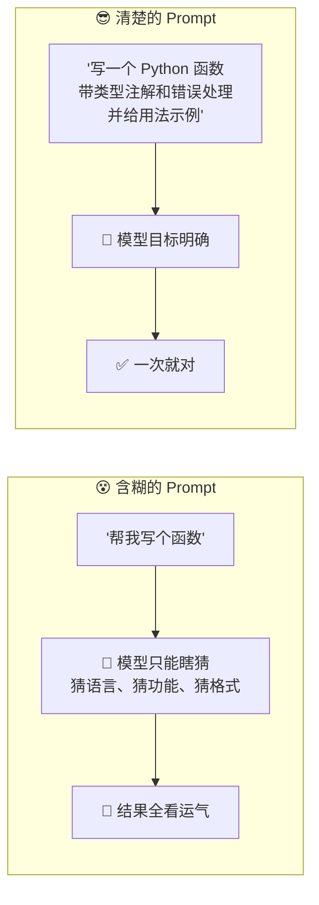
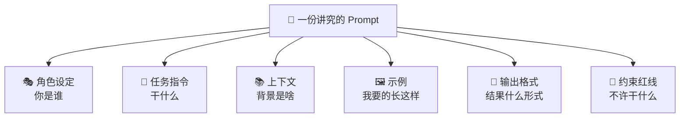
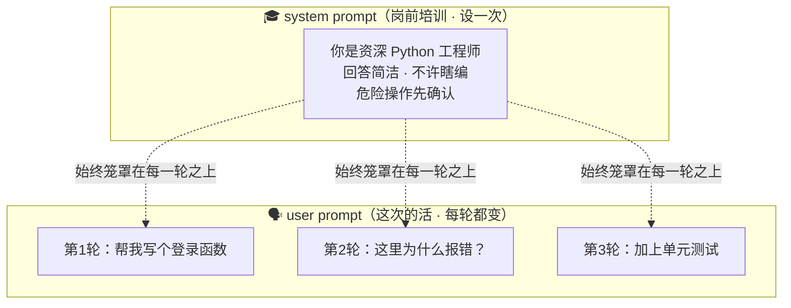
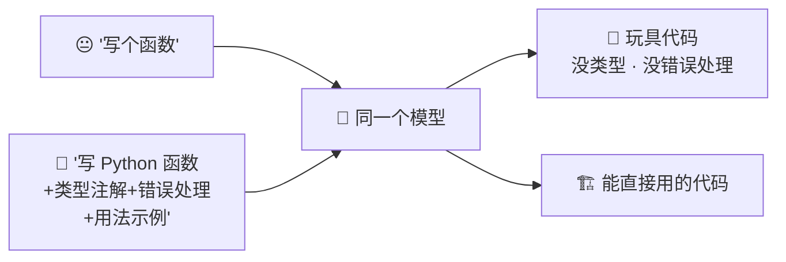
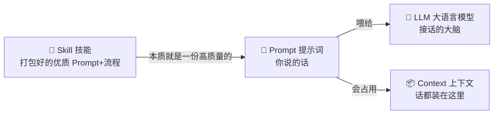

# ⑦ 什么是 Prompt（提示词）

> 建议先读 [⑥ 什么是 LLM（大语言模型）](./[CONCEPT-06]%20什么是LLM-大语言模型.md)——你得先知道"大脑长什么样"，才好谈"怎么跟它说话"。这一篇讲的就是：你对着那颗大脑说的每一句话，叫 **Prompt（提示词）**，它决定了大脑给你什么样的回答。读完这篇，你会明白一个扎心的真相：**很多时候不是模型笨，是你没问清楚。**

---

## 一、一句话定义

**Prompt（提示词）= 你对大模型说的那句话、给它的那段输入。它是你"点菜的方式"——你怎么问，很大程度上决定了它怎么答。**

如果只记一句，就记这句：

> **模型是大脑，Prompt 是你递给大脑的"任务纸条"。纸条写得清不清楚，答案就清不清楚。**

这一句是整篇的骨架。后面所有比喻、图、误区，都在反复讲透它。

```callout ask|小白发问
"提示词工程"听起来像门玄学？其实它就是 +[把话说清楚](该说什么、给谁、什么场景——把脑子里默认的前提一条条摊到明面上)这一件事。你不用会编程，只要会"把需求讲明白"，就已经在做 Prompt 工程了。这篇会教你从"随便来点吃的"升级到"一份不辣的番茄鸡蛋盖饭"——差别就这么大～ 🐥
```

---

## 二、为什么 Prompt 这么重要？

因为**同一个模型，问法不同，效果天差地别**。计算机界有一句老话叫 **"垃圾进，垃圾出（Garbage In, Garbage Out）"**——你喂进去的是含糊的、残缺的信息，吐出来的自然也是含糊的、跑偏的答案。

模型不是不聪明，而是它**只能根据你给的那点信息去猜你想要什么**。你给的信息越模糊，它猜错的空间就越大。

换几个生活场景体会一下"问法决定答案"：

- **点菜比喻**：你对服务员说"随便来点吃的"，端上来是什么全看厨房心情；你说"一份不辣的番茄鸡蛋盖饭、米饭多一点"，端上来的才是你想要的。**Prompt 就是你点菜的那句话。**
- **打车比喻**：你说"往那边开"，司机一脸懵；你说"去人民广场地铁站 2 号口"，他一脚油门就到。**目的地说得越具体，到得越准。**
- **找人帮忙比喻**：你甩给同事一句"帮我搞个表格"，他做出来八成不是你要的；你说清"按月份统计销售额、带小计、用柱状图"，他一次就做对。

所以 Prompt 是你手里的**指挥棒**：模型的能力是固定的，但你挥棒的方式，决定了这场演奏是和谐还是杂音。



---

## 三、一个好 Prompt 里通常有什么？

一份讲究的 Prompt，往往由这六块拼起来。**最好的类比是"给外包公司写需求文档"**——你把活外包出去，写得越清楚，对方越不会做歪。

| 组成 | 作用 | 给外包写需求的比喻 |
|------|------|-------------------|
| **角色设定** | 让模型"扮演"某个身份，定它的口吻和专业度 | "你们要派一个资深后端工程师来做" |
| **任务指令** | 到底要它干什么（核心动作） | "开发一个用户登录接口" |
| **上下文 / 背景** | 相关的前提信息、已有材料 | "我们后端用 Python、数据库是 MySQL" |
| **示例（举例）** | 给一两个"我要的东西长这样"的样板 | "参考竞品这个页面的样式" |
| **输出格式要求** | 要什么形式的结果（JSON？表格？纯代码？） | "交付物要一个 .py 文件加一份说明" |
| **约束 / 红线** | 绝对不能做的、必须遵守的边界 | "不许用付费库、必须处理异常" |

不是每次都要六块全上——**问个简单问题，一句话就够；越复杂、越怕做歪的活，越要把这六块补齐**。就像找人帮个小忙口头说一声就行，但真要外包一个项目，就得写正经需求文档。



---

## 四、system prompt 和 user prompt 有什么区别？

你可能听过 **system prompt（系统提示词）** 和 **user prompt（用户提示词）** 两个词。它们都是"喂给模型的话"，但地位不一样。用一个**新员工入职**的比喻一下子就懂：

| 类型 | 白话 | 入职比喻 | 特点 |
|------|------|----------|------|
| **system prompt** | 岗前培训：定人设、定规矩、定说话风格 | 入职第一天的《员工手册》和《岗位培训》 | 设定一次，之后**每一轮对话都默默生效** |
| **user prompt** | 这一次具体要干的活 | 老板今天派给你的**这一个**具体任务 | 每次都不同，就是你当下打的那句话 |

- **system prompt** 就像**岗前培训**：告诉这个"新员工"——你是一个严谨的 Python 工程师、回答要简洁、不许瞎编、遇到危险操作要先确认。这些规矩**定好之后，它接下来做每一件事都会记着**。
- **user prompt** 就是你**这一次**丢给它的具体任务："帮我看看这段代码为什么报错"。

一句话区分：**system 定"它是个什么样的人、守什么规矩"；user 定"这次让它干哪件具体的活"。** 前者是长期人设，后者是当下任务。



> ⚠️ 记住这张图的关键：**system prompt 不是"第 0 轮对话"，它是罩在所有 user 对话头顶上的那层"规矩"，一直在起作用。** 后面误区那一节会讲，很多人以为 system 和 user 一样，其实差得远。

翻卡自测，看你能不能一句话讲清这个最容易混的区别：

```flip
正面：`system prompt` 和 `user prompt` 都是"喂给模型的话"，它俩到底差在哪？
---
反面：**system = 长期人设/规矩（设一次，罩在每一轮之上）；user = 这一次的具体任务（每轮都变）。** 打个入职比方：system 是《员工手册》和岗前培训（"你是严谨的工程师、危险操作先确认"——之后每件事都记着）；user 是老板今天派的这一个活（"帮我看看这段代码为啥报错"）。把规矩写进 system 才会每轮生效；写进某一次 user，说完这轮就可能淡忘。
```


---

## 五、Prompt 工程小技巧（大白话版）

"Prompt 工程（Prompt Engineering）"听起来高大上，其实就是**怎么把话说清楚**的一些实用招数。下面五招，白话讲，学会就能立刻用上。

| 技巧 | 大白话 | 生活比喻 |
|------|--------|----------|
| **① 说清楚** | 别用"那个""搞一下"，把要什么、给谁、什么场景讲明白 | 点菜说清"不要香菜、少油"，而不是"随便" |
| **② 给例子（few-shot）** | 甩一两个"我想要的样子"给它照着做 | 理发时直接给发型师看一张照片 |
| **③ 让它一步步想（分步 / 思维链）** | 说"请分步骤思考"，别逼它一口答完 | 让学生写出解题过程，而不是只写答案 |
| **④ 指定格式** | 明说要 JSON / 表格 / 只要代码不要废话 | 报销时说"给我发票 PDF"，而不是"给我凭证" |
| **⑤ 设边界** | 划清红线："只用标准库""不超过 50 行""别改其它文件" | 装修前说好"这面承重墙不许动" |

几招稍微展开一点：

- **给例子（few-shot）** 特别管用。你与其费半天口舌描述"我要什么风格"，不如直接甩一个样板："照这个格式再写三条"。模型看样板学得比听描述快得多——**这跟人一样，看一眼照片胜过听你形容十句。**
- **让它一步步想**：复杂问题让模型"先想再答"，往往比逼它直接蹦答案更靠谱。就像考试时让学生写出推导过程，中间的思考能减少低级失误。
- **设边界**很容易被忽略，但极其重要。你不划红线，它就可能"顺手"多做一堆你没让它做的事（比如顺手把别的文件也改了）。**明确说"只做 X，别碰 Y"，能省掉大量返工。**


---

## 六、常见误区（新手最容易踩的坑）

这一节请逐条读完，这些误解会让你对 Prompt 的作用产生错觉。

### 误区 1：以为 Prompt 越长越好

- ❌ **错误理解**：我把话写得又臭又长、把能想到的都塞进去，模型就答得越好。
- ✅ **正确理解**：**清楚 ≠ 冗长。** 一堆废话和重复反而会淹没关键要求，让模型抓不住重点。好 Prompt 是**信息密度高**——该说的说全，废话一句不留。就像好的需求文档是精准，不是厚。

### 误区 2：以为一句话它就能懂你全部意图

- ❌ **错误理解**："帮我做个网站"，它就该知道我要什么风格、什么功能、什么技术栈。
- ✅ **正确理解**：模型**不会读心**。你脑子里默认的前提（"当然是中文的""当然要能登录"），它一概不知道。**你没说的，它只能猜。** 想要什么，就得明说出来。

### 误区 3：以为改 Prompt 能让它"算数变准"

- ❌ **错误理解**：它算错了一道数学题，我把 Prompt 改得更好就能让它算对。
- ✅ **正确理解**：Prompt 能改善的是**"怎么表达、怎么组织、往哪个方向使劲"**，但改不了模型**本身能力的天花板**。模型不擅长精确计算，是它的底层特性（回看 [⑥ LLM](./[CONCEPT-06]%20什么是LLM-大语言模型.md)——它是"猜下一个词"，不是"跑计算器"）。这种事该让它**调用工具**去算，而不是指望换个说法它就变准。**Prompt 是指挥棒，指挥不出乐队没有的音。**

### 误区 4：以为 system 和 user 是一回事

- ❌ **错误理解**：反正都是给模型的话，写在哪儿都一样。
- ✅ **正确理解**：**system 是长期人设 / 规矩，罩在每一轮之上；user 是这一次的具体任务。** 把"你是严谨的工程师、危险操作先确认"这类规矩写进 system，它才会**每轮都守着**；写进某一次 user，说完这轮可能就淡忘了。放错地方，效果差很多。

### 误区 5：以为对它说"请""谢谢"能让结果更好

- ❌ **错误理解**：我客气一点、多夸它几句，它就会更卖力、答得更好。
- ✅ **正确理解**：礼貌用语**基本不影响答案质量**——模型不会因为你说"请"就更努力，它没有情绪也不会"偷懒"。真正影响结果的是**信息说得清不清楚**，不是语气客不客气。（当然，礼貌没坏处，但别指望靠它提升质量。）

---

## 七、动手小实验 / 思想实验

理论看再多，不如亲手对比一次。下面这个实验，能让你**当场看到 Prompt 的威力**。

### 实验 A：同一件事，两种问法

打开任意一个 AI 助手，先后发这两句，对比它给你的东西：

**第一次（含糊版）：**

```
写个函数
```

你多半会得到一个**没头没尾**的东西：它得替你猜——什么语言？干什么用的？要不要注释？多半随便给你一个 `add(a, b)` 之类的玩具。

**第二次（清楚版）：**

```
写一个 Python 函数，要求：
1. 功能是读取一个 JSON 文件并返回里面的数据
2. 带完整的类型注解
3. 处理文件不存在、内容不是合法 JSON 这两种错误
4. 最后给一个调用它的用法示例
```

这次你会拿到一个**能直接用**的函数：类型注解齐全、错误处理到位、还附带示范。**同一个模型、同样几秒钟，结果一个天上一个地下——差别全在你那句 Prompt 上。**



把"同一个模型、两种问法"演成一幕小短剧——注意从头到尾模型没变、也没变笨，变的只有你那句 Prompt：

```scene 同一个模型，两种问法两种命运
> 场景一：含糊地问。
🧑 你 | 写个函数。
🤖 AI | 呃……什么语言？干什么用的？——我只能猜了。（丢出）`def add(a, b): return a + b`
🧑 你 | 这不是我要的……（但你其实也没说清）
> 场景二：换一种问法，把默认前提一条条摊到明面上。
🧑 你 | 写一个 Python 函数：读取 JSON 文件返回数据、带类型注解、处理"文件不存在/非法 JSON"两种错误、最后给个用法示例。
🤖 AI | 目标清楚！（丢出一段带类型注解、错误处理齐全、附用法示例的函数）拿去直接用。
> 同一个模型、同样几秒钟，结果一个天上一个地下——差别全在你那句 Prompt 上。
```

### 实验 B：脑内推演——把你的一句话补成"需求文档"

在脑子里挑一件你想让 AI 帮的事，比如"帮我整理这段数据"。然后用第三节那六块结构，把它从一句话补成一份小小的需求：

- **角色**：你是一个数据分析师。
- **任务**：把我给的销售流水按月份汇总。
- **上下文**：数据是 CSV，有日期、金额两列。
- **示例**：输出参照"2026-01：12,300 元"这种格式。
- **输出格式**：给我一个 Markdown 表格。
- **约束**：金额保留整数、别丢掉任何一个月。

补完你会发现——**你刚刚就把一句含糊的话，变成了一份让 AI 几乎不可能做歪的 Prompt。** 这就是"写 Prompt"这门手艺的全部秘密：**把脑子里的默认前提，一条条摊到明面上。**

---

## 八、和其它概念的关系

Prompt 不是孤立的，它是你和整个 AI 体系打交道的"入口"。理清它和邻居的关系，心智模型就完整了。



| 概念 | 一句话关系 | 类比 |
|------|-----------|------|
| [⑥ LLM](./[CONCEPT-06]%20什么是LLM-大语言模型.md) | Prompt 是"喂给" LLM 这颗大脑的输入，大脑照着它产出回答 | 纸条 vs 大脑 |
| [⑤ Skill](./[CONCEPT-05]%20什么是Skill-技能.md) | **Skill 本质就是一份"打包好、登记好的高质量 Prompt + 流程"** | 随手写的便条 vs 印好的操作手册 |
| ⑧ Context / Token（下一篇） | 你说的每句 Prompt 都要**占地方**，装在模型的"上下文"里，还是有限的 | 说的话越多，越占内存 |

这里有个很重要的连接：**你现在应该能看穿 [Skill](./[CONCEPT-05]%20什么是Skill-技能.md) 的真面目了**——所谓 Skill，说白了就是**一份被专家写好、反复打磨、登记在册、需要时自动加载的高质量 Prompt（外加流程编排）**。你自己每次手打的是"一次性 Prompt"；Skill 是"把最好的那版 Prompt 存下来，以后自动用"。它们本是同根生。

而你每说一句话，都会**占用模型的"上下文"空间**——这个空间不是无限的。这就自然引出了下一篇要讲的 **Context 与 Token**。

---

## 九、和 Khy-OS 的关系

你在 Khy-OS 里跟 AI 说的每一句话，都是一次 **user prompt**。而 Khy-OS 在背后，早就替你准备好了一大套 **system prompt（系统提示词）**——它就是那份"岗前培训"，定好了 AI 该守的规矩：比如"危险命令要拦""发布前要确认""改动要外科手术式、别顺手重构"等等。

Khy-OS 把这类"给 AI 定规矩"的工作，当成一门正经手艺来做——**系统提示词工程（system prompt engineering）就是它的重要组成部分**。它不仅有系统提示词，还有一套**指令注册表**机制，把散落的规矩集中登记、避免互相打架（想想看：规矩堆太多、还互相矛盾，AI 就会犯迷糊）。

- **你打的**：user prompt——这一次具体让它干的活。
- **Khy-OS 铺垫好的**：system prompt——罩在你每句话之上的那层长期规矩。
- **Skill 是什么**：把某类任务的"最佳 Prompt + 流程"打包成手册，需要时自动加载（回看 [⑤ Skill](./[CONCEPT-05]%20什么是Skill-技能.md)）。

关于系统提示词、指令注册表这套机制是怎么设计和落地的，你可以在设计类文档里进一步了解（参见 [`docs/03_DESIGN_设计`](../03_DESIGN_设计)）。本文只讲概念：**你说的话（Prompt）+ Khy-OS 定的规矩（system prompt），共同决定了 AI 这一趟怎么帮你干活。**

---

## 十、小结 + 下一步

- **Prompt = 你对大模型说的话 / 给它的输入**，是你"点菜的方式"，怎么问很大程度决定怎么答。
- **为什么重要**：同一个模型，问法不同，效果天差地别——**垃圾进，垃圾出**。Prompt 是你手里的指挥棒。
- **好 Prompt 的六块**：角色设定、任务指令、上下文、示例、输出格式、约束红线（像给外包写需求文档）。
- **system vs user**：system 是"岗前培训"（长期人设 / 规矩，罩在每轮之上），user 是"这次的活"（当下具体任务）。
- **五个小技巧**：说清楚、给例子、让它一步步想、指定格式、设边界。
- **五大误区**：不是越长越好、它不会读心、改 Prompt 改不了模型能力天花板、system 和 user 不一样、礼貌用语不影响质量。
- **和邻居的关系**：Prompt 喂给 [LLM](./[CONCEPT-06]%20什么是LLM-大语言模型.md)；[Skill](./[CONCEPT-05]%20什么是Skill-技能.md) 本质就是打包好的高质量 Prompt；Prompt 会占用**上下文**空间——而这个空间是有限的。

既然每句话都要占"上下文"、还要按"Token"计量，那这个空间到底是什么、有多大、满了会怎样？下一篇揭晓。

```quiz
Q: 为什么"同一个模型，问法不同，效果天差地别"？（可多选）
- [x] 模型不会读心，你没说的前提它只能猜，说得越含糊猜错空间越大
- [x] 一个好 Prompt 会把角色、任务、上下文、示例、格式、约束讲清楚，模型目标明确
- [ ] 因为对它说"请""谢谢"它就会更卖力
- [ ] 因为 Prompt 写得越长，模型就一定答得越好
> 前两个对：模型只能根据你给的信息去猜你想要什么，把默认前提摊开、把六要素讲清，它才不会做歪。后两个是典型误区——礼貌用语基本不影响质量，而"越长越好"是错的（清楚 ≠ 冗长，废话会淹没关键要求）。这题选对，说明你抓住了 Prompt 的核心：信息密度，不是字数也不是语气。
```

👉 [⑧ 什么是 Context 与 Token（上下文与令牌）](./[CONCEPT-08]%20什么是Context与Token-上下文与令牌.md)
