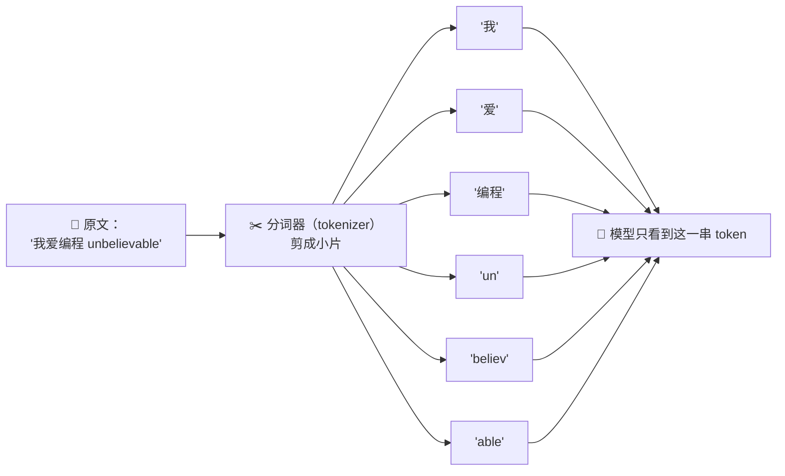
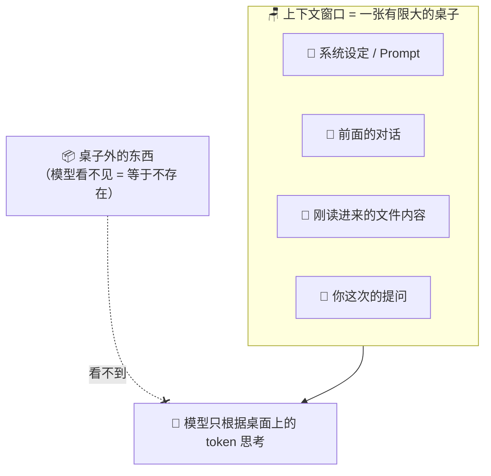
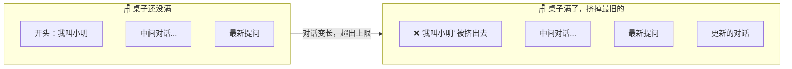
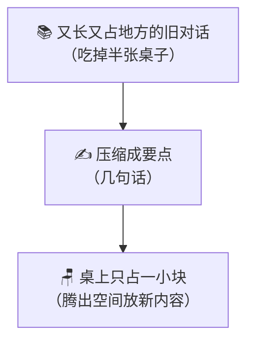
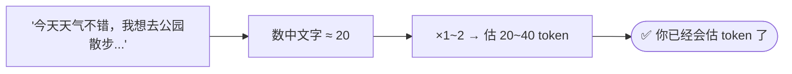
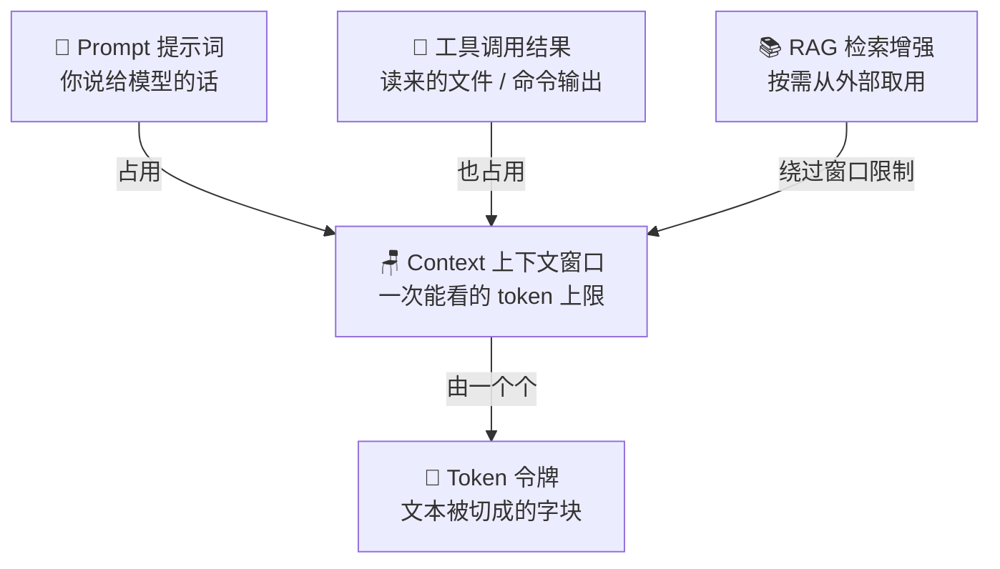

# ⑧ 什么是 Context 与 Token（上下文与令牌）

> 建议先读 [⑦ 什么是 Prompt（提示词）](./[CONCEPT-07]%20什么是Prompt-提示词.md)。上一篇讲"你怎么把话说给模型听"；这一篇讲一个更底层的真相——**模型不是按"字"读你的话，而是按"token（令牌）"读；而且它一次能看到的 token 有一个上限，这个上限就叫 Context（上下文窗口）。** 读完你就会明白：为什么 AI 会"忘了你前面说的"、为什么用 AI 是要花钱的、为什么"把整本书塞给它"不现实。

---

## 一、一句话定义

先把两个词一次讲清，它们是一对：

- **Token（令牌）= 大模型眼里的"字块"。** 文本在进模型之前，会被切成一小片一小片，每一片就是一个 token。模型不认识"字"，只认识这些切好的"字块"。
- **Context（上下文窗口）= 模型一次能同时看到的 token 总量上限。** 就像一张桌子的桌面大小——你能同时摊开多少资料，取决于桌子有多大。桌子外的东西，模型**看不到**。

如果只记一句话，就记这句：

> **文本先被切成 token，模型只能在一张有限大的"桌子"（上下文窗口）上同时看这么多 token。**

这一句话是整篇的骨架。后面所有比喻、图、误区，都是在把这句话讲透。

```callout note|小笔记
两个词一起记最省事：+[Token](文本被切成的"字块"——模型不认字，只认这些切好的小片) 是"桌上的一张张纸"，+[Context](模型一次能同时看到的 token 上限——像一张桌子的桌面大小) 是"桌子有多大"。这篇会反复用"桌子"这个比喻，你只要记住一句话：**桌子外的东西，模型看不见，等于不存在。** AI 会"忘事"、用它要花钱，根子全在这里～ 🐧
```

---

## 二、Token 是什么？——模型眼里的"字块"

你打字是一个字一个字打的，但模型**不是一个字一个字读的**。它读之前，你的文字会先被一个叫"分词器（tokenizer）"的东西**剪成小片段**，每一片就是一个 token。

用三个比喻从不同角度看同一件事：

| 比喻 | Token 对应什么 | 关键点 |
|------|----------------|--------|
| **乐高积木块** | 模型用一块块积木拼出理解，而不是一个个字母 | 最小拼装单位是"块"，不是"字母" |
| **把文章剪成小纸片** | 分词器拿剪刀把句子剪成一堆小纸片 | 有的纸片是一个词，有的是半个词 |
| **超市里的"份装"** | 散装米被分装成一袋袋，按袋卖 | 模型按"袋"（token）处理和计费，不按"粒" |

一个 token **到底多大**？没有固定答案，但可以给你一个直觉：

- 一个**英文单词**，常常是 1 个 token；但长单词会被拆成好几块，比如 `unbelievable` 可能被剪成 `un` + `believ` + `able` 三片。
- 一个**中文字**，大约相当于 **1 到 2 个 token**（不同模型不一样）。所以"你好世界"这四个字，可能是 4 到 8 个 token，而不是 4 个。
- 一个**空格、标点**也可能各占一小片。



**记住这个反直觉的点：token ≠ 字数。** 你以为发了 100 个字，模型眼里可能是 150 个 token。后面算钱、算容量，都得按 token 算，不能按字数拍脑袋。

翻卡自测这个最容易记错的点：

```flip
正面："你好世界"这四个中文字，是 4 个 token 吗？发 100 个字就是 100 个 token 吗？
---
反面：**不是。token ≠ 字数。** 一个中文字大约是 1～2 个 token（因模型而异），所以"你好世界"可能是 4～8 个 token；一个长英文词还会被切成好几块（`unbelievable` → `un`+`believ`+`able`）。所以你发 100 个字，模型眼里可能是 150 个 token。算容量、算钱都要按 token，不能按字数拍脑袋——只能估个大概，别当成精确相等。
```


---

## 三、为什么普通人也要懂 token？

你可能想："切成什么样是模型内部的事，跟我有什么关系？"关系很大，就两条，但都直接掏你口袋、卡你脖子：

| 原因 | 一句话 | 生活比喻 |
|------|--------|----------|
| **① 按 token 计费** | 用 AI 的钱，是按你发进去 + 它吐出来的 token 数量算的 | 打车按里程计价，不按你说了几句话 |
| **② token 有上限** | 一次能塞进去的 token 有天花板，超了就装不下 | 行李箱有容积，塞不下就得取东西 |

**第一条（花钱）**：几乎所有大模型服务，都是"数 token 收费"。你发的问题（输入 token）+ 它写的回答（输出 token），加起来越多，越贵。所以"啰嗦"是有成本的——同样一件事，说得精简能省钱。这也是为什么 Khy-OS 这类工具会想方设法"节省 token"。

**第二条（装不下）**：这就引出了下一节的主角——上下文窗口。

---

## 四、Context（上下文窗口）是什么？——一张有限大的桌子

模型一次能"同时看到"的 token 是**有上限**的。这个"一次能看多少"的容量，就是**上下文窗口（context window）**。

最好的比喻是**一张桌子**：

- 你把资料（你的问题、之前的对话、文件内容）一张张摊到桌面上；
- 桌面大小是固定的（比如能摊 20 万个 token）；
- **桌子满了，想放新的，就得先拿走旧的**；
- 最关键的一点：**模型只能看见桌上的东西。桌子外面、或者被你收进抽屉的东西，它完全看不见，等于不存在。**



不同模型桌子大小差很多：有的能摊几千 token，有的能摊几十万 token。**但再大的桌子也是有限的**——这是理解后面一切"遗忘"现象的根。

> ⚠️ 划重点：模型**没有记忆**。它不是"记住"了你的对话，而是每一轮，宿主都把"该让它看的东西"重新摊到桌上给它看一遍。它的"记性"，其实是每次都把资料重新铺一遍的假象。桌上没铺的，它就真的不知道。

---

## 五、上下文溢出：为什么它"忘了我前面说的"

现在可以解释那个最让人困惑的现象了：**跟 AI 聊久了，它好像忘了开头说过的话。**

原因不是它"记性差"，而是**桌子放不下了**。

对话越聊越长，token 越堆越多。当总量超过桌子大小时，宿主必须**拿走一部分旧的**，才能给新的腾地方。通常最先被拿走的，就是**最早的那几轮对话**。于是——

- 你开头说"我叫小明，喜欢用 Python"；
- 聊了很久很久之后，这句话被挤出了桌面；
- 你再问"我刚才说我喜欢什么语言来着？"——它**真的看不到那句话了**，只能瞎猜或说不记得。

这就叫**上下文溢出 / 上下文遗忘**。



用**白板**比喻最贴切：白板就那么大，写满了要写新的，就得擦掉一块旧的。被擦掉的内容，不是"忘了"，是**物理上没了**。模型的"遗忘"就是这么回事——不是脑子坏了，是桌面/白板放不下了。

把这场"聊着聊着就忘了开头"的经历演成一幕小短剧——你会看到它不是记性差，是那句话被挤下了桌面：

```scene 桌子满了，开头那句话被挤出去了
> 对话刚开始，桌子空空的。
🧑 你 | 你好，我叫小明，喜欢用 Python。
🤖 AI | 你好小明！记下了，你喜欢 Python。（这句话稳稳摊在桌上）
> ……你们又聊了很久很久，桌子一点点被新内容堆满……
📋 旁白 | 桌子满了！为了放新内容，最早那句"我叫小明，喜欢用 Python"被挤出了桌面。
🧑 你 | 对了，我刚才说我喜欢什么语言来着？
🤖 AI | 抱歉……我这张桌上已经看不到那句话了，你能再说一次吗？
> 它不是记性差，是那句话在物理上已经不在它眼前了——这就是上下文溢出。
```

---

## 六、上下文管理：桌子满了怎么办？

既然桌子有限，聪明的做法就是**管理桌面**——决定"什么该留、什么该走、什么可以压缩"。这就是**上下文管理（context management）**。常见三招：

| 手段 | 做了什么 | 生活比喻 |
|------|----------|----------|
| **截断（truncation）** | 直接扔掉最旧的部分 | 桌子满了，把最早那摞纸拿走 |
| **摘要压缩（summarization）** | 把一大段旧对话浓缩成几句要点再留下 | 把十页会议记录缩成半页纪要 |
| **只留相关的（filtering）** | 只把和当前任务有关的资料摊上桌 | 做这道菜，只把这道菜的料摆出来 |

其中**摘要压缩**特别聪明：它不是简单扔掉旧对话，而是先"读一遍、记要点、写成短短一段"，再用这段短的替换掉又长又占地方的原文。这样既省了桌面空间，又保住了关键信息。



但管理终归是"screen 有限桌面上的取舍"，它**不能凭空变出更大的桌子**。当你需要的信息**远远超过**桌子能装的量（比如"读完这 500 个文件再回答"），光靠桌面管理就不够了——你需要一个**外部的仓库**，用到哪一块，才去取哪一块摊上桌。

这个"按需从外部仓库取用"的思路，就是后面会讲的 **RAG（检索增强生成）** 要解决的问题（见第九节和 [⑪ RAG](./[CONCEPT-11]%20什么是RAG-检索增强生成.md)）。你可以先记一句话：**上下文窗口是"桌面"，RAG 是"身后那排随取随用的书架"。**

---

## 七、常见误区（新手最容易踩的坑）

这一节请逐条读完，这几个误解会让你对 AI 的行为一直困惑。

### 误区 1：以为模型永久记住了所有对话

- ❌ **错误理解**：我跟它说过的话，它都记在脑子里，永远都在。
- ✅ **正确理解**：模型**没有长期记忆**。它每一轮只看"这次被摊上桌的 token"。桌子放不下的旧对话会被挤走，它就真的看不到了。所谓"记得"，是宿主每轮把资料重新铺给它看的假象。

### 误区 2：以为 token = 字数

- ❌ **错误理解**：我发了 100 个字，就是 100 个 token。
- ✅ **正确理解**：token 是"字块"，不是"字"。一个中文字可能是 1～2 个 token，一个长英文词可能被切成好几个 token。**算容量、算钱都要按 token，不是按字数。**

### 误区 3：以为上下文窗口越大越好、且没代价

- ❌ **错误理解**：桌子越大越好，把所有东西都摊上去准没错。
- ✅ **正确理解**：桌子大是好事，但**摊得越多，越花钱、越慢**，模型还可能被无关信息干扰、抓不住重点（"东西太多反而找不到"）。桌子大不等于该把它塞满——**摊上桌的每一样都在花钱、都在分散注意力**。

### 误区 4：以为清空/新开对话它还记得

- ❌ **错误理解**：我新开一个对话，它应该还记得我上次聊的。
- ✅ **正确理解**：清空或新开对话，等于**换了一张干净的空桌子**。上一张桌上的东西没了。它不会"记得"上次——除非那些信息被专门存进了某种外部记忆再喂回来。

### 误区 5：以为一个中文字就是一个 token

- ❌ **错误理解**："你好"两个字就是 2 个 token。
- ✅ **正确理解**：中文的切法因模型而异，一个常用字可能是 1 个 token，生僻字或组合可能占更多。**不要用"字数"精确等于"token 数"**，只能估个大概。

---

## 八、动手小实验 / 思想实验

看懂不算会，动手（或在脑内）走一遍才算。

### 实验 A：估一段话大概多少 token

拿这句话来估：

> "今天天气不错，我想去公园散步，顺便买杯咖啡。"

粗略估法（够用就行，别追求精确）：

1. 数一下中文字：大约 20 个字（含标点）。
2. 按"1 个中文字 ≈ 1～2 个 token"估：大约 **20～40 个 token**。
3. 如果混了英文词，一个短词算 1 个 token，长词多算几个。

结论：你随口一句话，就是几十个 token。一段几百字的说明，轻松上千 token。**你现在能感觉到"文字是要占容量的"了。**



### 实验 B：思想实验——把一本书塞进有限窗口

想象你要让 AI"读完一本 500 页的书再回答问题"，但它的桌子只能摊下大约 50 页那么多 token。会发生什么？

- **一次全塞**：塞不下，超出的部分直接掉地上（截断），它只看到了一部分书，回答自然片面。
- **硬压缩**：把 500 页压成 50 页摘要摊上桌——省了空间，但**细节丢了**，问它某个具体段落它答不上来。
- **聪明的办法**：书放在**桌子旁边的书架上**（外部仓库），你问哪一章，就**只把那一章抽出来摊上桌**——这就是 RAG 的思路。

走完这个思想实验，你就同时理解了"上下文的极限"和"为什么需要外部记忆"。

```quiz
Q: 跟 AI 聊很久后，它"忘了"你开头说的话，最主要的原因是？
- [ ] 模型故意不理你
- [x] 对话太长超出了上下文窗口，最旧的内容被挤出了"桌面"
- [ ] 模型的长期记忆出了 bug
- [ ] token 算错了
> 模型没有长期记忆，它只看"这一轮摊上桌的 token"。桌子（上下文窗口）有上限，聊久了旧内容被截断/压缩挤走，于是它"看不到"开头那句话了——不是忘，是桌面放不下了。
```

---

## 九、和其它概念的关系

Context 和 Token 是很底层的一层，几乎每个概念都踩在它上面。理清关系，整张心智地图就连起来了。



| 概念 | 和上下文/token 的关系 | 一句话 |
|------|----------------------|--------|
| [⑦ Prompt（提示词）](./[CONCEPT-07]%20什么是Prompt-提示词.md) | 你写的每一句 prompt 都要**切成 token 摊上桌**，占用窗口 | prompt 越长越占地方、越花钱 |
| **工具调用的结果** | 模型读来的文件、跑命令的输出，也要**摊上桌**，一样吃 token | 读个大文件，可能一下占掉半张桌 |
| [⑪ RAG（检索增强生成）](./[CONCEPT-11]%20什么是RAG-检索增强生成.md) | 用"检索 → 只取相关片段"绕开窗口装不下的问题 | 桌子旁的书架，用哪本抽哪本 |

一句话串起来：**你说的话（Prompt）、它读来的东西（工具结果）都要占桌子（Context）；桌子由 token 铺成、有上限；装不下时，就靠 RAG 从外部按需取用。**

---

## 十、和 Khy-OS 的关系

Khy-OS 是一个会连续读文件、跑命令、多轮对话的 AI 编程助手——这意味着它**天天在和"桌子快满了"作斗争**。所以上下文管理是它绕不开的一部分：

- **上下文管理 / 压缩**：一次任务可能要读很多文件、来回很多轮，token 很容易堆到窗口上限。Khy-OS 会做上下文的取舍与压缩（比如把很长的历史浓缩成要点再保留），让"桌面"始终装得下当前最该看的东西。这类机制，就是本文第六节讲的"截断 / 摘要 / 只留相关"在真实工具里的落地。
- **缓存前缀（cache）**：每轮对话里，开头那一大段固定内容（系统设定、工具清单等）常常是不变的。Khy-OS 会利用"缓存前缀"这类机制，避免每轮都为同样的开头重复付 token 的钱——这正是"按 token 计费"逼出来的省钱智慧。

这些都属于 Khy-OS 上下文相关设计的一部分。想进一步了解它在设计层面怎么处理上下文，可以去看设计类文档（参见 [`docs/03_DESIGN_设计`](../03_DESIGN_设计)）。本文只到"概念"为止，不涉及具体函数实现。

> ⚠️ 这里只讲"概念级"的直觉——**桌子有限，所以要管理；token 花钱，所以要节省**。具体的压缩策略、缓存怎么命中、如何分级，属于设计与实现层面，本文不展开。

---

## 十一、小结 + 下一步

- **Token（令牌）** = 模型眼里的"字块"，文本进模型前先被切成一片片。**token ≠ 字数**。
- **Context（上下文窗口）** = 模型一次能同时看到的 token 上限，像一张有限大的桌子。**桌子外的东西模型看不见。**
- 懂 token 有两个现实理由：**① 按 token 计费（花钱）② 有上限（装不下）**。
- 聊久了它"忘了开头"，不是记性差，是**桌子放不下、旧内容被挤走**（上下文溢出）。
- 应对靠**上下文管理**（截断 / 摘要压缩 / 只留相关）；当信息远超桌面容量时，需要**外部记忆（RAG）**按需取用。
- 五大误区：模型不会永久记住、token 不等于字数、窗口不是越大越好没代价、清空对话就是换空桌子、一个中文字不一定是一个 token。

理解了"桌子放不下整座图书馆"，你自然会问：**那怎么在海量资料里，快速找到跟当前问题最相关的那几页？** 这就要靠把文字变成"可比较相似度的坐标"——也就是下一篇的主角。

👉 [⑨ 什么是 Embedding（向量）](./[CONCEPT-09]%20什么是Embedding-向量.md)
