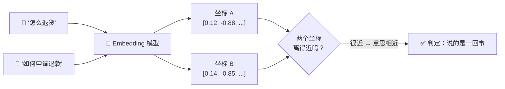
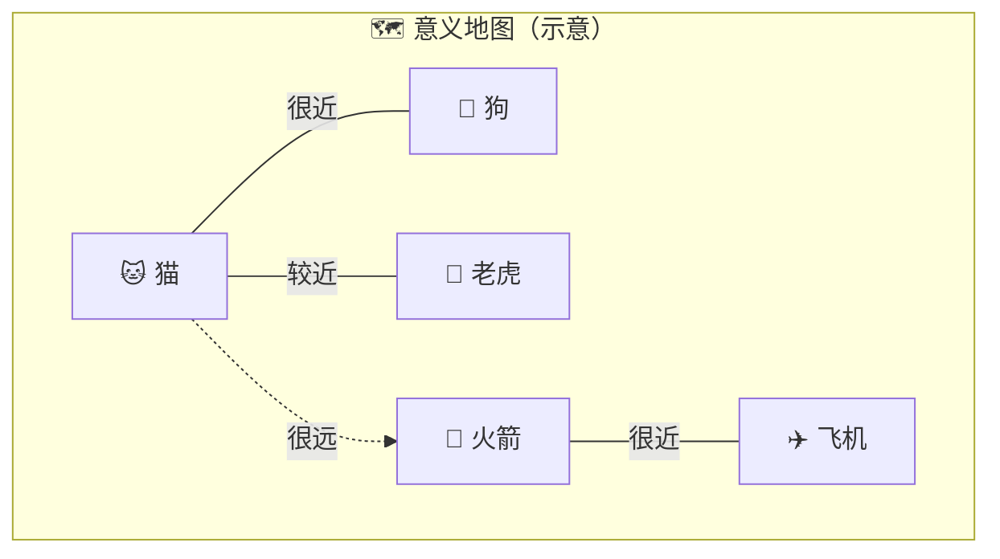
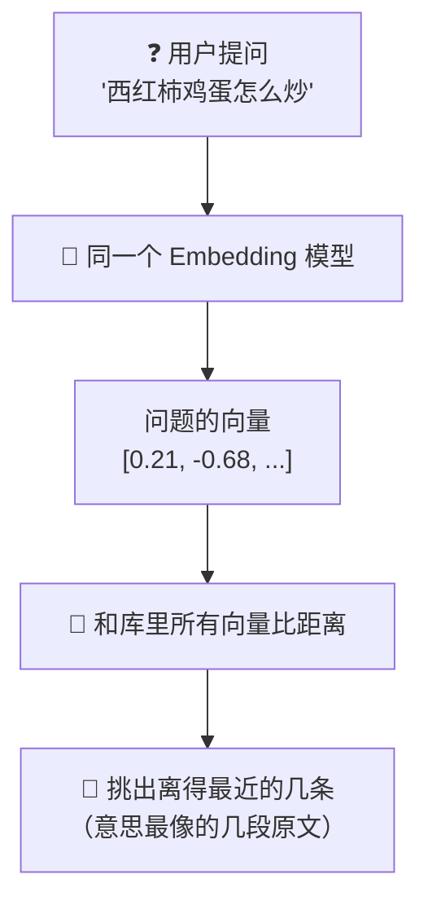
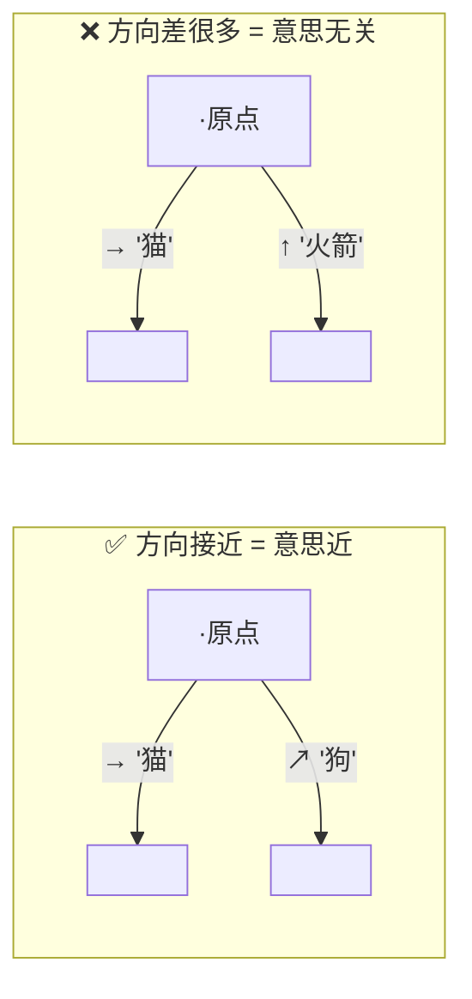
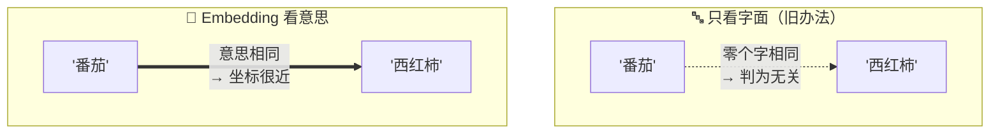
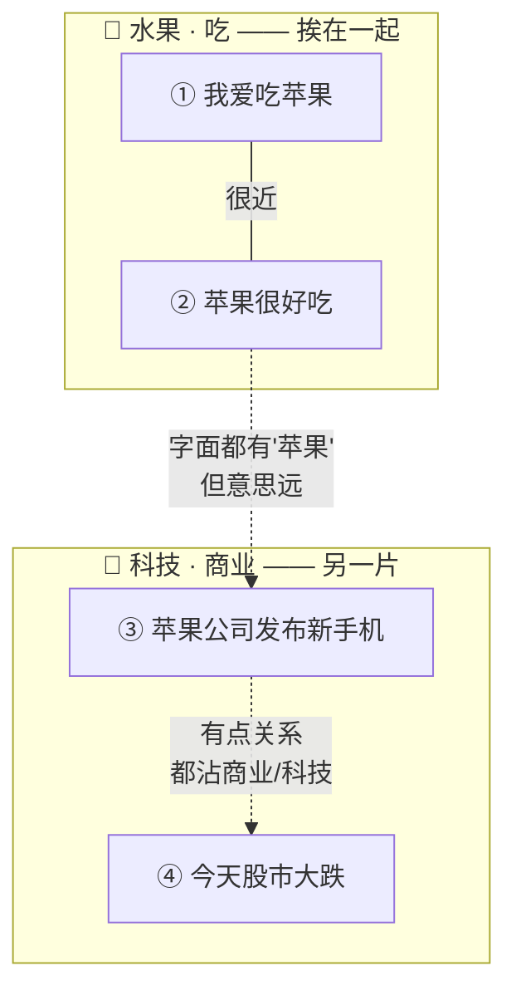
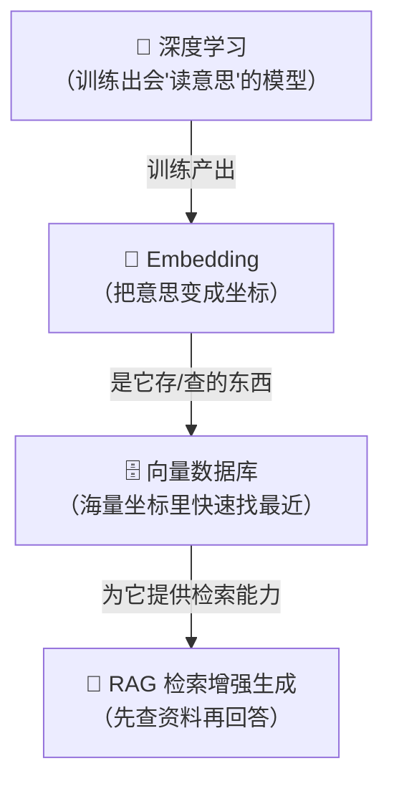

# ⑨ 什么是 Embedding（嵌入 / 向量）

> 建议先读 [⑧ 什么是 Context 与 Token](./[CONCEPT-08]%20什么是Context与Token-上下文与令牌.md)。那一篇讲"模型一次能看多少字、字是怎么被切成 token 的"；这一篇往下走一层，讲一个更底层的问题：**计算机根本不认识文字，它只认识数字——那一段话到底是怎么"变成数字"、又怎么让机器判断两句话"意思像不像"的。** 读完这篇，你就拿到了理解下一篇 [⑩ 向量数据库](./[CONCEPT-10]%20什么是向量数据库.md) 和 [⑪ RAG 检索增强生成](./[CONCEPT-11]%20什么是RAG-检索增强生成.md) 的钥匙。

---

## 一、一句话定义

**Embedding（嵌入 / 向量）= 把一段文字（或一张图片）变成一串数字（叫"向量"），并且让"意思相近的东西"在这串数字构成的空间里"离得近"。**

如果你只想记住一句话，就记这句：

> **Embedding 就是给每段话发一个"坐标"，把它钉在一张巨大的"意义地图"上——意思越像，坐标越近。**

这一句话是整篇文档的骨架。后面所有的比喻、图、误区，都是在反复讲透这一句话。

```callout ask|小白发问
"把文字变成一串数字"听起来像天书？换个说法你秒懂：就是给每段话发一个 +[坐标](像城市的经纬度——上海和苏州坐标接近，就是地理上的邻居；两段话坐标接近，就是意思上的邻居)，钉在一张"意义地图"上。意思越像，坐标越近。全篇你只要死记七个字：**意思近 = 坐标近**。抓住这句，向量数据库、RAG 后面全是它的延伸～ 🐥
```

---

## 二、为什么需要 Embedding？

因为**计算机不懂文字，只懂数字**。

在机器眼里，"猫"和"狗"和"火箭"都只是一堆笔画、一串字符编码，它**看不出"猫和狗都是动物、都毛茸茸、都能当宠物"**，也看不出"猫和火箭八竿子打不着"。字符编码只记录"这是哪个字"，**完全不记录"这个字是什么意思"**。

可是我们经常要让机器回答一个问题：**"这两段话，意思像不像？"**

- 用户搜"怎么退货"，文档里写的是"如何申请退款流程"——**字面几乎不一样，意思却很近**，机器得能认出来。
- 用户问"番茄炒蛋怎么做"，机器得知道标题写着"西红柿炒鸡蛋"的那篇菜谱**就是要找的东西**。

如果只会"逐字对比"，机器会觉得"番茄"和"西红柿"是两个毫不相干的词。要让它懂"意思像不像"，就得先把每段话**变成一种能计算的东西**——这就是向量。变成向量之后，"意思像不像"这个模糊的问题，就变成了"两个坐标离得近不近"这个**能用数学算出来**的问题。



### 没有 Embedding 会怎样？

机器就只能"逐字死磕"。你搜"退货"，它就只找出现"退货"两个字的地方；文档写"退款"，它当场就漏了。这就像一个**只认字、不懂意思**的图书管理员：你说"我想找讲喵星人的书"，他非要你说出书名里带"喵星人"三个字才肯帮你找——但凡书名叫《猫的一生》，他就一脸茫然。Embedding 就是给这个管理员装上"听得懂意思"的耳朵。

| 有没有 Embedding | 机器能做什么 | 好比 |
|------------------|--------------|------|
| **没有** | 只会逐字对比，字面不同就当成毫不相干 | 只认书名关键字的死板管理员 |
| **有** | 能判断"意思像不像"，抓到换了说法的同一件事 | 听得懂"你大概想找哪类书"的老练管理员 |

---

## 三、核心比喻：把每段话画到一张"意义地图"上

这是本文最重要的一张图景，请务必在脑子里建立它。

想象一张**巨大的地图**。地图上不是山川河流，而是"意思"。我们把每一个词、每一段话，都**在这张地图上钉一个点**：

- "猫"和"狗"钉得**很近**（都是常见宠物、都是动物、都毛茸茸）；
- "猫"和"老虎"也**不算远**（都是猫科）；
- "猫"和"火箭"钉在**地图的两头**（毫无关系）。

换几个角度，用你熟悉的东西体会同一件事：

| 比喻 | 地图上的"距离"代表什么 | 关键点 |
|------|------------------------|--------|
| **给城市标经纬度** | 每个城市一组坐标（经度、纬度） | 上海和苏州经纬度接近＝地理上就是邻居 |
| **色卡（色环）** | 相近的颜色排在一起 | 大红和粉红挨着，大红和天蓝隔得老远 |
| **超市货架** | 相关的商品摆在同一区 | 酱油和醋摆一起，酱油不会和洗发水做邻居 |
| **音乐推荐** | 曲风相近的歌"离得近" | 听完这首自动推那首，因为它俩在地图上贴着 |

这五个比喻的**共同内核**：把"抽象的、说不清的相似"，变成"看得见、能测量的距离"。Embedding 干的就是这件事——**它把"意思"翻译成"位置"**。



> ⚠️ 特别记住这张"意义地图"。后面讲相似度、讲向量数据库、讲 RAG，全都在这张地图上打转。**"意思近 = 坐标近"**，这七个字是全篇的锚。

---

## 四、这串数字（向量）到底长什么样？

一个向量，说白了就是**一长串小数**，像这样（你不用会算，看懂结构就行）：

```text
"猫"  →  [ 0.12, -0.88, 0.34, 0.05, -0.61, ...（通常几百到几千个数）]
```

- 每一个数字，你可以粗略理解成"这段话在**某一个方向上**有多强"——就像城市坐标里"经度"和"纬度"是两个方向，只不过向量有**几百上千个方向**。
- 这一长串数字**合在一起**，才共同决定了这个点钉在意义地图上的**哪个位置**。
- "有多少个数字"叫做**维度**。城市坐标是 2 维（经度、纬度）；文字向量常常是几百到几千维——因为"意思"这件事，比"地理位置"复杂太多，需要更多方向才能描述清楚。

打个比方：形容一个人，只说"身高"（1 维）远远不够，还得说体重、年龄、性格、爱好……**维度越多，越能把一个东西的细节描述全**。文字的"意思"极其丰富，所以需要很多维。

| 名词 | 大白话 | 生活比喻 |
|------|--------|----------|
| **向量（vector）** | 一长串小数 | 一个城市的完整坐标 |
| **维度（dimension）** | 这串数字有多少个 | 描述一个人用了多少个属性 |
| **意义空间** | 所有向量所在的那张"地图" | 摊开的世界地图 |
| **Embedding 模型** | 把文字翻译成向量的那台"翻译机" | 给每座城市测出经纬度的仪器 |

---

## 五、逐步拆解：一段话是怎么变成向量、又怎么被找回来的

Embedding 在真实使用里，通常分成**两个阶段**：先把资料**存进去**，之后再拿问题**查出来**。

### 阶段一：把资料变成向量存起来（建库）


1. 拿一段文字（一句话、一段落、一篇文档的一块）；
2. 丢进 **Embedding 模型**，得到它的向量（坐标）；
3. 把这个向量**连同原文**一起存起来，等着以后被查。

### 阶段二：拿问题去找最近的几个（查询）



1. 用户提一个问题，**用同一个 Embedding 模型**把问题也变成向量；
2. 把这个"问题坐标"和库里存的**所有坐标**比一遍距离；
3. **距离最近的几条**，就是意思最像的几段资料，取出它们的原文。

**关键点**：存的时候和查的时候，必须用**同一台翻译机（同一个 embedding 模型）**。就像量身高，你和别人得用同一把尺子、同样的刻度，量出来的数才能比。用两把不同的尺子，数字没法对比。

---

## 六、相似度：怎么算"两个坐标离得近不近"

把话变成坐标之后，"意思像不像"就变成了"坐标近不近"。那"近不近"怎么量？两种直觉：

- **看距离**：两个点在地图上隔多远。挨在一起＝意思近，天各一方＝意思远。
- **看方向（夹角）**：把每个点看成从原点射出去的一支**箭头**。两支箭头**指的方向越接近**（夹角越小），意思越近；如果两支箭头指向差不多同一个方向，那它俩说的基本是一回事。

实际最常用的是"看方向"这种，它有个名字叫**余弦相似度**——但你**完全不用记公式**，只要记住这幅画面：

> **两支箭头，指向越接近 = 意思越近；指向垂直/相反 = 意思无关甚至相反。**



用生活比喻：两个人站在广场中央各自指一个方向。都指向"东偏北一点点"——他俩看的基本是同一个东西；一个指东、一个指天上——他俩根本不在说同一件事。**箭头的指向，就是"意思"的方向。**

---

## 七、最关键的一点：Embedding 抓的是"意思"，不是"字面"

这是 Embedding 最神奇、也最容易被低估的地方，务必记牢：

**Embedding 比的是"语义（意思）"，不是"字面（长得像不像）"。**

- "番茄" 和 "西红柿"：**字面完全不同**，一个字都不重叠，但它们的向量**挨得很近**——因为它们是同一样东西。
- "苹果（水果）" 和 "苹果（手机公司）"：**字面一模一样**，但在"我爱吃苹果"和"苹果公司发布新品"这两句话里，好的模型会把它们钉到**地图上不同的区域**——因为意思不同。



一句话记住：**换个说法、改个措辞，字面变了，但意思没变，向量就还在原地附近。** 这正是它比"关键字搜索"强大的根本原因——它认的是**你想表达什么**，而不是**你用了哪几个字**。

翻卡自测这个最反直觉、也最关键的点：

```flip
正面："番茄"和"西红柿"一个字都不重叠，它们的向量是离得远还是离得近？为什么？
---
反面：**离得很近。** 因为 Embedding 比的是"意思"不是"字面"——番茄和西红柿是同一样东西，坐标就挨在一起。反过来："我爱吃苹果"里的苹果（水果区）和"苹果公司发布新品"里的苹果（科技区），字面一模一样，好模型却会把它们钉到地图上不同区域。记住这句：**它认的是你想表达什么，不是你用了哪几个字。** 这就是它碾压"关键字搜索"的根本原因。
```

把"看字面 vs 看意思"演成一幕小短剧——同一句"找找和番茄有关的东西"，两个搜索员的下场天差地别：

```scene 意义地图寻人记：一个认字，一个认意思
> 你下了同一道命令，交给两个搜索员。
🧑 你 | 帮我找找和"番茄"有关的东西。
🔤 字面搜索员 | 我只会比字：「西红柿」跟「番茄」一个字都不重叠——判定：无关，跳过！
😵 旁白 | 明明是同一样菜，却被字面搜索员当成陌生人漏掉了。
🧠 意义搜索员 | 我不比字，我看意思：番茄和西红柿钉在意义地图的**同一块地**上——它俩就是一家！捞回来。
🧑 你 | 那"苹果"呢？我这句是"我爱吃苹果"。
🧠 意义搜索员 | 看整句话再定坐标：这个"苹果"落在 +[水果区](上下文相关模型会看整句话再定坐标——同一个字，语境不同落点不同)；要是"苹果发布新手机"，那个"苹果"就落到科技公司区了。
> 认字的会被"换个说法"骗过，认意思的骗不过——这正是 Embedding 碾压关键字搜索的根本原因。
```

---

## 八、常见误区（新手最容易踩的坑）

这一节请务必逐条读完。这些误解会让你对整个"语义检索"的理解跑偏。

### 误区 1：以为 Embedding 是"加密"或"压缩"

- ❌ **错误理解**：把文字变成一串数字，是不是像加密/打包一样，能再解回原文？
- ✅ **正确理解**：Embedding **不是加密，也不是压缩**。它是**提取意思**。加密和压缩的目标是"能完整还原原文"；Embedding 的目标是"记住这段话的意思，好和别的意思比远近"。它**故意丢掉了大量细节**，只保留"意思的坐标"。

### 误区 2：以为向量能"还原"成原文

- ❌ **错误理解**：有了向量 `[0.12, -0.88, ...]`，就能反推出原来那段话。
- ✅ **正确理解**：**基本还原不回来。** 向量是一张"意思的快照"，就像你记下一个城市的经纬度，光看经纬度**说不出这座城长什么样、有哪些街道**。所以真实系统里，向量总是**和原文一起存**——查到近的向量后，靠**存着的原文**拿回内容，不是靠向量"解码"。

### 误区 3：以为维度越高一定越好

- ❌ **错误理解**：数字越多、维度越高，效果一定越强。
- ✅ **正确理解**：**不一定。** 维度更高能表达更多细节，但也**更占空间、算得更慢**，还可能带来"噪声"。合适的维度是**权衡**出来的，不是越大越好——就像描述一个人，属性列到几千条反而抓不住重点。

### 误区 4：以为 Embedding "懂事实、懂对错"

- ❌ **错误理解**：既然它这么聪明，那它应该知道"地球是圆的""1+1=2"这些事实吧？
- ✅ **正确理解**：Embedding **只懂"像不像"，不懂"对不对"**。它会把"地球是圆的"和"地球是方的"钉在**很近**的位置——因为这两句话**讨论的是同一个话题**，句式几乎一样！它分辨的是**主题/意思相近**，**不负责判断真假**。判断对错是模型推理和事实核查的事，不是 Embedding 的活。

### 误区 5：以为同一个词"永远是同一个向量"

- ❌ **错误理解**："苹果"这个词，不管在哪句话里，向量都一样。
- ✅ **正确理解**：**看是哪种模型。** 老式的"词向量"确实一个词一个固定坐标；但现在常用的**上下文相关模型**会**看整句话再定坐标**——"我爱吃苹果"里的苹果（水果区）和"苹果发布新手机"里的苹果（科技公司区），坐标**不一样**。同一个字，语境不同，落点不同。

---

## 九、动手小实验 / 思想实验

理论看再多，不如在脑子里把地图画一遍。下面的思想实验不用写代码，只用想。

### 实验 A：给四句话排座位

想象你手里有下面这四句话，要把它们钉到"意义地图"上。**谁和谁应该挨着？谁该被扔到老远？**

1. 我爱吃苹果
2. 苹果很好吃
3. 苹果公司发布了新手机
4. 今天股市大跌

闭上眼睛排一排：



关键体会：**①②** 字面和意思都近，坐标挨着；**②③** 虽然都有"苹果"两个字，**意思却隔了一片区**（一个在吃、一个在商业）；**③④** 字面一个字都不重叠，却因为都沾"科技/商业/市场"而**有点靠近**。走完这一遍，你就亲手体会了"**看意思、不看字面**"。

### 实验 B：当一次"语义搜索引擎"

假设库里存了 ①②③④ 四句话。现在有人来搜：**"哪种水果好吃"**。

你（作为 embedding 引擎）该返回谁？——**①和②**。因为它俩的"坐标"离"哪种水果好吃"最近，哪怕它俩一个字都没写"哪种""水果好吃"。而 ③（苹果公司）虽然带"苹果"，却因为在**科技区**，不会被选中。

能把这一步想通，你就理解了 [⑪ RAG](./[CONCEPT-11]%20什么是RAG-检索增强生成.md) 的核心动作：**先用 embedding 找到最相关的几段，再交给大模型作答。**

---

## 十、和其它概念的关系

Embedding 不是孤零零的一个点子，它是一串东西的**地基**。



| 概念 | 一句话关系 | 类比 |
|------|-----------|------|
| [⑬ 深度学习](./[CONCEPT-13]%20什么是深度学习-DeepLearning.md) | Embedding 是**深度学习模型训练出来的产物**——是模型"学会读意思"之后，顺手输出的坐标 | 尺子是工厂造的，Embedding 是"造尺子"这门手艺的成果 |
| **⑨ Embedding（本篇）** | 把"意思"变成"坐标"，让相似可计算 | 给每段话发经纬度 |
| [⑩ 向量数据库](./[CONCEPT-10]%20什么是向量数据库.md) | 专门存海量向量、并能**极快找出最近几个**的仓库 | 一座按"意思"归置的超级图书馆 |
| [⑪ RAG](./[CONCEPT-11]%20什么是RAG-检索增强生成.md) | 先用 Embedding **找到相关资料**，再喂给大模型作答 | 开卷考试：先翻到对的那页，再答题 |

一句话串起来：**深度学习造出会读意思的模型 → 模型产出 Embedding（坐标）→ 向量数据库把海量坐标管起来、能秒找最近 → RAG 靠这套"先查后答"。** Embedding 是这条链条上**最底下那块砖**。

---

## 十一、和 Khy-OS 的关系

一句话先说结论：**凡是需要"按意思找相关内容"的地方，背后大概率都站着 Embedding。**

在一个 AI 编程助手里，"按意思找东西"是个反复出现的需求，比如：

- **语义检索**：你想找"处理登录失败的那段逻辑"，但你不记得函数叫什么名字、文件在哪——靠字面搜不到，靠"意思"才能捞出来。
- **记忆召回**：把过去的经验、笔记按"意思"归置好，遇到相似的新任务时，**把最相关的几条经验捞回来**参考，而不是让模型从零硬想。

这些场景的共同点，都是那句老话：**"意思近 = 坐标近"**，先把内容变成向量，再按距离找最近的几条。所以你只要在文档或系统里看到"语义搜索""相关内容召回""按相似度检索"这类字眼，就可以在心里默念一句：**"哦，这底下是 Embedding 在干活。"**

> ⚠️ 这里只讲"概念级"的关系——**"要按意思找东西，就先变成向量"**。至于 Khy-OS 具体在哪些模块、用哪个模型、怎么落地，属于设计与实现层面，你可以在 [`docs/03_DESIGN_设计`](../03_DESIGN_设计) 目录里进一步了解。本文不涉及、也不编造具体的函数名或文件名。

---

## 十二、小结 + 下一步

- **Embedding = 把文字（或图片）变成一串数字（向量），让"意思近的东西坐标也近"。**
- 核心图景是一张**意义地图**：给每段话钉一个坐标，"猫"和"狗"挨着、"猫"和"火箭"隔着老远——**意思近 = 坐标近**。
- **相似度**就是"两个坐标近不近 / 两支箭头方向像不像"，不用记公式，记画面。
- 用法两阶段：**建库**（原文 → 向量 → 存）+ **查询**（问题 → 向量 → 找最近的几条），存和查必须用**同一台翻译机**。
- 它抓的是**语义不是字面**："番茄"和"西红柿"字面不同但坐标近。
- 五大误区：它**不是加密/压缩**、向量**还原不回原文**、维度**不是越高越好**、它**只懂"像不像"不懂"对不对"**、上下文模型里**同一个词也会换坐标**。
- 它是 **向量数据库** 和 **RAG** 的地基，本身则由**深度学习模型**训练产出。

```quiz
Q: 关于 Embedding（向量），下面哪些说法是对的？（可多选）
- [x] 它把"意思相近"变成"坐标相近"，让相似度能用数学算出来
- [x] "番茄"和"西红柿"字面不同，但向量挨得很近
- [ ] 有了向量就能反推还原出原来那段话，所以不用再存原文
- [ ] 它像加密一样，目的是让原文能完整解回来
> 前两个对：Embedding 把语义变成坐标，认的是"意思"不是"字面"。后两个错——它不是加密也不是压缩，它**故意丢掉大量细节**只留"意思的坐标"，基本还原不回原文（所以真实系统总是"向量+原文"一起存，靠存着的原文取回内容）。抓住"意思近=坐标近、还原不回原文"这两点，你就拿到了看懂向量数据库和 RAG 的钥匙。
```

👉 [⑩ 什么是向量数据库](./[CONCEPT-10]%20什么是向量数据库.md)
