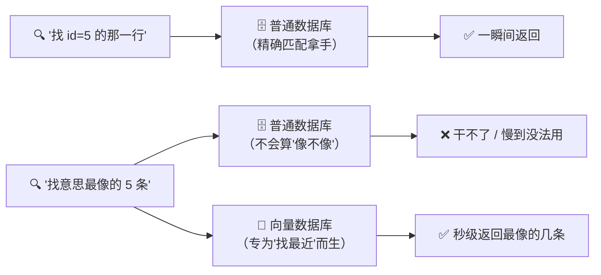
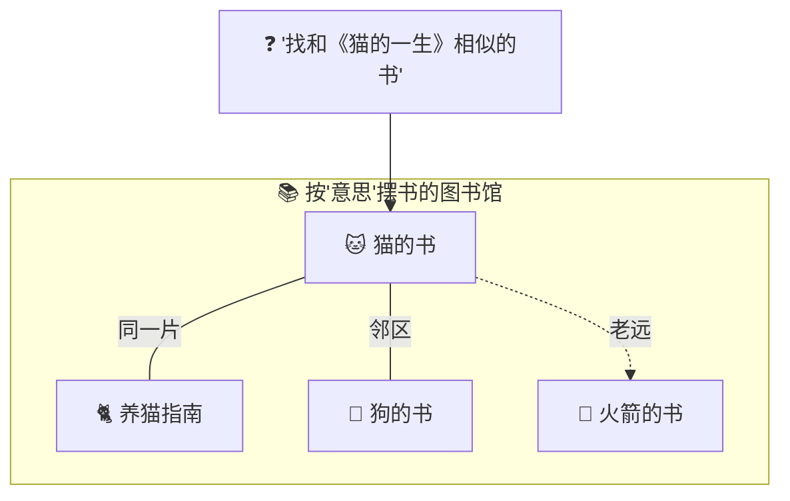
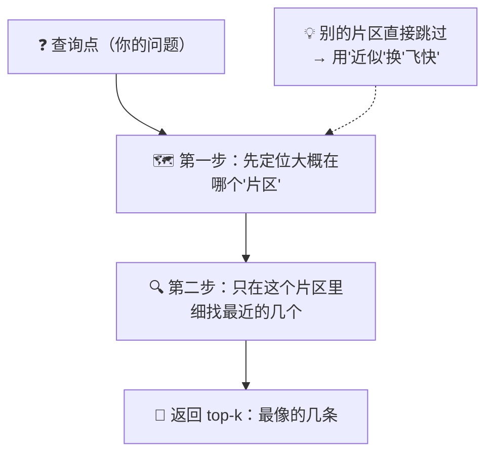
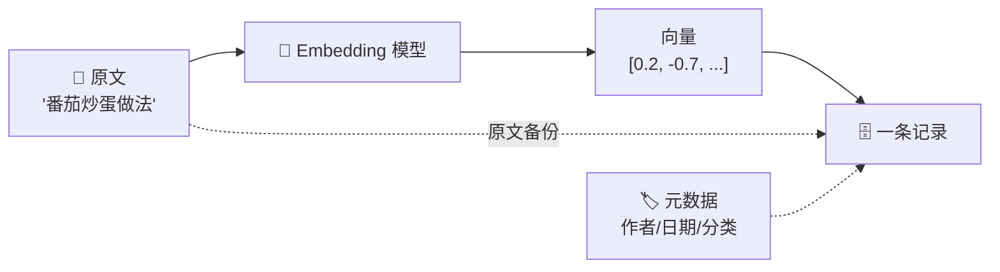
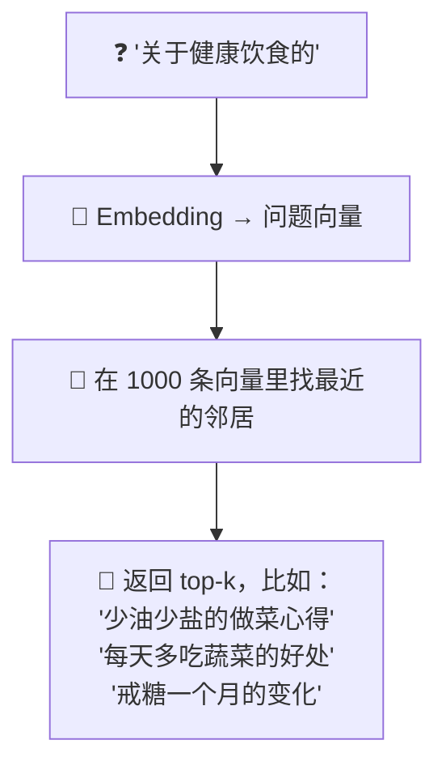
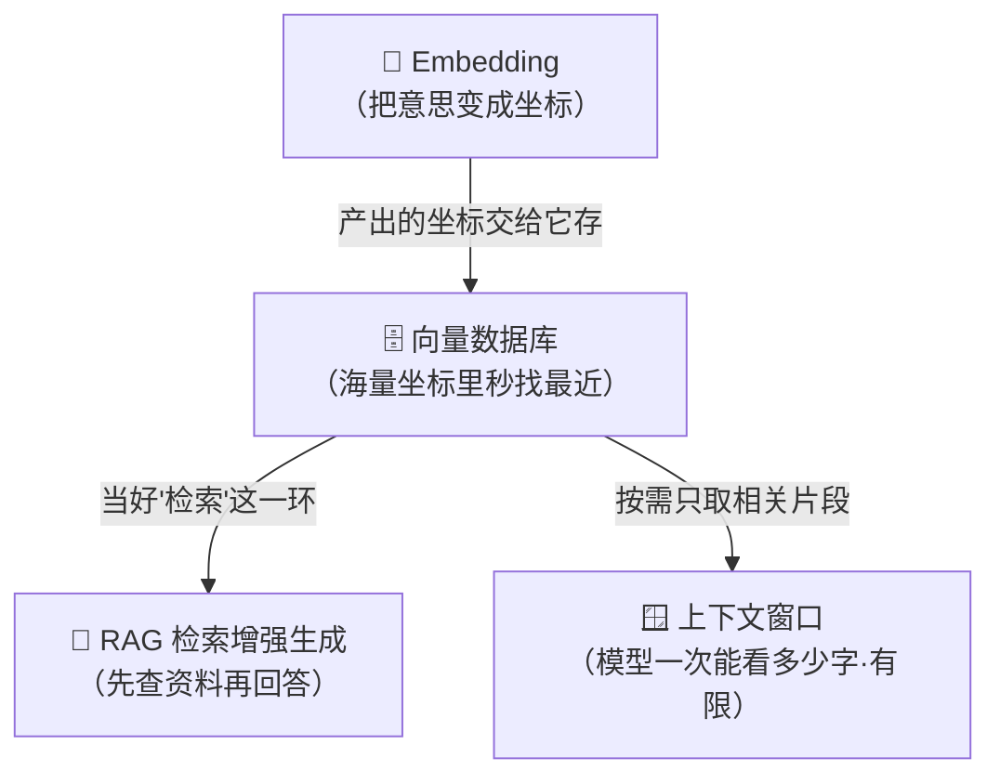

# ⑩ 什么是向量数据库（Vector Database）

> 建议先读 [⑨ 什么是 Embedding（向量）](./[CONCEPT-09]%20什么是Embedding-向量.md)。那一篇讲"一段话怎么变成一串数字（向量）、意思近的坐标就近"；这一篇往下走一步，讲一个很现实的问题：**当你有几百万条这样的向量，怎么在里面"秒级"找出和某个问题最像的几条？** 普通数据库干不了这活，得请专门的引擎。读完这篇，你就拿到了理解下一篇 [⑪ RAG 检索增强生成](./[CONCEPT-11]%20什么是RAG-检索增强生成.md) 的最后一块拼图。

---

## 一、一句话定义

**向量数据库（Vector Database）= 一种专门用来存"向量（[⑨ Embedding](./[CONCEPT-09]%20什么是Embedding-向量.md)）"、并且能飞快地帮你找出"意思最相近的几条"的数据库。**

如果你只想记住一句话，就记这句：

> **普通数据库擅长"找一模一样的"，向量数据库擅长"找意思最像的"。**

这一句话是整篇文档的骨架。后面所有的比喻、图、误区，都是在反复讲透这一句话。

```callout tip|一个比喻记一辈子
把向量数据库想成一座 +[按主题摆书的图书馆](普通图书馆按书名字母排；这座按"内容相近"扎堆——讲猫的书全在一片，讲火箭的在另一头)。你说"找和这本讲猫的书气质相似的书"，管理员不翻遍全馆，直接带你去"猫这一片"抽出最像的几本。普通数据库擅长"找一模一样的"，向量数据库擅长"找意思最像的"——记住这一句就够了～ 🦊
```

---

## 二、为什么需要向量数据库？

先回忆一下 [⑨ Embedding](./[CONCEPT-09]%20什么是Embedding-向量.md) 讲的那张"意义地图"：每段话都变成一个坐标，意思近的坐标就挨在一起。问题来了——**地图上要是钉了几百万个点，你怎么快速找出离"某个问题"最近的那几个？**

这时候你可能会想："用我熟悉的普通数据库不就行了？" 不行。普通数据库（比如 MySQL）擅长的是**精确匹配**：

- "把 id = 5 的那一行找出来" —— 拿手好戏，一瞬间搞定。
- "把年龄 = 30 的人都列出来" —— 小意思。

但你要是问它：**"帮我找出意思和这段话最接近的 5 条"**，它就傻眼了。因为"意思接近"不是"某个字段等于某个值"，而是"两个几百维的坐标离得近不近"——普通数据库根本没有为这种"找邻居"的操作做优化。



### 没有向量数据库会怎样？

你只能写个"笨办法"：拿问题的向量，**跟库里每一条向量挨个算距离**，全算完再排序取前几名。几百条还行，**几百万条就慢到天荒地老**——每来一个问题都要把整座图书馆翻一遍。向量数据库的意义，就是提前把这些点**按"谁挨着谁"整理好**，让你查的时候不用翻遍全库，只看"大概那一片"就够了。

| 有没有向量数据库 | 找"最像的几条"会怎样 | 好比 |
|------------------|----------------------|------|
| **没有（挨个硬算）** | 每次都把百万条全比一遍，慢到没法用 | 找人时挨家挨户敲门问 |
| **有** | 提前整理好邻里关系，秒级锁定最近的几条 | 直接查户口本，一下翻到那条街 |

---

## 三、核心比喻：一座"按意思摆书"的图书馆

普通图书馆按**书名首字母 / 编号**摆书——这对"我知道确切书名"很好用，但对"我想找**类似**的书"毫无帮助。

**向量数据库像一座重新装修过的图书馆：它不按书名摆，而是按"主题相近"摆书。** 讲猫的书都在一片，讲火箭的书都在另一头。你说"我想找和这本讲猫的书**气质相似**的书"，管理员不用翻遍全馆，直接带你去"猫这一片"，顺手就能抽出最像的几本。

换几个角度，用你熟悉的东西体会同一件事：

| 比喻 | 它在"找最近"什么 | 关键点 |
|------|------------------|--------|
| **按主题摆书的图书馆** | 和这本书"气质相似"的几本 | 不按书名，按内容相近扎堆 |
| **相亲平台** | 和你"性格最契合"的几个人 | 不是找名字一样的，是找最配的 |
| **地图找咖啡店** | 离我"最近的 5 家咖啡店" | 空间上的邻居，一秒圈出来 |
| **音乐 App"猜你喜欢"** | 和这首歌"曲风最近"的几首 | 听完自动推相似的，因为它们挨着 |

这几个比喻的**共同内核**：都不是"找一模一样的那一个"，而是"找周围最接近的那几个"。向量数据库干的就是这件事——**它是一台专业的"找邻居"机器**。



---

## 四、原理白话：在"高维空间"里找最近的邻居

把 [⑨ Embedding](./[CONCEPT-09]%20什么是Embedding-向量.md) 那张意义地图想象成一个**布满了点的空间**：每条资料是一个点，查询（你的问题）也是一个点。**所谓"检索"，就是给"问题这个点"找出周围离它最近的几个邻居。** 这个动作有个学名，叫**近邻搜索（Nearest Neighbor）**。

问题是：**精确地找出"绝对最近"的那几个，太慢了**——尤其点有几百万、每个点又是几百维的时候。于是向量数据库耍了个聪明的花招：**用"近似"换"速度"**。它不保证找到的是"分毫不差的最近"，但保证"快得多，且几乎总是足够近"。这类做法统称 **ANN（近似最近邻，Approximate Nearest Neighbor）**。

怎么做到"近似但快"？用一个"找餐馆"的比喻你就懂了：

> 你想在一座大城市里找"离你最近的火锅店"。**笨办法**是把全城每一家火锅店的距离都算一遍——准，但累死。**聪明办法**是：先看"我在哪个区"，只在这个区（和相邻的区）里找，别的区连看都不看。这样虽然**理论上**可能漏掉隔壁区一家其实更近的店，但**绝大多数时候**你找到的就是最近的那家，而且**快了几百倍**。



向量数据库把"先看大概哪个片区、再细找"这件事，通过**索引**（见下一节）提前建好。你查的时候，它就照着这张"分区地图"直奔目标，而不是翻遍全城。

> ⚠️ 记住这句话：**向量数据库快，是因为它"不较真"——用一点点"可能不是绝对最近"的代价，换来了几百倍的速度。** 这就是 ANN 的灵魂。

翻卡自测这个"为什么快"的核心把戏：

```flip
正面：库里有几百万条向量，向量数据库为什么能"秒级"找出最像的几条？它是把每条都比一遍吗？
---
反面：**不是逐条硬比，而是用"近似"换速度（ANN，近似最近邻）。** 打个找火锅店的比方：笨办法是算全城每家店的距离（准但累死）；聪明办法是先看"我在哪个区"，只在这个区和相邻区里找，别的区看都不看——理论上可能漏掉隔壁区一家其实更近的，但绝大多数时候找到的就是最近的，而且快了几百倍。向量数据库靠**索引**提前建好这张"分区地图"，查的时候直奔目标。代价是不保证"分毫不差的最近"，这是自觉的"速度换精度"，不是 bug。
```


---

## 五、组成：一个向量数据库是怎么干活的

一个向量数据库，核心就干三件事：**写进去、建索引、查出来**。我们一件一件拆。

| 环节 | 大白话 | 生活比喻 |
|------|--------|----------|
| **写入（建库）** | 把"文本 → 向量"，连同原文/备注一起存进去 | 图书馆进新书：登记、贴标签、上架 |
| **索引（建目录）** | 把向量按"谁挨着谁"整理好，让搜索飞快 | 图书馆的分区图 + 检索目录 |
| **查询（检索）** | 把问题变成向量，取出最近的 top-k 条 | 你查目录，直奔那一排书架 |
| **过滤（可选）** | 在"找最近"之外再加精确条件 | "只在'2024 年出版'的书里找相似的" |

### 环节一：写入（把资料存进去）

写入不是只存那一串向量。真实系统里，一条记录通常包含三样东西：



- **向量**：用来"算距离、找最近"的坐标（主角）。
- **原文**：找到之后要**拿回内容给人看**——因为向量本身[还原不回原文](./[CONCEPT-09]%20什么是Embedding-向量.md)，所以原文得单独存一份。
- **元数据（metadata）**：作者、日期、分类等"附加标签"，用来做**过滤**（下面第四样）。

### 环节二 & 三：索引 + 查询

**索引**就是第四节说的那张"分区地图"，在写入时（或之后）建好，是"查得快"的关键。**查询**时，你的问题走一遍和资料**同一个** Embedding 模型（这条铁律和 [⑨ Embedding](./[CONCEPT-09]%20什么是Embedding-向量.md) 里"存查要用同一把尺子"完全一致），变成一个查询向量，数据库照着索引直奔最近的 **top-k** 条返回。

`top-k` 里的 **k** 就是"给我返回最像的几条"——k=5 就是要最近的 5 条。

### 环节四：过滤（锦上添花）

有时你不想在"全库"里找相似，而是**先圈定范围再找相似**。比如"只在**我自己写的**笔记里，找和这个问题最像的 3 条"。这就是**带过滤条件的检索**：先用元数据（作者=我）筛掉一批，再在剩下的里面找最近邻。


把这四个环节演成一幕小短剧——把向量数据库当成一座"按意思摆书"的图书馆，看它平时怎么上架、用时怎么直奔书架：

```scene 按意思摆书的图书馆：写入、建目录、查询、过滤
📚 旁白 | 平时（没人来问），先把书一本本上架——这是"写入"。
🗄️ 向量库 | 来一份《番茄炒蛋做法》：先过 Embedding 变成坐标，再连**原文 + 标签（作者/日期/分类）**一起存成一条记录。
🗄️ 向量库 | 顺手把所有坐标按"谁挨着谁"整理成一张分区地图——这是"建索引"，查得快全靠它。
🧑 你 | （用户来了）帮我找和"西红柿鸡蛋怎么炒"最像的几篇。
🔎 向量库 | 把你这句用**同一台** Embedding 翻译机变成查询坐标，照着分区地图直奔最近的书架，取回 +[最像的 top-k 条](k 就是"返回最像的几条"·k=5 就要最近 5 条——存和查必须用同一个 Embedding 模型，这是铁律)。
🧑 你 | 我只想在"我自己 2024 年后写的"笔记里找。
🔎 向量库 | 那就先按标签筛掉一批（作者=你、日期>2024），再在剩下的里找最近邻——这是"过滤"，既对味又合规矩。
🎯 向量库 | 返回：既符合条件、意思又最像的那几条原文。
> 写进去、建目录、查出来、按需过滤——一座"按意思摆书"的图书馆，就是向量数据库的真身。
```

---

## 六、常见误区（新手最容易踩的坑）

这一节请务必逐条读完。这些误解会让你对"语义检索"的理解跑偏。

### 误区 1：以为向量数据库能替代普通数据库

- ❌ **错误理解**：既然它这么先进，那我把 MySQL 全换成向量数据库好了。
- ✅ **正确理解**：**两者各司其职，不是替代关系。** 普通数据库擅长"精确匹配、事务、账目"（找 id=5、扣款、转账）；向量数据库擅长"找意思最像的"。真实系统里**常常两个一起用**：普通库管精确数据，向量库管语义检索。用向量库去做"精确记账"，纯属杀鸡用牛刀还杀不干净。

### 误区 2：以为它存的是原文

- ❌ **错误理解**：把文档丢进向量数据库，它就把我的文章"存进去"了，跟存文件一样。
- ✅ **正确理解**：它存的**核心是向量**（那串坐标），原文只是**顺带存的一份备份**（用来找到后展示）。它对你文章的"理解"，全浓缩在那串数字里——而那串数字[还原不回原文](./[CONCEPT-09]%20什么是Embedding-向量.md)。**不存原文的话，你查到"最近的向量"却拿不回内容。**

### 误区 3：以为结果一定 100% 准

- ❌ **错误理解**：它返回的 top-k，一定是全库里"绝对最像"的那几条，一条不差。
- ✅ **正确理解**：**多数向量数据库用的是"近似"搜索（ANN）**，为了快，牺牲了一丁点"绝对精确"。绝大多数时候结果足够好，但**理论上可能漏掉"藏在别的片区里、其实更近"的那一条**。这是"速度换精度"的自觉取舍，不是 bug。

### 误区 4：以为不需要 Embedding 模型

- ❌ **错误理解**：向量数据库这么强，直接把文字丢给它就行了吧？
- ✅ **正确理解**：**它不会自己把文字变成向量。** "文字 → 向量"这一步是 [⑨ Embedding](./[CONCEPT-09]%20什么是Embedding-向量.md) 模型干的活。向量数据库只负责"**存向量、找最近**"。你得先用 Embedding 模型把文字（和问题）都变成向量，再交给它。**没有 Embedding 模型，向量数据库就是个空仓库。**

### 误区 5：以为它自己会"理解"问题

- ❌ **错误理解**：我问它"关于健康饮食的内容"，它是"读懂"了我的问题才找出来的。
- ✅ **正确理解**：**它不理解任何东西，它只会算距离。** "理解意思"这件事是 Embedding 模型在"变向量"那一刻就做完了——向量数据库拿到的已经是坐标，它做的纯粹是几何活儿："哪几个点离这个点最近"。它是个**冷冰冰的找邻居机器**，不是一个"懂你"的大脑。

---

## 七、动手小实验 / 思想实验

理论看再多，不如在脑子里走一遍。下面的实验不用写代码，只用想。

### 实验 A：给 1000 条笔记建库、再问一句

想象你把 1000 条个人笔记，一条条变成向量，全存进了向量数据库。现在你问：**"关于健康饮食的"**。

数据库会怎么做？



**关键体会**：返回的这几条，**可能一个字都没出现"健康""饮食"**！"少油少盐""多吃蔬菜""戒糖"——它们和"健康饮食"**意思上是一伙的**，所以坐标挨得近，就被捞了出来。这正是它比"关键字搜索"强的地方：**认的是意思，不是字面**。

### 实验 B：当一次"图书馆管理员"

假设你就是那座"按主题摆书"图书馆的管理员，库里有这几类书：养猫、养狗、火箭工程、健康食谱、股票投资。

有人来问："**我想找和《猫咪喂养手册》气质相似的书**"。你会怎么走？

- **不该做**：从第一本书开始，一本本翻，把全馆都比一遍（太慢）。
- **该做**：你心里有张"分区图"，直接走到"宠物/动物"那一片，从里面抽出最像的几本（养猫、养狗），别的区（火箭、股票）**看都不看**。

能想通"为什么可以对别的区看都不看"——你就理解了向量数据库靠**索引 + 近似**换速度的核心把戏。

---

## 八、和其它概念的关系

向量数据库不是孤立的，它是"语义检索"这条链上承上启下的一环。



| 概念 | 一句话关系 | 类比 |
|------|-----------|------|
| [⑨ Embedding](./[CONCEPT-09]%20什么是Embedding-向量.md) | 向量数据库就是 **Embedding 的仓库**——它存的、它找的，都是 Embedding 产出的向量 | 尺子量出的坐标，得有个抽屉收好 |
| **⑩ 向量数据库（本篇）** | 专门"存海量向量、秒找最近几个"的引擎 | 按意思归置的超级图书馆 |
| [⑪ RAG](./[CONCEPT-11]%20什么是RAG-检索增强生成.md) | 向量数据库是 RAG 里**"检索"那一环**——先靠它找到相关资料，再喂给大模型作答 | 开卷考试里"翻到对的那页"的动作 |
| [⑧ 上下文窗口](./[CONCEPT-08]%20什么是Context与Token-上下文与令牌.md) | 模型一次看不了那么多字；向量库帮它**按需只捞相关的几段**，绕开容量限制 | 书太厚看不完，只翻用得上的那几页 |

一句话串起来：**Embedding 把意思变坐标 → 向量数据库把海量坐标管起来、能秒找最近 → RAG 靠它"先查后答" → 从而让上下文有限的大模型也能用上一整个知识库。** 向量数据库是这条链上**"检索"那台发动机**。

---

## 九、和 Khy-OS 的关系

一句话先说结论：**凡是"按语义召回相关记忆 / 文档"的场景，背后干活的大概率就是向量检索。**

在一个 AI 编程助手里，"按意思捞出相关内容"是反复出现的需求，比如：

- **相关记忆召回**：面对一个新任务时，把过去积累的、**意思最接近**的几条经验捞回来参考——而不是让模型从零硬想。这正是"给问题找最近邻"。
- **文档 / 资料检索**：你想找"讲某个主题"的文档，却说不清确切标题——靠字面搜不到，靠"意思相近"才能捞出来。

这些场景的共同点，都是那句老话：**"意思近 = 坐标近"**，先把内容变成向量存进一个能"秒找最近"的地方，再按距离取回最相关的几条。所以你只要在文档或系统里看到"语义检索""相关内容召回""按相似度取回"这类字眼，就可以在心里默念一句：**"哦，这底下多半有个向量检索在干活。"**

> ⚠️ 这里只讲"概念级"的关系——**"要按意思召回，就先变成向量、再找最近"**。至于 Khy-OS 具体在哪些模块、用哪个引擎、怎么落地，属于设计与实现层面，你可以在 [`docs/03_DESIGN_设计`](../03_DESIGN_设计) 目录里进一步了解。本文不涉及、也不编造具体的函数名或文件名。

---

## 十、小结 + 下一步

- **向量数据库 = 专门存"向量（Embedding）"、并能秒级找出"意思最相近几条"的数据库。**
- 为什么需要它：普通数据库擅长"精确匹配"（找 id=5），不擅长"找意思最像的"；几百万条向量要秒级找最近邻，得请专门的引擎。
- 原理白话：把所有向量看成高维空间里的点，查询 = 给一个点找**最近的邻居（近邻搜索）**；精确太慢，所以用**"近似"换速度**（先看大概哪个片区，再细找）。
- 组成三件事：**写入**（文本→向量，连同原文/元数据入库）、**索引**（让搜索飞快）、**查询**（问题→向量→取 top-k），还可加**过滤条件**。
- 五大误区：它**不替代普通数据库**、存的**核心是向量不是原文**、结果**不保证 100% 绝对最近**、它**离不开 Embedding 模型**、它**不"理解"问题、只会算距离**。
- 它是 [⑨ Embedding](./[CONCEPT-09]%20什么是Embedding-向量.md) 的仓库、[⑪ RAG](./[CONCEPT-11]%20什么是RAG-检索增强生成.md) 的"检索"那一环，还帮上下文有限的大模型**按需取相关片段**。

```quiz
Q: 关于向量数据库，下面哪些说法是对的？（可多选）
- [x] 它擅长"找意思最像的几条"，普通数据库擅长"找一模一样的"，两者常常一起用
- [x] 它离不开 Embedding 模型——"文字→向量"这步是 Embedding 干的，它只负责存向量、找最近
- [ ] 它能把文字直接丢进去，自己就会理解并变成向量
- [ ] 它返回的结果一定是全库里绝对最近的那几条，一条不差
> 前两个对：向量库和普通库各司其职（一个管语义检索、一个管精确记账），且向量库本身不会把文字变向量、离不开 Embedding 模型。后两个错——它不理解任何东西，只会算距离；而且多数用"近似搜索（ANN）"换速度，理论上可能漏掉藏在别的片区里其实更近的那一条。抓住"找最像 vs 找一样""离不开 Embedding""近似换速度"这三点，这块拼图就齐了。
```

👉 [⑪ 什么是 RAG（检索增强生成）](./[CONCEPT-11]%20什么是RAG-检索增强生成.md)
