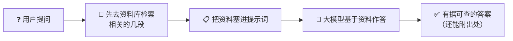
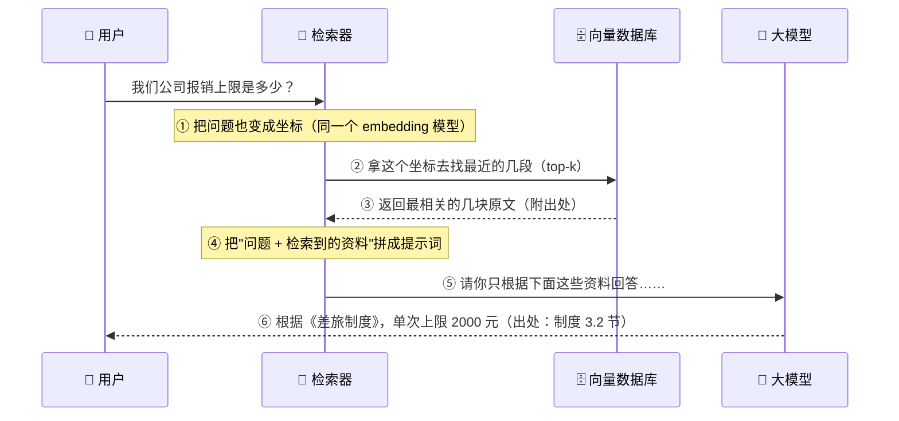
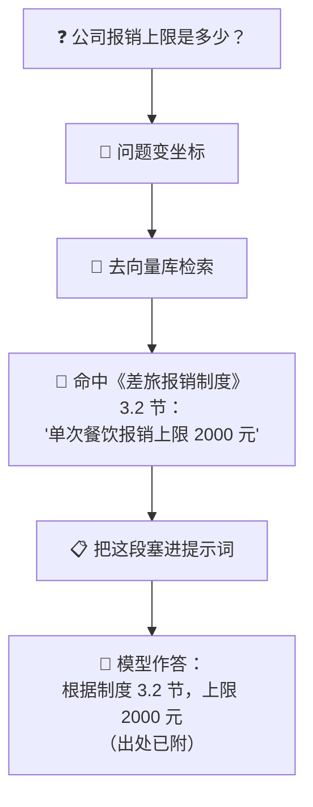
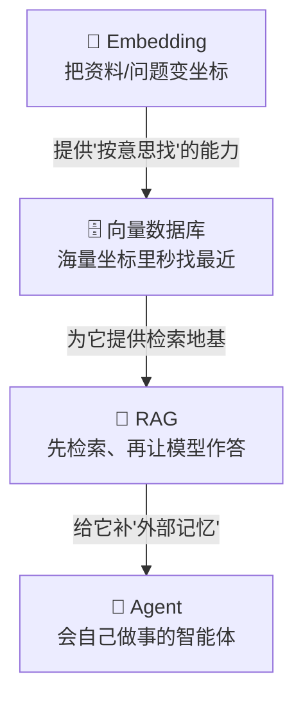

# ⑪ 什么是 RAG（检索增强生成）

> 建议先读 [⑩ 什么是向量数据库](./[CONCEPT-10]%20什么是向量数据库.md)（它讲"海量坐标里怎么秒找最近几个"），再往上追一层还有 [⑨ Embedding](./[CONCEPT-09]%20什么是Embedding-向量.md)（把文字变成坐标）。这一篇是把前面几块砖**垒成一栋楼**：让大模型在回答之前，先去资料库里"翻书"，再照着书答。读完这篇，你就明白了当下 AI 产品里最常见的一个套路——**先查后答**。

---

## 一、一句话定义

**RAG（Retrieval-Augmented Generation，检索增强生成）= 大模型在回答之前，先去一个"资料库"里检索出相关资料，把资料塞进提示词，再让模型基于这些资料作答。**

如果你只想记住一句话，就记这句：

> **RAG = 让大模型从"闭卷考试"变成"开卷考试"——先翻书，再答题。**

这一句话是整篇文档的骨架。后面所有的比喻、图、误区，都是在反复讲透这一句话。

```callout ask|小白发问
RAG 三个字母听着唬人，其实就是给爱面子、爱瞎编的大模型配一本 +[参考书](资料库——回答前先去里面翻出相关的几段，照着答，还能标出处)。它把"闭卷凭记忆硬答"变成"开卷翻书再答"。你不用懂任何数学，只要记住"先查后答"四个字，这篇就抓住了七成～ 🐥
```


---

## 二、为什么需要 RAG？（把痛点讲透）

大模型很聪明，但它有三个"天生的毛病"。RAG 不是让模型变聪明，而是**给它配一个可靠的资料库，把这三个毛病一次治好**。

### 痛点①：它会一本正经地"瞎编"（幻觉）

[⑥ 大语言模型](./[CONCEPT-06]%20什么是LLM-大语言模型.md) 本质是"猜下一个字"的高手。你问它一个它没把握的问题，它**不会说"我不知道"，而是编一个听起来很像真的答案**——这就是**幻觉**。就像一个特别爱面子的学生，明明不会，也要硬扯一段，还扯得有鼻子有眼。

### 痛点②：它的知识"停在了某一刻"，也不知道你的私事

模型是被"训练"出来的，它脑子里的知识**冻结在训练完成的那一天**。训练之后发生的新闻、你们公司上周才改的报销制度、你昨天写的代码——它**统统不知道**。它像一个几年前出国、再没回来的人，你问他"现在家乡房价多少"，他只能报几年前的旧数。

### 痛点③：你的资料太多，一次塞不进它的"脑容量"

模型一次能读多少字，受 [⑧ 上下文窗口](./[CONCEPT-08]%20什么是Context与Token-上下文与令牌.md) 限制。你们公司有几千页文档，**根本塞不进去**。就算硬塞得下，全塞进去又贵又慢，还会淹没重点。

**RAG 一招治三病：**

| 痛点 | 光靠模型 | 加上 RAG |
|------|----------|----------|
| **① 幻觉** | 没把握也硬编 | 答案有资料撑腰，还能附**出处**，可溯源 |
| **② 知识过时/不懂私料** | 停在训练时刻 | 资料库**随时更新**，私有文档也能查 |
| **③ 装不下全部文档** | 塞不进上下文窗口 | 每次**只取最相关的几段**，省地方又抓重点 |



---

## 三、核心比喻：闭卷考试 vs 开卷考试

这是全篇最重要的一张画面，请务必在脑子里建立它。

- **闭卷考试（纯模型）**：不许翻书，全凭脑子里记住的东西答。记得清就答对，记不清就**开始编**——这就是幻觉的来源。
- **开卷考试（RAG）**：允许翻书。遇到不确定的，**先翻到对的那一页，看清楚了再落笔**。答案不但更准，还能告诉你"这是从第几页抄的"。

换几个你熟悉的场景，体会同一件事：

| 比喻 | "先查后答"体现在哪 | 关键点 |
|------|--------------------|--------|
| **开卷考试** | 先翻书找到对应章节，再答题 | 不靠死记，靠"现查" |
| **律师打官司** | 先翻出相关判例、法条，再当庭陈述 | 张口就得有依据，不能凭感觉 |
| **医生看病** | 先调出你的病历、化验单，再下诊断 | 照着你的真实资料，而不是"一般人怎样" |
| **客服查工单** | 先搜到你这单的记录，再回答你 | 答的是"你的情况"，不是套话 |

这四个比喻的**共同内核**：**先去权威资料里捞出相关的那几条，再基于它开口。** RAG 干的就是这件事——把"凭记忆答"升级成"查了资料再答"。

---

## 四、逐步拆解：RAG 到底怎么跑起来

RAG 分成**两个阶段**：一个是**平时就准备好**的（建库，离线），一个是**用户提问时才发生**的（问答，在线）。就像开卷考试前你得先把书带进考场（建库），考试时才现场翻（问答）。

### 阶段一：离线建库（把书搬进考场）

平时（用户还没来问）就把资料准备好、变成可以"按意思检索"的形态：

1. **切块（chunk）**：把每份文档切成一小段一小段。因为整本书太大，检索和塞进提示词都不方便，切成"一节一节"才好取用。
2. **变坐标（[⑨ embedding](./[CONCEPT-09]%20什么是Embedding-向量.md)）**：把每一块文字丢进 embedding 模型，变成一串数字（向量 / 坐标）。
3. **入库（[⑩ 向量数据库](./[CONCEPT-10]%20什么是向量数据库.md)）**：把这些坐标连同原文一起，存进向量数据库，等着以后被查。


### 阶段二：在线问答（考场里现翻书）

用户真的来提问了，才发生下面这一串——注意，这就是一次完整的 RAG：



一步步说人话：

| 步骤 | 发生了什么 | 生活比喻 |
|------|-----------|----------|
| **① 问题变坐标** | 用**同一台**翻译机（embedding 模型）把问题也变成向量 | 用同一把尺子量，才能比 |
| **② 检索 top-k** | 拿问题坐标，去库里找**离得最近的 k 段**（k 通常是 3~8） | 翻到最相关的那几页 |
| **③ 取回原文** | 把这几段的原文捞出来（可能还带着"来自哪份文档"） | 把书签夹好的几页抽出来 |
| **④ 拼提示词** | 把"问题 + 这几段资料"组装成一段话喂给模型 | 把书摊在桌上、指着问 |
| **⑤ 模型作答** | 模型**基于这些资料**生成答案，而不是凭记忆 | 照着书答题 |
| **⑥ 附出处** | 好的 RAG 会告诉你答案来自哪段资料，可核对 | 标注"见第 3.2 节" |

### 最关键的一点：模型没变，只是"喂了它资料"

整个过程中，**大模型一个字都没被重新训练**。它还是那个模型，只不过这一次，你在提问时**顺手把参考资料一起递给了它**。这是 RAG 最容易被误解、也最需要记牢的地方（下面误区 1 会专门讲）。

```callout star|划重点
RAG 的魔法不在模型，而在"**喂什么给模型**"。同一个模型，不给资料就闭卷瞎编，给了对的资料就开卷精准。RAG 干的活，全在"**检索出对的那几段、塞进提示词**"这一下。
```

```flip
RAG 和"重新训练模型"到底差在哪？（点一下翻到背面）
---
**训练**是改大脑（改模型参数，慢、贵、需要 GPU）；**RAG**是发资料（模型一个字没动，只是提问时多塞了几段参考资料）。所以给 RAG 换知识，只要往库里加文档就行，秒级生效——这就是它比"重新训练"香太多的原因。
```

把上面这套"检索→塞资料→照着答"的流程演成一幕小短剧——同一个模型、同一个问题，看给不给它资料，结果差多远：

```scene 开卷考试现场：同一个模型，给不给资料两个样
🧑 你 | 我们公司报销上限是多少？
> 场景一：闭卷。不给任何资料，让它凭记忆答。
🤖 模型（闭卷） | 呃……一般公司大概是 500 元吧？（它根本没见过你公司的制度，只能顺口编一个）
😰 旁白 | 通顺、自信——但纯属瞎猜，你要真信了就踩坑了。
> 场景二：开卷。先让检索器去资料库里翻。
🔎 检索器 | 把问题变成坐标，去库里找最近的几段……翻到了《差旅制度》3.2 节。
🔎 检索器 | 把「问题 + 这段原文」拼成提示词，递给模型：请只根据下面这段资料回答。
🤖 模型（开卷） | 根据《差旅制度》3.2 节：单次报销上限 2000 元。+[（出处：制度 3.2 节）](好的 RAG 会告诉你答案来自哪段资料，可核对——这是"有据可查"和"凭空瞎编"的分水岭)
> 模型一个字都没重新训练，变的只是"这次多塞了对的资料给它"——这就是 RAG 的全部魔法。
```

---

## 五、RAG 不是万能：它也会答错

RAG 让答案"有据可查"，但**"据"错了、"据"没查到，答案照样会错**。别把 RAG 当成"永不出错"的魔法。它最常见的两种翻车：

- **检索不到 / 检索错了**：库里根本没有相关资料，或者切块切得太碎/太乱，导致该取的没取到、取来一堆不相关的。模型拿到一堆没用的资料，**照样答不好**。
- **切块质量差**：一段完整的意思被从中间切断，检索时只捞到半句话，模型看着残缺的资料，自然容易理解偏。

一句话：**RAG 的答案上限，取决于"检索出来的资料好不好"。** 检索是地基，地基歪了，楼盖不正。所以真实系统里，"怎么切块、检索几段、怎么排序"是要反复调的手艺活。

---

## 六、常见误区（新手最容易踩的坑）

这一节请务必逐条读完。这些误解会让你对整个"先查后答"的理解跑偏。

### 误区 1：以为 RAG 是"重新训练模型"

- ❌ **错误理解**：用 RAG 就是拿我的文档去"再训练"一遍模型，让它记住这些资料。
- ✅ **正确理解**：**模型一个字都没动！** RAG 只是在**提问的时候**把相关资料一起喂进去。改变的是"这次给它看了什么参考资料"，不是模型本身。换资料库、加新文档，随时生效，**根本不用碰模型**——这也正是 RAG 便宜、灵活的原因。

### 误区 2：以为有了 RAG 就"绝不幻觉"

- ❌ **错误理解**：接上资料库，模型就再也不会瞎编了。
- ✅ **正确理解**：RAG 能**大幅减少**幻觉，但不能**根除**。如果检索没捞到对的资料，或者模型没老实照资料答（跑偏去用了自己的记忆），照样会编。RAG 是"给它一本参考书"，不是"给它上了封口令"。

### 误区 3：以为塞越多资料越好

- ❌ **错误理解**：多多益善，把能找到的资料全塞进提示词，答得肯定更全。
- ✅ **正确理解**：**塞太多反而更差。** 一是无关资料会变成**噪音**，把真正有用的那段淹没，模型抓不住重点；二是资料越多越占 [⑧ 上下文窗口](./[CONCEPT-08]%20什么是Context与Token-上下文与令牌.md)，又贵又慢。所以只取"最相关的几段（top-k）"，**宁精勿滥**。

### 误区 4：以为 RAG 就是"搜索引擎"

- ❌ **错误理解**：RAG 不就是搜一下、把结果丢给我看嘛，跟百度谷歌一个意思。
- ✅ **正确理解**：搜索引擎**把资料丢给你，你自己读**；RAG 是**把资料丢给模型，模型消化后用人话直接回答你**。RAG = 检索 **+ 让模型基于检索结果生成答案**，多了"消化再作答"这关键一步。搜索给你一堆链接，RAG 给你一个（有出处的）答案。

### 误区 5：以为不用向量库、随便搜搜也一样

- ❌ **错误理解**：检索嘛，用关键词搜一下不就行了，何必搞什么向量数据库。
- ✅ **正确理解**：关键词检索**也算"检索"**（广义的 RAG 里检索方式可以有多种），但它只认**字面**——你搜"退货"，文档写"退款"就漏了。要按**意思**检索（"番茄"能配到"西红柿"），才需要 [⑨ embedding](./[CONCEPT-09]%20什么是Embedding-向量.md) + [⑩ 向量数据库](./[CONCEPT-10]%20什么是向量数据库.md)。**语义检索靠向量**，这正是 RAG 常和向量库绑在一起的原因。

---

## 七、动手小实验 / 思想实验

理论看再多，不如在脑子里把这一趟走一遍。下面的实验不用写代码，只用想。

### 实验 A：报销上限，两种答法

有人问 AI 助手：**"我们公司的报销上限是多少？"**

**闭卷（纯模型）会怎样？** 模型不可能知道你们公司的内部制度（这是它训练时看不到的私有信息）。它要么老实说"我不知道"，要么——更常见——**编一个听起来很合理的数**，比如"一般是 1000 元"。你要是信了，就踩坑了。

**开卷（RAG）会怎样？**



同一个问题，**闭卷靠猜、开卷靠查**。差别不在模型聪不聪明，而在**有没有先把对的资料递到它面前**。

### 实验 B：当一次"切块"的裁判

想象你要把这段话放进资料库：

> "差旅报销：餐饮单次上限 2000 元；交通凭票实报；住宿一线城市每晚上限 600 元。"

如果切块切得太碎，把"住宿一线城市每晚上限"和"600 元"切到了两块里，检索"住宿能报多少"时可能只捞到前半句——模型看着"住宿一线城市每晚上限"却没有数字，就抓瞎了。**体会一下：切块是门手艺，切得好检索才准。** 这就是第五节说的"RAG 的上限取决于检索质量"。

```quiz
Q: RAG 和"重新训练模型"最本质的区别是什么？
- [ ] RAG 也要改模型的参数，只是改得少
- [x] RAG 完全不改模型，只是在提问时把检索到的资料一起喂进去
- [ ] RAG 是把模型换成一个更大的
- [ ] RAG 就是关键词搜索，和模型无关
> 记住"开卷考试"比喻：考生（模型）没变，只是这次允许他翻书（检索资料）。换本书、加几页，随时生效，根本不用把考生"回炉重造"。
```

---

## 八、和其它概念的关系

RAG 不是凭空冒出来的，它**站在前面好几块砖的肩膀上**，也和"工具调用"是一对好搭档。



| 概念 | 一句话关系 | 类比 |
|------|-----------|------|
| [⑨ Embedding](./[CONCEPT-09]%20什么是Embedding-向量.md) | RAG 靠它把资料和问题变成坐标，才能"按意思检索" | 造尺子的手艺 |
| [⑩ 向量数据库](./[CONCEPT-10]%20什么是向量数据库.md) | RAG 的"资料库"通常就是它，负责秒找最近的几段 | 按意思归置的超级图书馆 |
| [② 工具调用](./[CONCEPT-02]%20什么是ToolCalling-工具调用.md) | 和 RAG 是**两种给模型补外部信息的路子**：RAG **喂资料**给它读，工具让它**动手去取** | 递书 vs 派人去跑腿 |
| [① Agent](./[CONCEPT-01]%20什么是Agent-智能体.md) | RAG 给 Agent 补一份"外部记忆"，让它记得住海量资料 | 给智能体配一个随身档案柜 |

### 单独说说：RAG 和工具调用的分工

新手常把这两个搞混，其实它俩解决的是同一类需求（**模型脑子里没有的信息，怎么补进来**）的两条不同路子：

- **RAG（喂资料）**：系统**主动**先检索好相关资料，**塞进提示词**递给模型。模型只管"读了再答"，不用自己动手。适合"知识/文档类"信息。
- **工具调用（让它取）**：模型**自己决定**"我需要读某个文件 / 查某个接口"，然后 [② 发起一次工具调用](./[CONCEPT-02]%20什么是ToolCalling-工具调用.md) 去实时取。适合"现场、动态、要执行"的信息。

一句话记住：**RAG 是"我先把书翻好摊你面前"，工具调用是"你自己说要哪本、我派人去拿"。** 两者常常配合使用，不是二选一。

---

## 九、和 Khy-OS 的关系

一句话先说结论：**凡是"先查资料、再照着资料作答"或"把过去的经验召回来参考"的场景，背后就是 RAG 的思路。**

在一个 AI 编程助手里，"先查后答"是个反复出现的需求，比如：

- **资料/文档问答**：你问"这个项目的某某约定是什么"，与其让模型凭记忆猜，不如**先检索到相关的文档片段，再让它照着答**——这就是 RAG 的典型形态。
- **记忆召回**：把过去的经验、笔记按"意思"存好（靠 [⑨ Embedding](./[CONCEPT-09]%20什么是Embedding-向量.md) + [⑩ 向量数据库](./[CONCEPT-10]%20什么是向量数据库.md)），遇到相似的新任务时，**把最相关的几条捞回来喂给模型**参考，而不是让它从零硬想。这本质上也是一次"检索增强"。

这些场景的共同点，都是那句话：**先检索出相关的那几段，再让模型基于它作答。** 所以你只要在文档或系统里看到"资料问答""相关经验召回""按相似度检索后再回答"这类字眼，就可以在心里默念一句：**"哦，这是 RAG 的路子。"**

> ⚠️ 这里只讲"概念级"的关系——**"要照资料答，就先检索再喂给模型"**。至于 Khy-OS 具体在哪些模块、用什么检索方式、怎么落地，属于设计与实现层面，你可以在 [`docs/03_DESIGN_设计`](../03_DESIGN_设计) 目录里进一步了解。本文不涉及、也不编造具体的函数名或文件名。

---

## 十、小结 + 下一步

- **RAG（检索增强生成）= 回答前先去资料库检索相关资料，塞进提示词，再让模型基于资料作答。** 一句话：**从闭卷变开卷，先翻书再答题。**
- 它一招治三病：**减少幻觉**（答案有据、可溯源）、**知识随时更新**（改资料库不用碰模型）、**绕开上下文窗口**（每次只取最相关的几段）。
- 两个阶段：**离线建库**（文档 → 切块 → embedding → 存进向量库）+ **在线问答**（问题 → 变坐标 → 检索 top-k → 拼进提示词 → 作答 → 附出处）。
- **模型没变，变的只是"喂了它什么资料"**——这是 RAG 最核心、最容易被误解的一点。
- 它**不是万能**：检索不到、切块差，照样答错；RAG 的上限取决于检索质量。
- 五大误区：它**不是重新训练**、有它也**不能保证零幻觉**、资料**不是越多越好**、它**不等于搜索引擎**（多了"让模型消化再作答"）、**语义检索靠向量**。
- 它站在 **Embedding + 向量数据库** 的肩上，和 **工具调用**是"喂资料 vs 让它取"的两条路，还给 **Agent** 补了一份外部记忆。

👉 [⑫ 什么是机器学习（Machine Learning）](./[CONCEPT-12]%20什么是机器学习-MachineLearning.md)
