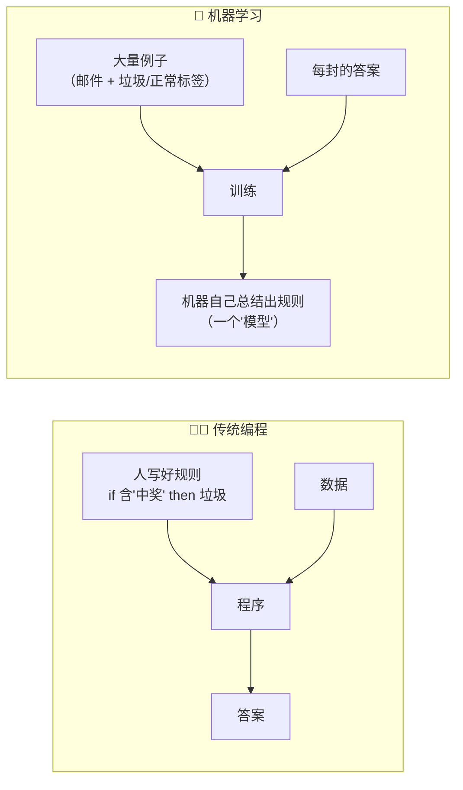
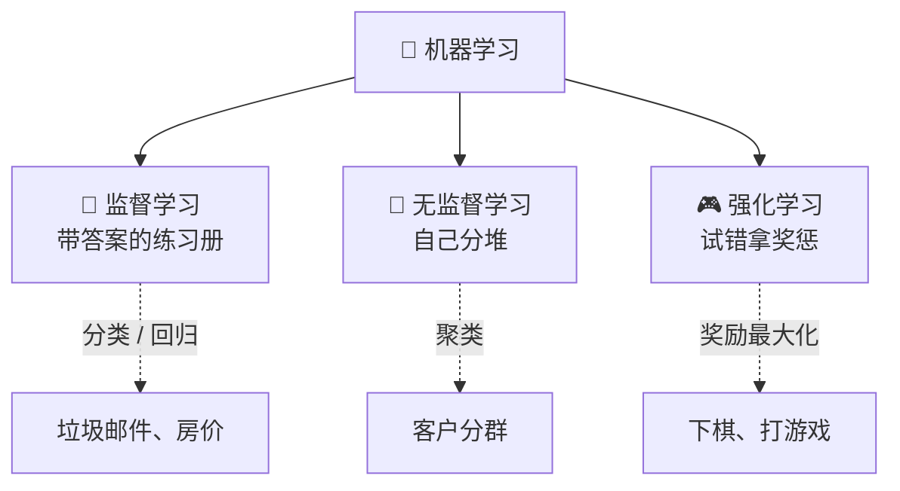
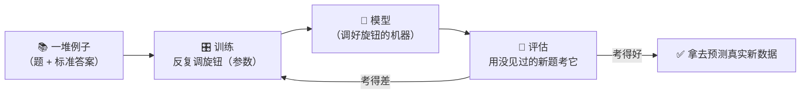
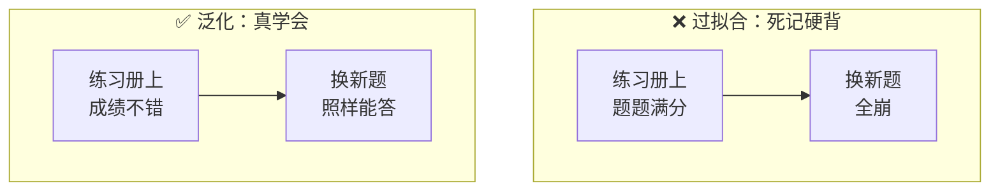
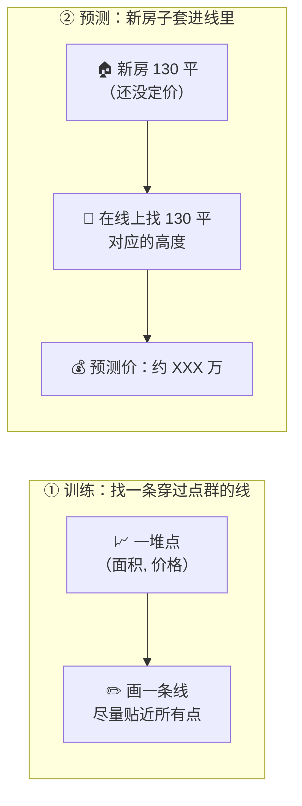
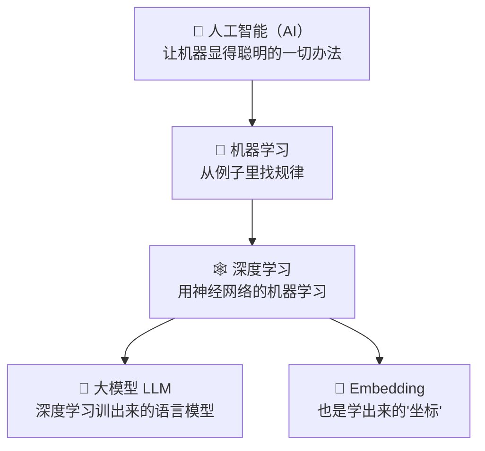

# ⑫ 什么是机器学习（Machine Learning）

> 建议先读 [⑪ 什么是 RAG（检索增强生成）](./[CONCEPT-11]%20什么是RAG-检索增强生成.md)。那一篇讲"怎么让模型先查资料再回答"；这一篇往回退一大步，问一个更根本的问题：**这些又是查资料、又是懂意思的"模型"，到底是怎么"学会"这些本事的？** 它们不是人一条条写死的规则，而是从一大堆例子里"自己找出来的规律"。读完这篇，你就拿到了理解下一篇 [⑬ 深度学习](./[CONCEPT-13]%20什么是深度学习-DeepLearning.md) 的钥匙。

---

## 一、一句话定义

**机器学习（Machine Learning，简称 ML）= 不靠人一条条写死规则，而是给机器大量"例子"，让它自己从例子里"找规律"，学会做判断和预测。**

如果你只想记住一句话，就记这句：

> **机器学习 = 喂例子，不喂规则；规则由机器自己从例子里总结出来。**

这一句话是整篇文档的骨架。后面所有的比喻、图、误区，都是在反复讲透这一句话。

```callout ask|小白发问
"机器学习"四个字听着像高数，其实道理糙得很：不是人把 +[规则](像"如果标题含'中奖'就是垃圾邮件"这种一条条写死的判断逻辑)一条条写死，而是丢给机器一大堆例子，让它自己看出门道。就像你教小孩认猫——从不背定义，指着一只只猫说"这是猫"，看多了他自己就会了。这一篇不需要你会任何数学，只要跟着"喂例子、不喂规则"这根线走就行～ 🐥
```


---

## 二、为什么需要机器学习？

因为有太多事情，**人根本写不出"规则"来**。

想象你要写一个程序，判断一封邮件是不是垃圾邮件。传统做法是**人来写规则**：

- 如果标题里有"中奖"，就是垃圾邮件；
- 如果正文里有"点击链接领红包"，就是垃圾邮件；
- 如果发件人不在通讯录，就……

写着写着你会发现：**规则永远写不完**。骗子换个说法（"恭喜您获得幸运名额"），你的规则就漏了；正常邮件里也可能出现"中奖"（同事发你"公司抽奖活动通知"），你的规则又误伤了。**世界太复杂，人手写规则堵不住所有窟窿。**

机器学习换了个思路：**别让人写规则了，直接把一大堆"已经标好垃圾/正常"的邮件例子丢给机器，让它自己去总结"垃圾邮件长什么样"。**

这就像**教小孩认猫**：你不会给孩子背一条定义（"四条腿、有胡须、会喵喵叫、瞳孔竖着的哺乳动物"）——你只是指着一只只猫说"这是猫、这也是猫"，看多了，孩子自己就认得出猫了，哪怕是一只他从没见过的猫。**孩子学到的不是定义，是"从很多例子里自己长出来的感觉"。** 机器学习就是让机器也这样学。



### 没有机器学习会怎样？

那就只能一直靠人手写规则。**能写清楚规则的事**（比如"闰年怎么算""个税怎么扣"），手写规则又快又准，根本用不着机器学习。但一旦碰上"说不清规则、但一看就知道"的事——认猫、认字、判断这句话什么情绪、预测明天房价——手写规则就彻底抓瞎了。机器学习就是专门对付这类"只可意会、难以言传"的问题。

| 有没有机器学习 | 能对付什么问题 | 好比 |
|----------------|----------------|------|
| **没有（只有手写规则）** | 只能做"能写清楚规则"的事，规则一多就写不完、堵不住 | 靠背条文办事的呆板职员 |
| **有** | 能对付"说不清规则、但有大量例子"的事 | 看多了自然会认的老师傅 |

---

## 三、三大类机器学习（白话 + 比喻）

机器学习按"给机器的例子长什么样"，大致分三类。用**学生怎么学习**来体会最直观。

| 类别 | 一句话 | 生活比喻 | 典型用途 |
|------|--------|----------|----------|
| **监督学习** | 给的例子**带标准答案**，看着答案学 | 做**带答案的练习册**：看题目 + 对答案，慢慢学会 | 垃圾邮件分类、房价预测、图片认猫 |
| **无监督学习** | 给的例子**没有答案**，自己找规律分堆 | 把一桌**没贴标签的东西**自己归类摆好 | 客户分群、异常检测 |
| **强化学习** | 没有标准答案，靠**试错拿奖惩**慢慢变强 | 打游戏：**做对加分、做错扣分**，越练越溜 | 下棋、打游戏、机器人控制 |

### 监督学习：有标准答案的练习册

这是最常见、最好懂的一类。你给机器的每个例子都**配好了标准答案**：

- 例子：这封邮件 → 答案：垃圾邮件；
- 例子：这套房 120 平、市中心 → 答案：卖了 500 万；
- 例子：这张图 → 答案：猫。

机器就像一个刷练习册的学生：**看着题目和标准答案，反复对照，慢慢学会"给一道新题，我该答什么"。** "垃圾/正常"这种答案是**分类**（选项题），"房价多少万"这种答案是**回归**（填数值题）。

### 无监督学习：没答案，自己分堆

这次例子**不带答案**了。你给机器一堆客户的消费记录，**不告诉它谁是谁**，让它自己看着办——它会把"消费习惯像的人"自动归成一堆一堆。

就像你把一整箱乱七八糟的乐高倒在地上，**没人告诉你怎么分**，但你自然会把"红色的、方块的、轮子"各归一堆。机器也一样：**没有标准答案，它就自己找"谁和谁像"，把像的凑一块。**

### 强化学习：试错拿奖惩

这类最像"打游戏练级"。没有人手把手告诉它每一步的标准答案，只有一个**分数（奖励）**：做对了加分，做错了扣分。机器就一遍遍地试，**专挑"能拿更多分"的做法**，越练越强。

下棋的 AI 就是这么练出来的：**没人教它每步该怎么走，它自己跟自己下几百万盘，赢了的走法就"记一功"，输了的就"记一过"**，慢慢就成了高手。



---

## 四、核心流程：一个模型是怎么"练"出来的（逐步拆解）

不管哪一类，监督学习这条主线最能说清"机器到底怎么学"。用**考前刷题 → 上考场**这个人人都懂的比喻，一步步拆开。

| 步骤 | 发生了什么 | 刷题比喻 |
|------|-----------|----------|
| **① 收集数据** | 弄来一大堆例子（越多、越干净越好） | 找来一大摞历年真题 |
| **② 提取特征** | 从每个例子里挑出"有用的线索"喂给机器 | 把每道题的关键条件划出来 |
| **③ 训练** | 机器反复看例子，**一点点调自己的"参数"**，让预测越来越准 | 刷题：做错了就改，越刷越会 |
| **④ 评估** | 用**没见过的新题**考它，看它到底学没学会 | 上考场，做真考卷 |
| **⑤ 预测（应用）** | 学会了，就拿它去判断真实世界里的新东西 | 毕业后用学到的本事干活 |

### 说说"特征"是什么

**特征（feature）= 你挑给机器看的"线索"。** 预测房价，你不会把整套房的所有信息一股脑丢进去，而是挑出几条关键线索：面积、地段、楼层、房龄……这几条就是**特征**。挑对特征，机器学得又快又准；喂一堆没用的线索（比如"房主的名字"），只会添乱。

就像医生看病：他不会问你"今天穿什么颜色的袜子"，只会问**发烧几度、咳不咳、哪里疼**——这几条才是有用的"特征"。

### 说说"训练"到底在干嘛

**训练 = 机器反复对照例子，一点点调整自己内部的"参数"，让它的预测越来越贴近正确答案。** 你可以把"参数"想成一台机器上密密麻麻的**旋钮**。一开始旋钮都是乱的，预测得一塌糊涂；每看一个例子、发现自己答错了，就**把旋钮往"答得更对"的方向拧一点点**。看几百万个例子、拧几百万次之后，旋钮就调到了一个"整体答得都挺准"的位置——**这台调好旋钮的机器，就叫"模型"。**

```flip
"训练模型"这么玄，一句话说的到底是啥？（点一下翻到背面）
---
就是**反复拧旋钮**：机器身上有一堆参数（旋钮），拿例子一个个考它，答错就把旋钮往"更对"的方向拧一丢丢，拧几百万次，旋钮就停在"整体都挺准"的位置。**那台旋钮调好了的机器，就叫"模型"**——没有魔法，只有"看错题、改一点、再看、再改"。
```




---

## 五、几个关键概念（白话版）

这几个词你一定会反复听到，趁早用大白话钉住。

| 名词 | 大白话 | 生活比喻 |
|------|--------|----------|
| **训练集** | 用来"练"的例子 | 平时刷的练习册 |
| **测试集** | 藏起来、专门用来"考"的例子 | 从没做过的真考卷 |
| **过拟合** | 死记硬背了练习册，换道新题就废 | 只会背标准答案的学生 |
| **泛化** | 真学会了，遇到新题也能举一反三 | 真懂了、能变通的学生 |

### 训练集 vs 测试集：千万别拿考卷当练习

学习时你刷练习册（**训练集**），考试时得用**没做过的新卷子**（**测试集**）来检验你到底会不会。这两拨题**必须分开**。

如果你偷偷把考卷提前拿来当练习刷了，考试当然满分——但这**根本说明不了你会不会**，你只是背下了这套卷子的答案。在机器学习里，这种"把测试题混进训练里"的错误叫**数据泄露**，它会让你**误以为模型很强，一到真实世界就露馅**。

### 过拟合 vs 泛化：背答案 vs 真学会

- **过拟合**：机器把训练集里的例子**死记硬背**下来了，连例子里的噪声、巧合都记住了。结果练习册上题题满分，一换新题就**全线崩溃**——它记住的是"这几道题的答案"，不是"这类题的规律"。
- **泛化**：机器真的抓到了**背后的规律**，所以遇到从没见过的新例子，**照样能答对**。这才是我们要的——**举一反三，而不是死记硬背。**



> ⚠️ 记住这条：**在练习册上考满分不算本事，在没见过的新题上还能答对，才叫真学会。** 判断一个模型好不好，永远看它在**没见过的数据**上的表现。

---

## 六、常见误区（新手最容易踩的坑）

这一节请务必逐条读完。这些误解会让你对整个 AI 的理解跑偏。

### 误区 1：以为机器学习 = 人工智能的全部

- ❌ **错误理解**：机器学习就是 AI，AI 就是机器学习，一回事。
- ✅ **正确理解**：机器学习**只是实现人工智能的一种主流方法**，不是全部。人工智能是个大筐（还包括写死规则的专家系统、逻辑推理等）；机器学习是筐里现在最火的一块。深度学习又是机器学习里的一小块。**它们是一层套一层的包含关系，不是等号。**

### 误区 2：以为机器学习"懂因果"

- ❌ **错误理解**：模型发现"冰淇淋卖得多的时候溺水也多"，那它是不是懂了"吃冰淇淋会导致溺水"？
- ✅ **正确理解**：机器学习学的是**相关（谁和谁一起出现）**，**不是因果（谁导致谁）**。冰淇淋和溺水一起变多，只是因为**都发生在夏天**——机器看到了这个"一起出现"的模式，但它**根本不知道背后的道理**。它擅长"发现规律/相关性"，不负责"解释为什么"。

### 误区 3：以为数据越多一定越好

- ❌ **错误理解**：多喂点数据总没错，数据越多模型越强。
- ✅ **正确理解**：**脏数据反而害人。** 喂进一堆标错答案、重复、有偏见的数据，机器就会认认真真地**学会一身错**——这叫"垃圾进、垃圾出"。一万条干净、准确的例子，往往比一百万条乱七八糟的例子管用。**质量比数量重要。**

### 误区 4：以为训练完就永远对

- ❌ **错误理解**：模型训练好了，就一劳永逸，永远准。
- ✅ **正确理解**：**世界会变，模型会过时。** 一个学着"三年前的用户习惯"训出来的模型，放到今天可能就不准了——这叫**数据漂移**。真实系统里的模型需要**定期用新数据重新训练**，就像人得不断学习才能跟上时代。

### 误区 5：以为它像人一样"思考"

- ❌ **错误理解**：模型能预测、能分类，它是不是像人一样在动脑子想？
- ✅ **正确理解**：**它不是在"思考"，它是在"匹配模式"。** 它把新例子和训练时见过的海量模式做比对，给出一个"最像的答案"。它没有理解、没有意图、不懂自己在干嘛——**它是一台极其擅长找规律的机器，不是一个会思考的人。** 别把它拟人化，容易高估它。

```quiz
Q: 下面关于机器学习的说法，哪些是对的？（多选）
- [x] 机器学习是"喂例子让机器自己找规律"，不是人一条条写死规则
> 对，这就是全篇的骨架：喂例子、不喂规则。
- [ ] 数据越多，模型一定越强
> 错。脏数据（标错、重复、有偏见）会让机器"认真地学一身错"——垃圾进、垃圾出。质量比数量重要。
- [x] 一个模型在"没见过的新题"上还能答对，才算真学会
> 对。练习册上满分可能只是过拟合（死记硬背），要看它在测试集（没见过的数据）上的表现。
- [ ] 模型发现"A 和 B 总一起出现"，就说明 A 导致了 B
> 错。机器学的是"相关"（谁和谁一起出现），不是"因果"（谁导致谁）。冰淇淋和溺水一起变多，只因为都在夏天。
- [x] 训练好的模型也可能过时，需要定期用新数据重新训练
> 对。世界会变，这叫数据漂移；模型得像人一样不断学习才能跟上。
```


---

## 七、动手小实验 / 思想实验

理论看再多，不如在脑子里跑一遍。下面这个思想实验不用写代码，只用想。

### 实验：用一堆点拟合一条线，预测房价

想象你手里有一批已经卖掉的房子数据。每套房，你只看两个数：**面积**（横轴）和**成交价**（纵轴）。把它们一个个点在坐标纸上：



- **训练**，就是找出一条**尽量穿过这群点中间**的线（让每个点到线的距离都尽量小）。这条线就是你"学"到的规律：面积每多一点，价格大概涨多少。
- **预测**，就是来了一套**没卖过的新房**（比如 130 平），你把 130 套进这条线，读出它对应的高度——**那就是模型给的预测价。**

走完这一遍你会体会到三件事：① 机器"学"到的，就是那条**最贴合例子的线**（背后就是在调那条线的"旋钮"）；② 它能对**没见过的新房**给出预测，靠的是"规律能推广"；③ 如果那条线**死抠着每个点扭来扭去**（而不是画一条大致的直线），那就是**过拟合**——练习册上分毫不差，新房子却预测得离谱。

把这个"画一条线预测房价"的思想实验演成一幕小短剧——重点看"训练=找那条线""预测=套进线读高度""过拟合=死抠每个点"三件事：

```scene 用一堆点画一条线：机器学习怎么"学"会预测房价
🧑 你 | 我手里有一批卖过的房子，每套就看两个数：面积和成交价。机器能学会给新房定价吗？
🤖 模型 | 能。先"训练"——我把这些（面积, 价格）点在坐标纸上，找一条 +[尽量穿过点群中间的线](让每个点到线的距离都尽量小·这条线就是学到的规律：面积每多一点、价格大概涨多少)。
🤖 模型 | 这条线，就是我"学"到的规律；我干的活，其实就是不停调这条线的"旋钮"，让它越贴越准。
🧑 你 | 那来了套没卖过的新房，130 平，你怎么报价？
🤖 模型 | "预测"很简单：把 130 套进这条线，读出它对应的高度——那就是我给的预测价。规律能推广到没见过的房，这才是关键。
😲 旁白 | 但小心：要是那条线死抠着每个点扭来扭去、而不是画一条大致的直线——那就是"过拟合"。
🤖 模型 | 过拟合的我：练习册上的老房子分毫不差，一遇到新房子却预测得离谱——背例题不算真会。
> 机器"学"到的，就是那条最贴合例子、又能推广到新例子的线——不多抠、不硬背，才叫真学会。
```

---

## 八、和其它概念的关系

机器学习是一大批 AI 概念的"根"。理清它和邻居的辈分，能帮你搭起完整的心智模型。



| 概念 | 一句话关系 | 类比 |
|------|-----------|------|
| **⑫ 机器学习（本篇）** | 从例子里找规律的总方法 | 一门大手艺 |
| [⑬ 深度学习](./[CONCEPT-13]%20什么是深度学习-DeepLearning.md) | 机器学习的**一个分支**——专门用"神经网络"来找规律 | 大手艺里最厉害的一路流派 |
| [⑥ 大模型 LLM](./[CONCEPT-06]%20什么是LLM-大语言模型.md) | 就是**深度学习训练出来的**语言模型 | 这路流派造出的招牌产品 |
| [⑨ Embedding](./[CONCEPT-09]%20什么是Embedding-向量.md) | 那串"意义坐标"也是**学出来的**，不是人手工填的 | 顺手打磨出的一把好尺子 |

一句话串起来：**机器学习是"从例子里学规律"这门大手艺 → 深度学习是它最能打的一路流派（用神经网络）→ 大模型和 Embedding 都是这一路流派的产物。** 机器学习是这一整条链的**根**。

---

## 九、和 Khy-OS 的关系

先把话说清楚，避免误会：**Khy-OS 是一个"用"AI 模型的工程，不是一个"从零训练模型"的项目。**

也就是说，Khy-OS 本身**不做**"收集数据 → 训练 → 调参"这套机器学习的活。它做的是：把已经训练好的大模型**接进来、用起来**——让模型去调用工具、读文件、跑循环、完成编程任务。训练模型是模型厂商的事，**Khy-OS 站在"使用者"这一侧。**

那为什么还要懂机器学习？——**因为懂了它的原理，你才懂这些模型的"脾气"：**

- 模型会**说错话（幻觉）**，因为它本质是在"匹配最像的模式"，不是在查证事实（呼应误区 2、5）；
- 模型有**知识截止日期**，因为它是在"某个时间点之前的数据"上训练的，之后的事它不知道（呼应误区 4 的数据漂移）；
- 模型不是"什么都会"，它只在**训练时见过的那类模式**上表现好——这也是为什么 Khy-OS 要给它配工具、配检索（[⑪ RAG](./[CONCEPT-11]%20什么是RAG-检索增强生成.md)），**把它不擅长的部分（查实时真相）交给外部去补。**

> ⚠️ 这里只讲"概念级"的关系——**懂 ML 的原理，是为了懂模型的能力边界和脾气，好把它用对地方。** 至于 Khy-OS 具体怎么接模型、怎么调度，属于设计与实现层面，你可以在 [`docs/03_DESIGN_设计`](../03_DESIGN_设计) 目录里进一步了解。本文不夸大、也不编造 Khy-OS 有"训练模型"的能力。

---

## 十、小结 + 下一步

- **机器学习 = 喂例子、不喂规则，让机器自己从例子里找规律**，去做判断和预测。就像教小孩认猫：不背定义，看多了自然会。
- **传统编程 vs 机器学习**：传统是"人写规则"，机器学习是"机器从例子里自己总结规则"。规则写得清的用传统，写不清的用 ML。
- **三大类**：监督学习（带答案的练习册）、无监督学习（没答案自己分堆）、强化学习（试错拿奖惩）。
- **核心流程**：收集数据 → 提取特征 → 训练（反复调旋钮/参数）→ 评估 → 预测。对应"刷题 → 上考场"。
- **关键概念**：训练集 vs 测试集（别拿考卷当练习 = 数据泄露）、过拟合（死记硬背）、泛化（真学会、能举一反三）。
- **五大误区**：ML 不等于 AI 的全部、它只懂相关不懂因果、数据不是越多越好（脏数据害人）、训练完也会过时（数据漂移）、它是匹配模式而不是像人一样思考。
- 它是 **深度学习、大模型、Embedding** 的共同根基；Khy-OS 站在"用模型"这一侧，懂 ML 是为了懂模型的脾气与边界。

👉 [⑬ 什么是深度学习（Deep Learning）](./[CONCEPT-13]%20什么是深度学习-DeepLearning.md)
