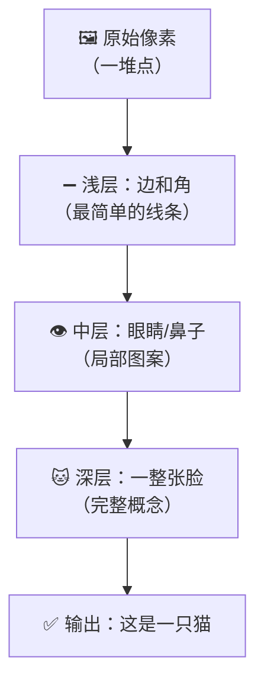
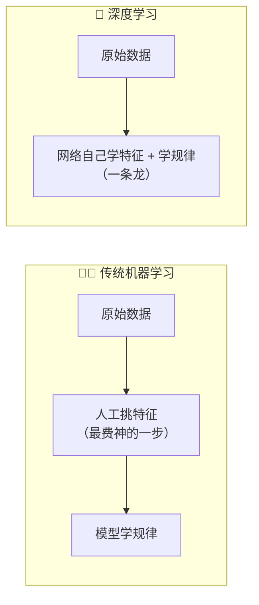
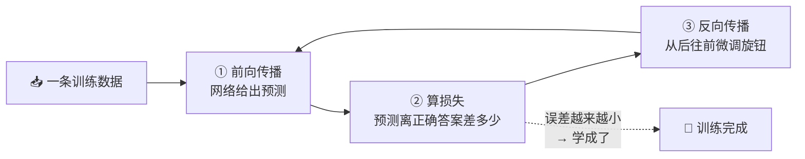
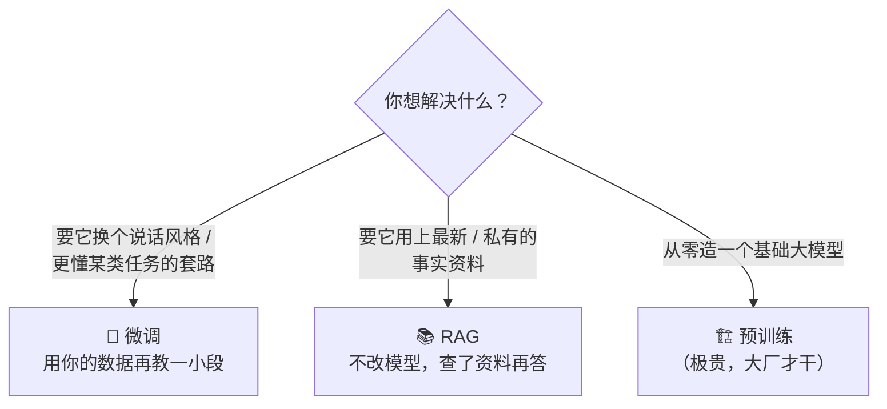
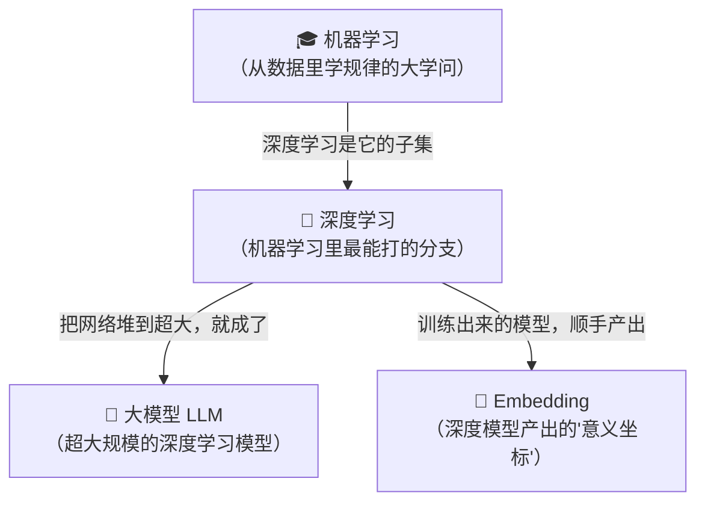

# ⑬ 什么是深度学习（Deep Learning）

> 建议先读 [⑫ 什么是机器学习](./[CONCEPT-12]%20什么是机器学习-MachineLearning.md)。那一篇讲"机器怎么从数据里自己找规律、不靠人写死 if-else"；这一篇往下钻一层，讲机器学习里**最能打的那个分支**——用"多层神经网络"从海量数据里**自动学出极复杂的规律**。这是概念进阶篇的**最后一站**，读完你就把从 Agent 到大模型、从向量到检索的整条链子**串到了最底下的地基**。

---

## 一、一句话定义

**深度学习（Deep Learning, DL）= 机器学习的一个分支，用"很多层"的神经网络，从大量数据里自动学出复杂规律。因为层数"深"，所以叫"深度"。**

如果你只想记住一句话，就记这句：

> **深度学习 = 一条很长的"信息流水线"，数据从一头进去，一层层被加工提炼，从另一头出来时已经变成了答案。**

这一句话是整篇文档的骨架。后面所有的比喻、图、误区，都是在反复讲透这一句话。

```callout ask|小白发问
"深度学习""神经网络"听着像天书，其实"深"字只是说 +[层数多](数据要一层层被加工——第 1 层看线条、第 2 层拼图案、第 3 层认出整个东西，层数多就叫"深")而已。你不用会任何数学，只要抓住一个画面：**数据从流水线一头进去，一层层被加工，从另一头出来时已经变成了答案**。这一篇是概念进阶篇的最后一站，读完你就把整条链子补到最底下的地基了～ 🐥
```


一句话摆清它和上一篇的关系：**机器学习是"从数据里学规律"这门大学问，深度学习是这门学问里最能啃硬骨头的那一招。**

---

## 二、神经网络到底是什么？（大白话版）

深度学习的核心零件叫**神经网络（Neural Network）**。名字很唬人，其实思路朴素：**模仿大脑，用一大堆简单的"小单元"连成网，把信息一层层往下传、往下加工。**

大脑里有无数神经元，一个连一个，信号在它们之间传递。神经网络就是**用数学模仿这件事**：每个"小单元"接收上一层传来的信息，做一点点简单处理，再传给下一层。单个单元笨得要命，但**几百万个连在一起**，就能干出惊人的事。

换几个你熟悉的场景来体会"一层层加工"：

| 比喻 | 每一层在干嘛 | 关键点 |
|------|--------------|--------|
| **工厂流水线** | 每一站只拧一颗螺丝、装一个零件 | 单站很简单，但一路走下来，零件变成了整机 |
| **层层筛子** | 每张筛子只筛掉/留下某种特征 | 粗筛→细筛→精筛，最后剩下的正是你要的东西 |
| **公司审批** | 每一级只看一个角度、盖一个章 | 基层看细节、高层看大局，逐级汇总成决定 |
| **做菜工序** | 洗→切→炒→调味，一步一变 | 每步只做一件小事，合起来才成一道菜 |

这四个比喻的**共同内核**：**没有哪一层是"全能"的，靠的是"一层做一点点，很多层叠起来"的接力。**


> ⚠️ 别被"神经元"三个字吓到——它**不是真的脑细胞**，只是一段做简单计算的数学。说它"像大脑"，指的是**结构上一层层连接**，不是说它真的会思考、有意识。这一点后面误区里还会敲一遍。

### 没有"多层"会怎样？

只有一两层的网络，只能学**很简单的规律**（比如"数字大于 5 就算大号"）。碰到"这张照片里是不是猫"这种复杂问题，它就抓瞎。**层数不够，脑子就浅。** 深度学习的突破，正是"敢把网络叠得很深"。

---

## 三、为什么"深"这么厉害？——层层递进地认识世界

"深"的威力，藏在一个朴素的规律里：**浅层学简单的东西，深层在浅层的成果上，学更复杂的东西。**

以"看一张脸的照片"为例，一层层往下走：

| 层次 | 这一层学会认什么 | 好比认字的哪一步 |
|------|------------------|------------------|
| **浅层（靠前）** | 边、角、亮暗的变化——最基础的小线条 | 先学横竖撇捺**笔画** |
| **中层** | 把线条拼成眼睛、鼻子、嘴巴的**局部图案** | 笔画拼成**偏旁部首** |
| **深层（靠后）** | 把局部拼成"一整张脸"、认出"这是猫还是人" | 偏旁拼成**整个字** |

你看，**没人告诉网络"眼睛长什么样"**，它是**自己**先学会认线条，再用线条拼出眼睛，再用眼睛拼出脸。**一层踩着一层的肩膀往上爬**——这就是"深"的意义：**深度 = 抽象的层数 = 从"零碎细节"一路盖到"完整概念"的楼层数。**



用认字比喻收个尾：**你不是一上来就认识"猫"这个字的**——先描红笔画，再认偏旁，最后才把整个字记住。深度网络学东西，走的是**一模一样的"由简到繁、层层搭建"**的路。

把这场"一层踩一层肩膀往上爬"演成一幕小短剧——你会看到**没人教它"眼睛长啥样"，它是自己从线条一路拼到整张脸的**：

```scene 一张猫脸，是怎么被一层层"拼"出来的
> 一张猫的照片喂进来，起初在机器眼里只是一堆密密麻麻的点。
🖼️ 原始像素 | 我这儿只有一堆亮暗不一的点，谁也看不出是啥。
😀 浅层 | 交给我。我只干最简单的活：把这些点看成一段段+[边和角](最基础的小线条——横的竖的斜的、明暗交界处，好比认字先学横竖撇捺的笔画)。
🙂 中层 | 我接过你的线条，往上拼一步——这几条弧线圈起来是只眼睛，那两片是耳朵。我认的是"局部图案"，好比把笔画拼成偏旁部首。
😎 深层 | 我再接过你的眼睛耳朵，拼成"一整张脸"——尖耳朵、圆眼睛、有胡须……
🐱 深层 | 我认出来了：这是一只猫！
🎉 旁白 | 关键在这：全程没人告诉网络"眼睛长什么样"。它自己先学会认线条、再用线条拼眼睛、再用眼睛拼脸——一层踩着一层的肩膀往上爬。这就是"深"的意义：深度=从零碎细节一路盖到完整概念的楼层数。
```

---

## 四、深度学习 vs 传统机器学习：省了"人工挑特征"这件苦差事

上一篇讲过机器学习。那深度学习和"传统机器学习"差在哪？**最大的区别就一句话：特征是谁挑的。**

- **传统机器学习**：常常需要**人先动脑子**，替机器想好"该看哪些特征"。比如要判断一封邮件是不是垃圾邮件，工程师得先坐下来列：看有没有"中奖"字样、看发件人是否陌生、看链接多不多……**这些"看点"是人一条条设计出来喂给模型的**，累且容易漏。
- **深度学习**：你把**原始数据**（整封邮件的文字）直接丢进去，它**自己**从数据里学出"该看哪些特征"。省掉了人工挑特征这道最费神的活。

| 对比 | 传统机器学习 | 深度学习 | 生活比喻 |
|------|--------------|----------|----------|
| **特征谁来定** | 人工设计、手动挑 | 网络自己从数据里学 | 老师划好重点 vs 学生自己悟出重点 |
| **喂进去的东西** | 加工过的"特征表" | 原始数据（图/文/声） | 剥好壳的瓜子 vs 一整袋带壳瓜子 |
| **擅长的场景** | 数据不多、规律较简单 | 数据海量、规律极复杂 | 小作坊 vs 大工厂 |
| **代价** | 省算力，但费人工 | 省人工，但吃数据和算力 | 手工 vs 自动化产线 |



一句话记住：**深度学习最迷人的地方，是它把"该关注什么"也一起学了**——你只管把原料倒进去，它自己琢磨出该看哪儿。当然，天下没有免费的午餐：**它换来的代价是要吃很多数据、烧很多算力。**

---

## 五、它是怎么"学"的？——前向传播 + 反向传播（大白话）

网络刚出生时，里面有无数个"旋钮"（专业叫**参数 / 权重**），全是**随机乱拧**的，所以一开始它蠢得离谱。学习，就是**一遍遍地把旋钮往"更准"的方向拧**。这个过程分三步，反复亿万次：

| 步骤 | 大白话 | 术语 |
|------|--------|------|
| **① 数据流过网络，吐个答案** | 一张图从头灌到尾，网络猜"这是 3" | **前向传播** |
| **② 看错了多少** | 正确答案是 8，猜成 3，差得远 | **损失（loss）** |
| **③ 反过来调旋钮，让下次更准** | 从后往前，一个个微调旋钮 | **反向传播** |

最好的比喻是**射箭**：

- 你射一箭（**前向传播**：给个结果）；
- 看它偏了多少、偏哪边（**损失**：量误差）；
- 据此调整姿势——抬高一点、往左偏一点（**反向传播**：调旋钮）；
- 再射、再看、再调……**射够几万几亿次，你就成了神射手。**



> ⚠️ 关键直觉：**网络不是被"教会"的，是被"纠错纠出来"的。** 没人告诉它"猫长这样"，它只是**猜错一次就挨一次调**，几亿次之后，旋钮自己被拧到了"能认猫"的位置。**深度学习的聪明，是海量试错攒出来的，不是天生的。**

---

## 六、重点：什么是 fine-tuning（微调）？

这一节是本篇的**重头戏**，请慢慢读。

从零训练一个大模型，**贵到离谱**——要海量数据、成千上万张显卡、烧掉巨额电费和时间。绝大多数人根本玩不起。那怎么办？

**微调（fine-tuning）= 不从零训练，而是拿一个"已经训练好的大模型"，用你自己的少量专门数据，"再教它一小段"，让它擅长你这一行。**

打两个最贴切的比方：

- **名校毕业生入职培训**：你招进来一个名校高材生，他**通识底子极好**（这相当于"预训练好的大模型"）。但他不懂你公司的具体业务，于是你给他做**几天岗位培训**（这就是"微调"）——不用重新供他读四年大学，只在他厚实的底子上，补一小段专门知识。
- **通用厨师再学川菜**：一个厨师已经**十八般厨艺样样通**（预训练）。你想让他专攻川菜，不需要让他从"怎么拿菜刀"重学，只要**带他专门练一阵子川菜**（微调），他很快就成了川菜师傅。


### 预训练 vs 微调 vs RAG：三者到底啥关系、啥时候用哪个？

这三个词特别容易搅在一起，用一张表钉死：

| 做法 | 在干什么 | 好比 | 代价 | 什么时候用 |
|------|----------|------|------|------------|
| **预训练** | 从零学**通用能力**，喂海量数据 | 供一个人读完小学到大学 | **极贵**（普通人玩不起） | 造一个全新的基础大模型（大厂的事） |
| **微调（fine-tuning）** | 在通用底子上**专项特训**，改的是"风格/能力倾向" | 名校生入职做岗位培训 | **便宜**（少量数据即可） | 想让模型**说话风格、做事套路**贴合你的领域 |
| **[⑪ RAG](./[CONCEPT-11]%20什么是RAG-检索增强生成.md)** | **不动模型**，临时把资料喂给它看 | 开卷考试，答题前先翻书 | **最轻**（连训练都不用） | 想让模型用上**最新的、你私有的事实资料** |



**一句话记住取舍**：想改"**它怎么说、怎么做**"——微调；想补"**它得知道的新事实**"——RAG；从零造模型——预训练（跟你没啥关系）。**微调调的是"能力和风格"，RAG 补的是"知识和事实"**，这俩经常配合用，不是二选一。

```flip
微调（fine-tuning）和"从零训练一个新模型"差在哪？（点一下翻到背面）
---
**从零训练**是供一个人从小学读到大学（海量数据 + 成千上万张显卡，贵到普通人玩不起）；**微调**是招个名校毕业生做几天岗位培训（拿已经训练好的大模型，用少量专门数据再教一小段）。微调站在别人的肩膀上，所以又快又便宜——它改的是"风格和能力倾向"，不是把模型推倒重练。
```


---

## 七、常见误区（新手最容易踩的坑）

这一节请务必逐条读完。这些误解会让你对整个深度学习的理解跑偏。

### 误区 1：以为深度学习"真的会像大脑一样思考"

- ❌ **错误理解**：既然模仿大脑，那它是不是真的有意识、在"思考"？
- ✅ **正确理解**：它只是**结构上**借鉴了"神经元一层层连接"，本质是**一堆数学计算**。它没有意识、没有理解、不会"想"。说它像大脑，是打比方，**不是说它真的长了个脑子**。

### 误区 2：以为"层越多、越深，就一定越好"

- ❌ **错误理解**：那我把网络堆到一万层，岂不是天下无敌？
- ✅ **正确理解**：**不是。** 层太多会带来两个大麻烦：一是**过拟合**（把训练数据"死记硬背"了，一换新数据就翻车，好比学生只会背原题、不会做变式），二是**极难训练、极烧钱**。深度是**权衡**出来的，不是越深越好。

### 误区 3：以为"微调 = 重新训练一个新模型"

- ❌ **错误理解**：微调就是把模型推倒重练一遍。
- ✅ **正确理解**：**恰恰相反。** 微调是**站在已经训练好的模型肩膀上**，只再教一小段。就像老员工做岗位培训，**不是重新读一遍大学**。正因为不用从零来，它才便宜、才人人玩得起。

### 误区 4：以为"微调能给模型凭空塞进新事实"

- ❌ **错误理解**：我拿公司文档去微调，模型就"记住"这些事实了。
- ✅ **正确理解**：微调**擅长改"风格和能力倾向"**（比如让它说话更专业、更懂某类任务的套路），但**不擅长可靠地灌进具体事实**——硬灌容易学串、容易忘、还可能编。**要让模型用上确切的事实资料，[⑪ RAG](./[CONCEPT-11]%20什么是RAG-检索增强生成.md) 才是对的工具**（查了再答，事实来自资料，不靠模型硬记）。

### 误区 5：以为"深度学习不怎么吃数据和算力"

- ❌ **错误理解**：它这么聪明，随便喂点数据就能学会吧？
- ✅ **正确理解**：**深度学习是出了名的"吃货"。** 它靠海量试错攒本事，**数据越多、算力越足，才越能学出复杂规律**。数据太少，它要么学不会，要么直接"背原题"过拟合。这也是为什么普通人更多是**用**现成模型、或**微调**，而不是从零训练。

```quiz
Q: 下面关于深度学习和微调的说法，哪些是对的？（多选）
- [x] "深度"指的是网络层数多，数据要一层层被加工提炼
> 对。浅层学线条、深层学完整概念，层层递进——这就是"深"的意义。
- [ ] 层数堆得越多，模型就一定越强
> 错。层太多会过拟合（背原题、换新题就崩）而且极难训练、极烧钱。深度是权衡出来的。
- [x] 微调是站在已训练好的大模型肩膀上再教一小段，比从零训练便宜得多
> 对。就像名校生做几天岗位培训，不用重读四年大学。
- [ ] 想让模型记住"公司最新退货政策第几条"这种确切事实，最该用微调
> 错。微调擅长改风格/能力倾向，不擅长可靠灌事实。补确切事实该用 RAG（查了再答）。
- [x] 深度学习和传统机器学习最大的区别是：特征由网络自己从原始数据里学，不用人工挑
> 对。省掉了人工挑特征这道苦差事，代价是吃很多数据和算力。
```


---

## 八、动手小实验 / 思想实验

理论看再多，不如在脑子里跑一遍网络。下面的思想实验不用写代码，只用想。

### 实验 A：脑内推演一个"手写数字识别"网络

想象有人手写了一个数字，拍成一张小图，你要让网络认出它是 0~9 里的哪个。**跟着信息一层层往下走**：


关键体会：**输入端只是一堆点，输出端却是明确的答案**，中间靠**一层层从"线条"提炼到"整个数字"**。你会发现——**没人教它"8 有两个圈"**，它是自己从成千上万张手写图里**试错试出来**的。走完这一遍，你就亲手体会了"逐层提取特征"。

### 实验 B：给三个需求分诊——该用微调还是 RAG？

假设你有一个通用大模型，下面三个需求，你各自该动哪招？先自己想，再看答案：

1. 想让它**回答时始终用"客服小妹"的亲切口吻** → 这是改**风格** → **微调**。
2. 想让它**准确答出"我们公司今年的退货政策第几条"** → 这是补**事实** → **RAG**（把政策文档查出来喂给它）。
3. 想让它**从零变成一个全新的基础模型** → 这是**预训练**（打住——这不是你该干的事 😄）。

能把这三题分对，你就真正理解了"**改能力/风格用微调，补事实用 RAG**"这条黄金分诊线。

---

## 九、和其它概念的关系

深度学习不是孤立的招式，它是**这一整套 AI 能力的地基**。前面几篇讲的东西，往下刨到底，很多都站在它身上。



| 概念 | 一句话关系 | 类比 |
|------|-----------|------|
| [⑫ 机器学习](./[CONCEPT-12]%20什么是机器学习-MachineLearning.md) | 深度学习是机器学习的**一个子集**——是它里面最能啃硬骨头的一招 | 深度学习是"武术"这门大类里的"内功" |
| **⑬ 深度学习（本篇）** | 用多层神经网络，从海量数据自动学复杂规律 | 一条很长的信息流水线 |
| [⑥ 大模型 LLM](./[CONCEPT-06]%20什么是LLM-大语言模型.md) | 大模型就是**超大规模的深度学习模型**——层数、参数、数据都大到夸张 | 同一门手艺，做到了"巨无霸"规模 |
| [⑨ Embedding](./[CONCEPT-09]%20什么是Embedding-向量.md) | 那串"意义坐标"，正是**深度模型训练出来后顺手产出**的 | 尺子造好了，量出的读数就是 Embedding |
| [⑪ RAG](./[CONCEPT-11]%20什么是RAG-检索增强生成.md) | 和**微调**是一对好搭档：改风格用微调、补事实用 RAG | 岗位培训 vs 开卷翻书 |

一句话串起来：**机器学习是大类 → 深度学习是它最猛的分支 → 把深度网络堆到超大就是大模型 → 大模型顺手产出 Embedding，再配上 RAG 去查资料。** 你走到这里，整条概念链的**最底层地基**就补齐了。

---

## 十、和 Khy-OS 的关系

先把话说明白，**这是最诚实、也最重要的一节**：

**Khy-OS 是一个"用"这些模型的工程，不是一个"训练模型"的工程。**

也就是说，Khy-OS 本身**不做深度学习训练、不搞预训练、通常也不干微调**——它是站在别人已经训练好的大模型**之上**，把它们组织成好用的智能体、工具循环、记忆与检索。那你为什么还要懂深度学习？**因为懂它，你才拿得准模型的"能力边界"，才不会对模型提出离谱的、它根本做不到的要求。**

理解深度学习，帮你在用 Khy-OS 时守住三条底线：

- **别夸大**：模型再强，也只是"海量试错攒出的规律"，**它不会真思考、不保证对**。把它当"很会举一反三的助手"，别当"无所不知的神"。
- **别编造**：知道模型的知识"截止到训练那一刻、且可能记错"，你就明白——**要确切事实，得靠 [⑪ RAG](./[CONCEPT-11]%20什么是RAG-检索增强生成.md) 去查真资料**，而不是逼模型硬答（那样只会得到"听起来对、其实瞎编"的幻觉）。
- **选对招**：想让它更懂你的领域套路 → 想到"微调"这条路存在；想让它用上你的私有资料 → 想到"RAG"。**用对工具，才不白花力气。**

> ⚠️ 这里只讲"概念级"的关系——**Khy-OS 用模型、而非造模型；懂 DL 是为了拿准能力边界**。至于 Khy-OS 具体接哪些模型、怎么调用、怎么落地，属于设计与实现层面，你可以在 [`docs/03_DESIGN_设计`](../03_DESIGN_设计) 目录里进一步了解。本文不涉及、也不编造具体的模型名或实现细节。

---

## 十一、小结 + 下一步

- **深度学习 = 机器学习的一个分支，用"多层神经网络"从海量数据里自动学复杂规律；层数深，故名"深度"。**
- **神经网络** = 一条信息流水线，每层只做一点点加工，**很多层叠起来**就能干大事（工厂流水线 / 层层筛子）。
- **"深"的威力** = 浅层学简单特征（边、角），深层学复杂概念（脸、猫）——像认字先笔画、再偏旁、再整字。
- **和传统机器学习的区别** = 传统常要**人工挑特征**，深度学习**自己从原始数据学特征**（省人工，换来吃数据、吃算力）。
- **它怎么学** = 前向传播出预测 → 算损失看偏多少 → 反向传播调旋钮，**反复亿万次**（射箭看偏差调姿势）。
- **微调（fine-tuning）** = 拿训练好的大模型，用少量专门数据再教一小段（名校生入职培训 / 通用厨师学川菜）；**预训练贵、微调便宜改风格、RAG 最轻补事实**——三者各有其位。
- **五大误区**：它**不真会思考**、层**不是越多越好**、微调**不是重训新模型**、微调**塞不进可靠事实**（补事实找 RAG）、深度学习**极吃数据和算力**。
- **地基地位**：机器学习的子集，大模型是它的超大规模版，Embedding 由它产出——你已把整条概念链补到了最底层。

🎉 **恭喜，核心概念链你已经全部读完！** 从 Agent 到工具循环，从上下文到向量、检索、机器学习、深度学习，整套心智地图已经在你脑子里搭好了。

后面还有两篇**常见 AI 名词彩蛋**——它们是 AI 圈最常挂在嘴边的词，Khy-OS 虽然没直接用到，但懂了聊 AI 不露怯：

👉 下一篇 [⑭ 什么是 Transformer（变换器）](./[CONCEPT-14]%20什么是Transformer-变换器.md)——现代大模型的"骨架"，以及它的绝招"注意力机制"。

👈 回 [概念入门总览](./00_INDEX_概念入门-总览.md) 看看还有哪些能温故知新。

👉 想换一种更轻松、更上头的方式把这些概念再过一遍？去看 [修仙学 AI 的故事](../09_STORY_修仙学AI/00_INDEX_修仙学AI-总目录.md)——把 Agent、工具、模型、微调，全编成了一个练功升级的江湖故事，保证你越读越明白。
