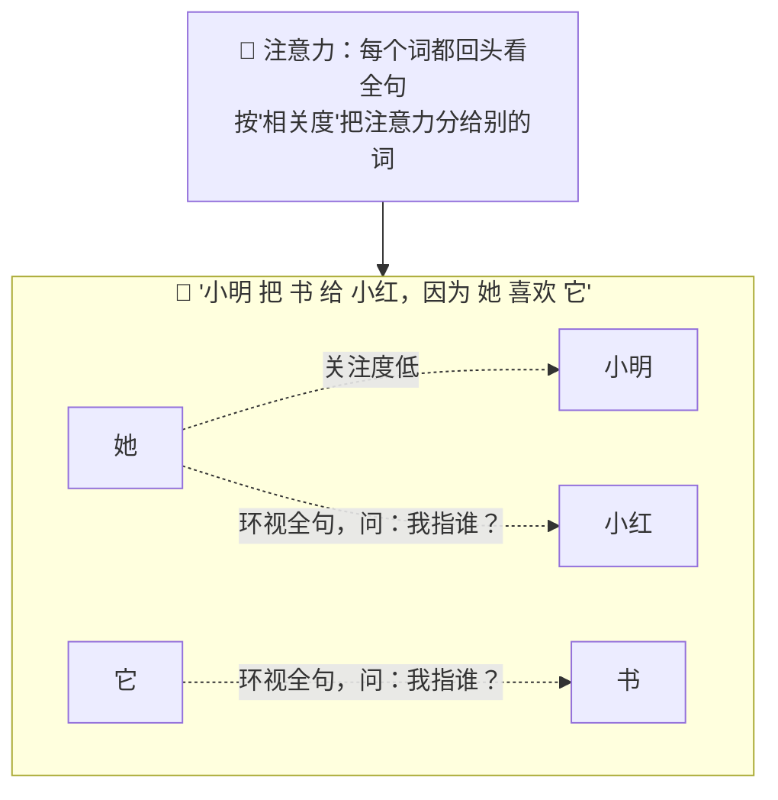
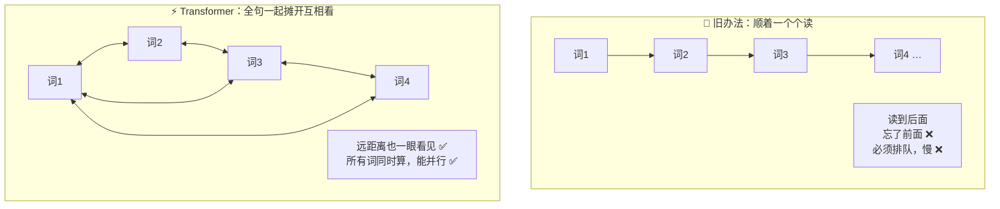
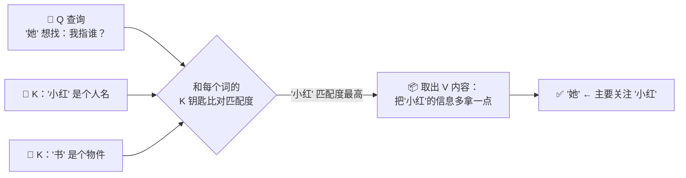
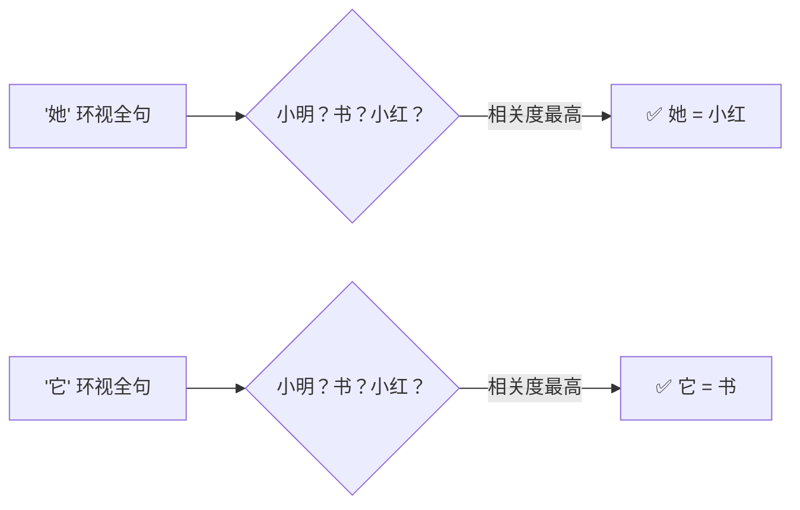
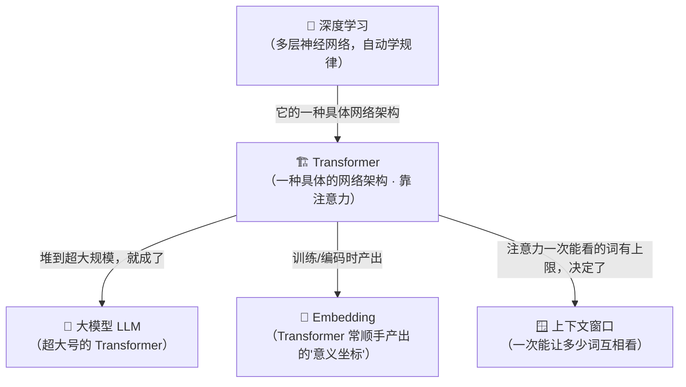

# ⑭ 什么是 Transformer（变换器）

> 建议先读 [⑬ 什么是深度学习](./[CONCEPT-13]%20什么是深度学习-DeepLearning.md)。那一篇讲"用很多层神经网络，从海量数据里自动学复杂规律"；这一篇要指名道姓地讲——现代大模型用的是**哪一种**神经网络。答案就是 **Transformer（变换器）**。它不是某个具体模型，而是一种**架构（骨架结构）**，是 [⑥ 大模型 LLM](./[CONCEPT-06]%20什么是LLM-大语言模型.md) 的骨架。你天天听到的 GPT、BERT，名字里那个 **T**，就是 Transformer。读完这篇，你会明白：**为什么"能同时看全句"这一招，撑起了整个大模型时代。**

---

## 一、一句话定义

**Transformer（变换器）= 一种神经网络架构，靠"注意力机制"让一句话里的每个词都能"环视全句、按相关度分配注意力"，从而抓住词与词之间的远距离关联。**

如果你只想记住一句话，就记这句：

> **Transformer = 让所有词"同时互相看一眼"的网络。旧办法一个字一个字顺着读（读后面忘前面），它让全句一起摊开、彼此对望，谁跟谁相关一目了然。**

这一句话是整篇文档的骨架。后面所有的比喻、图、误区，都是在反复讲透这一句话。

```callout ask|小白发问
"Transformer""注意力机制"听着像天书，其实核心就一个画面：+[开会环视全场](一句话里每个词，发言前先扫一眼全场——谁跟自己相关就多听谁一点，这个"多听谁"的分寸，就叫注意力权重)。你不用会任何数学，只要抓住这个画面就够了。别被 Q/K/V、多头这些词吓退——这篇会把每个词都拆成生活比喻。还有一件事先钉死：**Transformer 是"骨架"，GPT 是照这副骨架造出来的"具体人"**，别把两者搞混～ 🐥
```

先把两个"它不是"钉进脑子，后面会反复呼应：

| 你可能以为它是 | 其实它不是，因为 |
|----------------|------------------|
| **某个具体模型** | 它是**架构 / 图纸**，不是成品。GPT、BERT 才是照这张图纸造出来的**模型**。图纸 ≠ 房子 |
| **会"专心理解"的东西** | "注意力"只是个数学打分，算"哪个词跟哪个词更相关"，**不是它真的在专心、在理解**，别被名字骗了 |

---

## 二、核心绝招：注意力机制（让每个词环视全句）

Transformer 最关键、也最该记住的一招，叫**注意力机制（attention / self-attention，自注意力）**。用一句大白话讲透它：

> **处理一句话时，让每个词都回头把整句话扫一遍，然后决定"我该多关注哪几个词"。**

举个最好懂的例子。看这句话：

> **"小明把书给小红，因为她喜欢它。"**

你读到"**她**"时，脑子会**自动回头**在句子里找——"她"指谁？是"小红"。你读到"**它**"时，同样回头找——"它"指"书"。**你不是傻乎乎地只盯着"她"这个字本身，你是让"她"去环视全句、锁定最相关的那个词。** 这，就是注意力机制干的事。



注意上图的关键：**"她"把大部分注意力分给了"小红"，"它"把大部分注意力分给了"书"**。这个"分多少注意力给谁"的分寸，就是 +[注意力权重](一组 0~1 的打分：相关就打高分、多分点注意力，不相关就打低分——全句加起来算出"每个词最该关注谁")。Transformer 就是靠这套打分，一次性把全句里"谁和谁有关系"全部理清。

**换几个生活场景体会同一件事：**

| 比喻 | 谁在"环视全场" | 关键点 |
|------|----------------|--------|
| **开会发言** | 每人发言前先扫全场，谁跟当前话题相关就多听谁 | 不是自说自话，是**看全场再决定听谁** |
| **读侦探小说** | 读到"凶手是他"时，回头把前文嫌疑人过一遍 | **回看全文**才知道"他"指谁 |
| **翻译长句** | 译某个词时，得瞟一眼整句的主谓宾才不译错 | 孤立看一个词会译歪，**看全局**才准 |

这三个比喻的**共同内核**：**没有哪个词是"孤立"被处理的，每个词都要先看一眼全局，再决定自己的意思。** 这就是注意力，也是 Transformer 的灵魂。

把这场"每个词回头环视全句、锁定自己指谁"演成一幕小短剧——用的正是上面那句"小明把书给小红，因为她喜欢它"：

```scene 词与词的相认：读到"她"和"它"，脑子在干嘛
> 句子摆在这儿："小明 把 书 给 小红，因为 她 喜欢 它。" 现在轮到两个含糊的词开口了。
🤔 "她" | 我是谁的替身？我不能只盯着自己看。我+[回头把整句扫一遍](自注意力：处理每个词时，都让它环视全句、按相关度给别的词打分——相关就多分点注意力)……"小明"是男的，跟我对不上；"小红"是女的——就是她！我把大部分注意力分给"小红"。
🙂 "小红" | 收到，"她"指的是我。
🤔 "它" | 该我了。我指的是个东西……环视全句：能"被喜欢"的东西是"书"。我把注意力重重压在"书"上。
📖 "书" | 没错，"它"就是我。
🎉 旁白 | 看见没？没有哪个词是孤零零被处理的——"她""它"都先回头看了全句、再决定自己指谁。这套"分多少注意力给谁"的打分，就是注意力权重，也是 Transformer 一次性理清"谁和谁有关系"的绝招。
```

---

## 三、为什么这一招这么厉害？——从"顺着读"到"一起看"

要体会 Transformer 有多颠覆，得先看看它出现**之前**，机器是怎么读一句话的。

**旧办法：一个字一个字顺着读（像用一根手指指着字念）。** 读到第 20 个字时，第 1 个字早就"记不太清"了。这带来两个致命毛病：

- **读后面忘前面（长距离关联抓不住）**：句子一长，开头的信息传到结尾就衰减没了。"小明……（中间隔了 30 个字）……因为**他**很开心"——"他"指谁？顺着读的机器很容易忘了开头的"小明"。
- **没法并行（慢）**：因为必须**读完第 1 个才能读第 2 个**，一环扣一环，快不起来。想用一万块显卡一起算？没门，它天生是"排队"的。

**Transformer 的新办法：把整句话一次性摊开，让所有词同时互相看。**



这一"同时互相看"，直接换来两个大红利，**今天的大模型全靠它**：

1. **抓得住长依赖**：不管两个词隔多远，它们之间都有一条"直接对望"的线，开头的信息不会衰减丢失。
2. **能大规模并行训练**：既然所有词是**一起算**的、不用排队，就能把海量算力（成千上万块显卡）一起压上去，短时间吃完海量文本。**没有这一条，就训不出今天这么大的模型。**

> 一句话记住：**旧模型是"一根手指顺着念"，Transformer 是"一眼看全篇"。** 前者又慢又健忘，后者又快又抓得住全局——这就是它掀翻旧时代的根本原因。

---

## 四、拆开看内部：几个零件，白话就懂（别怕）

你会听到一堆吓人的词：多头注意力、位置编码、Q/K/V、堆叠多层……别慌，一个个用大白话拆开，你会发现它们都朴素得很。

### 1）自注意力：谁该关注谁（上一节讲过了）

核心零件，就是第二节那套"每个词环视全句、按相关度分配注意力"。这是灵魂，其余都是给它配套的。

### 2）多头注意力：多个视角同时看

一个人看问题容易片面。所以 Transformer 不止用**一套**注意力，而是**同时用好几套**，每套盯不同的角度——这叫**多头注意力（multi-head attention）**。

- 好比**一件事请好几位专家一起会诊**：一位盯语法关系、一位盯指代关系、一位盯情感色彩……
- 每个"头"从自己的角度算一遍"谁该关注谁"，最后把大家的意见**汇总**起来。
- **多个视角并行看，理解自然更立体、更不容易漏。**

### 3）位置编码：因为"同时看"，得额外告诉它先后顺序

这是个**特别巧妙、也特别容易被忽略**的点。想一想：既然所有词是"一起摊开、同时看"的，那机器怎么知道**谁在前、谁在后**？

"猫追狗"和"狗追猫"，用的字一模一样，只是顺序不同、意思却相反。顺着读的旧模型天然知道顺序（它就是按顺序读的）；但 Transformer 一把抓、不排队，**顺序信息就丢了**。

于是要**额外**给每个词贴上一个"我排第几"的标签，这就是**位置编码（positional encoding）**。

> 打个比方：一群人同时挤进电梯（并行、没排队），你想知道谁先来的，就得**给每人发一张写着号码的牌子**。位置编码就是那张号码牌——**因为放弃了"排队"，才要靠"发号牌"把顺序补回来。**

### 4）堆叠多层：层层加工（呼应深度学习的"深"）

单独一层注意力，只能理清"比较浅"的关系。所以 Transformer 把注意力层**一层叠一层地堆起来**——这正是 [⑬ 深度学习](./[CONCEPT-13]%20什么是深度学习-DeepLearning.md) 里讲的"深"：

- 浅层：理清"她"指"小红"这种**局部指代**；
- 中层：拼出短语、从句的**结构关系**；
- 深层：把整句、整段的**意思和逻辑**串起来。

**层层加工、由浅入深**——和深度学习"浅层认线条、深层认整张脸"是同一个道理。Transformer 就是深度学习的一种**具体网络架构**。

### 5）Q / K / V：一句"查字典"带过（不深入数学）

你一定会撞见 Q、K、V 三个字母，它们是注意力打分的内部机关。**用"查字典"一句带过就够，不用碰数学：**

- **Q（Query，查询）**：当前这个词举着的"我想找什么"的问题条子；
- **K（Key，钥匙）**：其它每个词挂着的"我是关于什么的"标签；
- **V（Value，内容）**：每个词真正携带的信息内容。

**过程就像查字典**：拿着你的问题（Q）去和一排词条的索引（K）逐个比对，谁的索引最匹配，就把谁对应的正文（V）多取一点出来。"匹配度"就是上一节的注意力权重。**记住这个画面即可，背后的公式跟你没关系。**



> 把这五个零件串起来一句话：**自注意力管"谁关注谁"，多头让多个视角一起看，位置编码补上先后顺序，多层堆叠层层加工，Q/K/V 是内部"查字典"的机关。** 记住画面，别背公式。

---

## 五、常见误区（新手最容易踩的坑）

这一节请务必逐条读完。这些误解会让你对整个大模型的理解跑偏。

### 误区 1：以为 Transformer 是"某个具体模型"

- ❌ **错误理解**：Transformer 是不是就是 GPT 那样的一个模型？
- ✅ **正确理解**：**它是架构、是图纸，不是成品。** GPT、BERT 才是**照这张图纸造出来的具体模型**。同一张图纸能盖出很多栋不同的房子——GPT、BERT、还有一堆别的，都是 Transformer 这张图纸的"产物"。**图纸 ≠ 房子。**

### 误区 2：以为它像人一样"理解"了句子

- ❌ **错误理解**：它连指代、逻辑都能理清，肯定是真的懂了。
- ✅ **正确理解**：它做的是**极其逼真的数学打分和模式匹配**，不是人类意义上的"理解"。它不知道"书"是能翻能读的纸——它只是算出"它"这个词的注意力**应该多分给"书"**。表现像懂，**不等于真懂**（这一条和 [⑥ LLM](./[CONCEPT-06]%20什么是LLM-大语言模型.md) 那篇的"像懂不等于真懂"是同一回事）。

### 误区 3：以为"注意力"就是它真在"专心"

- ❌ **错误理解**：它给某个词高注意力，是不是说明它在"用心想"那个词？
- ✅ **正确理解**：**"注意力"只是个借来的名字。** 它的真身是一组冰冷的相关度打分（0~1 的数），算的是"哪个词和哪个词在数据里更常一起、更相关"。**没有"专心""走神"这回事**，别被这个拟人化的名字带偏。

### 误区 4：以为 Transformer 只能处理文本

- ❌ **错误理解**：它是搞语言的，只能读写文字吧？
- ✅ **正确理解**：**远不止。** 注意力这套"让一堆元素互相看、算相关度"的思路，**图像、语音、甚至蛋白质结构都能用**。把图像切成小块当"词"、把声音切成小段当"词"，一样能上 Transformer。它是个**通用**的骨架，不是文字专用。

### 误区 5：以为 Transformer 就等于 LLM

- ❌ **错误理解**：Transformer 和大模型是不是一回事？
- ✅ **正确理解**：**不是。** LLM（大模型）是**用 Transformer 这副骨架、堆到超大规模**造出来的一类模型；但 Transformer 这副骨架**也能干别的**（做小模型、做图像、做语音）。**关系是："LLM 是超大号的 Transformer 应用"，但 Transformer ≠ LLM。** 图纸能盖摩天楼，也能盖小平房。

```quiz
Q: 下面关于 Transformer 的说法，哪些是对的？（多选）
- [x] 它是一种神经网络"架构（图纸）"，GPT、BERT 是照它造出来的具体模型
> 对。架构 ≠ 成品，同一张图纸能盖出很多不同的模型。
- [ ] "注意力"说明它真的在"专心理解"某个词
> 错。注意力只是一组相关度打分（数学），没有"专心/走神"，是借来的名字。
- [x] 它的核心是让一句话里每个词"环视全句、按相关度分配注意力"，从而抓住远距离关联
> 对。这就是自注意力，是 Transformer 的灵魂。
- [ ] Transformer 只能处理文字，图像和语音用不了
> 错。图像、语音把元素切块当"词"照样能用，它是通用骨架。
- [x] 因为所有词"同时一起算"，它既能抓长依赖，又能大规模并行训练
> 对。这正是它掀翻"顺着一个个读"的旧模型、撑起大模型时代的根本原因。
```

翻卡自测，看你有没有真的抓住"架构 vs 模型"的区别：

```flip
Transformer 和 GPT 到底是什么关系？它俩是一回事吗？
---
**不是一回事。** Transformer 是**架构 / 图纸**——它规定了"用注意力让所有词互相看"这套结构；GPT 是**照这张图纸、堆到超大规模造出来的一个具体模型**。同一张图纸还能盖出 BERT 和一堆别的模型，甚至盖出处理图像、语音的模型。所以：**GPT 名字里的 T 就是 Transformer（它用的骨架），但 Transformer 本身能干的事远比"造一个 GPT"多。** 记住：图纸 ≠ 房子。
```

---

## 六、动手小实验 / 思想实验

理论看再多，不如亲手（或在脑子里）走一遍注意力。下面不用写代码，只用想。

### 实验 A：你自己当一回"注意力机制"

请慢慢读这句话，**边读边留意你的眼睛和脑子在干嘛**：

> **"小明把书给小红，因为她喜欢它。"**

现在回答两个问题（先别往下看答案，自己想）：

1. "**她**"指的是谁？
2. "**它**"指的是谁？

你几乎不假思索就答出：**"她" = 小红，"它" = 书**。**关键来了——问你自己：你是怎么知道的？** 你不是只盯着"她"这个字看，你是**让"她"回头把整句话扫了一遍**，在"小明、书、小红"里挑出最相关的"小红"。你刚刚在脑子里**亲手跑了一遍自注意力**——每个词环视全句、按相关度锁定目标。Transformer 干的就是这件事，只不过它是用数学打分、一次性对全句所有词同时做。



### 实验 B：把"顺着读"和"一起看"掰扯清楚

再做一个思想实验，体会 Transformer 为什么快、为什么记性好。给你一句超长的话：

> "小明早上出门，路上遇到很多事……（脑补中间隔了 30 个字）……最后**他**笑了。"

- **假装你是"顺着一根手指念"的旧模型**：念到"他"的时候，开头的"小明"已经过去很久，你得使劲回忆才想得起。中间要是再插几个人名，你很可能**认错"他"是谁**。
- **假装你是 Transformer**：整句话在你眼前**一次性全摊开**，"他"和"小明"之间有一条**直接对望的线**，隔多远都一眼看见，根本不用回忆。

体会到了吗？**"一起摊开看"既解决了健忘（长依赖），又因为不用排队而能一起算（并行）。** 这就是第三节那两个红利，你刚刚用脑子验证了一遍。

> 再追问一步：如果这句话有一万个字呢？Transformer 要让**每个词**都跟**其它所有词**互相看一遍——词越多，"互相看"的组合就越多、越费劲。**这正是为什么大模型有"上下文窗口"上限**：一次能塞进去、让大家互相看的词是有限的。这条线索，直接连到下面的"和其它概念的关系"。

---

## 七、和其它概念的关系

Transformer 不是孤立的招式，它是从"深度学习"到"大模型"这条链子上**承上启下的关键一环**。



| 概念 | 和 Transformer 的一句话关系 | 类比 |
|------|------------------------------|------|
| [⑬ 深度学习](./[CONCEPT-13]%20什么是深度学习-DeepLearning.md) | Transformer 是深度学习的**一种具体网络架构**——深度学习是大类，它是里面最火的一款图纸 | "建筑学"这门大类里的"某一种著名结构" |
| [⑥ 大模型 LLM](./[CONCEPT-06]%20什么是LLM-大语言模型.md) | LLM 就是**超大号的 Transformer**——把这副骨架堆到夸张的层数和参数 | 同一张图纸，盖成了摩天大楼 |
| [⑨ Embedding](./[CONCEPT-09]%20什么是Embedding-向量.md) | 那串"意义坐标"，常常正是 **Transformer 在编码时产出**的 | 骨架转动时，顺手量出的读数 |
| **上下文窗口** | 注意力"一次能让多少词互相看"是有上限的，这个上限就是**上下文窗口** | 会议室最多坐多少人一起开会 |

一句话串起来：**深度学习是大类 → Transformer 是它最火的一种架构 → 把 Transformer 堆到超大就是 LLM → 注意力"一次能看多少词"决定了上下文窗口，编码时又顺手产出 Embedding。** 你把这条链子接上，从"底层地基"到"今天的大模型"就彻底打通了。

---

## 八、和 Khy-OS 的关系

先把话说明白，**这是最诚实的一节**：

**Khy-OS 是一个"用"基于 Transformer 的大模型的工程，不是一个"造 Transformer"的工程。**

也就是说，Khy-OS 本身**不设计 Transformer、不训练大模型**——它站在别人已经用 Transformer 造好、训好的大模型**之上**，把它们组织成好用的智能体、工具循环、记忆与检索。那你为什么还要懂 Transformer？**因为懂它，你才明白模型的"能力和限制"是从哪来的。**

理解 Transformer，帮你在用 Khy-OS 时想通两件事：

- **为什么模型"能读懂长上下文"**：因为它的骨架就是"让全句所有词互相看"，天生擅长抓长距离关联——所以你可以放心地把一大段背景一次喂给它。
- **为什么又有"上下文窗口"上限**：因为"每个词跟所有词互相看"是有代价的，一次能塞进去的词有天花板。**懂了这条，你就明白为什么不能把整个项目一股脑全灌进去**，也就理解了 Khy-OS 为什么要做"记忆、检索、压缩上下文"这些事——都是在这条限制底下想办法。

> ⚠️ 这里只讲"概念级"的关系——**Khy-OS 用基于 Transformer 的模型、而非造 Transformer；懂它是为了看清模型能力与上下文限制的由来**。至于 Khy-OS 具体接哪些模型、怎么调用、怎么管理上下文，属于设计与实现层面，你可以在 [`docs/03_DESIGN_设计`](../03_DESIGN_设计) 目录里进一步了解。本文不涉及、也不编造具体的模型名或实现细节。

---

## 九、小结 + 下一步

- **Transformer = 一种神经网络架构**，靠"注意力机制"让一句话里每个词都**环视全句、按相关度分配注意力**，从而抓住远距离关联。它是**图纸/骨架，不是具体模型**。
- **核心绝招是自注意力**："每个词回头看全句、算谁跟谁相关"——就像开会前环视全场、读"她/它"时回头找它指谁。
- **为什么颠覆**：旧模型"一根手指顺着念"（读后面忘前面、必须排队），Transformer"一眼看全篇"（抓得住长依赖 + 能大规模并行训练）——**没有这一条，就没有今天的大模型。**
- **内部零件白话版**：自注意力（谁关注谁）、多头（多个视角同时看）、位置编码（因为同时看，得额外发"号牌"补上顺序）、堆叠多层（层层加工，呼应深度学习的"深"）、Q/K/V（内部"查字典"，记画面不背公式）。
- **五大误区**：它是**架构不是某个模型**、**像懂不等于真懂**、"注意力"**不是真在专心**、**不只能处理文本**（图像语音也行）、**Transformer ≠ LLM**（LLM 是它的超大号应用）。
- **在整条链子里**：深度学习是大类 → **Transformer 是它最火的架构** → 堆到超大就是 LLM → 注意力上限决定上下文窗口、编码顺手产出 Embedding。

理解了"现代大模型的骨架是 Transformer"之后，你自然会问：**那工程师是用什么工具，把这副骨架真正搭起来、训起来的？** 这就是下一篇的主题——**PyTorch（深度学习框架）**：造神经网络的"乐高工具箱"，让搭 Transformer 这种复杂结构，像拼积木一样可行。

👈 回 [概念入门总览](./00_INDEX_概念入门-总览.md)

👈 上一篇 [⑬ 什么是深度学习](./[CONCEPT-13]%20什么是深度学习-DeepLearning.md)

👉 下一篇 [⑮ 什么是 PyTorch（深度学习框架）](./[CONCEPT-15]%20什么是PyTorch-深度学习框架.md)
