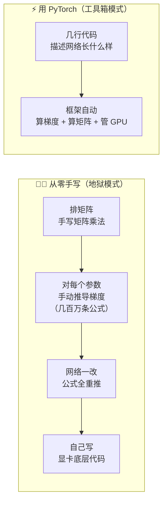
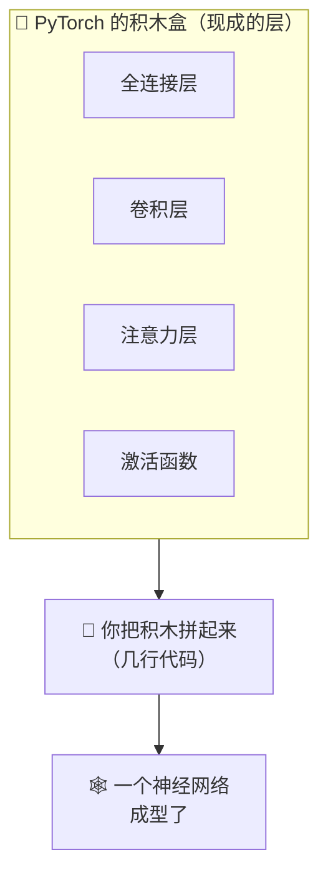
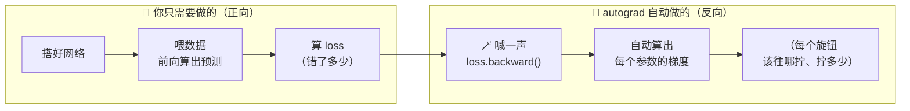
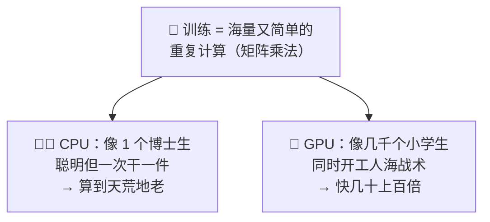
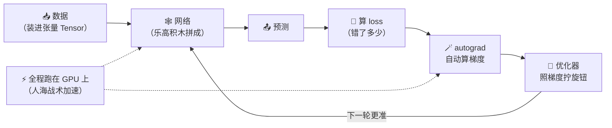
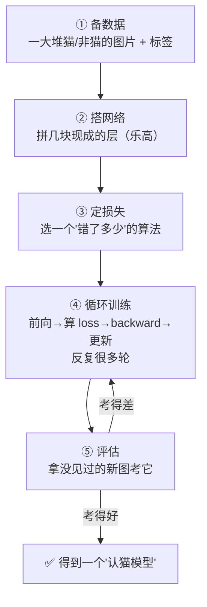
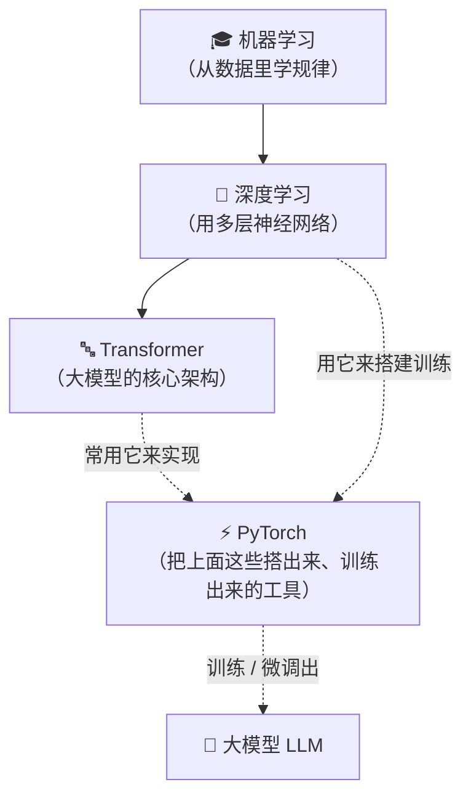

# ⑮ 什么是 PyTorch（深度学习框架）

> 建议先读 [⑭ 什么是 Transformer](./[CONCEPT-14]%20什么是Transformer-变换器.md)。那一篇讲"大模型内部那套让机器读懂语言的精巧架构长什么样"；这一篇往下落一层，讲一个更实在的问题：**这些神经网络、这套 Transformer 架构，工程师到底是拿什么"工具"把它搭出来、训练出来的？** 答案就是本篇的主角——**PyTorch**。它是把 [⑫ 机器学习](./[CONCEPT-12]%20什么是机器学习-MachineLearning.md) / [⑬ 深度学习](./[CONCEPT-13]%20什么是深度学习-DeepLearning.md) 从"纸上原理"落地成"能跑的代码"的那套**电动工具套装**。

---

## 一、一句话定义

**PyTorch = 一套最流行的"深度学习工具箱（框架）"，让工程师用几行代码就能搭出神经网络、自动算好梯度、还能用 GPU 加速训练。**

如果你只想记住一句话，就记这句：

> **PyTorch = 炼制 AI 模型的"电动工具套装"——脏活累活（求导、算矩阵、调显卡）它全包了，你只管专心设计网络。**

这一句话是整篇文档的骨架。后面所有的比喻、图、误区，都是在反复讲透这一句话。

```callout ask|小白发问
"框架""PyTorch"听着像很硬核的编程名词，其实道理特别朴素：你要盖房子，**不会自己去烧砖、炼钢、拧每一颗螺丝**——你会用现成的电钻、切割机、预制好的砖块。PyTorch 就是深度学习界的这一套 +[电动工具](现成的神经网络层、自动求导引擎、GPU 加速——都打包好了，拿来即用，不用你从零造)。你不用会写它，只要抓住一个画面：**框架把最烦、最容易出错的脏活替你干了，你腾出脑子专心想"这个网络该怎么设计"**。这一篇不需要你会任何数学，跟着"工具箱替你干脏活"这根线走就行～ 🐥
```


一句话摆清它和前几篇的关系：**深度学习是"用多层神经网络学规律"这门本事，PyTorch 是把这门本事真正做出来、跑起来的那把趁手工具。**

---

## 二、为什么需要 PyTorch？——从零手写神经网络有多苦

要理解框架的价值，先看看**没有框架**会有多惨。

假设你想亲手搭一个哪怕很小的神经网络，从零开始、不用任何工具，你得干这些活：

- 自己写代码把成千上万个数字（[⑨ Embedding](./[CONCEPT-09]%20什么是Embedding-向量.md)、权重）排成一个个矩阵，再手写矩阵乘法；
- **最要命的一步**：为了让网络能"学"（[⑬ 深度学习](./[CONCEPT-13]%20什么是深度学习-DeepLearning.md)里讲的反向传播），你得对网络里**每一个参数**手动推导它的"梯度"（该往哪个方向拧、拧多少），几百万个参数就得推几百万条求导公式；
- 网络结构改一点点（多加一层、换个激活函数），上面所有的求导公式**全得重新推一遍**；
- 想让它跑快点、用上显卡（GPU），还得自己去写和显卡打交道的底层代码。

这活**又繁琐、又极其容易出错**——一个求导公式抄错个正负号，整个网络就学不动，你还查不出错在哪。**这就是为什么绝大多数人根本不该、也不会从零手写。**

PyTorch 换了个思路：**把这些又脏又累又易错的活，全部打包成现成的工具**。你不用推导求导公式、不用手写矩阵乘法、不用碰显卡底层——这些它全帮你干了。你只需要用几行清清爽爽的代码，**描述"我这个网络长什么样"**，剩下的交给它。



### 没有框架会怎样？

那你会把 90% 的时间和精力，耗在**推公式、抓 bug、调显卡**这些跟"你的创意"毫无关系的苦差事上，真正想设计的网络反而没工夫琢磨。框架的意义，就是**把你从造轮子里解放出来**——让你专注在"设计"，而不是"造工具"。

| 有没有框架 | 你的时间花在哪 | 好比 |
|------------|----------------|------|
| **没有（从零手写）** | 大半耗在推导求导、手写矩阵、调显卡、抓 bug | 想做顿饭，却得先种菜、打铁做锅、劈柴生火 |
| **有（用 PyTorch）** | 几乎全花在"设计网络、试想法"上 | 走进备好食材和厨具的厨房，专心颠勺 |

---

## 三、核心比喻：备好的厨房 & 乐高积木

"框架"这个词太抽象，用两个你天天见的东西就能彻底焊死这个概念。

### 比喻一：一间"备好了的厨房"

你想做一顿饭，**不会自己先去种菜、养鸡、打铁做锅**。你走进厨房，食材、灶台、锅铲、油盐一应俱全，你只管**专心把菜炒好**。PyTorch 就是这样一间**为炼 AI 模型备好的厨房**：现成的网络层、求导引擎、优化器、跑显卡的能力，全给你摆在台面上了，你只管"炒你的菜"（设计你的网络）。

### 比喻二："乐高积木"

神经网络是**一层一层搭起来**的（[⑬ 深度学习](./[CONCEPT-13]%20什么是深度学习-DeepLearning.md)里的流水线）。PyTorch 把每一种"层"都做成了一块**现成的乐高积木**——全连接层是一块、卷积层是一块、注意力层是一块……你要搭网络，**不用自己造积木**，直接把现成的积木块**一块块拼起来**，一个神经网络就成型了。



两个比喻的**共同内核**：**你负责"创意和组装"，框架负责"提供零件和干脏活"。** 记住这一点，PyTorch 是什么就再也不会忘。

---

## 四、三大法宝：张量 + 自动微分 + GPU 加速

PyTorch 之所以强，靠的是三样看家本领。把这三样用大白话讲透，你就摸到它的骨架了。

| 法宝 | 大白话 | 好比 | 对应深度学习的哪一步 |
|------|--------|------|----------------------|
| **① 张量（Tensor）** | 能装一大堆多维数字、还能跑在显卡上的"超级数组" | 一个能无限叠层的**数字收纳盒** | 网络里流动的数据、权重全是张量 |
| **② 自动微分（autograd）** | 你只管把网络"正着"搭好，它自动帮你算"反向"的梯度 | 你走一遍迷宫，它自动记住**每一步怎么原路返回** | 反向传播（自动帮你算"旋钮该怎么拧"）|
| **③ GPU 加速** | 把海量计算丢给显卡"人海战术"并行算，快几十倍 | 一个人搬砖 vs 一千个人同时搬 | 让训练从"熬几个月"变成"跑几小时" |

### 法宝一：张量（Tensor）——能跑在显卡上的"超级数组"

**张量 = 一个能装多维数字的"超级数组"。** 一个数字是"零维"，一排数字（[⑨ 向量](./[CONCEPT-09]%20什么是Embedding-向量.md)）是"一维"，一张表格是"二维"，一张彩色图片（宽 × 高 × 红绿蓝三通道）就是"三维"……张量就是把这些**统一装进一个盒子**的东西。

它比普通数组厉害在两点：① **能轻松处理多维数据**（图片、视频、一段话都能装）；② **能一键搬到 GPU 上**去飞快地算。网络里流动的数据、每一个"旋钮"（参数），本质都是张量。

> ⚠️ 别被"张量"这个物理/数学名词吓到——在 PyTorch 里，你就把它当成**一个会算数、还能上显卡加速的多维数组**就行。不用懂它在数学上的严格定义，那跟你用它没半毛钱关系。

### 法宝二：自动微分（autograd）——最神奇的一样

这是 PyTorch **最迷人**的本领，直接呼应了[⑬ 深度学习](./[CONCEPT-13]%20什么是深度学习-DeepLearning.md)里那句"网络是被纠错纠出来的"。

回忆一下：网络学习靠的是**反向传播**——算出"每个旋钮该往哪拧、拧多少"（这个"该怎么拧"的信息，专业叫**梯度**）。从零手写时，这是**最苦的一步**：几百万个参数就得手推几百万条求导公式。

**autograd 把这一步彻底自动化了。** 你只需要**正着**把网络搭好、把数据喂进去、算出"错了多少"（loss）；然后喊一声"开始反向"（一行 `loss.backward()`），它就**自动、精确地**帮你把每一个参数的梯度全算好。你一条求导公式都不用推。

最好的比喻是**走迷宫记路**：你只管**正着往前走**（前向传播），autograd 像个贴心的助手，**默默记下你走的每一步**；等你到了终点想原路返回（反向传播），它照着记录**自动带你一步步走回去**，一步都不会错。



一句话记住：**autograd 让"反向传播"从"人肉推几百万条公式"，变成"喊一嗓子它全办了"。** 这是框架替你干掉的**最脏、最重要**的一件活。

### 法宝三：GPU 加速——把计算丢给显卡"人海战术"

训练一个网络，本质是**海量的、重复的、简单的数学运算**（主要是矩阵乘法）。这种活有个特点：**每一小块都很简单，但数量极其巨大**。

普通 CPU 像个**博士生**：很聪明，但一次只专心干一件复杂的事，让它算几亿次简单乘法，会算到天荒地老。GPU（显卡）像**几千个小学生**：单个不聪明，但**几千个同时开工**，那种"量大但每块都简单"的活，正好用"人海战术"一拥而上，**快几十倍甚至上百倍**。

PyTorch 把用 GPU 这件事变得**极其简单**——你不用碰任何显卡底层代码，基本就是把张量"搬"到 GPU 上（一句 `.to("cuda")` 之类），后续计算就自动飞快了。



**三大法宝合起来是一条龙**：数据装进**张量**里流过网络（前向）→ **autograd** 自动算好每个参数的梯度（反向）→ 全程都跑在 **GPU** 上飞快完成。下面这张图，就是三样法宝协作训练一个网络的全貌：



---

## 五、感觉一下：一段极简伪代码

**⚠️ 郑重提醒：下面这段代码你完全不用会写、不用看懂每一行。** 放它在这，只是让你**亲眼看一下**——用 PyTorch 搭个网络、让它学习，代码到底有多短、多清爽。请你只体会一件事：**那些最脏的活（求导、算矩阵、调显卡），代码里几乎看不见，因为框架全替你干了。**

```python
import torch
import torch.nn as nn

# ① 定义网络：像拼乐高——现成的层拼起来就是一个网络
model = nn.Sequential(
    nn.Linear(784, 128),   # 一块积木：全连接层
    nn.ReLU(),             # 一块积木：激活函数
    nn.Linear(128, 10),    # 又一块积木
)

# 定义"怎么算错了多少"和"怎么拧旋钮"
loss_fn = nn.CrossEntropyLoss()
optimizer = torch.optim.Adam(model.parameters())

# ② 训练循环：反复"前向 → 算错 → 自动求导 → 更新"
for images, labels in dataloader:          # 一批批喂数据
    predictions = model(images)            # 前向：网络吐出预测
    loss = loss_fn(predictions, labels)    # 算 loss：错了多少

    optimizer.zero_grad()                  # 清掉上一轮的旧梯度
    loss.backward()                        # 🪄 autograd 自动求导！这一行就是全部脏活
    optimizer.step()                       # 🔧 优化器照梯度，把每个旋钮拧一点点
```

看到那行 `loss.backward()` 了吗？**从零手写要推几百万条求导公式的地狱级脏活，在这里就是短短一行。** 这就是框架的魔力——**它把最难的部分，浓缩成了一句话。**

再看整个 `for` 循环，是不是正好就是[⑬ 深度学习](./[CONCEPT-13]%20什么是深度学习-DeepLearning.md)里讲的**射箭三步**？前向出预测（射一箭）→ 算 loss（看偏多少）→ `backward` + `step`（调姿势）→ 反复亿万次。**原理你早就懂了，PyTorch 只是把这套原理变成了几行能跑的代码。**

```flip
那行神奇的 `loss.backward()`，一句话说它到底干了啥？（点一下翻到背面）
---
它就是[⑬ 深度学习]里讲的**反向传播**的"一键版"：从零手写时，你得对几百万个参数**逐个手推求导公式**算出梯度（该往哪拧、拧多少），繁琐到令人绝望且极易出错；而 `loss.backward()` 让 **autograd** 帮你把这几百万个梯度**自动、精确地全算好**——一条公式都不用你推。这就是"框架替你干掉最脏那件活"的最典型例子。
```

把"从零手写的地狱脏活" vs "框架一行搞定"演成一幕小短剧——你会亲眼看到那行 `loss.backward()` 到底替你扛下了什么：

```scene 一行 loss.backward()，扛下了谁的地狱
> 同一个任务：算出几百万个参数各该往哪拧、拧多少（求梯度）。两个人的活法天差地别。
😫 从零手写派 | 我得对着几百万个参数，一个一个手推求导公式……链式法则套了十几层，一个符号写错，整个网络就训歪，还查不出来。这活能干到天亮。
🪄 PyTorch 派 | 我只写一行：`loss.backward()`。
😫 从零手写派 | ……就这？那几百万个梯度呢？
🪄 PyTorch 派 | +[autograd](自动微分：框架一路记着你的计算是怎么搭起来的，反向自动把每个参数的梯度精确算出来——一条公式都不用你推) 已经帮我全算好了，精确、不出错。我接着 `optimizer.step()` 照梯度把旋钮拧一点点，进下一轮。
🎉 旁白 | 看见没？从零手写要推几百万条公式的地狱级脏活，在框架里就是短短一行。这就是 PyTorch 的魔力——把最难的部分，浓缩成一句话。原理你早就懂（射箭三步：前向→算错→调姿势），PyTorch 只是把它变成了几行能跑的代码。
```

---

## 六、生态：PyTorch 不是唯一，但很多人偏爱它

PyTorch 是最流行的深度学习框架**之一**，但不是独一份。同类里还有几位"兄弟工具":

| 框架 | 一句话印象 | 好比 |
|------|-----------|------|
| **PyTorch** | 写起来**像普通 Python、调试直观**，改起来灵活——科研和业界都爱用 | 顺手好用、随手能拆开看的国民工具箱 |
| **TensorFlow** | Google 出品，工业部署生态成熟，早年是老大哥 | 老牌重型工具箱，厂房里用得多 |
| **JAX** | Google 出品，主打极致的自动微分与高性能计算，偏研究前沿 | 性能怪兽，高手向的专业工具 |

它们的**核心思想其实相通**——都是"张量 + 自动微分 + GPU 加速"这套三板斧，只是**手感、生态、偏好**不同。PyTorch 出名的地方在于：**写它就像写普通 Python 代码，出了问题也好一步步调试**，学习曲线相对友好，所以近年在研究圈和工业界都非常受欢迎。

> ⚠️ 不用纠结"该学哪个框架"。对小白来说，**它们背后的道理都一样**，你现在要懂的是"框架是干嘛的、帮你省了什么"，而不是急着去选一个来精通。真到你要动手那天，PyTorch 通常是**上手第一站**的好选择。

---

## 七、常见误区（新手最容易踩的坑）

这一节请务必逐条读完。这些误解会让你对"框架"这个概念的理解跑偏。

### 误区 1：以为 PyTorch 是一种模型 / 一个 AI

- ❌ **错误理解**：PyTorch 是不是一个像 ChatGPT 那样的 AI / 一个训练好的模型？我下载了它就有个 AI 了？
- ✅ **正确理解**：**完全不是。** PyTorch 是一个**工具库（工具箱）**，它本身**什么都不会**——它是**用来"造"和"训练"模型的工具**，不是模型本身。就像**电钻不是家具**，它是用来做家具的工具。你得用 PyTorch 去搭网络、喂数据、训练，最后才会得到一个"模型"。

### 误区 2：以为学 AI 必须先精通 PyTorch

- ❌ **错误理解**：想入门 AI，是不是得先把 PyTorch 学得滚瓜烂熟？
- ✅ **正确理解**：**顺序反了。** **先懂概念，比先学工具重要得多。** 你得先明白什么是[⑫ 机器学习](./[CONCEPT-12]%20什么是机器学习-MachineLearning.md)、[⑬ 深度学习](./[CONCEPT-13]%20什么是深度学习-DeepLearning.md)、什么是训练/梯度/loss——**懂了这些"道理"，工具只是把道理落地的"手"。** 拿着工具却不懂原理，就像会用电钻却不懂怎么设计家具，钻得再溜也做不出好东西。你现在读的这些概念文档，价值远在"背 PyTorch 语法"之上。

### 误区 3：以为没有 GPU 就不能用 PyTorch

- ❌ **错误理解**：我电脑没高级显卡，是不是就玩不了 PyTorch？
- ✅ **正确理解**：**能用，只是慢。** PyTorch 在普通 CPU 上照样能跑，学习、做小实验完全够用。GPU 只是**让训练快很多**的加速器，不是"没它就跑不动"的必需品。大型模型训练才离不开 GPU；你入门、练手，一台普通电脑足矣。

### 误区 4：以为框架会自动"想出"一个好模型

- ❌ **错误理解**：我把数据丢给 PyTorch，它是不是就能自动设计出一个厉害的网络？
- ✅ **正确理解**：**框架只负责"执行"，不负责"设计"。** 网络长什么样、几层、怎么连、用什么损失函数，**全得靠人（工程师）来设计**。PyTorch 只是**忠实地、飞快地执行你给的设计**并帮你训练——它是**听话的工具人，不是替你出主意的军师**。厨房再好，也得你来决定做什么菜、怎么配料。

### 误区 5：以为不同框架之间天差地别、学了这个那个就白学

- ❌ **错误理解**：PyTorch 和 TensorFlow 是不是两套完全不同的东西，学了一个另一个得从头再来？
- ✅ **正确理解**：**核心思想是相通的。** 它们都是"张量 + 自动微分 + GPU"这套三板斧，只是**写法和手感不同**。真正难的、值钱的是你脑子里那套**深度学习的原理**——原理懂了，换个框架只是换套"方言"，很快就能上手。**别把工具当门槛，原理才是根。**

```quiz
Q: 下面关于 PyTorch 的说法，哪些是对的？（多选）
- [x] PyTorch 是一套"工具箱/框架"，用来搭建和训练模型，它本身不是一个 AI
> 对。它是造模型的工具（像电钻），不是模型本身（家具）。
- [ ] 学 AI 必须先把 PyTorch 精通了才能开始
> 错。先懂概念（机器学习/深度学习/梯度/loss）比先学工具重要得多，工具只是把道理落地的"手"。
- [x] PyTorch 的三大法宝是张量（Tensor）、自动微分（autograd）、GPU 加速
> 对。数据装进张量→autograd 自动算梯度→全程跑在 GPU 上飞快完成，一条龙。
- [ ] 没有高级显卡（GPU）就完全没法用 PyTorch
> 错。CPU 上照样能跑，只是慢；GPU 是加速器不是必需品，入门练手普通电脑就够。
- [x] 网络怎么设计要靠人，PyTorch 只负责忠实地执行和训练，不会自己"想出"模型
> 对。框架是听话的工具人，不是替你出主意的军师；厨房再好也得你决定做什么菜。
```


---

## 八、动手小实验 / 思想实验

理论看再多，不如在脑子里走一遍流程。下面的思想实验不用写代码，只用想。

### 实验：脑内推演"教模型认猫"，PyTorch 在每一步给了你什么

假设你想训练一个能"认出照片里有没有猫"的模型。**跟着流程一步步走，每一步都留意：PyTorch 帮你把这一步变得多简单。**



现在把每一步和 PyTorch 对上号，体会"框架给你提供了积木":

| 步骤 | 你在干嘛 | PyTorch 递给你的"积木" |
|------|----------|------------------------|
| **① 备数据** | 把猫/非猫的图片和标签整理好、成批喂进去 | 现成的"数据加载器"，帮你自动分批、打乱、搬上 GPU |
| **② 搭网络** | 决定网络长什么样，拼起来 | 现成的各种"层"（积木块），几行拼成一个网络 |
| **③ 定损失** | 选一个衡量"猜得多离谱"的尺子 | 现成的各种损失函数，一行选好 |
| **④ 循环训练** | 反复前向、算 loss、求导、更新旋钮 | **autograd 自动求导** + 现成的优化器帮你拧旋钮 |
| **⑤ 评估** | 拿没见过的新图考它准不准 | 现成的工具帮你算准确率 |

**关键体会**：这五步里，**每一步 PyTorch 都递给你一块现成的积木**，你几乎不用从零造任何东西。你真正花心思的，只有"网络怎么设计、数据怎么准备"这些**创意活**；那些机械的、易错的脏活（尤其是第 ④ 步的求导），框架全包了。走完这一遍，你就亲手体会了"**框架把每一步都提供了积木**"这句话的分量。

---

## 九、和其它概念的关系

PyTorch 不是孤立的，它是把前面一串"原理"**落地成真"的那把工具。前面几篇讲的东西，很多最终都得靠它（或它的兄弟框架）才能变成能跑的代码。



| 概念 | 一句话关系 | 类比 |
|------|-----------|------|
| [⑫ 机器学习](./[CONCEPT-12]%20什么是机器学习-MachineLearning.md) | PyTorch 是**实现它**（尤其是深度学习那一支）的主力工具 | 手艺 vs 干这门手艺的工具 |
| [⑬ 深度学习](./[CONCEPT-13]%20什么是深度学习-DeepLearning.md) | 深度学习的"前向/反向/训练循环"，正是 PyTorch 帮你落地的 | 图纸 vs 施工的电动工具 |
| [⑭ Transformer](./[CONCEPT-14]%20什么是Transformer-变换器.md) | 这类架构**通常就是用 PyTorch 写出来**的 | 精巧的设计 vs 造出它的机床 |
| [⑥ 大模型 LLM](./[CONCEPT-06]%20什么是LLM-大语言模型.md) | 大模型的**训练和微调，很多都用 PyTorch** 完成 | 巨型产品 vs 生产它的产线 |

一句话串起来：**机器学习/深度学习是"原理"，Transformer 是"架构设计"，而 PyTorch 是把这些原理和设计，真正"造"出来、"训"出来的那把电动工具。** 懂了它，你就知道那些神经网络、大模型，工程师究竟是拿什么把它们变成现实的。

---

## 十、和 Khy-OS 的关系

先把话说明白，**这是最诚实、也最重要的一节**：

**Khy-OS 是一个 Node.js 工程，它"调用和编排"已经训练好的大模型，本身并不用 PyTorch 来训练模型。**

也就是说，Khy-OS 站在"**用模型**"这一侧，而不是"**训模型**"这一侧。训练模型是模型厂商用 PyTorch（或同类框架）在海量显卡上干的事；Khy-OS 拿到的是**已经炼好的成品模型**，它做的是把这些模型组织成好用的智能体、工具循环、记忆与检索。所以在 Khy-OS 的代码里，你**不会看到 PyTorch**——它跑在 Node.js 上，干的是"编排调度"的活，不是"炼丹训练"的活。

那你为什么还要懂 PyTorch？**因为它帮你补全整幅地图：**

- **知道模型从哪来**：你用 Khy-OS 调用的那些大模型，它们的"出生地"就是 PyTorch 这类框架里的训练过程。懂了这一层，模型对你就不再是"从天而降的黑盒"。
- **知道能力的边界从何而来**：模型会什么、不会什么，是**训练时**（用 PyTorch 在某批数据上）就定下的。懂训练，你就更懂[⑬ 深度学习](./[CONCEPT-13]%20什么是深度学习-DeepLearning.md)里讲的那些"脾气"（幻觉、知识截止、需要 RAG 补事实）从何而来。
- **给未来留一条路**：如果你日后不满足于"用模型"，想**自己训练或微调一个模型**，那 **PyTorch 就是你要迈进的第一站**。今天先把它是什么搞懂，来日方长。

> ⚠️ 这里只讲"概念级"的关系——**Khy-OS 用模型、而非用 PyTorch 训模型；懂 PyTorch 是为了补全"模型从哪来"这幅地图。** Khy-OS 具体怎么接模型、怎么编排调度，属于设计与实现层面，你可以在 [`docs/03_DESIGN_设计`](../03_DESIGN_设计) 目录里进一步了解。本文不夸大、也不编造 Khy-OS 用 PyTorch 训练模型的能力。

---

## 十一、小结 + 下一步

- **PyTorch = 一套最流行的"深度学习工具箱（框架）"，让你几行代码就能搭网络、自动算梯度、用 GPU 训练**——是炼制 AI 模型的"电动工具套装"。
- **为什么需要它**：从零手写神经网络，光是对几百万个参数手推求导公式就苦到令人绝望且极易出错；框架把这些脏活全打包好，让你专注设计而非造轮子。
- **核心比喻**：一间**备好的厨房**（食材厨具齐全，你只管炒菜）/ 一盒**乐高积木**（现成的层拼起来就是网络）。
- **三大法宝**：① **张量 Tensor**（能上 GPU 的超级多维数组）② **自动微分 autograd**（`loss.backward()` 一行，自动算好所有梯度，替你干掉最脏的反向传播）③ **GPU 加速**（把海量简单计算丢给显卡人海战术，快几十倍）。
- **感觉一下代码**：`for` 训练循环正是[⑬ 深度学习]的射箭三步——前向出预测→算 loss→`backward`+`step`；你不用会写，只感受"框架替你干了脏活"。
- **生态**：还有 TensorFlow、JAX 等同类，核心思想相通；PyTorch 以"像写普通 Python、调试直观"著称，科研业界都爱用。
- **五大误区**：它**不是一种模型/一个 AI**（是工具库）、学 AI**先懂概念比先精通它更重要**、**没 GPU 也能用**（只是慢）、框架**不会自己"想出"模型**（只执行你的设计）、不同框架**核心思想相通**（别把工具当门槛）。
- **地图位置**：机器学习/深度学习是原理、Transformer 是架构，PyTorch 是把它们"造出来、训出来"的工具；Khy-OS 站在"用模型"一侧，不用 PyTorch 训练——但你想自己训模型，它是第一站。

🎉 **恭喜，你又补上了一块关键拼图！** 从此，那些神经网络、大模型不再是"凭空出现的黑盒"——你已经知道，工程师是拿 PyTorch 这样的电动工具，一块块积木把它们搭出来、训出来的。

👈 回 [概念入门总览](./00_INDEX_概念入门-总览.md) 看看还有哪些能温故知新。

👈 上一篇 [⑭ 什么是 Transformer](./[CONCEPT-14]%20什么是Transformer-变换器.md)——回顾一下大模型内部那套精巧的架构。

👉 下一篇 [⑯ 什么是 Harness（智能体运行骨架）](./[CONCEPT-16]%20什么是Harness-智能体运行骨架.md)——回到 Khy-OS 自身：让大模型真正"干活"的那副外壳到底是什么。

👉 想换一种更轻松、更上头的方式把这些概念再过一遍？去看 [修仙学 AI 的故事](../09_STORY_修仙学AI/00_INDEX_修仙学AI-总目录.md)——把 Agent、工具、模型、框架，全编成了一个练功升级的江湖故事，保证你越读越明白。
