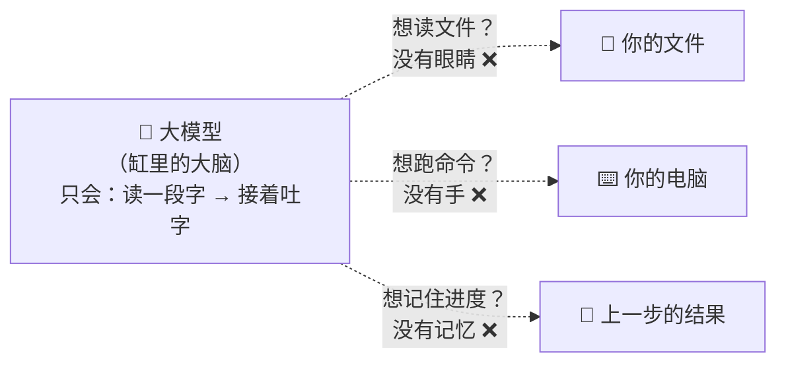
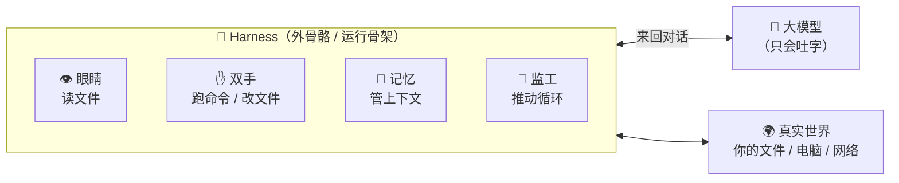
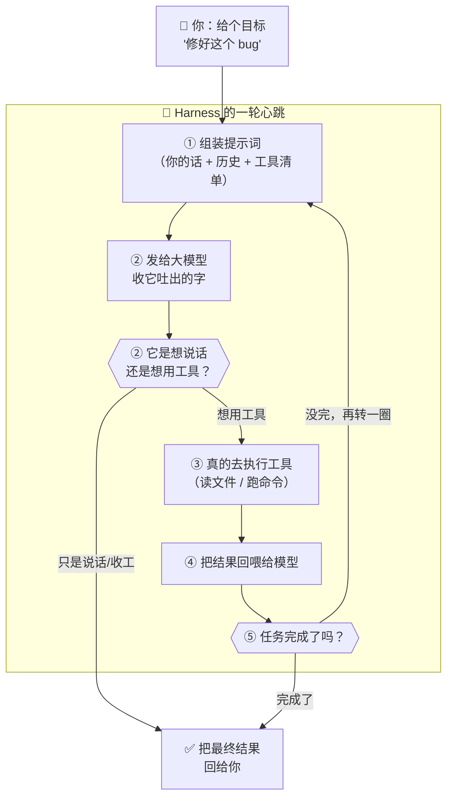
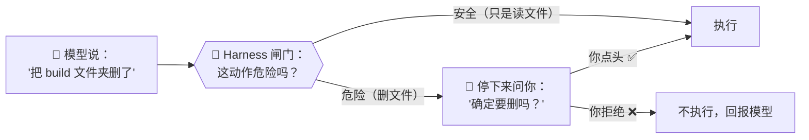
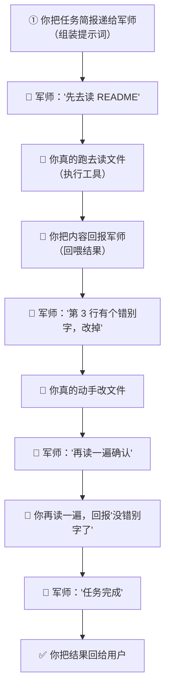
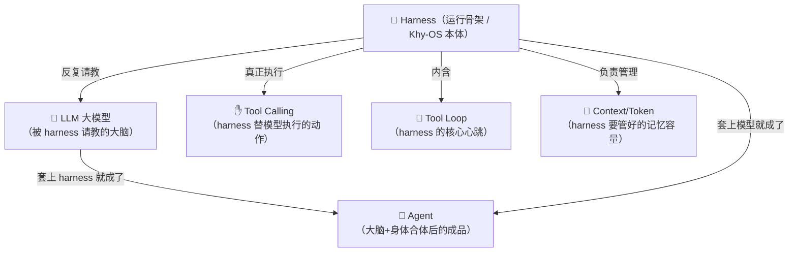

# ⑯ 什么是 Harness（智能体运行骨架）

> 建议先读 [① 什么是 Agent](./[CONCEPT-01]%20什么是Agent-智能体.md)、[③ 什么是 Tool Loop](./[CONCEPT-03]%20什么是ToolLoop-工具循环.md) 和 [⑥ 什么是 LLM](./[CONCEPT-06]%20什么是LLM-大语言模型.md)。那几篇讲了"大模型会接龙""助理会自己用工具""反复用工具直到完成"。这一篇要回答一个你可能一直没想通的问题：**大模型自己明明只会"吐字"，那到底是谁在替它读文件、跑命令、把结果再喂回去？谁在管那个"反复"的循环？** 答案，就是本篇的主角——**Harness（运行骨架）**。它就是 **Khy-OS 这个项目本身的真身**。

---

## 一、一句话定义

**Harness = 包在大模型外面、让它能真正"干活"的那层运行骨架（外壳 + 循环 + 手脚）。**

如果你只想记住一句话，就记这句：

> **大模型是"缸里的大脑"——它只会想、会说，却没有手、没有眼、没有脚。Harness 就是给这颗大脑接上眼睛、双手和双脚，再推着它一圈圈把活干完的那套"外骨骼"。**

这一句话是整篇文档的骨架。后面所有的比喻、图、误区，都是在反复讲透这一句话。

```callout ask|小白发问
"Harness"这个词看着陌生，其实你天天在用它——你用的 Khy-OS、别人用的 Claude Code、Cursor，**这些工具本身就是 harness**。大模型（比如 GPT、Claude）是别人训练好的"大脑"，可大脑光会说话没用啊：它说"我要读 README 文件"，谁去读？它说"帮我跑一下测试"，谁去跑？是 harness！Harness 就是那个**听懂大脑的话、真的伸手去干、再把结果回报给大脑**的+[外壳程序](它是一段真实的软件——Khy-OS 就是用 Node.js 写的——不是模型的一部分，而是把模型"包"起来用的那层程序)。这一篇不需要你懂任何代码，抓住"给大脑装身体"这个画面就行～ 🐣
```

一句话摆清它和前几篇的关系：**[Agent](./[CONCEPT-01]%20什么是Agent-智能体.md) 是"会自己拿主意的助理"这个概念，[Tool Loop](./[CONCEPT-03]%20什么是ToolLoop-工具循环.md) 是"反复用工具"这套流程——而 Harness，是把这两者真正落地成一个能跑的程序的那个"身体"。**

---

## 二、为什么需要 Harness？——大模型是"缸里的大脑"

要理解 harness 的价值，先得看清一个很多人没意识到的真相：**大模型本身，什么都干不了。**

[⑥ LLM](./[CONCEPT-06]%20什么是LLM-大语言模型.md) 那一篇讲过，大模型的本事就一样：**给它一段文字，它接着往下吐字。** 就这么点能力。它：

- **看不见**你的文件——它没有眼睛；
- **动不了**你的键盘、跑不了任何命令——它没有手；
- **记不住**上一句话之外的事，除非你把上下文再喂给它——它没有长期记忆；
- 甚至**不知道现在几点**——它只是个"文字接龙"引擎。

打个比方：大模型就像科幻片里那个**泡在营养液缸里的大脑**——它绝顶聪明，能思考、能对话，可它没有身体。你问它"窗外天气如何"，它只能凭空猜，因为它**没有眼睛去看、没有腿走到窗边**。



那么问题来了：既然大模型只会吐字，我们平时用的 AI 编程助手，怎么就能**真的帮我们读文件、改代码、跑测试**了呢？

**答案就是 harness。** Harness 是包在大脑外面的一套"外骨骼"，它给这颗大脑装上了：眼睛（读文件的能力）、双手（执行命令的能力）、记忆（管理上下文）、还有一个不知疲倦的"监工"（推动循环一圈圈跑）。



**没有 harness，大模型就是个只会聊天的"缸中大脑"；套上 harness，它才变成能真正干活的"智能体"（Agent）。** 这，就是为什么需要 harness。

---

## 三、核心比喻：给大脑装一身"机甲外骨骼"

"运行骨架"这个词太抽象，用两个你在电影里见过的画面就能彻底焊死这个概念。

### 比喻一：钢铁侠的战甲

托尼·斯塔克（钢铁侠）本人，聪明绝顶，可肉身也就是个普通人——扛不住子弹、飞不上天。真正让他能上天入地的，是那身**战甲**：战甲有推进器（腿）、有机械臂（手）、有平视显示器（眼睛和仪表盘）、有中控 AI 管着这一切。

**大模型 = 托尼本人（聪明的大脑）；Harness = 那身战甲（让聪明能真正使出来的身体）。** 脱了战甲，再聪明也只是个凡人；穿上战甲，才是钢铁侠。

### 比喻二：坐在轮椅上指挥的"军师"与替他跑腿的"亲兵"

想象一位运筹帷幄的军师，脑子里全是妙计，可他腿脚不便，出不了帐篷。他身边有个亲兵：军师说"去看看城墙有没有破损"，亲兵就跑去看，回来禀报；军师说"传令三营向左"，亲兵就跑去传令，再回来复命。军师**只负责想、只负责下令**；亲兵**负责真的跑腿、真的动手、再把结果如实回报**。

**大模型 = 军师（只想、只下令）；Harness = 亲兵（真跑腿、真动手、真回报，还一趟趟往返直到事成）。**


两个比喻的**共同内核**：**聪明的那一方（大脑/军师）只负责"想和说"，身体的那一方（战甲/亲兵）负责"真的去做、并把结果带回来"。** 记住这一点，harness 是什么就再也不会忘。

---

## 四、Harness 到底在忙什么？——一轮循环里的五件事

把 harness 拆开看，它在每一轮里其实就忙五件事，环环相扣。这五件事，正好把前面几篇的概念都串了起来。

| 步骤 | Harness 干的活 | 大白话 | 对应哪一篇概念 |
|------|----------------|--------|----------------|
| **① 组装** | 把你的话 + 历史 + 可用工具清单，拼成一段完整的提示词发给模型 | 亲兵把"战况简报"整理好递给军师 | [⑦ Prompt](./[CONCEPT-07]%20什么是Prompt-提示词.md) / [⑧ Context](./[CONCEPT-08]%20什么是Context与Token-上下文与令牌.md) |
| **② 接话** | 收到模型吐出的字，判断它是想"说话"还是想"用工具" | 听懂军师这句是闲聊还是下令 | [② Tool Calling](./[CONCEPT-02]%20什么是ToolCalling-工具调用.md) |
| **③ 动手** | 如果模型要用工具，**真的去执行**（读文件、跑命令……） | 亲兵真的跑去干那件事 | [② Tool Calling](./[CONCEPT-02]%20什么是ToolCalling-工具调用.md) |
| **④ 回喂** | 把工具执行的结果，塞回给模型，让它接着想下一步 | 亲兵把结果如实回报军师 | [③ Tool Loop](./[CONCEPT-03]%20什么是ToolLoop-工具循环.md) |
| **⑤ 判停** | 判断"任务到底完没完"——没完就回到①再转一圈，完了就收工 | 亲兵判断"还要不要再跑一趟" | [③ Tool Loop](./[CONCEPT-03]%20什么是ToolLoop-工具循环.md) |

把这五步连起来，就是 harness 的"心跳"——一个转不停的圈：



看懂这张图，你就看懂了**你每次用 Khy-OS 时，屏幕背后到底在发生什么**：不是模型自己在读你的文件——是 harness 在读，读完喂给模型，模型说"下一步这么办"，harness 再去办。**大模型负责决策，harness 负责一切"真实的动作"和"把圈转起来"。**

```callout star|一句话点睛
你可能一直以为"是 AI 在读我的文件、跑我的命令"。真相是：**AI（大模型）从头到尾一个字节都没碰过你的电脑**——所有真实动作，都是 harness 这个程序替它做的。模型只是在"出主意"。想通这一层，你对 AI 助手的理解就上了一个台阶。
```

---

## 五、Harness 还悄悄干了两件"脏活"

除了上面那个主循环，一个成熟的 harness（比如 Khy-OS）还默默扛着两件又重要、又容易被忽略的活。

### 脏活一：管住"记忆的容量"（上下文管理）

[⑧ Context 与 Token](./[CONCEPT-08]%20什么是Context与Token-上下文与令牌.md) 讲过，大模型的"记忆窗口"是有限的，装满了就会"忘事"。可一个复杂任务，来来回回几十轮，历史越堆越长，迟早撑爆窗口。

**是 harness 在替你操心这件事**：它会决定"哪些旧对话可以压缩、哪些必须留着"，在窗口快满时**把前面的过程总结成摘要**，腾出空间让任务能继续走下去。你能连续干一个大活儿而不是刚聊几句就"失忆"，全靠 harness 在背后管理这块记忆。

### 脏活二：守住"安全的闸门"（权限与确认）

大模型有时会"想当然"地说"把这个文件夹删了吧"。如果直接照做，可能就闯祸了。

**Harness 是那道闸门**：危险的动作（删文件、跑一条能改动系统的命令、往外网发数据），它会**先停下来问你一句"确定吗？"**，得到你点头才继续。这道"人来把关"的闸门，正是 harness 的安全底线——它让"AI 自动干活"不至于变成"AI 闯祸没人拦"。



> ⚠️ 这一节很重要：**AI 助手"安全不安全"，很大程度上不取决于模型本身，而取决于外面这层 harness 的闸门设计得好不好。** 一个好的 harness，会在"让 AI 自由发挥"和"别让它闯祸"之间守住平衡。

---

## 六、感觉一下：Harness 就是那段"主程序"

**⚠️ 郑重提醒：下面这段极简伪代码你完全不用会写、不用看懂每一行。** 放它在这，只是让你**亲眼看一下**——harness 的核心，其实就是一个"转圈"的主程序。请你只体会一件事：**模型（`ask_model`）只被"问"、只负责"出主意"；真正"动手"（`run_tool`）和"转圈"（`while`）的，全是 harness 这段程序。**

```python
# 这就是一个 harness 最核心的骨架——一个"转圈"的主程序
history = [你的目标]                      # ① 一开始，历史里只有你的目标

while True:                              # 🔁 转圈：一轮一轮来
    reply = ask_model(history)          # ② 把历史发给大模型，收它的回话
    history.append(reply)

    if reply.想用工具:                    # ③ 模型说它想用某个工具？
        result = run_tool(reply.工具)    #    ← harness 真的去执行！（模型碰不到这一步）
        history.append(result)          # ④ 把结果塞回历史，喂给模型
        # 回到 while 顶部，再转一圈
    else:                               # ⑤ 模型不再要工具了 = 任务做完
        break                           #    收工，把 reply 回给你

回给你(reply)
```

看到那个 `while True` 了吗？**那就是 [Tool Loop](./[CONCEPT-03]%20什么是ToolLoop-工具循环.md) 的真身**——harness 靠这个圈，推着模型"用工具→看结果→再决定"，一圈圈直到任务完成。而 `run_tool(...)` 那一行，就是 harness 那双"真的会动手"的手。

**整段程序里，`ask_model` 只是"问一句"，其余全是 harness 的活。** 这就是为什么我们说：**Khy-OS（一个 harness）才是那个真正在"干活"的主体，大模型只是被它反复请教的"军师"。**

```flip
既然真正干活的是 harness，那大模型岂不是可有可无？（点一下翻到背面）
---
恰恰相反——两者缺一不可，是**黄金搭档**：harness 有手有脚有循环，却**没脑子**（它不知道"下一步该干嘛"，那得靠模型的判断）；大模型绝顶聪明会决策，却**没手没脚**（它动不了你的电脑）。Harness 提供"身体和循环"，大模型提供"大脑和决策"。就像战甲再强也得有托尼来穿，托尼再聪明也得有战甲才能上天——**身体 + 大脑，合起来才是一个能干活的智能体（Agent）。**
```

把那段"转圈主程序"演成一幕小短剧——重点看模型只动嘴出主意，真正动手和转圈的全是 harness：

```scene 军师与亲兵：出主意的和真动手的，不是同一个
🧑 你 | 帮我看看 config.json 里端口配的是多少。
🦾 Harness | （把你的目标放进历史，开始转圈）我先把历史递给模型，问它下一步干嘛。
🧠 模型（军师） | 要回答这个，得读 config.json。我不能自己读——我只能"说"我想读。
🦾 Harness | 收到。模型说想用"读文件"工具——那**我**真的去执行（模型碰不到这一步）。
🦾 Harness | 读完了，把文件内容塞回历史，再喂给模型。
🧠 模型（军师） | 看到了，里面写着 "port": 8080。信息够了，不用再动工具。
🦾 Harness | 模型这轮不要工具了 = 任务做完，跳出循环，把结论回给你。
✅ Harness | config.json 里端口配的是 8080。
> 模型只"问一句、出主意"，+[真的动手和转圈的全是 harness](ask_model 只负责出主意，run_tool 和 while 循环全是 harness——身体+大脑合起来才是能干活的 Agent)——这就是 harness 的真身。
```

---

## 七、常见误区（新手最容易踩的坑）

这一节请务必逐条读完。这些误解会让你对"harness"这个概念的理解跑偏。

### 误区 1：以为"是 AI 在读我的文件、跑我的命令"

- ❌ **错误理解**：我让 Claude Code / Khy-OS 改代码，是那个 AI 大模型亲自在操作我的电脑。
- ✅ **正确理解**：**大模型从没碰过你的电脑。** 它只会吐字（比如吐出"我想读 README.md"）。真正去读文件、跑命令、改代码的，是外面这层 **harness 程序**。模型出主意，harness 干活——分工分明。

### 误区 2：以为 Harness 就是那个大模型

- ❌ **错误理解**：Khy-OS、Cursor 这些工具，是不是就等于里面的那个 AI 模型？
- ✅ **正确理解**：**是两码事。** 大模型（GPT、Claude 等）是别人训练好的"大脑"，通常通过网络接口调用。Harness（Khy-OS）是**包在模型外面、运行在你这边**的一整套程序——它决定怎么组装提示词、有哪些工具可用、怎么管上下文、怎么把关安全。**同一个模型，配不同的 harness，用起来能天差地别。**

### 误区 3：以为 Harness 越"聪明"越好

- ❌ **错误理解**：好的 harness 是不是应该自己也很"智能"、自己会思考？
- ✅ **正确理解**：**Harness 恰恰不需要"聪明"，它需要"可靠"。** 思考交给模型；harness 要做的是**稳、准、安全**：准确地执行工具、老实地回喂结果、稳当地管好上下文、严格地守住安全闸门。一个"自作聪明"乱改模型意图的 harness，反而是灾难。**大脑要灵，身体要稳。**

### 误区 4：以为 Tool Loop 和 Harness 是一回事

- ❌ **错误理解**：[Tool Loop](./[CONCEPT-03]%20什么是ToolLoop-工具循环.md) 和 harness 好像都在讲"反复干活"，是不是同一个东西？
- ✅ **正确理解**：**Tool Loop 是"那个循环"这套流程；Harness 是"跑这个循环的整个程序"。** 关系是：**Tool Loop 是 harness 的心跳，但 harness 不止有心跳**——它还管组装提示词、管上下文、守安全闸门。可以说：**Harness ⊃ Tool Loop**（循环是骨架的一部分，骨架比循环更大）。

### 误区 5：以为换个更强的模型就够了，harness 无所谓

- ❌ **错误理解**：只要模型够强，harness 随便写写都行吧？
- ✅ **正确理解**：**再强的大脑，也要靠身体才能使出来。** 同一个顶级模型，配一个糟糕的 harness（工具给得少、上下文管得烂、安全没把关），体验会很差甚至危险；配一个精心设计的 harness，才能把模型的能力完整、安全地发挥出来。**Khy-OS 这类项目的全部价值，正在于把这层"身体"做好。**

```quiz
Q: 下面关于 Harness 的说法，哪些是对的？（多选）
- [x] 大模型只负责"出主意"，真正读文件、跑命令的是 harness 这层程序
> 对。模型从没碰过你的电脑，所有真实动作都由 harness 替它执行。
- [ ] Harness 就是那个大语言模型本身
> 错。模型是"大脑"（别人训练好的），harness 是包在外面、运行在你这边的整套程序（比如 Khy-OS）。
- [x] Tool Loop（工具循环）是 harness 的核心心跳，但 harness 干的活不止这个循环
> 对。Harness 还管组装提示词、管上下文容量、守安全闸门——循环只是它的一部分。
- [x] Harness 会在危险动作（如删文件）前停下来问你，这是它的安全闸门
> 对。人来把关的闸门，是 harness 的安全底线。
- [ ] 只要模型够强，harness 写得好不好无所谓
> 错。再强的大脑也要靠身体才能使出来；同一个模型配不同 harness，体验能天差地别。
```

---

## 八、动手小实验 / 思想实验

理论看再多，不如在脑子里走一遍流程。下面的思想实验不用写代码，只用想。

### 实验：把你自己想象成 Harness，替"缸中大脑"跑一趟腿

假设有位绝顶聪明但**看不见、动不了**的军师（大模型）坐在帐中，你是他唯一的亲兵（harness）。他给你的任务是："帮我确认 `README.md` 里没有错别字，有就改掉。" **跟着流程一步步走，每一步都留意：哪些是军师做的（想），哪些是你做的（真动手）。**



走完这一遍，请你回答自己三个问题：

1. 军师（模型）**亲手碰过文件吗**？——没有。他只是一直在"想和下令"。
2. 每一次"真的读、真的改"，是谁干的？——**是你，亲兵（harness）。**
3. 那个"读→改→再读确认"的**循环**，是谁在推动？——**也是你（harness）**，你判断"还要不要再跑一趟"。

**关键体会**：你刚刚在脑子里，亲手当了一回 harness。你会发现，**harness 一点都不"智能"——它只是忠实、可靠地跑腿和转圈**。而正是这份"忠实可靠的跑腿"，让一个动不了的聪明大脑，变成了真能把事办成的智能体。这，就是 harness 的全部精髓。

---

## 九、和其它概念的关系

Harness 不是一个孤立的词，它更像是**把前面所有概念"装在一起、跑起来"的那个容器**。



| 概念 | 一句话关系 | 类比 |
|------|-----------|------|
| [① Agent](./[CONCEPT-01]%20什么是Agent-智能体.md) | 大模型 **+ harness = 一个能干活的 Agent** | 托尼 + 战甲 = 钢铁侠 |
| [⑥ LLM](./[CONCEPT-06]%20什么是LLM-大语言模型.md) | Harness 反复请教的那个"大脑" | 军师（只想、只下令） |
| [② Tool Calling](./[CONCEPT-02]%20什么是ToolCalling-工具调用.md) | 模型想用工具，**真正去执行的是 harness** | 亲兵真的跑去干那件事 |
| [③ Tool Loop](./[CONCEPT-03]%20什么是ToolLoop-工具循环.md) | Tool Loop 是 harness 的**核心心跳** | 亲兵一趟趟往返直到事成 |
| [⑧ Context 与 Token](./[CONCEPT-08]%20什么是Context与Token-上下文与令牌.md) | Harness 负责在窗口快满时**压缩、管理记忆** | 帮军师把厚厚的战报缩成简报 |
| [④ MCP](./[CONCEPT-04]%20什么是MCP-模型上下文协议.md) | Harness 通过 MCP 这个标准插座**给模型接更多工具** | 给战甲加装新的外接武器 |

一句话串起来：**大模型是大脑，工具是手脚，工具循环是心跳，上下文是记忆——而 harness，就是把这一切装配在一起、通上电、让它真正"活"起来跑动的那副身体。**

---

## 十、和 Khy-OS 的关系

这一节，是这整篇文档里**和你手上项目关系最紧、最该记牢**的一节：

**Khy-OS 本身，就是一个 harness。**

你正在用、正在学、正在维护的这个 Khy-OS，它不是一个大模型——它是**包在大模型外面的那层运行骨架**。它干的，正是这篇文档从头讲到尾的那些活：

- 它用 **Node.js** 写成，跑在你的机器上（模型跑在远端，通过网络请求调用）；
- 它把你的话、历史、可用工具**组装成提示词**发给模型；
- 模型说"我要用某个工具"，**是 Khy-OS 真的去读文件、跑命令、改代码**；
- 它把结果**回喂**给模型，靠 [Tool Loop](./[CONCEPT-03]%20什么是ToolLoop-工具循环.md) 一圈圈推进；
- 它管着**上下文容量**（窗口快满就压缩），守着**安全闸门**（危险动作先问你）。

所以，当你翻看 Khy-OS 的源码时，你看到的**几乎全是 harness 的实现**——那些"网关""工具循环""会话管理""权限确认"的代码，就是这副"外骨骼"的一根根骨头。

> 💡 换个角度说：**你学 Khy-OS，本质上就是在学"一个真实的 harness 是怎么造出来的"。** 这也正是它作为你"入行 AI 第一个项目"的珍贵之处——市面上很多人只会"调用大模型 API"，而你从第一天起，摸的就是**整副身体的骨架**。这幅地图你踩熟了，再看任何一个 AI 编程助手（Claude Code、Cursor……），你都能一眼看穿它"身体里"在干什么。

> ⚠️ 诚实说一句边界：不同 harness 的具体做法（怎么管上下文、给哪些工具、怎么设计闸门）各有讲究，Khy-OS 的具体实现细节，属于设计与实现层面，你可以在 [`docs/03_DESIGN_设计`](../03_DESIGN_设计) 目录里深入了解。本文只讲"harness 是什么、为什么需要它"这一层概念地图。

---

## 十一、小结 + 下一步

- **Harness = 包在大模型外面、让它能真正"干活"的那层运行骨架**——给"缸中大脑"装上眼睛、双手、记忆和一个推动循环的监工。
- **为什么需要它**：大模型只会"接龙吐字"，看不见文件、动不了电脑、记不住进度；harness 给它接上了身体，才让它从"会聊天的大脑"变成"能干活的智能体"。
- **核心比喻**：钢铁侠的**战甲**（让聪明的托尼能上天入地）/ 替军师跑腿的**亲兵**（军师只想只下令，亲兵真跑腿真回报）。
- **一轮里的五件事**：① 组装提示词 → ② 接话判断（说话还是用工具）→ ③ 真的执行工具 → ④ 回喂结果 → ⑤ 判停（没完再转一圈）。
- **两件脏活**：管好**上下文容量**（窗口满了就压缩）、守住**安全闸门**（危险动作先问你）。
- **黄金搭档**：harness 有身体没脑子，模型有脑子没身体——**身体 + 大脑 = 一个能干活的 Agent**，缺一不可。
- **五大误区**：不是 AI 在碰你电脑（是 harness）、harness ≠ 模型、harness 要**可靠不要自作聪明**、Tool Loop 只是 harness 的一部分、再强的模型也要靠好 harness 才能发挥。
- **和 Khy-OS 的关系**：**Khy-OS 本身就是一个 harness**——你学它、维护它，就是在学"一副真实的运行骨架是怎么造出来的"。

🎉 **恭喜，你摸到了整个 AI 编程助手的"骨架"！** 从此你再用任何 AI 助手，都能看穿：屏幕背后，是一层 harness 在替一颗"缸中大脑"跑腿、转圈、把关——而 Khy-OS，就是这样一副你可以亲手拆开来看的骨架。

👈 回 [概念入门总览](./00_INDEX_概念入门-总览.md) 看看还有哪些能温故知新。

👈 上一篇 [⑮ 什么是 PyTorch](./[CONCEPT-15]%20什么是PyTorch-深度学习框架.md)——回顾一下模型是用什么"电动工具"造出来的。

👉 下一篇 [⑰ 什么是 YOLO（实时目标检测）](./[CONCEPT-17]%20什么是YOLO-实时目标检测.md)——换个领域，看看 AI 是怎么"一眼"看清一张图里所有东西的。
