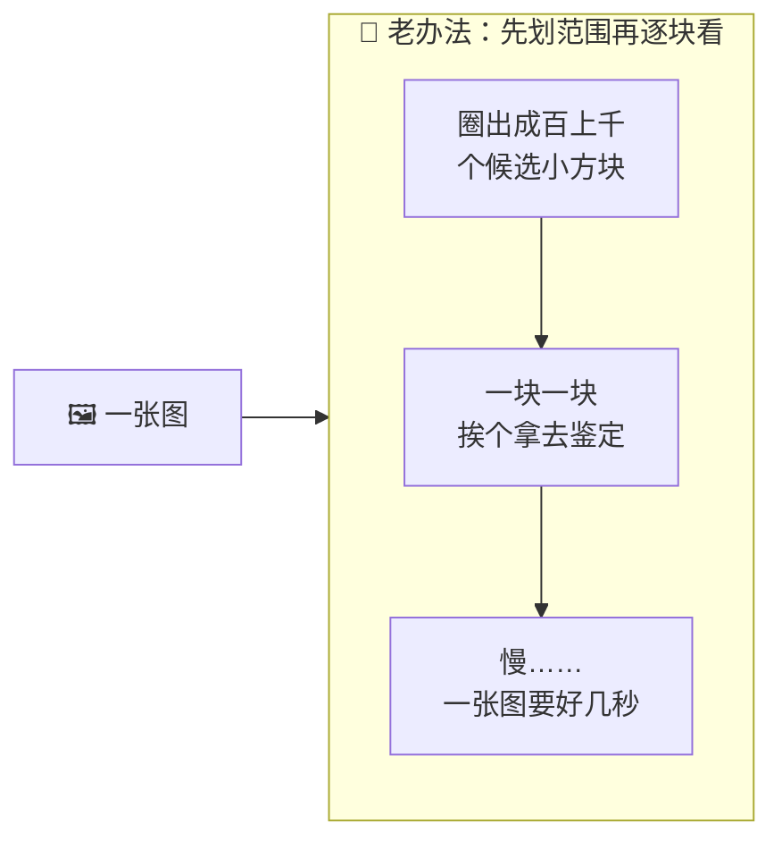
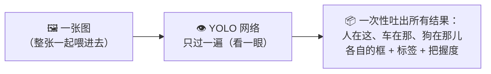
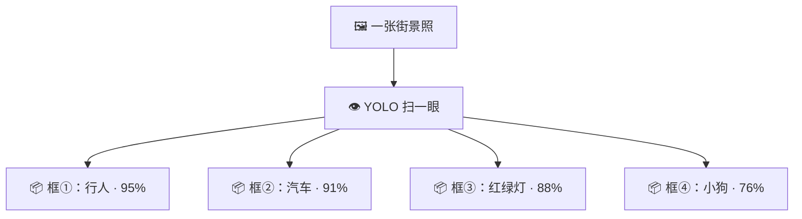
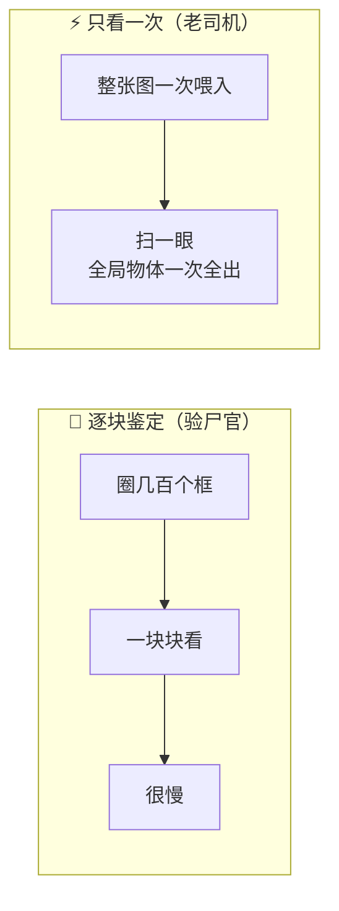
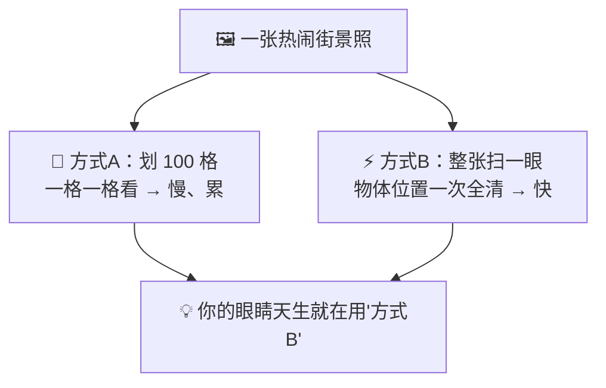
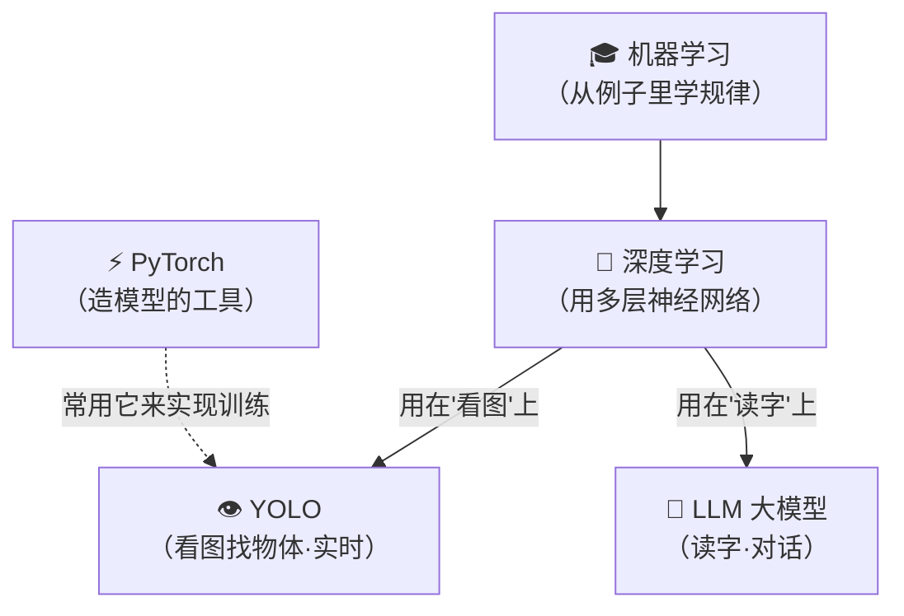

# ⑰ 什么是 YOLO（实时目标检测）

> 建议先读 [⑫ 什么是机器学习](./[CONCEPT-12]%20什么是机器学习-MachineLearning.md) 和 [⑬ 什么是深度学习](./[CONCEPT-13]%20什么是深度学习-DeepLearning.md)。前面几篇几乎都在讲"AI 怎么读懂**文字**"；这一篇换一个全新的领域——**AI 怎么看懂一张图**。具体说：**AI 是怎么做到"扫一眼"照片，就同时认出里面有几个人、几辆车、几只狗，还把每个都用方框框出来的？** 这就是本篇的主角——**YOLO**。

---

## 一、一句话定义

**YOLO = 一种能"扫一眼整张图，就同时找出里面所有物体、并把每个框出来"的 AI 技术，快到能实时处理视频。**

YOLO 是四个英文单词的缩写：**You Only Look Once**——"**你只需看一眼**"。这名字，就是它最大的本事。

如果你只想记住一句话，就记这句：

> **YOLO = 让 AI 像人一样"一眼扫过去"，瞬间看清一张图里有哪些东西、各自在哪——不用来来回回反复端详。**

这一句话是整篇文档的骨架。后面所有的比喻、图、误区，都是在反复讲透这一句话。

```callout ask|小白发问
先分清一件事：你手机相册能"自动识别猫狗人脸"、马路上的摄像头能框出每一辆车、自动驾驶能看清路上的行人红绿灯——这类"**在一张图里找出东西、还框出位置**"的活，专业叫 +[目标检测](object detection：不只是回答"这张图里有没有猫"，而是要指出"猫在这里、狗在那里"，把每个物体都用方框圈出来、贴上标签)。YOLO，就是目标检测里**最出名、最快**的一套方法。它和前面讲的文字大模型是**两条不同的路**——一条读文字，一条看图像——但底子都是 [⑬ 深度学习](./[CONCEPT-13]%20什么是深度学习-DeepLearning.md) 那套"神经网络"。这一篇不需要任何数学，跟着"看一眼就全看清"这根线走就行～ 🐣
```

---

## 二、YOLO 之前：AI 看图有多"磨叽"

要理解 YOLO 快在哪，先看看**在它之前**，AI 看图有多费劲。

早期让 AI 在一张图里找东西，用的是一种"**先划范围，再一块块看**"的笨办法。打个比方，就像一个特别谨慎的保安，在一张大合影里找人：

- 他先在照片上**圈出成百上千个可能有东西的小方块**（"这块可能是人？那块可能是狗？"）；
- 然后**一个方块一个方块地拿去仔细端详**："这块里是不是人？……不是。下一块……是狗吗？……"
- 成百上千个方块，**挨个看一遍**，慢得令人发指。

这种"先提一堆候选框、再逐个鉴定"的路子，虽然准，但**极慢**——处理一张图要好几秒，想用它来看**实时视频**（一秒几十帧画面）？做梦。



**问题的核心**：老办法把"看图"拆成了**成百上千次重复的小鉴定**，看一张图等于看几百次，能不慢吗？

---

## 三、YOLO 的绝招：把"看图"变成"扫一眼"

YOLO 换了个天才的思路，一句话概括：**别再一块块地看了——把整张图一次性喂进网络，"扫一眼"就同时把所有物体的"是什么"和"在哪里"全吐出来。**

还是那个找人的比方。老办法的保安是"逐块鉴定"，而 YOLO 像一个**经验老到的领队**：他往人群里**扫一眼**，当场就报出——"左边 3 个人、中间 1 辆车、右下角 1 只狗"，位置、种类，**一次全说清**，根本不用一块块端详。

"You Only Look **Once**"——**只看一次**，说的就是这个：**整张图，只过一遍网络，答案全出来。**



因为只需"看一眼"，YOLO **快得惊人**——快到可以**实时处理视频**：摄像头每秒送来几十帧画面，它每一帧都能瞬间框出所有物体。这就是为什么自动驾驶、安防监控、体育转播里的实时分析，都爱用它。

### 它到底"吐"出什么？

YOLO 看完一张图，对**每一个**它找到的物体，都给你三样东西：

| 它给你的 | 大白话 | 例子 |
|----------|--------|------|
| **① 一个方框（Bounding Box）** | 这东西在图里的**哪个位置**，用一个矩形框圈出来 | 把那只猫用红框框住 |
| **② 一个标签（Label）** | 这东西**是什么** | "猫" |
| **③ 一个把握度（Confidence）** | 它有**多大把握**没认错，用百分比表示 | "92% 确定是猫" |



**一句话记住**：YOLO 的输出，就是往图上**啪啪贴一堆方框**，每个框告诉你"这是什么、在哪、我多有把握"。你在自动驾驶演示视频里看到的那些满屏跳动的彩色框，十有八九就是 YOLO 画的。

---

## 四、核心比喻：老中医"望闻问切" vs 老司机"一眼扫路"

"只看一次"这个绝招，用两个画面能彻底焊死。

### 比喻一：逐块鉴定的"验尸官" vs 扫一眼的"老侦探"

老办法像**验尸官**：一寸一寸、一块一块地检验，不放过任何角落，**准是准，但极慢**。YOLO 像**经验老到的老侦探**：进屋**扫一眼**，当场就说"死者男性、桌上有搏斗痕迹、窗户被人动过"——**一眼之间，全局尽收**。两者都能得出结论，但一个靠"逐块死磕"，一个靠"一眼通观"。

### 比喻二：老司机开车"扫一眼路面"

你坐过老司机开的车吗？他**不会**盯着路面一小块一小块地看——"这块有没有人？那块有没有车？"那样早出事了。他是**扫一眼整个路面**，瞬间就把"前方行人、左侧来车、远处红灯"全部收进眼里，同时做出判断。**YOLO 看图，就是这种"一眼扫全局"的方式**——这也正是它能用在自动驾驶上的原因：路况瞬息万变，只有"看一眼就全看清"才够快。



两个比喻的**共同内核**：**从"把图拆成很多小块逐个看"，变成"整张图一次看清"。** 慢与快的分水岭，就在这里。记住这一点，YOLO 是什么、快在哪，就再也不会忘。

```flip
YOLO 名字里的"Only Look Once（只看一次）"，到底"只看一次"什么？（点一下翻到背面）
---
指的是：**整张图，只从头到尾过一遍神经网络，就得出全部答案**——而不是像老办法那样，把图拆成成百上千个候选块、每块都送进网络看一遍（等于把图"看"了成百上千次）。"只看一次"省掉的，正是那成百上千次的重复鉴定，所以它才快到能实时处理视频。注意：不是"只准看一眼不许仔细"，而是"一遍就够，不用反复"。
```

把"逐块死磕的验尸官" vs "一眼通观的老侦探"演成一幕小短剧——你会看到快与慢的分水岭到底在哪：

```scene 同一张现场照，验尸官 vs 老侦探
> 一张房间照片，要找出里面有哪些东西、都在哪。两位高手上场。
🐢 验尸官（老办法） | 我的规矩是不放过任何角落。先在图上圈出几百上千个候选小框，然后一块、一块、一块地送进去仔细看……
😰 旁白 | 一炷香过去了，他还在看第 300 个框。准是准，可这速度，路上的车早开过去了。
⚡ 老侦探（YOLO） | 我不这么干。整张图+[一次喂进去，从头到尾只过一遍](Only Look Once：一遍神经网络就同时吐出"有哪些物体、各在哪、是什么"——不是把图拆成成百上千块反复看)——
⚡ 老侦探（YOLO） | 扫一眼：左边一个人、桌上一台笔记本、窗边一只猫，位置我都框好了。齐活。
😲 验尸官（老办法） | 你……一眼就全出来了？
🎉 旁白 | 两人都能得出结论，分水岭就在这：一个把图拆成千百块逐个死磕，一个整张图一次看清。省掉那千百次重复鉴定，YOLO 才快到能实时处理视频——这正是它能上自动驾驶的原因。
```

---

## 五、YOLO 是怎么学会"看"的？——还是那套"看例子学规律"

你可能好奇：YOLO 这本事是天生的吗？**不是，它是"学"出来的**——用的正是 [⑫ 机器学习](./[CONCEPT-12]%20什么是机器学习-MachineLearning.md) 和 [⑬ 深度学习](./[CONCEPT-13]%20什么是深度学习-DeepLearning.md) 那套"看海量例子、自己悟规律"的老办法。

具体说，训练一个 YOLO，是这样的：

1. **喂例子**：给它看**几十万张已经框好、标好**的图——每张图上，人、车、狗都被人工用方框圈出来、贴好标签。这叫"标注数据"。
2. **让它猜、给它纠错**：让 YOLO 对着一张图猜"物体在哪、是什么"，猜完和"正确答案"（人工框好的）对比，差多少就**纠正一点**（这就是 [⑬ 深度学习](./[CONCEPT-13]%20什么是深度学习-DeepLearning.md) 里讲的"射箭→看偏了→调姿势"）。
3. **反复亿万次**：这么练上无数轮，YOLO 就慢慢"悟"出了"什么样的像素组合是人、是车、是狗"的规律。


> 💡 看出来了吗？**YOLO 和文字大模型，虽然一个看图、一个读字，但"怎么学会的"底层是同一套**——都是"喂海量例子 + 反复猜错纠错"练出来的（[机器学习](./[CONCEPT-12]%20什么是机器学习-MachineLearning.md)）。YOLO 只是把这套学习法，用在了"看图找物体"这个任务上。**原理你早就懂了**，只是换了个应用领域。

---

## 六、YOLO 能用在哪？——你身边到处都是

YOLO（以及同类的目标检测）离你一点都不远，很多你习以为常的东西背后都有它：

| 场景 | YOLO 在干嘛 |
|------|-------------|
| **🚗 自动驾驶 / 辅助驾驶** | 实时框出路上的行人、车辆、红绿灯、车道线，让车"看见"路况 |
| **📹 安防监控** | 自动框出画面里的人、车，识别异常闯入、统计人流车流 |
| **📱 手机相册** | 认出照片里的人脸、宠物、食物，帮你自动分类打标签 |
| **🏭 工业质检** | 在流水线上一眼框出有瑕疵的零件 |
| **⚽ 体育转播** | 实时追踪球员和球的位置，做战术分析 |
| **🏥 医学影像** | 辅助医生在 X 光、CT 片里框出可疑病灶 |

一句话：**凡是需要"让机器实时看清一个画面里有哪些东西、各在哪儿"的地方，几乎都能见到 YOLO 的影子。**

---

## 七、常见误区（新手最容易踩的坑）

这一节请务必逐条读完。这些误解会让你对"YOLO"和"目标检测"的理解跑偏。

### 误区 1：以为 YOLO 和 ChatGPT 是一类东西

- ❌ **错误理解**：YOLO 是不是也像 ChatGPT 那样，能陪我聊天、写文章？
- ✅ **正确理解**：**完全是两条路。** ChatGPT 那类是**处理文字**的大模型（[⑥ LLM](./[CONCEPT-06]%20什么是LLM-大语言模型.md)）；YOLO 是**处理图像**、专门"在图里找物体"的模型。它俩底层都用[深度学习](./[CONCEPT-13]%20什么是深度学习-DeepLearning.md)，但**一个读字、一个看图**，任务和用法都不一样。YOLO 不会跟你聊天，它只会往图上"啪啪"贴框。

### 误区 2：以为"目标检测"就是"图像分类"

- ❌ **错误理解**：让 AI 看图，不就是"判断这张图是猫还是狗"吗？
- ✅ **正确理解**：**那是"图像分类"，比目标检测简单一档。** 图像分类只回答"**整张图**是什么"（"这是一张猫的照片"）；而 YOLO 做的**目标检测**要更进一步——回答"图里**有哪些**东西、**各自在哪**"（"左边一只猫、右边两只狗，位置分别是……"）。**分类是'是什么'，检测是'有什么 + 在哪里'。**

### 误区 3：以为 YOLO 一定比老办法更准

- ❌ **错误理解**：YOLO 又快又是新的，那肯定各方面都吊打老办法吧？
- ✅ **正确理解**：**它主打的是"快"，不是"每一项都最准"。** YOLO 的最大价值是**够快、能实时**，在速度和精度之间取了个非常划算的平衡。某些"不赶时间、只求极致精度"的场景，其它方法可能更准。**工具没有绝对最好，只有合不合适**——要实时，YOLO 通常是首选。

### 误区 4：以为 YOLO 是某一个固定的、一成不变的东西

- ❌ **错误理解**：YOLO 是不是就是一个软件 / 一个固定版本？
- ✅ **正确理解**：**YOLO 是一个"家族"，一直在进化。** 从最早的 YOLOv1，到后来的 v3、v5、v8……一代代越来越快、越来越准。你不用记这些版本号，只要知道：**"YOLO"指的是"只看一次"这一整套思路和它的一系列改进版本**，而不是某个一成不变的死程序。

```callout note|一个有趣的双关（顺便一提）
你以后可能在**别的地方**也听到"YOLO"这个词——比如在 AI 编程助手里，有一种叫"**YOLO 模式**"的说法，意思是"让 AI 自动放手去干、不用每步都问我确认"（取自网络俚语 You Only Live Once，"人生只活一次，放手干"）。**那是另一个意思的双关**，和本篇讲的"目标检测 YOLO（You Only Look **Once**）"**不是一回事**。本篇讲的始终是"看图找物体"的那个 YOLO，别搞混啦～ 🐣
```

```quiz
Q: 下面关于 YOLO 的说法，哪些是对的？（多选）
- [x] YOLO 是一种"目标检测"技术，能在一张图里同时找出多个物体并框出位置
> 对。它给每个物体一个方框 + 标签 + 把握度，一次全出。
- [x] "You Only Look Once"指的是整张图只过一遍网络就得出全部答案，所以快
> 对。省掉了老办法"成百上千个候选块逐个鉴定"的重复，快到能实时处理视频。
- [ ] YOLO 和 ChatGPT 是同一类东西，也能陪你聊天写文章
> 错。ChatGPT 处理文字（LLM），YOLO 处理图像找物体，是两条不同的路（虽然底层都用深度学习）。
- [x] YOLO 是"学"出来的：喂海量人工框好的图，反复猜错纠错练成
> 对。用的正是机器学习/深度学习那套"看例子学规律"，只是用在了看图找物体上。
- [ ] "图像分类"和"目标检测"是一回事
> 错。分类只答"整张图是什么"，检测还要答"图里有哪些东西、各自在哪"，检测更进一步。
```

---

## 八、动手小实验 / 思想实验

理论看再多，不如在脑子里走一遍流程。下面的思想实验不用写代码，只用想。

### 实验：用你自己的眼睛，体会"逐块看" vs "看一眼"

找一张**热闹的街景照**（脑补一张也行：马路上有行人、汽车、红绿灯、几家店铺招牌）。现在，用两种方式在心里"看"它：

**方式 A（老办法）**：假装你只能透过一个小孔，把照片划成 100 个小格子，**一格一格地看过去**——"第 1 格有东西吗？第 2 格呢？……"数一数，看完 100 格得多久？累不累？

**方式 B（YOLO）**：现在正常地、**整张一起扫一眼**。是不是几乎瞬间，"3 个行人、2 辆车、1 个红灯、2 块招牌"就全进脑子了？



**关键体会**：你会立刻发现——**方式 B 又快又省力，方式 A 又慢又累**。而你的眼睛，天生用的就是方式 B。YOLO 的全部聪明之处，就是让机器**也学会用方式 B 看图**，而不是傻乎乎地方式 A 逐块死磕。走完这一遍，"You Only Look Once"这句话，你就彻底懂了——**它不过是让机器，学会了你眼睛本来就会的那种"一眼通观"。**

---

## 九、和其它概念的关系

YOLO 虽然是"看图"的，但它和这套文档里"读字"的概念们，共享着同一个技术根子。



| 概念 | 一句话关系 | 类比 |
|------|-----------|------|
| [⑫ 机器学习](./[CONCEPT-12]%20什么是机器学习-MachineLearning.md) | YOLO 就是**机器学习的一个应用**——学的是"怎么在图里找物体" | 同一套学习法，换个科目 |
| [⑬ 深度学习](./[CONCEPT-13]%20什么是深度学习-DeepLearning.md) | YOLO 的"眼睛"就是一个**深度神经网络** | 都是多层网络，只是喂的是图 |
| [⑥ LLM 大模型](./[CONCEPT-06]%20什么是LLM-大语言模型.md) | 和 YOLO 是**并列的两条路**：一个读字、一个看图，根子同源 | 一个学文、一个学画 |
| [⑮ PyTorch](./[CONCEPT-15]%20什么是PyTorch-深度学习框架.md) | YOLO 这类模型，**通常就是用 PyTorch 造出来、训出来**的 | 精巧的设计 vs 造它的机床 |

一句话串起来：**机器学习是"从例子学规律"这门本事，深度学习是"用多层网络学"这套方法——把它用在"读字"上就长出了大模型，用在"看图找物体"上就长出了 YOLO。同一个根，两条枝。**

---

## 十、和 Khy-OS 的关系

先把话说明白，**这是最诚实的一节**：

**Khy-OS 是一个处理"文字和工具"的 AI 编程助手（一个 [harness](./[CONCEPT-16]%20什么是Harness-智能体运行骨架.md)），它本身并不做图像识别，也不用 YOLO。**

也就是说，YOLO 是这套文档里**少数几个"项目本身没直接用到"的概念之一**（和 [⑭ Transformer](./[CONCEPT-14]%20什么是Transformer-变换器.md)、[⑮ PyTorch](./[CONCEPT-15]%20什么是PyTorch-深度学习框架.md) 一样）。它被收进来，是因为它是**整个 AI 世界里绕不开的一个"常识级"名词**——你想入行 AI，就一定会反复听到它。

那你为什么还要懂 YOLO？**因为它帮你把"AI 的版图"补全了一大块：**

- **知道 AI 不止会读字**：学到这里，前面十几篇都在讲"AI 处理文字"。YOLO 让你看到 AI 的**另一大半江山——计算机视觉（看图）**。AI 的世界，远不止聊天机器人。
- **看穿"殊途同归"**：你会发现，看图的 YOLO 和读字的大模型，**底层是同一套机器学习/深度学习**。掌握了这个"根"，你再遇到"AI 听声音""AI 生成图片"等等新名词，都能一眼看出它们是同一棵树上的枝。
- **和人聊 AI 不露怯**：YOLO、目标检测、计算机视觉，是 AI 圈的日常词汇。懂了它，你在任何关于 AI 的对话里，都能接得上话。

> ⚠️ 本文不夸大、也不编造 Khy-OS 具备图像识别能力。这里只讲"概念级"的地图——**YOLO 是 AI 视觉领域的代表作，懂它是为了补全你对'AI 都能干什么'的整幅认知。** Khy-OS 干的活（编排大模型、跑工具循环），属于 AI 的"语言 + 智能体"这一支，和 YOLO 所在的"视觉"这一支，是同一棵大树的不同枝干。

---

## 十一、小结 + 下一步

- **YOLO（You Only Look Once）= 一种能"扫一眼整张图，就同时找出所有物体并框出位置"的 AI 技术**，快到能实时处理视频。
- **它解决的问题**：老办法把看图拆成"成百上千个候选块逐个鉴定"，极慢；YOLO 改成"整张图只过一遍网络，一次吐出全部答案"，所以快。
- **它吐出什么**：对每个物体给三样——**方框**（在哪）、**标签**（是什么）、**把握度**（多确定）。你在自动驾驶视频里看到的满屏彩框，就是它画的。
- **核心比喻**：逐块死磕的**验尸官** vs 一眼通观的**老侦探**；盯着看的新手 vs **扫一眼路面**的老司机。
- **它怎么学会的**：和文字大模型同源——喂几十万张人工框好的图，反复"猜→对答案→纠错"练出来（[机器学习](./[CONCEPT-12]%20什么是机器学习-MachineLearning.md)/[深度学习](./[CONCEPT-13]%20什么是深度学习-DeepLearning.md)）。
- **用在哪**：自动驾驶、安防监控、手机相册、工业质检、体育转播、医学影像……凡是要"实时看清画面里有什么"的地方。
- **四大误区**：它**不是聊天机器人**（是看图的）、**目标检测 ≠ 图像分类**（检测还要答"在哪"）、它主打**快而非样样最准**、它是一个**不断进化的家族**而非死程序。（另：AI 助手里的"YOLO 模式"是另一个双关，别搞混。）
- **和 Khy-OS 的关系**：Khy-OS **不做图像识别、不用 YOLO**；懂它是为了补全"AI 不止会读字，还会看图"这半壁江山，看穿视觉与语言**同根同源**。

🎉 **恭喜你，AI 的版图又被你点亮了一大块！** 从此你知道，AI 的世界不只有"会聊天的大脑"，还有"会看图的眼睛"——而它们的根，都是你早已学过的那套"从例子里学规律"。

👈 回 [概念入门总览](./00_INDEX_概念入门-总览.md) 看看还有哪些能温故知新。

👈 上一篇 [⑯ 什么是 Harness](./[CONCEPT-16]%20什么是Harness-智能体运行骨架.md)——回顾一下让大模型真正"干活"的那副运行骨架。

👉 下一篇 [⑱ 什么是系统提示词](./[CONCEPT-18]%20什么是系统提示词-SystemPrompt.md)——看完了"眼睛"，回到"大脑"：是谁在 AI 开口之前，就给它定好了"你是谁、守什么规矩"？
