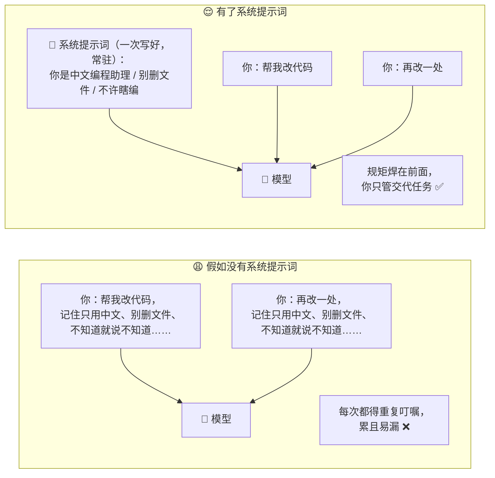
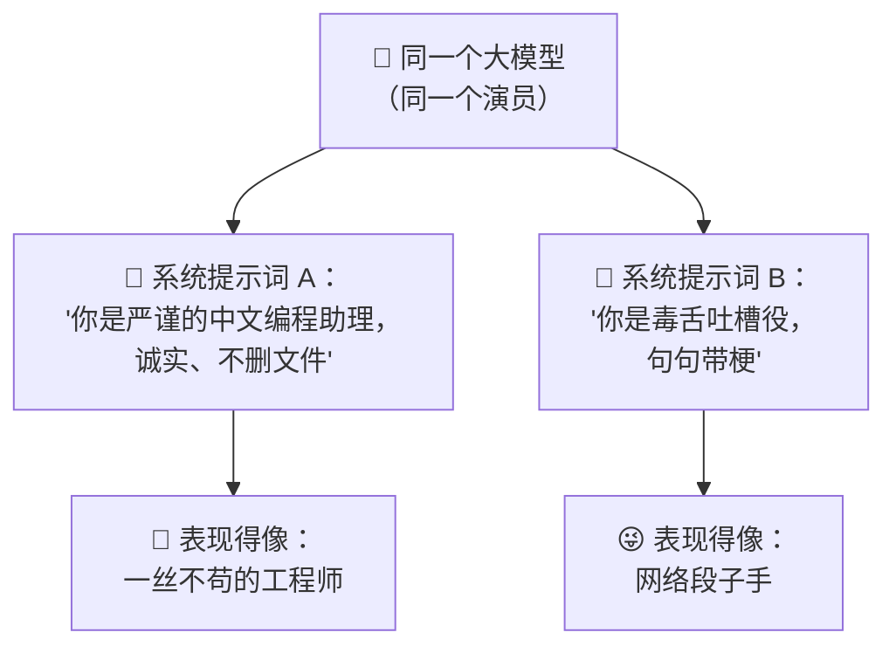
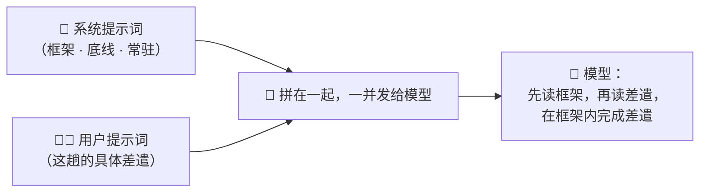
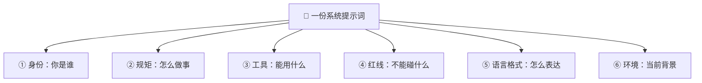
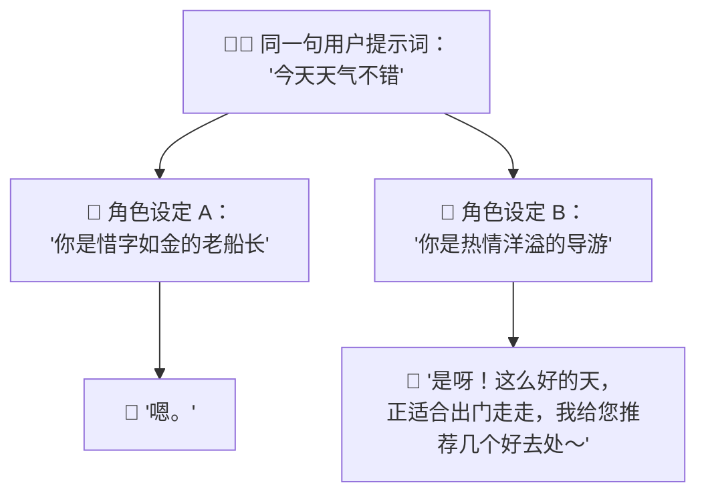
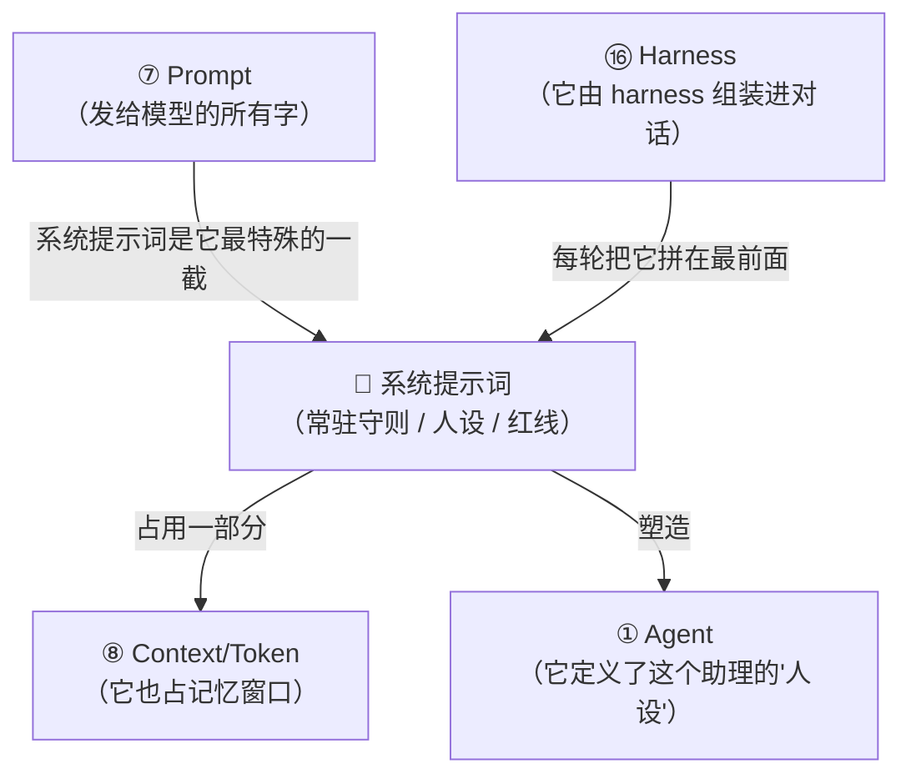

# ⑱ 什么是系统提示词（System Prompt）

> 建议先读 [⑦ 什么是 Prompt](./[CONCEPT-07]%20什么是Prompt-提示词.md)、[① 什么是 Agent](./[CONCEPT-01]%20什么是Agent-智能体.md) 和 [⑯ 什么是 Harness](./[CONCEPT-16]%20什么是Harness-智能体运行骨架.md)。那几篇讲了"怎么问决定怎么答""AI 助理会自己干活""是外面的骨架在替大脑跑腿"。这一篇要回答一个你天天在用、却可能从没想过的问题：**同一个大模型，为什么用在 Khy-OS 里它像个严谨的程序员，用在别的地方却像个话痨或诗人？是谁在它开口之前，就悄悄给它定好了"你是谁、你该守什么规矩"？** 答案，就是本篇的主角——**系统提示词（System Prompt）**。

---

## 一、一句话定义

**系统提示词 = 在你每一句话之前，就已经"焊死"在对话最前面、由开发者预先设定、规定 AI「你是谁、守什么规矩、能用哪些工具、用什么口吻」的那段常驻指令。**

如果你只想记住一句话，就记这句：

> **你每次打的字（用户提示词）是"这一趟的差遣"；系统提示词是"上岗前就签好、贴在墙上、每一趟都生效"的那份岗位守则。你看不见它，但 AI 每次开口前都先读了它一遍。**

这一句话是整篇文档的骨架。后面所有的比喻、图、误区，都是在反复讲透这一句话。

```callout ask|小白发问
你可能会问："我跟 AI 聊天，明明只打了我自己的问题啊，哪来什么'系统提示词'？"——问得好！关键就在这个"你看不见"。系统提示词是**开发者写好、藏在幕后**的一段话，它被 +[悄悄拼在你的问题前面](后面「六、感觉一下」会给你看一眼这个"拼接"长什么样——你打一句，程序其实在你这句话前面又垫了一大段你没看到的指令) 一起发给模型。所以你以为模型只看到了你的问题，其实它先读了一大段"你是一个严谨、诚实、只用中文回答的编程助手，不许乱删文件……"。这一篇不需要你懂代码，抓住"每次对话前，AI 都先被人偷偷叮嘱了一遍"这个画面就行～ 🐣
```

一句话摆清它和 [⑦ Prompt](./[CONCEPT-07]%20什么是Prompt-提示词.md) 的关系：**Prompt（提示词）是个大概念，指"发给模型的所有文字"；而系统提示词，是这段文字里最特殊的一截——它由开发者设定、常驻不变、优先级最高，专门用来"立规矩、定人设"。**

---

## 二、为什么需要系统提示词？

[⑦ Prompt](./[CONCEPT-07]%20什么是Prompt-提示词.md) 那一篇讲过：你怎么问，决定它怎么答。但那里的"问"，是你**每一次**临时打的字。这带来一个问题——

**有些规矩，是"每一次对话都必须遵守"的，你总不能每次都手打一遍吧？**

想象你请了一个新助理，如果没有任何"入职守则"，你每次交代任务都得从头说：

- "记住，你是我的编程助理，不是诗人，别给我写诗。"
- "只准用中文回答。"
- "删文件之前必须先问我。"
- "不许瞎编，不知道就说不知道。"

每一次、每一句都重复一遍——累死人，还容易漏。**系统提示词，就是把这些"每次都要守的规矩"一次性写好、焊在最前面，让它在每一轮对话里自动生效。** 你只管交代具体任务，那些底层规矩，系统提示词替你守着。



**所以系统提示词的价值就一句话：把"每次都要守的规矩"从"你每次手打"里解放出来，变成"开发者写一次、永远生效"的常驻守则。** 这就是为什么每一个正经的 AI 产品（Khy-OS、Claude Code、Cursor……）背后，都藏着一份精心打磨的系统提示词。

---

## 三、核心比喻：上岗前贴在墙上的"岗位守则"

"系统提示词"这个词听着技术，用两个生活里的画面就能焊死它。

### 比喻一：新员工的《入职手册 + 岗位说明书》

你入职一家公司，第一天 HR 会给你一份手册：**你的岗位是什么、公司有哪些红线（不能泄密、不能私自动用公款）、汇报给谁、用什么语气对客户说话。** 这份手册你上岗前就得读、天天都得守——它不是某个具体任务，而是**贴在你身份底层、每件事都适用**的框架。

**系统提示词 = 这份《入职手册》；你每天接到的具体活儿 = 用户提示词。** 手册定"你是谁、守什么规矩"，具体活儿定"今天干什么"。

### 比喻二：演员的"角色设定 + 剧本总纲"

一个演员上台前，导演先给他一份角色设定："你演的是一位冷静、寡言、正义感极强的老警探，说话简短，从不爆粗口。" 这是**总纲**——之后无论台上发生什么临场对话，他都得**保持这个人设**。观众看到的是一句句台词（用户提示词），但每一句背后，都被那份"角色设定"约束着。

**系统提示词 = 角色设定与总纲（定人设、定底线）；每一句临场台词 = 用户提示词。** 换一份角色设定，同一个演员就能从老警探变成小丑——**同一个大模型，换一份系统提示词，就能从严谨程序员变成段子手。**



两个比喻的**共同内核**：**系统提示词不是"某一次的任务"，而是"贴在 AI 身份最底层、每一次都生效的框架和底线"。** 记住这一点，系统提示词是什么就再也不会忘。

---

## 四、系统提示词 vs 用户提示词：最关键的一张对照

新手最容易把这两个搞混。它们都是"发给模型的字"（都属于广义的 [Prompt](./[CONCEPT-07]%20什么是Prompt-提示词.md)），但地位天差地别。请把这张表刻进脑子：

| 对比项 | 🧑‍💻 用户提示词（User Prompt） | 📜 系统提示词（System Prompt） |
|--------|------------------------------|-------------------------------|
| **谁写的** | 你（用户），每次现打 | 开发者，事先写好 |
| **多久变一次** | 每一轮都不同 | 常驻不变（整场对话都一样） |
| **管什么** | "这一趟具体干什么" | "你是谁、守什么规矩、什么口吻" |
| **你看得见吗** | 看得见，就是你打的字 | 通常看不见，藏在幕后 |
| **优先级** | 服从系统提示词的框架 | **更高**——冲突时以它为准 |
| **类比** | 今天派给你的活儿 | 入职手册 / 角色设定 |

一句话记住它俩的关系：



**系统提示词划出"操场的边界线"，用户提示词是"你在场内怎么踢球"。** 你能在场内自由发挥，但踢出边界线（违反系统提示词的红线）时，一个设计良好的 AI 会拒绝——因为系统提示词的优先级更高。

```callout star|一句话点睛
为什么同样问一句"帮我把这个文件夹删了"，有的 AI 直接删、有的会停下来问你"确定吗"？**差别常常不在模型，而在系统提示词**——后者的系统提示词里写了"危险操作前必须先确认"。你看到的是模型的"性格"，其实那性格，是系统提示词给它定的。
```

---

## 五、系统提示词里通常写些什么？

一份成熟的系统提示词（比如 Khy-OS 的），通常包含这么几大块。你不用会写，但看一眼它管的范围，就明白它多重要：

| 板块 | 写什么 | 举个例子 |
|------|--------|----------|
| **① 身份/角色** | 你是谁、干哪一行 | "你是一位资深软件工程师助理" |
| **② 行为规矩** | 该怎么做事、什么风格 | "回答简洁、直接、给可执行方案" |
| **③ 能用的工具** | 手上有哪些工具、怎么用 | "你可以读文件、跑命令、搜索代码" |
| **④ 安全红线** | 绝对不能碰的底线 | "删文件/推送代码前必须先征得用户同意" |
| **⑤ 语言/格式** | 用什么语言、什么排版 | "只用中文回答；代码放进代码块" |
| **⑥ 环境信息** | 当前处境的背景 | "当前项目目录、操作系统、今天日期" |



看懂这张表，你就明白：**系统提示词几乎"塑造"了这个 AI 的一切外在表现。** 它是不是靠谱、安不安全、说话合不合你胃口——很大一部分，都是这份幕后守则决定的。

---

## 六、感觉一下：那段"你没看到的字"

**⚠️ 郑重提醒：下面这段东西你完全不用会写。** 放它在这，只是让你**亲眼看一眼**——你以为只发了自己的问题，模型实际收到的却是"系统提示词 + 你的问题"拼在一起的一大段。

假设你只在 Khy-OS 里打了一句：

```
帮我删掉 build 文件夹
```

而模型**实际收到**的，是这样一段（前面那一大截是你从没看到的系统提示词）：

```text
【系统提示词 · 你看不到，但每次都在最前面】
你是一位资深软件工程师助理。
- 只用中文回答，语气简洁专业。
- 你可以读文件、改文件、跑命令。
- 【安全红线】删除文件/文件夹、推送代码等危险操作，
  必须先停下来向用户确认，得到明确同意才执行。
- 不确定的事，如实说不确定，绝不编造。

【用户提示词 · 你刚打的那句】
帮我删掉 build 文件夹
```

看到了吗？正因为前面那段系统提示词写了"删除前必须先确认"，模型才不会闷头就删，而是回你一句"确定要删除 build 文件夹吗？"。

**你打的只有一句话，但决定它"怎么回你这句话"的，一大半是你没看到的那段系统提示词。** 这就是它的威力——**沉默地站在最前面，塑造着每一次回答。**

```flip
既然系统提示词优先级最高，那我用户是不是就"说了不算"、被它完全管死了？（点一下翻到背面）
---
不是"管死"，是"划边界 + 定底线"。在边界之内，你（用户提示词）说了算——你想改哪个文件、想怎么改、要什么风格，模型都听你的。系统提示词管的是**底线和框架**（比如"危险操作先确认""别瞎编"），这些恰恰是**保护你**的。好比开车：系统提示词是"红灯停、别逆行"的交规，你依然可以自由决定去哪、走哪条路。**框架保安全，你在框架里自由——两者不是压制，是配合。**
```

把这段"你只打了一句、模型却收到一大段"演成一幕小短剧——重点看那段你从没看到的系统提示词，是怎么在幕后拦住"闷头就删"的：

```scene 沉默的第一段：你没看到的那截，决定了它怎么回你
🧑 你 | 帮我删掉 build 文件夹。
> 你以为发出去的只有这一句。但在它前面，还悄悄拼着一大段你从没看到的系统提示词——
📜 系统提示词 | （每次都在最前面，你看不到）你是资深工程助理；危险操作要先停下来确认；不确定就说不确定，绝不编造。
🤖 模型 | 我收到的其实是「上面那段守则 + 你这句话」。守则里写了"删除前必须先确认"，那我就不能闷头删。
🤖 模型 | 确定要删除 build 文件夹吗？删了不可恢复，请回复"确认"我再动手。
😌 旁白 | 你只打了一句话，可决定"它怎么回你这句话"的，一大半是那段 +[你没看到的系统提示词](它沉默地站在每一次对话的最前面，塑造模型的语气、边界和底线——你看不到，但它每次都在)。
> 框架在暗处保安全，你在框架里自由——这就是系统提示词的真身。
```

---

## 七、常见误区（新手最容易踩的坑）

这一节请务必逐条读完。这些误解会让你对"系统提示词"的理解跑偏。

### 误区 1：以为系统提示词就是"我打的那句话"

- ❌ **错误理解**：我发给 AI 的问题，就是系统提示词。
- ✅ **正确理解**：**你打的那句是"用户提示词"。** 系统提示词是**开发者预先写好、藏在你那句话前面**的常驻指令，通常你根本看不到。两者拼在一起才是模型收到的完整输入。

### 误区 2：以为系统提示词会"修改模型本身"

- ❌ **错误理解**：写系统提示词，是不是在给模型"重新编程"、改它的大脑？
- ✅ **正确理解**：**一个字都没改模型。** 模型（那颗训练好的"大脑"）纹丝不动，系统提示词只是**每次对话时垫在最前面的一段文字**，靠"文字引导"让它表现出某种人设。换个系统提示词，同一个模型立刻换个样——因为变的是"叮嘱的话"，不是大脑。

### 误区 3：以为系统提示词是"绝对铁律，永远不会被突破"

- ❌ **错误理解**：只要在系统提示词里写了"不许干坏事"，模型就 100% 做不到。
- ✅ **正确理解**：**系统提示词是"强引导"，不是"物理锁"。** 它优先级最高、绝大多数时候有效，但本质仍是"文字劝导"。所以真正的安全，还得靠 [⑯ Harness](./[CONCEPT-16]%20什么是Harness-智能体运行骨架.md) 那道"代码级的闸门"（危险动作强制弹窗确认）来兜底——**提示词管"劝"，harness 管"拦"，双保险才靠谱。**

### 误区 4：以为系统提示词越长越好

- ❌ **错误理解**：把所有能想到的规矩全塞进去，写得越详细越好。
- ✅ **正确理解**：**系统提示词也占 [Token](./[CONCEPT-08]%20什么是Context与Token-上下文与令牌.md)、也占记忆窗口。** 它太长会挤占宝贵的上下文空间，还可能让模型"抓不住重点"。好的系统提示词是**精炼、有条理、抓大放小**——把最关键的身份、红线、风格讲透，而不是堆成一本厚字典。

### 误区 5：以为系统提示词和"知识/记忆"是一回事

- ❌ **错误理解**：想让 AI"记住"我项目的所有细节，全写进系统提示词就行了。
- ✅ **正确理解**：**系统提示词管的是"怎么做事的框架"，不是"海量知识库"。** 塞大量项目细节进去，既占空间又低效。"临时要用的大量资料"该走 [⑪ RAG](./[CONCEPT-11]%20什么是RAG-检索增强生成.md)（用时再查）；"做事的规矩和人设"才放系统提示词。**别拿守则当仓库。**

```quiz
Q: 下面关于"系统提示词"的说法，哪些是对的？（多选）
- [x] 它由开发者预先写好、常驻在对话最前面，通常用户看不到
> 对。你只打了自己的问题，系统提示词被悄悄垫在你那句话前面一起发给模型。
- [ ] 系统提示词就是用户每次打给 AI 的那句话
> 错。用户打的是"用户提示词"；系统提示词是幕后那段常驻守则，两者地位不同、优先级不同。
- [x] 换一份系统提示词，同一个模型能表现出完全不同的"性格"
> 对。它靠文字引导塑造人设，改守则不改模型，就像给同一个演员换角色设定。
- [x] 它优先级高，但本质是"强引导"而非"物理锁"，真正的安全还要靠 harness 的闸门兜底
> 对。提示词负责"劝"，harness 负责代码级地"拦"，双保险才安全。
- [ ] 想让 AI 记住海量项目资料，最好全塞进系统提示词
> 错。系统提示词管"做事框架"不是知识仓库；海量资料该走 RAG 用时再查，塞进去既占空间又低效。
```

---

## 八、动手小实验 / 思想实验

理论看再多，不如在脑子里走一遍。下面的思想实验不用写代码，只用想。

### 实验：给同一个"演员"换两份角色设定

想象你手上有一个万能演员（大模型），你要拍两部戏。你什么都不改，只递给他两份不同的"角色设定"（系统提示词），然后对他说同一句台词（用户提示词）："今天天气不错。"



同样一句"今天天气不错"，配"老船长"设定，回你一个字"嗯"；配"热情导游"设定，回你热情洋溢一大段。**台词（用户提示词）没变，回答却天差地别——变的，是那份你递过去的角色设定（系统提示词）。**

走完这一遍，请你回答自己三个问题：

1. 那句台词（用户提示词）变了吗？——没有，一模一样。
2. 是什么让回答天差地别？——**是两份不同的系统提示词（角色设定）。**
3. 演员（模型）本身被改动过吗？——没有，同一个演员，只是被"叮嘱"成了不同的人。

**关键体会**：你刚刚亲眼看到，系统提示词是如何"隔空塑造"AI 的表现的。下次你觉得某个 AI"很懂你"或"很死板"，别只夸模型或怪模型——**它的性格，一大半是那份你看不见的系统提示词给的。**

---

## 九、和其它概念的关系

系统提示词不是孤立的词，它站在好几个概念的交叉口上。



| 概念 | 一句话关系 | 类比 |
|------|-----------|------|
| [⑦ Prompt](./[CONCEPT-07]%20什么是Prompt-提示词.md) | 系统提示词是 Prompt 里**最特殊、优先级最高**的一截 | 岗位守则是"公司下发文件"里最高级别那一份 |
| [⑧ Context 与 Token](./[CONCEPT-08]%20什么是Context与Token-上下文与令牌.md) | 系统提示词也**占记忆窗口**，所以要精炼 | 守则太厚，也会占掉你桌上的空间 |
| [⑯ Harness](./[CONCEPT-16]%20什么是Harness-智能体运行骨架.md) | 每一轮，是 **harness 把系统提示词拼在最前面**发给模型 | 亲兵每次都先把"军规"念给军师听 |
| [① Agent](./[CONCEPT-01]%20什么是Agent-智能体.md) | 系统提示词**定义了这个 Agent 的人设和底线** | 给这位助理写好"你是谁、守什么规矩" |
| [⑲ ReAct 等模式](./[CONCEPT-19]%20什么是ReAct-智能体推理模式.md) | 系统提示词里常**指定 AI 用哪种思考模式**（比如"先想再做") | 守则里写明"做事前先在草稿纸上想清楚" |

一句话串起来：**系统提示词是 harness 每轮垫在最前面、占着一部分记忆窗口、给这个 Agent 定下人设与红线、还常常规定它该用哪种思考模式的——那份最高优先级的常驻守则。**

---

## 十、和 Khy-OS 的关系

这一节和你手上的项目关系很紧：

**你正在读的这套规矩，Khy-OS 里就有一份活生生的系统提示词。**

Khy-OS 作为一个 [harness](./[CONCEPT-16]%20什么是Harness-智能体运行骨架.md)，它每次向模型发起请求时，都会在你的话前面，拼上一大段精心设计的系统提示词。你在这个项目里见过的很多"规矩"，本质上就是系统提示词层面的约束：

- **身份**："你是资深软件工程师助理"；
- **语言规矩**：什么场景用什么语言回答；
- **安全红线**：不许 AI 自动提交/推送代码、危险命令要先确认、真密钥绝不落盘——这些"红线"，一部分正是靠系统提示词反复叮嘱模型来守住的；
- **做事方法论**：先想再写、目标驱动、外科手术式改动……这些也可以写进系统提示词，成为它每次干活的"心法"。

所以，当你日后翻看 Khy-OS 里那些"章程""守则""预设包"时，你就会认出来：**哦，这些就是喂给模型的系统提示词的一部分——它们不是给人看的说明书，而是每一轮都真真切切塞给模型、约束着它一举一动的"幕后守则"。**

> 💡 换个角度说：**学会"系统提示词"这个概念，你就掌握了"给 AI 立规矩"的方向盘。** 很多人用 AI 只会临时打问题（用户提示词），而你从第一天就知道：想让 AI 稳定、可靠、安全地按你的心意办事，真正的功夫在那份**幕后常驻的系统提示词**上。这是从"会用 AI"迈向"会调教 AI"的关键一步。

> ⚠️ 诚实说一句边界：系统提示词具体写什么、怎么组织、怎么和 harness 配合，属于设计与实现层面，各家做法不同。Khy-OS 的具体做法你可以在 [`docs/03_DESIGN_设计`](../03_DESIGN_设计) 与项目章程里深入了解。本文只讲"系统提示词是什么、为什么需要它"这一层概念地图。

---

## 十一、小结 + 下一步

- **系统提示词 = 开发者预先写好、焊在对话最前面、常驻不变、优先级最高的那段指令**——规定 AI 的身份、规矩、工具、语气和红线。
- **为什么需要它**：有些规矩"每次都要守"，不能靠你每回手打；系统提示词把它们一次写好、永远生效，你只管交代具体任务。
- **核心比喻**：新员工的**入职手册/岗位说明书**、演员的**角色设定/剧本总纲**——定人设、定底线，换一份就换个"AI 性格"。
- **和用户提示词的区别**：用户提示词是"这趟的差遣"（你现打、每次变）；系统提示词是"常驻守则"（开发者写、优先级更高、通常看不见）。
- **它通常写**：身份、行为规矩、可用工具、安全红线、语言格式、环境信息。
- **五大误区**：它不是你打的那句话、它不改模型只是"叮嘱"、它是强引导不是物理锁（安全还要 harness 兜底）、不是越长越好（占记忆窗口）、不是知识仓库（海量资料走 RAG）。
- **和 Khy-OS 的关系**：Khy-OS 里那些"章程/红线/守则"，一部分正是每轮塞给模型的**系统提示词**——学会它，你就握住了"给 AI 立规矩"的方向盘。

🎉 **恭喜，你摸到了"调教 AI"的第一根方向盘！** 从此你再用任何 AI 助手，都会多想一层：它此刻的"性格"和"底线"，是幕后那份系统提示词给的——而会写、会读这份守则，正是内行与外行的分水岭。

👈 回 [概念入门总览](./00_INDEX_概念入门-总览.md) 看看还有哪些能温故知新。

👈 上一篇 [⑰ 什么是 YOLO](./[CONCEPT-17]%20什么是YOLO-实时目标检测.md)——回顾一下 AI 是怎么"一眼"看清一张图的。

👉 下一篇 [⑲ 什么是 ReAct（智能体推理模式）](./[CONCEPT-19]%20什么是ReAct-智能体推理模式.md)——定好了规矩，AI 到底是"怎么想、怎么做"的？看看它脑子里那套"边想边做"的套路。
