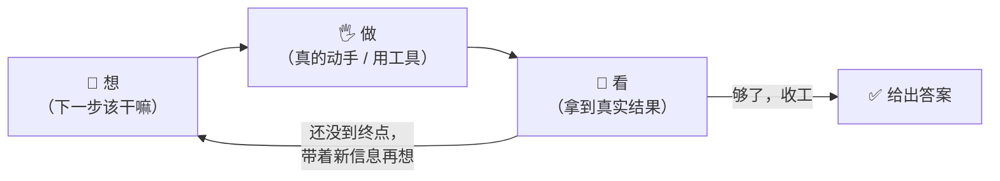
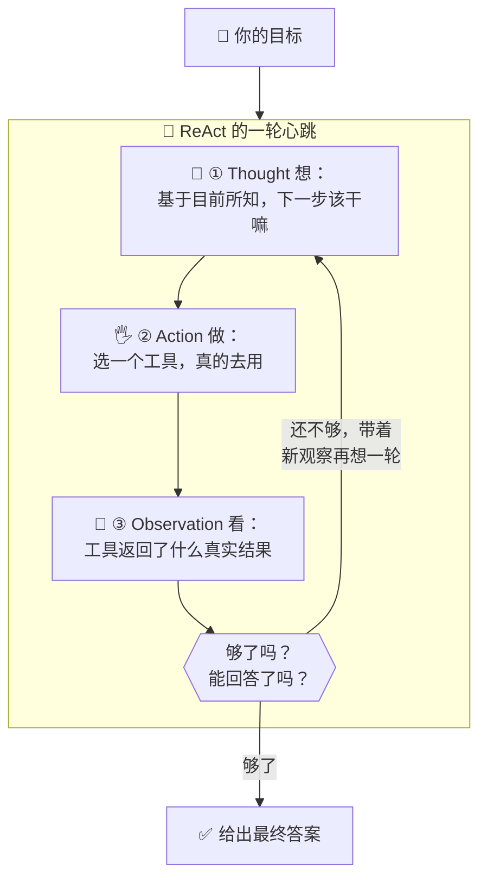
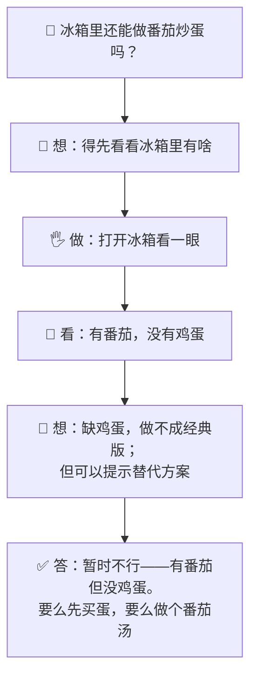
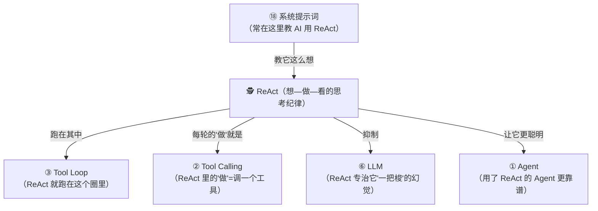

# ⑲ 什么是 ReAct（智能体的推理模式）

> 建议先读 [① 什么是 Agent](./[CONCEPT-01]%20什么是Agent-智能体.md)、[③ 什么是 Tool Loop](./[CONCEPT-03]%20什么是ToolLoop-工具循环.md) 和 [⑱ 什么是系统提示词](./[CONCEPT-18]%20什么是系统提示词-SystemPrompt.md)。那几篇讲了"AI 会自己干活""反复用工具直到完成""开发者给它定了做事规矩"。这一篇要回答一个更深的问题：**AI 在动手之前，脑子里到底是"怎么想"的？它是闷头一把梭，还是像个靠谱的人那样"先想一步、做一步、看一眼结果、再想下一步"？** 这套"边想边做"的思考套路，就是本篇的主角——**ReAct 模式**，以及它的几个兄弟模式。

---

## 一、一句话定义

**ReAct = 让 AI 像人一样"想一步、做一步、看一眼结果、再想下一步"的一种做事套路（Reason 推理 + Act 行动，交替进行）。**

"ReAct"这个名字就是拼出来的：**Rea**son（推理）+ Act（行动）= ReAct。如果你只想记住一句话，就记这句：

> **别让 AI 闷头一口气把话说完、把事做完。让它把每一步都拆成三拍：先"想"（我现在该干嘛）→ 再"做"（真的去用个工具）→ 然后"看"（工具给了我什么结果）——看完再进下一轮的"想"。想—做—看，想—做—看，直到事成。**

这一句话是整篇文档的骨架。后面所有的比喻、图、误区，都是在反复讲透这一句话。

```callout ask|小白发问
你可能会问："这不就是 [③ 工具循环](./[CONCEPT-03]%20什么是ToolLoop-工具循环.md) 吗？反复用工具直到完成？"——非常接近，但有个关键差别！工具循环讲的是**那个"圈"的机械流程**（用工具→看结果→再用工具）；而 ReAct 强调的是圈里那个**"想"的动作被明明白白地摆出来了**——AI 每次动手前，会先+[把自己的思路"说出声"](后面你会看到，ReAct 里 AI 会先写一句 "Thought：我需要先读一下配置文件"，再去动手——这句"想"不是给你看的废话，而是它给自己理清下一步的草稿)：为什么这么做、下一步打算干嘛。**"把思考显式地写出来，再行动"**，这才是 ReAct 的灵魂。这一篇不用懂代码，抓住"三花猫走路：想一步、迈一步、看一步"就行～ 🐣
```

一句话摆清它和前几篇的关系：**[Tool Loop](./[CONCEPT-03]%20什么是ToolLoop-工具循环.md) 是"那个循环的骨架"，ReAct 是"在循环里，让 AI 每步都先想清楚再动手"的思考纪律**——它是给那个圈填进去的"聪明的走法"。

---

## 二、为什么需要 ReAct？——因为"闷头一把梭"会翻车

要理解 ReAct 的价值，先看看"没有它"会怎样。

大模型的本能，是**顺着往下"一口气"接话**（还记得 [⑥ LLM](./[CONCEPT-06]%20什么是LLM-大语言模型.md) 讲的"文字接龙"吗）。如果你让它做一件需要好几步、还依赖真实信息的事，它的本能反应是——**不管三七二十一，凭想象一路编到底。**

举个例子。你问："帮我查查我这个项目现在用的是哪个版本的某个库，然后告诉我要不要升级。"

- **闷头一把梭的 AI**：它没去读你的文件，纯靠"猜"，张口就说"你用的是 3.2 版，建议升到最新的 5.0"——**可你项目里根本没装这个库，它全编的。** 这就是 [⑥ LLM](./[CONCEPT-06]%20什么是LLM-大语言模型.md) 讲的"幻觉"。
- **用 ReAct 的 AI**：它会先停下来**想**——"要回答这个，我得先真的去看一眼配置文件"；然后**做**——真去读了 `package.json`；再**看**——哦，实际装的是 4.1 版；再**想**——"现在有真实依据了，可以给建议了"；最后才回答。


**ReAct 的价值就一句话：把 AI 从"凭想象一把梭"，掰成"先查证、再下判断"的靠谱做法。** 它逼着 AI 在每个岔路口先想清楚、去拿真实信息、看完再走——这正是它比"闷头输出"可靠得多的根本原因。

---

## 三、核心比喻：像人一样"边想边做"

"推理—行动交替"这个说法太抽象，用两个你天天在做的画面就能焊死它。

### 比喻一：老侦探破案，而不是算命先生

一个**算命先生**（闷头一把梭），你一坐下，他不问不查，张口就把你下半辈子编得天花乱坠——听着热闹，全是瞎猜。

一个**老侦探**（ReAct），破案是这样的：**想**——"死者手上有泥，我该去看看后院"；**做**——真的去后院勘查；**看**——发现一个脚印；**想**——"这脚印偏小，凶手可能个子不高"；**做**——去比对嫌疑人身高……**每一步推理，都踩在上一步查到的真凭实据上。** 他从不凭空下结论，而是"想一点、查一点、再想一点"。

**AI 用 ReAct，就是从"算命先生"变成"老侦探"。**

### 比喻二：走夜路的人，走一步、照一步

想象你打着手电走一条陌生的夜路。你不会闭着眼一路狂奔（闷头一把梭，非摔沟里不可）。你会：**想**——"前面黑，我照一下"；**做**——把手电往前一照；**看**——哦，前面有个坑；**想**——"得绕左边"；**做**——迈左脚……**每迈一步，都先照一下、看清了再走。**

**ReAct = 打着手电走夜路：想一步、照一步（拿真实信息）、看清了再迈下一步。**



两个比喻的**共同内核**：**不凭空一把梭，而是"每走一步都先想清楚、去拿真凭实据、看完再决定下一步"。** 记住这一点，ReAct 是什么就再也不会忘。

---

## 四、拆开看：ReAct 的三拍节奏

把 ReAct 的一轮拆开，就是雷打不动的三拍。业内常用三个英文词，但你只要记中文：

| 一拍 | 英文 | 大白话 | 老侦探版 |
|------|------|--------|----------|
| **① 想** | Thought（思考） | "我现在该干嘛、为什么" | "死者手上有泥，我该去后院看看" |
| **② 做** | Action（行动） | 真的去用一个工具（读文件/搜索/跑命令） | 真的走去后院勘查 |
| **③ 看** | Observation（观察） | 拿到工具返回的真实结果 | 在后院发现一个脚印 |

这三拍转成一个圈，就是 ReAct 的"心跳"：



**看懂这张图，你就看懂了一个"靠谱的 AI"脑子里在干什么**：它不是把你的问题一口气编完，而是把"想"这个动作**显式地摆出来、每一步都拿真实观察去校准下一步的想法**。这，就是 ReAct 让 AI 变可靠的秘密。

```callout star|一句话点睛
ReAct 最反直觉、也最关键的一点是：**它逼 AI 把"思考"写出来。** 你可能觉得"想"是内心戏、写出来是废话——恰恰相反，正是这句写出来的"Thought：我需要先……"，让 AI 给自己理清了下一步、避免了脑子一热就乱动手。**把思路显式化，是 ReAct 让 AI 少犯浑的核心机关。**
```

---

## 五、ReAct 不是唯一的模式——认识几个"思考流派"

ReAct 是最经典、最常用的一种智能体做事模式，但它有几个"兄弟"。你不用记全，但认个脸，日后聊 AI 不露怯。它们的区别，全在**"想"和"做"怎么排布**：

| 模式 | 大白话 | 像什么人 | 什么时候合适 |
|------|--------|----------|--------------|
| **思维链（CoT）** | 只在脑子里一步步想清楚，**不动手用工具**，然后一口气答 | 学生在草稿纸上分步演算数学题 | 纯推理题（算数、逻辑），不需要外部信息 |
| **ReAct** | 想—做—看 交替，**边想边用工具拿真实信息** | 老侦探边推理边取证 | 需要读文件、查资料、跑命令的真实任务 |
| **先规划后执行（Plan-and-Execute）** | **先把整个计划列全**，再一条条照着做 | 出门前先列好完整购物清单，再照单采购 | 步骤多、能提前想清楚的大任务 |
| **反思（Reflexion）** | 做完先**自我复盘**"哪儿没做好"，再改进重来 | 运动员看回放找毛病，再练一遍 | 允许多试几次、追求越做越好的任务 |


一句话点破它们的关系：**它们不是互相竞争、你死我活，而是"针对不同活儿的不同走法"。** 纯算数题用 CoT（不用动手）；要读文件查资料的真实任务用 ReAct（边想边取证）；步骤明确的大工程可以先 Plan 再 Execute；追求精益求精可以加一层 Reflexion。**一个成熟的 AI 助手，常常是这几种混着用。** 而 ReAct，是其中最百搭、最常见的那一款。

```flip
既然有"先规划后执行"能一次把计划想全，那为什么不总用它，非要 ReAct 走一步看一步？（点一下翻到背面）
---
因为真实世界会"打脸计划"。你出门前列好购物清单（先规划），可到了超市发现"要买的酱油卖光了"——计划当场作废，得临时改。真实任务里，你**读了文件才知道里面写了啥、跑了测试才知道哪儿报错**，很多信息不动手根本拿不到。ReAct 的"走一步看一步"，恰恰能**根据每一步的真实结果随时调整**，不会被一个过时的计划带沟里去。所以：**能提前想全的用规划，充满未知、需要边走边探的用 ReAct**——现实中后者更多，这也是 ReAct 最常用的原因。
```

---

## 六、感觉一下：一段 ReAct 的"内心独白"

**⚠️ 郑重提醒：下面这段你完全不用会写。** 放它在这，只是让你**亲眼看一眼**——一个用 ReAct 的 AI，在完成"查库版本、给升级建议"这个任务时，脑子里那串"想—做—看"长什么样。请只体会那个**三拍循环的节奏**：

```text
🙋 你的目标：查我项目里某个库的版本，告诉我要不要升级

💭 Thought（想）：要回答，我不能瞎猜，得先看真实的依赖文件。
🖐️ Action（做）：读取 package.json
👀 Observation（看）：里面写着 "某库": "4.1.0"

💭 Thought（想）：现在装的是 4.1.0。我还得知道最新版是多少，才好比较。
🖐️ Action（做）：查询该库的最新版本
👀 Observation（看）：最新是 4.3.2，且 4.3 修了一个安全漏洞

💭 Thought（想）：4.1 → 4.3 是小版本升级，风险低，还能修安全洞。
              信息够了，可以给结论了。
✅ 最终答案：你现在是 4.1.0，建议升级到 4.3.2——升级平滑，
            还能修掉一个已知安全漏洞。
```

看到那个反复出现的"想 → 做 → 看"了吗？**这就是 ReAct 的真身。** AI 没有一上来就下结论，而是每一步都先"想清楚要干嘛"，再"真的去拿一手信息"，"看到结果"后再想下一步——直到攒够真实依据，才给答案。

**整段独白里，那些"想"（Thought）不是废话，而是 AI 给自己搭的台阶——每一层台阶都踩在上一步"看"到的真实结果上。** 这就是为什么用 ReAct 的 AI，比闷头一把梭的 AI 靠谱得多。

把上面这段"内心独白"演成一幕小短剧——你会看到同一个任务，闷头一把梭 vs 想—做—看三拍，下场完全不同：

```scene 查库升级：想一步、做一步、看一步
🧑 你 | 查一下我项目里某个库的版本，告诉我要不要升级。
> 反面教材：闷头一把梭，不看真实文件就下结论。
🤖 一把梭 AI | 这库嘛……我印象里最新是 4.0，你八成已经最新了，不用升！（全凭记忆瞎猜）
😵 旁白 | 它没读你的文件、没查最新版，纯靠印象——这正是幻觉高发的一把梭。
> 正解：ReAct，每一步先想清楚，再真的去拿一手信息。
💭 ReAct AI（想） | 不能瞎猜，我得先看真实的依赖文件。
🖐️ ReAct AI（做） | 读取 package.json……
👀 ReAct AI（看） | 里面写着 "某库": "4.1.0"。哦，现在装的是 4.1.0。
💭 ReAct AI（想） | 光知道现装版本还不够，得查最新版才好比较。
🖐️ ReAct AI（做） | 查询该库最新版本……
👀 ReAct AI（看） | 最新是 4.3.2，而且 4.3 修了一个安全漏洞。
💭 ReAct AI（想） | 4.1→4.3 是小版本、风险低，还能补安全洞。依据够了，可以下结论。
✅ ReAct AI | 你现在是 4.1.0，建议升到 4.3.2——升级平滑，还能修掉一个已知安全漏洞。
> 看到那反复出现的 +[想→做→看](Thought→Action→Observation：每一步的"想"都踩在上一步"看"到的真实结果上，而不是凭印象) 了吗？这就是 ReAct 比一把梭靠谱的根。
```

---

## 七、常见误区（新手最容易踩的坑）

这一节请务必逐条读完。这些误解会让你对"ReAct"的理解跑偏。

### 误区 1：以为 ReAct 是某个软件、某个工具

- ❌ **错误理解**：ReAct 是不是一个我可以下载安装的程序？
- ✅ **正确理解**：**ReAct 不是软件，是一种"做事的套路 / 思考模式"。** 它是"让 AI 想一步做一步看一步"的一套方法论，通常是通过 [⑱ 系统提示词](./[CONCEPT-18]%20什么是系统提示词-SystemPrompt.md) 教给模型的，而不是一个能装的 App。

### 误区 2：把 ReAct 和 Tool Loop 完全画等号

- ❌ **错误理解**：ReAct 和 [③ 工具循环](./[CONCEPT-03]%20什么是ToolLoop-工具循环.md) 是一模一样的东西。
- ✅ **正确理解**：**很近，但侧重点不同。** 工具循环讲的是"那个圈的机械流程"（用工具→看结果→再用工具，由 harness 推着转）；ReAct 讲的是"圈里 AI 该怎么想"——强调**把'思考'显式地摆出来、每步用真实观察校准**。可以说：**ReAct 是给工具循环填进去的一种"聪明走法"。** 循环是舞台，ReAct 是舞台上的走位。

### 误区 3：以为"把思考写出来"是浪费

- ❌ **错误理解**：让 AI 先写一句"我在想……"再动手，多此一举、浪费字数吧？
- ✅ **正确理解**：**那句"想"恰恰是 ReAct 的灵魂。** 显式地写出思路，能让 AI 给自己理清下一步、暴露自己的推理链、少犯"脑子一热就乱动手"的错。省掉这句"想"，AI 就容易退回"闷头一把梭"。**把思考写出来，是可靠性的来源，不是浪费。**

### 误区 4：以为 ReAct 就一定不会出错

- ❌ **错误理解**：只要用了 ReAct，AI 就绝不犯错了。
- ✅ **正确理解**：**ReAct 大幅提高可靠性，但不是万能保险。** 它让 AI"基于真实信息决策"，可 AI 仍可能"想岔了""看错了结果""工具本身返回了错的信息"。ReAct 让 AI 更像个谨慎的人，但"谨慎的人"也会犯错——所以还需要 [⑯ Harness](./[CONCEPT-16]%20什么是Harness-智能体运行骨架.md) 的安全闸门、以及你自己的把关。

### 误区 5：以为 ReAct 是唯一"正确"的模式

- ❌ **错误理解**：既然 ReAct 这么好，那所有 AI 都该、都只用 ReAct。
- ✅ **正确理解**：**看活儿下菜。** 纯算数逻辑题，用不着动手拿信息，思维链 CoT（只想不做）更利落；步骤能提前想全的大工程，可以先规划后执行；追求越做越好，可以加反思。**ReAct 最百搭、最常用，但不是唯一——真正厉害的助手会按任务混着用。**

```quiz
Q: 下面关于"ReAct 模式"的说法，哪些是对的？（多选）
- [x] ReAct 是"推理 + 行动"交替：想一步 → 做一步 → 看一步结果 → 再想下一步
> 对。Reason（想）+ Act（做）+ Observation（看）循环往复，直到攒够真实依据再作答。
- [x] 它比"闷头一把梭"可靠，是因为每步都基于真实观察来校准下一步，而不是凭想象编
> 对。老侦探边推理边取证，而不是算命先生凭空瞎编——这正是它少犯幻觉的原因。
- [ ] ReAct 是一个可以下载安装的软件工具
> 错。它是一种"做事套路/思考模式"，通常靠系统提示词教给模型，不是能装的 App。
- [x] "把思考显式地写出来（Thought）"是 ReAct 的核心，不是浪费
> 对。写出思路能让 AI 理清下一步、暴露推理链、少犯浑——省掉它就退回闷头一把梭了。
- [ ] 只要用了 ReAct，AI 就绝对不会犯错了
> 错。它大幅提高可靠性但非万能，AI 仍可能想岔、看错，还需 harness 闸门和你的把关兜底。
```

---

## 八、动手小实验 / 思想实验

理论看再多，不如在脑子里走一遍。下面的思想实验不用写代码，只用想。

### 实验：用两种模式，回答同一个刁钻问题

问题："我家冰箱里现在还能不能做一顿番茄炒蛋？"

**A. 闷头一把梭（没有 ReAct）**：AI 不看你的冰箱，直接猜——"当然可以，番茄炒蛋很简单！"——**可你冰箱里根本没鸡蛋，它在瞎说。**

**B. 用 ReAct（想—做—看）**：



走完这一遍，请你回答自己三个问题：

1. A 和 B，哪个的回答"有真凭实据"？——**B，因为它真的去"看"了冰箱。**
2. B 里那句"想：得先看看冰箱里有啥"，起了什么作用？——**它让 AI 意识到"不能瞎猜，得先取证"，这就是 ReAct 的关键一步。**
3. 如果冰箱里其实有蛋，B 的答案会不会自动变对？——**会。因为它的结论是跟着"看到的真实结果"走的，而不是提前编死的。**

**关键体会**：你刚刚亲眼看到，"先想、去看、再答"这套 ReAct 节奏，是怎么把一个爱瞎猜的 AI，变成一个"讲证据"的 AI 的。下次你用 AI，不妨留意它是不是"先去查了再答"——**会查证的 AI，才是用了 ReAct 的靠谱 AI。**

---

## 九、和其它概念的关系

ReAct 站在好几个概念的交叉口上——它是"填进循环里的思考纪律"。



| 概念 | 一句话关系 | 类比 |
|------|-----------|------|
| [③ Tool Loop](./[CONCEPT-03]%20什么是ToolLoop-工具循环.md) | ReAct 就**跑在工具循环这个圈里**，是圈里的"聪明走法" | 循环是跑道，ReAct 是跑步的姿势 |
| [② Tool Calling](./[CONCEPT-02]%20什么是ToolCalling-工具调用.md) | ReAct 三拍里的"做"（Action），就是**调用一个工具** | 侦探"去后院勘查"这个动作 |
| [⑱ 系统提示词](./[CONCEPT-18]%20什么是系统提示词-SystemPrompt.md) | AI 该用哪种思考模式，**常写在系统提示词里** | 守则里写明"做事前先想清楚再动手" |
| [⑥ LLM](./[CONCEPT-06]%20什么是LLM-大语言模型.md) | ReAct 专门**克制大模型"凭想象一把梭"的幻觉** | 逼算命先生变成讲证据的侦探 |
| [① Agent](./[CONCEPT-01]%20什么是Agent-智能体.md) | 用了 ReAct 的 **Agent 做事更谨慎、更靠谱** | 一个"三思而后行"的助理 |

一句话串起来：**ReAct 是由系统提示词教给模型、跑在工具循环这个圈里、每一轮用一次工具调用去拿真实信息、专治大模型幻觉、让 Agent 变得"三思而后行"的那套"想—做—看"的思考纪律。**

---

## 十、和 Khy-OS 的关系

这一节和你手上的项目关系很紧：

**Khy-OS 让 AI 干活时，走的正是 ReAct 这一路的思考模式。**

你在用 Khy-OS 时应该注意到过：它不是你一提问就"啪"地甩给你一个答案，而是——先说一句它打算干嘛，然后真的去读某个文件、跑某条命令，把结果拿回来，再接着往下做。**这，就是 ReAct 的"想—做—看"在真实项目里的样子。**

- 它每一步**先表明意图**（想）——对应 Thought；
- 它**真的去调用工具**（做）——对应 Action，也就是 [② Tool Calling](./[CONCEPT-02]%20什么是ToolCalling-工具调用.md)；
- 它**拿到工具的真实结果**（看）——对应 Observation；
- 然后**基于真实结果再决定下一步**，一圈圈推进，直到把你的活干完。

而 Khy-OS 的项目章程里那些方法论——"先想再写""目标驱动、每步带验证""没跑过验证不许说修好了"——本质上就是在把 AI 往**更严格的 ReAct（甚至带反思）**上引导：**别凭空说做完了，去真的跑一遍、看到绿灯，才算数。** 这份"讲证据、看真实结果"的纪律，正是 ReAct 精神的延伸。

> 💡 换个角度说：**学会"ReAct"这个概念，你就看穿了"靠谱 AI"和"话痨 AI"的分水岭。** 一个只会顺着你的话往下编的 AI，和一个"先想、去查、看到真结果再答"的 AI，可靠性天差地别。你从第一天就知道该期待后者——这份判断力，会让你既用得好 AI，也不会被它一本正经的胡说八道带偏。

> ⚠️ 诚实说一句边界：具体用哪种模式、怎么在系统提示词和 harness 里落地，属于设计与实现层面，各家做法不同。Khy-OS 的具体机制你可以在 [`docs/03_DESIGN_设计`](../03_DESIGN_设计) 与项目章程里深入了解。本文只讲"ReAct 等模式是什么、为什么需要它"这一层概念地图。

---

## 十一、小结 + 下一步

- **ReAct = 让 AI"想一步、做一步、看一眼结果、再想下一步"的做事套路**（Reason 推理 + Act 行动，交替进行）。
- **为什么需要它**：大模型的本能是"凭想象一口气编到底"（幻觉）；ReAct 逼它"先查证、再下判断"，每步都踩在真实结果上，可靠得多。
- **核心比喻**：**老侦探**边推理边取证（而非算命先生瞎猜）、**走夜路的人**走一步照一步。
- **三拍节奏**：① Thought 想（下一步干嘛）→ ② Action 做（真的用工具）→ ③ Observation 看（拿真实结果），循环直到能作答。
- **它有兄弟模式**：思维链 CoT（只想不做，适合纯推理）、先规划后执行（先想全再挨个做）、反思 Reflexion（做完复盘再改进）——**按任务混着用，ReAct 最百搭**。
- **五大误区**：它是套路不是软件、和 Tool Loop 近但侧重"怎么想"、"把思考写出来"是灵魂不是浪费、它提高可靠但非万能、它不是唯一正确的模式。
- **和 Khy-OS 的关系**：Khy-OS 让 AI"先说意图→真的用工具→看到结果→再决定"，正是 ReAct；章程的"目标驱动、每步验证、没验证不许说修好了"是它的延伸。

🎉 **恭喜，你看穿了"靠谱 AI"的思考纪律！** 从此你再看 AI 干活，就能分辨它是"闷头一把梭的话痨"，还是"想—做—看的老侦探"——而这份分辨力，正是内行的眼光。

👈 回 [概念入门总览](./00_INDEX_概念入门-总览.md) 看看还有哪些能温故知新。

👈 上一篇 [⑱ 什么是系统提示词](./[CONCEPT-18]%20什么是系统提示词-SystemPrompt.md)——回顾一下是谁给 AI 定下了"先想再做"这类规矩。

👉 下一篇 [⑳ 什么是智能体编排](./[CONCEPT-20]%20什么是智能体编排-Orchestration.md)——一个 AI 会"想—做—看"了，那**一群 AI**该怎么被指挥、分工、协作？看看"调兵遣将"的艺术。
