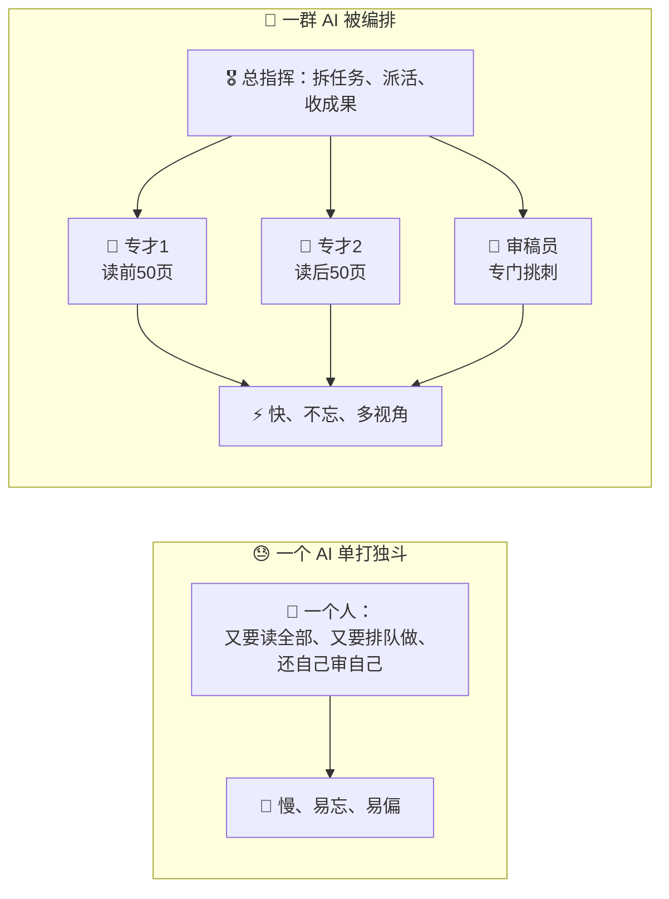
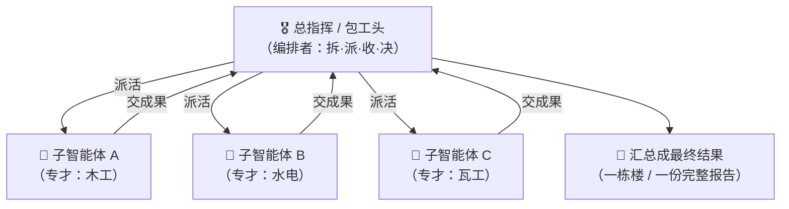
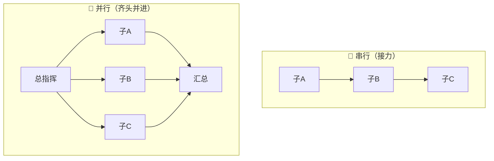
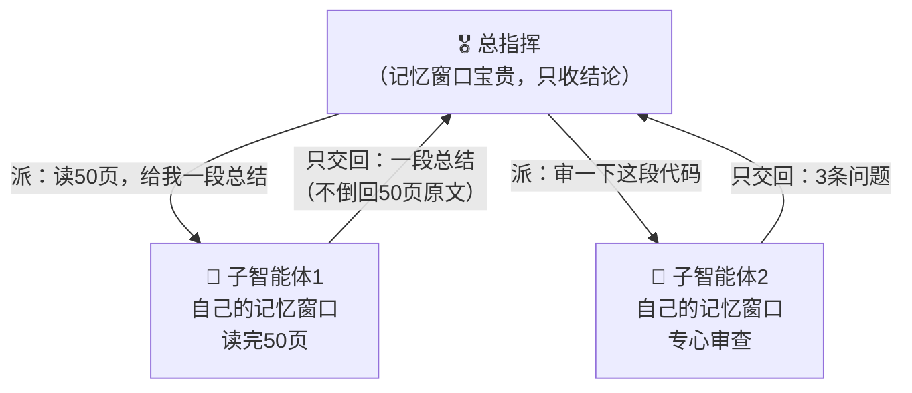
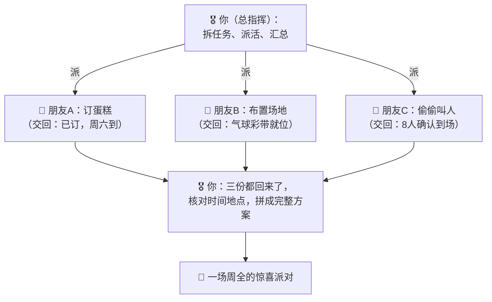
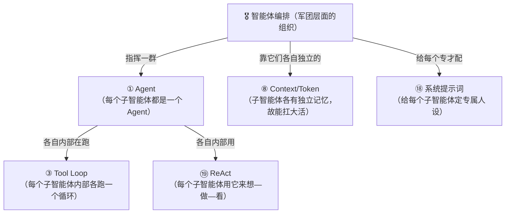

# ⑳ 什么是智能体编排（Agent Orchestration）

> 建议先读 [① 什么是 Agent](./[CONCEPT-01]%20什么是Agent-智能体.md)、[③ 什么是 Tool Loop](./[CONCEPT-03]%20什么是ToolLoop-工具循环.md) 和 [⑲ 什么是 ReAct](./[CONCEPT-19]%20什么是ReAct-智能体推理模式.md)。那几篇讲了"一个 AI 助理会自己干活""它反复用工具直到完成""它脑子里想—做—看的纪律"。这一篇要回答一个更大的问题：**一个 AI 已经够能干了，可有些活儿又大又杂，一个人扛不动、也扛不快——那能不能派出"一群 AI"，有人当总指挥、有人当专才，分工协作、并肩作战？** 这门"调兵遣将"的艺术，就是本篇的主角——**智能体编排（Agent Orchestration）**。

---

## 一、一句话定义

**智能体编排 = 让一个"总指挥"AI，把一个大任务拆开、派给多个"专才"AI 分头去做，再把各自的成果收拢、汇总成最终结果的一整套"调兵遣将"的做法。**

如果你只想记住一句话，就记这句：

> **一个 AI 干活，像一个人单打独斗；智能体编排，像一位将军带着一支军队——将军（总指挥）不亲自冲锋，而是把大战役拆成小任务，派给各路人马（子智能体）分头去打，最后把战报收上来，拼成一场胜仗。**

这一句话是整篇文档的骨架。后面所有的比喻、图、误区，都是在反复讲透这一句话。

```callout ask|小白发问
你可能会问："一个 AI 不是已经会自己[想—做—看](./[CONCEPT-19]%20什么是ReAct-智能体推理模式.md)、把活干完了吗？为啥还要一群？"——好问题！因为有些活儿，**一个人干又慢又容易顾此失彼**。比如"把这本 500 页的书读完、每章总结一段"——让一个 AI 从头读到尾，它读到后面就把前面+[忘了](还记得 [⑧ 上下文与令牌](./[CONCEPT-08]%20什么是Context与Token-上下文与令牌.md) 讲的"记忆窗口有限、装满会忘事"吗？一个 AI 读太多东西，脑子就装不下了)。但如果派 10 个 AI，一人读 50 页、各写各的总结，最后汇总——**又快又不会顾此失彼**。这就是编排的价值：**人多力量大，还得有人会指挥。** 这一篇不用懂代码，抓住"一个将军带一支军队打仗"就行～ 🐣
```

一句话摆清它和前几篇的关系：**[① Agent](./[CONCEPT-01]%20什么是Agent-智能体.md) 是"一个会干活的 AI 助理"；智能体编排，是"把很多个这样的助理组织起来、分工协作"——从"单兵"升级到"军团"。**

---

## 二、为什么需要编排？——一个人扛不动的三种活

一个 AI 助理已经很能干了，那为什么还要"一群"？因为有三种活，单枪匹马干起来又慢又糟：

### 场景一：活儿太大，一个人记不下

一个 AI 的"记忆窗口"是有限的（[⑧ Context 与 Token](./[CONCEPT-08]%20什么是Context与Token-上下文与令牌.md) 讲过）。让它一口气读完一整个大项目的几百个文件，读到后面就把前面忘了。**拆给一群 AI，每人只看一小块，各自看得又细又清楚。**

### 场景二：活儿能并排干，一个人却只能排队

有些子任务互不依赖，本可以**同时进行**。一个 AI 只能一件一件排队做（做完 A 才做 B）；一群 AI 可以**齐头并进**——十个人同时开工，十倍的速度。

### 场景三：活儿需要多个视角，一个人容易偏

让同一个 AI"既写代码、又挑自己代码的毛病"，它容易护短、看不见自己的盲区。**派一个 AI 专门写、另一个 AI 专门挑刺**，就像"作者 + 独立审稿人"，互相制衡，结果更靠谱。



**所以编排的价值就一句话：把"一个人扛不动、扛不快、容易偏"的大活儿，拆成"一群人分工协作"——又快、又稳、又全面。** 这就是为什么处理复杂任务时，越来越多的 AI 系统开始"组队作战"。

---

## 三、核心比喻：一位将军和他的军队

"编排"这个词听着抽象，用两个你熟悉的画面就能焊死它。

### 比喻一：将军指挥一场战役

一位将军要打一场大仗。他**不会亲自提刀冲锋**——那样既慢又危险。他做的是：**把战役拆成小任务**（左路攻城、右路包抄、斥候探路），**派给各路将士**分头执行，**收各路战报**，再据此**决定下一步**，直到全局告捷。

**总指挥 AI = 将军（拆任务、派活、汇总、决策）；各个子智能体 = 各路将士（每人专注打好自己那一仗）。** 将军的本事不在"武力最高"，而在"调度得当"。

### 比喻二：一个包工头带一支施工队

盖一栋楼，包工头**不自己砌每一块砖**。他把活拆开：木工组做门窗、水电组布管线、瓦工组砌墙，**同时开工**；他负责**排工期、协调谁先谁后、验收各组的活、把半成品拼成一栋楼**。

**包工头 = 编排者（总控）；各工种班组 = 子智能体（各有专长）。** 楼盖得快、盖得好，靠的是包工头的"编排"，而不是他一个人砌砖砌得快。



两个比喻的**共同内核**：**总控那一方不亲自干每件苦活，而是"拆解 → 分派 → 汇总 → 决策"；干活的一方各有专长、并肩作战。** 记住这一点，编排是什么就再也不会忘。

---

## 四、编排的三种"队形"——串、并、流水线

编排怎么组织这群 AI？最常见的三种"队形"，你一看图就懂：

| 队形 | 大白话 | 像什么 | 什么时候用 |
|------|--------|--------|-----------|
| **串行（接力）** | 一个做完，把成果交给下一个接着做 | 接力赛跑，一棒接一棒 | 后一步依赖前一步的结果 |
| **并行（齐头并进）** | 多个同时开工，各干各的，最后一起收 | 十个人同时搬砖 | 子任务互不依赖，越快越好 |
| **流水线（边做边传）** | 每件东西依次流过多道工序，工序之间不用"等齐" | 工厂流水线，A 在第三道时 B 还在第一道 | 一批东西要过好几道相同工序 |



**你不用记牢每种队形的名字**，只要抓住一个直觉：**编排者会根据"任务之间是不是互相依赖"，来决定让这群 AI 排队接力、还是同时开工。** 能并排干的就并排（图快），必须先后干的就接力（保对）。一个聪明的编排，往往是这几种队形**混着用**。

```callout star|一句话点睛
编排最反直觉的一点：**总指挥自己往往"不干具体活"。** 它最重要的工作是三件事——**把大任务拆对**（拆错了，后面全乱）、**派给合适的专才**、**把七零八落的成果拼回一个整体**。派活谁都会，难的是"拆得对、收得拢"。**编排的水平，全在这一拆一收之间。**
```

---

## 五、编排里的"专才"是怎么来的？——子智能体

编排派出去的那些"专才"，业内叫**子智能体（Sub-agent）**。你可以这样理解它：

**子智能体 = 总指挥临时"喊来"的一个下属 AI，只让它专心干一件小事，干完把结果交回来，然后就"解散"。**

它有几个关键特点，理解了就懂了编排为什么好用：

- **专一**：每个子智能体只被交代一件明确的小事（"读这 50 页、总结一段"），不用操心全局，反而干得更专注、更好。
- **独立的记忆**：每个子智能体有自己的一块"记忆窗口"，它读的那 50 页不会挤占总指挥或别的子智能体的记忆——**这正是"一群人比一个人记得下更多"的关键**。
- **只上交结论**：子智能体干完，通常只把**最终结论**交回总指挥（比如那段总结），而不是把它读过的 50 页原文全倒回来——**省得撑爆总指挥的记忆**。



看懂这张图，你就懂了编排最精巧的地方：**每个子智能体像一个"信息压缩器"**——它替总指挥啃下一大堆原始信息，只把提炼后的精华交回来。这样，总指挥就能用**有限的记忆**，统筹**海量的工作**。这，正是"军团"能扛下"单兵"扛不动的大活的根本原因。

```flip
既然子智能体这么好用，那是不是派得越多、分得越碎，就一定越好？（点一下翻到背面）
---
不是！派子智能体也是有"开销"的：拆任务、派活、等它们各自跑完、再把成果拼起来——这些协调本身要花时间和算力。任务太小还硬拆成十份，光"开会协调"的成本就超过了干活省下的时间，反而更慢、更乱。就像盖个狗窝，你请一个人搞定就行，非要拉一支三十人的施工队来，光排工期就够呛。**该单干的单干，该组队的组队——编排的智慧，是"看活儿的大小决定要不要拆、拆几份"，而不是无脑地越多越好。**
```

---

## 六、感觉一下：一次编排的"调度全景"

**⚠️ 郑重提醒：下面这段你完全不用会写。** 放它在这，只是让你**亲眼看一眼**——一个总指挥 AI 完成"给整个项目写一份健康体检报告"这种大活时，是怎么"调兵遣将"的。请只体会那个**拆 → 派 → 收 → 汇总**的节奏：

```text
🙋 你的目标：给我这个项目做一份全面的健康体检报告

🎖️ 总指挥（想）：这活太大，一个人啃不动也记不下。我拆成四个方向，
                 派四个专才同时去查（并行，图快）。

   ├─ 🤖 子智能体1 →「查代码质量」→ 交回：发现2处隐患
   ├─ 🤖 子智能体2 →「查安全漏洞」→ 交回：发现1个高危项
   ├─ 🤖 子智能体3 →「查测试覆盖」→ 交回：覆盖率78%，3个模块没测
   └─ 🤖 子智能体4 →「查文档完整度」→ 交回：2处文档过时

🎖️ 总指挥（收到四份结论，想）：四路战报都回来了。安全那个高危项最要紧，
                              我再派一个专才去深挖它（串行，依赖上一步）。

   └─ 🤖 子智能体5 →「深挖那个高危漏洞」→ 交回：成因 + 修复建议

🎖️ 总指挥（汇总）：把五份结论按轻重缓急拼成一份完整报告。
✅ 最终交付：一份体检报告——先讲最紧急的高危漏洞及修法，
            再列代码/测试/文档的问题清单。
```

看到那个"拆开 → 同时派四个 → 收齐结论 → 再派一个深挖 → 拼成报告"了吗？**这就是编排的真身。** 总指挥自己没有去读一行代码、查一个漏洞——它做的是**拆任务、派专才、收结论、按需追加、汇总成品**。

**整个过程里，真正"埋头干活"的是五个子智能体，而总指挥的价值，全在那"运筹帷幄"的调度上。** 这就是为什么一个好的编排，能让一群普通 AI，合力干成一件单个 AI 干不了的大事。

把这场"拆 → 派 → 收 → 汇总"演成一幕小短剧——重点看总指挥自己一行代码都不读，全靠调兵遣将把大活啃下来：

```scene 调兵遣将：总指挥不干活，只运筹帷幄
🧑 你 | 给我这个项目做一份全面的健康体检报告。
🎖️ 总指挥 | 这活太大，我一个人啃不动也记不下。拆成四个方向，派四个专才**同时**去查（并行，图快）。
🤖 子智能体1 | 查代码质量……交回：发现 2 处隐患。
🤖 子智能体2 | 查安全漏洞……交回：发现 1 个高危项！
🤖 子智能体3 | 查测试覆盖……交回：覆盖率 78%，3 个模块没测。
🤖 子智能体4 | 查文档完整度……交回：2 处文档过时。
🎖️ 总指挥 | 四路战报都回来了。那个高危项最要紧——我再派一个专才去**深挖它**（串行，得等前一步结论出来才能追）。
🤖 子智能体5 | 深挖那个高危漏洞……交回：成因 + 修复建议。
🎖️ 总指挥 | 把五份结论按轻重缓急 +[拼成一份报告](总指挥自己没读一行代码、没查一个漏洞——它的全部价值就在"拆任务、派专才、收结论、按需追加、汇总成品"这套调度上)：先讲最紧急的高危漏洞及修法，再列代码/测试/文档的问题清单。
🎉 最终交付 | 一份完整的项目健康体检报告。
> 一群普通 AI，被一个会调度的总指挥拧成一股绳，就能干成单个 AI 干不了的大事——这就是编排的真身。
```

---

## 七、常见误区（新手最容易踩的坑）

这一节请务必逐条读完。这些误解会让你对"智能体编排"的理解跑偏。

### 误区 1：以为编排就是"AI 数量越多越好"

- ❌ **错误理解**：编排嘛，派的 AI 越多、分得越碎，就一定越强。
- ✅ **正确理解**：**派子智能体是有协调开销的。** 拆、派、等、汇总都要花成本。小任务硬拆成一堆，"协调成本"反而超过收益，更慢更乱。**该单干就单干，活儿够大才组队**——编排的智慧在"看活儿大小决定拆不拆、拆几份"。

### 误区 2：以为总指挥是"最强的那个 AI，亲自干最难的活"

- ❌ **错误理解**：总指挥一定是能力最强的 AI，难活都它自己上。
- ✅ **正确理解**：**总指挥的核心本事是"调度"，不是"亲自干"。** 它擅长的是**拆对任务、派对人、收拢成果**。就像将军的价值在指挥而非武力最高。它甚至可以把最难的具体活，派给一个专精的子智能体去啃。

### 误区 3：把"编排（多个 AI）"和"工具循环（一个 AI 反复用工具）"搞混

- ❌ **错误理解**：编排和 [③ 工具循环](./[CONCEPT-03]%20什么是ToolLoop-工具循环.md) 是一回事吧？都是"反复干很多步"。
- ✅ **正确理解**：**层次不同。** 工具循环是**一个** AI 反复"用工具→看结果"把自己那摊活干完；编排是**多个** AI（一个总指挥 + 多个子智能体）分工协作。关系是：**编排里的每一个子智能体，自己内部往往就在跑一个工具循环。** 编排是"军团层面"的组织，工具循环是"单兵层面"的干活方式。

### 误区 4：以为子智能体之间会"自由聊天、互相商量"

- ❌ **错误理解**：那些子智能体是不是像开会一样，互相七嘴八舌讨论？
- ✅ **正确理解**：**通常不是。** 最常见的编排里，子智能体**各干各的、互不打扰**，只跟总指挥"单线联系"（领任务、交结论）。这样反而**干净、不乱、好管**——就像施工队各工种专注自己的活，由包工头统一协调，而不是所有人挤在一起吵。

### 误区 5：以为编排是"很遥远、很高级、跟我没关系"的东西

- ❌ **错误理解**：多智能体编排听着好高深，那是大厂才玩的，跟我学 Khy-OS 没关系。
- ✅ **正确理解**：**它离你很近。** 你在 Khy-OS 里让 AI 干一个大活时，它完全可能"派几个子智能体分头去查、再汇总"——这就是编排在你眼皮底下发生。理解它，你才看得懂"为什么它能又快又全地啃下一个大任务"。**它不是空中楼阁，是你手边工具的真实能力。**

```quiz
Q: 下面关于"智能体编排"的说法，哪些是对的？（多选）
- [x] 编排是一个"总指挥"AI 把大任务拆开、派给多个"专才"子智能体，再汇总成果
> 对。像将军拆战役派各路人马、包工头拆活派各工种——核心是"拆·派·收·决"。
- [x] 每个子智能体有自己独立的记忆窗口，通常只把"结论"交回总指挥
> 对。它像信息压缩器，替总指挥啃下海量原始信息、只交回精华，省得撑爆总指挥的记忆。
- [ ] 派的 AI 越多、分得越碎，效果就一定越好
> 错。拆派收都有协调开销；小任务硬拆反而更慢更乱。该单干就单干，活够大才组队。
- [ ] 编排和"一个 AI 的工具循环"是完全一样的东西
> 错。工具循环是单个 AI 反复用工具干自己的活；编排是多个 AI 分工协作。编排里每个子智能体内部往往还各跑一个工具循环。
- [x] 总指挥的核心本事是"调度"（拆对、派对、收拢），不一定亲自干最难的活
> 对。将军的价值在指挥而非武力最高，最难的具体活可以派给专精的子智能体。
```

---

## 八、动手小实验 / 思想实验

理论看再多，不如在脑子里走一遍。下面的思想实验不用写代码，只用想。

### 实验：你当一次"总指挥"，办一场生日派对

任务："三天后给朋友办一场惊喜生日派对。" 这活儿又杂又急，你一个人跑断腿也未必周全。试试当"总指挥"，把它编排出去：



走完这一遍，请你回答自己三个问题：

1. 三件事（订蛋糕、布置、叫人）能**同时**进行吗？——**能**，它们互不依赖，所以你用了"并行"队形，三个朋友齐头并进，比你一个人一件件跑快得多。
2. 你（总指挥）亲手订蛋糕、吹气球了吗？——**没有**。你干的是"拆活、派人、把三份成果核对拼合"。
3. 如果"叫人"这件事必须等"确定了场地大小"才能定人数，队形会变吗？——**会**。那它俩就得"接力"（先定场地→再定人数），不能并排——这就是"任务依赖决定队形"。

**关键体会**：你刚刚亲手当了一回编排者。你会发现，编排一点都不神秘——**它就是你办大事时天然会用的"分工统筹"智慧**：能并排的并排（图快），有先后的接力（保对），自己专注"拆和收"。把这份人人都懂的智慧交给 AI，就是"智能体编排"。

---

## 九、和其它概念的关系

编排是站在"最上层"的组织术——它把前面好多概念都"套"了一层。



| 概念 | 一句话关系 | 类比 |
|------|-----------|------|
| [① Agent](./[CONCEPT-01]%20什么是Agent-智能体.md) | 编排里的**每一个成员（总指挥、子智能体）都是一个 Agent** | 军团由一个个士兵组成 |
| [③ Tool Loop](./[CONCEPT-03]%20什么是ToolLoop-工具循环.md) | **每个子智能体内部，各跑一个工具循环**把自己那摊活干完 | 每个士兵自己会打仗 |
| [⑧ Context 与 Token](./[CONCEPT-08]%20什么是Context与Token-上下文与令牌.md) | 子智能体**各有独立记忆窗口**，这正是"军团能记下更多"的关键 | 每人一个笔记本，合起来记得海量 |
| [⑲ ReAct](./[CONCEPT-19]%20什么是ReAct-智能体推理模式.md) | 每个子智能体干活时，用 **ReAct 想—做—看** | 每个士兵都懂"三思而后行" |
| [⑱ 系统提示词](./[CONCEPT-18]%20什么是系统提示词-SystemPrompt.md) | 可以给**每个子智能体配一份专属系统提示词**（定其专长人设） | 给每个工种发不同的岗位手册 |

一句话串起来：**智能体编排是站在最上层的组织术——它指挥一群各自是 Agent、各自跑着工具循环、各自用 ReAct 想—做—看、各自有独立记忆和专属人设的子智能体，把一个单兵扛不动的大任务，拆开、并肩作战、再汇总成一份完整成果。**

---

## 十、和 Khy-OS 的关系

这一节和你手上的项目关系很紧：

**Khy-OS 面对大任务时，就有"派子智能体分头干、再汇总"的编排能力。**

当你在 Khy-OS 里交给它一个又大又杂的活——比如"把这个大项目通读一遍，找出所有潜在问题"——它并不一定傻乎乎地自己从头读到尾。作为一个成熟的 [harness](./[CONCEPT-16]%20什么是Harness-智能体运行骨架.md)，它可以：

- 把大任务**拆成若干方向**（读代码、查安全、看测试……）；
- **派出多个子智能体**，各自领一个方向、用**自己独立的记忆窗口**去啃；
- 每个子智能体干完，只把**提炼后的结论**交回来；
- 由主控**汇总**成一份完整、条理清晰的成果交给你。

这正是本文讲的编排。它让 Khy-OS 能扛下"单个 AI 记不下、干不快、顾不全"的大活——**又快、又稳、又全面。**

而 Khy-OS 章程里那些"多步任务先列 plan、每步带 verify"的纪律，本质上也是编排智慧的体现：**把大目标拆成一步步可验证的小任务，再逐一落实、汇总**——无论是拆给"多个子智能体"，还是拆成"一个 AI 的多个步骤"，那份"拆解 → 分派 → 汇总"的思路，是相通的。

> 💡 换个角度说：**学会"智能体编排"这个概念，你就摸到了 AI 处理复杂任务的"天花板"。** 从"一个 AI 帮我干活"到"一群 AI 被指挥着协同作战"，这是 AI 能力的一次跃迁。你从入行第一站就理解它，日后无论是用 AI 办大事，还是看懂那些"多智能体系统"的新闻，都不会觉得高深莫测——因为你早就知道：**那不过是一位将军，带着一支听话的军队，在打一场井井有条的仗。**

> ⚠️ 诚实说一句边界：编排具体怎么实现（怎么拆、怎么派、怎么并行、怎么收），属于设计与实现层面，各家做法不同、也在快速演进。Khy-OS 的具体机制你可以在 [`docs/03_DESIGN_设计`](../03_DESIGN_设计) 与项目章程里深入了解。本文只讲"智能体编排是什么、为什么需要它"这一层概念地图。

---

## 十一、小结 + 下一步

- **智能体编排 = 一个"总指挥"AI 把大任务拆开、派给多个"专才"子智能体分头做、再汇总成最终结果**的一整套"调兵遣将"做法。
- **为什么需要它**：有三种活单兵扛不动——太大记不下、能并排却只能排队、需要多视角却容易偏；一群 AI 分工协作，又快、又稳、又全面。
- **核心比喻**：**将军指挥战役**、**包工头带施工队**——总控不亲自干每件苦活，而是"拆解 → 分派 → 汇总 → 决策"。
- **三种队形**：串行（接力，有依赖时）、并行（齐头并进，图快时）、流水线（边做边传）——按"任务是否互相依赖"来选，常混着用。
- **子智能体**：临时喊来的专才，专一、有独立记忆、只上交结论——像"信息压缩器"，让总指挥用有限记忆统筹海量工作。
- **五大误区**：不是数量越多越好（有协调开销）、总指挥重"调度"非"亲自干"、编排（多个 AI）≠工具循环（一个 AI）、子智能体通常各干各的不互相聊、它离你很近不高深。
- **和 Khy-OS 的关系**：面对大任务，Khy-OS 能"派子智能体分头干、再汇总"；章程的"拆 plan、每步 verify"也是同一份拆解—分派—汇总的智慧。

🎉 **恭喜，你摸到了 AI 协作的"天花板"！** 从"一个 AI 帮你干活"，到"一群 AI 被你指挥着协同作战"——你现在既懂单兵，也懂军团。这套从概念到编排的完整地图，已经在你脑子里连成一片了。

👈 回 [概念入门总览](./00_INDEX_概念入门-总览.md) 看看还有哪些能温故知新。

👈 上一篇 [⑲ 什么是 ReAct](./[CONCEPT-19]%20什么是ReAct-智能体推理模式.md)——回顾一下单个 AI"想—做—看"的思考纪律。

👉 下一篇 [㉑ 什么是思维链](./[CONCEPT-21]%20什么是思维链-ChainOfThought.md)——一个 AI 内部"想清楚再答"的思考纪律：把推理一步步显式写出来，少犯想当然的错。
