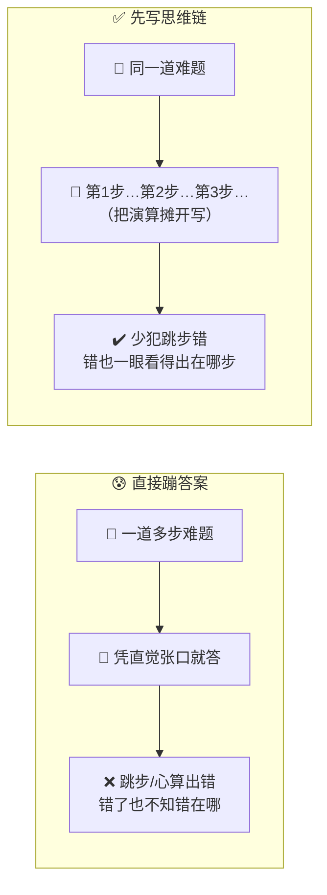
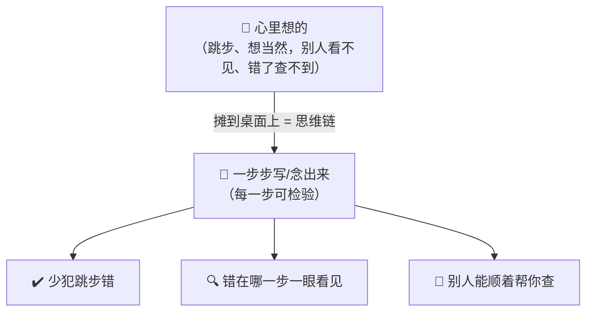
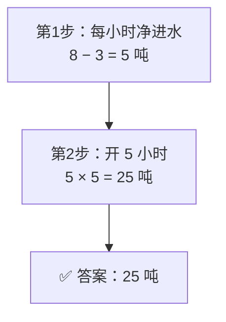
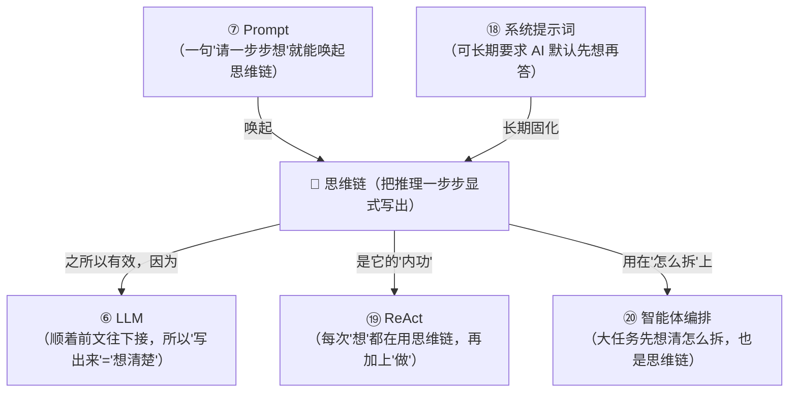

# ㉑ 什么是思维链（Chain-of-Thought, CoT）

> 建议先读 [⑦ 什么是 Prompt](./[CONCEPT-07]%20什么是Prompt-提示词.md)、[⑥ 什么是 LLM](./[CONCEPT-06]%20什么是LLM-大语言模型.md) 和 [⑲ 什么是 ReAct](./[CONCEPT-19]%20什么是ReAct-智能体推理模式.md)。那几篇讲了"你怎么跟 AI 交代活儿""AI 这颗大脑是怎么'接着往下说'出答案的""它脑子里想—做—看的纪律"。这一篇要回答一个更小、却更要命的问题：**同样一颗 AI 大脑，凭什么有时候把难题算得又对又稳，有时候却张口就错、还错得理直气壮？** 秘密往往就藏在一个动作里——**它到底有没有把"中间的思考"一步步写出来**。这个"把想法摊开来写"的做法，就是本篇的主角——**思维链（Chain-of-Thought, CoT）**。

---

## 一、一句话定义

**思维链 = 让 AI 在给出最终答案之前，先把中间的推理、演算过程一步一步写出来，而不是直接蹦出一个结论。**

如果你只想记住一句话，就记这句：

> **不用思维链的 AI，像一个学生拿到应用题、不打草稿就直接写答案；用了思维链的 AI，像一个老实学生先在草稿纸上一步步列算式、写清每一步怎么来的，最后才落笔写答案。** 把思考"摊开来写"，错误就少了一大半。

这一句话是整篇文档的骨架。后面所有的比喻、图、误区，都是在反复讲透这一句话。

```callout ask|小白发问
你可能会问："AI 心里不是已经'想'过了吗？让它把过程写出来，不就是多打几个字、浪费时间？"——好问题！可事情恰恰相反。对 AI 这颗大脑来说，**"写出来"本身就是"想清楚"的一部分**。它是[顺着已经写下的字，一个字一个字往下接](./[CONCEPT-06]%20什么是LLM-大语言模型.md)的——如果它跳过中间步骤直接写答案，就等于逼自己"一步登天"，很容易在心里+[偷偷跳步](就像你算 17×23，不打草稿直接报个数，多半会算错；可只要你写下"17×20=340，17×3=51，340+51=391"，反而不容易错)、然后想当然地错掉。让它把每一步写下来，就等于给它一张"草稿纸"，逼它踏踏实实一步一步来。这一篇不用懂代码，抓住"做应用题先打草稿"这一个画面就行～ 🐣
```

一句话摆清它和前几篇的关系：**[⑦ Prompt](./[CONCEPT-07]%20什么是Prompt-提示词.md) 是"你怎么给 AI 交代任务"，而思维链，是"你请 AI 在交出答案前，先把它自己的思考过程摊开写给你看"——一个是你对它说话的方式，一个是它自己想问题的方式。**

---

## 二、为什么需要它？——"直接蹦答案"的三种翻车

一颗 AI 大脑已经很聪明了，那为什么还非要它"一步步写"？因为"张口就来、直接报结论"，在下面三种活儿上特别容易翻车：

### 场景一：多步推理，跳一步就满盘皆错

凡是"要拐好几个弯"的题——算账、排时间、逻辑推断——只要中间任何一步在心里偷偷跳过、算错，最终答案就全错。**逼它把每一步写下来，等于每一步都过一遍明路，跳步和心算的错就大幅减少。**

### 场景二：答案错了，你却"无从查起"

AI 直接甩给你一个结论，万一是错的，你根本不知道它错在哪一环——是题目看错了？还是某步算错了？**而写出了思维链，就像留下了完整的演算草稿：错在哪一步，一眼就能指出来、就能纠。**

### 场景三：看着"很自信"，其实是"想当然"

不写过程的 AI，最容易"想当然"——凭第一感觉给个听着挺顺的答案，实则经不起推敲。**强迫它一步步论证，等于逼它把"直觉"换成"实打实的推导"，很多想当然的错，在写第二步的时候自己就露馅了。**



**所以思维链的价值就一句话：把"在脑子里偷偷跳步、想当然"变成"在纸面上一步步走明路"——答案更对、错了也查得到。** 这就是为什么处理稍难一点的题，一句"请一步一步想"往往就能让 AI 的表现明显变好。

---

## 三、核心比喻：把"心里想的"摊到桌面上

"思维链"这个词听着玄，用两个你熟悉的画面就能焊死它。

### 比喻一：做应用题先打草稿

小学老师最爱说一句话："别光写答案，把过程写出来。" 为什么？因为**光写答案，对了你不知道是蒙的还是真会，错了更不知道错在哪**。而一旦你把"设、列式、求解、答"一步步写在草稿纸上，每一步都看得见——算错了，老师一眼圈出是哪一步；你自己回头检查，也顺着草稿就能查。

**AI 不写思维链 = 学生只写答案；AI 写思维链 = 学生老老实实打草稿、列算式。** 谁的错更少、谁的错更好查，一目了然。

### 比喻二：老账房先生打算盘、念出声

旧时钱庄里，最稳的老账房先生打算盘，从不闷头一顿噼里啪啦、末了报个总数。他是**一边拨珠、一边把每一步念出声**："进项三百二……减去支出一百八……余一百四……再加上月结余五十……共一百九。" 每一句都落在明处。

好处在哪？**万一算错，旁边的人当场就能接一句"不对，上月结余是六十不是五十"——错在哪一步，随他念到哪就露在哪。** 若他闷声算、只报个总数，错了就得从头再算一遍，谁也说不清岔在哪儿。

**闷头算、只报总数 = 不写思维链；边算边念、步步出声 = 写思维链。** 把思考"念出来、摊开来"，错误就藏不住了。



两个比喻的**共同内核**：**把原本闷在脑子里、看不见也查不到的思考，一步一步"显式地"写出来、摊到明面上——于是每一步都能被检验，错了也堵得住。** 记住这一点，思维链是什么就再也不会忘。

---

## 四、思维链的灵魂：把思考"显式化"

前面反复说"一步步写出来"，这四个字里，藏着思维链真正的灵魂——**"显式化"**。

什么叫"显式"？就是**把本来藏在心里、看不见的东西，明明白白地摆到外面来**。思维链的全部威力，都来自这一个动作。你可以从两个角度体会它为什么这么关键：

**第一，对 AI 自己：写下来 = 想清楚。** AI 生成文字是"顺着前文往下接"的。当它被要求先写"第一步……第二步……"，它就必须让每一步都跟上一步接得上、说得通——这本身就逼它把逻辑走扎实，而不是凭一股直觉一步跳到答案。**"写"这个动作，替它把"想"给做实了。**

**第二，对你（和任何检查者）：显式 = 可检验。** 藏在心里的推理，对错全凭最后那个结论去猜；一旦摊开写成一条链，**每一环都成了一个可以单独指指点点的"抓手"**——你可以指着第三步说"这里错了"，而不必推翻整个答案重来。

```callout star|一句话点睛
思维链最反直觉、也最关键的一点：**它的价值，不在"让 AI 显得会思考"，而在"把思考变成可以一步步检查的东西"。** 一个藏在心里的答案，对了是运气、错了是黑箱；一条摊在纸面的推理链，对了看得懂、错了查得到、还能顺着改。**"显式化"三个字，就是思维链的全部灵魂——写出来，是为了看得见；看得见，才管得住。**
```

所以，下次你只需对 AI 多说一句"**请一步一步想，把过程写出来**"——你其实是在请它，把闷在脑子里的思考，摊到桌面上让你我都看得见。就这么一句话，往往就能把一个爱想当然的答案，变成一条经得起检查的推理。

---

## 五、思维链 vs ReAct：光"想"，还是"想 + 做"？

学到这里，很容易把思维链和 [⑲ ReAct](./[CONCEPT-19]%20什么是ReAct-智能体推理模式.md) 搞混——它俩都"一步一步"，长得有点像。但它们其实是两层不同的事，分清了你就通透了：

```flip
🤔 猜猜看：思维链（CoT）只"想"，ReAct 又想又做——它俩差在哪一步？
---
✅ 差在有没有「行动环」：CoT 全程只在脑子里推理、从不与外界交互；ReAct 每想一步就可以调一次工具（查资料、算数），拿到结果再接着想。CoT 是闭卷心算，ReAct 是开卷动手查。
```

**思维链，是纯粹在"脑子里"一步步想——它只推理、不动手。** 就像你坐在书桌前解一道数学题：你反复演算、推导，全程只跟草稿纸打交道，**不需要起身去查资料、也不需要用任何工具**。思维链就是这个"埋头演算"的过程。

**ReAct，是"想一步、做一步"交替进行——它既推理、又动手（用工具）。** 就像你解一道题解到一半，发现"这个数据我不知道"，于是**起身去查了本书、翻了个网页，拿到结果再接着往下想**。这个"想→做→看→再想"的循环，就是 ReAct。

一句话点破：**思维链是"闭卷心算"，ReAct 是"开卷 + 动手查"。** 而且它俩不是对手，而是**里应外合**——ReAct 里每一次"想"，用的往往正是思维链那套"一步步推"的功夫。


**记住这一句就够了：思维链管"想得清不清楚"，ReAct 管"想 + 做怎么配合"。前者是后者的"内功",后者是前者加上了"动手"的一双手。**

---

## 六、感觉一下：一次"打草稿"的全过程

**⚠️ 郑重提醒：下面这段你完全不用会写。** 放它在这，只是让你**亲眼看一眼**——同一道题，AI"直接蹦答案"和"先写思维链"，差别到底有多大。请只体会那个**一步接一步、每步都看得见**的节奏：

```text
🙋 你的问题：小明有 3 盒铅笔，每盒 12 支，他送给同学 8 支，又买了 2 盒
            （每盒还是 12 支），现在他有多少支铅笔？

──────────────────────────────────────────────
❌ 不写思维链（直接蹦答案）：
🤖 「一共 60 支。」
   （对不对？你不知道它怎么算的，错了也查不出错在哪一步）

──────────────────────────────────────────────
✅ 先写思维链（一步步打草稿）：
🤖 让我一步一步来：
   第1步：原来有 3 盒，每盒 12 支 → 3 × 12 = 36 支
   第2步：送给同学 8 支 → 36 − 8 = 28 支
   第3步：又买 2 盒，每盒 12 支 → 2 × 12 = 24 支
   第4步：现在一共 → 28 + 24 = 52 支
   ✅ 答案：52 支。
```

看到那个"36 → 28 → 24 → 52"、一步一个脚印了吗？**这就是思维链的真身。** 两个 AI 也许"直觉答案"都是一时脑补，但写了链的那个——**每一步都摆在明处**：万一它第 2 步写成了"36 − 8 = 27"，你一眼就能圈出来"这儿错了"，而不必怀疑整道题。

**而那个只报"60 支"的，就算错了，你也无从下手——你既不知道它错在哪，甚至不知道它是不是蒙对的。** 这就是为什么，越是难题，越要请 AI"把过程写出来"。

把这场"直接蹦答案 vs 先打草稿"演成一幕小短剧——重点看写了链的那个，错在哪一眼可查，蹦答案的那个错了也无从下手：

```scene 打草稿现场：一个只报答案，一个把每步摆到明处
🧑 你 | 小明 3 盒铅笔每盒 12 支，送同学 8 支，又买 2 盒（每盒 12 支），现在有多少支？
🤖 蹦答案 AI | 一共 60 支。
😕 旁白 | 对不对？你不知道它怎么算的。就算错了，你也不知道错在哪一步、甚至不知道是不是蒙的。
🤖 打草稿 AI | 让我一步一步来——
🤖 打草稿 AI | 第1步：原来 3 盒 × 12 = 36 支。
🤖 打草稿 AI | 第2步：送同学 8 支 → 36 − 8 = 28 支。
🤖 打草稿 AI | 第3步：又买 2 盒 × 12 = 24 支。
🤖 打草稿 AI | 第4步：现在一共 28 + 24 = 52 支。✅ 答案：52 支。
🧑 你 | 好处一眼看出来了：万一它第 2 步写成 36 − 8 = 27，我立刻能圈出"这儿错了"，不用怀疑整道题。
> 把思考 +[摊到桌面上](思维链的灵魂就是"把心里想的每一步显式写出来"——既让 AI 少跳步出错，也让你能逐步查错)——这就是思维链比"直接蹦答案"靠谱的根。
```

---

## 七、常见误区（新手最容易踩的坑）

这一节请务必逐条读完。这些误解会让你对"思维链"的理解跑偏。

### 误区 1：以为思维链是一种"高深的新模型/新技术"

- ❌ **错误理解**：思维链一定是某种很厉害的新 AI、要专门去装的高级功能。
- ✅ **正确理解**：**它不是新模型，而是一种"让 AI 怎么答"的方式。** 同一颗 AI 大脑，你只要多说一句"请一步一步想、把过程写出来"，它就开始走思维链了。**它是一个使用习惯，不是一件要另买的装备。**

### 误区 2：以为"写了过程"纯粹是浪费字数、拖慢速度

- ❌ **错误理解**：让它写那么多中间步骤，不就是啰嗦、费时间吗？直接给答案多干脆。
- ✅ **正确理解**：**对 AI 来说，"写出来"本身就是"想清楚"的一部分。** 它跳过中间步骤直接答，等于逼自己一步登天，反而更容易错。那点"多写的字",换来的是**少犯跳步错、错了还能查**——难题上这笔买卖太划算了。

### 误区 3：以为写了思维链，答案就一定百分百正确

- ❌ **错误理解**：只要让它一步步写，它就再也不会算错了。
- ✅ **正确理解**：**思维链是"大幅减少"错误、让错误"可检查"，不是"消灭"错误。** 它照样可能在某一步写错。但好处在于——**这个错被明明白白写在了那一步上，你（或它自己回头复查）能揪出来、能纠正**，而不是像黑箱答案那样错得无从查起。

### 误区 4：把"思维链（只想）"和"ReAct（想+做）"当成一回事

- ❌ **错误理解**：思维链和 [⑲ ReAct](./[CONCEPT-19]%20什么是ReAct-智能体推理模式.md) 不都是"一步一步"嘛，是一个东西吧？
- ✅ **正确理解**：**不是。思维链只在"脑子里"推理、不动手；ReAct 是"想一步、做一步（用工具）"交替。** 思维链像"闭卷心算"，ReAct 像"开卷 + 动手查"。关系是：**ReAct 里每次"想",用的正是思维链的功夫。** 一个是内功，一个是内功加上了动手的手。

### 误区 5：以为思维链"很遥远、跟我学 Khy-OS 没关系"

- ❌ **错误理解**：思维链听着是研究员才关心的，跟我用 Khy-OS 有啥关系。
- ✅ **正确理解**：**它离你近得很。** Khy-OS 章程里那句 **B1"先想再写"**、[goal 循环](./[CONCEPT-19]%20什么是ReAct-智能体推理模式.md) 里"每步讲清改什么、为什么、影响面"——**本质就是思维链精神：动手前先把思路一步步摊开来。** 你每次要求 AI"先说说你打算怎么改",就是在用思维链。

```quiz
Q: 下面关于"思维链（Chain-of-Thought）"的说法，哪些是对的？（多选）
- [x] 思维链就是让 AI 在给出答案前，先把中间的推理/演算一步步写出来
> 对。像做应用题先打草稿、老账房先生边打算盘边念出声——核心是把思考"摊开来写"。
- [x] 思维链的灵魂是"把思考显式化"——写出来，是为了看得见、错了查得到
> 对。藏在心里的推理对错全靠猜；摊开成一条链，每一步都成了能单独检查、单独纠正的抓手。
- [ ] 思维链是一种要专门去装的高深新模型
> 错。它不是新模型，是"让 AI 怎么答"的方式——多说一句"请一步一步想"，同一颗大脑就走思维链了。
- [ ] 只要写了思维链，AI 的答案就一定百分百正确
> 错。它是大幅减少错误、让错误"可检查"，不是消灭错误。好处是错也明明白白写在那一步上、能揪出来。
- [x] 思维链只在"脑子里"推理、不动手；ReAct 则是"想 + 做（用工具）"交替
> 对。思维链像闭卷心算，ReAct 像开卷加动手查。ReAct 里每次"想"，用的正是思维链的功夫。
```

---

## 八、动手小实验 / 思想实验

理论看再多，不如在脑子里走一遍。下面的思想实验不用写代码，只用想。

### 实验：给同一道题，当一回"批改老师"

任务：假设你把这道题分别丢给"直接答"和"写过程"两个 AI——

> "一个水池，进水管每小时进 8 吨，出水管每小时出 3 吨。水池空着，两管同开，5 小时后池里有多少吨水？"

**AI 甲（直接答）**：`40 吨。`
**AI 乙（写思维链）**：


走完这一遍，请你回答自己三个问题：

1. 你怎么知道 AI 甲的"40 吨"是错的？——你**不知道**。它没写过程，你只能自己重算一遍，才发现它多半是忘了减掉出水（8×5=40）。错在哪一步？你得从头猜。
2. 你怎么知道 AI 乙对不对、错也错在哪？——**一眼就知道**。它把"净进水 5 吨/时 × 5 时 = 25 吨"摊在明处，每一步你都能核；万一它第 1 步写成"8+3=11",你当场就能圈出来。
3. 如果 AI 乙第 2 步不小心写成"5×5=20"，你能救它吗？——**能**。你顺着链指出"这步乘错了，应是 25"，前后其它步都不用动。可 AI 甲那个黑箱答案，你只能整个推翻重来。

**关键体会**：你刚刚亲手体会到——**思维链真正值钱的，不是让 AI"看着更聪明",而是把它的思考变成了"可以一步步指指点点、单独纠错"的东西**。把闷在脑子里的推理摊开来写，对你、对它自己，都是一张能反复检查的草稿纸。这，就是思维链的全部本事。

---

## 九、和其它概念的关系

思维链不是孤立的，它像一根线，把前面好几个概念串在了一起。



| 概念 | 一句话关系 | 类比 |
|------|-----------|------|
| [⑥ LLM](./[CONCEPT-06]%20什么是LLM-大语言模型.md) | 正因为 LLM 是"顺着前文往下接"，**把步骤写出来才等于把逻辑走实** | 顺着草稿往下写，越写越清楚 |
| [⑦ Prompt](./[CONCEPT-07]%20什么是Prompt-提示词.md) | 一句 **"请一步一步想"** 的提示词，就能唤起思维链 | 老师一句"把过程写出来" |
| [⑲ ReAct](./[CONCEPT-19]%20什么是ReAct-智能体推理模式.md) | **思维链是 ReAct 的"内功"**——ReAct 每次"想",用的就是它 | 心算是解题的底子，动手查是加的一双手 |
| [⑱ 系统提示词](./[CONCEPT-18]%20什么是系统提示词-SystemPrompt.md) | 可以在系统提示词里**长期要求** AI"先想再答" | 给它立一条永久的"打草稿"家规 |
| [⑳ 智能体编排](./[CONCEPT-20]%20什么是智能体编排-Orchestration.md) | 编排"怎么拆大任务",本身就是一次**关于拆解的思维链** | 将军排兵前，先在心里把仗一步步推演 |

一句话串起来：**思维链是站在最"底层"的思考功夫——正因为 [LLM](./[CONCEPT-06]%20什么是LLM-大语言模型.md) 顺着前文接话，所以把推理写出来就等于想清楚；一句 [Prompt](./[CONCEPT-07]%20什么是Prompt-提示词.md) 就能唤起它，一份 [系统提示词](./[CONCEPT-18]%20什么是系统提示词-SystemPrompt.md) 就能把它固化成习惯；它是 [ReAct](./[CONCEPT-19]%20什么是ReAct-智能体推理模式.md) 的内功、也是 [编排](./[CONCEPT-20]%20什么是智能体编排-Orchestration.md) 拆任务时的底子。**

---

## 十、和 Khy-OS 的关系

这一节和你手上的项目关系很紧：

**Khy-OS 的项目章程，几乎处处都是"思维链"精神的落地。**

翻开章程的行为准则，第一条 **B1 就叫"先想再写"**——动手前先讲清"改什么、为什么、影响面"。这是什么？**这就是思维链**：不许上来就闷头改代码（等于"直接蹦答案"），而要先把思路一步步摊开、写给你看。

再看 **B2"目标驱动执行"** 里那句"多步任务先列 plan、每步带 verify"：

- **先列 plan** = 先把"这件事分几步、每步干嘛"一条条写出来 —— 这是**拆解的思维链**；
- **每步带 verify** = 每一步都留下"怎么验证它对了"的凭据 —— 这让每一步都**可检验**，正是思维链"显式化 → 可检查"的灵魂；
- **没跑过验证不许说'修好了'** = 不许跳步、不许想当然 —— 这正是思维链要根治的毛病。

所以你在 Khy-OS 里看到的那些"先说计划、一步步做、每步给证据"的做法，**本质上就是把思维链，从一句临时提示，变成了一条写进章程的铁律。** 它让 AI 干活时，不能闷头一顿操作、末了甩你一个"搞定了",而必须像老账房先生那样——**每一步都念在明处，错在哪一步，你我都看得见。**

> 💡 换个角度说：**学会"思维链"这个概念，你就拿到了让 AI 变可靠的最省力的一把钥匙。** 你不需要懂任何技术，只要养成一个习惯——**凡是稍难的活，就多说一句"请你先一步一步想、把思路写出来再动手"**。这一句话，往往就能把一个爱想当然、爱翻车的 AI，变成一个肯打草稿、错了也查得到的靠谱帮手。这份"先想再写"的智慧，也正是 Khy-OS 章程反复强调的东西。

> ⚠️ 诚实说一句边界：思维链具体好用到什么程度、在什么题上提升最大、会不会"写了过程也还是错"，这些属于更细的实践与研究层面，随模型、随任务而不同，也在快速演进。本文只讲"思维链是什么、为什么它能让 AI 更靠谱"这一层概念地图。

---

## 十一、小结 + 下一步

- **思维链 = 让 AI 在给最终答案前，先把中间的推理、演算一步步写出来**，而不是直接蹦一个结论。
- **为什么需要它**：直接蹦答案有三种翻车——多步推理跳一步就全错、错了无从查起、看着自信其实想当然；一步步写，答案更对、错也查得到。
- **核心比喻**：**做应用题先打草稿**、**老账房先生边打算盘边念出声**——把闷在心里的思考，摊到明面上，每一步都可检验。
- **灵魂**：**"显式化"**——写出来（对 AI 是"想清楚"）、看得见（对你是"可检查、可单独纠错"）。
- **和 ReAct 的区别**：思维链只在"脑子里"想（闭卷心算），ReAct 是"想 + 做（用工具）"交替（开卷动手查）；思维链是 ReAct 的内功。
- **五大误区**：它不是高深新模型（是使用方式）、"写过程"不是浪费（是想清楚）、写了也不保证百分百对（但错可查）、别和 ReAct 混（只想 vs 想+做）、它离你很近（章程里就是）。
- **和 Khy-OS 的关系**：章程 B1"先想再写"、B2"先列 plan、每步带 verify、没验证不许说修好了"——全是思维链精神的铁律化落地。

🎉 **恭喜，你拿到了让 AI 变可靠的最省力钥匙！** 从今往后，凡是稍难的活，你都懂得多说一句"请你先一步一步想"——就这一句，就能让 AI 少犯错、错了还查得到。这份"先想再写、步步显影"的智慧，已经在你脑子里生根了。

👈 回 [概念入门总览](./00_INDEX_概念入门-总览.md) 看看还有哪些能温故知新。

👈 上一篇 [⑳ 什么是智能体编排](./[CONCEPT-20]%20什么是智能体编排-Orchestration.md)——回顾一群 AI 如何被指挥协作。

👉 下一篇 [㉒ 什么是反思](./[CONCEPT-22]%20什么是反思-Reflection.md)——AI 做完一件事后，怎么回头挑自己的错、越做越好。
