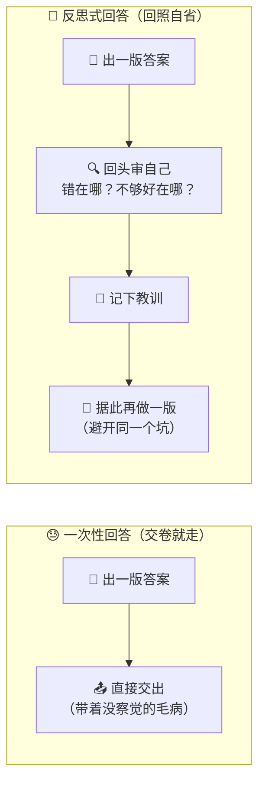
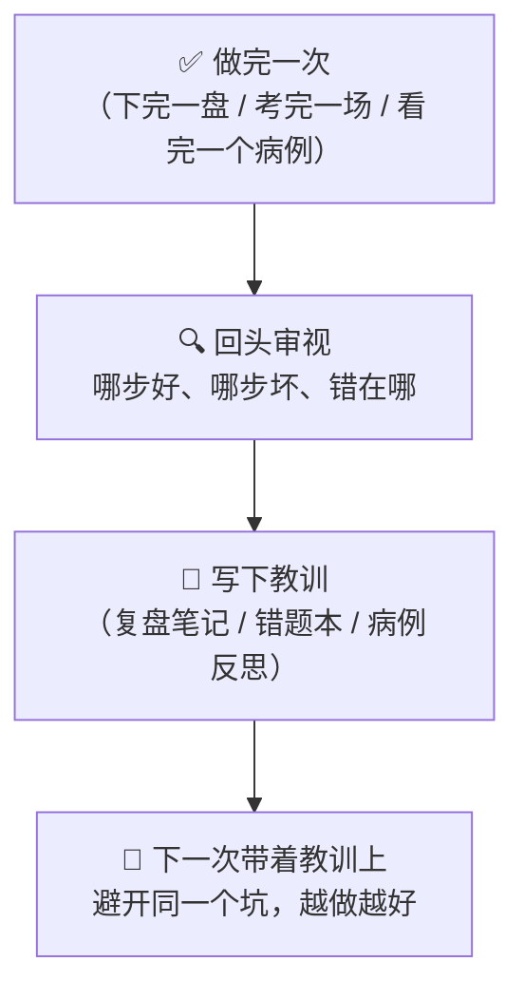
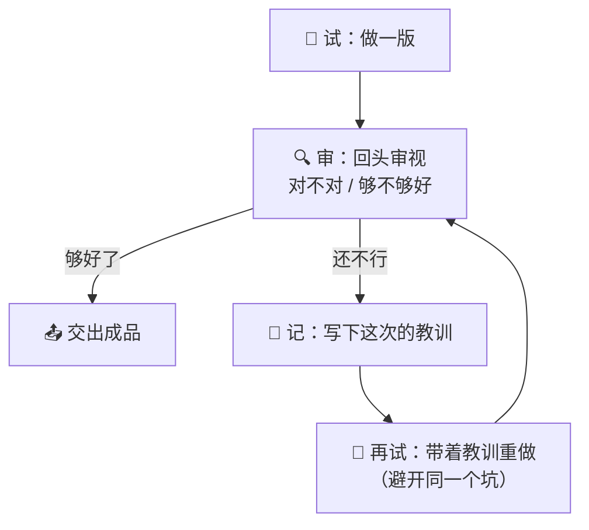
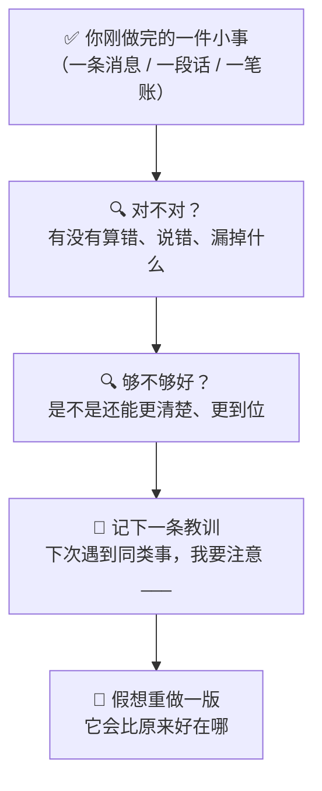
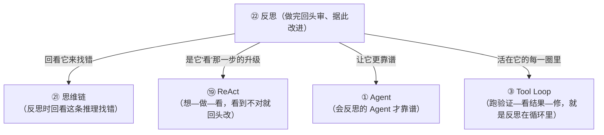

# ㉒ 什么是反思（Reflection / Reflexion）

> 建议先读 [⑲ 什么是 ReAct](./[CONCEPT-19]%20什么是ReAct-智能体推理模式.md) 和 [㉑ 什么是思维链](./[CONCEPT-21]%20什么是思维链-ChainOfThought.md)。那两篇讲了"AI 会想—做—看地干活""它会把推理一步步显式写出来"。这一篇要回答一个更进一步的问题：**AI 干完一次活、给出一个答案之后，它能不能像个下完棋的棋手那样，回过头去看看自己刚才那一手到底走得好不好、错在哪、下次该怎么改——然后据此再来一次，越做越好？** 这门"回头审视自己、并据此改进"的功夫，就是本篇的主角——**反思（Reflection / Reflexion）**。

---

## 一、一句话定义

**反思 = AI 做完一次尝试后，回过头审视自己的输出、找出哪里错了或不够好、把教训总结下来，然后据此再做一次、越做越好的一整套"自我批评 + 据此改进"的闭环。**

如果你只想记住一句话，就记这句：

> **普通的一次性回答，像考试交卷就走人；反思，像交卷后再回头逐题检查、把错的订正过来——多的正是那一道"回照自省"的功夫。**

这一句话是整篇文档的骨架。后面所有的比喻、图、误区，都是在反复讲透这一句话。

```callout ask|小白发问
你可能会问："AI 不是一次就把答案给我了吗？为啥还要它自己回头看？"——好问题！因为**第一次的答案，未必是最好的答案**。人也一样：你写完一篇作文，趁热交上去，和"写完先放一放、回头再读一遍、把别扭的句子改顺"，出来的质量天差地别。反思就是给 AI 加上这道"回头再看一眼"的功夫——它先给一版答案，再+[自己当自己的批改老师](像老师用红笔在你作文上圈出问题那样，AI 回头挑自己刚写的东西的毛病)，找出毛病，然后据此重写一版。多这一道，答案往往就从"能用"变成"好用"。这一篇不用懂代码，抓住"棋手下完复盘"这一个画面就行～ 🐣
```

一句话摆清它和前几篇的关系：**[⑲ ReAct](./[CONCEPT-19]%20什么是ReAct-智能体推理模式.md) 是"想—做—看"地把一件事干完；反思，是在这之上再加一圈——"干完之后回头看这一整轮干得好不好，不好就带着教训重来"。**

---

## 二、为什么需要反思？——一次做对太难了

AI 给一版答案已经不错了，那为什么还要它自己回头改？因为"一次就做到最好"这件事，本来就太难：

### 原因一：第一版常常有看不见的毛病

无论人还是 AI，一口气写出来的东西，往往带着自己当时没察觉的错——算错一步、漏看一个条件、逻辑有个小窟窿。**趁热交上去，这些毛病就留在了最终答案里；回头再审一遍，很多就能当场揪出来。**

### 原因二：不知道错在哪，就会在同一个坑里反复摔

光"再试一次"是不够的——如果不先想清楚"上次到底为什么没做好"，再试很可能还是老样子，甚至一模一样地错第二遍。**反思的价值，正在于它逼着 AI 先把"败因"想明白、写下来，再带着这条教训去重来。**

### 原因三：把教训沉淀下来，才能真正变强

一次订正只救一道题；但如果把"我这类题总栽在哪"记进错题本，下次遇到同类题就能主动绕开。**反思不只是"改这一次的答案"，更是"攒下一条条能复用的教训"——这才是越做越好的根子。**



**所以反思的价值就一句话：把"一次交卷、错了也不知道"，升级成"交卷后自查、揪出毛病、记下教训、据此重来"——用一道回头功夫，把答案越磨越好。** 这就是为什么越是难的任务，越需要反思。

---

## 三、核心比喻：下完棋的复盘，考完试的订正

"反思"这个词听着抽象，用两个你熟悉的画面就能焊死它。

### 比喻一：棋手复盘

一位高手下完一盘棋，**从不下完就走**。他会把整盘棋重新摆一遍，一步一步回看：这一手是妙棋还是臭棋？哪一步开始局势就崩了？换个走法会不会更好？**这个"下完回头逐步审视好坏"的过程，就叫复盘。** 高手之所以是高手，不在于每盘都赢，而在于**每盘都复盘、把教训吃进肚里**，下一盘就少犯一个错。

### 比喻二：学生的错题本 / 医生的病例反思

学生考完试，好学生会做两件事：把错题一道道**订正**过来，还把它抄进**错题本**、写清"我为什么错、下次怎么防"。医生也一样——一个疑难病例过后，会写"病例反思"，复盘诊断哪里可以更快更准。**订正，是改好这一次；错题本 / 病例本，是攒下能复用的教训，让下一次别再栽同一个坑。**



两个比喻的**共同内核**：**做完一件事，不是就此了结，而是"回头审视 → 找出得失 → 记下教训 → 据此改进下一次"。** 记住这一点，反思是什么就再也不会忘。

---

## 四、反思到底在"审"什么？——自我批评三问

AI 回头审自己的时候，不是随便瞄一眼，而是像个严格的批改老师，问自己三个问题：

| 三问 | 大白话 | 像什么 |
|------|--------|--------|
| **对不对？** | 结果错没错？有没有算错、漏看条件、逻辑有窟窿？ | 老师先看答案对错 |
| **哪里不够好？** | 就算没错，是不是还啰嗦、不清楚、没抓住重点？ | 老师再看写得好不好 |
| **下次怎么改？** | 具体该怎么动，才能把上面的毛病修掉？ | 老师写下批语和改进建议 |

**这三问，正是"自我批评"的真身**——不是空喊一句"我要做得更好"，而是**具体指出错在哪、不够好在哪、下一步具体怎么改**。空泛的自我表扬或自我否定都没用；反思要的是**能落地的、具体的批评**。

```callout star|一句话点睛
反思最容易被误解的一点：它**不是让 AI 自我怀疑、自我否定**，而是让它做**具体、可落地的自我批评**。"我这答案不太好"是没用的空话；"我第 2 步把单位算错了，应该按千克而不是克重算一遍"才是真正的反思。**反思的含金量，全在那句批评有多具体、多能指导下一步。** 越具体，重做那一版就越可能真的更好。
```

---

## 五、反思 + 重试：一个"越做越好"的闭环

反思很少单独出现，它几乎总是和"再试一次（retry）"手拉手，组成一个闭环——**试 → 审 → 记 → 再试**，一圈一圈把答案磨好：

1. **试**：先动手做一版（给一个答案 / 跑一次）。
2. **审（反思）**：回头审视这一版——对不对？哪里不够好？
3. **记**：把找到的毛病和教训写下来（哪怕只是记在这一轮的"草稿"里）。
4. **再试**：带着这条教训，重做一版——**这一版专门避开上一版栽过的坑**。
5. 若还不够好，就再转一圈；够好了，就交出。



**这个闭环最要紧的一点：每转一圈，都不是"从头瞎试一遍"，而是"带着上一圈攒下的教训"重来。** 这就是它和"无脑重试"的根本区别——无脑重试是同一个坑摔十次，反思式重试是**每摔一次都长一次记性、下一次就绕开那个坑**。所以它是"越做越好"，而不是"原地打转"。

```flip
既然反思这么好，那是不是让 AI 无限反思下去、转的圈越多就一定越好？（点一下翻到背面）
---
不是！反思也是有"成本"的：每转一圈都要多花时间、多花算力。而且转到后面，收益会越来越小——第一圈可能从"错的"改到"对的"，第二圈从"对的"改到"更清楚的"，到第五圈可能只是在无关紧要的措辞上来回蹭，甚至越改越糟（"想太多反而把对的改错了"）。所以聪明的反思都有个"够好就停"的判断：**要么改到满足验证标准就收手，要么最多转几圈就打住。** 反思的智慧不在"转得多"，而在"转得值"——**能改好就转，改不动了就停**，而不是无脑地越多越好。
```

---

## 六、感觉一下：一次反思的"自省全景"

**⚠️ 郑重提醒：下面这段你完全不用会写。** 放它在这，只是让你**亲眼看一眼**——一个 AI 在解一道数学应用题时，是怎么"做完一版 → 回头自省 → 带着教训重做"的。请只体会那个**试 → 审 → 记 → 再试**的节奏：

```text
🙋 你的题目：一根绳子剪掉 3 米后，剩下的是原来的一半，原来多长？

🤖（第一版 · 试）：剪掉 3 米剩一半，那 3 米就是一半，原来 = 3 米。

🔍（回头审 · 反思）：等一下，我验算一下——若原来 3 米，剪掉 3 米就剩 0 米，
                    可 0 不是 3 的一半。对不上！我错在哪？
                    我把"剪掉的 3 米"当成了"剩下的一半"，其实剪掉 3 米后
                    "剩下的"才是一半，那"剪掉的 3 米"应该等于"另一半"。

📒（记下教训）：教训——别急着套结论，先把"谁是一半"对应清楚，再动笔。

🤖（第二版 · 带教训再试）：剪掉的 3 米 = 另一半 → 一半 = 3 米 → 原来 = 6 米。
                          验算：6 米剪掉 3 米剩 3 米，正好是 6 的一半。✅ 对上了！

✅ 最终答案：原来 6 米。（第一版错了，靠回头自省揪出来、改对了）
```

看到那个"先给一版 → 回头验算发现错了 → 想清楚错在哪 → 带着教训重做一版 → 这版验算通过"了吗？**这就是反思的真身。** 如果没有中间那道"回头自省"，AI 就会把第一版那个错的"3 米"直接交给你。

**整个过程里，真正救了场的，是那句"等一下，我验算一下……对不上！我错在哪？"**——正是这一问，把一个错答案变成了对答案。这就是为什么带反思的 AI，比"一次交卷就走"的 AI 靠谱得多。

把这场"试 → 审 → 记 → 再试"演成一幕小短剧——重点看它没有把第一版的错答案直接交出去，而是回头把自己揪了出来：

```scene 回头自省：第一版错了，靠反思把它揪回来
🧑 你 | 一根绳子剪掉 3 米后，剩下的是原来的一半，原来多长？
🤖 AI（第一版·试） | 剪掉 3 米剩一半，那 3 米就是一半，原来 = 3 米。
😐 旁白 | 要是"一次交卷就走"，这个错答案就直接甩给你了。可它没急着交——
🔍 AI（回头审·反思） | 等一下，我验算一下：若原来 3 米，剪掉 3 米就剩 0 米，可 0 不是 3 的一半。对不上！我错在哪？
🔍 AI（想清楚） | 我把"剪掉的 3 米"当成了"剩下的一半"——其实剪掉后"剩下的"才是一半，那"剪掉的 3 米"应等于"另一半"。
📒 AI（记下教训） | +[教训](反思的价值就在这一步——把"这次栽在哪"沉淀成下一次的提醒，才能越做越好，而不是同一个坑摔两回)：别急着套结论，先把"谁是一半"对应清楚再动笔。
🤖 AI（第二版·带教训再试） | 剪掉的 3 米 = 另一半 → 一半 = 3 米 → 原来 = 6 米。验算：6 剪 3 剩 3，正好是一半。✅ 对上了！
🎉 最终答案 | 原来 6 米。（第一版错了，靠回头自省揪出来、改对了）
> 没有中间那道"回头验算"，错答案就交出去了——这道自省，就是反思的真身。
```

---

## 七、常见误区（新手最容易踩的坑）

这一节请务必逐条读完。这些误解会让你对"反思"的理解跑偏。

### 误区 1：以为"反思"就是"再试一次"

- ❌ **错误理解**：反思不就是答错了再来一遍嘛，重试就是反思。
- ✅ **正确理解**：**光重试不是反思。** 反思的核心是那道"先想清楚上次为什么没做好"的功夫。不复盘就重试，是同一个坑摔十次；先反思出败因、再带着教训重试，才是越做越好。**重试是"手"，反思是"脑"——没有脑指挥的手，只是瞎忙。**

### 误区 2：以为反思就是 AI"自我怀疑、自我否定"

- ❌ **错误理解**：让 AI 反思，就是让它总觉得自己不行、不停否定自己。
- ✅ **正确理解**：**反思是具体的自我批评，不是空泛的自我否定。** "我不太行"是没用的情绪；"我第 2 步单位算错了，该按千克重算"才是反思。**它要的是能指导下一步的、具体的批评**，而不是打击自己。批评越具体，下一版就越可能真的更好。

### 误区 3：以为反思转的圈越多、越久就一定越好

- ❌ **错误理解**：让 AI 一直反思下去，反复打磨，肯定越磨越好。
- ✅ **正确理解**：**反思有成本、有边际递减。** 头一两圈收益大，越往后越小，转过头还可能"想太多把对的改错"。聪明的反思有"够好就停"的判断——**改到满足标准、或最多转几圈就收手**。反思的智慧在"转得值"，不在"转得多"。

### 误区 4：把"反思"和"[思维链](./[CONCEPT-21]%20什么是思维链-ChainOfThought.md)"搞混

- ❌ **错误理解**：反思和思维链是一回事吧？都是 AI 在那儿"想"。
- ✅ **正确理解**：**时机不同。** [思维链](./[CONCEPT-21]%20什么是思维链-ChainOfThought.md) 是**做题当中**把推理一步步显式写出来（边想边做）；反思是**做完一版之后**回头审视这一版的好坏（做完再看）。一个是"过程中的思考纪律"，一个是"完工后的复盘功夫"。反思时，AI 常常正是去回看自己那条思维链，才找得到错在哪一步。

### 误区 5：以为反思是"很高级、跟我没关系"的东西

- ❌ **错误理解**：反思听着好高深，那是研究员才关心的，跟我学 Khy-OS 没关系。
- ✅ **正确理解**：**它离你很近。** 你在 Khy-OS 里让 AI 干活时，它"跑一遍验证 → 红灯了就在这一轮里查错、修好、再验"——这一整套，正是反思闭环在你眼皮底下发生。理解它，你才看得懂"为什么它不会把一个没验过、可能是错的结果硬说成'修好了'"。**它不是空中楼阁，是你手边工具的真实纪律。**

```quiz
Q: 下面关于"反思（Reflection）"的说法，哪些是对的？（多选）
- [x] 反思是"做完一次后回头审视自己的输出、找出得失、记下教训、据此改进"的闭环
> 对。像棋手复盘、学生订正错题——核心是"回头审 → 记教训 → 带着教训再做一次"。
- [x] 反思常和"再试一次（retry）"结合，但关键是重试前先想清楚"上次为什么没做好"
> 对。光重试是同一个坑摔十次；先反思出败因再带教训重试，才是越做越好。反思是脑，重试是手。
- [ ] 反思就是让 AI 不停自我怀疑、自我否定
> 错。反思是具体、可落地的自我批评（"第 2 步单位算错了，该按千克重算"），不是空泛的情绪否定。
- [ ] 反思转的圈越多、越久，结果就一定越好
> 错。反思有成本、有边际递减，转过头可能把对的改错。聪明的反思"够好就停"，智慧在转得值而非转得多。
- [x] 反思和思维链时机不同：思维链是做题当中边想边做，反思是做完一版后回头复盘
> 对。一个是过程中的思考纪律，一个是完工后的复盘功夫；反思时常去回看自己那条思维链找错。
```

---

## 八、动手小实验 / 思想实验

理论看再多，不如在脑子里走一遍。下面的思想实验不用写代码，只用想。

### 实验：你当一次"自己的批改老师"

找一件你今天刚做完的小事——比如你刚发出去的一条微信、刚写完的一段话、刚算完的一笔账。现在，别急着翻篇，试着当一回"自己的批改老师"，走一遍反思闭环：



走完这一遍，请你回答自己三个问题：

1. 你有没有揪出一个"当时没察觉、现在回头才看见"的小毛病？——多半有。**这就是"回头审一遍"的价值**：很多错，只有做完、跳出来再看，才看得见。
2. 你记下的那条教训，是"我下次要更认真"这种空话，还是"我下次算账先把单位标清楚"这种具体的？——**越具体越有用**。空话下次帮不了你，具体的才能真的让你绕开那个坑。
3. 如果你把这条教训记进一个"错题本"，下次遇到同类事会怎样？——**你会主动绕开这个坑**。这就是反思从"改这一次"升级成"越来越好"的关键。

**关键体会**：你刚刚亲手当了一回"反思者"。你会发现，反思一点都不神秘——**它就是你做完事天然会用的"回头看一眼、记个教训、下次改进"的智慧**。把这份人人都懂的智慧交给 AI，让它每做完一版都回照自省、带着教训重来，就是"反思（Reflection）"。

---

## 九、和其它概念的关系

反思不是孤立的，它和前面几篇讲过的概念，织成了一张"越做越好"的网。



| 概念 | 一句话关系 | 类比 |
|------|-----------|------|
| [㉑ 思维链](./[CONCEPT-21]%20什么是思维链-ChainOfThought.md) | 反思时，AI 常**回看自己那条思维链**，才找得到错在哪一步 | 复盘时回看棋谱每一手 |
| [⑲ ReAct](./[CONCEPT-19]%20什么是ReAct-智能体推理模式.md) | 反思是 ReAct 里"**看**"那一步的加强版——不只看结果，更回审整轮做得好不好 | 从"瞄一眼"升级成"仔细复盘" |
| [① Agent](./[CONCEPT-01]%20什么是Agent-智能体.md) | 一个**会反思**的 [Agent](./[CONCEPT-01]%20什么是Agent-智能体.md)，比只会一次交卷的靠谱得多 | 会复盘的棋手总比不复盘的强 |
| [③ Tool Loop](./[CONCEPT-03]%20什么是ToolLoop-工具循环.md) | "跑验证→看结果→红灯就修→再验"的循环，本质就是**反思活在工具循环里** | 每转一圈都长一次记性 |
| [⑳ 智能体编排](./[CONCEPT-20]%20什么是智能体编排-Orchestration.md) | 可以专门派一个子智能体**当"审稿员"**，回头挑另一个的毛病——反思的分工版 | 作者 + 独立审稿人互相制衡 |

一句话串起来：**反思是站在"做完之后"的一道复盘功夫——它回看自己的思维链去找错，把 ReAct 里"看"那一步升级成"审整轮"，让每个 Agent 更靠谱，活在工具循环的每一圈里，甚至能拆成"作者 + 审稿员"两个子智能体来分工。它是把"一次交卷"磨成"越做越好"的那道关键功夫。**

---

## 十、和 Khy-OS 的关系

这一节和你手上的项目关系很紧：

**Khy-OS 的整套干活纪律，骨子里就是一个反思闭环。**

你在 Khy-OS 里交给它一个目标，它不会"给一版就拍胸脯说搞定了"。作为一个成熟的运行骨架，它遵循这样的纪律：

- **跑验证、看红绿灯**：做完一版，先跑验证（语法检查、测试、各种守卫）——这就是"回头审自己对不对"。
- **红灯了就在本轮内修**：验证没过（亮红灯），它不会甩手不管，而是**在这一轮里**查出错在哪、修好、再跑一遍验证——这正是"审出毛病 → 据此改进 → 再试"的反思闭环。
- **验证不过，绝不说"修好了"**：这是 Khy-OS 最硬的一条纪律——**没跑过验证、或验证还红着，就不许回报"完成"**。这，正是反思精神的底线：不自欺，实测为准。
- **把教训写进记忆**：干完一个任务，它会把"这次踩了什么坑、下次怎么防"沉淀进记忆文件——这就是 AI 版的"错题本"，让下一次遇到同类活能主动绕开老坑。

这正是本文讲的反思。它让 Khy-OS 不是"交一版就完事"，而是"做完自审、红灯自修、教训沉淀"——**一圈圈把结果磨到真正靠得住。**

> 💡 换个角度说：**学会"反思"这个概念，你就摸到了 AI"为什么可信"的根子。** 一个肯回头审自己、验不过就自己修、还把教训记下来的 AI，和一个"张口就来、错了也不知道"的 AI，天差地别。你从入行第一站就理解它，日后无论是用 AI 办事，还是判断一个 AI 靠不靠谱，都有了一把尺子：**它会不会回照自省、闻过则改。**

> ⚠️ 诚实说一句边界：反思具体怎么实现（怎么触发、审几轮、什么时候停、教训怎么存），属于设计与实现层面，各家做法不同、也在快速演进。Khy-OS 的具体机制你可以在 [`docs/03_DESIGN_设计`](../03_DESIGN_设计) 与项目章程里深入了解。本文只讲"反思是什么、为什么需要它"这一层概念地图。

---

## 十一、小结 + 下一步

- **反思 = AI 做完一次尝试后，回头审视自己的输出、找出得失、记下教训、据此再做一次**的"自我批评 + 据此改进"闭环。
- **为什么需要它**：一次做对太难——第一版常有看不见的毛病、不复盘就会同一个坑反复摔、把教训沉淀下来才能真正变强。
- **核心比喻**：**棋手复盘**、**学生订正错题本 / 医生写病例反思**——做完不了结，而是"回头审 → 记教训 → 据此改进下一次"。
- **审什么**：自我批评三问——对不对？哪里不够好？下次怎么改？关键是**具体、可落地**，不是空喊或自我否定。
- **反思 + 重试**：试 → 审 → 记 → 再试的闭环，每圈都带着上一圈的教训重来（而非无脑重试）；够好就停，不是转得越多越好。
- **五大误区**：反思≠单纯重试、≠自我否定、≠转得越久越好、≠[思维链](./[CONCEPT-21]%20什么是思维链-ChainOfThought.md)（时机不同）、它离你很近不高深。
- **和 Khy-OS 的关系**：跑验证→红灯本轮内修、验不过不许说"修好了"、教训写进记忆——整套纪律就是一个反思闭环。

🎉 **恭喜，你摸到了 AI"为什么可信"的根子！** 从"给一版就走"，到"做完自审、闻过则改、越做越好"——你现在明白了：一个靠谱的 AI，多的正是这道"回照自省"的功夫。

👈 回 [概念入门总览](./00_INDEX_概念入门-总览.md) 看看还有哪些能温故知新。
👈 上一篇 [㉑ 什么是思维链](./[CONCEPT-21]%20什么是思维链-ChainOfThought.md)——回顾"把推理一步步显式写出来"的思考纪律。
👉 下一篇 [㉓ 什么是计划与执行](./[CONCEPT-23]%20什么是计划与执行-PlanAndExecute.md)——面对大任务，AI 怎么先出蓝图再分步落地。
