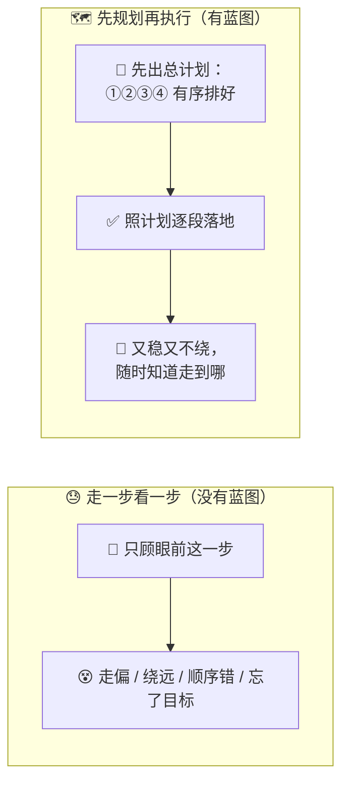
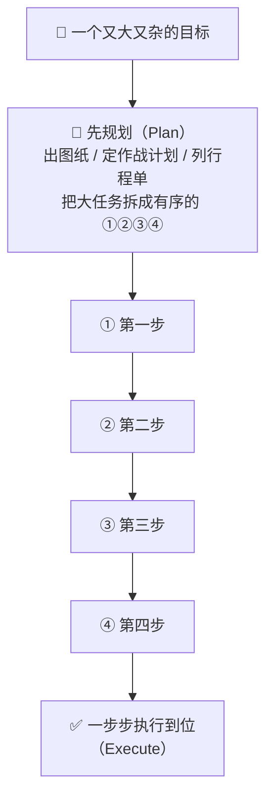
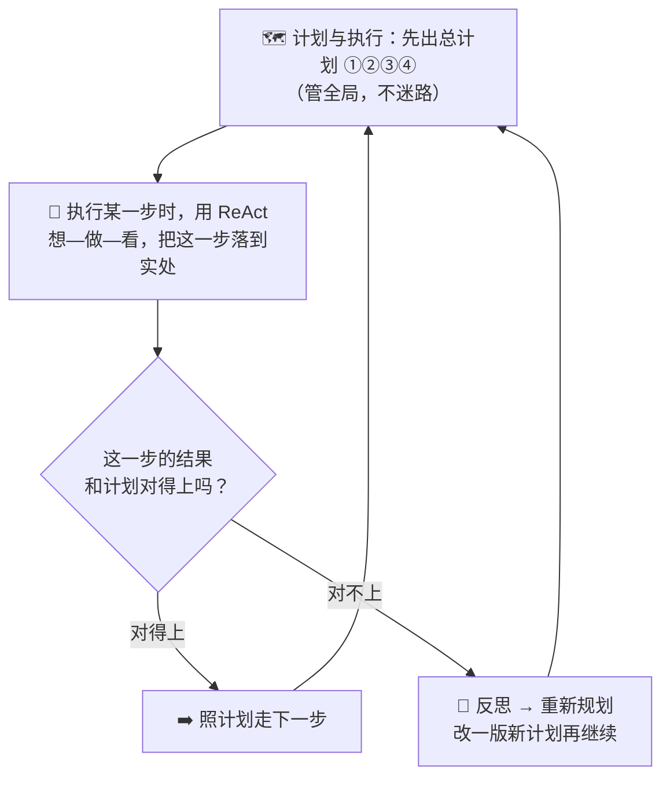
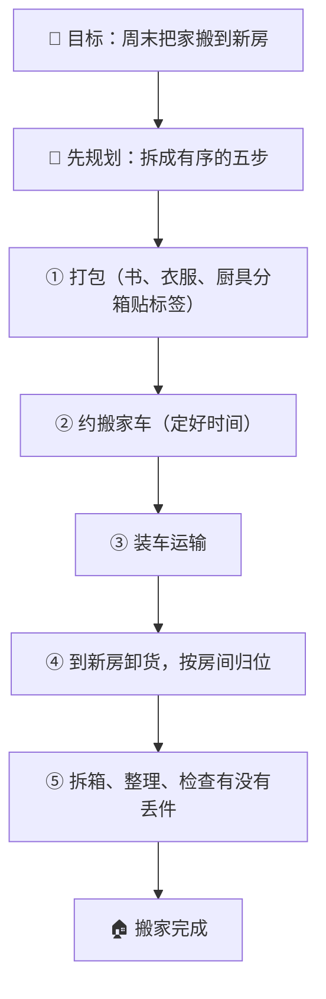
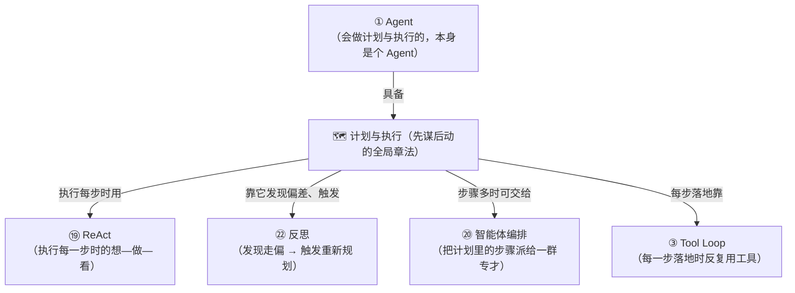

# ㉓ 什么是计划与执行（Plan-and-Execute）

> 建议先读 [⑲ 什么是 ReAct](./[CONCEPT-19]%20什么是ReAct-智能体推理模式.md) 和 [⑳ 什么是智能体编排](./[CONCEPT-20]%20什么是智能体编排-Orchestration.md)。那两篇讲了"AI 走一步看一步的想—做—看纪律"和"一个总指挥把大任务拆开、派给一群专才"。这一篇要回答一个更"先动脑后动手"的问题：**面对一个又大又杂、几十步才做得完的活，AI 是应该埋头一步步摸着石头过河，还是应该先坐下来、把整件事从头到尾捋出一份"总计划"，再照着计划一段段落地？** 这门"先谋后动、先出图纸再动工"的本事，就是本篇的主角——**计划与执行（Plan-and-Execute）**。

---

## 一、一句话定义

**计划与执行 = 面对一个大任务，AI 先不急着动手，而是先制定一份"总计划"——把大任务拆成一串有序的小步骤；然后再照着这份计划，一步步执行；执行途中若发现走偏了，还能停下来"重新规划"、改一版新计划再继续。**

如果你只想记住一句话，就记这句：

> **走一步看一步，像摸黑赶路；计划与执行，像出门前先摊开地图、把整条路线画好，再照着路线一段段走——心里始终有一张"全程蓝图"，而不是走到哪算哪。**

这一句话是整篇文档的骨架。后面所有的比喻、图、误区，都是在反复讲透这一句话：**先有蓝图，再落地。**

```callout ask|小白发问
你可能会问："AI 不是已经会 [想—做—看](./[CONCEPT-19]%20什么是ReAct-智能体推理模式.md)、一步步把活干完了吗？为啥还要先列个计划？"——好问题！因为"走一步看一步"有个软肋：**它脑子里没有全局蓝图，容易只顾眼前、走着走着就+[跑偏或绕远](就像你去一个没去过的城市，不看地图、只顾"眼前这条路看着能走"，很可能兜大圈子，甚至走进死胡同再折返)。** 活儿越大、步骤越多，这种"只顾眼前"的毛病就越致命。先把整件事拆成一份有序的"总计划"，就等于**出发前先在脑子里把全程走了一遍**——哪一步先、哪一步后、一共几步，心里有数，落地时就又稳又不绕。这一篇不用懂代码，抓住"盖房先出图纸再动工"就行～ 🐣
```

一句话摆清它和前几篇的关系：**[⑲ ReAct](./[CONCEPT-19]%20什么是ReAct-智能体推理模式.md) 是"走一步、看一步、再想下一步"的贴地纪律；计划与执行，是在动手之前先"抬头看全程、画好整张蓝图"——一个管"全局怎么排"，一个管"每一步怎么走"，两者最好合起来用。**

---

## 二、为什么需要它？——"走一步看一步"扛不住的三种活

一个会 ReAct 的 AI 已经很能干了，那为什么还要先"列计划"？因为有三种活，纯靠"走一步看一步"干起来又乱又险：

### 场景一：步骤太多，走着走着就忘了要去哪

一个大任务可能要几十步才做得完。纯靠"走一步看一步"，AI 很容易**只盯着眼前这一步**，做到第二十步时早忘了整件事的目标是什么、还剩哪些没做。**先列一份总计划，就等于给自己钉了一张"全程清单"**——每做完一步，抬头看一眼清单，就知道走到哪了、下一步是什么、离终点还有多远。

### 场景二：步骤之间有先后，顺序错了就得推倒重来

有些步骤必须**先做 A 才能做 B**（先打好地基才能砌墙）。纯靠"走一步看一步"，AI 可能一时兴起先砌了墙，回头才发现地基没打——只能推倒重来。**先规划，就是在动手前先把"谁先谁后"排清楚**，避免做到一半发现顺序全错。

### 场景三：活儿太大，没个整体章法就容易顾此失彼

大任务往往牵一发动全身。没有全局蓝图，AI 干着干着就容易顾了这头忘了那头。**一份总计划，逼着 AI 在动手前先把整件事"想通一遍"**——哪些环节、各自要产出什么、怎么串起来，全局在胸，落地才不慌。



**所以计划与执行的价值就一句话：把"走一步看一步、容易迷路"的大活，换成"先画好全程蓝图、再照图落地"——又稳、又有序、还随时知道自己走到哪一步。**

---

## 三、核心比喻：三张"先谋后动"的画面

"计划与执行"听着抽象，用三个你熟悉的画面就能焊死它。

### 比喻一：盖房子——先出施工图纸，再动工

盖一栋楼，没有哪个靠谱的工头会**抄起砖头就往上垒**。他一定是先请设计师出一份**施工图纸**：先打地基、再立框架、再砌墙、再装水电、最后装修——**一步不能乱、顺序全画死在图上**。图纸就是"总计划"；照着图纸一层层盖，就是"执行"。**先有图，再动工。**

### 比喻二：将军打仗——先定完整作战计划，再分段推进

一位将军不会带着大军**莽头就冲**。他会先摊开地图，定一份**完整的作战计划**：先取哪座关隘、再断哪条粮道、最后合围哪座城——**整场仗分成几段、每段的目标是什么，谋定于动手之前**。定好计划，才分段推进；哪一段遇到意外，再回来改计划。

### 比喻三：出远门——先列一张行程单，再照单出发

你要去一个陌生城市玩三天。聪明的做法不是"到了再说"，而是先列一张**行程单**：第一天去哪、第二天去哪、几点的车、住哪家店——**把整趟行程先在纸上走一遍**。有了行程单，你到了当地就照单执行，不慌不乱；临时哪个景点关门，再改改行程单接着玩。



三个比喻的**共同内核**：**动手之前，先把整件事从头到尾拆成一份有序的计划；然后才照着计划，一段一段落地。** 图纸、作战计划、行程单，说的都是同一件事——**先谋后动，先蓝图后落地。** 记住这一点，计划与执行是什么就再也不会忘。

---

## 四、拆开看：计划、执行、重新规划——三个动作

"计划与执行"其实藏着三个动作，一看就懂：

| 动作 | 大白话 | 像什么 |
|------|--------|--------|
| **规划（Plan）** | 动手前，把大任务拆成一串有序的小步骤 | 出发前画好整条路线图 |
| **执行（Execute）** | 照着计划，一步一步落地干 | 照着路线图一段段走 |
| **重新规划（Re-plan）** | 执行中发现走偏 / 计划不管用了，就改一版新计划再继续 | 路被封了，重新规划一条新路线 |

前两个动作好懂——**先想清楚要走的整条路，再照着走。** 真正让"计划与执行"变得可靠、而不是死板的，是第三个动作：**重新规划。**

一份计划是"动手前"拍的脑袋，它不可能百分百料中现实。执行到一半，很可能发现：**第三步的前提根本不成立、或者冒出了一个计划里没想到的新情况。** 这时候，一个聪明的做法**不是硬着头皮照旧计划撞南墙**，而是——**停下来，根据眼前的新情况，改一版新计划，再接着执行。**

```callout star|一句话点睛
计划与执行最容易被误解的一点：**它不是"计划一旦定死，就必须一条道走到黑"。** 恰恰相反——**好的计划与执行，是"带着一份计划出发，但允许中途改计划"。** 计划给你全局的方向感（不至于走一步看一步地迷路），重新规划给你随机应变的灵活性（不至于死板地撞南墙）。**方向感 + 灵活性，缺一不可。** 只会定计划不会改，是死板；只会临场发挥不会规划，是莽撞。
```

---

## 五、和 ReAct 的区别与结合——蓝图派 vs 摸路派

新手最容易把"计划与执行"和 [⑲ ReAct](./[CONCEPT-19]%20什么是ReAct-智能体推理模式.md) 搞混，因为它俩都是"AI 怎么一步步把活干完"。但它们的**出发姿势完全相反**：

```flip
🤔 猜猜看：先列完整计划再执行，和走一步看一步，各自强在哪？
---
✅ Plan-and-Execute（先谋后动）：全局规划，步骤有序、不迷路、省 token，适合步骤多有先后的大活；ReAct（走一步看一步）：更灵活、随时应变、抗意外，适合"边走边看才知道下一步"的活。前者稳，后者活。
```

| | **ReAct（走一步看一步）** | **计划与执行（先谋后动）** |
|---|---|---|
| 有没有全局蓝图 | **没有**。做完一步，才想下一步 | **有**。动手前先把全程拆成一份计划 |
| 像什么 | 摸黑赶路，走到哪看到哪 | 出发前先摊开地图画好路线 |
| 长处 | 灵活，随时应变，适合"边走边看才知道下一步"的活 | 有序、不迷路，适合"步骤多、有先后"的大活 |
| 短处 | 步骤一多容易只顾眼前、绕远、忘了目标 | 一开始的计划可能不完全对（所以要留"重新规划"） |

但真正的高手，**从来不是二选一，而是把两者合起来用**：

**先用"计划与执行"定下全局蓝图（大方向不迷路），再在执行每一小步时用"ReAct"贴地想—做—看（每一步都落到实处），一旦某步的现实和计划对不上，就用[反思](./[CONCEPT-22]%20什么是反思-Reflection.md)看清问题、触发"重新规划"改一版计划。**



**一句话记住它俩的关系：计划与执行管"全局怎么排"（抬头看路），ReAct 管"每一步怎么走"（低头走路）——抬头看路才不迷路，低头走路才走得实，两者合一，才是既有章法又能应变的高手。**

---

## 六、感觉一下：一次"先规划再执行"的全过程

**⚠️ 郑重提醒：下面这段你完全不用会写。** 放它在这，只是让你**亲眼看一眼**——一个 AI 接到"帮我把一篇乱糟糟的旧文档整理成一份规范报告"这种大活时，是怎么"先谋后动、分段克敌"的。请只体会那个**先列计划 → 逐步执行 → 中途改计划**的节奏：

```text
🙋 你的目标：把这份乱糟糟的旧文档，整理成一份规范、好读的报告

🧠 AI（先规划，不急着动手）：这活儿有好几摊，我先列一份总计划——
   ① 通读全文，搞清楚它到底讲了几件事
   ② 把内容按主题分成几大块
   ③ 每一块重写成通顺的段落
   ④ 加上标题和目录
   ⑤ 最后统一检查一遍格式

📋 计划列好了，开始照单执行：
   ✅ ①通读全文 …… 完成：发现它其实讲了三件事
   ✅ ②按主题分块 …… 完成：分成了"背景 / 现状 / 建议"三块
   ⚠️ ③重写段落 …… 干到一半发现：原文"现状"那块引用的数据自相矛盾！
                     照原计划直接重写，等于把错的数据也抄进去了。

🔄 AI（触发重新规划）：计划里没料到会有"数据打架"。停一下，改计划——
   在"③重写"前，插一步「③.5 核对并标注可疑数据」，再接着往下走。

📋 照新计划继续：
   ✅ ③.5 核对数据 …… 完成：标出两处矛盾，交给你确认
   ✅ ③ 重写段落 …… 完成
   ✅ ④ 加标题目录 …… 完成
   ✅ ⑤ 统一检查格式 …… 完成
✅ 最终交付：一份分「背景/现状/建议」、标题目录齐全、
            可疑数据已标注的规范报告。
```

看到那个"先列出①②③④⑤ → 照单一步步做 → 中途发现意外就插一步改计划 → 再照新计划走完"了吗？**这就是计划与执行的真身。** AI 没有莽头就写，而是**先把整件事拆成有序的一串小步，照着落地，遇到计划外的情况就改计划、再继续**——始终心里有一张"全程蓝图"。

**整个过程里，那份"总计划"就像一张地图：它让 AI 无论走到第几步，都清楚自己在哪、下一步去哪、终点是什么。** 这就是为什么"先谋后动"能稳稳啃下"走一步看一步会迷路"的大活。

把这场"先列计划 → 照单执行 → 中途改计划"演成一幕小短剧——重点看它撞到意外时不是硬着头皮往下抄，而是停下来改计划：

```scene 先谋后动：计划赶不上变化，那就改计划
🧑 你 | 把这份乱糟糟的旧文档，整理成一份规范好读的报告。
🧠 规划 AI | 这活儿好几摊，我先不动手，列一份总计划——①通读全文 ②按主题分块 ③每块重写 ④加标题目录 ⑤统一查格式。
📋 旁白 | 蓝图先画好，再照单一步步落地。
🖐️ 执行 AI | ①通读全文……✅ 完成，发现它其实讲了三件事。
🖐️ 执行 AI | ②按主题分块……✅ 完成，分成「背景 / 现状 / 建议」三块。
🖐️ 执行 AI | ③重写段落……干到一半发现不对：原文「现状」那块引用的数据自相矛盾！
😱 执行 AI | 要是照原计划直接重写，等于把错的数据也一起抄进去了。
🔄 规划 AI | 计划里没料到「数据打架」。停一下——在③前面插一步 +[③.5 核对并标注可疑数据](计划与执行的灵魂不在"列了计划"，而在"遇到计划外情况敢停下来改计划"——这正是它比死板脚本强的地方)，再接着往下走。
🖐️ 执行 AI | ③.5 核对数据✅ → ③ 重写✅ → ④ 标题目录✅ → ⑤ 查格式✅。
🎉 最终交付 | 一份分「背景/现状/建议」、标题目录齐全、可疑数据已标注的规范报告。
> 始终心里有一张全程蓝图，又肯在撞到意外时改图——这就是"先谋后动"能啃下大活的真身。
```

---

## 七、常见误区（新手最容易踩的坑）

这一节请务必逐条读完。这些误解会让你对"计划与执行"的理解跑偏。

### 误区 1：以为"计划一旦定了，就必须一条道走到黑"

- ❌ **错误理解**：计划与执行嘛，就是先定死一份计划，然后不管发生什么都照着做完。
- ✅ **正确理解**：**恰恰相反，好的计划与执行一定留着"重新规划"这一手。** 计划是动手前拍的脑袋，不可能百分百料中现实。执行中一旦发现走偏、或冒出计划外的情况，就该停下来改一版新计划再继续。**方向感（有计划）+ 灵活性（能改计划），缺一不可。** 死守旧计划撞南墙，恰恰是不会用它。

### 误区 2：把"计划与执行"和"[⑲ ReAct](./[CONCEPT-19]%20什么是ReAct-智能体推理模式.md) 走一步看一步"搞混

- ❌ **错误理解**：这俩不都是"AI 一步步干活"吗？没啥区别吧。
- ✅ **正确理解**：**出发姿势相反。** ReAct 是**没有全局蓝图**、做完一步才想下一步（摸黑赶路）；计划与执行是**动手前先把全程拆成一份计划**（先画好路线图）。前者胜在灵活应变，后者胜在有序不迷路。而且它俩**最好合起来用**：先规划定全局，执行每一步时用 ReAct 贴地想—做—看。

### 误区 3：以为"计划拆得越细、步骤越多，就一定越好"

- ❌ **错误理解**：那我把计划拆成一百步、事无巨细，是不是最稳？
- ✅ **正确理解**：**不是。** 计划拆得过细，一来 AI 在"列计划"上就耗掉大量精力，二来现实稍有变化，冗长的计划就大面积作废、得反复重排，反而更累更乱。**好的计划是"拆到刚好能指导下一段行动"的粗细**——大方向清楚、关键先后排对即可，细节留给执行时的 ReAct 去临场处理。

### 误区 4：以为"重新规划 = 之前的计划全白费了"

- ❌ **错误理解**：中途要改计划，那不等于前面的规划全做了无用功？
- ✅ **正确理解**：**不等于。** 重新规划通常只是**在原计划上打补丁**——插一步、调个顺序、换一段做法，而不是把整份计划推倒重来。而且正因为"先有过一份计划"，AI 才能一眼看出"现实和计划哪里对不上"、精准地改哪一处。**没有原计划做参照，你连"哪里偏了"都发现不了。**

### 误区 5：以为"计划与执行是很高级、跟我没关系"的东西

- ❌ **错误理解**：什么规划、重规划，听着好专业，那是搞算法的事，跟我学 Khy-OS 没关系。
- ✅ **正确理解**：**它离你近得很。** 你在 Khy-OS 里交给 AI 一个多步骤的大活时，它常常就是"先列一份 plan、每步带一个 verify、一步步验着往下走"——这正是计划与执行在你眼皮底下发生。理解它，你才看得懂"为什么它面对大任务不慌，能一步步稳稳做到位"。**它不是空中楼阁，是你手边工具每天在用的真本事。**

```quiz
Q: 下面关于"计划与执行（Plan-and-Execute）"的说法，哪些是对的？（多选）
- [x] 它是"动手前先把大任务拆成一串有序的小步骤，再照着一步步执行"
> 对。像盖房先出施工图纸、将军先定作战计划、出门先列行程单——先有蓝图，再落地。
- [x] 执行中若发现走偏或冒出计划外的情况，可以"重新规划"、改一版新计划再继续
> 对。计划是动手前拍的脑袋，留着"重新规划"这一手，才既有方向感又能随机应变。
- [ ] 计划一旦定了，不管发生什么都必须一条道走到黑
> 错。死守旧计划撞南墙恰恰是不会用它。好的计划与执行一定允许中途改计划。
- [ ] 它和 ReAct（走一步看一步）是完全一样的东西
> 错。ReAct 没有全局蓝图、走一步看一步；计划与执行动手前先出全程蓝图。两者出发姿势相反，最好合起来用。
- [x] 它常和 ReAct 结合：先规划定全局，执行每一步时用 ReAct 想—做—看
> 对。计划与执行管"全局怎么排"，ReAct 管"每一步怎么走"，抬头看路+低头走路，合一才是高手。
```

---

## 八、动手小实验 / 思想实验

理论看再多，不如在脑子里走一遍。下面的思想实验不用写代码，只用想。

### 实验：你当一次"总规划师"，办一场搬家

任务："这个周末，把一整个家从旧房搬到新房。" 这活儿又大又杂，闷头乱搬保准手忙脚乱、丢三落四。试试先当"总规划师"，把它**先谋后动**地排出来：



走完这一遍，请你回答自己三个问题：

1. 你会不会不打包、不约车，抄起东西就往外搬？——**不会**。那样多半是搬了下楼才发现车没来、东西没装箱散一地。**先规划、排好①②③④⑤ 的顺序，才不至于乱套。**
2. "约搬家车"和"打包"能不能不分先后？——**"装车"必须等"打包完+车到了"才能干**，这就是"步骤有先后"。规划的价值，正是把这种先后排清楚。
3. 假如打包到一半，发现新房那间小卧室根本放不下大衣柜——**这时你会怎么办？** ——你会**停下来改计划**：要么把大衣柜标成"送人/暂存"，要么调整归位方案。**这就是"重新规划"**——计划外的情况冒出来了，改一版再继续，而不是硬把衣柜塞进去。

**关键体会**：你刚刚亲手当了一回"计划与执行"的规划师。你会发现，它一点都不神秘——**它就是你办大事时天然会用的"先想清楚整件事、再照着一步步做、遇到意外就调整"的智慧**。把这份人人都懂的智慧交给 AI，就是"计划与执行"。

---

## 九、和其它概念的关系

计划与执行不是孤立的——它和前面好几个概念手拉着手。



| 概念 | 一句话关系 | 类比 |
|------|-----------|------|
| [⑲ ReAct](./[CONCEPT-19]%20什么是ReAct-智能体推理模式.md) | 计划管"全局怎么排"，ReAct 管"**每一步怎么走**"——抬头看路 + 低头走路 | 有了路线图，还得一步一步真的走 |
| [㉒ 反思](./[CONCEPT-22]%20什么是反思-Reflection.md) | 靠**反思**发现"现实和计划对不上"，从而触发**重新规划** | 走错了先反省，才知道要改路线 |
| [⑳ 智能体编排](./[CONCEPT-20]%20什么是智能体编排-Orchestration.md) | 计划拆出的步骤，可以**派给一群子智能体**分头执行 | 施工图画好，各工种照图分头开工 |
| [③ Tool Loop](./[CONCEPT-03]%20什么是ToolLoop-工具循环.md) | 计划里的**每一步落地时，往往在跑一个工具循环** | 照图纸砌墙那一步，本身要反复搬砖抹泥 |
| [① Agent](./[CONCEPT-01]%20什么是Agent-智能体.md) | 会"先规划再执行"的，本身就是一个 **Agent** 的能力 | 一个靠谱的干活人，天生会先谋后动 |

一句话串起来：**计划与执行是站在"全局章法"这一层——它先把大任务拆成一份有序的计划，把每一步交给 ReAct 想—做—看（步骤多时还能派给编排里的一群子智能体），靠反思发现偏差、触发重新规划，让一个 Agent 既有蓝图、又能落地、还能应变。**

---

## 十、和 Khy-OS 的关系

这一节和你手上的项目关系很紧：

**Khy-OS 面对多步骤的大任务时，走的正是"先列 plan、每步带 verify、一步步验着往前"的计划与执行。**

当你在 Khy-OS 里交给它一个又大又杂的活——比如"给这个模块加一个新功能，并保证不弄坏现有的东西"——它并不会莽头就改代码。作为一个成熟的 [harness](./[CONCEPT-16]%20什么是Harness-智能体运行骨架.md)，它会：

- **先想清楚要改什么、为什么、影响面**（这就是"先规划"，出一份总计划）；
- 把大目标**拆成一步步可验证的小任务**（有序的 ①②③④）；
- **每做完一步，就跑一个 verify** 验证这一步真的做对了，才走下一步；
- 一旦某一步的验证亮红灯、或冒出计划外的情况，就**停下来、重新规划**、改一版再继续。

这正是本文讲的计划与执行。Khy-OS 章程里那句"**多步任务先列 plan、每步带 verify**"，几乎就是"计划与执行"的教科书式定义——**先有全局蓝图，再一段段落地，每段都验过才算数，走偏了就改计划。**

> 💡 换个角度说：**学会"计划与执行"，你就摸到了 AI 干大活为什么"稳"的秘密。** 一个只会走一步看一步的 AI，做大项目时容易迷路、返工；而一个懂得"先谋后动、分段推进、随机改图"的 AI，面对再大的活也能有条不紊。你从入行第一站就理解它，日后无论是用 AI 办大事，还是看懂那些"任务规划"的新闻，都不会觉得高深莫测——因为你早就知道：**那不过是先画一张地图，再照着地图一段一段稳稳地走。**

> ⚠️ 诚实说一句边界：计划与执行具体怎么实现（计划怎么表示、什么时候触发重新规划、和 ReAct 怎么交织），属于设计与实现层面，各家做法不同、也在快速演进。Khy-OS 的具体机制你可以在 [`docs/03_DESIGN_设计`](../03_DESIGN_设计) 与项目章程里深入了解。本文只讲"计划与执行是什么、为什么需要它"这一层概念地图。

---

## 十一、小结 + 下一步

- **计划与执行 = 面对大任务，AI 先制定一份"总计划"（把大任务拆成一串有序的小步骤），再照着计划一步步执行；途中发现走偏就"重新规划"**——先谋后动，先蓝图后落地。
- **为什么需要它**：有三种活纯靠"走一步看一步"扛不住——步骤太多易迷路、步骤有先后易返工、活太大易顾此失彼；先出全程蓝图，落地才又稳又有序。
- **核心比喻**：**盖房先出施工图纸**、**将军先定作战计划**、**出门先列行程单**——都是"动手前先把整件事排成有序计划，再照单落地"。
- **三个动作**：规划（拆成有序小步）、执行（照计划落地）、重新规划（走偏就改一版）——**方向感 + 灵活性，缺一不可。**
- **和 ReAct 的区别与结合**：ReAct 没蓝图、走一步看一步（低头走路）；计划与执行先出全程蓝图（抬头看路）。两者最好合用——先规划定全局，执行每步用 ReAct。
- **五大误区**：不是定死一条道走到黑（要留重新规划）、和 ReAct 出发姿势相反、不是拆得越细越好、重新规划≠前功尽弃、它离你很近不高深。
- **和 Khy-OS 的关系**：面对多步大任务，Khy-OS"先列 plan、每步带 verify、走偏就重规划"，正是计划与执行的教科书式实践。

🎉 **恭喜，你摸到了 AI 干大活"稳如老将"的秘诀！** 从"走一步看一步"，到"先谋后动、分段克敌、随机改图"——你现在既懂贴地的每一步，也懂全局的一张图。这套从概念到章法的完整地图，已经在你脑子里连成一片了。

👈 回 [概念入门总览](./00_INDEX_概念入门-总览.md) 看看还有哪些能温故知新。
👈 上一篇 [㉒ 什么是反思](./[CONCEPT-22]%20什么是反思-Reflection.md)——回顾 AI 如何回头挑自己的错、越做越好。
👉 下一篇 [㉔ 什么是思维树](./[CONCEPT-24]%20什么是思维树-TreeOfThoughts.md)——不止一条思路，像树一样分叉多条、择优而行。
