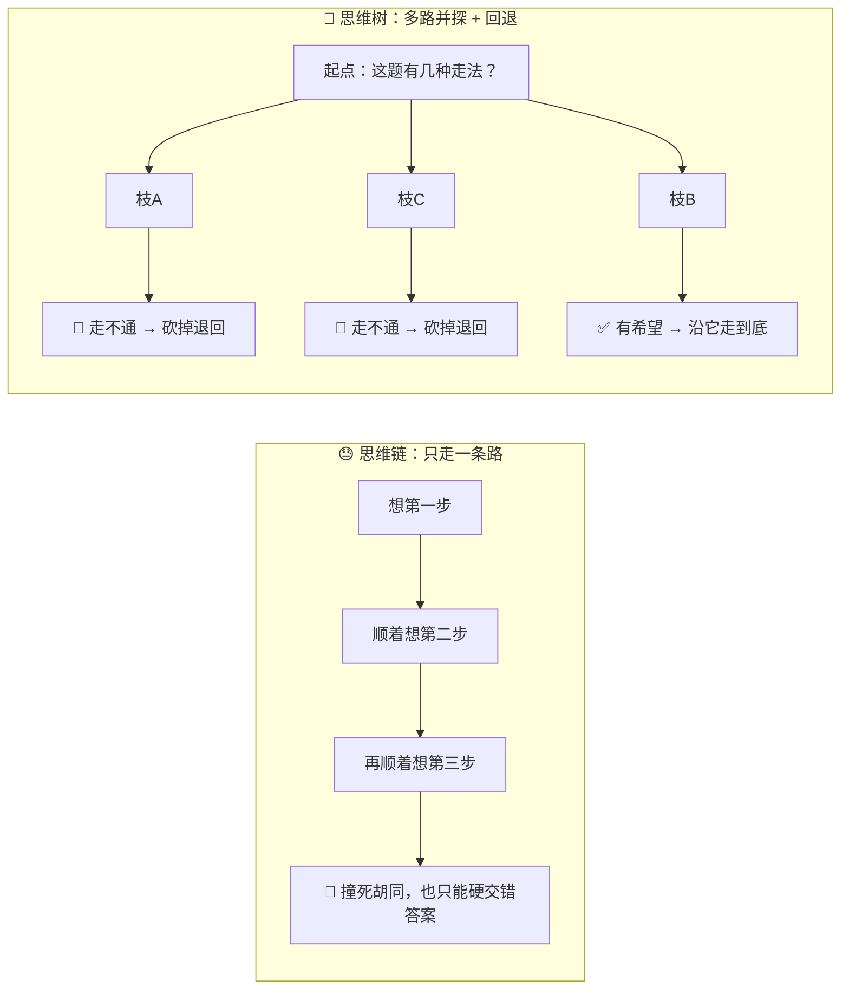
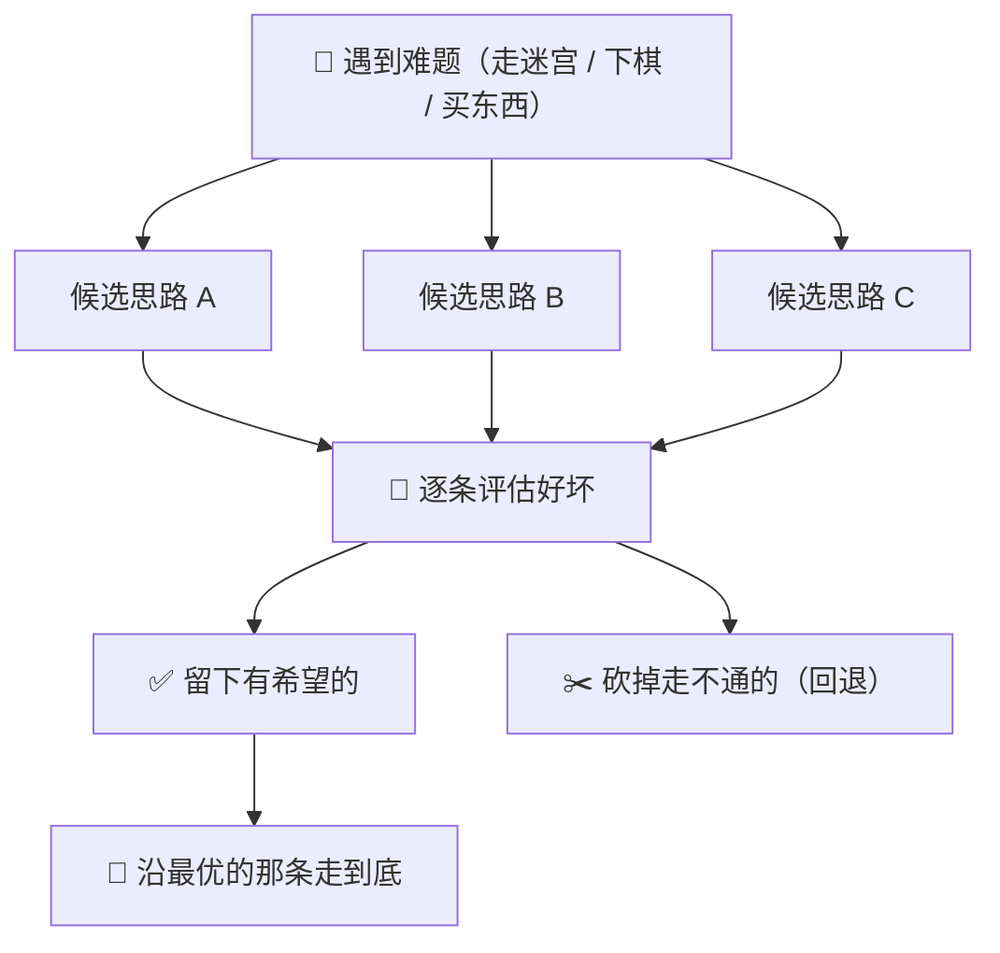
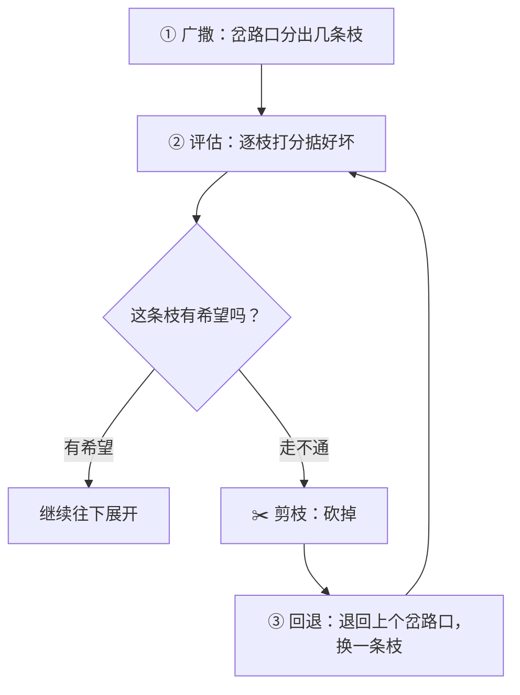
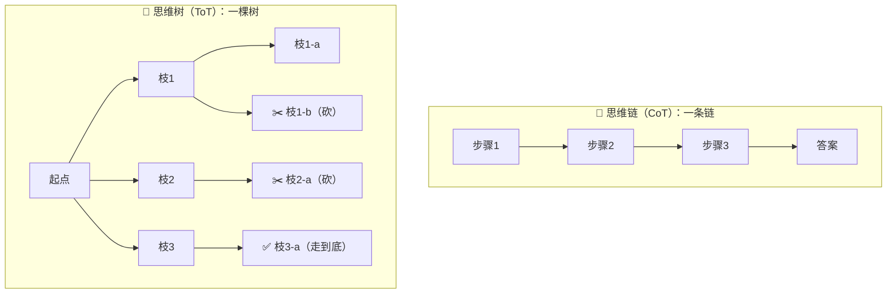
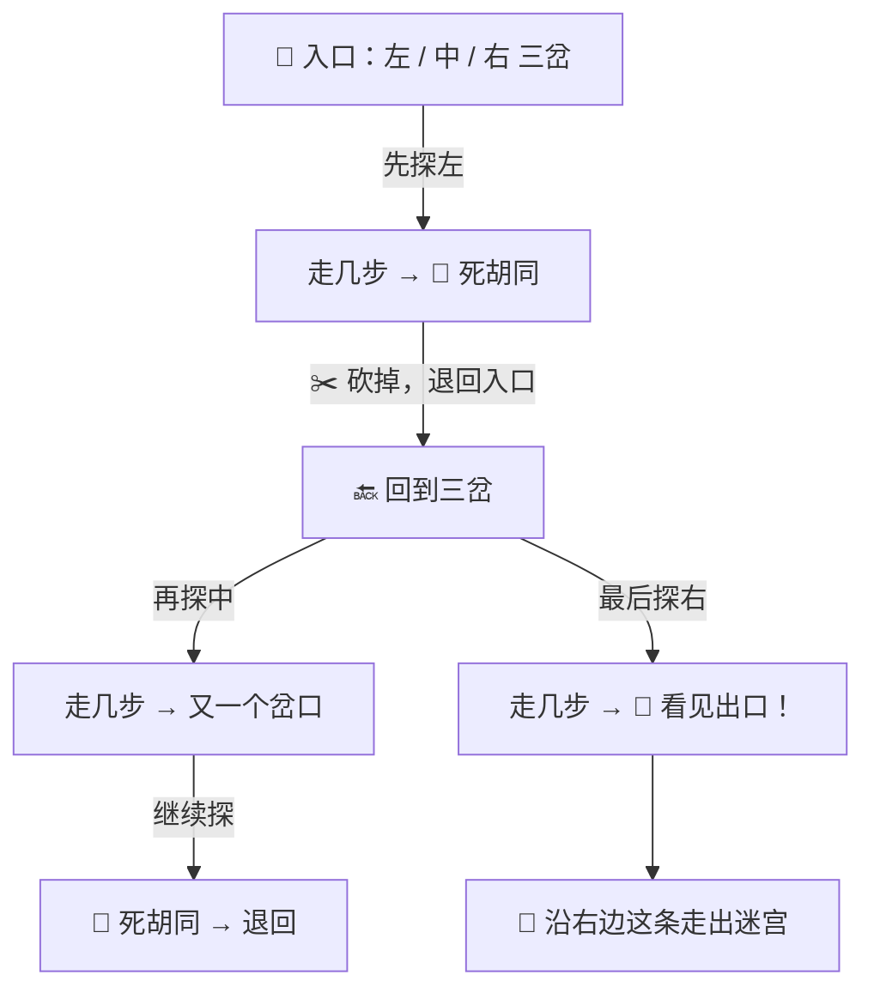
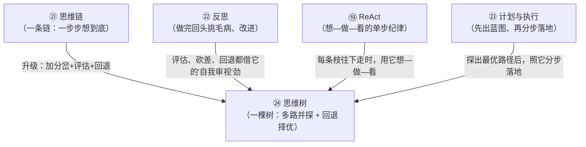

# ㉔ 什么是思维树（Tree of Thoughts, ToT）

> 建议先读 [㉑ 什么是思维链](./[CONCEPT-21]%20什么是思维链-ChainOfThought.md) 和 [㉒ 什么是反思](./[CONCEPT-22]%20什么是反思-Reflection.md)。那两篇讲了"AI 把一道难题一步步想出来、写成一条推理链子""它做完还会回头挑自己毛病"。这一篇要回答一个更进阶的问题：**AI 想问题时，只顺着一条思路走到底，万一那条路是死胡同呢？能不能像走迷宫一样，在岔路口同时分头探几条路，走不通就退回来换一条，最后挑最好的那条走？** 这门"多路并探、择优而行"的想法，就是本篇的主角——**思维树（Tree of Thoughts, ToT）**。

---

## 一、一句话定义

**思维树 = 面对一道难题，AI 不只顺着一条思路走到底，而是像一棵树一样同时展开多条候选思路，逐条掂量好坏，留下有希望的、剪掉走不通的（回退），最后从中选出最优的那条路走完。**

如果你只想记住一句话，就记这句：

> **思维链是"一条链"，从头想到尾；思维树是"一棵树"，在每个岔路口都分出几条枝、同时探、比着走——走不通的枝就砍掉退回，最后挑一条最好的枝走到底。**

这一句话是整篇文档的骨架。后面所有的比喻、图、误区，都是在反复讲透这一句话。

```callout ask|小白发问
你可能会问："[思维链](./[CONCEPT-21]%20什么是思维链-ChainOfThought.md) 不是已经让 AI 一步步想、把难题想明白了吗？为啥还要一棵树？"——好问题！因为思维链有个软肋：**它只走一条路。** 一旦第一步的方向选偏了，后面步步都顺着这个偏的方向走，越走越远，到头来才发现是死胡同，可已经+[没法回头了](思维链是一条直线，走错一步只能将错就错走到底，因为它不会在半路停下来问"要不要换条路试试")。思维树补的正是这个洞：**它允许 AI 在岔路口"分头试几条"，哪条走不通就退回来换一条**——就像你走迷宫时，不会一条道走到黑，撞墙了会退回上一个路口换个方向。这一篇不用懂代码，抓住"走迷宫会分头探、会退回来"就行～ 🐣
```

一句话摆清它和上一篇的关系：**[㉑ 思维链](./[CONCEPT-21]%20什么是思维链-ChainOfThought.md) 是"一条从头想到尾的直线思路"；思维树，是"把这条思路升级成一棵有很多枝的树"——从"单路直行"升级到"多路并探、择优而行"。**

---

## 二、为什么需要它？——一条道走到黑的三种苦

思维链已经很聪明了，那为什么还要"一棵树"？因为只走一条路，遇到某些难题会吃三种苦：

### 苦一：方向选错，越走越远

有些难题，一开头有好几种解法方向。思维链只挑一个方向闷头走，**万一开头就挑错了**，后面每一步都建在这个错方向上，越走越偏，到最后满盘皆输——而且它不会中途醒悟。

### 苦二：岔路极多，蒙对全靠运气

有些题（走迷宫、排数字、凑算式）岔路特别多，正确的路只有一条。只走一条链，就像闭着眼在迷宫里瞎撞，**能不能撞对全看运气**。多路并探，就能把几条路都试一遍，大大提高撞对的机会。

### 苦三：没有回头路，撞墙也只能硬撑

思维链最要命的是**不会回退**。走进死胡同，它也只能硬着头皮把这条死路走完，交出一个错答案。而思维树天生会"撞墙就退回上一个岔路口，换一条枝再试"——这一步"能回头"，正是它比思维链强的根子。



**所以思维树的价值就一句话：把"只走一条路、错了没法回头"的死板思考，升级成"同时探几条路、走不通就退回换一条、最后挑最好的走"——又稳、又不容易被一步走死。**

---

## 三、核心比喻：走迷宫、下棋、货比三家

"思维树"这个词听着抽象，用三个你熟悉的画面就能焊死它。

### 比喻一：走迷宫，岔路口分头探

你走一座迷宫，走到一个岔路口，面前有三条路。你不会随便挑一条闷头走到黑——**你会先探一条，走几步发现是死胡同，就退回这个岔路口，再探第二条。** 试到某条路通了，就顺着它走下去。**分头探、撞墙退回、换一条**——这就是思维树最原汁原味的样子。

### 比喻二：下棋，脑中同时算几种变化

一个好棋手落子前，脑子里**同时盘算好几种走法**："我走这步，对方会怎么应？那我下一步又如何？"他把几种变化在脑中各推演几步，比一比哪种最占便宜，**再挑最好的那步真正落子**。他不是想一步走一步，而是"多路推演、择优而行"。

### 比喻三：买东西，货比三家

你要买个大件，不会进第一家店看见就掏钱——**你会多逛几家，比一比价格、质量、服务**，把明显不划算的排除掉，最后挑一家最合适的下单。"同时看几个候选、逐个掂量、留好的砍差的"，这也是思维树的味道。



三个比喻的**共同内核**：**先摊开几条候选路，逐条掂量好坏，留下有希望的、砍掉走不通的，最后挑最优的那条走。** 记住这一点，思维树是什么就再也不会忘。

---

## 四、拆开看：思维树的三件套——广撒、评估、回退

思维树能"择优而行"，全靠三件配合默契的本事。理解了这三件，你就摸透了它的机关：

| 三件套 | 大白话 | 像什么 |
|--------|--------|--------|
| **广撒思路（分枝）** | 在每个岔路口，一口气想出好几种可能的走法 | 走迷宫时把面前几条路都记下来 |
| **评估剪枝（打分砍差）** | 给每条枝掂量掂量好坏，明显走不通的当场砍掉，不再浪费力气 | 尝一口发现馊了，这道菜直接倒掉 |
| **回退（撞墙退回换枝）** | 走到死胡同，退回上一个岔路口，换一条还没试的枝再走 | 迷宫撞墙了，退回路口换个方向 |



**你不用记牢这三个词的学名**，只要抓住一个直觉：**思维树干活时，永远在做三件事——多想几条（广撒）、比一比砍掉差的（评估剪枝）、走不通就退回换一条（回退）。** 这三件转着圈来，直到探出一条能走通、又最好的路。

```callout star|一句话点睛
思维树最反直觉、也最值钱的一件本事，是那个"**回退**"。普通的一条链思考，最怕"一步错、步步错，还没法回头"。而思维树天生带着"**撞墙就退回上一个岔路口**"的能力——它允许自己走错、允许自己反悔。**能反悔、能重来，恰恰是它比"一条道走到黑"更聪明的地方。** 会认错回头的思考，才走得远。
```

---

## 五、和思维链 CoT 的关系：一条链 vs 一棵树

这一节最关键，务必读透——因为思维树就是**思维链的升级版**，把它俩摆一起，你会瞬间开窍。

```flip
🤔 猜猜看：思维链是"一条线"，思维树在这条线上多加了什么本事？
---
✅ 多了「分岔 + 评估 + 回退」：ToT 在每个想的关口都能展开好几条枝、比着走、走不通就砍掉退回（像下棋往前搜几步再决定）；CoT 是单条线，一条道走到底，错了没法回头。一句话：思维树 = 思维链 + 分岔 + 评估 + 回退。
```

- **[思维链（CoT）](./[CONCEPT-21]%20什么是思维链-ChainOfThought.md)** 是一条**链**：从第一步想到最后一步，**一条道走到底**，中间不分岔、不回头。它把"闷头一步到位"升级成"一步步想清楚"，已经是一大进步。
- **思维树（ToT）** 是一棵**树**：在每个想的关口都可以**分出好几条枝**，同时探、比着走，走不通的枝**砍掉退回**，最后挑一条最好的枝走完。它把"一条链"升级成"很多条枝的树"。

一句话点破：**思维链是思维树的一个特例——当这棵树"每个关口只长一条枝、从不分岔、从不回退"时，它就退化成了一条链。** 反过来，**思维树 = 思维链 + 分岔 + 评估 + 回退。**



**什么时候用哪个？** 简单题、思路清晰、基本不会走错的——一条链（思维链）足够，又快又省。难题、岔路极多、开头方向容易选错、且"错一步就全错"的——才值得动用一棵树（思维树），用"多探几条、能回退"换来"更稳、更容易撞对"。**树更强，但也更费劲**（要同时想好几条、还要逐条评估），所以不是所有题都值得摆开这么大阵仗。

---

## 六、感觉一下：一次思维树的"探路全景"

**⚠️ 郑重提醒：下面这段你完全不用会写。** 放它在这，只是让你**亲眼看一眼**——一个 AI 用思维树解"用 3、3、8、8 四个数，凑出 24"这种岔路极多的难题时，是怎么"分头探、砍死路、退回换枝"的。请只体会那个**广撒 → 评估 → 剪枝 → 回退**的节奏：

```text
🙋 你的目标：用 3、3、8、8，通过加减乘除，凑出 24

🌳 AI（想）：这题岔路多，我不闷头猜，先摊开几种开局，逐个试、走不通就退回换。

   ├─ 枝A：先算 3 + 8 = 11 …… 剩下 3、8 怎么凑都到不了 24
   │        🧐 评估：这条不太有希望 → ✂️ 砍掉，退回
   │
   ├─ 枝B：先算 3 × 8 = 24 …… 可剩下的 3、8 还得用上，反而破坏了 24
   │        🧐 评估：死胡同 → ✂️ 砍掉，退回
   │
   └─ 枝C：先算 8 ÷ (3 − 8 ÷ 3) …… 咦，8÷3 再被 3 减，得 1/3，8 除以 1/3 = 24！
            🧐 评估：这条通了！✅ 沿它走到底

✅ 最终答案：8 ÷ (3 − 8 ÷ 3) = 24
```

看到那个"摊开三种开局 → 逐个掂量 → 砍掉两条死路、退回 → 沿通的那条走到底"了吗？**这就是思维树的真身。** AI 没有闷头赌一条路，而是**广撒几条、逐条评估、砍差回退、择优走完**。

**整个过程里，真正的聪明不在"一下想到正确答案"，而在"敢于试错、砍掉死路、退回换一条"的那份从容。** 这就是为什么面对岔路极多的难题，一棵会回退的树，比一条闷头的链更靠谱。

把这场"广撒 → 评估 → 剪枝 → 回退"演成一幕小短剧——重点看它撞到死路不是硬撑，而是砍掉、退回、换一枝：

```scene 探路全景：砍掉两条死路，退回换到通的那枝
🧑 你 | 用 3、3、8、8 四个数，加减乘除凑出 24。
🌳 树AI | 这题岔路多，我不闷头赌一条路，先摊开几种开局，逐个试，走不通就退回换。
🌿 枝A | 先算 3 + 8 = 11……剩下 3、8 怎么凑都到不了 24。
✂️ 树AI（评估） | 枝A 不太有希望 → 砍掉，退回。
🌿 枝B | 先算 3 × 8 = 24……可剩下的 3、8 还得用上，反而破坏了这个 24。
✂️ 树AI（评估） | 枝B 是死胡同 → 砍掉，退回。
🌿 枝C | 先算 8 ÷ (3 − 8 ÷ 3)……咦，8÷3 再被 3 减得 1/3，8 除以 1/3 = 24！
✅ 树AI（评估） | 枝C 通了！沿它走到底。
🎉 最终答案 | 8 ÷ (3 − 8 ÷ 3) = 24。
> 真正的聪明不在"一下猜中"，而在这份 +[敢砍死路、肯退回换枝](思维树的灵魂——不赌一条道走到黑，而是广撒几条、逐条评估、砍差回退、择优走完)的从容——这就是思维树的真身。
```

---

## 七、常见误区（新手最容易踩的坑）

这一节请务必逐条读完。这些误解会让你对"思维树"的理解跑偏。

### 误区 1：以为思维树就是"把好几个答案列出来让你挑"

- ❌ **错误理解**：思维树不就是 AI 一次给我三四个答案，让我自己选一个吗？
- ✅ **正确理解**：**不是给你挑，是它自己在心里探。** 思维树是 AI **内部**的思考方式——它自己分枝、自己评估、自己砍掉死路、自己回退换枝，最后**只把探出来的那条最优路径和答案交给你**。你看到的是结果，那些分枝和回退大多发生在它"脑子里"。

### 误区 2：以为思维树一定比思维链好，什么题都该用

- ❌ **错误理解**：树比链强，那所有题都用思维树不就完了？
- ✅ **正确理解**：**杀鸡不用牛刀。** 思维树要同时想好几条、还要逐条评估，**又费时又费力**。简单题、思路清晰不会走错的，一条链（思维链）又快又省，摆开一棵树纯属浪费。**只有难题、岔路多、开头容易选错的，才值得动用思维树。**

### 误区 3：把"回退（回头换枝）"当成"失败、白干了"

- ❌ **错误理解**：走进死胡同要退回来，那前面不是白走了？思维树岂不是很浪费？
- ✅ **正确理解**：**回退不是失败，是本事。** 探过一条死路，才知道它走不通、可以放心砍掉——这本身就是有用的信息。**能认错、能回头，恰恰是思维树比"一条道走到黑"聪明的地方。** 死撑着走完一条死路，交出错答案，那才叫真浪费。

### 误区 4：以为"分的枝越多越好"

- ❌ **错误理解**：既然要广撒思路，那每个岔路口分的枝越多越好，撒得越开越强。
- ✅ **正确理解**：**枝不是越多越好。** 每多一条枝，都要多花力气去展开、去评估。枝撒得太滥，光"评估、比较"就把力气耗光了，反而又慢又乱。**广撒是"撒几条像样的候选"，不是"漫无边际地乱撒"**——好的思维树，撒得有分寸，砍得也果断。

### 误区 5：以为思维树是"很遥远、很高级、跟我没关系"的东西

- ❌ **错误理解**：思维树听着好高深，那是研究者才玩的，跟我学 Khy-OS 没关系。
- ✅ **正确理解**：**它离你很近，也很像你。** 你走迷宫会分头探、下棋会算几种变化、买东西会货比三家——**这些天生的"多路并探、择优而行"，就是思维树。** 让 AI 面对难题时也这么想，它就更不容易被一步走死。理解它，你才看得懂"为什么它有时能啃下那些岔路极多的难题"。

```quiz
Q: 下面关于"思维树（ToT）"的说法，哪些是对的？（多选）
- [x] 思维树会同时展开多条候选思路，逐条评估，留下有希望的、砍掉走不通的
> 对。广撒思路 + 评估剪枝，正是思维树三件套里的头两件。
- [x] 走进死胡同时能"回退"到上一个岔路口换一条枝，是思维树比思维链强的关键
> 对。能认错、能回头，正是它不被"一步错步步错"困死的根子。
- [ ] 思维树就是 AI 一次列出好几个答案，让用户自己挑一个
> 错。分枝、评估、回退都发生在 AI 内部，它通常只把探出的最优路径和答案交给你。
- [ ] 思维树一定比思维链好，所有题都应该用思维树
> 错。思维树又费时又费力，简单题用一条链（思维链）更划算。难题、岔路多才值得动用它。
- [x] 思维链是"一条链"，思维树是"一棵树"，思维树是思维链的升级
> 对。思维树 = 思维链 + 分岔 + 评估 + 回退；当树不分岔、不回退时就退化成一条链。
```

---

## 八、动手小实验 / 思想实验

理论看再多，不如在脑子里走一遍。下面的思想实验不用写代码，只用想。

### 实验：你当一次"思维树"，走一座小迷宫

任务：你站在迷宫入口，面前是一个三岔路口——左、中、右。你看不见终点，只能一条一条试。试试用"思维树"的方式走它：



走完这一遍，请你回答自己三个问题：

1. 你是"一条路闷头走到黑"的吗？——**不是**。你先探左，撞墙了**退回来**换中，中又不通再换右——这就是"多路并探 + 回退"。
2. 探过的左、中两条死路，是白费吗？——**不是**。正因为试过、确认它们走不通，你才敢放心砍掉、不再回头——**回退不是失败，是排除法**。
3. 如果这是一条笔直没有岔路的走廊呢，还需要"树"吗？——**不需要**。没岔路就一条链走到底最省事。**岔路越多、越容易走错的迷宫，才越值得用思维树。**

**关键体会**：你刚刚亲手当了一回思维树。你会发现，它一点都不神秘——**它就是你走迷宫时天然会用的"分头探、撞墙退回、择通而行"的智慧**。把这份人人都懂的智慧交给 AI，让它面对难题时也这么想，就是"思维树"。

---

## 九、和其它概念的关系

思维树不是凭空冒出来的，它和前面几个"怎么想问题"的概念是一条进化线上的兄弟。



| 概念 | 一句话关系 | 类比 |
|------|-----------|------|
| [㉑ 思维链](./[CONCEPT-21]%20什么是思维链-ChainOfThought.md) | 思维树是它的**升级版**——一条链加上分岔、评估、回退，就成了一棵树 | 直线升级成有很多枝的树 |
| [㉒ 反思](./[CONCEPT-22]%20什么是反思-Reflection.md) | 思维树"评估每条枝、砍掉差的、走不通就回退"，借的正是反思那股**自我审视**的劲 | 边走边审视，走错就认、就退 |
| [⑲ ReAct](./[CONCEPT-19]%20什么是ReAct-智能体推理模式.md) | 思维树的**每一条枝往下展开时**，内部往往用 ReAct 想—做—看 | 每条枝上都有个会"三思而后行"的探子 |
| [㉓ 计划与执行](./[CONCEPT-23]%20什么是计划与执行-PlanAndExecute.md) | 思维树**探出最优路径后**，可交给"计划与执行"照蓝图分步落地 | 选定了路线，再一步步走完它 |
| [③ Tool Loop](./[CONCEPT-03]%20什么是ToolLoop-工具循环.md) | 探每条枝、验证它通不通时，可能反复**用工具试**——那就是工具循环 | 每探一步都动手验一验 |

一句话串起来：**思维树是"怎么想问题"这条进化线上的一次跃升——它把思维链的"一条链"升级成"一棵树"，借反思的自我审视来评估剪枝，靠每条枝内部的 ReAct 想—做—看往下探，探出最优路径后再交给计划与执行落地。它让 AI 面对岔路极多的难题时，不再一条道走到黑。**

---

## 十、和 Khy-OS 的关系

这一节和你手上的项目关系很紧：

**Khy-OS 面对"岔路多、开头容易选错"的难题时，骨子里就带着这份"多路并探、择优而行"的思维树智慧。**

当你在 Khy-OS 里交给它一道又难又绕的活——比如"这个 bug 有好几种可能的成因，帮我找出真正的那个"——它并不一定一头扎进第一个猜想里闷头改到底。作为一个成熟的 [harness](./[CONCEPT-03]%20什么是ToolLoop-工具循环.md) 上层，它可以：

- **广撒几种候选成因**（是配置错？是空指针？还是并发问题？）；
- **逐条去验**，动手试一试，看哪条站得住；
- 明显走不通的当场**砍掉**，不再纠缠；
- 某条验着验着发现是死路，就**退回来**换下一个候选——直到锁定真正的成因。

这正是本文讲的思维树。它让 Khy-OS 不容易被"一个错的第一猜想"带偏，从而更稳地啃下那些岔路极多的难题。

而 Khy-OS 章程里那条 **"B2 目标驱动执行：给定可验证的成功标准 → 自循环到验证通过 → 才回报"** 的纪律，本质上也带着思维树的影子：**没验证通过就不算数、就得换个法子再试**——这份"走不通就退回来换一条、直到探出一条真能通过验证的路"的劲头，正是思维树"评估—剪枝—回退"在做事纪律上的体现。

> 💡 换个角度说：**学会"思维树"这个概念，你就理解了 AI 为什么有时候"想得很慢，却答得更准"。** 从"一条链一口气想到底"到"一棵树多路并探、走错能回头"，这是 AI 思考能力的一次进化。你从入行第一站就理解它，日后无论是用 AI 攻克难题，还是看懂那些"让 AI 慢慢想、想得更深"的新闻，都不会觉得高深莫测——因为你早就知道：**那不过是一个人在走迷宫，会分头探、会退回来、会挑最好的路走。**

> ⚠️ 诚实说一句边界：思维树具体怎么实现（怎么分枝、怎么给每条枝打分、什么时候剪、怎么回退），属于设计与实现层面，各家做法不同、也在快速演进，而且它比一条链更费算力、不是所有场景都值得。Khy-OS 的具体机制你可以在 [`docs/03_DESIGN_设计`](../03_DESIGN_设计) 与项目章程里深入了解。本文只讲"思维树是什么、为什么需要它"这一层概念地图。

---

## 十一、小结 + 下一步

- **思维树 = 面对难题，AI 不只走一条思路，而是像树一样同时展开多条候选、逐条评估、留好砍差、走不通就回退，最后择最优而行**的一整套思考法。
- **为什么需要它**：只走一条链有三种苦——方向选错越走越远、岔路多蒙对全靠运气、撞墙没回头路只能硬交错答案；一棵会回退的树，又稳、又不容易被一步走死。
- **核心比喻**：**走迷宫分头探**、**下棋算几种变化**、**买东西货比三家**——先摊开几条候选、逐条掂量、留好砍差、择优而行。
- **三件套**：广撒思路（分枝）、评估剪枝（打分砍差）、回退（撞墙退回换枝）——转着圈来，直到探出一条能通又最好的路。
- **和思维链的关系**：思维链是"一条链"，思维树是"一棵树"，**思维树 = 思维链 + 分岔 + 评估 + 回退**；简单题用链、难题才用树。
- **五大误区**：不是列答案让你挑（它自己在心里探）、不是什么题都该用（费力，简单题用链）、回退不是白干（是排除法）、枝不是越多越好（评估有开销）、它离你很近不高深。
- **和 Khy-OS 的关系**：面对岔路多的难题，Khy-OS 能"广撒候选、逐条验、砍死路、退回换枝"；章程"B2 验证通过才回报"也是同一份"走不通就换一条、直到探出真能通过的路"的智慧。

🎉 **恭喜，你的思考地图又多了一棵树！** 从"一条链一步步想"，到"一棵树多路并探、走错能回头"——你现在既懂"想得直"，也懂"想得广、还能回头"。这套从思维链到思维树的进化地图，已经在你脑子里连成一片了。

👈 回 [概念入门总览](./00_INDEX_概念入门-总览.md) 看看还有哪些能温故知新。
👈 上一篇 [㉓ 什么是计划与执行](./[CONCEPT-23]%20什么是计划与执行-PlanAndExecute.md)——回顾"先出蓝图再分步落地"的做事法。
👉 下一篇 [㉕ 什么是微调](./[CONCEPT-25]%20什么是微调-FineTuning.md)——怎么把通用大模型"再训练一小下"变得更懂你的行当。
