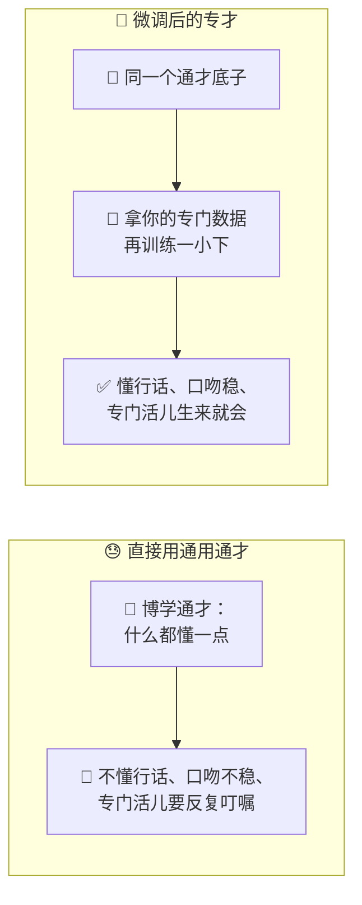
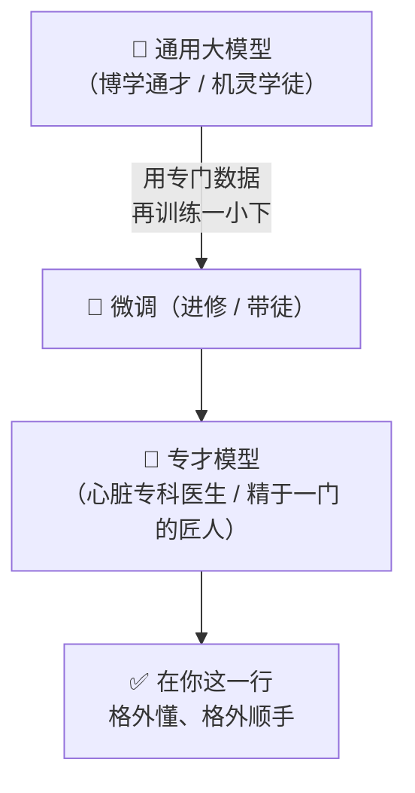
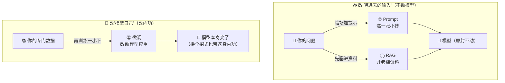
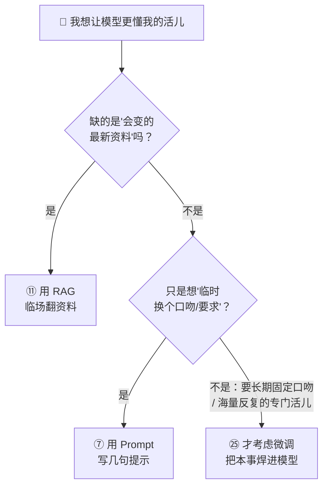
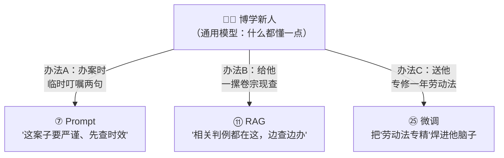
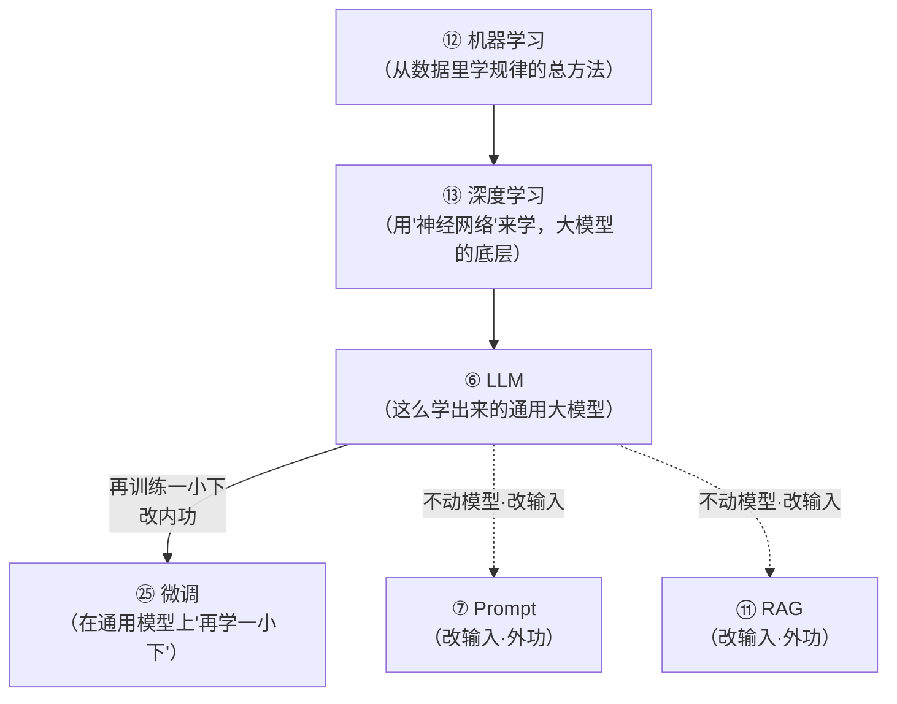

# ㉕ 什么是微调（Fine-tuning）

> 建议先读 [⑥ 什么是 LLM](./[CONCEPT-06]%20什么是LLM-大语言模型.md)、[⑫ 什么是机器学习](./[CONCEPT-12]%20什么是机器学习-MachineLearning.md) 和 [⑦ 什么是 Prompt](./[CONCEPT-07]%20什么是Prompt-提示词.md)。那几篇讲了"大模型是怎么学出来的""机器学习就是从数据里找规律""提示词是你临场喂给它的一段话"。这一篇要回答一个更进一步的问题：**一个已经博学多才的通用大模型，虽然什么都会一点，可对你这一行的行话、口吻、门道并不精通——那能不能让它"再进修一门专科"，把它调教得特别懂你的行当？** 这门"再训练一小下、脱胎换骨"的手艺，就是本篇的主角——**微调（Fine-tuning）**。

---

## 一、一句话定义

**微调 = 在一个已经训练好的通用大模型基础上，用你自己某个专门领域的数据，再训练"一小下"，让它更懂你这一行的行话、口吻和门道。**

如果你只想记住一句话，就记这句：

> **通用大模型像一个博学的通才——什么都懂一点，可样样不精；微调，就是让这位通才再去进修一门专科，比如让一个全科医生进修心脏科——底子还是那个人，但从此他对这一门格外精通。**

这一句话是整篇文档的骨架。后面所有的比喻、图、误区，都是在反复讲透这一句话。

```callout ask|小白发问
你可能会问："模型不是已经训练好、什么都会了吗？为啥还要我再训练一次？"——好问题！因为"什么都会一点"和"这一门特别精"是两码事。通用模型是拿全世界的公开资料喂出来的，它懂常识、会聊天，可它没见过你公司内部的行话、你这一行独有的口吻、你们判案子/开药方/写合同的那套门道。微调，就是拿你**自己积累的专门数据**，在它已有的本事上再"点一下"，让它+[从"通才"变"专才"](底子和通用能力都还在，只是在你这一行上格外顺手、格外专业)。这一篇不用懂代码，抓住"通才进修专科"就行～ 🐣
```

一句话摆清它和前几篇的关系：**[⑫ 机器学习](./[CONCEPT-12]%20什么是机器学习-MachineLearning.md) 是"从数据里学规律"的总方法，[⑥ LLM](./[CONCEPT-06]%20什么是LLM-大语言模型.md) 是这么学出来的通用大模型；微调，是在这个通用大模型上"再学一小下"，让它专精一道——从"通才"升级到"专才"。**

---

## 二、为什么需要微调？——通才有三样"不称手"

一个通用大模型已经很博学了，那为什么还要"再训练一小下"？因为通才直接上手你的活儿，常有三样不称手：

### 场景一：不懂你这一行的"行话"

通用模型没在你的行当里泡过。法律、医疗、财税、某个工厂的工艺——每一行都有一堆外人听不懂的术语和惯例。你问它，它答得"像模像样"却不地道。**用你这一行的真实资料微调过，它才说得出行里人的话。**

### 场景二：学不像你要的"口吻"

你想让它永远用某种固定的腔调回话——比如你们客服一贯的措辞、你们公文一贯的格式。光靠每次都写一长串提示词去"提醒"它，又啰嗦又不稳。**微调能把这种口吻"焊进"模型，让它天生就这么说话。**

### 场景三：同一类活儿要反复干、还想干得又快又稳

有一类专门任务，你天天要它干成千上万遍（比如把一段病历归成某几类）。每次都靠长长的提示词临场教它，既费"字数"又不够稳。**微调过的模型，这类活儿它"生来就会"，又快又稳。**



**所以微调的价值就一句话：把一个"什么都懂一点却样样不精"的通才，用你自己的专门数据，调教成"在你这一行格外精通"的专才。** 这就是为什么很多深耕一个领域的团队，会考虑给通用模型"进修一门专科"。

---

## 三、核心比喻：通才进修 & 师傅带徒弟

"微调"这个词听着抽象，用两个你熟悉的画面就能焊死它。

### 比喻一：全科医生进修心脏科

一位全科医生，内外妇儿都懂一些，是个称职的通才。可要他做心脏专科的精细判断，就力有不逮。于是他**去心脏科进修一年**——**底子还是那个全科医生**，但从此他对心脏这一门格外精通。

**通用大模型 = 全科医生（博学的通才）；微调 = 进修心脏科（用专门数据再学一小下）；微调后的模型 = 心脏专科医生（同一个人，却精通一门）。** 关键在于：进修不是从头再读一次医学院，而是**在已有的本事上再精进一门**。

### 比喻二：老师傅带徒弟专精一门手艺

一个学徒读过百家书、见过百样活，是个机灵的通才。老师傅把他领进门，**只教他专精一门手艺**（比如只打某一种刀），日复一日地带、反复地磨。**学徒的底子没变**，但这一门手艺，他从此炉火纯青。

**通用模型 = 机灵的学徒；微调 = 师傅带着专精一门；微调后 = 精于一门的匠人。** 手艺精，靠的不是"重学一遍所有东西"，而是**在已有底子上，把一门磨到极致**。



两个比喻的**共同内核**：**不是把模型从头重造，而是在它已有的博学底子上，用你的专门数据"再学一小下",把某一门磨精。** 记住这一点，微调是什么就再也不会忘。

---

## 四、微调 vs Prompt vs RAG：改"内功"，还是改"输入"？

这是本篇最要紧的一节。同样是"让模型更懂你的活儿"，微调和你前面学过的 [⑦ Prompt](./[CONCEPT-07]%20什么是Prompt-提示词.md)、[⑪ RAG](./[CONCEPT-11]%20什么是RAG-检索增强生成.md) 有一条**根本分界**：

**微调改的是"模型自己"（内功）；Prompt 和 RAG 改的是"喂给模型的输入"（临场提示 / 带资料）——它们压根不动模型本身。**

打个武侠的比方：

- **微调 = 修炼内功**。它真的**改动了模型内部的"权重"**（你可以理解成模型脑子里那些记着本事的"参数旋钮"）。练完，模型本身变强了，换个招式也带着这身内功。
- **Prompt = 临场递一张小抄**。你在提问时，多写几句"你是资深律师，请用严谨口吻回答"——你没动模型分毫，只是**临场给了它一段更好的输入**。你不给这段话，它又变回原样。
- **RAG = 开卷考试，让它先翻资料**。你在它回答前，**先把相关资料塞进输入**给它参考——同样没动模型，只是**喂进去的输入里多带了资料**。



| 做法 | 改的是什么 | 像什么 | 换个问题还灵吗 |
|------|-----------|--------|--------------|
| **Prompt** | 临场的**输入**（一段提示） | 递一张小抄 | 不递就没了，得每次都写 |
| **RAG** | 临场的**输入**（先带上资料） | 开卷翻资料 | 不塞资料就没了，得每次都查 |
| **微调** | **模型本身**（内部权重） | 修炼内功 | 灵，本事焊进模型里了 |

**一句话记牢这一节**：**Prompt 和 RAG 是"外功"——每次临场喂点东西给一个没变的模型；微调是"内功"——真真切切把模型自己改了。** 分清这一条，你就分清了这三样最容易被搞混的东西。

```flip
既然微调把本事"焊进"模型里、一劳永逸，那是不是它一定比 Prompt、RAG 更高级、更该用？（点一下翻到背面）
---
不是！微调是"改内功"，代价也大得多：你得**攒一批高质量的专门数据**、要花**算力和钱**去训练、往后模型或数据一变还得**重新再调**。而很多时候，你要的东西——比如"让它引用一份随时会更新的资料""临时换个口吻"——用 Prompt 写几句、或用 RAG 挂上资料库，**又便宜又灵活**，改起来立等可取。微调更适合那种"口吻/格式要长期固定""某类专门活儿天天大量干"的场景。**该用外功就用外功，非到"外功喂不出来"了，才动内功——这才是会算账的用法。**
```

---

## 五、什么时候该微调，什么时候别？——一张"先别急着微调"的决策图

微调贵、要数据、还要维护。所以业内有条朴素的经验：**先别急着微调，先看看 Prompt / RAG 够不够。** 很多场景，后两样就够了。

**先想清楚你到底缺什么：**

- 你缺的是**"最新的、会变的资料"**（比如今天的库存、这个月的政策）？——**用 [⑪ RAG](./[CONCEPT-11]%20什么是RAG-检索增强生成.md)**，让它临场翻资料就行，别微调（数据一变，微调过的又过时了）。
- 你缺的是**"临时换个口吻 / 加个要求"**？——**用 [⑦ Prompt](./[CONCEPT-07]%20什么是Prompt-提示词.md)**，写几句提示最快，别微调（为一句话去改内功，太不划算）。
- 你缺的是**"一种长期固定的口吻/格式""某类专门活儿要海量反复干、且提示词怎么写都不够稳"**？——**这才是微调的主场**，把本事焊进模型里，又稳又省字数。



顺带提一句：微调也不总是"贵到离谱"。有一类**轻量微调**（业内有个名字叫 **LoRA**）能只动模型很小一部分"旋钮"，用小得多的代价达到不错的效果——你现在只要知道"有这么个省钱的路子"就够了，细节日后再说。

```callout star|一句话点睛
新手最该记住的不是"怎么微调"，而是"**先别急着微调**"。微调是"改内功"的重活——要数据、要算力、要维护。绝大多数"让它更懂我"的需求，用 Prompt 写几句、或用 RAG 挂上资料库，就又快又省地解决了。**只有当"外功怎么喂都喂不出来"——需要长期固定的口吻、或某类专门活儿要海量反复干——才轮到微调登场。** 会算这笔账，比会调这个模型更重要。
```

---

## 六、感觉一下：一次微调的"进修全景"

**⚠️ 郑重提醒：下面这段你完全不用会写。** 放它在这，只是让你**亲眼看一眼**——把一个通用模型"进修"成一个专精"客服口吻"的专才，大致是个什么节奏。请只体会那个**攒数据 → 再训练 → 变专才**的过程：

```text
🙋 你的目标：让模型永远用我们客服那套"耐心、亲切、先道歉再解决"的口吻回话

第一步：攒"专门数据"（进修用的教材）
  收集你们客服历史上的优质对话，整理成一条条"问 → 该怎么答"的范例：
    ├─ 顾客：东西坏了！ → 客服：非常抱歉给您添麻烦了，我们马上为您处理…
    ├─ 顾客：怎么还没到？ → 客服：让您久等真的很抱歉，我这就帮您查物流…
    └─ …（几百上千条这样的地道范例）

第二步：微调（拿这批教材，在通用模型上再训练"一小下"）
  🔧 模型内部的"权重旋钮"被轻轻拧动，把这套口吻慢慢"焊"进去。
     （注意：不是重新读一遍全世界，只是在原有本事上再学这一门）

第三步：验收
  🙋 你问它一个全新的、教材里没出现过的问题：
     顾客：你们这破系统又卡了！
  🎯 微调后的模型（不用你再写任何提示，天生就这么答）：
     实在太抱歉了，卡顿一定让您很烦躁，我先帮您把当前操作保住，再一步步排查…

✅ 成了：口吻已经"长"在模型身上，不用每次再写一长串提示词去叮嘱它了。
```

看到那个"攒数据 → 再训练一小下 → 口吻焊进模型"了吗？**这就是微调的真身。** 注意两个关键：一是它**没有从头重学**，只是在通才底子上"再学一门";二是学完之后，那套口吻**长在了模型自己身上**——你不用再靠临场提示去提醒它。**这，正是"改内功"和"临场递小抄"的根本区别。**

把这场"通才进修成专才"演成一幕小短剧——你会看到微调不是重新读一遍全世界，而是**在原有本事上再焊进一门手艺**：

```scene 通才进修记：把"客服口吻"焊进模型
> 你有个愿望：让模型永远用你们客服那套"耐心、亲切、先道歉再解决"的口吻。
🧑 你 | 通用模型什么都会，可它回话太生硬。我想让它天生就带咱家客服的口吻，别每次都靠我写一长串提示叮嘱。
📚 你 | 第一步，我把客服历史上的优质对话整理成教材——一条条"顾客这么问 → 该这么答"，攒了几百上千条。
🔧 微调师傅 | 好，交给我。我不让它从头重读全世界，只拿你这批教材，在它原有的本事上+[再训练"一小下"](微调：轻轻拧动模型内部的权重旋钮，把新口吻慢慢焊进去——不是推倒重学，是在通才底子上再学一门)。
🤖 微调后的模型 | 试我一下吧——出个教材里没有的新问题。
🧑 你 | "你们这破系统又卡了！"
🤖 微调后的模型 | 实在太抱歉了，卡顿一定让您很烦躁，我先帮您把当前操作保住，再一步步排查……
🎉 旁白 | 注意两点：它没从头重学，只在通才底子上"再学一门"；学完那套口吻长在了它自己身上——你不用再临场递小抄。这就是"改内功"和"临场提示"的根本区别。
```

---

## 七、常见误区（新手最容易踩的坑）

这一节请务必逐条读完。这些误解会让你对"微调"的理解跑偏。

### 误区 1：以为微调是"从头把模型重新训练一遍"

- ❌ **错误理解**：微调嘛，就是把模型推倒、拿我的数据从零再训一个新的。
- ✅ **正确理解**：**微调是"在已经训练好的模型上，再学一小下"**，绝不是从头重来。从零训一个大模型要海量数据和天价算力，那是造模型的大厂干的事。微调是**站在通才的肩膀上**，只用相对少的专门数据、相对小的代价，把它往你这一行"再推一把"。

### 误区 2：把"微调"和"Prompt / RAG"当成一回事

- ❌ **错误理解**：微调、写提示词、挂个资料库，不都是"让 AI 更懂我"嘛，差不多。
- ✅ **正确理解**：**改的东西根本不同。** [⑦ Prompt](./[CONCEPT-07]%20什么是Prompt-提示词.md) 和 [⑪ RAG](./[CONCEPT-11]%20什么是RAG-检索增强生成.md) 改的是**喂给模型的输入**（临场提示 / 带资料），**模型本身一动不动**；微调改的是**模型自己的内部权重**（内功）。一个是"外功"（每次临场喂），一个是"内功"（焊进模型）。搞混这条，你就会在"该写提示"的地方傻乎乎去微调。

### 误区 3：以为"微调越多、数据越猛，模型就一定越强"

- ❌ **错误理解**：只要拿海量数据往死里微调，模型就会越来越神。
- ✅ **正确理解**：**微调看的是数据的"质",不是一味的"量"。** 拿一批又脏又乱、或者互相打架的数据去调，反而可能把模型**越调越糟**（业内还有个说法：调过头，通用本事都可能被"带偏"）。**少而精、地道、对路的专门数据，胜过一大堆垃圾。**

### 误区 4：以为微调能"给模型灌进它没有的最新知识"

- ❌ **错误理解**：我把今天的新闻、这个月的库存微调进去，它不就永远知道最新情况了？
- ✅ **正确理解**：**要"最新的、会变的资料"，该用 [⑪ RAG](./[CONCEPT-11]%20什么是RAG-检索增强生成.md)，不是微调。** 微调擅长的是教它**"这一行的口吻、门道、套路"**这种相对稳定的东西；而库存、政策这类**天天变**的信息，你今天辛辛苦苦微调进去，明天就过时了，还得重调。会变的资料，让它临场翻（RAG）才对。

### 误区 5：以为微调"离我很远、是大厂才碰得起的东西"

- ❌ **错误理解**：微调听着又贵又高深，那是有钱大厂玩的，跟我没关系。
- ✅ **正确理解**：**它没那么遥不可及。** 一来有 **LoRA** 这类**轻量微调**，用小得多的代价就能调；二来——更要紧的是——**你更该先学会"什么时候根本不用微调"**。理解"微调 vs Prompt vs RAG"这条分界，你就能把大多数需求用便宜办法解决，真到该微调时也不会犯怵。**懂它，你才知道什么时候该出手、什么时候该省钱。**

```quiz
Q: 下面关于"微调（Fine-tuning）"的说法，哪些是对的？（多选）
- [x] 微调是在一个已经训练好的通用模型上、用专门数据再训练"一小下"，不是从头重造
> 对。它站在通才的肩膀上"再学一门专科"，像全科医生进修心脏科，底子还在、只是精通了一门。
- [x] 微调改的是"模型自己"（内部权重/内功），而 Prompt、RAG 改的是"喂给模型的输入"
> 对。这是最根本的分界：微调修内功、焊进模型；Prompt 递小抄、RAG 翻资料，都不动模型本身。
- [ ] 只要数据越多、微调越狠，模型就一定越强
> 错。微调看数据的"质"不是一味的"量"，又脏又乱的数据反而可能把模型越调越糟、带偏通用本事。
- [ ] 想让模型永远知道"今天的库存、这个月的政策"，就该把它们微调进去
> 错。会变的最新资料该用 RAG 让它临场翻；微调进去的信息明天就过时了，还得重调。
- [x] 很多"让它更懂我"的需求，用 Prompt 或 RAG 就够了，不必都上微调
> 对。微调贵、要数据、要维护；先看 Prompt/RAG 够不够，只有长期固定口吻或海量反复的专门活儿才轮到微调。
```

---

## 八、动手小实验 / 思想实验

理论看再多，不如在脑子里走一遍。下面的思想实验不用写代码，只用想。

### 实验：你手下有个"博学的新人"，你要怎么让他专精？

设定：你开了家法律咨询所，招来一个刚毕业的法学生。他**书读得多、什么都懂一点**（像个通用大模型），可离"能独当一面的专科律师"还差得远。你有三种办法让他更顶用，试着对号入座：



走完这一遍，请你回答自己三个问题：

1. 只是"这一个案子提醒他细心一点"——用哪个办法最划算？——**办法 A（Prompt）**。临场叮嘱两句最快，何必送他进修一年。
2. 案子涉及"随时在更新的最新判例、最新法条"——用哪个办法最靠谱？——**办法 B（RAG）**。让他现查最新卷宗，别指望他脑子里的东西永远最新。
3. 你希望他**长期、稳定**地成为"劳动法专家"，天天大量处理这类案子——用哪个？——**办法 C（微调）**。这才值得送他专修一年，把这门"焊"进他的本事里。

**关键体会**：你刚刚亲手分清了微调、Prompt、RAG 的用武之地。你会发现，选哪个一点都不玄——**就看你缺的是"临时提醒"、"现查资料"，还是"长期把一门专精焊进去"**。前两样是"外功"（不动这个人），最后一样是"内功"（把这个人本身练强了）。把这份直觉记牢，你就再也不会在该写提示的地方去砸钱微调。

---

## 九、和其它概念的关系

微调不是凭空冒出来的，它稳稳站在前面几个概念的地基上。



| 概念 | 一句话关系 | 类比 |
|------|-----------|------|
| [⑫ 机器学习](./[CONCEPT-12]%20什么是机器学习-MachineLearning.md) | 微调本质上**也是一次机器学习**——从你的专门数据里学规律 | 都是"从例子里学本事" |
| [⑬ 深度学习](./[CONCEPT-13]%20什么是深度学习-DeepLearning.md) | 微调调的那些"权重旋钮",就是深度学习里"神经网络"的参数 | 拧的是同一台机器上的旋钮 |
| [⑥ LLM](./[CONCEPT-06]%20什么是LLM-大语言模型.md) | 微调的**起点**，就是一个训练好的 LLM（通才底子） | 进修的前提是先当上全科医生 |
| [⑦ Prompt](./[CONCEPT-07]%20什么是Prompt-提示词.md) | 和微调是**两条路**：Prompt 改输入（外功），微调改模型（内功） | 递小抄 vs 修内功 |
| [⑪ RAG](./[CONCEPT-11]%20什么是RAG-检索增强生成.md) | 也和微调是两条路：RAG 改输入（带资料），微调改模型 | 开卷翻资料 vs 修内功 |

一句话串起来：**微调站在"机器学习 → 深度学习 → LLM"这条地基上——它拿一个训练好的通用大模型（LLM）当起点，用一次小规模的机器学习（拧动深度学习网络里的权重旋钮），把它调成你这一行的专才；而这条"改内功"的路，和 Prompt / RAG 那条"改输入"的外功路，是并列的两种选择。**

---

## 十、和 Khy-OS 的关系

这一节说点诚实的、和你手上项目相关的话：

**你日常在 Khy-OS 里让 AI 帮你干活，用到的"让它更懂我的活儿"的办法，绝大多数其实是"改输入"那一路——Prompt 和 RAG——而不是"改内功"的微调。**

为什么？因为对绝大多数使用者来说：

- 你想让它按某种口吻、某种规矩办事——写进 **[⑱ 系统提示词](./[CONCEPT-18]%20什么是系统提示词-SystemPrompt.md)（Prompt 那一路）** 最快、最灵活；
- 你想让它参考你项目里的具体资料、文档、代码——用 **[⑪ RAG](./[CONCEPT-11]%20什么是RAG-检索增强生成.md) 那一路**，让它临场去检索、去读，随时更新；
- 这两样**又便宜、又立等可取、还随改随生效**，覆盖了你日常绝大部分需求。

而**微调**——"改内功、把本事焊进模型"——是一件更重、更专业的工程：要攒专门数据、要算力、要持续维护，通常是**打造一个深度垂直的专用模型**时才动用的手段，并不是你日常用 AI 助手时的常规操作。

> 💡 换个角度说：**学会"微调 vs Prompt vs RAG"这条分界，你就拿到了一把最实用的"省钱尺"。** 每当你想"让 AI 更懂我这一行"，先用这把尺量一量：我缺的是临时提醒（Prompt）、现查资料（RAG）、还是长期焊死的专精（微调）？量准了，你就既不会在该写提示的地方去砸钱微调，也不会在真该微调时还傻傻堆提示词。

> ⚠️ 诚实说一句边界：微调具体怎么做（准备数据、选 LoRA 还是全量、怎么训、怎么评估效果），属于专业的模型工程范畴，各家做法不同、也在快速演进。本文只讲"微调是什么、它和 Prompt/RAG 有什么根本区别、什么时候该用什么"这一层概念地图——**先把这层地图刻进脑子，日后真要动手时，你才不会连东南西北都分不清。**

---

## 十一、小结 + 下一步

- **微调 = 在一个训练好的通用大模型上，用你自己的专门数据"再训练一小下"**，让它更懂你这一行的行话、口吻、门道——从"通才"变"专才"。
- **为什么需要它**：通才有三样不称手——不懂你的行话、学不稳你的口吻、专门活儿要反复叮嘱；微调把这些"焊"进模型，让它生来就会。
- **核心比喻**：**全科医生进修心脏科**、**老师傅带徒弟专精一门**——都是在已有底子上"再精进一门",不是从头重造。
- **最要紧的一条分界**：**微调改"模型自己"（内功）；Prompt / RAG 改"喂给模型的输入"（外功）**——一个焊进模型，一个每次临场喂。
- **什么时候该用什么**：要"会变的最新资料"用 RAG，要"临时换口吻"用 Prompt，要"长期固定口吻 / 海量反复的专门活儿"才轮到微调（微调贵、要数据，先看外功够不够）。
- **五大误区**：不是从头重训、不等于 Prompt/RAG、不是数据越多越好（重质）、灌不进会变的最新知识（那是 RAG 的活）、也没那么遥远（有 LoRA、更该先学会"何时不用它"）。
- **和 Khy-OS 的关系**：日常"让它更懂我的活儿"多走 Prompt / RAG 的外功路；微调是打造专用模型的重工程，用这把"省钱尺"量准需求最实用。

🎉 **恭喜，你分清了"改内功"和"改输入"这条最容易被搞混的分界！** 从今往后，别人再谈"要不要微调",你心里立刻就有一杆秤：先问"缺的到底是提醒、资料，还是长期专精"。这份判断力，比会调一个模型更值钱。

👈 回 [概念入门总览](./00_INDEX_概念入门-总览.md) 看看还有哪些能温故知新。
👈 上一篇 [㉔ 什么是思维树](./[CONCEPT-24]%20什么是思维树-TreeOfThoughts.md)——回顾"分叉多条思路、择优而行"的解题法。
👉 下一篇 [㉖ 什么是强化学习与 RLHF](./[CONCEPT-26]%20什么是强化学习-RLHF.md)——用"奖惩反馈"把模型调教得更听话、更合人心。
