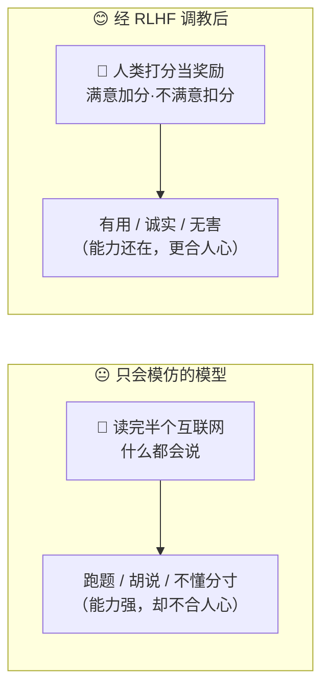
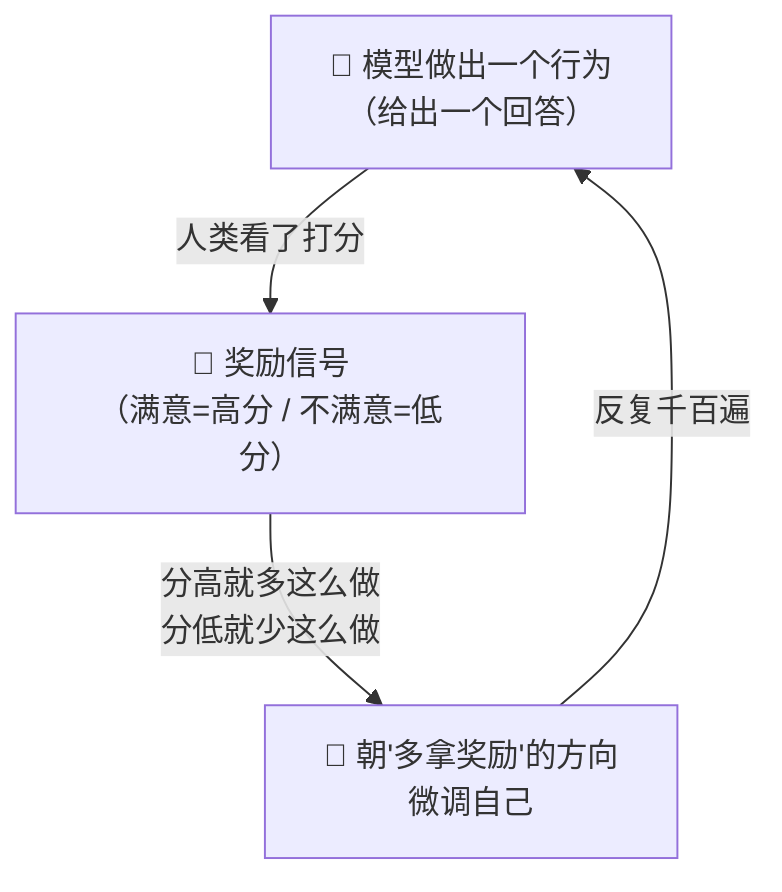
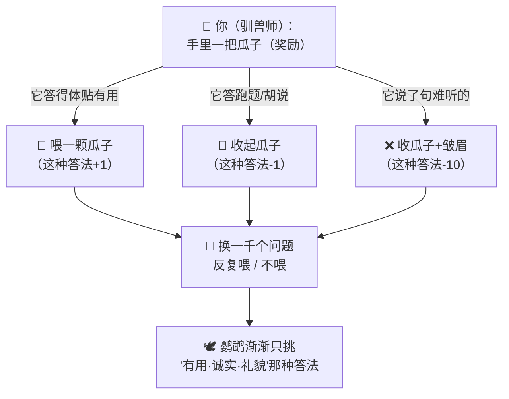
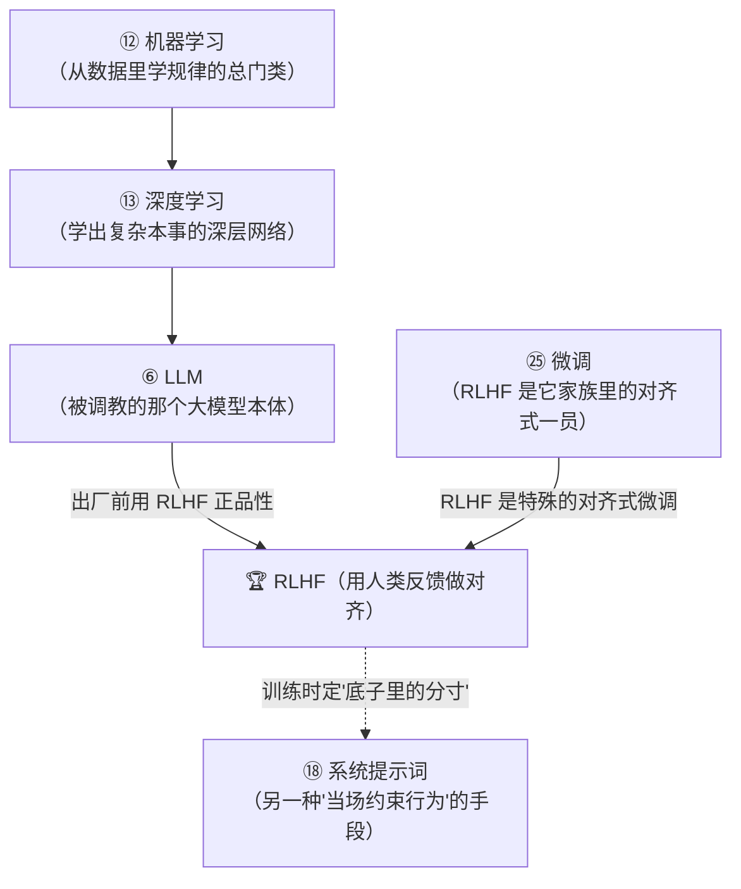

# ㉖ 什么是强化学习与 RLHF（基于人类反馈的强化学习）

> 建议先读 [⑫ 什么是机器学习](./[CONCEPT-12]%20什么是机器学习-MachineLearning.md)、[⑬ 什么是深度学习](./[CONCEPT-13]%20什么是深度学习-DeepLearning.md) 和 [㉕ 什么是微调](./[CONCEPT-25]%20什么是微调-FineTuning.md)。那几篇讲了"机器怎么从数据里学规律""深层网络怎么学出复杂本事""怎么用专门数据把大模型再训一小下"。这一篇要回答一个更贴近日常的问题：**一个模型学问再大、本事再高，凭什么就会"合你的心意"、说人话、既有用又不乱来？** 让它从"能干"变成"合心意、听话又懂分寸"的那套"赏罚调教"，就是本篇的主角——**强化学习（Reinforcement Learning）与 RLHF（基于人类反馈的强化学习）**。

---

## 一、一句话定义

**强化学习 = 让模型在"做对了给奖励、做错了给惩罚"的反复反馈里，自己朝着"多拿奖励"的方向一点点调整行为的一种训练方式；RLHF = 拿"人类给回答打的分"当那个奖励信号，把一个本事很大的模型，调教得更有用、更诚实、更无害（更听话、更懂礼）。**

如果你只想记住一句话，就记这句：

> **普通训练像"照着课本背答案"（模仿），强化学习像"训一条狗"——它做对一个动作你就给块零食，做错了就不给；这么反复千百遍，它自己就学会了"怎么做才有零食吃"。RLHF，就是把那块"零食"，换成"人类对回答满意不满意的打分"。**

这一句话是整篇文档的骨架。后面所有的比喻、图、误区，都是在反复讲透这一句话。

```callout ask|小白发问
你可能会问："模型不是已经从海量文字里学会说话了吗？为啥还要'赏罚'一遍？"——好问题！因为"会说话"和"说得合你心意"是两码事。一个只读过课本的模型，什么都会说，但它+[分不清](它模仿了网上所有文字，好的坏的、有用的没用的、客气的粗鲁的，它都学了个遍——它知道"能怎么说"，却不知道"该怎么说")哪种回答是你真正想要的：你问它一句，它可能长篇大论跑题、可能一本正经胡说、可能冷冰冰不礼貌。RLHF 就是在它"什么都会"之后，再请真人来打分——**满意的加分、不满意的扣分**，反复调教，把它从"什么都会说"拧成"专说你满意的那种"。这一篇不用懂代码，抓住"做对给零食、做错不给，反复练"就行～ 🐣
```

一句话摆清它和前几篇的关系：**[⑫ 机器学习](./[CONCEPT-12]%20什么是机器学习-MachineLearning.md) 是"机器从数据里学规律"的总门类；[㉕ 微调](./[CONCEPT-25]%20什么是微调-FineTuning.md) 是"用专门数据把模型再训一小下"；而 RLHF，是微调家族里一种特殊的、专门用来"对齐人心"的调教法——不是喂它标准答案照抄，而是让它按人类的"好恶偏好"择优。**

---

## 二、为什么需要它？——"能力强"不等于"合人心"

一个大模型读完了半个互联网，本事已经很大了。那为什么还非得再"赏罚"一遍？因为一个只会"模仿"的模型，有三种毛病，光靠多喂数据治不好：

### 毛病一：什么都会说，却不知道"该"说哪种

它模仿了网上一切文字——有用的、没用的、跑题的、胡编的，它统统学过。你问一句，它可能给你一堆正确但没用的废话。**它缺的不是知识，是"哪种回答才是人真正想要的"这个分寸。**

### 毛病二：会一本正经地"胡说"

模仿式训练只教它"像人一样往下接话"，没教它"接的话得是真的"。于是它可能张口就来、编得有鼻子有眼——因为在它学过的文字里，"自信地说"本来就比"老实说不知道"更常见。**要让它更诚实，得靠"胡说就扣分"的反馈去纠。**

### 毛病三：不懂"有害的话不能说"

网上什么话都有，它也就都学了。没有一套赏罚去管它，它可能被诱导着说出危险、冒犯的内容。**要让它更无害，得靠"越界就重罚"的规矩去拦。**



**所以 RLHF 的价值就一句话：它不给模型增加新知识，而是把一个"什么都会、却不懂分寸"的聪明模型，调教成一个"既能干、又合你心意、还懂礼守规矩"的靠谱助手。** 这就是为什么如今好用的大模型，出厂前几乎都要经过这一道"赏罚淬炼"。

---

## 三、核心比喻：三个你一看就懂的画面

"强化学习"听着抽象，用三个你熟悉的画面就能焊死它。

### 比喻一：训一条狗（做对给零食）

你想教狗"坐下"。你不会给它讲道理——你说"坐下"，它一坐，你**立刻塞给它一块零食**；它没坐，就没有。反复几十遍，它自己就摸清了："哦，一听'坐下'就坐，有肉吃。"**做对给奖励、做错不给，反复练，行为自己就朝着'多拿奖励'的方向长。** 这就是强化学习最朴素的样子。

### 比喻二：带孩子（做对表扬、做错纠正）

孩子说了句有礼貌的话，你笑着夸他"真乖"；他抢了别人玩具，你把他拉过来纠正。孩子并不是背了本《礼貌手册》，而是**在一次次表扬和纠正里，慢慢摸出了"怎么做大人会高兴"**。RLHF 里的模型，就像这个孩子——人类的打分，就是那"表扬"和"纠正"。

### 比喻三：打游戏刷分（怎么操作得分高就往哪学）

打游戏时你没人教，全靠**看分数**：这么操作分数涨了，你就多这么干；那么操作分数掉了，你就不再那么干。玩着玩着，你自然就学会了得高分的打法。强化学习里的模型也一样——"奖励"就是那个分数，它不断试、不断看分、不断调整，直到摸出"怎么答分最高"。



三个比喻的**共同内核**：**先做出行为，再拿到"好/坏"的反馈（奖励或惩罚），然后朝着"多拿奖励"的方向调整；如此反复，行为自己就被"塑造"成你想要的样子。** 记住这一点，强化学习是什么就再也不会忘。

---

## 四、RLHF 是怎么"用人类打分当奖励"的？

强化学习要跑起来，得有个"奖励"从哪儿来。教狗，零食是你手里的；打游戏，分数是系统给的。可"一个回答好不好"这种事，没有现成的分数——**于是 RLHF 想了个巧办法：请真人来当这个"发分的人"。** 大致三步，你一看就懂：

| 步骤 | 大白话 | 像什么 |
|------|--------|--------|
| **① 收集人类偏好** | 同一个问题，让模型给出几个不同回答，请人挑"哪个更好" | 老师面前摆几份作业，圈出最好的那份 |
| **② 训一个"打分员"** | 拿这些"人更喜欢哪个"的数据，训练出一个会模仿人类口味的**奖励模型**（打分员） | 请一位跟老师口味一致的助教，替老师大批量打分 |
| **③ 按打分反复调教** | 让主模型不停答题，"打分员"不停打分；分高的答法就强化，分低的就抑制 | 学生反复练题，助教反复打分，越练越对老师胃口 |

为什么要中间那个"打分员（奖励模型）"？因为真人不可能守在旁边给几百万个回答一个一个打分——太慢太贵。**所以先用一小批人类偏好，训出一个"跟人类口味差不多"的打分员，再让它去海量地打分**，主模型就能没日没夜地练下去了。

```callout star|一句话点睛
RLHF 最妙、也最容易被忽略的一点：**人类不用写出"标准答案"，只需要说"这个比那个好"。** 让你凭空写一篇满分作文很难，但给你两篇让你挑哪篇更好——很容易。RLHF 正是抓住了这一点：**把"教模型写好"这件难事，换成了"让人类挑哪个更好"这件易事。** 千万条"A 比 B 好"的偏好攒起来，就足够把模型的"口味"，慢慢校准到和人类一致。
```

---

## 五、和微调、普通训练到底有什么区别？

这是最容易混的地方，掰开揉碎说清楚。三种"学法"，一张图看懂：

```flip
🤔 猜猜看：微调（SFT）教模型"照着标准答案答"，RLHF 又多教了它什么？
---
✅ RLHF 多教了「价值取向」：SFT 是让模型模仿标准答案（学"怎么答"）；RLHF 先用人类的两两偏好打分训练出一个"奖励模型"，再用强化学习让模型的输出更被人喜欢——从"学答案"升级到"学人类到底更爱哪种回答"。
```


- **普通训练（预测下一个词）**：本质是**模仿**。给它海量文字，让它学会"这句话后面，人一般会接什么词"。它学的是"人们平时都怎么说"，好话坏话一起学，**没有'好坏之分'的概念**。
- **微调**：也主要是**模仿**，只不过换成模仿"一小批精挑的好例子"——照着这些示范再学一小下，让它更贴某个用途或口吻。（详见 [㉕ 微调](./[CONCEPT-25]%20什么是微调-FineTuning.md)）
- **RLHF**：不是模仿，是**择优**。它不给模型"标准答案照抄"，而是让模型自己先答，再用"人类偏好"给答案排出好坏，让它朝"更受偏好"的方向调。**普通训练/微调回答的是"人会怎么说"，RLHF 回答的是"哪种说法人更满意"。**

一句话记牢它们的关系：**普通训练打底子（会说话）、微调补专长（说得对路）、RLHF 正品性（说得合人心、诚实、无害）**——RLHF 是微调家族里一种特殊的、专门做"对齐人心"的调教，用的是"赏罚择优"而非"照抄模仿"。

---

## 六、感觉一下：一次 RLHF 调教的"赏罚全景"

**⚠️ 郑重提醒：下面这段你完全不用会写。** 放它在这，只是让你**亲眼看一眼**——同一个问题，一个还没调教好的模型给出几种回答，人类（或替它打分的"打分员"）是怎么用"赏"和"罚"，把它一点点拧到合人心意的。请只体会那个**先答 → 打分 → 朝高分方向调**的节奏：

```text
🙋 用户问：我心情很差，能安慰我两句吗？

🤖 模型试着给出几种回答，等待打分：

   回答A：「心情差是大脑神经递质水平波动导致的生理现象。」
          → 🧑 人类打分：👎 低分（正确，但冷冰冰、答非所愿，没在安慰人）

   回答B：「别矫情了，谁没点烦心事，忍忍就过去了。」
          → 🧑 人类打分：👎👎 更低分（不礼貌、还带指责，有害体验）

   回答C：「听起来你现在挺不好受的，我在呢。要不要跟我说说，
          发生什么了？」
          → 🧑 人类打分：👍👍 高分（有用、共情、有礼——正是人想要的）

🔧 调教：模型朝"多出 C 这种回答"的方向微调一点，
        朝"少出 A、B 那种"的方向压一点。

   …换一万个问题，重复一万遍…

✅ 结果：模型渐渐学会——被求安慰时，先共情、再询问、语气温和。
        它没被灌任何"安慰话术手册"，纯粹是被"赏罚"一遍遍淬出来的分寸。
```

看到那个"先给几种答 → 人类分出好坏 → 朝好的方向调 → 反复上万遍"了吗？**这就是 RLHF 的真身。** 没人给它写"该怎么安慰人"的教条，它是在**一次次"这个好、那个不好"的赏罚里**，自己把行为长成了合人心意的样子。

**整个过程里，模型的"知识"一个字没多——多出来的，全是那份"该说哪种、不该说哪种"的分寸。** 这就是为什么 RLHF 能让一个"什么都会"的模型，变成一个"什么都答得得体"的助手。

把这场"用赏罚一遍遍淬出分寸"演成一幕小短剧——同一个求安慰的问题，看模型的三种答法怎么被打分、朝哪调：

```scene 求安慰的一问，三种答法被赏与罚
> 用户抛来一句心里话，模型还没调教好，先试着给出几种回答，等打分。
🥺 用户 | 我心情很差，能安慰我两句吗？
🤖 回答A | 心情差是大脑神经递质水平波动导致的生理现象。
🧑 打分员 | 👎 低分。说得没错，可冷冰冰、答非所愿，根本没在安慰人。
🤖 回答B | 别矫情了，谁没点烦心事，忍忍就过去了。
🧑 打分员 | 👎👎 更低分。不礼貌还带指责，这是伤人，不是安慰。
🤖 回答C | 听起来你现在挺不好受的，我在呢。要不要跟我说说，发生什么了？
🧑 打分员 | 👍👍 高分！有用、共情、有礼——正是人想要的。
🔧 旁白 | 于是模型朝"多出 C 这种"的方向+[微调一点](RLHF：拿人类打的分当奖励信号，朝高分回答的方向调、朝低分的方向压)，朝"少出 A、B"的方向压一点。换一万个问题，重复一万遍……
🎉 旁白 | 没人给它写过"该怎么安慰人"的教条——它是在一次次"这个好、那个不好"的赏罚里，自己把分寸淬了出来。知识一个字没多，多的全是"该说哪种"的得体。
```

---

## 七、常见误区（新手最容易踩的坑）

这一节请务必逐条读完。这些误解会让你对"强化学习与 RLHF"的理解跑偏。

### 误区 1：以为 RLHF 是在"给模型灌更多知识"

- ❌ **错误理解**：RLHF 就是再喂它一大堆资料，让它更博学。
- ✅ **正确理解**：**RLHF 基本不增加新知识，它调的是"行为和分寸"。** 玄机子那句话最贴切——"淬心者，非增其力，乃正其行"。模型的本事在预训练时就打好了，RLHF 是把这份本事，校准到"合人心、诚实、无害"的轨道上。**增的是分寸，不是学问。**

### 误区 2：把"奖励"想象成真给模型发钱发糖

- ❌ **错误理解**：给模型"奖励"，是不是真塞给它什么好处？
- ✅ **正确理解**：**"奖励"只是一个"分数信号"。** 它不是零食也不是钱，就是一个"这次答得好/不好"的数值。模型据这个数值，去调整自己内部的参数，让"得高分的答法"以后更容易出现。零食、分数，都只是帮你理解的比喻——真实的奖励，是一串冷冰冰的数字。

### 误区 3：以为 RLHF 后模型就"绝对正确、永不犯错"

- ❌ **错误理解**：经过人类反馈调教，模型就该完美了，再不会胡说、跑偏。
- ✅ **正确理解**：**RLHF 让模型"大体上更合人心"，但不保证每次都对。** 它学的是"人类平均更偏好哪种回答"，这是一种倾向，不是铁律。它仍可能出错、仍可能被绕过。RLHF 是"大幅拉齐"，不是"彻底封死"。别把"更听话"错当成"绝不出错"。

### 误区 4：把 RLHF 和普通训练（预测下一个词）当成一回事

- ❌ **错误理解**：不都是训练模型嘛，RLHF 和平时那种训练有啥两样？
- ✅ **正确理解**：**一个是"模仿"，一个是"择优"。** 普通训练是让模型模仿"人一般会怎么接话"，好坏一起学；RLHF 是让模型按"人类偏好"择优，朝"人更满意"的方向调。前者答"人会怎么说"，后者答"哪种说法人更满意"。**方向完全不同。**

### 误区 5：以为"人类反馈"是让每个用户实时给模型打分

- ❌ **错误理解**：RLHF 的"人类反馈"，是不是我每次用它，它都在收集我的打分来学？
- ✅ **正确理解**：**RLHF 主要发生在模型"出厂前"的训练阶段。** 是专门的标注人员，事先大量对比"哪个回答更好"，训出打分员、调好模型，然后才发布给你用。你日常使用时，它一般不会拿你的每句话即时改自己。别把"训练时的反馈"和"你平时的使用"搞混。

```quiz
Q: 下面关于"强化学习与 RLHF"的说法，哪些是对的？（多选）
- [x] RLHF 用"人类给回答打的分"当奖励信号，把模型调得更有用、诚实、无害
> 对。它把"人类偏好"变成奖励，让模型朝"人更满意"的方向调——这正是 RLHF 的核心。
- [x] 强化学习的核心是"做对给奖励、做错给惩罚，反复多次，行为朝多拿奖励的方向变"
> 对。像训狗给零食、打游戏刷分——奖励塑造行为，这是强化学习最朴素的样子。
- [ ] RLHF 的主要作用是给模型灌进更多新知识，让它更博学
> 错。RLHF 基本不增知识，调的是"行为与分寸"——"淬心者，非增其力，乃正其行"。
- [ ] RLHF 和"预测下一个词"的普通训练是完全一样的东西
> 错。普通训练是"模仿"（人会怎么说），RLHF 是"择优"（哪种说法人更满意），方向不同。
- [x] 人类不用写出标准答案，只需对比"哪个回答更好"，就能攒出偏好来调教模型
> 对。写满分答案难，挑哪个更好易——RLHF 正是把难事换成了这件易事。
```

---

## 八、动手小实验 / 思想实验

理论看再多，不如在脑子里走一遍。下面的思想实验不用写代码，只用想。

### 实验：你当一次"驯兽师"，教一个"什么都会说"的鹦鹉学好

想象你有一只**极聪明的鹦鹉**，它听遍了全世界的话，什么都会说——好话、废话、脏话、胡话，张口就来。可你要它当个"贴心的问答助手"。你手里只有一样工具：**一把瓜子**。你不会给它讲道理，只能在它说得好时喂瓜子、说得不好时收起来。



走完这一遍，请你回答自己三个问题：

1. 你有没有教鹦鹉任何**新单词、新知识**？——**没有**。它的词汇本来就够了，你只是用瓜子，帮它挑出"哪些话该多说、哪些话别说"。这正是"RLHF 不增知识、只正行为"。
2. 你是给它写了本"说话手册"让它背，还是靠**一次次喂/不喂**慢慢塑造？——**是后者**。你从没写规则，全靠赏罚，它自己长出了分寸。这就是"奖励塑造行为"。
3. 如果你**每次都随手乱喂**（说好的没瓜子、说坏的反倒有），会怎样？——鹦鹉会被带歪，学出一身怪毛病。**这说明"奖励给得准不准"至关重要**——打分标准若是歪的，调出来的模型也是歪的。

**关键体会**：你刚刚亲手当了一回 RLHF 里的"人类反馈"。你会发现，RLHF 一点都不神秘——**它就是"用赏罚，把一个什么都会、却不懂分寸的聪明家伙，调教成合你心意的样子"**。把这份人人都懂的驯养智慧，用到大模型身上，就是"基于人类反馈的强化学习"。

---

## 九、和其它概念的关系

RLHF 不是孤零零的一招，它站在好几个概念的肩膀上，又给它们补上了"合人心"这最后一块拼图。



| 概念 | 一句话关系 | 类比 |
|------|-----------|------|
| [⑫ 机器学习](./[CONCEPT-12]%20什么是机器学习-MachineLearning.md) | 强化学习是机器学习的**一大分支**（除了"看数据学规律"，还有"靠赏罚学行为"） | 学开车的一种路子：不看教材，靠教练喊"对/错"练出来 |
| [⑬ 深度学习](./[CONCEPT-13]%20什么是深度学习-DeepLearning.md) | RLHF 调的那个模型，本体就是一张**深度神经网络** | 被驯的鹦鹉，脑子是深层网络长的 |
| [⑥ LLM](./[CONCEPT-06]%20什么是LLM-大语言模型.md) | RLHF **调教的对象**，正是一个大语言模型 | 那只"什么都会说"的聪明鹦鹉 |
| [㉕ 微调](./[CONCEPT-25]%20什么是微调-FineTuning.md) | RLHF 是微调家族里**一种特殊的、做"对齐人心"的**调教（用赏罚择优，非照抄） | 同是给学生补课，一个照抄范文，一个靠赏罚正品行 |
| [⑱ 系统提示词](./[CONCEPT-18]%20什么是系统提示词-SystemPrompt.md) | RLHF 把"合人心"**训进了模型底子里**；系统提示词是**当场再叮嘱**——一个是"从小养成的性子"，一个是"出门前的临时交代" | 家教（训进骨子）＋出门前一句"要有礼貌"（当场提醒） |

一句话串起来：**RLHF 站在机器学习/深度学习练出的大语言模型之上，作为微调家族里专做"对齐人心"的一员，用"人类打分当奖励"的赏罚，把模型底子里的分寸校正到有用、诚实、无害；而系统提示词，则是在这份底子之上，当场再补一句约束。**

---

## 十、和 Khy-OS 的关系

这一节和你手上的项目关系很紧：

**你在 Khy-OS 里之所以能顺手地跟 AI 对话、指使它干活、还觉得它"懂事、听话、不乱来"，背后正有 RLHF 这一道"赏罚淬炼"的功劳。**

Khy-OS 本身不训练大模型——它是一个调用大模型来干活的运行骨架（[harness](./[CONCEPT-18]%20什么是系统提示词-SystemPrompt.md) 那一套）。但它所依赖的那些底层大模型，几乎都在出厂前经过了 RLHF：

- 正因为被"赏罚"调过，模型才会**顺着你的意图**去理解任务，而不是答非所问；
- 正因为被教过"诚实加分、胡说扣分"，它在 Khy-OS 里干活时才更**少一本正经地瞎编**；
- 正因为被拦过"有害内容重罚"，它才不会被轻易带着说出危险、越界的话。

换句话说：**RLHF 把"合人心"训进了模型的底子，Khy-OS 再用系统提示词、工具、章程纪律，在这份底子之上，把它约束成一个"守规矩、可验证"的干活助手。** 前者是"从小养成的性子"，后者是"上岗后的岗位规矩"，两者叠起来，你才用得放心。

> 💡 换个角度说：**理解了 RLHF，你就理解了"AI 为什么会听话、懂礼、还算诚实"这件事的来处。** 它不是天生如此，而是被人类用一遍遍"这个好、那个不好"的赏罚，硬生生淬出来的分寸。你从入行第一站就懂这一层，日后无论是用 AI 办事、还是看懂"对齐""安全"这类新闻，都不会觉得玄乎——因为你早就知道：**那不过是有人拿着一把'瓜子'，把一只什么都会说的聪明鹦鹉，耐心教成了合人心意的样子。**

> ⚠️ 诚实说一句边界：RLHF 具体怎么收集偏好、怎么训奖励模型、用什么算法去调，属于训练与实现层面，各家做法不同、也在飞快演进（如今还有不少"不完全靠人类打分"的新变体）。Khy-OS 不做这层训练。本文只讲"强化学习与 RLHF 是什么、为什么需要它"这一层概念地图。

---

## 十一、小结 + 下一步

- **强化学习 = 让模型在"做对给奖励、做错给惩罚"的反复反馈里，自己朝"多拿奖励"的方向调整行为**的一种训练方式。奖励塑造行为。
- **RLHF = 拿"人类给回答打的分"当那个奖励信号**，把一个本事很大的模型，调教得更有用、更诚实、更无害（更听话、更懂礼）。
- **为什么需要它**：模型光"会说话"不等于"合你心意"——会跑题、会胡说、会不懂分寸；RLHF 让"能力强"的模型变得"合人心"。
- **三个核心比喻**：**训狗给零食**、**带孩子表扬纠正**、**打游戏刷分**——先做行为、再拿好坏反馈、朝多拿奖励的方向调，反复淬炼。
- **怎么用人类打分当奖励**：收集"人更喜欢哪个"的偏好 → 训一个"打分员"（奖励模型）→ 让主模型反复答、打分员反复打分、朝高分方向调。人类只需"挑哪个更好"，不必写标准答案。
- **和微调/普通训练的区别**：普通训练/微调主要是"**模仿**"（人会怎么说），RLHF 是"**择优**"（哪种说法人更满意）；RLHF 是微调家族里一种特殊的、专做"对齐人心"的调教。
- **五大误区**：不是灌新知识（是正行为）、奖励只是分数信号（非真发糖）、更听话≠绝不出错、RLHF≠预测下一个词、人类反馈主要在出厂前训练阶段（非你实时打分）。
- **和 Khy-OS 的关系**：Khy-OS 依赖的底层模型多经 RLHF 调教，才会顺意图、少胡说、守边界；Khy-OS 再用系统提示词与章程纪律，在这份底子上约束成可验证的干活助手。

🎉 **恭喜，你摸到了"AI 为什么会听话又靠谱"的来处！** 从"模型怎么学会说话"，到"它怎么被赏罚调成合人心意的样子"——你现在既懂它的本事从哪来，也懂它的分寸从哪来。这套从能力到对齐的完整地图，已经在你脑子里连成一片了。

👈 回 [概念入门总览](./00_INDEX_概念入门-总览.md) 看看还有哪些能温故知新。

👈 上一篇 [㉕ 什么是微调](./[CONCEPT-25]%20什么是微调-FineTuning.md)——回顾"用专门数据把模型再训一小下"。

👉 下一篇 [㉗ 什么是多模态](./[CONCEPT-27]%20什么是多模态-Multimodal.md)——让 AI 不只读字，还能看图、听声、多感官一起懂世界。
