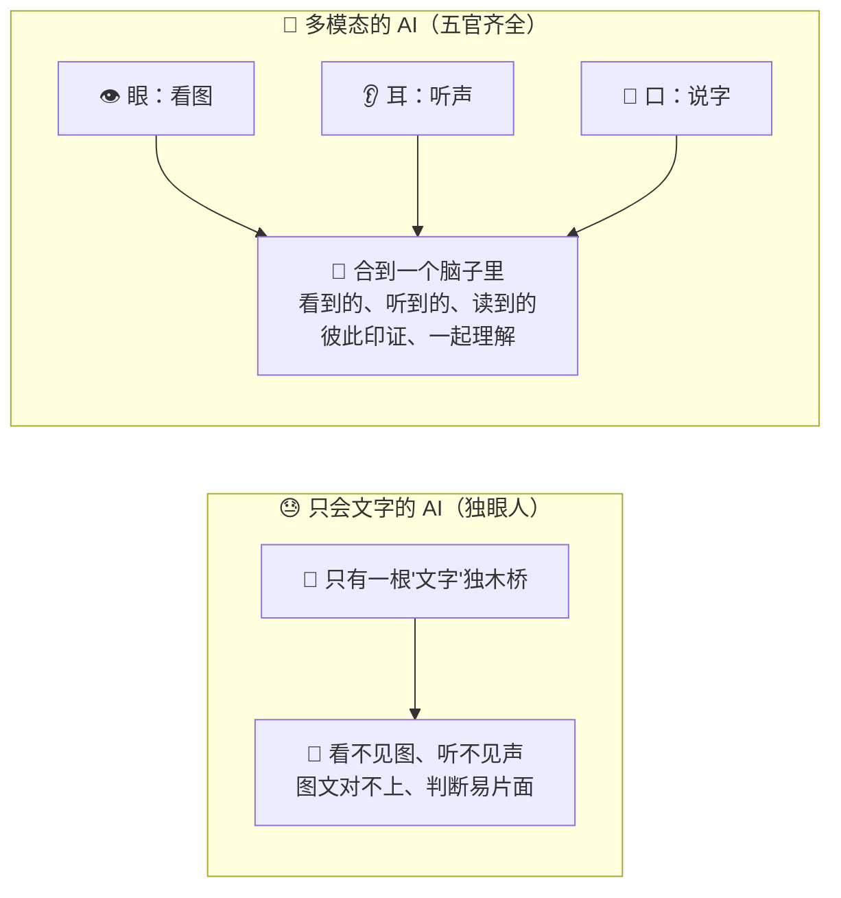
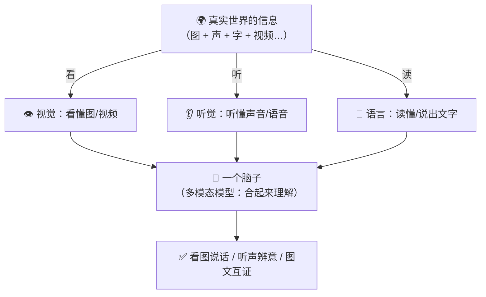
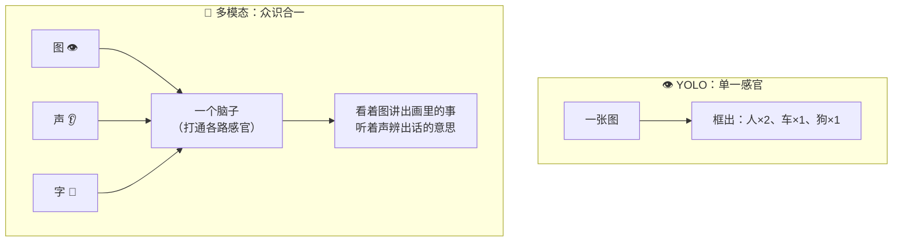
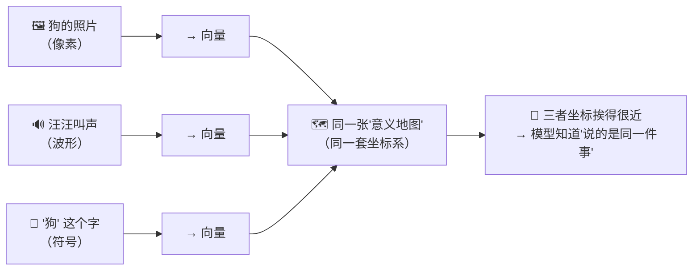
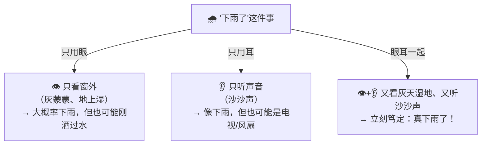
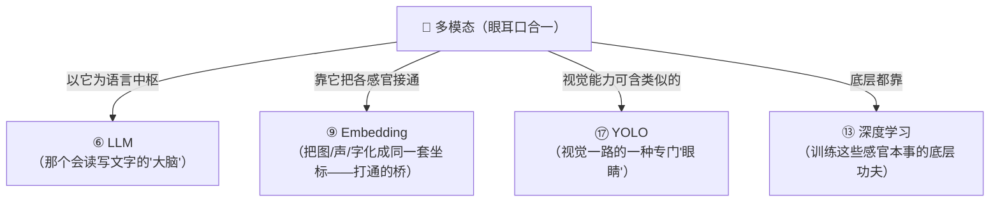

# ㉗ 什么是多模态（Multimodal）

> 建议先读 [⑰ 什么是 YOLO](./[CONCEPT-17]%20什么是YOLO-实时目标检测.md) 和 [⑨ 什么是 Embedding](./[CONCEPT-09]%20什么是Embedding-向量.md)。那两篇讲了"AI 怎么用'眼睛'实时看图找东西""怎么把万物化成一串坐标数字、让它们能互相比较"。这一篇要回答一个更大的问题：**一个 AI 如果只会读文字，就像一个只有耳朵、没有眼睛的人——听得见、却看不见。那能不能让它'眼、耳、口'一起上，既看得懂图、又听得懂声、还答得出话，把好几种'感官'打通、合到一个脑子里一起理解？** 这门"六识齐全"的本事，就是本篇的主角——**多模态（Multimodal）**。

---

## 一、一句话定义

**多模态 = 让一个 AI 模型不只会处理文字这一种"感官"，而是能同时理解图像、声音、视频等多种信息，并把它们打通、放在一起统一理解。**

如果你只想记住一句话，就记这句：

> **只会读文字的 AI，像一个"独眼人"——只有一种感官；多模态的 AI，像一个"眼耳口鼻齐全"的正常人——看得见图、听得见声、说得出话，还能把看到的和听到的对上号、一起想明白。**

这一句话是整篇文档的骨架。后面所有的比喻、图、误区，都是在反复讲透这一句话。

```callout ask|小白发问
你可能会问："我平时用 AI，不就是打字问、它打字答吗？它不本来就'只会文字'吗？"——好问题！早期的 AI 确实是这样，只有"文字"这一根"独木桥"。可现实里，信息哪只有文字？你发一张菜单照片问"这道菜多少钱"、发一段语音问"这歌是什么"、拍一张报错截图问"我代码哪错了"——这些里头有图、有声，光会读字的 AI 只能干瞪眼。多模态就是给它+[补上眼睛和耳朵](还记得 [⑰ YOLO](./[CONCEPT-17]%20什么是YOLO-实时目标检测.md) 那只"看图找东西"的眼睛吗？多模态是把那样的眼睛、耳朵、嘴巴，全合进一个脑子里)，让它能"看图说话、听声辨意"。这一篇不用懂代码，抓住"从独眼人到五官齐全"就行～ 🐣
```

一句话摆清它和前几篇的关系：**[⑥ LLM](./[CONCEPT-06]%20什么是LLM-大语言模型.md) 是"一个很会读写文字的大脑"；多模态，是给这个大脑再接上"眼睛、耳朵、嘴"——从"只会读字"升级到"六识齐全"。**

---

## 二、为什么需要多模态？——只会读字的三种尴尬

一个只会文字的 AI 已经很能干了，那为什么还要"眼耳口鼻齐上"？因为现实里有三种活，光会读字就干得很尴尬：

### 场景一：信息本来就不是文字

你拍一张 X 光片问"有没有骨折"、发一张设计图问"这按钮该放哪"——**这些信息天生长在"图"里，不是"字"里**。你逼一个只会读字的 AI 去看，它两眼一抹黑。得有"眼睛"，才看得见图里的门道。

### 场景二：要把"看到的"和"读到的"对上号

一张商品照片配一段文字描述，你问"图里这件和描述说的是同一件吗？"——这就得**同时看懂图、又读懂字，还得把两边对上号**。只有一种感官的 AI，永远做不到"图文互相印证"。

### 场景三：一种感官容易片面，多种感官才全面

只听声音，你分不清是猫叫还是婴儿哭；配上画面一看，立刻就清楚了。**多种感官凑在一起、彼此补充，理解才不会偏、不会漏**——就像人判断一件事，从来都是眼睛、耳朵一起用。



**所以多模态的价值就一句话：让 AI 从"只有一种感官"变成"多种感官齐全"，看得见、听得见、还能把它们对上号一起想——又全面、又贴近真实世界。** 这就是为什么现在越来越多的 AI，开始"眼耳口鼻一起上"。

---

## 三、核心比喻：从独眼人到五官齐全

"多模态"这个词听着抽象，用两个你熟悉的画面就能焊死它。

### 比喻一：人的五官，一起感知世界

你认识一个朋友，从来不是只靠一种感官——你**看**他的脸、**听**他的声音、也许还记得他说过的话。哪天他戴了口罩、变了发型，你光看脸认不出，一开口，声音一下就对上了。**眼、耳、口鼻各管一路，凑在一起，你对这个人的认识才立体、才不会认错。**

**只用一种感官 = 只会文字的 AI（容易看走眼）；五官一起用 = 多模态的 AI（立体、全面）。** 感官越全，理解越准。

### 比喻二：独眼人 vs 眼耳口鼻齐全的人

一个只有一只眼睛、还听不见的人，走在街上：他看得见红灯，却听不见背后按喇叭的车；他听得见喊声，却看不清是谁在喊。**信息缺了一半，做判断就容易出错。** 而一个眼耳口鼻齐全的人，看、听、说样样能来，各路信息一凑，世界在他眼里就完整了。

**独眼人 = 单一模态（只文字，或只图）；五官齐全的人 = 多模态。** 差别不在哪只眼睛更亮，而在"感官全不全"。



两个比喻的**共同内核**：**理解一件事，感官越多越全面；把好几种感官合进"一个脑子"、让它们彼此印证，就是多模态。** 记住这一点，多模态是什么就再也不会忘。

---

## 四、多模态和"只会看图的 YOLO"，差在哪？——单一感官 vs 众识合一

学过 [⑰ YOLO](./[CONCEPT-17]%20什么是YOLO-实时目标检测.md) 的你可能会问：YOLO 不也是"看图"吗？它跟多模态是一回事吗？——**这里差着一个大台阶，务必分清。**

**YOLO 是一双专门的"眼睛"**：它极擅长"看一张图、飞快地框出里面有什么（人、车、猫、狗）"，又快又准。但它**只有这一种感官**——它看得见图，却不会读你打的字、听不懂你说的话，更没法"看着一幅画、用一段话讲出画里的故事"。它是个"看图专家",专而单一。

**多模态是"眼睛 + 耳朵 + 嘴"合到一个脑子里**：它不光能看图（像 YOLO 那只眼），还能同时读文字、听声音，并且——**最关键的一点——能把这几路感官打通**。你给它一张图，它能"看着图、用话回答你的问题"；你给它一段语音，它能"听着声、辨出你说的意思"。

| 对比 | YOLO（单一感官） | 多模态（众识合一） |
|------|------------------|--------------------|
| 有几种感官 | 只有"眼睛"（看图） | 眼 + 耳 + 口（图、声、字） |
| 会做什么 | 框出图里有什么东西 | 看图说话、看图答题、听声辨意、图文互证 |
| 感官之间 | 只此一路，不通别的 | **彼此打通**，看到的能用话讲、听到的能对上字 |
| 像什么 | 一台专门的"识物摄像头" | 一个眼耳口鼻齐全的人 |



**一句话记牢：YOLO 是多模态那"一只眼睛"里的一种专门本事；多模态是把眼、耳、口全合到一个脑子里，还让它们互相通气。** 单一感官很强，但"众识合一"才更接近人理解世界的方式。

---

## 五、不同"感官"怎么打通？——都化成同一套"坐标"

多模态最神奇、也最容易觉得"这怎么可能"的地方是：**图是像素、声是波形、字是符号，长得八竿子打不着，模型凭什么把它们"对上号"、一起理解？**

答案，正藏在你学过的 [⑨ Embedding（向量）](./[CONCEPT-09]%20什么是Embedding-向量.md) 里。

还记得 Embedding 干的事吗？——**把任何东西，都化成一串数字坐标，意思相近的，坐标就挨得近。** 多模态的诀窍就是：**不管是图、是声、还是字，统统化成同一套"坐标系"里的向量**。于是——

- 一张"狗"的照片，化成的坐标，会和"狗"这个字化成的坐标**挨得很近**；
- 一段"汪汪"的叫声，化成的坐标，也落在"狗"附近。

图、声、字，三条路进来，最后**都汇到同一张"意义地图"上**。挨得近的，模型就知道"它们说的是同一件事"。这就是"打通"——**不是硬把像素和文字焊在一起，而是让它们在同一套坐标里各自找到自己的位置，从此能互相比较、互相印证。**



看懂这张图，你就摸到了多模态的"内功心法"：**Embedding 是那座把不同感官接通的桥。** 有了"万物皆可化成同一套坐标"这一招，图、声、字才有了一种**共同的语言**，才谈得上"打通、一起理解"。这也是为什么我们建议你先读 Embedding 那一篇——它是多模态背后真正的功臣。

```flip
既然图、声、字都能化成向量、都能打通，那是不是"感官加得越多、模态堆得越杂，模型就一定越聪明"？（点一下翻到背面）
---
不是！多接一种感官，是有"代价"的：模型要学会看图、又学会听声、还得学会把它们对齐到同一套坐标——这本身又难又费料，训练不好，反而"样样通、样样松"，看图看得糊、听声听得偏。而且很多任务压根用不上那么多感官：你就想让它读一段文字、改一段代码，硬塞进"听觉""视觉"纯属浪费。**该用几种感官，看你要办的是什么事**——需要看图就配眼睛，需要听声就配耳朵，用不上的不必硬凑。多模态的智慧，是"按需配感官、并且把配上的每一种都打通用好"，而不是无脑地"感官越多越好"。
```

---

## 六、感觉一下：多模态是怎么"看图说话"的

**⚠️ 郑重提醒：下面这段你完全不用会写。** 放它在这，只是让你**亲眼看一眼**——一个多模态 AI 拿到一张图、又收到你一句文字提问时，脑子里那个"看 + 读 + 一起想"的过程长什么样。请只体会那个**多路感官汇到一处、再一起给答案**的节奏：

```text
🙋 你发来：一张照片（图里：一只金毛趴在草地上，叼着一个红色飞盘）
         配一句话："它嘴里叼的是什么？"

👁️ 眼（视觉）：看这张图 → 化成坐标 → 认出"金毛狗""草地""红色圆盘状物"
📝 口（语言）：读你这句话 → 化成坐标 → 明白你在问"嘴里那个东西"

🧠 一个脑子（把两路坐标凑到一起想）：
   图里"红色圆盘状物"的坐标 ≈ "飞盘"这个词的坐标 → 对上号了！
   你问的"嘴里叼的" → 定位到图里狗嘴那块 → 正是那个红圆盘

✅ 它回答你：
   "它嘴里叼着一个红色的飞盘，正趴在草地上，看起来玩得挺开心。"
```

看到那个"眼看图、口读字、脑子把两路凑一起、再给一句既贴图又答你问的话"了吗？**这就是多模态的真身。** 模型不是只看了图、也不是只读了字——它是**把看到的和读到的，在同一套坐标里对上了号，才答得又准又贴切**。

**整个过程里，"看"和"读"是两路感官，而真正的本事，在那"合到一起想"的一步。** 这就是为什么多模态能干成"看图说话、看图答题、听声辨意"这些单靠一种感官办不到的事。

把这场"看图说话"演成一幕小短剧——重点看眼、口两路感官各自认出什么，以及那"凑到一起想"的临门一步：

```scene 它嘴里叼的是什么：眼看图、口读字、脑子合一处
🧑 你 | （发来一张照片：金毛趴草地、叼着个红色飞盘）配一句话：它嘴里叼的是什么？
👁️ 眼·视觉 | 我看这张图 → 化成坐标 → 认出"金毛狗""草地""红色圆盘状物"。
📝 口·语言 | 我读你这句话 → 化成坐标 → 明白你在问"嘴里那个东西"。
🧠 一个脑子 | 我把两路坐标凑到一起想：图里"红色圆盘状物"的坐标 ≈ "飞盘"这个词的坐标——+[对上号了](多模态真正的本事不在"看"也不在"读"，而在把看到的和读到的放进同一套坐标里对上号的这一步)！
🧠 一个脑子 | 你问的"嘴里叼的" → 定位到图里狗嘴那块 → 正是那个红圆盘。
🤖 模型 | 它嘴里叼着一个红色的飞盘，正趴在草地上，看起来玩得挺开心。
🙂 旁白 | 它不是只看了图、也不是只读了字——是把两路在同一套坐标里对上了号，才答得又准又贴切。
> "看"和"读"是两路感官，真正的本事在那"合到一起想"的一步——这就是多模态的真身。
```

---

## 七、常见误区（新手最容易踩的坑）

这一节请务必逐条读完。这些误解会让你对"多模态"的理解跑偏。

### 误区 1：以为多模态就是"把图和文字凑在一起显示"

- ❌ **错误理解**：多模态嘛，不就是一个页面上，既有图、又有字，摆一块儿吗？
- ✅ **正确理解**：**关键不在"摆一块儿"，在"打通、一起理解"。** 一张图配一段字放在网页上，那只是"并排展示"，图和字互不认识。多模态是模型**真的看懂了图、也读懂了字，还把两边对上了号**——图里那只狗，和文字说的"它"，在模型脑子里是同一个东西。是"合一理解"，不是"并排摆放"。

### 误区 2：把多模态和 YOLO 划等号

- ❌ **错误理解**：YOLO 能看图，多模态也能看图，它俩不就是一回事？
- ✅ **正确理解**：**层次不同。** [⑰ YOLO](./[CONCEPT-17]%20什么是YOLO-实时目标检测.md) 是"只会看图找东西"的**一种单一感官**（一只专门的眼睛）；多模态是把**眼、耳、口合到一个脑子里，还让它们互相通气**。YOLO 是多模态大厦里"视觉"那一间屋子的一种本事，而多模态是整座眼耳口鼻齐全的大厦。

### 误区 3：以为感官越多、模态堆得越杂，模型就一定越强

- ❌ **错误理解**：那给它加上视觉、听觉、嗅觉、触觉……加满了不就无敌了？
- ✅ **正确理解**：**每多一种感官都有代价。** 要多学一套本事、还得把它对齐到同一套坐标，训练更难、更费料，弄不好"样样通样样松"。而且很多活儿根本用不上那么多感官。**该配几种看要办什么事**，按需配、并把配上的用好，才是智慧——不是无脑堆。

### 误区 4：以为"图、声、字"在模型里是各管各的、井水不犯河水

- ❌ **错误理解**：视觉一套系统、听觉一套系统，各算各的，最后拼个答案呗？
- ✅ **正确理解**：**恰恰相反，精髓就在"通"。** 靠 [⑨ Embedding](./[CONCEPT-09]%20什么是Embedding-向量.md)，图、声、字都被化到**同一套坐标系**里，意思相近的坐标就挨得近。正因为它们在同一张"意义地图"上，模型才能"看着图讲出话、听着声对上字"。若真各管各的、不通气，那就只是几个独眼人拼在一起，不叫多模态。

### 误区 5：以为多模态是"很遥远、很高级、跟我没关系"的东西

- ❌ **错误理解**：多模态听着好前沿，那是大厂大模型才玩的，跟我学 Khy-OS 没关系。
- ✅ **正确理解**：**它离你很近。** 你随手给 AI 发一张截图问"这报错怎么回事"、拍张照片问"这是什么"，用到的就是多模态。而在 Khy-OS 里，当纯文字模型遇上一张图看不懂时，还有"先把图上的字读出来（OCR）再作答"的兜底——这背后正是"让 AI 能处理图这种非文字信息"的多模态思路。理解它，你才看得懂"为什么它连图都能应付"。

```quiz
Q: 下面关于"多模态"的说法，哪些是对的？（多选）
- [x] 多模态是让一个模型能同时理解图像、声音、文字等多种信息，并把它们打通一起理解
> 对。核心不是"会好几样",而是把好几种感官"合到一个脑子里、彼此印证"——从独眼人到五官齐全。
- [x] 图、声、字能打通，靠的是把它们都化成同一套坐标系里的向量（Embedding）
> 对。意思相近的坐标就挨得近，狗的照片、"狗"字、汪汪声都汇到"意义地图"的同一片区域，模型才知道它们说的是同一件事。
- [ ] 多模态和 YOLO 是一回事，都只是"看图"
> 错。YOLO 是"只会看图找东西"的单一感官（一只眼睛）；多模态是眼、耳、口合一还互相通气。YOLO 只是多模态里"视觉"那一路的一种本事。
- [ ] 给模型堆的感官越多、模态越杂，它就一定越聪明
> 错。每多一种感官都要多学一套本事、更难训、更费料，弄不好样样松。该配几种看要办什么事，按需配、用好才是智慧。
- [x] 纯文字模型看不懂图时，"先把图上的字读出来（OCR）再作答"，也是让 AI 应付图信息的一种思路
> 对。这正是 Khy-OS 里的兜底做法，背后是"让 AI 能处理图这种非文字信息"的多模态思路。
```

---

## 八、动手小实验 / 思想实验

理论看再多，不如在脑子里走一遍。下面的思想实验不用写代码，只用想。

### 实验：蒙上一种感官，你还认得出吗？

找一件你熟悉的东西——比如"下雨"。现在分三种情况，在脑子里体会一下：



走完这一遍，请你回答自己三个问题：

1. 只用一种感官（只看、或只听），能判断"下雨了"吗？——**能，但不太保险**，容易被"刚洒过水""电视声"这类假象骗到。这就是"单一模态容易片面"。
2. 眼、耳一起用，判断变准了吗？——**变准了**。灰天湿地 + 沙沙声，两路信息互相印证，你一下就笃定了。这就是"多种感官彼此印证"。
3. 你脑子里，是把"看到的"和"听到的"分开各算各的吗？——**不是**。你是把它俩凑到一起、当成"同一件事的两个证据"一起想的。这，正是多模态"打通、合一理解"的精髓。

**关键体会**：你刚刚亲身体会了一次"多模态"。你会发现，多模态一点都不神秘——**它就是你我每天判断世界时天然在用的"多种感官一起上、还互相对号"的智慧**。把这份人人都有的本事教给 AI，就是"多模态"。

---

## 九、和其它概念的关系

多模态不是凭空来的，它站在好几个你学过的概念肩膀上。



| 概念 | 一句话关系 | 类比 |
|------|-----------|------|
| [⑥ LLM](./[CONCEPT-06]%20什么是LLM-大语言模型.md) | 多模态常以 LLM 那个"会文字的大脑"为**语言中枢**，再给它接上眼睛耳朵 | 会说话的人，又学会了看和听 |
| [⑨ Embedding](./[CONCEPT-09]%20什么是Embedding-向量.md) | 图、声、字**都化成同一套坐标**，才谈得上打通——它是多模态的**桥** | 给不同感官一种共同的语言 |
| [⑰ YOLO](./[CONCEPT-17]%20什么是YOLO-实时目标检测.md) | 是"视觉"这一路的一种**单一感官**本事；多模态把它这样的眼睛与耳口合一 | 一间专门的"识物屋"vs 整座大厦 |
| [⑬ 深度学习](./[CONCEPT-13]%20什么是深度学习-DeepLearning.md) | 看图、听声、对齐坐标这些本事，底层都靠**深度学习**练出来 | 各项感官技能背后的同一套内功 |

一句话串起来：**多模态站在这些概念之上——它以 LLM 为语言中枢，靠 Embedding 把图、声、字接到同一套坐标上，把 YOLO 那样的视觉本事和听觉、语言合到一个脑子里，底层则由深度学习一并练成——最终让 AI 从"独眼人"变成"眼耳口鼻齐全的人"。**

---

## 十、和 Khy-OS 的关系

这一节和你手上的项目关系很实在：

**Khy-OS 面对"图"这类非文字信息时，也有让 AI 不至于"两眼一抹黑"的办法。**

现实里，你交给 AI 的东西，未必都是纯文字——你可能发来一张报错截图、一张扫描的单据、一幅带字的图片。可有时用的模型偏偏"只会读字、看不懂图"。这时候 Khy-OS 不会干瞪眼，它可以：

- 先用"读图上文字"的本事（OCR）**把图片里的字先认出来**；
- 把认出来的文字，**喂给那个只会读字的模型**；
- 于是"看不懂图"的模型，也能借着这条"兜底"通道，读到图里的关键信息、据此作答。

这正是本文讲的多模态思路在项目里的一个务实落地——**当"眼睛"不够强时，先想办法把图里的信息转成模型看得懂的文字，别让它彻底瞎掉。** 它让 Khy-OS 面对图片时，多了一条不至于卡死的退路。

> 💡 换个角度说：**学会"多模态"这个概念，你就看懂了 AI 正在往哪走。** 从"只会读字"到"眼耳口鼻齐全"，这是 AI 越来越像人、越来越贴近真实世界的一大步。你从入行第一站就理解它，日后无论是发张图让 AI 帮你看，还是看懂那些"能看图能听声"的新模型的新闻，都不会觉得高深莫测——因为你早就知道：**那不过是给一个只有耳朵的人，补上了眼睛和嘴。**

> ⚠️ 诚实说一句边界：多模态具体怎么实现（图怎么编码、各模态怎么对齐、怎么一起训练），属于设计与实现层面，各家做法不同、也在快速演进。Khy-OS 的具体机制你可以在 [`docs/03_DESIGN_设计`](../03_DESIGN_设计) 与项目章程里深入了解。本文只讲"多模态是什么、为什么需要它"这一层概念地图。

---

## 十一、小结 + 下一步

- **多模态 = 让一个 AI 模型不只处理文字，还能同时理解图像、声音、视频等多种信息，并把它们打通、一起统一理解**。
- **为什么需要它**：现实信息不只有字——有的活天生长在图里、要图文对上号、单一感官又容易片面；多种感官齐全、彼此印证，理解才全面又贴近真实。
- **核心比喻**：**人的五官一起感知世界**、**独眼人 vs 眼耳口鼻齐全的人**——感官越全，理解越准。
- **和 YOLO 的区别**：YOLO 是"只会看图"的单一感官（一只眼睛）；多模态是眼、耳、口合一还互相通气——YOLO 只是多模态里视觉一路的一种本事。
- **怎么打通**：靠 Embedding 把图、声、字**都化成同一套坐标**，意思相近的挨得近，从此能互相比较、互相印证。
- **五大误区**：不是"图字并排摆"（要合一理解）、不等于 YOLO（层次不同）、不是感官越多越好（有代价、按需配）、各模态不是各管各的（精髓在通）、它离你很近不高深。
- **和 Khy-OS 的关系**：面对图片，Khy-OS 有"先 OCR 把图上字读出来再喂给文字模型"的兜底，正是多模态思路的务实落地。

🎉 **恭喜，你给脑中的 AI 补上了"眼睛和耳朵"！** 从"只会读字的独眼人"，到"眼耳口鼻齐全、看得懂图听得懂声"的多模态——你现在既懂单一感官的专精，也懂众识合一的全面。这套从概念到多模态的完整地图，已经在你脑子里连成一片了。

👈 回 [概念入门总览](./00_INDEX_概念入门-总览.md) 看看还有哪些能温故知新。

👈 上一篇 [㉖ 什么是强化学习与 RLHF](./[CONCEPT-26]%20什么是强化学习-RLHF.md)——回顾"用奖惩把模型调教得更合人心"。

👉 下一篇 [㉘ 什么是采样与温度](./[CONCEPT-28]%20什么是采样与温度-Sampling.md)——为什么同一个问题它每次答得都不太一样。
