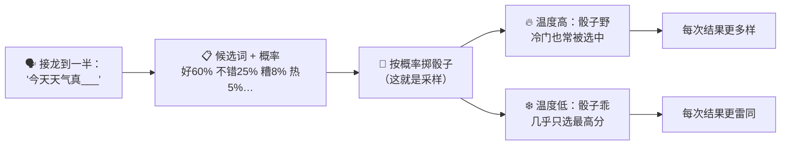
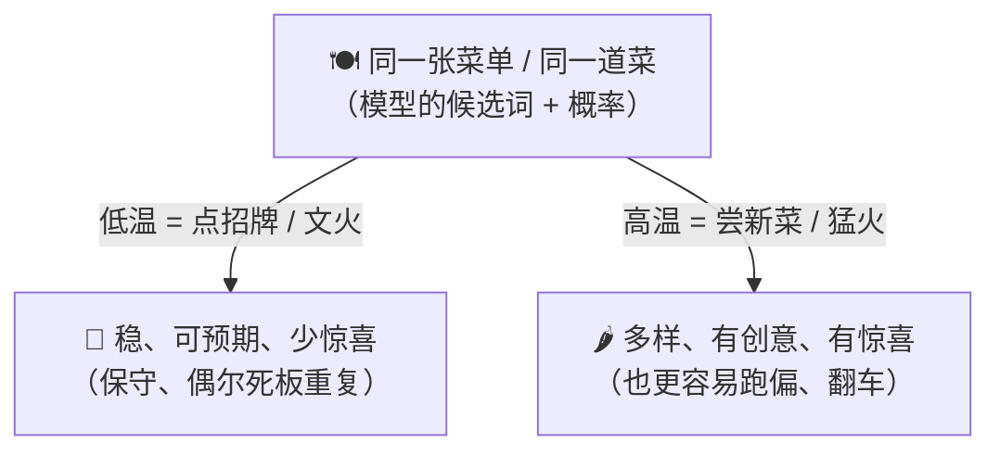
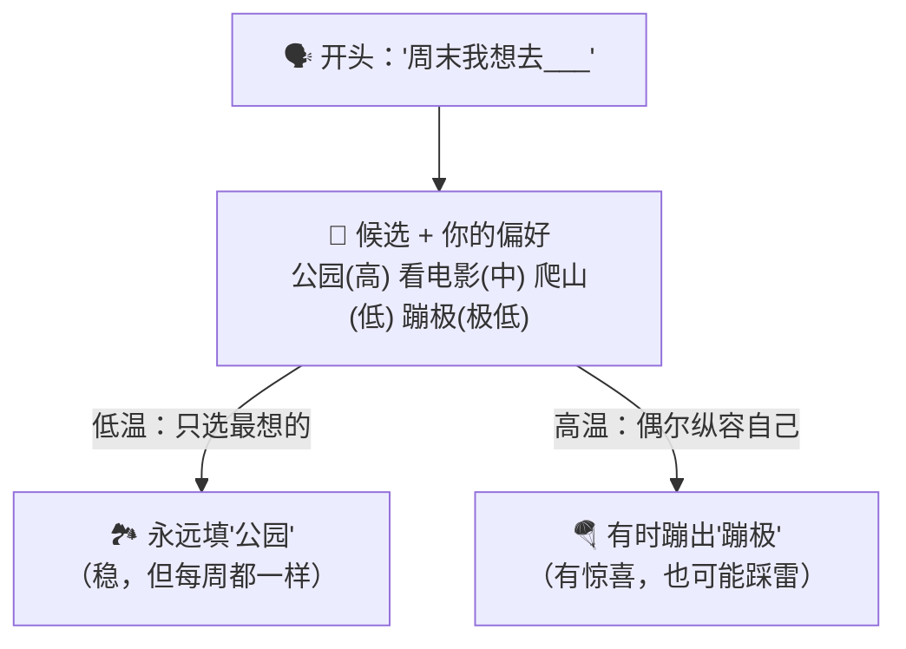
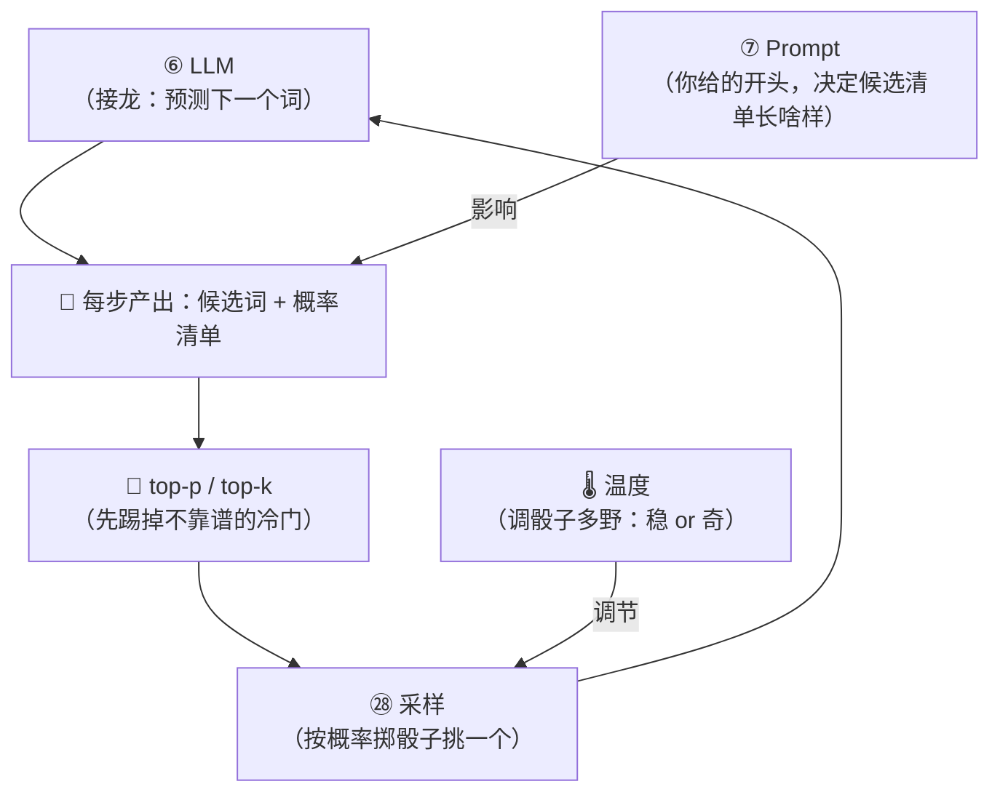

# ㉘ 什么是采样与温度（Sampling & Temperature）

> 建议先读 [⑥ 什么是 LLM](./[CONCEPT-06]%20什么是LLM-大语言模型.md) 和 [⑦ 什么是 Prompt](./[CONCEPT-07]%20什么是Prompt-提示词.md)。那两篇讲了"大模型的本事就是接龙——不停地预测下一个词"，以及"你给的提示词，决定它接什么样的龙"。这一篇要回答一个几乎人人都好奇过的问题：**同一个问题，我一字不差地问它两遍，它为什么每次答得都不完全一样？** 明明是同一个模型、同一句话，怎么就"薛定谔"了？谜底，藏在两个词里——**采样（Sampling）** 和 **温度（Temperature）**。

---

## 一、一句话定义

**采样 = 大模型每预测一步，并不是"锁死"地挑那一个词，而是给一大堆候选词各打一个概率，然后按这些概率"掷一次骰子"，挑出一个词接上去。温度 = 控制这场"掷骰子"有多随机的一个旋钮——温度高，出手更随机、更敢冒险；温度低，出手更稳、更保守；温度≈0，几乎每次都死死咬住"概率最高"的那个词。**

如果你只想记住一句话，就记这句：

> **大模型接龙时，每一步都在一堆候选词里"掷骰子"选一个（这就是采样）；而"温度"就是那颗骰子的"脾气"——温度越高，骰子越野、越爱蹦出冷门；温度越低，骰子越乖、越只认那个最稳的点数。**

这一句话是整篇文档的骨架。后面所有的比喻、图、误区，都是在反复讲透这一句话。

```callout ask|小白发问
你可能会问："它不是很聪明吗？那每一步直接挑'最好的那个词'不就得了，干嘛还要掷骰子、还要随机？"——好问题！因为语言这东西，**"最高分的那个词"并不总是最好的选择**。如果每一步都死认最高分，它写出来的东西会+[又干又硬、颠来倒去](温度压到最低时，模型容易陷进"重复循环"——同一句话翻来覆去说，因为它每步都选那个"最安全"的词，反而绕不出来)，像个背课文的木头人。留一点随机，它才会"灵光一现"，写出有血有肉、有点意外之喜的句子。所以这不是缺陷——**是故意留的一点"活气"。** 这一篇不用懂代码，抓住"掷骰子"和"火候旋钮"这两个画面就行～ 🐣
```

一句话摆清它和前几篇的关系：**[⑥ LLM](./[CONCEPT-06]%20什么是LLM-大语言模型.md) 讲的是"它靠接龙预测下一个词"；这一篇讲的是"预测出那一堆候选词之后，它到底怎么从中挑一个"——采样与温度，就发生在每一步预测之后的那"临门一挑"。**

---

## 二、为什么需要它？——解开"为什么每次答得不一样"

你一定遇到过：同一个问题问两遍，答案措辞不同、甚至角度都不同。很多人以为是"AI 在偷懒"或"它记性不好"，其实真相是：**这是设计出来的，而且是好事。** 原因有三层：

### 层一：预测出来的，本就是"一堆词 + 各自的概率"

大模型每走一步，脑子里浮现的**从来不是"唯一答案"**，而是一整排候选词，每个都标着一个概率。比如接"今天天气真"，它心里是：`好(60%)`、`不错(25%)`、`糟(8%)`、`热(5%)`……**它面对的是一张"概率清单",而不是一个"标准答案"。**

### 层二：从清单里挑，就得"掷一次骰子"

既然是概率清单，那到底挑哪个？**按概率掷骰子。** 概率高的词，被掷中的机会大；概率低的词，机会小但不是零。正因为是"掷骰子"，**两次掷的结果就可能不同**——这就是"同一句话答得不一样"的根源。

### 层三：温度，决定这骰子有多"野"

同样一张概率清单，你可以让骰子"很乖"（几乎只认最高分），也可以让它"很野"（连冷门也常蹦出来）。**这个调节骰子脾气的旋钮，就是温度。** 它不改变模型的知识，只改变"挑词时有多敢冒险"。



**所以"每次不一样"不是 bug，是采样在掷骰子。** 想让它每次都一样？把温度压到近乎 0，让骰子"乖"到每次都咬死最高分——它就会变得高度确定（但也更死板）。这一点，正是下面要展开的。

---

## 三、核心比喻：点菜的人 & 炒菜的火

"采样"和"温度"听着像术语，用两个你天天遇到的画面就能焊死它。

### 比喻一：一个人怎么点菜

想象你去一家常去的馆子点菜。**低温的你**，永远点那道招牌菜——稳，绝不出错，但吃一百次是同一个味。**高温的你**，常常"今天试个新的"——可能挖到宝（惊艳的新菜），也可能踩雷（难吃）。

**"候选菜单"就是那张概率清单，"点哪道"就是采样。温度低=永远点招牌（稳、可预期）；温度高=爱尝新菜（有惊喜、也有风险）。** 温度调的不是菜单，是你"敢不敢换口味"的胆量。

### 比喻二：炒同一道菜的火候

同样一盘菜，**火大**（高温）：出锅快、镬气足、香得诱人，可一个不留神就**糊了**；**火小**（低温）：稳稳当当绝不烧焦，但味道也**平淡寡味**，四平八稳。

**火候，就是温度。** 火大出奇香也易翻车，火小保平安却少惊喜。**没有"绝对最好的火",只有"配得上这道菜的火"**——炖汤要文火（低温求稳），爆炒要猛火（高温求香）。



两个比喻的**共同内核**：**菜单（候选词的概率）是同一张，变的只是你"挑的时候有多敢冒险"这一个旋钮。** 敢冒险=高温（活泼但易偏），求稳妥=低温（可靠但易板）。记住这一点，采样和温度是什么，就再也不会忘。

---

## 四、"温度"这个旋钮：拧高 vs 拧低，到底变了什么

把温度想成一个从"冷"到"热"的旋钮。它**不改变模型学到的知识，也不改变那张候选词清单**——它只改变"清单里高分词和低分词之间的差距被拉大还是抹平"。

```flip
🤔 猜猜看：把 temperature（温度）拧高、拧低，输出会往哪两个极端跑？
---
✅ 拧低（→0，冷）：确定、保守、几乎每次一样、可复现，但易死板；拧高（→大，热）：随机、发散、有创意有惊喜，但易跑题胡说。0 近乎贪心咬死最高分词，1+ 更敢蹦冷门词。它是"冒险旋钮"，不是"聪明旋钮"。
```

- **拧低（温度→0，"冷"）**：把高分词和低分词的差距**拉得极大**，高分那个几乎"一家独大"。于是每一步都近乎咬死概率最高的词——输出**高度确定、几乎每次一样、稳、保守**，但也容易**死板、单调，甚至卡进重复循环**。
- **拧高（温度→大，"热"）**：把高分和低分之间的差距**抹平**，冷门词也能常被选中。于是输出**更随机、更多样、更有创意和惊喜**，但也更容易**跑题、胡说、前言不搭后语**。

| 温度 | 骰子的脾气 | 输出特点 | 适合什么活 |
|------|-----------|----------|-----------|
| **≈0（很冷）** | 几乎只认最高分 | 极稳、几乎每次一样、可能死板 | 要"准"的活：算数、抽取事实、写规范代码 |
| **中等（温）** | 高分为主，偶有变化 | 稳中带活、通顺又不呆板 | 日常问答、写邮件、大多数场景 |
| **高（很热）** | 冷门也常蹦出来 | 天马行空、有创意、也易跑偏 | 要"奇"的活：头脑风暴、写诗、起名 |

```callout star|一句话点睛
温度最反直觉的一点：**它不是"聪明旋钮",不是拧高就更聪明、拧低就更笨。** 它是"冒险旋钮"——拧高更敢出冷门（活泼但易翻车），拧低更保守（可靠但易死板）。**没有一个万能的"最佳温度",只有"配得上这件活"的温度**：求真求准的活压低火，求奇求新的活纵高火。调温度的智慧，全在"看菜下火"这四个字。
```

---

## 五、还有两个小旋钮：top-p 和 top-k——"只在一小撮里掷骰子"

温度调的是"骰子有多野"，但还有一个问题：**那张候选清单的尾巴上，趴着一大堆概率极低的"馊词"**（八竿子打不着的词）。就算温度不高，万一手滑掷中一个，句子就崩了。怎么办？**干脆先把这些"馊词"从骰盅里拿掉，只在靠谱的一小撮里掷。** 这就是 top-p 和 top-k 干的事：

- **top-k**：只保留概率**最高的前 k 个**候选词（比如只留前 20 个），其余全部扔掉，只在这 k 个里掷骰子。
- **top-p**：从高到低把候选词的概率**累加**，加到够 p（比如 90%）就打住，只在这"头部一小撮"里掷骰子。

**你完全不用记住它俩的区别。** 只要抓住一个直觉：**它们都是"掷骰子之前，先把明显不靠谱的冷门候选踢出去,只在靠谱的一小撮里选"**——相当于给"敢冒险"上了个保险，让高温也不至于蹦出彻底离谱的词。


一句话收束：**温度管"骰子多野"，top-p/top-k 管"骰盅里留哪些词"——两个旋钮配合，才能既有活气、又不至于胡来。**

---

## 六、感觉一下：同一句话，三种"火候"下的三种续写

**⚠️ 郑重提醒：下面这段你完全不用会写。** 放它在这，只是让你**亲眼看一眼**——同一个开头"从前有座山，"，在低温、中温、高温三种火候下，模型会怎么"掷骰子"接下去。请只体会那个**火候变了、续写的"稳与野"就跟着变**的感觉：

```text
🙋 你给的开头都一样：「从前有座山，」

❄️ 低温（温度≈0，骰子乖到只咬最高分）
   → 「山上有座庙，庙里有个老和尚。」
   → 再问一遍：「山上有座庙，庙里有个老和尚。」
   → 再问一遍：「山上有座庙，庙里有个老和尚。」
   （几乎每次一模一样——稳，但也最没惊喜）

🌤️ 中温（温度适中，高分为主、偶有变化）
   → 「山上住着一位采药的老人。」
   → 再问一遍：「山中云雾缭绕，藏着一座古庙。」
   （通顺、可靠，又不至于每次雷同）

🔥 高温（温度很高，冷门也常蹦出来）
   → 「山会在月圆之夜轻轻挪动，去追赶远方的海。」
   → 再问一遍：「山顶坐着一只不肯下山的旧时光。」
   （天马行空、有神来之笔——也更容易跑偏、甚至不知所云）
```

看到了吗？**开头一字没变、模型也没变，变的只有那一个"温度"旋钮。** 火弱则四平八稳、滴水不漏却了无新意；火旺则天马行空、常有妙笔也常有荒腔走板。**"每次答得不一样"的谜底，全在这颗骰子的火候里。**

把这场"同一句开头、三种火候"演成一幕小短剧——重点看模型没变、开头没变，只拧了温度这一颗旋钮，续写的稳与野就天差地别：

```scene 三种火候：同一句「从前有座山」，掷出三种续写
🧑 你 | 都给同一个开头：「从前有座山，」——分别用低温、中温、高温各续一句。
❄️ 低温模型 | 山上有座庙，庙里有个老和尚。（再问一遍还是这句，再问还是——稳，但最没惊喜）
🙂 旁白 | 温度≈0，骰子乖到只咬最高分的那个词，几乎每次一模一样。
🌤️ 中温模型 | 山上住着一位采药的老人。（再问一遍：山中云雾缭绕，藏着一座古庙）
🙂 旁白 | 温度适中，高分为主、偶有变化——通顺可靠，又不至于每次雷同。
🔥 高温模型 | 山会在月圆之夜轻轻挪动，去追赶远方的海。（再问：山顶坐着一只不肯下山的旧时光）
😲 旁白 | 温度很高，冷门词也常蹦出来——有神来之笔，也更容易跑偏、甚至不知所云。
🧑 你 | 我懂了：模型和开头都没动，变的只有 +[那颗骰子的火候](温度就是控制"掷骰子有多野"的旋钮——低温=稳定复现、高温=天马行空，这就是"每次答得不一样"的谜底)。
> 火弱四平八稳、火旺天马行空——"每次答得不一样"的谜底，全在这颗骰子的火候里。
```

---

## 七、常见误区（新手最容易踩的坑）

这一节请务必逐条读完。这些误解会让你对"采样与温度"的理解跑偏。

### 误区 1：以为"每次答得不一样"是 AI 出故障了

- ❌ **错误理解**：同一句话问两遍答案不同，肯定是它不稳定、出 bug 了。
- ✅ **正确理解**：**这是采样在"掷骰子"的正常结果，是设计出来的。** 模型每步面对的是一张概率清单，按概率随机挑一个，两次自然可能不同。想让它每次一样，把温度压到近乎 0 即可——但那样会更死板。**"不一样"是活气，不是故障。**

### 误区 2：以为温度越高 = AI 越聪明

- ❌ **错误理解**：温度是不是拧得越高，模型就越有本事、越聪明？
- ✅ **正确理解**：**温度不是"聪明旋钮",是"冒险旋钮"。** 拧高只是让它更敢选冷门词——更有创意，但也更容易跑偏、胡说。拧低更保守可靠，但易死板。**高低无关聪明，只关"稳还是野"，得看你要干什么活。**

### 误区 3：以为温度改变了模型"知道什么"

- ❌ **错误理解**：调高温度，是不是让模型"想起"更多知识、懂得更多？
- ✅ **正确理解**：**温度一个字的知识都不改。** 那张候选词清单（模型知道什么、每个词多大概率）是它训练好就定死的。温度只调"挑词时高分和低分的差距被拉大还是抹平"——**变的是挑法，不是学识。**

### 误区 4：以为温度=0 就"绝对唯一、100% 可复现"

- ❌ **错误理解**：把温度设成 0，那它就永远、绝对每次一模一样了吧？
- ✅ **正确理解**：**温度≈0 只是让它"近乎"每次都挑最高分**，确定性极高，但工程上仍可能受别的因素（并行计算的微小差异等）影响，不保证在所有环境下逐字节完全一致。**方向没错——低温更确定——但别把它当成"绝对唯一"的铁律。**

### 误区 5：以为温度是"高深参数,跟我这种小白没关系"

- ❌ **错误理解**：采样、温度、top-p 听着好技术，那是调模型的人才碰的，跟我没关系。
- ✅ **正确理解**：**它离你很近。** 你觉得 AI "有时一本正经、有时天马行空"，背后就是温度在起作用；很多工具都让你调它。理解了温度，你就能**主动选火候**——要它严谨就压火，要它有创意就纵火。**这是你能亲手拧的一个实用旋钮，不是空中楼阁。**

```quiz
Q: 下面关于"采样与温度"的说法，哪些是对的？（多选）
- [x] 大模型每一步是在一堆候选词里"按概率掷骰子"挑一个，这叫采样
> 对。它预测出的是一张"候选词+概率"的清单，再按概率随机挑一个接上去——这就是"每次可能不一样"的根源。
- [x] 温度低更确定、更稳、更保守，温度≈0 时近乎每次都挑概率最高的词
> 对。低温把高分词和低分词差距拉大，几乎咬死最高分，输出高度确定但也容易死板。
- [ ] 温度越高，说明 AI 越聪明、懂得越多
> 错。温度是"冒险旋钮"不是"聪明旋钮"，它一个字的知识都不改，只改变挑词时敢不敢选冷门。
- [ ] 同一句话每次答得不一样，说明模型坏了、不稳定
> 错。那是采样掷骰子的正常结果，是设计出来的"活气"。想每次一样就把温度压到近乎 0。
- [x] top-p / top-k 的作用是"掷骰子前先踢掉不靠谱的冷门候选，只在一小撮里选"
> 对。它们给"敢冒险"上了个保险，让高温也不至于蹦出彻底离谱的词。
```

---

## 八、动手小实验 / 思想实验

理论看再多，不如亲手（或在脑子里）走一遍。下面两个实验，一个能真做、一个纯用想。

### 实验一：找个能调温度的地方，问它同一个问题两遍

很多 AI 工具/游乐场里有"温度（Temperature）"这个滑杆。试试：把温度**调到很低**，让它"给我起 5 个奶茶店的名字"，连问两遍——你会发现两次结果高度相似、四平八稳。再把温度**调到很高**，同样连问两遍——名字会天马行空、脑洞大开，两次也差得远（偶尔还会蹦出个不知所云的）。**你会亲眼看到：火候一变，稳与野立刻跟着变。**

### 实验二：你自己当一次"模型",体会掷骰子

给自己一个开头："周末我想去____。" 现在你脑子里冒出一串候选：`公园(很想)`、`看电影(挺想)`、`爬山(还行)`、`蹦极(想都没敢想)`。



请你回答自己两个问题：

1. 如果你**每次都只填"最想去"的那个（公园）**，结果会怎样？——**每周都一样，稳当，但也无聊、没惊喜。这就是"低温"。**
2. 如果你**偶尔纵容自己去试"蹦极"**呢？——**周末可能超级难忘，也可能后悔踩雷。这就是"高温"。**

**关键体会**：你刚刚亲自"采样"了一回。你会发现，采样和温度一点都不神秘——**它就是你做选择时天然会用的智慧**：想稳就认那个最优选（低温），想有惊喜就给冷门一点机会（高温）。把这份人人都懂的分寸交给模型，就是"采样与温度"。

---

## 九、和其它概念的关系

采样与温度，是"接龙预测"这条链上、**最后临门一挑**的那个环节。



| 概念 | 一句话关系 | 类比 |
|------|-----------|------|
| [⑥ 什么是 LLM](./[CONCEPT-06]%20什么是LLM-大语言模型.md) | LLM 的本事是**接龙预测下一个词**；采样就发生在**每一步预测之后**的"临门一挑" | 接龙到一半，该轮到"掷骰子选字"了 |
| [⑦ 什么是 Prompt](./[CONCEPT-07]%20什么是Prompt-提示词.md) | 你给的 **Prompt** 会影响每一步"候选清单"长什么样，采样再从这张清单里挑 | 你出的上半句，决定了下半句能接哪些字 |
| [⑧ Context 与 Token](./[CONCEPT-08]%20什么是Context与Token-上下文与令牌.md) | 采样挑出的其实是一个个 **Token**，一步步拼成完整回答 | 掷一次骰子拼一块积木，块块相连成句 |
| [⑬ 什么是深度学习](./[CONCEPT-13]%20什么是深度学习-DeepLearning.md) | 那张"候选词的概率清单"是**深度学习**训练出来的；温度只调挑法、不改它学到的东西 | 学识是练出来的，火候是临场拧的 |
| [㉗ 什么是多模态](./[CONCEPT-27]%20什么是多模态-Multimodal.md) | 就算输入是图、是声音，模型**生成回答**那一刻，照样在做采样与调温 | 无论看的听的，开口时都要"掷骰子选字" |

一句话串起来：**LLM 靠接龙预测下一个词，每一步先由 Prompt 和它的学识（深度学习练出的）产出一张"候选词概率清单",再由 top-p/top-k 踢掉冷门、由温度定下"骰子多野",最后采样掷骰子挑出一个 Token——如此一步步，拼出你看到的整段回答。**

---

## 十、和 Khy-OS 的关系

这一节和你手上的项目关系很实在：

**你在 Khy-OS 里觉得 AI "有时严谨得像法官、有时活泼得像诗人",背后正是采样与温度在起作用。**

Khy-OS 作为一个成熟的 [harness](./[CONCEPT-16]%20什么是Harness-智能体运行骨架.md)，在不同场景下，本就该给模型配不同的"火候"：

- **需要"准"的活**（比如生成要能跑的代码、抽取一个确切的字段、做严谨的判断）——就该**压低温度求稳**，让它咬住最靠谱的选择，别天马行空；
- **需要"奇"的活**（比如头脑风暴、给方案起名、写点活泼的文案）——就该**适当纵火**，让它多来点创意和惊喜。

这也解释了一个你可能纳闷的现象：**为什么让它"改代码"时它很稳、很少乱来，而让它"想点子"时又天马行空？** ——不是它"人格分裂"，而是**看菜下火**：该稳的活压低了温度，该活的活放开了火候。

而这，恰恰呼应了 Khy-OS 章程里 **B2"目标驱动、每步可验证"** 的纪律：**要交付能通过验证的确定结果，就不能让骰子太野。** 越是"红灯会亮、错了就停"的关键环节，越需要低温求稳、求可复现——把那颗骰子，牢牢按在"最靠谱"的那个点数上。

> 💡 换个角度说：**学会"采样与温度",你就摸到了 AI 的"性格开关"。** 从此你不再觉得它"忽冷忽热、捉摸不定"——你知道那只是一个旋钮在动。要它靠谱就压火，要它有灵气就纵火。**这份"看菜下火"的分寸感，会让你从"被 AI 的随机吓一跳",变成"主动拿捏 AI 的火候"。**

> ⚠️ 诚实说一句边界：温度、top-p、top-k 具体设成多少最合适，**没有放之四海皆准的数字**，要看模型、看任务、看你想要的效果，得靠试。各家默认值也不同、还在演进。本文只讲"采样与温度是什么、那颗旋钮拧高拧低会怎样"这一层概念地图；具体调参属于实践与调优层面。

---

## 十一、小结 + 下一步

- **采样 = 大模型每一步在"候选词+概率"清单里"按概率掷骰子"挑一个词接上去**——这就是"同一句话每次答得不完全一样"的根源。
- **温度 = 调节这颗骰子有多随机的旋钮**：高温更随机、更有创意也更易跑偏；低温更稳、更保守也更易死板；温度≈0 近乎每次都挑概率最高的词（最确定）。
- **核心比喻**：**点菜**（低温永远点招牌、高温爱尝新菜）、**炒菜火候**（火大出香也易糊、火小稳当却平淡）——变的只是"敢不敢冒险"这一个旋钮。
- **温度改的是"挑法",不是"学识"**：它不改变模型知道什么，只改变高分词和低分词的差距被拉大还是抹平。
- **top-p / top-k**：掷骰子前先踢掉不靠谱的长尾冷门，只在靠谱的一小撮里选——给"敢冒险"上个保险。
- **五大误区**：不一样不是故障（是活气）、高温≠更聪明（是更爱冒险）、温度不改学识（只改挑法）、温度=0 是"近乎"确定非"绝对唯一"、它离你很近是你能拧的实用旋钮。
- **和 Khy-OS 的关系**：求准的活压低火求稳、求奇的活纵火求创意；越是"验证会亮红灯"的关键环节，越要低温求可复现——正合章程 B2 的纪律。

🎉 **恭喜，你把 AI 的"随机之谜"彻底看穿了！** 从此"它为什么每次答得不一样"再也难不倒你——你知道那是一颗骰子，而你手里，就攥着那个叫"温度"的火候旋钮。

👈 回 [概念入门总览](./00_INDEX_概念入门-总览.md) 看看还有哪些能温故知新。

👈 上一篇 [㉗ 什么是多模态](./[CONCEPT-27]%20什么是多模态-Multimodal.md)——回顾"让 AI 眼耳口鼻齐全地懂世界"。

👉 概念篇的"算法底子"到这里就全了！接下来 [㉙ 什么是 API 与 SDK](./[CONCEPT-29]%20什么是API与SDK.md) 起，是三篇更贴近"你真正开始动手"的实战篇——接入、辨析、避坑。想换种轻松方式把概念再过一遍？也可以去看 [修仙学 AI 的故事](../09_STORY_修仙学AI/00_INDEX_修仙学AI-总目录.md)——把这些概念全编成了练功升级的江湖故事。
