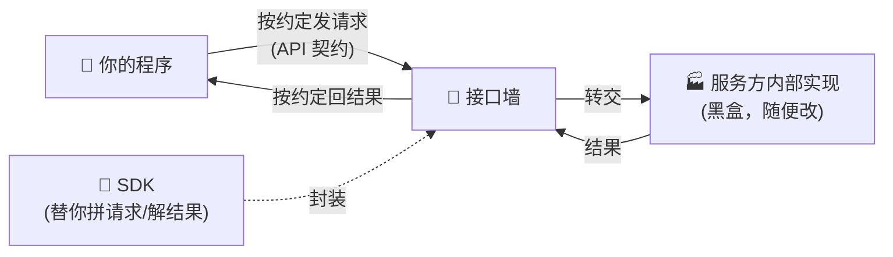

# ㉙ 什么是 API 与 SDK

> 先读[概念入门总览](./00_INDEX_概念入门-总览.md)会更顺。这一篇讲两个你**一动手就绕不开**的词：**API** 和 **SDK**。读完你会明白：为什么你调用 AI、接入任何服务，都是在跟这两样东西打交道——它们是你和"别人写好的能力"之间的**插座**和**工具箱**。

---

## 一、一句话定义

**API = 一份"怎么跟我说话"的约定；SDK = 一箱"帮你照着约定说话"的现成工具。**

- **API（Application Programming Interface，应用程序接口）**：别人把一个能力（比如"生成一段文字""查天气"）开了一个**固定的入口**，并写清楚"你按什么格式发请求、我就按什么格式还你结果"。这份**约定本身**，就是 API。
- **SDK（Software Development Kit，软件开发工具包）**：一堆**已经封装好**的代码库，替你把"拼请求、发网络、解结果"这些脏活都干了。你只要 `import` 进来、调一个函数，底下它自己去按 API 约定跟服务器交涉。

一句话点破：**API 是"规矩"，SDK 是"替你守规矩的帮手"。** 没有 SDK 你也能用 API（自己手写 HTTP 请求），有了 SDK 只是更省事。

```callout ask|小白发问
那我调用 Claude、调用一个大模型，用的是 API 还是 SDK？——两个都在用！你 `import anthropic`（SDK），然后 `client.messages.create(...)`（SDK 的函数）——但这个函数底下，正是在按 Anthropic 的 +[REST API](一种最常见的 API 风格：用网址+HTTP 方法收发 JSON) 约定，往服务器发一个 HTTPS 请求。SDK 是**壳**，API 是**壳里那份约定**。
```

```flip
🤔 猜猜看：同样是"调用别人的能力"，API 和 SDK 到底谁包着谁？
---
✅ SDK 包着 API。API 是最底层那份"发什么、回什么"的网络约定（谁都能按它手写请求）；SDK 是别人替你把这份约定封装成现成函数的工具箱。你调 SDK 的一个函数，它内部就替你发了一次符合 API 约定的请求。
```

---

## 二、用生活比喻理解

### 比喻一：餐厅点菜（最经典的 API 比喻）

你去餐厅，不会冲进后厨自己炒菜。你看**菜单**、告诉**服务员**"要一份宫保鸡丁"，过一会儿菜就上来了。

- **菜单 + 点菜规矩** = **API**：它规定了"你能点什么、怎么点、会得到什么"。你不用知道后厨怎么炒，只要照菜单点。
- **后厨** = 服务提供方的内部实现：对你完全**黑盒**，怎么实现是它的事。
- 你**不能乱点**：菜单上没有的、或点法不对（"来一份还没发明的菜"），服务员会拒绝——这就是 API 的**参数校验和报错**。

### 比喻二：SDK 是"会帮你点菜的私人助理"

如果每次点菜你都要用一种**外语**、按一套复杂话术跟服务员说，很烦。于是你雇了个**私人助理（SDK）**：你只对助理说一句"我要宫保鸡丁"，助理自动翻译成标准话术、去跟服务员交涉、把菜端回你面前。

- 你说的那句大白话 = **调用 SDK 的一个函数**。
- 助理替你说的那套标准外语 = **底层真正发出的 API 请求**。
- 助理**不改变菜单**（API 能点什么还是什么），它只是让你**点得更省心**。

### 比喻三：插座（API）与充电器套装（SDK）

- **API = 墙上的插座标准**：规定了插孔形状、电压。任何电器只要符合标准就能插上取电。
- **SDK = 配好的充电器 + 各种转接头**：你不用自己接线，拿起对应的头一插就能用。

```callout star|划重点
把这三条记死，你就再也不会混：**API 是约定（能点什么、怎么点、回什么）；SDK 是替你照约定干活的工具箱；调 SDK 函数 = 底下发了一次 API 请求。** 面试被问"你调大模型用的什么"，答"用官方 SDK 调它的 REST API"就很专业。
```

---

## 三、核心比喻延伸：为什么会有 API 这层"约定"

想象没有 API 会怎样：每个人想用别人的能力，都得**先看懂对方全部内部代码**，再想办法接进去。对方一改代码，你就崩。

API 的伟大之处，就是立了一堵**"墙"**：
- 墙**内**：服务方随便改实现（换语言、换数据库、优化性能），只要墙上的"入口约定"不变。
- 墙**外**：你只认这个约定，对方内部怎么翻天覆地，与你无关。

这堵墙叫**"接口契约"**。它让**亿万开发者能同时用同一个能力，而互不干扰、互不需要认识**。整个互联网就是靠无数 API 拼起来的。



---

## 四、灵魂：API 的三要素——你只需盯住这三样

不管多复杂的 API，你实际要关心的永远是这三样：

1. **入口（Endpoint）**：往哪个网址发。比如 `https://api.example.com/v1/chat`。
2. **入参（Request）**：发什么。通常是一段 **JSON**，规定了必填字段（如 `model`、`messages`）。
3. **出参（Response）**：回什么。也通常是 JSON，你从里面取出要的字段（如 `text`）。

再加两个"钥匙和回执"：
- **鉴权（Auth）**：大多数 API 要带一把 **API Key**（身份令牌），证明"你是谁、有没有权限"。**这把 key 是密钥，绝不能写死进代码或提交到 git**——这也是 Khy-OS 的一条红线。
- **状态码（Status）**：`200` 成功、`401` 没权限、`429` 太频繁、`500` 服务方崩了。看到报错先看状态码，能省一半排查时间。

```callout warn|要小心
新手最容易踩的坑：**把 API Key 硬编码进源码，然后 push 到公开仓库。** 密钥一旦泄露，别人就能拿你的账号花钱、调你的额度。正确做法：key 只放 +[环境变量](写在 .env 或系统 env 里、运行时才读、绝不进代码库) 里，运行时注入。记住：**代码可以开源，钥匙永远不能。**
```

---

## 五、API vs SDK：到底该用哪个？

这是新手最纠结的选择。一句话:**能用官方 SDK 就用 SDK，只有 SDK 不支持你的语言/场景时才手写 API 请求。**

| | **直接调 API（手写请求）** | **用 SDK（现成工具箱）** |
|---|---|---|
| 像什么 | 自己说外语点菜 | 请助理替你点菜 |
| 要写的代码 | 多：手拼 URL、拼 JSON、发 HTTP、解结果、处理重试 | 少：`import` 进来，调一个函数 |
| 灵活度 | **最高**：任何 API 都能调，不挑语言 | 受限：只有官方出了 SDK 的语言/功能才有 |
| 出错概率 | 高（容易拼错格式、漏字段） | 低（SDK 帮你校验、给类型提示） |
| 适合谁 | 没 SDK、或要极致控制、或调冷门接口 | 绝大多数日常开发 |

```flip
🤔 猜猜看：官方既然出了 SDK，那"直接调 API"这种手写方式是不是就没用、该淘汰了？
---
✅ 恰恰相反，API 永远是根基。SDK 只是 API 的一层"方便壳"——官方没给你的语言出 SDK 时、或你要调一个很冷门的接口时，你就得回到"手写 API 请求"。会读 API 文档、能手拼一次请求，是比会用 SDK 更底层、更通用的硬功夫。
```

---

## 六、感觉一下：从"手写 HTTP"到"一行 SDK"的演进

"调用别人的能力"这件事，几十年间的接入方式一直在变简单。看这条时间轴，你就懂 SDK 为什么会出现：

```timeline
早期 | 各家协议五花八门，接一个服务要读一大本手册、自己拼二进制包，苦不堪言
REST API 普及 | 大家约定用"网址 + HTTP 方法 + JSON"收发，接口终于有了统一直觉，手写请求也能上手
官方 SDK 时代 | 服务方把"拼请求 / 发网络 / 解结果 / 重试"封装成现成函数库，你 import 一下调个函数就行
Agent 框架时代 | 更上一层：框架把"调模型 + 调工具 + 循环决策"都封装好，你只描述目标，底层自动编排 API 调用
```

看懂这条线你就明白：**每一代都是把上一代的"脏活"往下藏一层。** 你今天写 `client.messages.create(...)` 一行搞定的事，二十年前要几百行。而这一行底下，藏的仍然是最古老那件事——**按约定，发一个请求，收一个结果**。

把这条"越来越省事"的演进演成一幕小短剧——同一件事（调别人的能力），四个时代的人各干各的，越往后越轻松，但底下那件事从没变：

```scene 同一件事，四代人的干法：从手写 HTTP 到一行 SDK
🧑 你 | 我想调别人写好的一个能力，历朝历代都怎么接的？
🕰️ 早期程序员 | 各家协议五花八门，我得抱一本手册、自己拼二进制包收发——接一个服务能掉半条命。
🌐 REST 时代 | 大家约好了：网址 + HTTP 方法 + JSON。我手写个请求也能上手，接口终于有了统一直觉。
📦 SDK 时代 | 服务方把"拼请求 / 发网络 / 解结果 / 重试"都封成现成函数库，我 `import` 一下、调个函数就完事。
🤖 Agent 框架时代 | 更省：我只描述目标，框架自动把"调模型 + 调工具 + 循环决策"编排好，底层 API 调用我都不用管。
🙂 旁白 | 每一代都把上一代的"脏活"往下藏一层——你写的越来越短，藏在底下的那件事却从没变。
🧑 你 | 那如果哪天没有我要的语言的 SDK 呢？我就抓瞎了？
🌐 REST 时代 | 不会。SDK 只是方便壳，底下永远是那个人人可调的 REST API——你按文档手写个带 Key 的 HTTPS 请求，照样调通。这就是 +[懂 API 比只会 SDK 更值钱](SDK 报个 400 Bad Request，你还是得回 API 文档查哪个字段填错了——SDK 让你走得快，懂 API 让你走得远)。
> 一行 SDK 的底下，藏的仍是最古老那件事：按约定，发一个请求，收一个结果。
```

---

## 七、常见误区（新手最容易踩的坑）

### 误区 1：以为 API 是某种"高深的编程语言"

不是。API 只是一份**约定/文档**，本身不是代码。你用任何语言都能去"调用"一个 API。

### 误区 2：以为用了 SDK 就不用懂 API

SDK 出错时（报了个 `400 Bad Request`），你还是得回去看 API 文档才知道哪个字段填错了。**SDK 让你走得快，懂 API 让你走得远。**

### 误区 3：把 API Key 当普通字符串到处贴

前面说过，这是**安全红线**。key = 你的身份 + 你的钱包，只进环境变量、绝不进代码库。

### 误区 4：以为"接口"和"API"是两个东西

在开发语境里，"接口""API""端点"经常混着说，指的都是同一类东西——**别人开出来给你调用的入口约定**。不用纠结叫法。

```callout note|小笔记
判断你在跟什么打交道，有个土办法：**看你写的是网址还是函数**。你在拼一个 `https://...` 的网址、手动发请求 → 你在直接用 **API**；你在 `import` 一个库、调它的 `xxx.create()` 函数 → 你在用 **SDK**（它底下替你用了 API）。
```

---

## 八、动手小实验 / 思想实验

```quiz
Q: 你在 Python 里写了 `from anthropic import Anthropic`，然后 `client.messages.create(model="...", messages=[...])`。下面哪个说法**最准确**？
- [ ] 你在直接手写调用了一个 REST API
- [x] 你在用 SDK，而这个 SDK 函数底层替你发了一次符合 API 约定的请求
- [ ] SDK 和 API 是完全无关的两回事
- [ ] 这段代码没有涉及任何网络请求
> `import anthropic` 用的是 **SDK**（现成工具箱）；`create(...)` 这个函数底下，正是替你按 Anthropic 的 REST **API** 约定发了一次 HTTPS 请求。SDK 是壳，API 是壳里的约定——两者是"包着"的关系，且这一定涉及网络请求。
```

**动手想一想**：假设 Anthropic 明天没出 Rust 语言的 SDK，但你偏要用 Rust 调它的模型。你还有办法吗?——**有**。因为 SDK 只是方便壳，底层永远是那个人人可调的 REST API。你在 Rust 里手写一个带 API Key 的 HTTPS POST 请求、按文档拼好 JSON body，照样能调通。**这就是"懂 API"比"只会用 SDK"更值钱的地方。**

---

## 九、和其它概念的关系

- **[⑧ 上下文与 Token](./[CONCEPT-08]%20什么是Context与Token-上下文与令牌.md)**：你通过 API 发给模型的 `messages`，会被换算成 token 计费——API 是"怎么发"，token 是"发了多少要花多少钱"。
- **[㉚ 函数调用与 MCP 辨析](./[CONCEPT-30]%20函数调用与MCP辨析.md)**：模型"调工具"和你"调 API"是两个层面的调用，很容易混——下一篇专门掰开讲。
- **[② 工具调用](./[CONCEPT-02]%20什么是ToolCalling-工具调用.md)**：Agent 用工具时，工具底下往往就是在调各种 API。
- **[① Agent](./[CONCEPT-01]%20什么是Agent-智能体.md)**：Agent 之所以"有手有脚"，正是因为它能通过 API/SDK 去调用真实世界的能力。

```callout tip|一句话收尾
API 是你入行后**天天见**的东西——调模型、接支付、查数据，全是它。今天记住一句就够了：**API 是约定，SDK 是替你守约定的工具箱，钥匙（Key）永远只放环境变量。** 剩下的，用多了自然熟。
```
