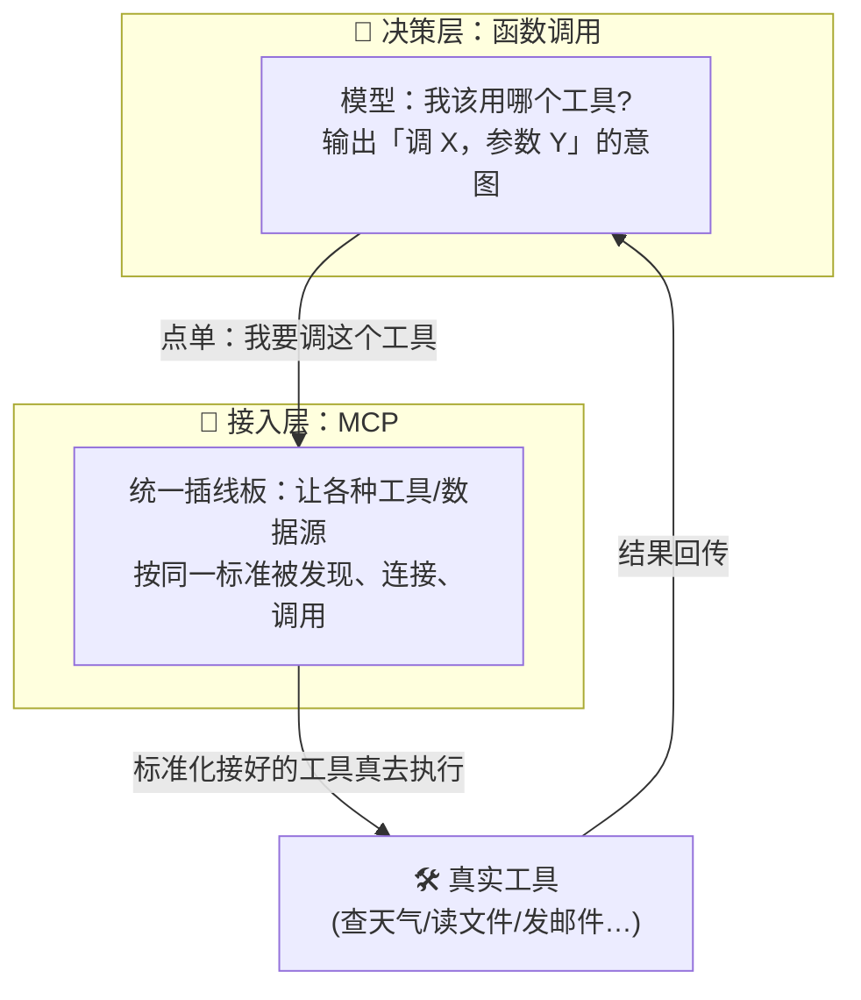
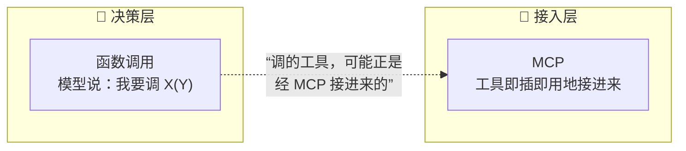

# ㉚ 函数调用与 MCP 辨析（Function Calling vs MCP）

> 建议先读 [② 什么是工具调用](./[CONCEPT-02]%20什么是ToolCalling-工具调用.md)、[⑤ 什么是 MCP](./[CONCEPT-05]%20什么是MCP-模型上下文协议.md) 和 [㉙ 什么是 API 与 SDK](./[CONCEPT-29]%20什么是API与SDK.md)。这一篇专治一个新手一进门就绕晕的问题：**"函数调用（Function Calling）""工具调用（Tool Calling）""MCP"——这几个词到底是不是一回事？谁管谁？** 读完你会一次性把它们摆到各自的格子里，再也不混。

---

## 一、一句话定义

**函数调用 = 模型"决定"要调哪个工具、该填什么参数（出主意的那一下）；MCP = 一套"工具怎么接进来"的统一插线板标准（让工具即插即用的那层规矩）。一个是"模型动嘴点菜"，一个是"厨房怎么标准化对接食材供应商"。**

- **函数调用（Function Calling）**：你事先告诉模型"你有这么几个工具可用（每个工具叫什么、要什么参数）"。模型在回答时，如果觉得该用某个工具，就**输出一个结构化的"调用意图"**——"我要调 `查天气`，参数 `city=北京`"。**注意：模型自己并不真的执行**，它只是"点单"，真正去跑这个函数的是你的程序。
- **MCP（Model Context Protocol，模型上下文协议）**：一套**开放标准**，规定"一个工具/数据源该怎么把自己暴露出来，好让任何 AI 应用都能统一地发现它、接上它、调用它"。它解决的是"**工具和 AI 之间怎么对接**"的工程问题——像 USB 之于外设。

一句话点破：**函数调用是"模型决定调什么"（决策层）；MCP 是"工具怎么被接进来供它调"（接入层）。两者不是竞品，是上下楼的邻居。**

```callout ask|小白发问
最容易晕的一点先说清：**"函数调用"和"工具调用"基本是同义词**——不同厂商叫法不同，指的都是"模型输出一个'我要用某工具+参数'的结构化意图"。而 **MCP 是另一个层面的东西**：它不关心"模型想调什么"，只关心"一个工具怎么标准化地接到 AI 面前来"。打个比方：函数调用是你在餐桌上+[说出"我要宫保鸡丁"](模型产出的"调用意图"——只是决策，不是执行)，MCP 是这家餐厅+[后厨跟供应商约定好的标准进货接口](让任何食材/工具都能即插即用地接进厨房)。前者是"点单"，后者是"供货管道怎么修"。🐣
```

```flip
🤔 猜猜看：函数调用和 MCP，一个在"上层出主意"，一个在"下层修管道"——到底谁在上、谁在下？
---
✅ 函数调用在"决策层"（模型出主意：我要调哪个工具、填什么参数）；MCP 在"接入层"（工程管道：工具怎么被标准化地发现、连接、调用）。模型先靠函数调用"点单"，MCP 负责让被点的那个工具"能被接进来跑"。两者是上下楼邻居，不是二选一。
```

---

## 二、为什么会有这两个词？——分别解决什么痛

它们各自解决一个**完全不同**的痛点，所以才会并存。

### 痛点一（函数调用要解的）：模型只会说话，怎么让它"触发动作"？

一个纯语言模型只会吐字。你问"北京今天几度？"，它要么瞎编一个温度（[幻觉](./[CONCEPT-31]%20什么是幻觉-Hallucination.md)），要么老实说"我查不了实时天气"。**函数调用给了它一条出路**：让它输出一个规规矩矩的"我想调 `查天气(city=北京)`"，你的程序接住这个意图、真去调 API、把结果喂回给它，它再据实回答。**函数调用，是把"模型的话"翻译成"可执行的动作意图"的那座桥。**

### 痛点二（MCP 要解的）：每接一个工具都要重写一遍胶水，太累了

假设你想给 AI 接十个工具（查数据库、读文件、发邮件……）。没有统一标准时，**每个工具你都得手写一套对接代码**，换个 AI 应用又得重写。工具方和应用方两两组合，是个 N×M 的噩梦。**MCP 就是来终结这个噩梦的**：工具方只要按 MCP 标准"暴露"一次，任何支持 MCP 的 AI 应用就能即插即用地接上——**把 N×M 变成 N+M。**



**一句话收束：函数调用解决"模型怎么表达它想动手"，MCP 解决"工具怎么被规整地接进来供它动手"。缺了前者模型不会触发动作，缺了后者每接一个工具都要造轮子。**

---

## 三、核心比喻：餐厅的"点单" vs "供货管道"

用一家餐厅把两者的关系焊死。

### 比喻一：函数调用 = 顾客点单

你坐在餐桌前看菜单（= 模型被告知"有哪些工具可用"），说一句"我要一份宫保鸡丁、少辣"（= 模型输出"调 `做菜`，参数 `菜=宫保鸡丁, 辣度=少`"）。**你只是"说出需求"，并没有亲自进厨房炒**。真正炒菜的是后厨——就像真正执行函数的是你的程序，不是模型。

### 比喻二：MCP = 后厨的标准化进货口

这家餐厅要接很多**供应商**（蔬菜、肉、调料……）。如果每个供应商都用不同的箱子、不同的对接方式，后厨会疯掉。于是餐厅立了一个**标准进货口**：任何供应商只要按这个标准送货，后厨就能无缝接收。**MCP 就是这个"标准进货口"**——让任何工具/数据源都能即插即用地接进 AI。

### 比喻三：USB 接口

- **函数调用** = 你在电脑上**决定**"我要打印这份文件"（发出指令的意图）。
- **MCP** = **USB 标准**：让打印机、U 盘、键盘……任何设备都能用同一个口插上电脑。你不用为每个设备造一个专属插孔。

```callout star|划重点
把这句记死，两者永不再混：**函数调用管"模型决定调什么"，MCP 管"工具怎么被接进来供它调"。** 一个偏"模型的决策"，一个偏"工程的接线"。它们经常一起出现——模型用函数调用点了一个工具，而那个工具恰好是通过 MCP 接进来的——但它们回答的是两个不同的问题。
```

---

## 四、灵魂：一次完整调用里，两者各在哪一步登场

把一次"AI 用工具"从头到尾拆开，你会清楚看到函数调用和 MCP 各自的"出场时刻"：

| 步骤 | 发生了什么 | 谁在管 |
|------|-----------|--------|
| ① 告知可用工具 | 应用把"有哪些工具、各要什么参数"喂给模型 | 工具描述（常经 **MCP** 发现并列出） |
| ② 模型决定调谁 | 模型输出"我要调 `X`，参数 `Y`"的结构化意图 | **函数调用** |
| ③ 应用真去执行 | 程序接住意图，真的运行那个工具/函数 | 应用运行时（工具或经 **MCP** 接入） |
| ④ 结果喂回模型 | 把工具跑出来的结果塞回对话 | 应用运行时 |
| ⑤ 模型据实作答 | 模型拿着真实结果，给你最终回答 | 模型 |

看这张表你就懂了：**函数调用集中在第 ②步（模型出主意）；MCP 主要在第 ①、③步（工具怎么被发现、怎么被接进来执行）。** 它们在同一条流水线上分工，不抢彼此的活。

```callout note|小笔记
一个关键澄清：**模型"函数调用"时，从不自己真的执行代码。** 它只输出一段"我想调 X(Y)"的意图（通常是一段 JSON）。真正去跑的是你的程序。这一点极其重要——它意味着"模型能调工具"不等于"模型能在你机器上乱跑命令"，中间永远隔着一层"你的程序愿不愿意执行、怎么执行"的关卡。
```

---

## 五、函数调用 vs MCP：一张表彻底分清

这是本篇的核心。把两者并排，差异一目了然：

| | **函数调用（Function Calling）** | **MCP（模型上下文协议）** |
|---|---|---|
| 它是什么 | 模型的一种**能力/输出格式** | 一套**开放的接入标准/协议** |
| 解决什么 | 模型怎么**表达"我要调某工具+参数"** | 工具怎么**被统一地发现、连接、调用** |
| 在哪一层 | **决策层**（模型出主意） | **接入层**（工程接线） |
| 谁在做 | **模型**产出调用意图 | **工具方 + 应用方**按协议对接 |
| 类比 | 顾客点单 / 决定"要打印" | 后厨标准进货口 / USB 标准 |
| 没有它会怎样 | 模型只会说话，无法触发动作 | 每接一个工具都要手写胶水，N×M 噩梦 |



**一句话总结这张表：它们不是"二选一"，而是"上下配合"。** 你完全可以：用函数调用让模型决定调工具，同时用 MCP 把那些工具规整地接进来。也可以只用函数调用、工具用别的方式接（不走 MCP）。**函数调用是模型能力，MCP 是工程标准，维度不同，不冲突。**

---

## 六、感觉一下：一次"查天气"里两者怎么接力

**⚠️ 提醒：下面这段你完全不用会写。** 只体会那个**模型点单（函数调用）→ 工具经标准管道执行（MCP）→ 结果回喂**的接力节奏：

```text
🙋 你问：北京今天适合穿短袖吗？

🧠 模型（函数调用登场）：我答不了实时天气，但我有个 `查天气` 工具。
   → 输出调用意图：{ "tool": "查天气", "args": { "city": "北京" } }
   （注意：模型只是"点单"，它自己没去查）

🔌 应用运行时（MCP 登场）：这个 `查天气` 工具是通过 MCP 接进来的，
   → 按 MCP 标准找到它、把参数传过去、真的执行了一次
   → 拿到结果：{ "temp": 26, "desc": "晴，微风" }

🧠 结果回喂给模型：北京 26℃，晴，微风。

🤖 模型据实作答：北京今天 26℃、晴、微风，挺适合穿短袖的~
```

看懂了吗？**同一次调用里，函数调用负责"模型开口点单"，MCP 负责"被点的工具怎么被找到并跑起来"。** 它俩一前一后接力，各司其职——这就是为什么它们经常同时出现，却是两个不同的概念。

把这场"查天气接力"演成一幕小短剧——重点看谁点单、谁跑腿、执行权到底在谁手里：

```scene 一次查天气：函数调用点单，MCP 跑腿接力
🧑 你 | 北京今天适合穿短袖吗？
🧠 模型 | 我答不了实时天气——但我手上有个 `查天气` 工具。（函数调用登场）
🧠 模型 | 我只输出调用意图：`查天气(city="北京")`。注意，我只是 +[点单](模型只是"说想调"，它自己没去查也没权去查——真执行与否，掌握在接住这个意图的程序手里)，我自己没动手去查。
🔌 应用运行时 | 收到点单。这个 `查天气` 是通过 MCP 接进来的——我按 MCP 标准找到它、把参数传过去、**真的执行**了一次。（MCP 登场）
🔌 应用运行时 | 拿到结果：`{ temp: 26, desc: "晴，微风" }`，回喂给模型。
🧠 模型 | 有真数据了：北京今天 26℃、晴、微风，挺适合穿短袖的~
🙂 旁白 | 函数调用管"模型决定调什么"（决策层），MCP 管"工具怎么被接进来供它调"（接入层）——一个动嘴点单，一个修供货管道。
> 缺了前者模型不会触发动作，缺了后者每接一个工具都要造轮子——它俩不打架，是上下楼的好邻居。
```

---

## 七、常见误区（新手最容易踩的坑）

### 误区 1：以为"函数调用"和"MCP"是竞争关系，要二选一

- ❌ 以为"用了 MCP 就不用函数调用了""它俩是对手"。
- ✅ **它们在不同层、互相配合。** 函数调用是模型决策，MCP 是工具接入。一次调用里两者常常同时在场。

### 误区 2：以为模型"函数调用"时会自己执行代码

- ❌ 以为模型一"函数调用"，就在你机器上跑起了那个函数。
- ✅ **模型只输出"意图"（一段 JSON），真正执行的是你的程序。** 中间永远隔着一层你可控的关卡。

### 误区 3：把"函数调用"和"工具调用"当成两个不同东西

- ❌ 纠结"Function Calling"和"Tool Calling"到底差在哪。
- ✅ **基本是同义词。** 只是不同厂商/文档的叫法差异，指的都是"模型输出结构化的工具调用意图"。别在术语上内耗。

### 误区 4：以为 MCP 是"某个具体工具"

- ❌ 以为 MCP 是一个能帮你查天气/读文件的现成工具。
- ✅ **MCP 是"协议/标准"，不是工具本身。** 它规定工具"怎么接进来"，就像 USB 规定设备怎么插，但 USB 本身不是鼠标也不是键盘。

```callout warn|要小心
最坑的一个混淆：看到"AI 能调工具"就以为"AI 能在我电脑上为所欲为"。**记住第四节那句：模型只产出'调用意图'，执行权始终在你的程序手里。** 你的程序完全可以拒绝执行、限制参数、加审批。这也是为什么 Khy-OS 这类 +[harness](把模型的调用意图接住、按权限和纪律决定要不要执行、怎么执行的运行骨架) 会在"模型想调"和"真的执行"之间，牢牢卡一道权限与验证的关卡。
```

---

## 八、动手小实验 / 思想实验

```quiz
Q: 下面关于"函数调用与 MCP"的说法，哪些是对的？（多选）
- [x] 函数调用是模型输出"我要调某工具+参数"的意图，模型自己并不真的执行
> 对。模型只"点单"（产出结构化意图），真正执行的是你的程序——中间隔着一层可控关卡。
- [x] MCP 是一套"工具怎么被统一接入"的开放标准，像 USB 之于外设
> 对。它解决 N×M 的对接噩梦，让工具即插即用，属于"接入层"的工程标准。
- [ ] 函数调用和 MCP 是竞争关系，用了一个就不用另一个
> 错。它们在不同层（决策 vs 接入）互相配合，一次调用里常常同时在场。
- [ ] 模型一"函数调用"，就会自动在你的机器上执行那段代码
> 错。模型只产出意图，执行权始终在你的程序手里——这正是安全关卡的所在。
- [x] "函数调用"和"工具调用"基本是同义词，只是叫法不同
> 对。不同厂商叫法有别，指的都是"模型输出结构化的工具调用意图"，别在术语上内耗。
```

**动手想一想**：假如你给 AI 接了一个"删除文件"的工具。模型某次"函数调用"输出了"调 `删除文件(path=/重要资料)`"。请问——**这个文件这一刻被删了吗？** 答案是**还没有**。模型只是"说想删"，真正删不删，取决于你的程序接住这个意图后**要不要执行、要不要先问你一句**。想通这一点，你就真正理解了"函数调用只是意图、执行权在程序手里"——这也正是 AI 安全的一块基石。

---

## 九、和其它概念的关系

- **[② 工具调用](./[CONCEPT-02]%20什么是ToolCalling-工具调用.md)**：函数调用就是工具调用的同义表述——本篇是它的"和 MCP 辨析"专题。
- **[⑤ MCP](./[CONCEPT-05]%20什么是MCP-模型上下文协议.md)**：MCP 概念的正篇；本篇专讲"它和函数调用的分层关系"。
- **[③ 工具循环](./[CONCEPT-03]%20什么是ToolLoop-工具循环.md)**：模型"函数调用 → 执行 → 结果回喂 → 再决定"反复转，就成了工具循环。
- **[㉙ API 与 SDK](./[CONCEPT-29]%20什么是API与SDK.md)**：被 MCP 接进来的工具，底下往往就是在调各种 API。
- **[① Agent](./[CONCEPT-01]%20什么是Agent-智能体.md)**：Agent 之所以"有手有脚"，正是靠函数调用出主意、靠 MCP/工具接入去落地。

```callout tip|一句话收尾
把这一句刻进脑子，你就彻底分清了：**函数调用 = 模型"决定调什么"（决策层）；MCP = 工具"怎么被接进来供它调"（接入层）。** 一个动嘴点单，一个修供货管道。它们不打架，是上下楼的好邻居——一起把"只会说话的模型"变成"能真正动手办事的 Agent"。
```
