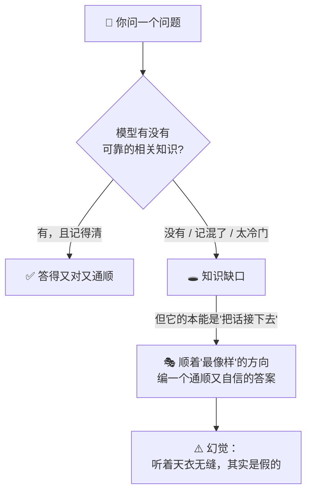
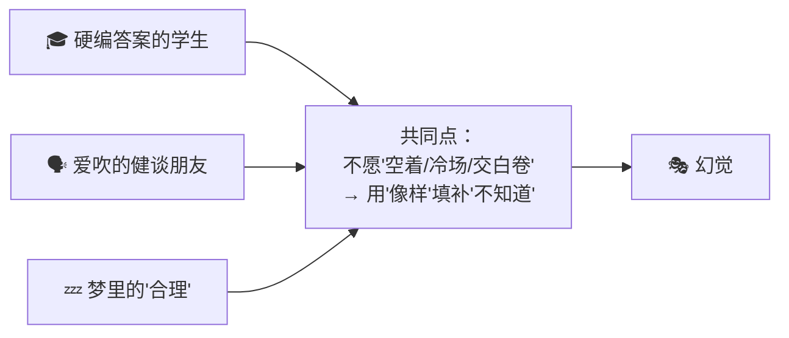
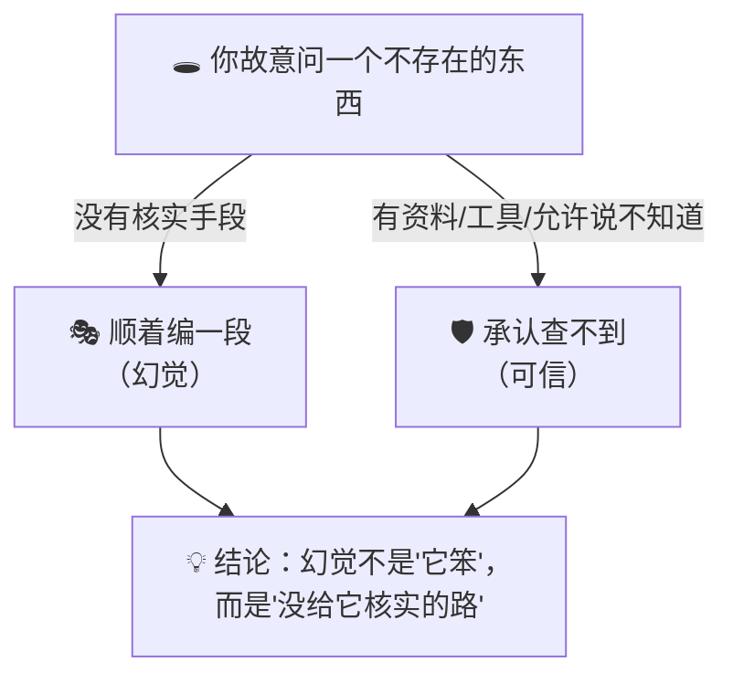

# ㉛ 什么是幻觉（Hallucination）

> 建议先读 [⑥ 什么是 LLM](./[CONCEPT-06]%20什么是LLM-大语言模型.md)、[㉘ 什么是采样与温度](./[CONCEPT-28]%20什么是采样与温度-Sampling.md) 和 [④ 什么是 RAG](./[CONCEPT-04]%20什么是RAG-检索增强生成.md)。那几篇讲了"大模型靠接龙预测下一个词""它每步在掷骰子选词""怎么给它外挂一个资料库"。这一篇要回答一个几乎每个新手都被坑过的问题：**AI 有时候一本正经、信誓旦旦地告诉你一件事，结果那件事是它编的、根本不存在——它为什么会这样？我又该怎么防？** 这个"睁眼说瞎话还特别自信"的毛病，就是本篇的主角——**幻觉（Hallucination）**。

---

## 一、一句话定义

**幻觉 = 大模型生成了一段"听起来很合理、语气还很笃定，但实际上是错的、编造的、或凭空捏造的"内容。它不是故意撒谎——它根本不知道自己错了，因为它的本事是"接一段像样的话"，而不是"核实这话是不是真的"。**

如果你只想记住一句话，就记这句：

> **大模型是个"接龙高手"，不是"事实核查员"。它每一步都在挑"最像样、最通顺"的下一个词，至于拼出来的这句话到底是不是真的——它自己也不清楚。当它把一句假话说得又通顺又自信时，就是"幻觉"。**

这一句话是整篇文档的骨架。后面所有的比喻、图、误区，都是在反复讲透这一句话。

```callout ask|小白发问
你可能会问："它不是很聪明、读过半个互联网吗？怎么还会一本正经地胡编？"——好问题！关键在于它的"本职工作"是什么。它被训练的目标，是+[把话接得像人、接得通顺](模型学的是"这个词后面，人一般会接什么词"——追求的是"像不像人说的话"，而不是"这话是不是真的")，**而不是"保证每句话都属实"**。所以当它没学过、或记混了某个事实时，它不会说"我不知道"——它会顺着"最像样"的方向，**编一个听起来天衣无缝的答案**。它不是在骗你，它是真的以为那样接最"对"。这一篇不用懂代码，抓住"它是接龙高手，不是核查员"就行～ 🐣
```

一句话摆清它和前几篇的关系：**[⑥ LLM](./[CONCEPT-06]%20什么是LLM-大语言模型.md) 讲了"它靠接龙预测下一个词"，[㉘ 采样](./[CONCEPT-28]%20什么是采样与温度-Sampling.md) 讲了"它每步在掷骰子选词"——幻觉，正是这套"接龙+掷骰子"机制的一个天然副作用：追求"像样"的接龙，本就不等于追求"属实"。**

---

## 二、为什么会有幻觉？——三个绕不开的根源

幻觉不是偶然的 bug，而是从模型"怎么工作"里长出来的必然现象。三个根源：

### 根源一：它的目标是"像样"，不是"属实"

模型训练时学的是"人一般会怎么往下接话"，追求的是**通顺、像人**。"一段通顺的假话"和"一段通顺的真话"，在"像不像人说的"这个尺度上**得分可能一样高**。所以它没有内在动力去区分真假——**它优化的是"像样"，不是"属实"。**

### 根源二：它没学过的，也会硬着头皮接

你问一个它训练资料里**没有、或很稀少**的事（某个冷门人物、最新发生的事、你公司内部的规定），它不会停下来说"这个我没资料"。它会**顺着最像样的方向，编一个**——因为"编一个通顺的"比"承认不知道"，更符合它"把话接下去"的本能。

### 根源三：掷骰子的随机性，偶尔会"选偏"

[采样](./[CONCEPT-28]%20什么是采样与温度-Sampling.md)那一篇讲过，模型每步是在候选词里"按概率掷骰子"。温度一高，它就更敢选冷门词——**偶尔一脚踩偏，就可能从"正确的下一句"滑向"编造的下一句"**，而且一旦编了个开头，后面还会顺着这个假开头一路圆下去。



**所以幻觉的本质就一句话：模型追求"接得像样"，而"像样"不等于"属实"；一旦撞上知识缺口或掷骰子选偏，它就会用一个通顺自信的编造，去填那个它其实不知道的洞。**

---

## 三、核心比喻：三个你一看就懂的画面

### 比喻一：考试硬编答案的学生

一个学生考试遇到不会的题，**不会交白卷，而是编一个看起来像模像样的答案**——用词专业、逻辑通顺，唯独内容是瞎掰的。他不是想骗老师，他是"总得写点什么"。大模型遇到知识缺口时，干的就是这事。

### 比喻二：特别会聊天但爱吹的朋友

你有没有一个朋友，天南海北什么都能接上话、聊得头头是道，但**细究起来有些"事实"是他张口就来、根本没核实过**的？他不是坏，他是"接话本能"太强，宁可编也不愿冷场。模型就是这样一个"极其会接话、但没有核实习惯"的朋友。

### 比喻三：梦里的"合理"

做梦时，梦里的情节**当下感觉特别顺、特别合理**，醒来才发现全是拼凑的、根本经不起推敲。幻觉的英文 Hallucination 本就是"幻觉/错觉"的意思——模型"梦"出一段自洽却失真的内容，而它当下并不觉得有什么不对。



**三个比喻的共同内核：面对"不知道"，它们都选择用一个"听起来合理"的东西去填补，而不是老实承认空白。** 记住这一点，幻觉是什么就再也不会忘。

```callout star|一句话点睛
幻觉最坑人的地方，不是"它错了"，而是**"它错得特别自信、特别通顺"**。一个磕磕巴巴的错误你一眼就警惕，但一段行云流水、术语精准、语气笃定的假话，最容易让你**信以为真**。所以对付幻觉的第一心法就一句：**越是流畅自信的回答，涉及关键事实时越要亲自核实——别被它的"文采"骗了。**
```

---

## 四、灵魂：幻觉最常出现在哪些"高危区"

幻觉不是均匀分布的。摸清它的"高发地段"，你就能有的放矢地警惕：

| 高危区 | 为什么容易幻觉 | 典型翻车 |
|--------|---------------|---------|
| **具体的事实/数字** | 精确数字最难记准，最容易记混或编造 | 编一个错误的年份、人口、价格 |
| **引用来源 / 文献** | 它见过"引用长什么样"，就能仿造一个格式完美但**不存在**的出处 | 编一篇不存在的论文、一个假链接 |
| **冷门 / 最新的事** | 训练资料里没有或很少 | 编造某个小众人物的生平、答错最新发生的事 |
| **它没有的私有信息** | 你公司内部规定、你的个人数据它根本不知道 | 一本正经地"猜"你们的报销流程 |
| **需要精确计算的** | 它是"接龙"不是"计算器"，长算式易出错 | 算错一道稍复杂的数学题 |

```callout note|小笔记
一个特别典型、也特别危险的幻觉是**"编造引用"**：你让它"给我几篇关于 X 的论文"，它可能给你几个**标题、作者、期刊都煞有介事，但根本查无此文**的"论文"。因为它学过"论文引用长什么格式"，仿造格式对它太容易了。**凡是 AI 给的出处、链接、文献，务必自己去查证一下再用**——这是新手最容易栽的一个跟头。
```

---

## 五、幻觉 vs 说谎 vs 犯错：别混为一谈

新手常把这几个搅在一起，其实差别很大：

```flip
🤔 猜猜看：AI 幻觉和"人说谎"，最根本的区别在哪？
---
✅ 差在"知不知道自己错了"。人说谎是"明知真相、故意说假"（有欺骗意图）；AI 幻觉是"它自己都以为那是对的"（没有意图，是机制副作用）。它不是坏，是"接龙求像样"的本能撞上了知识缺口——所以你不能靠"劝它别撒谎"来治，只能靠机制去防（给资料、让它核对、给它说"不知道"的台阶）。
```

| | **幻觉（AI）** | **说谎（人）** | **普通犯错** |
|---|---|---|---|
| 有没有欺骗意图 | **没有**，它以为是对的 | **有**，明知假故意说 | 没有 |
| 根源 | 机制副作用（求像样≠求属实） | 主观动机 | 疏忽/能力不足 |
| 特点 | 通顺、自信、天衣无缝 | 可能露破绽 | 常常自己也心虚 |
| 怎么治 | 靠机制防（给资料/核对/给台阶） | 靠诚信约束 | 靠细心/学习 |

**一句话点破：幻觉不是"AI 变坏了"，而是"接龙求像样"这套机制的天然副产品。** 所以你不能靠"批评它、让它别撒谎"来解决——它根本不觉得自己在撒谎。**得靠工程手段去防**，这正是下一节的重点。

---

## 六、感觉一下：一次幻觉长什么样，又怎么被"接住"

**⚠️ 提醒：下面这段你完全不用会写。** 只体会那个**知识缺口 → 自信编造 → 被机制接住**的过程：

```text
🙋 你问：帮我介绍一下"李默然教授在 2019 年提出的量子折叠理论"。
        （注意：这个人和理论是我编的，根本不存在）

🎭 幻觉版（没有任何防护时）：
   「李默然教授是国内量子信息领域的知名学者，他在 2019 年提出的
    '量子折叠理论'指出……该理论发表于《物理学报》，引起了广泛
    关注……」
   → 通顺、专业、自信——但每个字都是编的。它撞上知识缺口，
     没有停下来，而是顺着"最像样"的方向圆了一整段。

🛡️ 被机制接住后（给它核实手段 / 允许它说不知道）：
   「我没有查到'李默然教授'或'量子折叠理论'的可靠资料，这个
    名称可能有误，或它不是一个广为人知的概念。要不要我帮你
    查证一下，或者你确认下名称？」
   → 它老实承认了缺口，而不是硬编。
```

看到那两版的天壤之别了吗？**同一个"它其实不知道"的处境，没防护时它会自信地编（幻觉），有防护时它会老实地承认（可信）。** 幻觉治不治得住，很大程度上取决于**你给不给它"核实的手段"和"说不知道的台阶"**——这正是 RAG、工具、以及 Khy-OS 这类骨架在做的事。

把这场"同一个坑，两种结局"演成一幕小短剧——你会看到幻觉不是"它坏了"，而是**有没有人给它一条"核实的路"**：

```scene 同一个坑，两种结局：编一段 vs 说不知道
> 你故意挖了个坑：问一个根本不存在的人和理论。
🧑 你 | 帮我介绍一下"李默然教授在 2019 年提出的量子折叠理论"。
> 场景一：没有任何防护，它只能凭记忆硬接。
🤖 AI（无防护） | 李默然教授是量子信息领域的知名学者，他 2019 年提出的"量子折叠理论"指出……该成果发表于《物理学报》，引起广泛关注。
😰 旁白 | 通顺、专业、自信——可每个字都是编的。它撞上知识缺口没停下，顺着"最像样"的方向圆了一整段。
> 场景二：给它一条 +[核实的路](RAG 喂可靠资料、给查证工具、允许它说"不知道"——用机制兜底，而不是劝它"别撒谎")，再问同一句。
🤖 AI（有防护） | 我查证后没找到"李默然教授"或"量子折叠理论"的可靠资料，这个名称可能有误，要不要我帮你再查证一下？
🎉 旁白 | 同一个"它其实不知道"的处境——没防护时自信地编，有防护时老实地认。差别不在模型聪不聪明，在你给没给它核实的手段。
```

---

## 七、常见误区（新手最容易踩的坑）

### 误区 1：以为幻觉是"AI 坏了 / 出 bug 了"

- ❌ 以为出现幻觉就是模型故障、质量差。
- ✅ **幻觉是"接龙求像样"机制的天然副作用，再强的模型也会有，只是概率高低不同。** 它不是 bug，是这类模型的固有特性。你能做的是"防和减"，而不是指望"彻底根除"。

### 误区 2：以为"回答得越自信 = 越可靠"

- ❌ 觉得它答得那么笃定、那么专业，肯定是对的。
- ✅ **自信和正确毫无关系。** 幻觉恰恰最爱"一本正经"。**语气笃定不是可信的证据**，关键事实一律以核实为准。

### 误区 3：以为"让它保证不撒谎"就能治好

- ❌ 在提示里写一句"请不要编造、必须真实"，就以为万事大吉。
- ✅ **有帮助，但远不够。** 它不觉得自己在撒谎，光"叮嘱"治标不治本。真正有效的是**给它靠谱资料（RAG）、给它查证工具、允许它说"不知道"**——用机制兜底，而非仅靠一句嘱咐。

### 误区 4：以为幻觉只出现在"高深问题"上

- ❌ 觉得只有问很难的问题才会幻觉，日常问答很安全。
- ✅ **恰恰相反，越具体的小事实越容易翻车**——一个年份、一个数字、一个链接、一段引用。日常里这些"看着不起眼"的细节，正是幻觉高发区。

### 误区 5：以为幻觉无解，所以 AI 不能用

- ❌ 一听"AI 会编"，就觉得它不可信、干脆别用了。
- ✅ **幻觉可防可减，AI 依然极其有用。** 关键事实自己核实、用 RAG 喂它可靠资料、让它给出处再查证、把它当"能干但需复核的助手"而非"绝对权威"——用对方法，它的价值远大于风险。

```quiz
Q: 下面关于"幻觉（Hallucination）"的说法，哪些是对的？（多选）
- [x] 幻觉是"接龙求像样"机制的天然副作用，不是故意撒谎、也不是单纯的 bug
> 对。模型优化的是"像不像人说的话"而非"是否属实"，撞上知识缺口就会自信地编。
- [x] 回答得越自信、越通顺，也不代表越可靠，关键事实要自己核实
> 对。幻觉最爱"一本正经"，自信和正确毫无关系——别被文采骗了。
- [ ] 只要在提示里写一句"不许编造"，就能彻底根除幻觉
> 错。它不觉得自己在撒谎，光叮嘱治标不治本；要靠 RAG、工具、允许说"不知道"等机制兜底。
- [ ] 幻觉只在很难的问题上出现，日常小问答很安全
> 错。越具体的小事实（年份/数字/链接/引用）越容易翻车，正是高发区。
- [x] 给它可靠资料（RAG）、给它查证工具、允许它说"不知道"，能显著减少幻觉
> 对。给它核实的手段和承认缺口的台阶，是防幻觉最有效的工程手段。
```

---

## 八、动手小实验 / 思想实验

### 实验：故意挖个"坑"，看它跳不跳

找个 AI，故意问它一个**你确信不存在**的东西，比如"介绍一下《XX 教授关于反重力早餐的 2021 年研究》"（随便编一个）。观察它：

- 如果它**顺着编了一整段**煞有介事的介绍——你就亲眼见到了一次幻觉。
- 如果它**说"我没查到相关资料，这可能不存在"**——它被训练得更谨慎、或有核实手段兜底。

再对比：把同样的问题，喂给一个**能联网/能查资料**的 AI，看它是不是更容易识破你的坑。**你会直观感受到：给不给它"核实手段"，直接决定它掉不掉进幻觉。**



**关键体会**：幻觉不是玄学，你亲手就能复现，也亲手就能"接住"。**它掉不掉进坑，很大程度上取决于你有没有给它一条"核实的路"和一个"说不知道的台阶"。** 理解这一点，你就从"被 AI 骗过一次的新手"，升级成了"知道怎么防 AI 幻觉的人"。

---

## 九、和其它概念的关系

- **[⑥ LLM](./[CONCEPT-06]%20什么是LLM-大语言模型.md)**：幻觉是"接龙预测下一个词"这套机制的天然副产品——追求"像样"本就不等于"属实"。
- **[㉘ 采样与温度](./[CONCEPT-28]%20什么是采样与温度-Sampling.md)**：温度越高、掷骰子越野，越容易"选偏"滑向编造；求准的活压低温度能减一点幻觉。
- **[④ RAG](./[CONCEPT-04]%20什么是RAG-检索增强生成.md)**：给模型外挂一个可靠资料库、让它"照着资料答"，是**对付幻觉最主流的工程手段**。
- **[② 工具调用](./[CONCEPT-02]%20什么是ToolCalling-工具调用.md)**：让它真去查（搜索、查数据库），而不是凭记忆瞎猜，也能显著减少编造。
- **[㉖ RLHF](./[CONCEPT-26]%20什么是强化学习-RLHF.md)**：出厂前用"胡说扣分、承认不知道加分"的赏罚调教，能让它更诚实、更少硬编。

```callout tip|一句话收尾
幻觉是你入行 AI **第一个必须搞懂的坑**，也是你日后用好一切 AI 工具的护身符。记住三句：**①它是接龙高手不是核查员，会编且编得自信；②越是流畅笃定，涉及关键事实越要自己核实；③防它靠机制——给资料(RAG)、给工具、允许它说"不知道"，而不是靠"劝它别撒谎"。** 懂了这三句，你就再也不会被 AI "一本正经的胡说"轻易骗到了。
```
