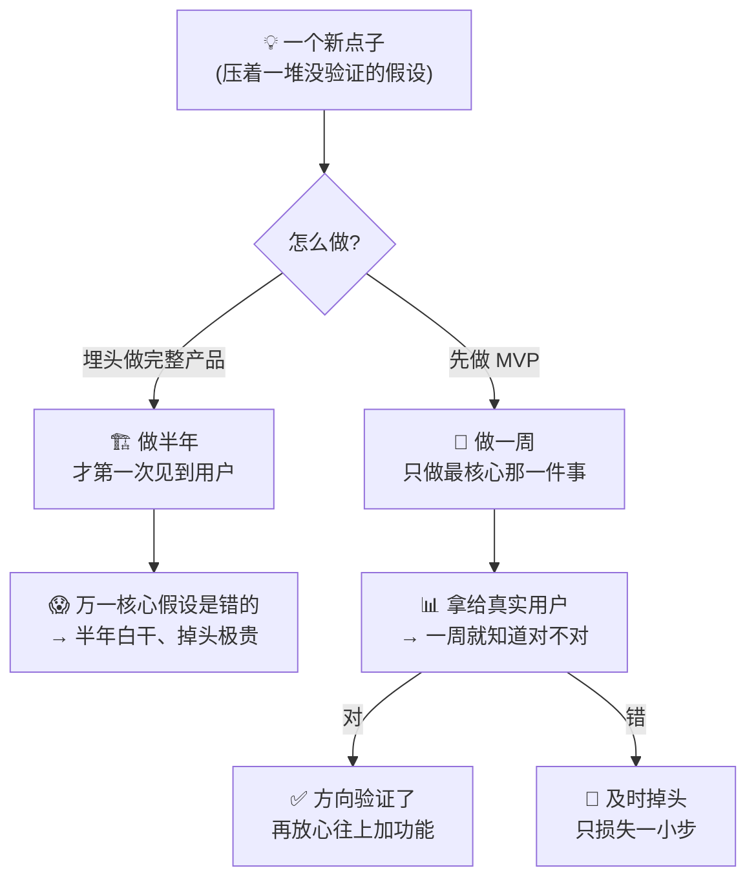
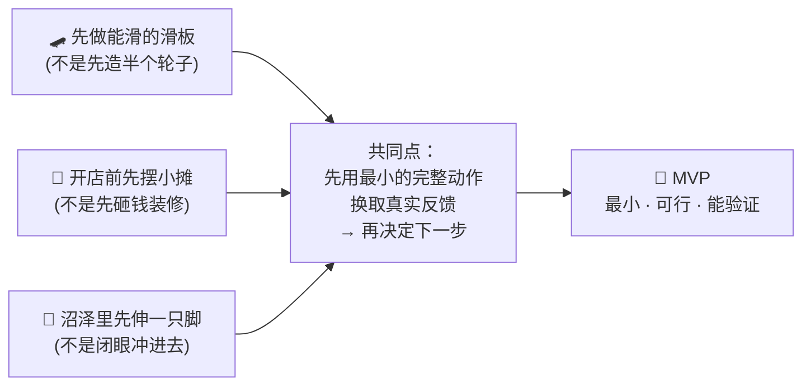
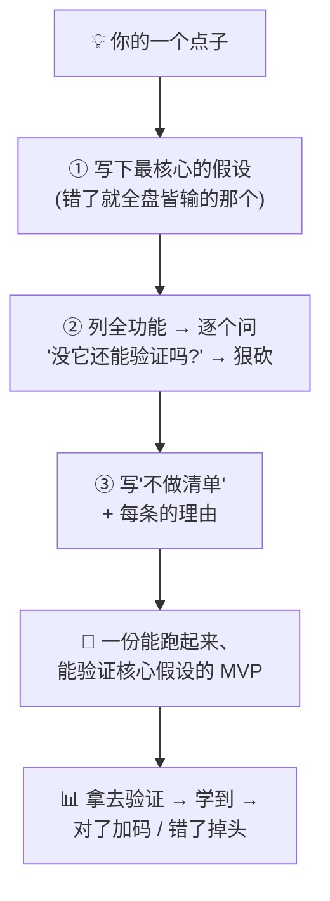

# ㉜ 什么是 MVP（最小可行产品）

> 建议先读 [① 什么是 Agent](./[CONCEPT-01]%20什么是Agent-智能体.md) 和 [㉓ 计划与执行](./[CONCEPT-23]%20什么是计划与执行-PlanAndExecute.md)。那两篇讲了"AI 助理会自己拿主意干活""复杂任务先列计划再逐步做"。这一篇要回答一个几乎每个新手做项目时都会栽的问题：**我脑子里有个很酷的点子，功能想了一大堆，到底该先做哪个、能不能少做点先跑起来看看？** 这个"先做最小的一版、拿去验证、再决定往下加什么"的做法，就是本篇的主角——**MVP（Minimum Viable Product，最小可行产品）**。它既是产品思维，也是 Khy-OS 里 `/idea-refine`（点子打磨）技能每次都在帮你做的事。

---

## 一、一句话定义

**MVP = 你能做出来的、最小的一版，但它必须能真正解决那个核心问题、能拿给真实用户用、能让你验证"这个点子到底行不行"。关键词是三个：最小（Minimum，砍到不能再砍）、可行（Viable，还能用、能验证）、产品（Product，是能交到用户手里的东西，不是半成品）。**

如果你只想记住一句话，就记这句：

> **MVP 不是"做得很烂的完整产品"，而是"只做那一件最核心的事、但把它做成能用能验证的样子"。它的目的不是交付，而是学习——用最小的代价，最快搞清楚"我这个点子值不值得继续做"。**

这一句话是整篇文档的骨架。后面所有的比喻、图、误区，都是在反复讲透这一句话。

```callout ask|小白发问
你可能会问："那 MVP 不就是偷工减料、糊弄一个半成品吗？"——恰恰相反！MVP 的难点不在"做得少"，而在 +[砍得准](砍掉的是"锦上添花"的功能，留下的必须是"没它这事就不成立"的那个核心——这需要想得很清楚，比堆功能难多了)。糊弄半成品是"什么都做一点、什么都不能用"；MVP 是"只做一件事、但那一件能用、能验证"。这一篇不用懂代码，抓住"最小但能验证"就行～ 🐣
```

一句话摆清它和前几篇的关系：**[㉓ 计划与执行](./[CONCEPT-23]%20什么是计划与执行-PlanAndExecute.md) 讲了"复杂任务先列计划再逐步做"——MVP 就是这套思路用在"做产品/做项目"上的第一步：先别列一个庞大计划，先切出"最小能验证的一小步"跑起来，用真实反馈来校准后面的计划。**

---

## 二、为什么要做 MVP？——三个绕不开的理由

MVP 不是"资源不够时的妥协"，而是一种主动选择的、更聪明的做事方式。三个理由：

### 理由一：你脑子里的点子，八成有个错误假设

任何新点子，本质上都压着一堆**你以为对、但没验证过**的假设（"用户会喜欢""大家会为这个付钱""这个功能是刚需"）。你埋头做半年的完整产品，很可能是**在一个错误假设上盖了一栋楼**。MVP 让你在盖楼之前，先花一周验证"地基到底稳不稳"。

### 理由二：真实反馈，比想象值钱一百倍

你一个人在屋里想"用户会怎么用"，想得再周全也是猜。**把最小的一版交到真实用户手里，一天收到的反馈，胜过你闭门想一个月。** MVP 的核心价值就是——**尽早、尽快地拿到真实世界的反馈**，用它来决定下一步。

### 理由三：省下的是你最贵的东西——时间

功能做得越多，改起来越贵、掉头越难。先做 MVP，等于**在投入最小时先探路**：方向对，再往上加；方向错，及时掉头，损失的只是那一小步。



**所以 MVP 的本质就一句话：用最小的代价，最快验证你点子里那个最关键的假设——对了再加码，错了早掉头。**

---

## 三、核心比喻：三个你一看就懂的画面

### 比喻一：先做一块能滑的滑板，别憋一辆完整汽车

用户的真实需求是"从 A 到 B"。错误做法是先造一个轮子（不能用）、再造车架（还不能用）、最后憋出一辆完整汽车才第一次交付。**MVP 做法是：先做一块滑板**——它简陋，但**现在就能从 A 到 B**，用户能用、你能收反馈；然后滑板 → 滑板车 → 自行车 → 摩托车 → 汽车，**每一步都是"能用的完整东西"**，每一步都在收真实反馈。

### 比喻二：开餐厅前，先摆个周末小摊

你想开一家大餐厅，梦想很大。聪明的做法不是先砸几百万装修，而是**先在周末摆个小摊卖你的招牌菜**——租金几乎为零，但你能立刻知道：**这菜到底有没有人买、大家愿意付多少钱、回头客多不多。** 摊子火了，再谈开店；没人买，你只亏了一个周末，而不是几百万。

### 比喻三：探路的第一脚

走进一片没走过的沼泽，你不会闭着眼冲进去。你会**先伸一只脚试探**，踩实了再迈下一步。MVP 就是产品世界里的"先伸一只脚"——**用最小的动作，试探前面到底是实地还是烂泥。**



**三个比喻的共同内核：都是"先用最小的、但完整能用的一步，去换真实世界的反馈，再决定要不要往下走"。** 记住这一点，MVP 是什么就再也不会忘。

```callout star|一句话点睛
MVP 最容易被误解的地方，是把"Minimum（最小）"听成了"简陋、粗糙、做得烂"。真正的重点其实是 **"Viable（可行）"**——它必须**真的能用、能解决那个核心问题、能让你学到东西**。一块能滑的滑板是合格的 MVP；半个轮子不是，因为它谁也载不动、什么也验证不了。**判断一个 MVP 合不合格，就问一句：它能不能把那个最核心的假设验证掉？**
```

---

## 四、灵魂：怎么切出一个好的 MVP

切 MVP 的功夫，全在**"砍"**上。三步：

### 第一步：找到那"唯一一个"最核心的假设

你的点子里，哪个假设**一旦是错的，整件事就不成立**？（比如做喝水提醒 App，最核心的假设可能是"人们不喝水是因为提醒时机不对，而不是根本不在乎"。）**MVP 的唯一使命，就是验证这一个假设。** 别的都往后放。

### 第二步：只留"没它这事就不成立"的功能

把想到的所有功能列出来，对每一个问：**"没有它，我还能验证那个核心假设吗？"** 能，就砍掉（先不做）。不能，才留下。留下的，往往少得让你心疼——**这是对的，心疼说明你砍到位了。**

### 第三步：写一份"不做什么"清单，并说清为什么

这是最反直觉、也最值钱的一步：**明确写下"这一版我故意不做哪些功能，以及为什么"。** 因为"聚焦"的本质不是"选择做什么"，而是**"对一堆好点子说不"**。把不做的理由写清楚，你才不会中途手痒又把它们塞回来。

| 切 MVP 时问自己 | 说明 |
|----------------|------|
| **核心假设是哪一个？** | 找到那个"错了就全盘皆输"的假设，MVP 只为验证它 |
| **没这个功能还能验证吗？** | 能 → 砍掉；不能 → 留下。留下的越少越好 |
| **我故意不做什么？为什么？** | 写"不做清单"，把 trade-off 说清楚，防止中途反悔加码 |
| **能不能更小？** | 想想"10 倍更简单的版本长什么样"，哪怕不做，也用它校准 |

```callout note|小笔记
一个特别好用的自检：**"如果只能保留一个功能，我留哪个？"** 这个问题会逼你瞬间看清什么是核心、什么是锦上添花。很多人做 MVP 失败，不是因为不会做，而是**舍不得砍**——总觉得"这个也挺重要""顺手就做了吧"。记住：**MVP 阶段每多做一个功能，都在推迟你拿到真实反馈的那一天。**
```

---

## 五、MVP vs 原型 vs 完整产品：别混为一谈

新手常把这几个搅在一起，其实差别很大：

```flip
🤔 猜猜看：MVP 和"原型（Prototype）"最根本的区别在哪？
---
✅ 差在"给不给真实用户用、要不要真的解决问题"。原型（Prototype）通常是给自己/团队看的**草图或演示**，用来试界面、试感觉，可以是假数据、点了没反应——它验证的是"长这样行不行"。MVP 是**真交到用户手里、真能解决那个核心问题**的最小产品——它验证的是"这事到底有没有人要"。一句话：原型验证"形态"，MVP 验证"价值"。
```

| | **MVP（最小可行产品）** | **原型（Prototype）** | **完整产品** |
|---|---|---|---|
| 给谁用 | **真实用户** | 通常给自己/团队 | 所有目标用户 |
| 能不能真解决问题 | **能**（哪怕只解决核心那点） | 不一定（常是演示/假数据） | 能，且全面 |
| 主要目的 | **验证核心假设、学习** | 试形态、试感觉 | 交付、规模化 |
| 功能多少 | 砍到不能再砍 | 看要试什么 | 完整 |
| 心态 | "最小代价换最快学习" | "先看看长这样对不对" | "把该有的都做好" |

**一句话点破：原型是"看看长这样行不行"，MVP 是"看看这事有没有人真的要"，完整产品是"确定要了，把它做扎实做全"。** 三者是一条路上的三段，不是三选一。做项目的正确顺序常常是：**（可选）原型试形态 → MVP 验证价值 → 验证通过再做完整产品**。跳过 MVP 直奔完整产品，是新手最贵的一课。

---

## 六、感觉一下：同一个点子，堆功能 vs 切 MVP

**⚠️ 提醒：下面不用会写代码。** 只体会那个**"想做一大堆" → "砍到只剩核心一件" → "拿去验证"**的过程。假设你的点子是"做一个帮人喝够水的 App"：

```text
💭 新手的第一版清单（想到什么加什么）：
   ☑ 智能水杯硬件，自动感应喝了多少
   ☑ 每日/每周喝水量图表统计
   ☑ 连续打卡、成就徽章、好友排行榜
   ☑ 接入健康 App、同步体重心率
   ☑ 多种提醒铃声、深色模式、会员订阅
   → 想做半年，半年后才第一次见到用户。
     万一"人们根本不缺提醒、缺的是好时机"——全白干。

✂️ 切成 MVP（只为验证一个假设："提醒失败是因为时机不对"）：
   ☑ 读一下你的日历，只在"忙完一段会议后的空档"轻推一次
   ☑ 一个"喝了 💧"的按钮记一下
   ✗ 不做硬件、不做图表、不做打卡排行、不做健康同步、不做会员
   → 一周做完，交给 10 个真实用户，一周就知道：
     "按时机提醒"到底有没有让他们真的多喝水、愿不愿意留着这 App。
```

看到那两版的天壤之别了吗？**同一个点子，堆功能版要赌半年、还赌在一个没验证的假设上；切 MVP 版一周就能拿到真实答案。** 差别不在"谁更努力"，而在**谁更早、更便宜地搞清楚了"这事到底行不行"。** 这正是 Khy-OS 的 `/idea-refine`（点子打磨）技能每次都在帮你做的事——逼你把点子收敛成一份带 **MVP Scope（最小范围）** 和 **Not Doing（不做清单）** 的一页纸。

把这场"同一个点子，两种活法"演成一幕小短剧——你会看到 MVP 不是"做得少"，而是**"想得清楚、砍得果断"**：

```scene 同一个点子，两种活法：堆功能 vs 切 MVP
> 你兴冲冲报出一个点子，功能想了一整页。
🧑 你 | 我要做个喝水提醒 App！智能水杯、图表、打卡排行、健康同步、会员……全都要！
> 甲方案：不打磨，直接照单全做。
🙂 埋头做的你 | 好，那我开做，估计半年能上线。
😰 旁白 | 半年后第一次交给用户，才发现——大家不缺提醒，缺的是"别在开会时吵我"。核心假设错了，半年白干。
> 乙方案：先用 /idea-refine 把点子打磨一遍。
🤖 点子打磨 | 先别急着堆功能。你赌的是"人们没喝够水是因为提醒时机不对"对吧?那这一版就只做一件事:读日历,在会议空档轻推一次。硬件、图表、排行——全部先不做。
🧑 你 | ……只做这么点?
🤖 点子打磨 | 对。它唯一的使命是验证那个假设。一周做完,交给 10 个人,一周就知道对不对。对了再加,错了只亏一周。
🎉 旁白 | 同一个点子——堆功能版赌半年,切 MVP 版赌一周。MVP 不是做得少,是把"最该先回答的问题"最快回答掉。
```

---

## 七、常见误区（新手最容易踩的坑）

### 误区 1：以为 MVP = "做得很烂 / 半成品"

- ❌ 觉得 MVP 就是随便糊一个粗糙、bug 一堆的东西。
- ✅ **MVP 可以功能少，但在它做的那件事上必须"能用、靠谱、能验证"。** 重点是 **Viable（可行）**——一块能滑的滑板，不是半个装不上的轮子。质量不打折，只是**范围**打折。

### 误区 2：舍不得砍，什么功能都想塞进"第一版"

- ❌ "这个也挺重要""那个顺手就做了"，结果 MVP 越滚越大，最后跟完整产品没区别。
- ✅ **MVP 的功夫全在"砍"。** 每多留一个功能，都在推迟你拿到真实反馈的那天。反复问："没它，我还能验证核心假设吗？"能就砍。

### 误区 3：以为 MVP 是"一次性的、做完就扔"

- ❌ 觉得 MVP 是个临时草稿，验证完就推倒重来。
- ✅ **好的 MVP 是"能长大的最小版本"**（滑板 → 自行车 → 汽车，是同一条演进线）。它是你产品的**第一版真身**，不是一次性 demo；后续是在它上面**加**，而不是推倒。

### 误区 4：跳过验证，把 MVP 当成"先上线再说"

- ❌ 做完 MVP 就急着铺广告、拉用户、加功能，忘了它本来是用来**学习**的。
- ✅ **MVP 的产出不是"上线"，是"学到"。** 做完一定要问：那个核心假设，到底被验证了没有？**先看反馈、再决定下一步**，而不是闷头往下冲。

### 误区 5：以为只有创业/做 App 才用得上 MVP

- ❌ 觉得 MVP 是"产品经理的词"，跟我写代码、做小项目没关系。
- ✅ **MVP 是一种通用的做事思维**：写个脚本、搭个内部工具、甚至学一门新技术，都可以"先做最小能跑通的一版，验证思路对不对，再扩"。你入行 AI 的第一个项目，尤其该这么干。

```quiz
Q: 下面关于"MVP（最小可行产品）"的说法，哪些是对的？（多选）
- [x] MVP 的目的是用最小代价最快验证核心假设，重点是"能验证"而非"功能全"
> 对。MVP 是用来学习的——尽早拿到真实反馈，对了再加码，错了早掉头。
- [x] MVP 可以功能少，但在它做的那件事上必须真能用、能解决核心问题（Viable）
> 对。一块能滑的滑板是合格 MVP；半个装不上的轮子不是——质量不打折，只是范围打折。
- [ ] MVP 就是随便糊一个粗糙的半成品，做得烂一点没关系
> 错。"Minimum"指范围最小，不是质量最烂；核心那件事必须靠谱可用。
- [ ] 做 MVP 时应该尽量把想到的功能都塞进第一版，免得以后漏
> 错。恰恰相反，MVP 的功夫全在"砍"——每多一个功能都在推迟拿到真实反馈。
- [x] 写一份"不做什么(Not Doing)"清单、并说清理由，是切 MVP 最有价值的一步
> 对。聚焦的本质是"对一堆好点子说不"，写清不做的理由能防止中途手痒加码。
```

---

## 八、动手小实验 / 思想实验

### 实验：把你自己的一个点子，切成 MVP

拿一个你真正想做的点子（一个 App、一个脚本、一个小工具都行），做三件事：

1. **写下核心假设**：这个点子，哪一个假设一旦错了就全盘皆输？（"用户会用""有人愿意付钱""这是刚需"……挑那个最要命的。）
2. **列全功能，然后狠狠砍**：把你想做的功能全列出来，对每一个问"没它还能验证核心假设吗"，能就划掉。看看最后剩几个——大概率会少得让你心疼。
3. **写一份"不做清单"**：把划掉的写成"这一版我故意不做 X、Y、Z，因为……"。

然后，如果你在用 Khy-OS，直接对它说 **"帮我用 idea-refine 打磨这个点子"**（或 `/idea-refine`），看它怎么带你走完这三步、最后吐出一份带 **MVP Scope** 和 **Not Doing** 的一页纸。



**关键体会**：MVP 不是玄学，也不是产品经理的专利。**它就是一套"先想清楚最该验证什么、狠狠砍到只剩核心、拿去换真实反馈"的做事纪律。** 学会它，你做任何项目——尤其是你入行 AI 的第一个项目——都会少走一大段弯路。

---

## 九、和其它概念的关系

- **[㉓ 计划与执行](./[CONCEPT-23]%20什么是计划与执行-PlanAndExecute.md)**：MVP 是"先列计划再逐步做"用在做产品上的第一步——先切最小能验证的一步，用反馈校准后面的计划。
- **[① Agent](./[CONCEPT-01]%20什么是Agent-智能体.md)**：Khy-OS 这个 Agent 里就内置了 `/idea-refine`（点子打磨）技能，专门帮你把点子收敛成带 MVP Scope 的一页纸。
- **[⑤ Skill](./[CONCEPT-05]%20什么是Skill-技能.md)**：`/idea-refine` 正是一个把"打磨点子、切 MVP"的套路打包好的 Skill——它每次都逼你产出"不做清单"。
- **[㉒ 反思](./[CONCEPT-22]%20什么是反思-Reflection.md)**：MVP 拿到真实反馈后"回头看假设对不对、再决定下一步"，正是反思思路在产品上的体现。
- **[⑦ Prompt](./[CONCEPT-07]%20什么是Prompt-提示词.md)**：你对 AI 说清"帮我切一个 MVP、列出不做清单"，本身就是一次好提示词的实践。

```callout tip|一句话收尾
MVP 是你做**任何**项目都用得上的护身符，尤其是你入行 AI 的第一个项目。记住三句：**①最小≠最烂——范围砍到不能再砍，但那件事必须真能用、能验证；②MVP 的产出不是"上线"，是"学到"——用最小代价最快验证核心假设；③最值钱的一步是写"不做清单"——聚焦的本质是对一堆好点子说不。** 懂了这三句，你就不会再一头扎进"憋半年大作、结果方向错了"的坑，而是像高手一样：先伸一只脚探路，踩实了再走。
```
