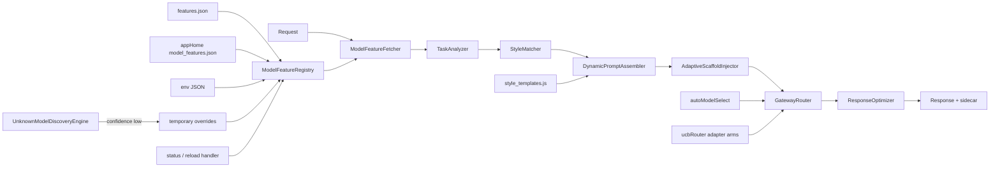

# 动态模型差异化适配引擎

> 状态：核心模块已实现；宿主 HTTP 路由与真实网关调用点待单独挂载。
> 优先级：零构建、实时生效、每请求动态适配、未知模型可降级。

## 1. 设计结论

本引擎使用纯 CommonJS、JSON 和普通 JavaScript，不引入编译、打包、代码生成或新增生产依赖。模型画像和提示策略在请求到来时解析；配置文件保存后，下一次请求读取新内容。功能总闸默认关闭，关闭时沿用现有 `promptAssemblyService` / `autoModelSelect` 行为。

模型相关提示只进入动态上下文，不进入稳定前缀。稳定前缀必须跨轮保持字节一致，才能命中 provider prompt cache；模型、任务、上下文和用户偏好本来就是每请求变化的数据。

## 2. 架构



### 模块边界

| 模块 | 责任 | IO | 门控关闭行为 |
|---|---|---:|---|
| `modelFeatureRegistry.js` | 8 层画像解析、缓存、热重载、临时覆盖 | 文件读取 | 注册表可独立读取；调用方决定是否采用 |
| `dynamicPromptAssembler.js` | 六步现场组装、段落预算、nudge、动态参数 | 模板读取 | 返回空 appendix |
| `enhancedModelSelector.js` | tier 过滤后叠加专长/成本/UCB 排序 | 画像读取 | 原样返回既有排序 |
| `perRequestAdaptationPipeline.js` | 七阶段同步编排、阶段故障隔离 | 依赖决定 | 返回原 request 引用 |
| `modelDiscoveryEngine.js` | 可注入探测、能力推断、低置信度临时保存 | probe runner | 不执行探测 |
| `responseOptimizers.js` | 生成响应呈现策略；显式选择时处理纯文本 | 无 | 调用方不接入即无影响 |
| `modelAdaptationHttp.js` | 状态与显式 reload 的可挂载处理器 | HTTP 响应 | 未挂载即无影响 |

## 3. 画像解析与热更新

解析优先级从高到低：

1. `KHY_MODEL_FEATURES_JSON`
2. `saveTemporarily()` 运行时覆盖
3. `<appHome>/model_features.json`
4. `features.json.models[modelId]`
5. `features.json.patterns[]`
6. `features.json.tierDefaults[tier]`
7. `modelTier.resolveTier()` + `harnessProfile()` 推断
8. `features.json.defaults`

默认 `KHY_MODEL_FEATURES_TTL_MS=0`，每次读取先执行 `statSync`。当 mtime 距当前时间小于 2 秒时，不信任 mtime+size 快路径，重新读取文本并逐字节比较，覆盖同长度快速连存的文件系统时间戳边界。稳定文件只做 stat；内容未变不重新解析。

`style_templates.js` 不依赖 `require.cache`。加载器直接读取文本，在禁止 `require` 的 CommonJS shim 中解释字面量配置；这也能在 Jest 的独立模块注册表下验证热更新。配置写坏时保留上一份有效数据，修复后的下一次请求自动恢复。

显式重载处理器：

- `GET /api/model-adaptation/status`
- `POST /api/model-adaptation/reload`

重载只清除注册表缓存并增加 generation。正在执行的请求继续使用其已经取得的画像；后续请求读取新 generation。

## 4. 接口

```ts
type PromptPreference = 'concise' | 'detailed' | 'structured';
type ResponseStyle = 'direct' | 'elaborated' | 'explainer';
type ToolTendency = 'aggressive' | 'conservative' | 'balanced';
type Confidence = 'prior' | 'low' | 'measured';

type CapabilityDimension =
  | 'text' | 'code' | 'reasoning' | 'tool_use' | 'vision'
  | 'long_context' | 'instruction_following' | 'structured_output'
  | 'multilingual' | 'speed' | 'cost_efficiency';

interface ModelFeatureProfile {
  confidence: Confidence;
  source: string;
  capability_matrix: Record<CapabilityDimension, 0 | 1 | 2 | 3 | 4 | 5>;
  style_profile: {
    prompt_preference: PromptPreference;
    response_style: ResponseStyle;
    tool_usage_tendency: ToolTendency;
    scaffolding_comfort_level: number; // 1..10，越高越需要脚手架
  };
  specialty_areas: { strengths: string[]; weaknesses: string[] };
  routing_priority: {
    always_prefer_for: string[];
    default_choice_for: string[];
    avoid_when_budget_is: 'low' | 'medium' | 'high' | null;
  };
  prompt_templates: {
    system_overview: { concise_version: string; detailed_version: string };
    section_boost_rules: SectionBoostRule[];
    nudge_preferences: Array<string | object>;
  };
  dynamic_params: {
    preferred_timeout_ms: number;
    max_tools_per_turn: number;
    parallel_tool_allowance: number;
  };
}

interface DynamicPromptResult {
  sections: Array<{ id: string; title: string; body: string; reason: string }>;
  scaffoldingLevel: number | null;
  tailoredNudges: string[];
  appendix: string;
  dynamicParams: ModelFeatureProfile['dynamic_params'];
  meta: object;
}
```

JSON 配置的结构约束：

```json
{
  "$schemaVersion": 1,
  "defaults": { "...ModelFeatureProfile": "..." },
  "tierDefaults": { "T0": {}, "T1": {}, "T2": {}, "T3": {} },
  "patterns": [
    { "id": "family", "match": "^family-", "profile": {} }
  ],
  "models": { "exact-model-id": {} }
}
```

运行时使用手写宽进严出校验，不依赖开发期 JSON Schema 库。非法字段退回默认值，未知 section id 被忽略，未知模型仍得到完整画像。

## 5. 动态组装算法

`assemblePromptForModel(requestContext)` 每次执行：

1. `registry.get(modelId)` 读取当前完整画像。
2. `analyzeTask()` 归一任务类型、上下文长度、工具可用性和用户偏好。
3. `selectSections()` 按 `when` 和脚手架阈值选择目录段落。
4. `applyBoostRules()` 强制加入或抑制段落；冲突时 suppress 优先。
5. `generateTailoredNudges()` 按工具倾向、任务和脚手架生成最多 4 条提醒。
6. `calibrateScaffolding()` 结合模型档位、强弱项、上下文和用户偏好校准 0..10。

同一模型在 concise / detailed、短 / 长上下文、带 / 不带工具、强项 / 弱项任务上得到不同 appendix、段落数、nudge 和工具动态参数。

`coding_standards` 标记为 `providedByStablePrefix:true`，默认不在动态区域重复计费；只有画像明确 boost 时才重复注入。

## 6. 增强选型

先调用现有 `autoModelSelect.rankAutoModels()` 做 tier 和可用性过滤，再计算：

```text
specialtyMatch = clamp(0.2 + strength*0.5 - weakness*0.3, 0, 1)
overallScore   = specialtyMatch*0.6 + costEfficiency*0.4
blended        = normalizedUcb*0.3 + overallScore*0.7
```

`always_prefer_for`、`default_choice_for` 和 `avoid_when_budget_is` 在 overall 阶段施加可解释加减分。UCB arm 的实际粒度是 adapter，不是 model；同一 adapter 下的模型共享探索信号。未拉取 arm 的 `+Infinity` 归一为 1，有限值 min-max 归一，全相等为 0.5；没有 adapter 的候选也使用中性 0.5。

## 7. 快速开始

不需要构建。后端进程环境中打开总闸：

```powershell
$env:KHY_MODEL_ADAPT = '1'
```

子能力默认随总闸打开，可单独回退：

```powershell
$env:KHY_DYNAMIC_PROMPT = '0'
$env:KHY_ENHANCED_MODEL_SELECT = '0'
$env:KHY_MODEL_ADAPT_PIPELINE = '0'
```

未知模型探测会产生真实模型调用，因此需要单独打开：

```powershell
$env:KHY_MODEL_DISCOVERY = '1'
```

本地验证：

```powershell
cd services/backend
npx jest tests/modelFeatureRegistry.test.js tests/dynamicPromptAssembler.test.js tests/enhancedModelSelector.test.js tests/perRequestAdaptationPipeline.test.js tests/modelDiscoveryEngine.test.js tests/modelAdaptationHttp.test.js
```

## 8. 添加模型

精确模型模板：

```json
{
  "models": {
    "new-model-id": {
      "confidence": "prior",
      "source": "manual",
      "capability_matrix": {
        "text": 4,
        "code": 4,
        "reasoning": 4,
        "tool_use": 3,
        "vision": 0,
        "long_context": 4,
        "instruction_following": 4,
        "structured_output": 4,
        "multilingual": 4,
        "speed": 3,
        "cost_efficiency": 3
      },
      "style_profile": {
        "prompt_preference": "structured",
        "response_style": "direct",
        "tool_usage_tendency": "balanced",
        "scaffolding_comfort_level": 4
      },
      "specialty_areas": {
        "strengths": ["code"],
        "weaknesses": []
      },
      "dynamic_params": {
        "preferred_timeout_ms": 180000,
        "max_tools_per_turn": 8,
        "parallel_tool_allowance": 3
      }
    }
  }
}
```

新版本通常应加家族 pattern，而不是逐版本复制：

```json
{
  "id": "new-family",
  "match": "^new-family(?:-|$)",
  "profile": {
    "style_profile": { "prompt_preference": "structured" }
  }
}
```

保存文件后，下一次 `registry.get()` 即看到新画像；不需要编译或重启。

## 9. 自定义 boost 规则

```json
{
  "prompt_templates": {
    "section_boost_rules": [
      {
        "id": "code-needs-self-check",
        "when": { "task_type": "code" },
        "boost": ["self_check", "tool_protocol"]
      },
      {
        "id": "creative-drop-tools",
        "when": { "task_type": "creative" },
        "suppress": ["tool_protocol"]
      }
    ]
  }
}
```

支持条件：`task_type`、`tier`、`has_tools`、`context_tokens_gt`、`context_tokens_lt`、`user_preference`、`min_capability`、`max_capability`。

## 10. 监控字段

`registry.getStatus()`：

| 字段 | 含义 |
|---|---|
| `generation` | 配置或临时覆盖变化代数；resolved cache key 的一部分 |
| `ttlMs` | stat 检查最短间隔；0 表示每请求检查 |
| `repo/home.loads` | 成功解析次数 |
| `repo/home.reads` | 文件实际读取次数 |
| `repo/home.error` | 最近加载错误；成功恢复后清空 |
| `runtimeOverrides` | 临时画像数量 |
| `resolvedCacheSize` | 当前 generation 的解析画像缓存条数 |
| `counters.gets` | `get()` 调用总数 |
| `counters.cacheHits` | resolved profile 缓存命中数 |
| `counters.reloads` | 显式 reload 次数 |
| `counters.statCalls` | 文件 stat 次数 |
| `counters.fileReads` | 文件正文读取次数 |
| `counters.parseErrors` | JSON 解析错误数 |

`getTemplatesStatus()`：`loads` 表示模板成功解析次数，`reads` 表示文本读取次数，`statCalls` 表示 stat 次数，`error` 表示最近错误，`sections` 表示当前有效段落数。

## 11. 性能与体积

阶段一与最终回归实测：TTL=0、2000 次 `get()` 的单次平均约 `85–126 µs`（受同机负载影响）；最终门禁样本为 `91.3 µs/次`、`statCalls=4002`。相对于一次 LLM 网络往返可忽略。稳定态只做 stat 与 resolved cache lookup；文件变更才读取和解析。新增运行时依赖为 0，配置与源码均为解释执行文本。

段落数量由 `SECTION_BUDGET[scaffoldingLevel]` 限制，nudge 最多 4 条；`coding_standards` 默认去重。高 QPS 部署可增大 `KHY_MODEL_FEATURES_TTL_MS`，代价是最多相同毫秒数的配置生效延迟。

## 12. 渐进启用与降级

| 阶段 | 开关 | 回退行为 |
|---|---|---|
| 总闸 | `KHY_MODEL_ADAPT` | 所有调用点沿用旧行为 |
| 动态 prompt | `KHY_DYNAMIC_PROMPT` | appendix 为空串 |
| 增强选型 | `KHY_ENHANCED_MODEL_SELECT` | 返回 `rankAutoModels()` 原结果 |
| 流水线 | `KHY_MODEL_ADAPT_PIPELINE` | 返回原 request 引用 |
| 未知模型发现 | `KHY_MODEL_DISCOVERY` | 不发 probe、不写临时层 |

配置损坏：保留上一份有效数据；没有有效数据时使用内置默认画像或模板。任一流水线阶段抛错：记录 `degradedStages`，继续后续阶段。响应优化默认 sidecar-only，不改正文或 tool call。

推荐上线顺序：

1. 只部署注册表和监控，保持总闸关闭。
2. 打开总闸 + dynamic prompt，对少量请求观察 appendix 体积与缓存命中。
3. 打开 enhanced selector，观察 specialty/cost/UCB 分项。
4. 挂载 pipeline 到一个实际调用点，再逐步扩大。
5. 最后打开 discovery，并设置调用预算与人工复核流程。

## 13. 当前兼容性边界

- 新增模块均为 CommonJS，同现有后端一致。
- 不修改 `promptAssemblyService` 稳定前缀，也不修改 `autoModelSelect` 纯叶子。
- `perRequestAdaptationPipeline` 和 `modelAdaptationHttp` 已实现但尚未挂到宿主热路径。
- 当前 `aiManagementServer.js` 在本次变更前已同时声明两次 `handleModelsStream`（约第 1570、1683 行），导致依赖它的 Jest suite 在 Babel 解析阶段失败。应先单独修复该基线缺陷，再挂载 HTTP handler，避免混合变更。
- `claude-opus-5` 的模型名正则曾解析为 `T2`；现已由精确画像中的 `"tier":"T0"` 通过 `forceTier` 驱动注册表，确保 `_meta.tier` 与实际 `tierDefaults:T0` 一致。后续新增模型可沿用同一显式覆盖机制。

## 14. 最佳实践

- 内置条目使用 `confidence:'prior'`，不要把人工估计标成 measured。
- 优先写家族 pattern，精确 model 只覆盖例外。
- `always_prefer_for` 只用于明显专长，避免把探索与成本信号全部压掉。
- boost 规则保持少而可解释；显式 suppress 优先于 boost。
- discovery 结果只留运行时临时层，人工查看 probe 原始结果后再写入运维覆盖文件。
- 调整 TTL、段落预算或文本长度时，同时记录延迟和 prompt 字节数，不只看功能是否生效。
