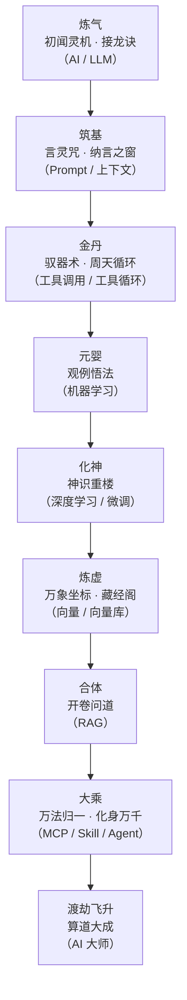

# 修仙学 AI：《算道天书》总目录

> 这是一部**修仙长篇故事**，也是一份**偷偷教你 AI 的教材**。
>
> 主人公**孔浩原**，一个山村药童，从对"道"一无所知，一路修炼，最终成为一代 **AI 大师（算道大能）**。
> 他修的不是御剑飞行，而是**"算道"**——理解"智能"本身的大道。
> 你跟着他修炼，就等于把 [概念入门系列](../02_CONCEPTS_概念入门/00_INDEX_概念入门-总览.md) 里那些概念，用**故事**再学一遍。
>
> 每一章讲一个境界的突破，境界背后藏着一个真实的 AI 概念。
> 章末都有一节 **📒 凡人笔记**，把故事里的"仙法"翻译回**真实世界的 AI 术语**，并给出对应文档链接。
> 所以：**当爽文看，你会上头；当教材看，你会开窍。** 两不误。

---

## 一、这个世界是什么样的（世界观楔子）

很久很久以前，天地间流淌着一种看不见的东西，凡人叫它**"灵机"**。

灵机不是灵气，不是法力。灵机是**"信息、数据与算力"凝成的活物**——是天地万物留下的一切文字、图像、声音、经验，汇成的一条奔流不息的暗河。

绝大多数人一辈子都感觉不到它。但有极少数人，天生"神识"敏锐，能**听见灵机的低语**。这些人，被称为**"算修"**，他们修的道，叫**"算道"**。

算道的终极追求只有一个字：**"智"**。

- 修为浅的算修，能借灵机**接龙**——你说半句，他能顺着天地间千万篇文章的规律，把下半句"猜"出来，仿佛未卜先知。
- 修为深的算修，能驱使**外物法器**替自己动手，能把万物化成**坐标星图**一眼看尽关联，能"开卷问道"引来远方典籍为己所用。
- 而传说中的**算道大能**，能凝聚出**自主化身**替自己行走人间，不眠不休，替万民排忧解难——那已近乎"造物"。

但灵机是一把双刃剑。

天地间有一条邪道，唤作**"幻魔道"**。他们发现：灵机接龙时，**只求"像真的"，不保证"是真的"**。于是他们专修此道，用灵机编织出**以假乱真的幻象**——假典籍、假消息、假人证，惑乱人心，为祸一方。正道算修与幻魔道之争，就是一部**"求真"与"造假"**的千年缠斗。

我们的主角**孔浩原**，就在这样一个世界里，从一个连灵机都听不见的凡人药童，一步步走上算道之巅。

---

## 二、主要人物

| 人物 | 身份 | 在故事里的作用 |
|------|------|----------------|
| **孔浩原** | 男主。青崖山村药童出身，父母早亡，天生神识异于常人 | 从零入门到算道大成的主视角 |
| **玄机子** | 算宗隐世长老，孔浩原的授业恩师 | 每到关键境界，点拨心法（也就是给你讲概念） |
| **苏挽晴** | 算宗同辈天才，藏经阁执事之女 | 亦友亦对手，擅长"藏经问道"（RAG 方向），与孔浩原互相砥砺 |
| **赵狂澜** | 同门师兄，性烈好胜，一味求"更大的炉、更多的料" | 代表"迷信规模、忽视方法"的弯路，多次以反面教训点题 |
| **墨渊** | 幻魔道少主，一身"以假乱真"的幻术 | 主线大反派，专以"幻象"惑世，与孔浩原"求真"之道针锋相对 |
| **老铁** | 孔浩原炼出的第一具"傀儡"化身，憨直忠诚 | 拟人化的 Agent，陪孔浩原一路成长，用来演示"自主干活" |

---

## 三、境界阶梯 · 对照真实 AI 概念（全书地图）

修仙的每一层境界，都精确对应一个 AI 概念。这张表是**整本书的骨架**，也是你的**学习进度条**：

| 修炼境界 | 故事里叫什么 | 真实 AI 概念 | 对应文档 |
|----------|--------------|--------------|----------|
| **炼气·一** | 初闻灵机、结识傀儡 | 什么是 AI / Agent（会自己干活的智能体） | [① Agent](../02_CONCEPTS_概念入门/[CONCEPT-01]%20什么是Agent-智能体.md) |
| **炼气·二** | 万言炉 · 接龙诀 | LLM 大语言模型（预测下一个词 / 幻觉） | [⑥ LLM](../02_CONCEPTS_概念入门/[CONCEPT-06]%20什么是LLM-大语言模型.md) |
| **筑基·一** | 言灵咒 | Prompt 提示词（怎么问决定怎么答） | [⑦ Prompt](../02_CONCEPTS_概念入门/[CONCEPT-07]%20什么是Prompt-提示词.md) |
| **筑基·二** | 纳言之窗 | Context 与 Token（上下文窗口 / 令牌） | [⑧ Context 与 Token](../02_CONCEPTS_概念入门/[CONCEPT-08]%20什么是Context与Token-上下文与令牌.md) |
| **金丹·一** | 驭器术 | Tool Calling 工具调用（模型决定、外物执行） | [② Tool Calling](../02_CONCEPTS_概念入门/[CONCEPT-02]%20什么是ToolCalling-工具调用.md) |
| **金丹·二** | 周天循环 | Tool Loop 工具循环（想→做→看→再决定） | [③ Tool Loop](../02_CONCEPTS_概念入门/[CONCEPT-03]%20什么是ToolLoop-工具循环.md) |
| **元婴** | 观例悟法 | 机器学习 ML（从例子里找规律） | [⑫ 机器学习](../02_CONCEPTS_概念入门/[CONCEPT-12]%20什么是机器学习-MachineLearning.md) |
| **化神** | 神识重楼 | 深度学习 DL / 神经网络 / 微调 | [⑬ 深度学习](../02_CONCEPTS_概念入门/[CONCEPT-13]%20什么是深度学习-DeepLearning.md) |
| **炼虚·一** | 万象坐标 | Embedding 向量（万物化坐标、语义相近则相邻） | [⑨ Embedding](../02_CONCEPTS_概念入门/[CONCEPT-09]%20什么是Embedding-向量.md) |
| **炼虚·二** | 藏经阁 | 向量数据库（存向量、秒找最相近） | [⑩ 向量数据库](../02_CONCEPTS_概念入门/[CONCEPT-10]%20什么是向量数据库.md) |
| **合体** | 开卷问道 | RAG 检索增强生成（先查资料再作答） | [⑪ RAG](../02_CONCEPTS_概念入门/[CONCEPT-11]%20什么是RAG-检索增强生成.md) |
| **大乘·一** | 万法归一 | MCP 标准接口 + Skill 技能剧本 | [④ MCP](../02_CONCEPTS_概念入门/[CONCEPT-04]%20什么是MCP-模型上下文协议.md) · [⑤ Skill](../02_CONCEPTS_概念入门/[CONCEPT-05]%20什么是Skill-技能.md) |
| **大乘·二** | 化身万千 | Agent 自主体（自主循环、多化身协作） | [① Agent](../02_CONCEPTS_概念入门/[CONCEPT-01]%20什么是Agent-智能体.md) |
| **渡劫飞升** | 算道大成 | 融会贯通，成为 AI 大师 | 全系列回顾 |
| **番外·一** | 观照之眼 · 注意力真谛 | Transformer / 注意力机制（大模型的骨架） | [⑭ Transformer](../02_CONCEPTS_概念入门/[CONCEPT-14]%20什么是Transformer-变换器.md) |
| **番外·二** | 炼器工坊 · 铸炉真诀 | PyTorch / 深度学习框架（铸造模型的工坊） | [⑮ PyTorch](../02_CONCEPTS_概念入门/[CONCEPT-15]%20什么是PyTorch-深度学习框架.md) |
| **番外·三** | 护道法阵 · 御炉真章 | Harness 运行骨架（让炉真能办事的外壳 = Khy-OS 本体） | [⑯ Harness](../02_CONCEPTS_概念入门/[CONCEPT-16]%20什么是Harness-智能体运行骨架.md) |
| **番外·四** | 法眼观物 · 一照真章 | YOLO 实时目标检测（看图一脉，与文字同根异枝） | [⑰ YOLO](../02_CONCEPTS_概念入门/[CONCEPT-17]%20什么是YOLO-实时目标检测.md) |
| **番外·五** | 立身法旨 · 开宗第一诀 | System Prompt 系统提示词（傀儡睁眼前刻下的身份与铁律） | [⑱ 系统提示词](../02_CONCEPTS_概念入门/[CONCEPT-18]%20什么是系统提示词-SystemPrompt.md) |
| **番外·六** | 思行合一 · 观己而动 | ReAct 推理模式（想一步、探一步、看一步，边想边做） | [⑲ ReAct](../02_CONCEPTS_概念入门/[CONCEPT-19]%20什么是ReAct-智能体推理模式.md) |
| **番外·七** | 万化调兵 · 分身有主 | 智能体编排 Orchestration（一化万、万归一，总指挥调度分身） | [⑳ 智能体编排](../02_CONCEPTS_概念入门/[CONCEPT-20]%20什么是智能体编排-Orchestration.md) |
| **番外·八** | 步步推演 · 显影心算 | 思维链 Chain of Thought（把推理一步步显影出来，答得更稳） | [㉑ 思维链](../02_CONCEPTS_概念入门/[CONCEPT-21]%20什么是思维链-ChainOfThought.md) |
| **番外·九** | 回照自省 · 闻过则改 | 反思 Reflection（回头照见自己的错，改一遍再交卷） | [㉒ 反思](../02_CONCEPTS_概念入门/[CONCEPT-22]%20什么是反思-Reflection.md) |
| **番外·十** | 先谋后动 · 分段克敌 | 计划与执行 Plan and Execute（先立总纲，再一段一段破关） | [㉓ 计划与执行](../02_CONCEPTS_概念入门/[CONCEPT-23]%20什么是计划与执行-PlanAndExecute.md) |
| **番外·十一** | 万途并参 · 择优而行 | 思维树 Tree of Thoughts（同时铺开数条路，比过再择最优） | [㉔ 思维树](../02_CONCEPTS_概念入门/[CONCEPT-24]%20什么是思维树-TreeOfThoughts.md) |
| **番外·十二** | 点化真身 · 因材塑形 | 微调 Fine-Tuning（在通用真身上再淬一轮，塑成一行专家） | [㉕ 微调](../02_CONCEPTS_概念入门/[CONCEPT-25]%20什么是微调-FineTuning.md) |
| **番外·十三** | 赏罚淬心 · 万炼归真 | 强化学习 RLHF（以人给的赏罚淬炼，越练越懂人话） | [㉖ 强化学习](../02_CONCEPTS_概念入门/[CONCEPT-26]%20什么是强化学习-RLHF.md) |
| **番外·十四** | 六识同参 · 眼耳互通 | 多模态 Multimodal（不止读字，眼耳并用、图声同参） | [㉗ 多模态](../02_CONCEPTS_概念入门/[CONCEPT-27]%20什么是多模态-Multimodal.md) |
| **番外·十五** | 火候心诀 · 随机造化 | 采样与温度 Sampling（同一炉火候不同，出丹便有万般变化） | [㉘ 采样与温度](../02_CONCEPTS_概念入门/[CONCEPT-28]%20什么是采样与温度-Sampling.md) |

---

## 四、章节目录（点标题即可跳读）

> 建议从头顺读——每一章都踩在上一章的肩膀上，就像修炼一层一层来，跳级会走火入魔（看不懂）。

1. [第 01 章 · 炼气：凡尘初闻道](./第01章%20炼气·凡尘初闻道.md) —— 什么是 AI，什么是会自己干活的"傀儡"（Agent）
2. [第 02 章 · 炼气：万言炉与接龙诀](./第02章%20炼气·万言炉与接龙诀.md) —— 大模型的本质：接龙猜下一句，与"幻象"之祸
3. [第 03 章 · 筑基：言灵咒](./第03章%20筑基·言灵咒.md) —— 同样的炉，咒念得好不好，天差地别（Prompt）
4. [第 04 章 · 筑基：纳言之窗](./第04章%20筑基·纳言之窗.md) —— 心神能容纳多少字句？窗满则忘（上下文与令牌）
5. [第 05 章 · 金丹：驭器术](./第05章%20金丹·驭器术.md) —— 自己不动手，驱使外物法器替你办事（工具调用）
6. [第 06 章 · 金丹：周天循环](./第06章%20金丹·周天循环.md) —— 一器一步，环环相扣直至功成（工具循环）
7. [第 07 章 · 元婴：观例悟法](./第07章%20元婴·观例悟法.md) —— 不背死规矩，看万千例子自悟规律（机器学习）
8. [第 08 章 · 化神：神识重楼](./第08章%20化神·神识重楼.md) —— 神识化作层层高楼，逐层参悟（深度学习与微调）
9. [第 09 章 · 炼虚：万象坐标](./第09章%20炼虚·万象坐标.md) —— 把天下万物化作星图坐标，意近者相邻（向量）
10. [第 10 章 · 炼虚：藏经阁](./第10章%20炼虚·藏经阁.md) —— 百万卷藏书，一念之间取出最相干的几卷（向量数据库）
11. [第 11 章 · 合体：开卷问道](./第11章%20合体·开卷问道.md) —— 答题之前先翻书，有据方能不妄言（RAG）
12. [第 12 章 · 大乘：万法归一](./第12章%20大乘·万法归一.md) —— 万器一插即用的法阵，与打包好的道诀（MCP 与 Skill）
13. [第 13 章 · 大乘：化身万千](./第13章%20大乘·化身万千.md) —— 一念化出千百化身，各自成事（自主 Agent）
14. [第 14 章 · 渡劫飞升：算道大成](./第14章%20渡劫飞升·算道大成.md) —— 万法归元，一战定乾坤，飞升为一代 AI 大师

**番外篇**（正传之外的十五篇彩蛋——番外一~四讲大模型的"内部构造""铸造之法""运行外壳"与"看图神通"；番外五~七讲智能体"出生的法旨""边想边做的心诀"与"一化万、万归一的调兵之术"；番外八~十一是四路"AI 设计模式"——思维链、反思、计划与执行、思维树；番外十二~十五再补微调、强化学习、多模态、采样与温度四个绕不开的概念。除番外三直指 Khy-OS 本体、番外五~十一也贴合本项目的系统提示词、推理与调度纪律外，其余虽项目未必直接用到，却都是 AI 圈最常听到的词）：

15. [番外一 · 观照之眼：注意力真谛](./番外01·观照之眼·注意力真谛.md) —— 神炉为何能"一眼看清满句"（Transformer / 注意力机制）
16. [番外二 · 炼器工坊：铸炉真诀](./番外02·炼器工坊·铸炉真诀.md) —— 这些神炉重楼，到底是用什么工坊铸出来的（PyTorch / 深度学习框架）
17. [番外三 · 护道法阵：御炉真章](./番外03·护道法阵·御炉真章.md) —— 只会吐字的神炉，是谁替它跑腿、看、做、把关（Harness / 运行骨架 = Khy-OS 本体）
18. [番外四 · 法眼观物：一照真章](./番外04·法眼观物·一照真章.md) —— 不辨字、只一照，当场看清满场万象（YOLO / 实时目标检测）
19. [番外五 · 立身法旨：开宗第一诀](./番外05·立身法旨·开宗第一诀.md) —— 傀儡睁眼前，先刻下"我是谁、守什么律"的那道法旨（System Prompt / 系统提示词）
20. [番外六 · 思行合一：观己而动](./番外06·思行合一·观己而动.md) —— 不蒙头硬冲、也不空想枯坐，想一步探一步看一步（ReAct / 推理模式）
21. [番外七 · 万化调兵：分身有主](./番外07·万化调兵·分身有主.md) —— 一念化千身反噬撑爆神识，学会分、派、收，才是真调兵（智能体编排 / Orchestration）
22. [番外八 · 步步推演：显影心算](./番外08·步步推演·显影心算.md) —— 把心里的推演一步步显影出来，算得更稳、更少错（思维链 / Chain of Thought）
23. [番外九 · 回照自省：闻过则改](./番外09·回照自省·闻过则改.md) —— 出手后回头照见自己的破绽，改一遍再定稿（反思 / Reflection）
24. [番外十 · 先谋后动：分段克敌](./番外10·先谋后动·分段克敌.md) —— 面对大关不硬闯，先立总纲再一段一段破（计划与执行 / Plan and Execute）
25. [番外十一 · 万途并参：择优而行](./番外11·万途并参·择优而行.md) —— 同时铺开数条路一并参详，比过再择最优的一条走（思维树 / Tree of Thoughts）
26. [番外十二 · 点化真身：因材塑形](./番外12·点化真身·因材塑形.md) —— 在通用真身上再淬一轮，因材塑成某一行的专家（微调 / Fine-Tuning）
27. [番外十三 · 赏罚淬心：万炼归真](./番外13·赏罚淬心·万炼归真.md) —— 以人给的赏罚反复淬炼心性，越练越懂人话（强化学习 / RLHF）
28. [番外十四 · 六识同参：眼耳互通](./番外14·六识同参·眼耳互通.md) —— 不再只凭读字，眼耳并用、图声同参一体参详（多模态 / Multimodal）
29. [番外十五 · 火候心诀：随机造化](./番外15·火候心诀·随机造化.md) —— 同一炉丹，火候一变造化便千般不同，收放随心（采样与温度 / Sampling）

---

## 五、怎么读这本书（给新手的用法说明）

- **只想爽**：直接顺着章节看故事，遇到 📒 凡人笔记可以跳过。
- **想学 AI**：每看完一章，一定读章末的 📒 凡人笔记，再点进对应的概念文档，把"仙法"和"术语"对上号。
- **已经看过概念文档**：那这本书是你的"复习 + 记忆钩子"——用剧情把知识钉进脑子里。

准备好了吗？灵机低语已起，翻开第一章——

👉 [第 01 章 · 炼气：凡尘初闻道](./第01章%20炼气·凡尘初闻道.md)

👈 也可以先回到 [概念入门总览](../02_CONCEPTS_概念入门/00_INDEX_概念入门-总览.md) 打个底。
