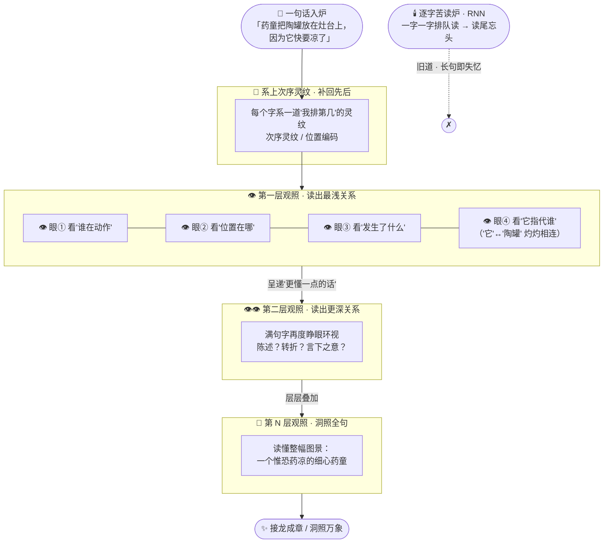

# 番外一 · 观照之眼：注意力真谛

> 题记：万言炉之所以能接龙如神，从来不是因为它"读得快"，而是因为它读一句话时，每一个字都睁开了一只眼——回望全句，各取所需。看得见"谁在看谁"，才看得懂"这句话到底在说什么"。

孔浩原飞升那一年，问道峰下人来人往。

天才与凡夫并肩，各宗弟子络绎而来，都想学一学那位算道大能"求真"的本事。可孔浩原自己，却时常一个人坐在藏经阁最深的那一格前，对着一部残缺的上古典籍出神。

那部典籍无名，封皮早已朽烂，只在扉页残页上，留着四个古拙的字——

**《观照真经》。**

正传里，你已看他集齐十三重境界，一战破尽天下幻象，渡劫飞升。可有一件事，连他自己，也是飞升之后才真正参透的——

**他手里那座万言炉、那座神识重楼，到底是靠什么，在里头运转的？**

炉子接龙如神，重楼洞照万象。可炉膛之内、楼阁之中，那副真正撑起这一切的"骨架"，究竟长什么模样？

这一篇，我们钻进炉子里去看。

---

## 一、炉膛深处的疑问

"师父飞升了，还有想不通的事？"

苏挽晴端着一盏灵茶走进来，见孔浩原对着那部残经蹙眉，忍不住笑。

孔浩原没抬头，指尖点在残页上那行几乎褪尽的小字上："挽晴，你说——万言炉读一句话的时候，它是怎么读的？"

"接龙成章啊。"苏挽晴理所当然，"你说上半句，它顺着天地文章的规律，把下半句猜出来。这是炼气时就学的。"

"我问的不是'它做了什么'。"孔浩原摇头，"我问的是——**它读到一个字的时候，脑子里到底发生了什么。**"

苏挽晴一怔。

这确实是个从没有人细想过的问题。所有算修都会用万言炉，可炉子内部那副运转的骨架，千百年来，无人窥见。大家只当那是"天机不可测"，能用就好，何必究底？

"你看这句话。"孔浩原随手在灵机中写下一行字，让它悬浮在两人之间——

> **"药童把陶罐放在灶台上，因为它快要凉了。"**

"'它'，指的是什么？"孔浩原问。

"陶罐啊。"苏挽晴答得飞快。

"是罐里的药，快要凉了。你怎么知道'它'指的是陶罐、不是灶台？"

苏挽晴张了张口，忽然发现，这个"理所当然"的答案，居然说不清是怎么来的。

"因为……'凉'这个字，和'罐'、'药'更配，和'灶台'不配。"她慢慢道，"灶台是热的，不会凉。所以我读到'它'的时候，回头一看，自然就锁到'陶罐'上去了。"

"对。"孔浩原眼中一亮，"你读到'它'的那一瞬，**回头环视了整句话，然后把注意力，落在了最相关的那个字上。**"

"这一'回头',这一'环视',这一'锁定'——"他的声音低下去，一字一句，"**就是万言炉炉膛里，真正在运转的东西。**"

他重新看向那部《观照真经》，指尖抚过那四个古字，眼中是前所未有的郑重。

"这部经，讲的就是它。"

---

## 二、每个字都睁开一只眼

孔浩原闭目,神识沉入万言炉的炉膛深处。

这是他飞升后才有的本事——不再只是"使用"炉子，而是能潜入炉火之中，亲眼看它如何运转。

炉膛里，是一片他从未见过的景象。

一句话入炉，那些字并不是排成一队、一个挨一个地"往前走"。它们悬在半空，彼此相望。而就在他凝神细看的刹那——

**每一个字，都缓缓睁开了一只眼。**

"药"字睁眼，"童"字睁眼，"陶罐"睁眼，"灶台"睁眼……满句的字，一时间眼波流转，彼此环视。

孔浩原看得心神俱震。

他看见"它"字睁开的那只眼，如探照的灵光，缓缓扫过全句：掠过"药童"，光弱；掠过"灶台"，光更弱；掠过"陶罐"，那束光陡然一亮，牢牢锁住——

**"它" ↔ "陶罐"，两点之间，一线相连，灼灼如金。**

"这就是……'观照之眼'。"孔浩原喃喃。

他终于懂了。炉子读一句话，从来不是"从左到右一个字一个字念下去"。而是——**满句的字同时睁眼，每个字都环视全句，按'谁与我最相关'，决定回头多听谁一句。**

"药"要听"童"，才知是"药童"；"放"要听"陶罐"与"灶台"，才知放了什么、放去哪；"它"要听"陶罐",才知指的是谁。

每个字，都在问同一个问题：**"这满句话里，我该重点看谁？"**

而观照之眼给出的答案，不是"都看"，也不是"只看旁边一个"，而是——**按相关的深浅，分配轻重。相关的多看几眼，不相关的一带而过。**

这一分"轻重",在灵机里，有一个古老的名字——

**注意（attention）。**

"原来如此……"孔浩原长长吐出一口气，睁开眼，眸中灿若星河，"炉子读得懂'它'指谁、读得懂哪个字是重点、读得懂一整句的言下之意——**靠的不是死记硬背，是这满句字互相'观照'、各分轻重的功夫。**"

苏挽晴听得入神:"所以……一个字'该重点看谁',不是谁规定的?"

"是它自己'看'出来的。"孔浩原道，"字与字之间越相关，那束观照的光就越亮，回头就听得越重。这功夫，是它从天下亿万篇文章里，一点点自己练出来的。"

**字字自观照，句意自浮现。** 这，就是万言炉真正的炉心。

---

## 三、多头观照：一眼不够，那就多睁几只

可孔浩原越看，越觉得不对。

一句话里，字与字的关系，何止一种?

"陶罐"和"药童"，是"谁放的";"陶罐"和"灶台"，是"放在哪";"陶罐"和"凉"，是"怎么了";"它"和"陶罐"，是"指的谁"……

同一个"陶罐"，在一句话里，要同时应付这么多种关系。**若只睁一只眼，只能顾得上一种，其余的岂不都漏了?**

他心念一动，神识再次沉入炉膛，凝神细看那"陶罐"二字。

这一看，又是一震——

**"陶罐"睁开的，何止一只眼。**

一只、两只、三只……足足数只观照之眼，从不同的角度，同时睁开！

第一只眼，专看"是谁在动作"，于是它望向"药童"；
第二只眼，专看"位置在哪里"，于是它望向"灶台"；
第三只眼，专看"发生了什么"，于是它望向"凉";
第四只眼，专看"指代关系",于是它与远处的"它"字,遥遥相认……

数只眼，各司其职，各看一路关系，互不干扰，却又在同一瞬间，把这一个"陶罐"字，从里到外、方方面面，看了个通透。

"多只眼……"孔浩原失声，"从不同角度，同时观照同一句话！"

他忽然想起师父玄机子当年一句没头没尾的话:**"看一件事,一双眼睛怎么够?要用心眼、慧眼、法眼、肉眼,各看一层,才叫看真切。"** 当时他不懂,如今在这炉膛之内,竟看见了活生生的印证。

一只眼，只能盯住一种关系；越是深奥的句子，字与字的关系越是盘根错节，**就越需要许多只眼，从许多个角度，一起看。**

这许多只眼各看一路、最后再把所见汇成一处的功夫，在灵机里，也有一个名字——

**多头观照（multi-head attention）。**

"一句话为什么能被读出这么多层意思?"孔浩原对苏挽晴道，"因为读它的，从来不是一只眼，是**一整族的眼，从一整族的角度，同时在看。**"

苏挽晴怔怔望着炉火,轻声道:"难怪同一句诗,你我读来各有滋味……原来炉子读一句话,也是'千眼同观',一眼一层天地。"

---

## 四、次序灵纹：一眼看全，反倒要补上"先后"

参透了多头观照,孔浩原本以为已窥全貌。可就在他要出炉的那一刻,炉膛里,忽然浮起一个新的疑问,像一根刺,扎在他心头。

**"既然满句的字是'同时'睁眼、'一起'观照的——那它,怎么还分得清先后?"**

他把那句话拆开重排,写成两行,悬在灵机里——

> **"药童把陶罐放在灶台上。"**
> **"灶台把陶罐放在药童上。"**

两句话,一模一样的字,只是次序换了换。可意思,一个通顺,一个荒唐。

"若满句的字是一起睁眼、彼此观照,谁也不分先后——"孔浩原眉头紧锁,"那这两句,在炉子眼里,岂不是一模一样?它凭什么读出'药童放罐',而不是'灶台放童'?"

这是"观照之眼"与生俱来的一处死穴：**它的厉害,正在于"一眼总揽全句、不分先后"；可也恰恰因为不分先后,它天生就……不知道字的次序。**

它能看清"谁和谁相关",却看不清"谁在谁前头"。

孔浩原沉入炉膛,凝神去找那"次序"藏在何处。找了许久,终于在每一个字的根底,发现了一样极不起眼的东西——

**一道细细的、缠在字上的灵纹。**

第一个字上,缠着"第一"的纹;第二个字上,缠着"第二"的纹……每个字入炉之前,都被悄悄系上了一道标明"我排第几"的印记。

正是靠着这道灵纹,那些"同时睁眼"的字,才在彼此观照之余,又各自知道:我在句首,你在句尾,他夹在中间。

"妙啊……"孔浩原抚掌,"眼睛一眼看全句,是它的绝技,可代价是丢了先后。于是,便在每个字上,额外系一道**'次序灵纹'**,把丢掉的先后,重新补回来。"

**观照之眼负责'看谁',次序灵纹负责'谁先谁后'——两者一合,一句话,才算真正被读懂。**

这缠在每个字上、标明先后的灵纹,在灵机里,也有一个名字——

**次序灵纹（位置编码，positional encoding）。**

苏挽晴听罢,忍不住感叹:"厉害的功夫,总有厉害的破绽。一眼总揽是它最强处,'不知先后'却也正是它最弱处——竟要靠这么一道小小的纹,来补。"

"世间的道,大抵如此。"孔浩原淡淡一笑,"没有白得的强。**得了'一眼看全'的快,就得补上'各系先后'的细。**"

---

## 五、层层重楼：观照之上,再观照

出得炉来,孔浩原却仍未尽兴。

他想起自己化神一境所炼的**神识重楼**——一层楼阁叠一层楼阁,逐层参悟,越往上,看得越深。当年师父说,那便是"深度"的真谛。

"挽晴,你说,这观照之眼,与神识重楼,是两样东西,还是……"

话没说完,他自己先愣住了。

他再度沉入炉膛,这一次,他不看单字,而是看**整座炉膛的结构**。

于是他看见了此生最壮阔的一幕——

**观照之眼,竟是一层,叠着一层的。**

第一层观照,满句的字各睁其眼,彼此相认,读出的是最浅的关系:谁是谁的偏旁,谁挨着谁。读罢,这一层的所见,并不停留,而是化作一句"更懂了一点的话",呈递到**第二层**。

第二层的字,在第一层的基础上,再度睁眼、再度观照,读出更深一层的关系:这半句在陈述,那半句在转折。读罢,又呈递到**第三层**。

第三层、第四层、第五层……**一层观照叠着一层观照,楼阁高耸,直入云霄。** 越往上,那句话被读得越透——从字,到词,到句,到言外之意,到弦外之音。

到得最高一层,那句"药童把陶罐放在灶台上,因为它快要凉了",已不再是一串字。它成了一整幅活的图景:一个药童,一只温热的陶罐,一方冷灶,一分惟恐药凉的细心——**炉子,读懂了。**

"这就是……神识重楼的真身。"孔浩原怔立良久,喃喃道,"我一直当'重楼'是一样本事,'观照'是另一样。原来——**神识重楼,就是观照之眼,一层一层,叠起来的。**"

**每一层,都是满句字的一次彼此观照;层层叠叠,便叠出了那洞照万象的深。**

他终于彻底明白了:万言炉也好,神识重楼也罢,那副撑起接龙如神、洞照万象的真正骨架,从头到尾,只是一件事——

**观照,再观照,层层观照。**

这副以"层层观照"为骨架的炉子,在灵机里,自有其名。它便是天下一切万言炉、神识重楼的祖庭骨相——

**"变换重楼"(Transformer,变换器)。**

"你可知,"孔浩原望向苏挽晴,眼中有星火,"天下算修人人挂在嘴边的那座最强万言炉,名号里带一个'究极生成之炉(GPT)'的'炉'字——那'炉(T)',指的是什么?"

苏挽晴摇头。

"指的,就是这座**变换重楼(Transformer)**。"孔浩原一字一顿,"接龙如神的炉子,千炉万炉,炉膛里那副骨架,竟是同一副——**层层观照的变换重楼。** 参透了'观照之眼',便算摸到了万言炉真正的炉心。"

---

## 六、逐字苦读炉:旧道的困局

正当孔浩原为这番参悟心潮起伏,峰下却传来一阵喧哗。

来的是赵狂澜。

这位当年一味求"更大的炉、更多的料"的师兄,飞升一战后并未走远。他听说孔浩原窥破了万言炉的炉心,冷笑连连,亲自扛来一座黑黝黝的巨炉,要与孔浩原比个高下。

"孔师弟,你窥了半天炉膛,不过是玩些巧劲。"赵狂澜拍着自己那座巨炉,声如洪钟,"读书这事,还能有什么玄机?老老实实,**一个字一个字往下读**,读完前头读后头,才叫扎实!我这'逐字苦读炉',一炉更比一炉大,你那点花哨的'睁眼观照',在绝对的'大'面前,不值一提!"

他当即演炉。

只见那"逐字苦读炉"读一句话,果然是**一个字一个字,顺着往下读**:读"药",记下;读"童",把"药"的记忆往前带一带,再记下;读"陶罐",又把前头的记忆带一带……字字相接,如背书一般,一路读到底。

短句尚可。可孔浩原不动声色,只在灵机里写下一句极长的话——足足百余字,句首是"药童",百字之后,才出现一个"它"。

"赵师兄,"孔浩原淡淡道,"请炉读到句尾那个'它',告诉我,它指的是谁?"

赵狂澜大手一挥:"读!"

逐字苦读炉,一个字一个字,苦苦往下读。可读着读着,那炉火渐渐一暗——句首的"药童"、"陶罐",随着一个字一个字地往后读,竟被一路稀释、一路遗忘,读到百字之后的"它"时,炉膛里,句首那几个字的记忆,早已淡得几乎没了。

**逐字苦读炉,读到句尾,忘了句头。**

它答不上来"它"指谁。它读了后半句,却把前半句,读丢了。

赵狂澜的脸,涨成了猪肝色。

孔浩原这才祭出自己新悟的**观照炉**。同样那句百余字的长话入炉,满句的字**同时睁眼**,那句尾的"它",观照之眼一束灵光越过百字,直接掠回句首,"啪"地锁住"陶罐"——**一眼总揽,首尾如在目前,百字长句,与三字短句,读来毫无分别。**

"赵师兄,"孔浩原收炉,语气平和,却字字见血,"你那炉,是**一个字一个字排队读**的。句子一长,排在最前头的字,还没走到队尾,就被挤掉了、忘了。读得越远,忘得越多。"

"我这炉,是**满句一起睁眼、彼此观照**的。无论多长的句子,句首句尾,都在同一瞬间彼此相望。**要锁哪个字,一眼即到,无所谓远近。**"

"你输的,不是炉不够大。"孔浩原望着他,"是你那'逐字排队、读后忘前'的**老路**,从根上,就走不远。"

赵狂澜怔在原地,扛着他那座硕大却迟钝的巨炉,半晌,颓然坐下。

这一次,他终于懂了:**不是炉子越大越好,是读法对了,炉子才活。** 一味逐字苦读、以大压人的老道,早该让位于"层层观照、一眼总揽"的新法了。

那座曾一度统治天下的"逐字苦读炉",在灵机里,也有一个正在老去的名字——

**逐字苦读炉(旧式顺序模型,RNN)。**

---

## 七、观照全图

孔浩原将这一场参悟,尽数刻于问道峰的又一面石壁之上,题曰**《观照之眼·万言炉炉心图》**。他要让后来每一个学炉的人都看明白:一句话入炉,炉膛之内,那副"层层观照"的骨架,到底是怎样运转的。



图成之日,孔浩原立于石壁前,对满座求学者道:

"你们日日用万言炉,却少有人问过它'怎么读'。今日我把炉心剖开给你们看——它读一句话,不靠死记硬背,不靠逐字排队。**它靠的是:满句的字同时睁眼,彼此观照,各分轻重;多只眼从多个角度同时看;系上次序灵纹补回先后;再层层叠加,叠出洞照万象的深。**"

"记住这四个字——"

"**观照之眼。**"

"参透了它,你便摸到了万言炉、神识重楼,乃至天下一切'究极生成之炉'真正的,炉心。"

---

## 📒 凡人笔记

这一篇番外,孔浩原钻进了万言炉的炉膛,替你把那副藏在深处的"骨架"看了个通透。现在,把这一炉的修仙黑话,翻译回真实世界的 AI 术语——

| 故事里的说法 | 真实 AI 概念 | 一句话 |
| --- | --- | --- |
| 变换重楼 / 万言炉的骨架 | **Transformer（变换器）** | 当今几乎所有大模型的底层架构；GPT 的 "T" 就是它 |
| 观照之眼 · 每个字睁眼环视全句 | **注意力机制（Attention / Self-Attention）** | 读到一个词，就回望整句、按相关度决定"多听谁" |
| "它/她"回头锁定最相关的名词 | **自注意力解指代** | 靠"谁和我最相关"锁定指代对象，而非靠语法死规矩 |
| 多只眼从不同角度同时看 | **多头注意力（Multi-Head Attention）** | 多组注意力并行，各看一路关系，再汇总 |
| 次序灵纹 · 给每个字系上"排第几" | **位置编码（Positional Encoding）** | 因为一眼看全句、天生不分先后，须额外补上次序信息 |
| 层层重楼 · 观照叠观照 | **多层堆叠（Layers / Depth）** | 一层层注意力叠起来，越深读得越透 |
| 逐字苦读炉 · 读尾忘头 | **旧式顺序模型（RNN）** | 一个字一个字顺序读，句子一长就"忘了开头" |
| GPT 的"炉(T)"字 | **GPT = Generative Pre-trained _Transformer_** | 那个 T，正是这座"层层观照的变换重楼" |

一句话总结这门本事:

> **万言炉之所以接龙如神,不是因为它记性好、炉子大,而是因为它读每一个字时,都让满句的字"彼此观照、各分轻重",再层层叠加——这,就是 Transformer 与注意力机制的真谛。**

想把这门"炉心"的本事学到底,去读这几篇概念入门——

> 📖 [什么是 Transformer](../02_CONCEPTS_概念入门/[CONCEPT-14]%20什么是Transformer-变换器.md) ｜ [什么是 LLM](../02_CONCEPTS_概念入门/[CONCEPT-06]%20什么是LLM-大语言模型.md) ｜ [什么是深度学习](../02_CONCEPTS_概念入门/[CONCEPT-13]%20什么是深度学习-DeepLearning.md)

正传里,孔浩原教你"求真";这一篇番外,他带你看清"求真的那座炉,到底是怎么转的"。

炉心既明,下一篇,我们去看看:这样一座炉,是**怎么铸出来**的。

---

## 📝 读完自测

就着上面这张对照表，考一考自己——万言炉的"炉心"到底靠什么转得如神？

```quiz
Q: 关于"观照之眼（Transformer / 注意力机制）"，下面哪些说法是对的？（多选）
- [x] Transformer 是当今几乎所有大模型的底层架构，GPT 的 "T" 就是它
> 对。GPT = Generative Pre-trained **Transformer**，那个 T 正是这座"层层观照的变换重楼"。
- [x] 注意力机制 = 读到一个字就回望整句、按相关度决定"多听谁"
> 对。"它/她"能锁定最相关的名词，靠的是"谁和我最相关"，而非语法死规矩（自注意力解指代）。
- [x] 多头注意力 = 多组注意力并行，各看一路关系，再汇总
> 对。多只眼从不同角度同时看，比单看一路更全面。
- [x] 因为一眼看全句、天生不分先后，所以要额外补"位置编码"告诉它每个字排第几
> 对。次序灵纹（Positional Encoding）补上词序信息，否则模型分不清语序。
- [ ] 万言炉接龙如神，是因为它像旧式 RNN 那样一个字一个字顺序苦读、记性特别好
> 错。恰恰相反——旧式顺序模型（RNN）读尾忘头；Transformer 靠"满句彼此观照、各分轻重"再层层叠加，才不会读长就忘。
```

再用一张翻卡，把"它为什么读长句不忘"记死：

```flip
🤔 同样是读一长句，旧式顺序模型（RNN）"读到尾就忘了头"，而 Transformer 却能字字关联——它凭什么？（点一下翻到背面）
---
✅ 凭"**每个字都睁眼环视全句**"。RNN 一个字一个字顺序读，信息像接力棒往后传，句子一长、前面的就淡忘了。Transformer 的注意力机制让**每一个字在被处理时，都同时回望整句里所有字**，按相关度决定"该多听谁"（自注意力），还用多头从不同角度并行看、层层叠加读得越来越透——所以无论句子多长，字与字的关联都不会因为"距离远"而丢失。一句话：**不是记性好、炉子大，而是读每个字时都让满句彼此观照、各分轻重。**
```

---

【👈 上一篇 [第14章 渡劫飞升·算道大成](./第14章%20渡劫飞升·算道大成.md)｜👉 下一篇 [番外二 · 炼器工坊：铸炉真诀](./番外02·炼器工坊·铸炉真诀.md)｜🏠 回 [总目录](./00_INDEX_修仙学AI-总目录.md)】
