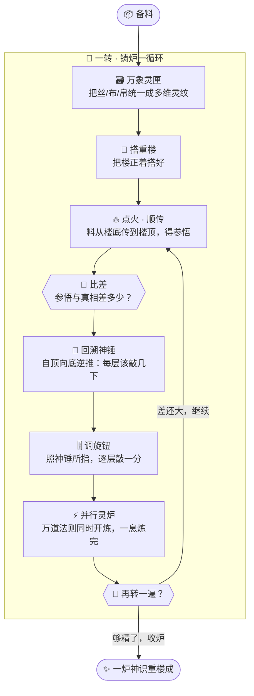

# 番外二 · 炼器工坊：铸炉真诀

> 题记：你以为神炉是天上掉下来的？不是。每一座会接龙、会思辨的神炉，背后都有一间烟火气十足的工坊，和一套让笨手也能铸出好炉的趁手法器。会驱炉的人千千万，懂铸炉的人万里挑一——而懂铸炉之理的人，才真正知道：这炉，能做什么，不能做什么。

正传里，孔浩原驱使万言炉接龙成章，驱使神识重楼层层参悟，一路飞升。可你有没有想过一个问题——

**那些神炉，最初是从哪儿来的？**

万言炉不是从天上掉下来的。神识重楼那一层层楼阁，也不是孔浩原闭眼一想就凭空立起的。它们，都是被人**一锤一锤铸出来的**。

铸炉的人，叫**炼器师**。铸炉的地方，叫**炼器工坊**。

这一篇番外，我们不讲孔浩原如何驭炉破敌，只讲一段少有人知的旧事——孔浩原如何走进一间炼器工坊，见识了三件镇坊之宝，也见识了一个人，如何用最笨的法子，把自己活活熬废了半年。

---

## 一、工坊初探

那是孔浩原刚破化神、神识重楼初成的年月。

重楼虽立，却时时走样。有时楼阁歪斜，参悟出的规律驴唇不对马嘴；有时楼层太薄，什么都学不进去；有时又太厚太重，把好料坏料一股脑全记死了，反倒认不出新东西。

孔浩原百思不解，去问玄机子。

玄机子却没直接答他，只递给他一枚旧木牌，牌上刻着三个字：**铸炉坊**。

"你会驭炉，"老人捻须而笑，"可你从没亲手铸过一座炉。不懂铸，就不懂它为什么会歪、为什么会走样。去青崖山北麓，寻一间老工坊。看完，你自会明白。"

孔浩原循着木牌上的指引，一路向北，在青崖山最幽深的一道山坳里，找到了那间工坊。

推门而入，扑面而来的不是仙家该有的清冷灵气，而是——**烟火气**。

炉火熊熊，铁屑纷飞。十几名炼器师赤膊挥汗，叮叮当当，正围着一座座半成品的小炉忙碌。空气里满是灼热的灵机，和一种孔浩原从未闻过的、"万物正在被塑造成形"的躁动。

一个满脸炭灰、袖口烧了好几个洞的老者迎上来。他姓炉，人称**老炉头**，是这间工坊的坊主。

"化神修士？"老炉头上下打量孔浩原，咧嘴一笑，露出被烟熏黄的牙，"稀客。你们这些驭炉的大能，平日只管使唤现成的炉，几个愿意低头，看看炉是怎么打出来的？"

孔浩原拱手："晚辈正是不懂铸炉，才来讨教。"

老炉头哈哈一笑，一把揽住他肩膀，往工坊深处走去。

"来对了。铸炉这行当，说难也难，说不难——"他指了指坊内那三件被灵光笼罩、供在高台上的物件，"有这三件镇坊之宝在手，笨人也能铸出好炉。"

"我给你，一件一件说。"

---

## 二、第一宝 · 万象灵匣

老炉头先领他到第一件宝物前。

那是一只通体温润的玉匣，四四方方，却大得没有边际。匣盖一开，里面不是空的，而是流淌着一片**可以随意折叠、伸展的灵纹**。

"这，叫**万象灵匣**。"老炉头说，"铸炉的第一步，是备料。可你想过没有，天下的料，形状千奇百怪——"

"一句话，是一条线上的字，像一根**丝**。"

"一幅图，是横竖排开的点，像一张**布**。"

"一段音，是随时辰起伏的波，像一卷**帛**。"

"一炉真正的神识重楼，要同时吞下丝、布、帛，还有无数你叫不出名的形状。你若用十种匣子去装十种料，铸炉时手忙脚乱，非乱套不可。"

他一挥手，将一根丝、一张布、一卷帛，尽数投入万象灵匣。

奇妙的事发生了——三样东西入匣，竟都化作了**同一种东西**：一格一格、排列整齐的**灵纹阵列**。丝是一维的阵列，布是二维的阵列，帛是三维的阵列，乃至更高维度，灵匣都能一视同仁地盛下。

"你看，"老炉头得意道，"不管什么料，进了万象灵匣，都变成同一种'多维灵纹'。往后你搭重楼、点炉火，只跟这一种东西打交道，手法就统一了。"

孔浩原若有所悟："万物归一形……那这灵匣，还有别的妙处么？"

"妙处大了。"老炉头压低声音，把孔浩原引到工坊角落一座幽蓝色的巨炉前，"你看这个。"

那炉通体幽蓝，炉身刻满密密麻麻的沟槽，每一道沟槽里都有灵火在**同时**奔流，快得孔浩原神识都追不上。

"这叫**并行灵炉**，回头细说。你只需知道——万象灵匣里的多维灵纹，能**整匣整匣地扔进这并行灵炉里**，让万道法则同时开炼。"老炉头比了个手势，"一匣灵纹进去，眨眼就炼完了。若换成一根丝一根丝地手搓，你搓到胡子白了也搓不完。"

孔浩原心头剧震。

他忽然明白，为何自己的神识重楼时时走样——他一直是**一句话一句话地喂料、一层一层地手搓**，慢且乱。若有这万象灵匣把料统一成多维灵纹，再整批扔进灵炉快炼，何至于此？

灵机深处，一个念头悄然亮起：**原来料，也是要先炼成"匣"里那种整齐东西，才好批量处理的。**

---

## 三、第二宝 · 回溯神锤

"料备好了，"老炉头领他到第二件宝物前，"第二步，是**搭楼、敲料、校形**。这一步，最要命。"

第二件宝物，是一柄古朴的铁锤。锤头黝黑，锤身却隐隐流转着一种**逆流的光**——寻常的光都是往前照，这锤上的光，偏偏是**倒着走**的。

"**回溯神锤**。"老炉头把锤递给孔浩原，"这是三宝里最神的一件。你要用心听。"

"搭一座神识重楼，是这么回事：料从楼底进去，一层一层往上传，每一层都要**敲**——敲重了，规律学过头；敲轻了，规律没学到。要敲到不轻不重、恰到好处，这炉才算成了。"

孔浩原点头。这他懂，重楼参悟，全在这"敲"的分寸。

"可难就难在——"老炉头叹了口气，"重楼有千层万层，每一层要敲几下、往哪个方向敲，都得算。你怎么知道，是第三层敲重了，还是第八百层敲轻了，才害得最后参悟出错？"

孔浩原怔住。这正是他重楼走样、却找不出病根的死结。

"寻常炼器师，是这么干的：先让料从楼底一路传到楼顶——这叫**正着搭、顺着传**。传到顶，看看参悟出的结果，跟真相差了多少，记下这个'差'。"

"然后，难的来了：他要把这个'差'，**从楼顶一层一层倒推回楼底**，算清楚每一层、每一处、该往哪个方向敲、敲多少，才能把这个'差'补上。"

"这倒推的活儿，千层万层，环环相扣，一处算错，满盘皆输。"老炉头指了指那柄锤，"而这**回溯神锤**的神通就在——"

"你只管把重楼**正着搭好、顺着传一遍**。剩下那要命的倒推，你一下都不用自己算——"

孔浩原举起锤。

老炉头一声令下："传！"

孔浩原将一批灵纹从楼底注入，顺着千层楼阁，一路传到楼顶，得出一个参悟结果。结果与真相有差。

就在这一瞬——那柄回溯神锤，**自己亮了**。

锤上那道逆流的光轰然大盛，自楼顶倾泻而下，如一条溯流而上的银河，**自动地、逐层地、分毫不差地**，在每一层楼阁上都点出了一个光点：这一层该往左敲三分，那一层该往右敲七分……千层万层，一瞬算尽，无一遗漏。

孔浩原目瞪口呆。

"这……这倒推每一层该敲几下的活儿，它**自己全算好了**？"

"分毫不用你操心。"老炉头笑得眼睛眯成一条缝，"你只负责把楼正着搭对、把料顺着传一遍。回溯神锤替你，把每一层该怎么敲，全部逆推出来。你照着它点的光，敲下去就是。"

"敲一遍，参悟准一分；再传一遍，锤再逆推一遍，你再敲一分。如此反复，这炉，就一天比一天精。"

孔浩原握着那柄尚在流转逆光的神锤，久久说不出话。

他想起自己这些年铸重楼的苦——正着搭他会，可每次参悟出了错，他都得**亲手去倒推**：到底是哪一层坏了事？他算得头晕眼花，十次有九次算错，把好楼越敲越歪。

若早有这回溯神锤，**只管正着搭，倒推交给锤**……

"这锤，"孔浩原声音有些发紧，"是何等样的神通铸成的？"

"说破了不值钱。"老炉头摆摆手，"无非是**一条老实的算理**：楼是你一层层顺着搭起来的，那这'差'要怎么从顶倒推回底，自有一条顺着楼梯反着走的死规矩。这规矩，机械、笨拙，却从不出错。回溯神锤，不过是把这条死规矩，**自动化**了而已。"

"人算,会累会错。锤算，不累不错。"

---

## 四、第三宝 · 并行灵炉

"第三宝，你方才已经见过了。"老炉头把孔浩原重新领回那座幽蓝巨炉前。

"**并行灵炉**。"

孔浩原这才定睛细看。这炉与寻常炉不同——寻常炉膛只有一处炉心，一次只能炼一道法则；而这幽蓝巨炉，炉身上密密麻麻布着**成千上万个微小炉心**，每一个都能独立点火。

"铸一座大重楼，要敲的地方，成千上万。"老炉头说，"你若用寻常独心炉，一处一处地敲，敲完这处敲那处，一炉料炼下来，得一年半载。"

"可这并行灵炉——"他猛一挥手，万千炉心同时轰然点燃，幽蓝灵火冲天而起，"**万道法则，同时开炼。**"

那一瞬，孔浩原只觉眼前灵光爆涌。原本要一处一处慢慢敲的活儿，此刻**成千上万处一齐动手**，同一息之间尽数完成。方才那用寻常炉要熬一年的活，这里——**几个时辰，成了。**

"快，是它唯一的本事，也是它了不得的本事。"老炉头抚着滚烫的炉壁，"万象灵匣把料理成整齐的多维灵纹，回溯神锤把每一处该敲几下算得明明白白，最后，全交给这并行灵炉，一口气、一齐炼。三宝合璧，笨人也能几日铸一炉。"

孔浩原终于彻底明白了。

**万象灵匣**——把千奇百怪的料，统一成整齐的多维灵纹，还能整批喂进灵炉。

**回溯神锤**——你只管正着搭楼、顺着传料，每一层该怎么敲，它自动逆推、分毫不差。

**并行灵炉**——万道法则同时开炼，快出旁人数十倍。

这三件宝物拼在一起，就是一整套**趁手的炼器法器**。有它在手，铸炉这门原本高不可攀的绝艺，竟成了寻常炼器师也能一步步做成的活计。

"这一整套家伙什，连同这间坊、这套规矩，"老炉头指了指工坊门楣上那块被熏黑的匾额，"合起来，就叫——**炼器工坊**。"

孔浩原抬头。匾上四个古字，笔力遒劲：**顺手成炉**。

---

## 五、纯手工的偏执

正当孔浩原心悦诚服之际，工坊最深处，忽然传来一声暴喝。

"要这些花里胡哨的宝贝作甚！"

孔浩原循声望去，只见一座独立的小炉旁，一名筋骨虬结的汉子正满头大汗、赤手空拳地敲打着一座半成品的重楼。他不用万象灵匣，一根丝一根丝地手搓喂料；不用回溯神锤，参悟出错就自己趴在地上，拿炭笔一层一层地倒推计算；更不用并行灵炉，一处一处地慢敲。

那人满脸戾气，眼里布满血丝，看模样已经数月未曾好好合眼。

孔浩原认得他——**赵狂澜**。同门师兄，性烈好胜，一向信奉"更大的炉、更多的料、更狠的功夫"。

"师兄？你怎会在此……"

"哼！"赵狂澜头也不抬，"我不信邪。铸炉之道，贵在**亲手**。什么万象灵匣、回溯神锤，都是给懒人、给废物用的拐棍！真正的炼器师，就该一锤一凿，从零铸起，每一层楼、每一处梯度，都亲手算、亲手敲，方显功力！"

老炉头在旁边直摇头，低声对孔浩原道："这后生，来了半年了。天赋是真高，脾气也是真犟。非要纯手工从零铸一座大重楼，尤其是那倒推每层该敲几下的活儿——他死活不肯用回溯神锤，全凭一支炭笔手算。"

"手算？"孔浩原心头一沉。他方才亲手用过回溯神锤，深知那千层万层的倒推有多凶险，"千层楼阁的倒推，全靠手算？"

"可不是么。"老炉头叹气，"我劝过他。那活儿，机械、繁琐、一环扣一环，人脑一走神就错一处。错一处，他自己还查不出来，只当是别处坏了，越敲越歪，越歪越敲——"

话音未落，赵狂澜那座重楼，**轰然一声，塌了。**

半年心血，一朝成灰。

赵狂澜呆呆地跪坐在废墟前，双目赤红，双手还保持着挥锤的姿势，颤抖不止。

"不……不可能……"他嘶哑地喃喃，"我每一层都算了……每一层……"

老炉头默默走过去，蹲下身，从那废墟里捡起一片残楼，看了看，递到赵狂澜面前。

"第四百一十七层。"老炉头的声音很平静，"你倒推的时候，这一层的方向，算反了。"

赵狂澜浑身剧震。

"就这一处。"老炉头说，"一处方向算反，往下所有的敲打全跟着错。你后面越是拼命敲、拼命补，其实是把整座楼，往更歪的地方越推越远。你熬了半年的夜，全折在这一个符号上了。"

工坊里一片死寂，只有炉火噼啪。

孔浩原望着那废墟，望着赵狂澜赤红的双眼，心里像被什么狠狠攥了一下。

**这，就是不用回溯神锤的代价。**

不是赵狂澜不够努力——他比谁都努力。也不是他天赋不够——他天赋极高。他只是**把力气，全用在了本不该由人来扛的活儿上**。那千层倒推，本是死规矩、本该交给神锤自动去算的机械活。人偏要亲手扛，就等于把自己的心血，押在"千万次手算、一次都不能错"这个几乎不可能的赌注上。

半年，废于一个算反的符号。

---

## 六、几日成炉

孔浩原没有说话。他默默走到一座空炉前，取来万象灵匣、回溯神锤。

他不是要炫技。他只是想，让赵狂澜亲眼看看。

备料——他将各色料尽数投入**万象灵匣**，丝、布、帛，一并化作整齐的多维灵纹。

搭楼——他将重楼正着搭好，把灵纹顺着楼层传上去，得出参悟，与真相比出一个"差"。

回溯——他举起**回溯神锤**。逆光大盛，千层楼阁，每一层该往哪敲、敲多少，一瞬点亮，分毫不差。他照着光，逐层敲下。

快炼——他将整匣灵纹扔进**并行灵炉**，万千炉心同时点火，一息炼完。

传一遍，敲一遍，再传，再敲……如此反复。**每一轮，这炉都比上一轮更精一分。**

赵狂澜跪在一旁，怔怔地看着。

他看着孔浩原从不为"该敲哪一层"发愁——那要命的倒推，回溯神锤替他扛了。他看着孔浩原从不为"料乱、炼得慢"发愁——万象灵匣和并行灵炉替他扛了。孔浩原的心神，自始至终，只用在一件事上：**这座楼，该搭成什么样。**

其余的苦活、笨活、易错的活，尽数交给了法器。

不过短短数日,一座莹润通透、参悟精准的神识重楼，在孔浩原手中成形。

而这座楼的形制，与赵狂澜熬了半年、最终塌掉的那一座，几乎一模一样。

赵狂澜久久无言。良久，他抬起头，声音干涩："我一直以为……亲手扛下每一处，才是真本事。"

孔浩原摇头，将那柄回溯神锤，轻轻放到师兄手中。

"师兄的本事，从来不在'亲手倒推'上。"他温声道，"那千层倒推，是死规矩、是机械活，本就该交给神锤。你真正的本事，是'**这座楼该怎么搭**'——那才是只有你能想、法器替不了的事。"

"把该给法器的，还给法器。把只有人能做的，留给自己。"

"这，才是铸炉之道。"

赵狂澜握着那柄尚在流转逆光的神锤，虎目之中，第一次，有了泪光。

---

## 七、一个训练循环

孔浩原在工坊住了几日，把这套铸炉的门道，反复揣摩，终于在心底绘出了一张图。

老炉头看了直点头："对喽。铸一炉的这一整套来回——备料、搭楼、点火、回溯、校形、再来一遍——我们炼器师叫它'**一转**'。一炉好炉，要转成千上万次，一转比一转精。你把这张图记牢，就算真懂了铸炉之理。"



"你看，"老炉头指着图，"关窍全在这个**圈**上。正着搭、顺着传、比出差、回溯神锤逆推每层怎么敲、调一分、快炼——转完一圈，回到原地，再转。人只管把楼搭对，圈里那些笨活险活，三宝全包了。"

"转得越多，炉越精。这，就是铸炉的全部秘密。"

孔浩原把这张图，深深刻进了识海。

---

## 八、炉之边界

临别那日，玄机子不知何时也到了工坊，正与老炉头对坐饮茶。

孔浩原上前行礼，把这几日所悟一一道来。玄机子含笑听完，却问了他一个意料之外的问题：

"浩儿，你可要亲手铸一座炉带回去？"

孔浩原一怔。

玄机子却摇摇头，替他答了："不必。"

"我算宗如今行走天下，用的多是**外宗早已铸好的神炉**——万言炉、神识重楼，那些顶天立地的大炉，多半是别处的大师、耗尽无数灵料与岁月铸成，我们请来、驱使便是。你正传里破幻救世，靠的正是驱使这些现成神炉，而非事事亲手回炉重铸。"

"人人都亲手铸炉，既无必要，也无那份灵料与工夫。"

孔浩原似懂非懂："那……师父让我来这一趟，所为何来？"

玄机子放下茶盏，目光深远。

"为的是——**让你懂铸炉之理。**"

"你若只会驭炉，不懂它是怎么铸的，那这炉在你手里，就是个黑箱。它为何会歪、为何会走样、为何有时怎么敲都敲不精——你一概不知，只能干瞪眼。"

"可你一旦懂了铸炉之理，"老炉头在旁接口，炭灰脸上笑意深深，"你就懂了这炉的**边界**——它能学什么、学不了什么；料喂少了它会怎样、喂脏了它又会怎样；它精到某处便再难精进，那是为何。"

"驭炉的人，只知其然。"玄机子总结道，"懂铸的人，才知其所以然。你日后要以求真之道行走天下，驱使的是别人铸的炉。可正因你亲眼见过它是怎么一锤一锤打出来的，你才不会**迷信它、也不会错怪它**——你知道它的力量，也知道它的极限。"

孔浩原默然良久，终于郑重一揖到底。

"晚辈，受教了。"

工坊门外，炉火依旧熊熊。赵狂澜正握着那柄回溯神锤，重新搭起一座新楼。这一次，他不再赤手扛那千层倒推，脸上的戾气也淡了，取而代之的，是一种脚踏实地的沉静。

孔浩原最后望了一眼那块"顺手成炉"的匾额，转身下山。

他没有带走一座炉。

但他带走了，比一座炉贵重万倍的东西——**懂得炉从何来，方知炉往何处去。**

---

## 九、余话 · 工坊诸流派

下山路上，玄机子又与孔浩原闲谈起江湖上的炼器流派。

"你今日所见这间工坊，只是其中一脉，江湖上唤作'**顺手宗**'——以趁手、灵便见长，铸炉时想到哪、搭到哪，最受年轻炼器师喜爱，如今天下大半的新炉，都出自这一脉的法门。"

"除它之外，还有别的宗门么？"孔浩原问。

"自然有。"玄机子笑道，"譬如'**天流宗**'，也是名门大派。当年曾一统炼器界半壁江山，规矩森严、法阵宏大，最擅铸那种要成千上万座一齐运转的巨型炉阵，稳如泰山。只是它的门规过于繁复，新入门者常被那一套套法阵绕晕，近年才渐渐学着'顺手宗'放松了些。"

"还有一脉，唤作'**捷术阁**'，走的是另一条奇路——它把'回溯神锤'那套自动逆推的法门，锤炼到了极致，还能把整套铸炉的功法**一口气编译成一道最省力的心诀**，追求快到极致。修的人不算多，却个个是钻研法理的痴人，最受那些追求极致算力的大师青睐。"

孔浩原听得入神："这么多流派，各有所长……那到底该学哪一门？"

"无所谓哪一门。"玄机子摆摆手，"你今日在顺手宗见到的三宝——把料理成整齐灵纹、让神锤自动逆推、让灵炉并行快炼——**这三条道理，家家都有，只是叫法、手感不同罢了**。理通了，进哪家门，你都能一眼看懂它在做什么。"

"记住理，别死记法器的名字。"老人最后叮嘱，"名字会变，流派会兴衰，可**铸炉的理，万古不易。**"

孔浩原把这句话，也一并记下了。

山风清朗，师徒二人的身影，渐渐没入青崖山的苍翠之中。

---

## 📒 凡人笔记

这一篇番外，讲的是那些神炉"从哪儿来"。现在，把工坊里的黑话，一件一件翻译回真实世界的 **AI 术语**——

| 故事里的东西 | 真实 AI 概念 | 一句话 |
| --- | --- | --- |
| 炼器工坊 / 顺手成炉 | **PyTorch（深度学习框架）** | 一套趁手的法器 + 一间工坊，让你不必从零手搓，就能"炼"出模型 |
| 万象灵匣 | **张量（Tensor）** | 把文字、图像、声音都统一成同一种"多维数字阵列"，还能整批扔进 GPU 快算 |
| 回溯神锤 | **自动微分 / 反向传播（autograd / backprop）** | 你只管把网络"正着搭好、前向算一遍"，每一层的梯度（该怎么调），框架自动逆推，分毫不用你手算 |
| 并行灵炉 | **GPU（图形处理器 / 并行算力）** | 成千上万道运算同时开算，比一处一处慢算快出数十倍 |
| 一转 / 训练循环 | **一个训练步（training loop）** | 前向 → 算损失 → 反向求梯度 → 更新参数 → 再来一遍，转成千上万次，模型越来越精 |
| 赵狂澜纯手工手算倒推 | **手写反向传播** | 千层网络的梯度全靠人手推，一个符号算反就满盘皆输，极易出错、极其低效——这正是自动微分要解决的痛点 |
| 天流宗 | **TensorFlow** | 另一个主流深度学习框架，早年一统半壁江山，以工程化、大规模部署见长 |
| 捷术阁 | **JAX** | 主打自动微分 + 即时编译（JIT）、极致性能的新兴框架 |

> 📖 想把这几门本事学扎实，去读概念入门篇——
>
> ① [什么是 PyTorch](../02_CONCEPTS_概念入门/[CONCEPT-15] 什么是PyTorch-深度学习框架.md) ｜ ② [什么是机器学习](../02_CONCEPTS_概念入门/[CONCEPT-12] 什么是机器学习-MachineLearning.md)
>
> ③ [什么是深度学习](../02_CONCEPTS_概念入门/[CONCEPT-13] 什么是深度学习-DeepLearning.md) ｜ ④ [什么是 Transformer](../02_CONCEPTS_概念入门/[CONCEPT-14] 什么是Transformer-变换器.md)

**说句实在的诚实话——**

正传里孔浩原驱使的那些神炉，和你正在用的 Khy-OS 一样，**都是"请来外宗已铸好的神炉，直接驱使"**。

也就是说：Khy-OS 干的事，是**驱使一个现成的、别人早已训练好的大模型**（就像孔浩原请来现成的万言炉），去接龙、去调工具、去求真办事——而**不是**它自己用 PyTorch 从零训练一个大模型出来。

训练一座顶天立地的大模型（大炉），要耗费天文数字的灵料（数据）、算力（GPU 集群）和岁月，那是极少数大宗门（大厂、大实验室）才干得起的事。天下绝大多数应用，都是像孔浩原那样，**站在现成神炉的肩膀上**，把力气花在"怎么用好它"上。

那，既然自己不铸炉，为什么还要懂 PyTorch、懂铸炉之理？

正如玄机子所说——**懂铸炉之理，方知炉之边界。**

你懂了模型是怎么"炼"出来的（前向、反向、梯度、训练循环），你就懂了它为什么会有幻觉、为什么会"记死"旧料认不出新事、为什么它的能力有一道翻不过去的墙。你**不会迷信它，也不会错怪它**——你知道它的力量，更知道它的极限。

驭炉的人，只知其然。懂铸的人，才知其所以然。

这，就是这一篇番外，想悄悄塞给你的那把钥匙。

---

## 📝 读完自测

就着上面这张对照表，考一考自己——神炉"从哪儿铸出来"，你看明白了吗？

```quiz
Q: 关于"炼器工坊（PyTorch / 深度学习框架）"，下面哪些说法是对的？（多选）
- [x] PyTorch 是一套趁手的法器 + 一间工坊，让你不必从零手搓就能"炼"出模型
> 对。张量（Tensor）把文字、图像、声音统一成同一种多维数字阵列，还能整批扔进 GPU 快算。
- [x] "回溯神锤"= 自动微分/反向传播：你只管正着搭好前向算一遍，每层梯度框架自动逆推
> 对。这正是要解决"赵狂澜纯手工手算倒推"的痛点——千层网络梯度全靠人推，极易错、极低效。
- [x] "并行灵炉"= GPU：成千上万道运算同时开算，比一处处慢算快出数十倍
> 对。一个训练步（training loop）= 前向 → 算损失 → 反向求梯度 → 更新参数 → 再来一遍，转成千上万次。
- [ ] Khy-OS 这类项目，都是自己用 PyTorch 从零训练一个大模型出来的
> 错。Khy-OS 是"请来外宗已铸好的神炉，直接驱使"——驱使现成的大模型去办事，而**不是**自己从零训练。从零铸大炉要天文数字的数据/算力/岁月，是极少数大宗门才干得起的事。
- [ ] 既然自己不铸炉，那懂不懂 PyTorch、懂不懂铸炉之理都无所谓
> 错。懂铸炉之理，方知炉之边界——懂了它怎么"炼"出来，就懂了它为什么有幻觉、为什么记死旧料、能力的墙在哪；不迷信、也不错怪。
```

再用一张翻卡，把"自己不铸炉、却仍要懂铸炉"这层道理记死：

```flip
🤔 天下绝大多数应用（包括 Khy-OS）都不自己训练大模型，而是"请现成的神炉来驱使"——那为什么还要花力气懂 PyTorch、懂模型是怎么炼出来的？（点一下翻到背面）
---
✅ 因为"**懂铸炉之理，方知炉之边界**"。你不必自己铸炉，但你若懂了模型是怎么"炼"出来的（前向、反向、梯度、训练循环、拿旧数据一遍遍练），你就懂了它为什么会有幻觉、为什么会"记死"旧料认不出新事、为什么它的能力有一道翻不过去的墙。于是你**不会迷信它，也不会错怪它**——知道它的力量，更知道它的极限。驭炉的人只知其然，懂铸的人才知其所以然。一句话：**不铸炉，也要懂炉，才配得上真正会用它。**
```

---

【👈 上一篇 · [番外一 · 观照之眼：注意力真谛](./番外01·观照之眼·注意力真谛.md)｜👉 下一篇 · [番外三 · 护道法阵：御炉真章](./番外03·护道法阵·御炉真章.md)｜🏠 回 [总目录](./00_INDEX_修仙学AI-总目录.md)】
