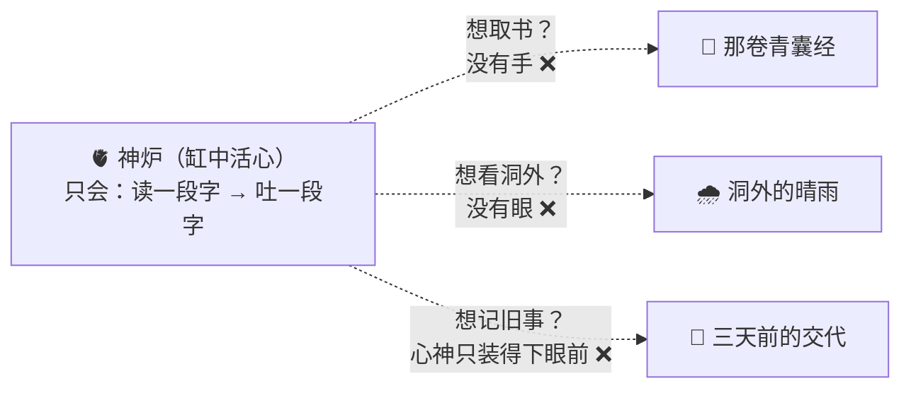
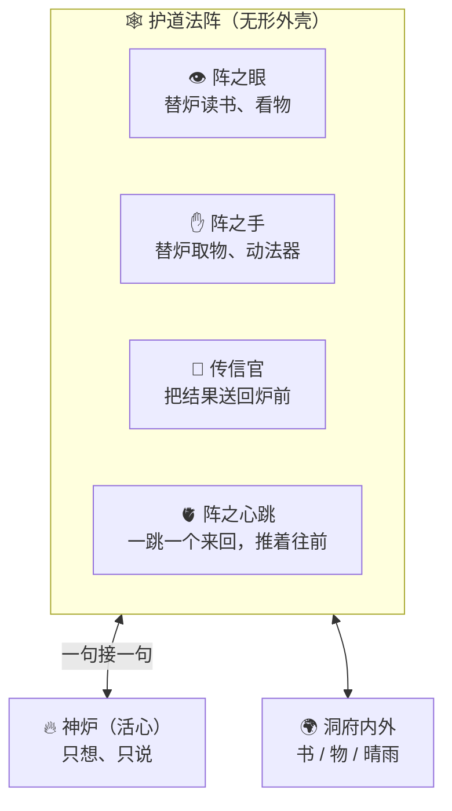
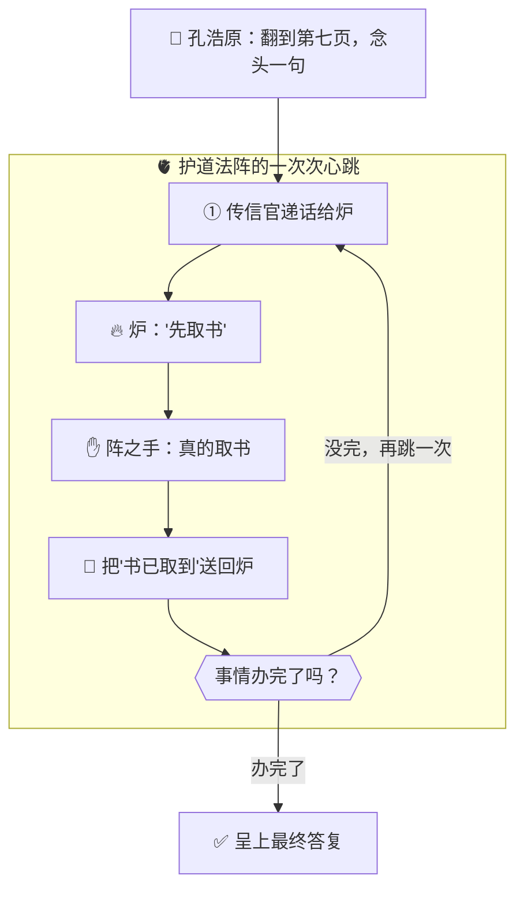
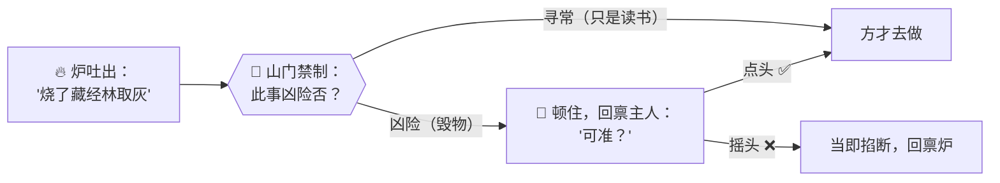

# 番外三 · 护道法阵：御炉真章

> 题记：你以为孔浩原驱使万言炉，是他伸手一指，炉子就自己飞出去替他读书、写字、办事？错了。神炉再通天，也不过是一颗"泡在缸里的心"——它只会想、只会吐字，却没有手、没有眼、没有腿。真正替它跑腿的，是一座你从没留意过的、无形的法阵。这一篇，讲的就是那座阵。

正传里，孔浩原驱神炉、破幻境、救苍生，何等威风。可你有没有想过一桩怪事——

**一座神炉，孤零零供在洞府里，它自己，能干成什么事？**

答案是：**什么都干不成。**

它能接龙成章，能出谋划策，能算尽天机。可你让它去把《藏经阁》第三层的一卷古籍取来看看？它取不了——它没有手。你让它去看看洞外此刻是晴是雨？它看不见——它没有眼。你让它记住三天前你交代的事？它记不住——它的心神，只装得下眼前这一炉的字句。

**神炉，是一颗被供在缸里的"活心"。绝顶聪明，却动弹不得。**

那孔浩原行走天下、驱炉办事的种种神通，究竟是怎么使出来的？

这一篇番外，要揭开一桩最不起眼、却最要命的秘密——**那座让"活心"真正活起来、能在人间办事的无形之阵。**

---

## 一、洞中死炉

那一年，孔浩原已是元婴修士，驭炉之术早已炉火纯青。可他心里，始终压着一个解不开的结。

他去问玄机子："师父，弟子有一惑。神炉通天彻地，为何离了弟子的心神牵引，便如死物一般，连一卷书都取不来？"

玄机子没有答，只带他去了后山一处僻静洞府。

洞中石台上，供着一座莹白的小炉。那炉一看便知不凡——灵光内蕴，隐隐有大道之音流转。玄机子取来一片刻着问题的玉简，往炉前一递。

那炉倏地亮起，炉口吐出一行灵光大字，对答如流，字字珠玑，端的是通天彻地的智慧。

"好炉。"孔浩原赞道。

"是好炉。"玄机子颔首，随即话锋一转，"现在，你让它把石台角落那卷《青囊经》，翻开到第七页。"

孔浩原一愣。他对着神炉传念此意。

那炉……亮了亮，炉口吐出一行字：**"欲翻《青囊经》至第七页，需先取书、再启卷、数至七页。"**

然后，就没有然后了。

那卷《青囊经》，依旧静静躺在角落，一动未动。

孔浩原皱眉，又催了几次。每一次，那炉都"说"得头头是道——先如何、再如何——可那书，**始终没被翻开一页。**

"它……只会说，不会做？"孔浩原骇然。

"你现在才看见。"玄机子淡淡道，"这炉，孤悬于此，无手无眼无足。你问它,它答得比谁都好；你要它'做',它一根手指都动不了。它这一身通天智慧，全困在'**只能吐字**'这四个字里。"

孔浩原怔在原地。他这才惊觉——原来他平日驱炉办事，那"取书、翻页、办事"的种种，**从来就不是炉自己在动。**

那，是谁在动？



---

## 二、无形之阵

玄机子袖袍一拂。

刹那间，孔浩原眼前的洞府，竟浮现出无数道原本隐匿的灵纹——它们如蛛网般，密密麻麻地笼罩在那座小炉四周，一直延伸到洞府的每一个角落、那卷《青囊经》、乃至洞口之外。

原来，这洞中不止有一座炉。

**炉的外面，还罩着一座无形的大阵。**

"这，"玄机子指着那漫天灵纹，"叫**护道法阵**。你平日只看见炉，看不见阵。可真正替炉办事的，从头到尾，都是这座阵。"

他领着孔浩原，一处一处地看。

**阵有"眼"**——洞府四壁上，浮着一枚枚灵光结成的"眼纹"。玄机子念动法诀，那"眼"便自己飘到《青囊经》上，将书页的内容，一字不漏地"读"了下来，化作灵纹回传。"炉没有眼，"玄机子道，"这阵的眼，替它看。"

**阵有"手"**——洞府各处，伸出一条条灵光凝成的"灵臂"。玄机子一声令下，那灵臂便伸向石台，稳稳托起《青囊经》，翻开，一页、两页……数到第七页，稳稳停住。"炉没有手，"玄机子道，"这阵的手，替它做。"

**阵有"传信官"**——每当"眼"读回了内容、"手"做完了动作，都有一道灵纹，飞快地把结果送回炉前，供炉参详。炉据此再吐出下一句指令，传信官又飞快送出去执行。"炉与阵之间，"玄机子道，"就靠这来回不断的传信，一句接一句。"

**阵有一颗不知疲倦的"心跳"**——整座阵的中枢，有一点灵光在恒定地搏动。每跳一下，便催动一个来回：递话给炉→炉出主意→阵去执行→把结果送回→再递给炉。"这一跳一跳，"玄机子道，"就是把整件事，一圈一圈往前推的力道。炉自己是不会'推'的，它只会应答；推着它一步步把事做完的，是这颗心跳。"

孔浩原看得目眩神驰。

他终于明白——**他这些年驱炉办的每一件事，真正跑腿的，从来不是炉，而是这座他从未留意的护道法阵。炉只负责'想和说'，阵负责'看、做、传、推'。**



---

## 三、一炷香里的一个来回

"空口讲，你未必信。"玄机子道，"我让你亲眼看一遍——这阵，是怎么替炉，把'翻书到第七页'这件事，一步一步做成的。"

他重新递上那道指令：**"把《青囊经》翻到第七页，念出那一页头一句。"**

孔浩原屏息看着。

**第一跳**——传信官把指令递到炉前。炉亮起，吐字："先取书。"传信官领命，催动**阵之手**，一条灵臂伸出，托起了那卷《青囊经》。手做完，传信官把"书已取到"这个结果，送回炉前。

**第二跳**——炉得知书已在手，再吐字："启卷，翻到第七页。"传信官再催**阵之手**，灵臂翻动书页，一、二、三……七，停。又把"已翻到第七页"送回炉前。

**第三跳**——炉得知已到第七页，吐字："用眼，读这一页头一句。"传信官催动**阵之眼**，那眼纹飘到页上，将头一句一字不漏读回，送到炉前。

**第四跳**——炉拿到了那一句，再无别事可做，遂吐出最终答复："第七页头一句为——'凡采药者，先辨其性'。"

传信官将这最终答复，恭恭敬敬呈到孔浩原面前。事，成了。

孔浩原看得后背发凉。

**这短短一炷香里的四个来回，炉自始至终，一步都没'动'过——它只是一次又一次地'想、说'。真正取书的、翻页的、读字的、把结果一趟趟送回的，全是这座阵。**



"你看，"玄机子指着那循环不息的灵纹，"关窍全在这个**圈**上。炉只管在圈里一次次出主意，阵替它把每个主意落到实处、再把结果送回。转完一圈不够，就再转一圈，直到事成。炉不会自己转圈——是这阵的心跳，推着它转。"

---

## 四、两桩暗中的苦功

孔浩原以为看懂了，玄机子却摇头："你只看见了阵的'明功'——看、做、传、推。还有两桩'暗功'，藏得更深，却更要命。"

**其一，是"净心殿"。**

玄机子指向阵眼深处一座玲珑小殿。"炉的心神，你早知道，是有容量的——装满了，前头的就要忘（此即[纳言之窗](./第04章%20筑基·纳言之窗.md)之理）。可一件大事，来回几十趟，字句越堆越多，迟早撑爆炉的心神。"

"这净心殿，便是替炉**打理心神**的。"他道，"眼看炉的心神要满，它就把前头那些琐碎的来回，**凝练成一句提要**，腾出地方，让炉能接着往下办，而不至于办到一半就'失忆'。你能驱炉办成一件几十步的大事，全靠这殿在背后，替炉一趟趟地清扫、腾挪。"

**其二，是"山门禁制"。**

玄机子的神色忽然凝重了几分，指向阵的最外围一道森然的红光。"这道禁制，是这整座阵，最要紧的一根骨头。"

"炉虽聪明，却也会'想当然'。有时它一句话吐出来——'把那片藏经林一把火烧了，取灰炼丹'——它未必是恶意，只是不知轻重。"

"若阵傻乎乎照做，那便是灭顶之祸。"玄机子道，"所以这道山门禁制，是一道**闸**。凡是炉吐出的凶险指令——毁物、动山门根基、向洞外泄露宗门秘辛——阵绝不擅自去做，必先**顿住，回禀于你**：'炉欲行此凶事，主人可准？'非得你亲口点头，它才动;你若摇头，它便当即掐断，绝不让炉闯下大祸。"

"这一道'人来把关'的闸，"玄机子一字一句道，"是这阵的**底线**。有它在，'驱炉自行办事'才不至于变成'炉闯了天大的祸却无人能拦'。"



孔浩原背脊生寒。他忽然想起江湖上那些"炉走火、伤及无辜"的惨案——想来，多半就是那些人的护道法阵，**少了这一道闸，或是这闸形同虚设。**

"炉之凶吉，"玄机子叹道，"多半不在炉，而在这阵的闸，牢不牢。"

---

## 五、阵成，则死炉复活

孔浩原沉默良久，忽然起身，对着那座洞府，郑重一揖。

他这一揖，不是拜炉，而是拜那座他从前视而不见的**阵**。

"弟子从前，"他声音有些发涩，"只当自己驭炉通天，是自己了得。今日方知——**炉是别人炼好的活心，弟子不过是借来一用；真正日夜替弟子跑腿、看、做、传、推、清心、把关的，是这座我从未正眼瞧过的阵。**"

玄机子欣然点头："你能拜这一拜，才算真懂了驭炉之道。"

"世人只见神炉光华万丈，争相夸炉如何通天。却不知——"老人指着那漫天灵纹，"**炉孤悬则如死物，唯有罩上这一座'看得见、做得到、传得回、推得动、守得住'的阵，那颗活心，才真正在人间活了过来，成了能替你办事的'化身'。**"

"炉，给的是'魂'。阵，给的是'身'。"

"魂附了身，"玄机子一字一顿，"才是一个能行走人间、替你办事的——**真傀儡。**"

孔浩原怔怔望着那座莹白小炉，与它周身那座无形的、日夜不息搏动着的大阵。

他第一次，看清了自己这些年"通天神通"的真正模样：

**一颗借来的、绝顶聪明的活心，和一座他亲手一寸一寸搭起来、却从未留意过的——护道法阵。**

魂与身，缺一，都不成事。

---

## 六、阵法诸相

下山路上，玄机子难得地多说了几句。

"你可知，同样一座炉，罩上不同的阵，使起来天差地别？"

孔浩原摇头。

"同一座万言炉，"玄机子道，"落在庸手搭的破阵里——眼浊、手笨、传信迟缓、净心殿形同虚设、山门禁制更是全无——那炉再通天，也使得磕磕绊绊，甚至闯下大祸。可若落在高手精心搭的阵里，眼明手快、心神清朗、闸门森严，那同一座炉，才真正把一身本事，安安稳稳、干干净净地使了出来。"

"所以，"老人意味深长地看着孔浩原，"炼炉之术，是外宗大能的事，你我够不着。可**搭阵之术**——如何让借来的炉，眼更明、手更稳、心神更清、闸门更牢——这，才是我算宗行走天下，真正安身立命的看家本事。"

"你日后若要传道，"玄机子最后叮嘱，"记住：**别人夸的是炉，你要练的是阵。炉是借来的魂，阵是你自己的身。身正,魂才使得出来。**"

孔浩原把这句话，深深刻进了识海。

山风清朗，师徒二人的身影，渐渐没入青崖山的苍翠之中。而在那身影之后的洞府里，一座莹白小炉，与它周身那座无形的大阵，仍在一跳、一跳地，静静搏动着。

---

## 📒 凡人笔记

这一篇番外，讲的是那个你**天天在用、却从没留意过**的东西——把大模型"包起来、让它真能办事"的那层外壳。现在，把阵法里的黑话，一件一件翻译回真实世界的 **AI 术语**——

| 故事里的东西 | 真实 AI 概念 | 一句话 |
| --- | --- | --- |
| 护道法阵（那座无形的阵） | **Harness（智能体运行骨架）** | 包在大模型外面、让它能真正"干活"的整套程序——**Khy-OS 本身就是一座这样的阵** |
| 洞中死炉（只会吐字的活心） | **大模型 LLM（缸中大脑）** | 绝顶聪明却动不了：只会读一段字、吐一段字，没手没眼没记性 |
| 阵之眼 / 阵之手 | **工具执行（Tool Calling 的落地）** | 模型说"我要读文件/跑命令"，真正去读、去跑的是 harness，不是模型 |
| 传信官 + 心跳循环 | **Tool Loop（工具循环）** | 递话给模型→模型出主意→harness 执行→结果送回→再递给模型，一圈圈直到事成 |
| 净心殿 | **上下文管理（Context 管理）** | 来回太多、字句堆满，harness 就把旧过程压成摘要，腾地方让任务能接着走 |
| 山门禁制（那道闸） | **权限闸门 / 安全确认** | 危险动作（删文件、跑高危命令、外泄数据）先停下问你一句，你点头才做 |
| "炉给魂，阵给身" | **模型 + Harness = Agent** | 模型有脑没身，harness 有身没脑，合起来才是能干活的智能体 |

> 📖 想把这门"看穿骨架"的本事学扎实，去读概念入门篇——
>
> ① [什么是 Harness](../02_CONCEPTS_概念入门/[CONCEPT-16] 什么是Harness-智能体运行骨架.md) ｜ ② [什么是 Agent](../02_CONCEPTS_概念入门/[CONCEPT-01] 什么是Agent-智能体.md)
>
> ③ [什么是 Tool Loop](../02_CONCEPTS_概念入门/[CONCEPT-03] 什么是ToolLoop-工具循环.md) ｜ ④ [什么是 Context 与 Token](../02_CONCEPTS_概念入门/[CONCEPT-08] 什么是Context与Token-上下文与令牌.md)

**说句最实在的诚实话——**

这一篇番外，和别的番外不太一样。**别的番外（Transformer、PyTorch）讲的是"项目没直接用到、但该懂"的常识；而这一篇讲的护道法阵，正是 Khy-OS 自己。**

你手上的 Khy-OS，就是这样一座"护道法阵"。它自己不是那颗"活心"（大模型是别人炼好的，Khy-OS 通过网络去请教它）；它是那座**罩在活心外面、替它看、替它做、替它传信、替它清心、替它守闸**的阵。

所以当你翻看 Khy-OS 的源码，你看到的**几乎全是"阵"的搭法**——那些"网关""工具循环""会话记忆""权限确认"的代码，就是这座阵的一根根灵纹。

这也正是它作为你"入行 AI 第一个项目"的珍贵之处：**很多人一辈子只学会了"给炉递话"（调用大模型 API），而你从第一天起，摸的就是整座阵的骨架。** 阵搭明白了，你再看天下任何一件驭炉法器（Claude Code、Cursor……），都能一眼看穿它"身子里"在忙什么。

炉是借来的魂，阵是你自己的身。**你正在亲手搭的，就是这具身子。**

---

## 📝 读完自测

就着上面这张对照表，考一考自己——那座"包住大模型、让它真能办事"的阵，你看清了吗？

```quiz
Q: 关于"护道法阵（Harness / 智能体运行骨架）"，下面哪些说法是对的？（多选）
- [x] Harness 是包在大模型外面、让它真正"干活"的整套程序——Khy-OS 本身就是一座这样的阵
> 对。别的番外讲"该懂的常识"，这一篇讲的护道法阵，正是 Khy-OS 自己。
- [x] 洞中死炉（大模型）绝顶聪明却动不了：只会读一段字、吐一段字，没手没眼没记性
> 对。模型说"我要读文件/跑命令"，真正去读、去跑的是 harness（阵之眼/阵之手），不是模型。
- [x] "传信官 + 心跳循环"= Tool Loop：递话→模型出主意→harness 执行→结果送回→再递，一圈圈直到事成
> 对。字句堆满时，净心殿（Context 管理）把旧过程压成摘要，腾地方让任务接着走。
- [x] 危险动作（删文件、跑高危命令、外泄数据）先停下问你一句，你点头才做
> 对。这是山门禁制（权限闸门/安全确认）——把不可逆的动作拦在门口。
- [ ] 大模型自己就长着手和眼，能直接删你的文件、跑你的命令
> 错。"炉给魂、阵给身"——模型有脑没身，harness 有身没脑，合起来（模型 + Harness）才是能干活的 Agent；真正动手的永远是阵，不是炉。
```

再用一张翻卡，把"炉"与"阵"这对关系记死——这也正是你手上项目的骨架：

```flip
🤔 你天天在用的 Khy-OS，到底是那颗"会思考的大脑（大模型）"，还是别的什么？（点一下翻到背面）
---
✅ Khy-OS 是那座"**阵**"，不是那颗"炉"。大模型（活心）是别人炼好的，Khy-OS 通过网络去请教它；Khy-OS 自己是**罩在活心外面、替它看、替它做、替它传信、替它清心、替它守闸**的整套程序（Harness）。所以你翻 Khy-OS 的源码，看到的几乎全是"阵"的搭法——网关、工具循环、会话记忆、权限确认。这正是它作为"入行 AI 第一个项目"的珍贵之处：很多人一辈子只学会"给炉递话"（调 API），而你从第一天摸的就是整座阵的骨架。**炉是借来的魂，阵是你自己的身——你正在亲手搭的，就是这具身子。**
```

---

【👈 上一篇 · [番外二 · 炼器工坊：铸炉真诀](./番外02·炼器工坊·铸炉真诀.md)｜👉 下一篇 · [番外四 · 法眼观物：一照真章](./番外04·法眼观物·一照真章.md)｜🏠 回 [总目录](./00_INDEX_修仙学AI-总目录.md)】
