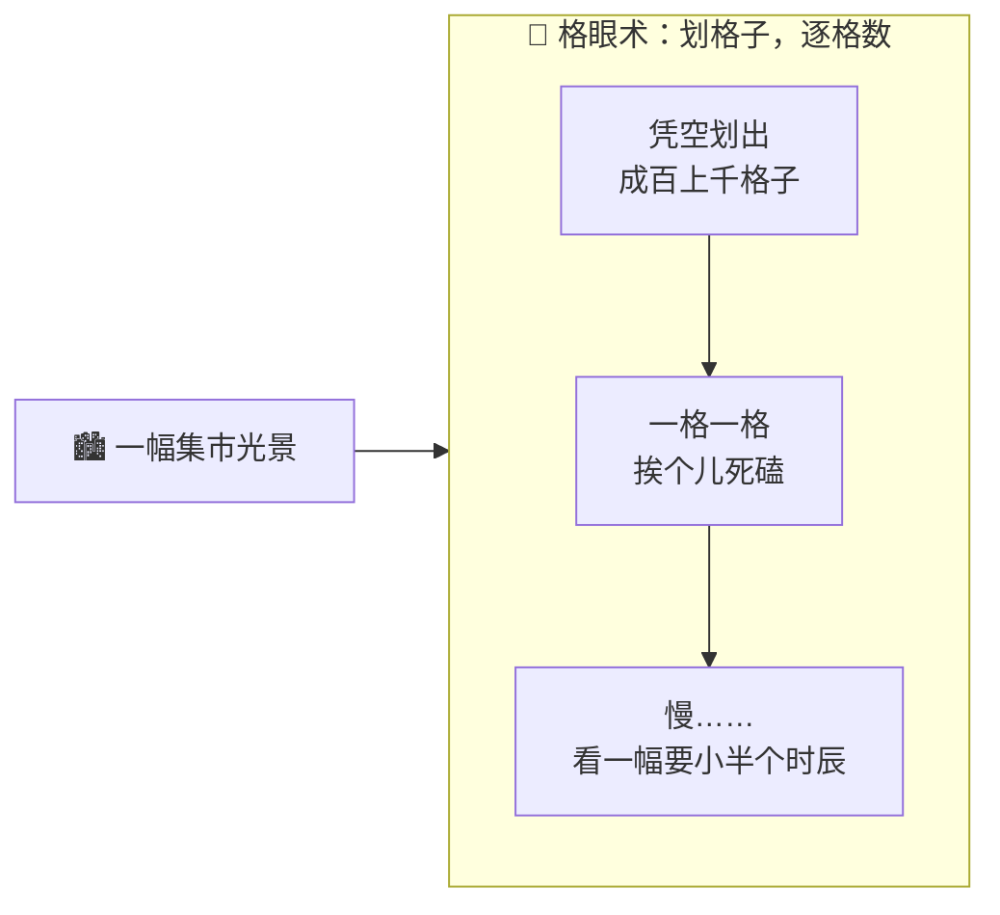
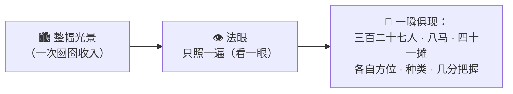
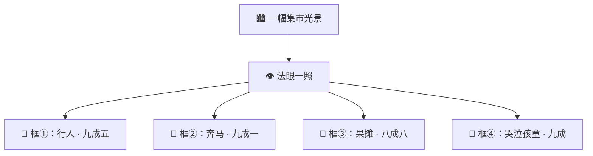

# 番外四 · 法眼观物：一照真章

> 题记：孔浩原这一路，修的都是"听声辨字"的道——接龙、言灵、驭器、参悟，桩桩件件，皆在"言语文字"上打转。可天地之大，岂止文字一途？有一门旁支绝学，不辨字、不听声，只**用一只法眼，往万象一照，当场看清眼前有几人、几马、几物，各在何方**。这一门，唤作"法眼观物"。它与孔浩原的主修，同根而异枝。

正传里，孔浩原的算道，走的是"文字言语"一脉——万言炉接龙、言灵咒炼句、藏经阁开卷，无一不是在"字"上做文章。

可有一日，孔浩原在一处集市，遇见了一件让他大开眼界的怪事。

一个眉心生有一道竖纹的少年，立于闹市高台。台下人山人海，车马杂沓，货摊林立，喧嚣一片。

有人不服，喝道:"你既号称'一照即知'，那你说说，此刻台下——有多少人、多少马、多少货摊？各在何方？"

那少年既不数、也不问，只将眉心那道竖纹缓缓睁开——**那是一只眼。**

眼开的刹那，一道柔光扫过全场。

**只一瞬。**

少年开口，声音清朗:"台下三百二十七人，左三马、右五马，货摊四十一，其中卖果者九、卖器者六……东南角有一孩童离了大人，正在哭。"

话音未落，众人循他所指望去——东南角，果然一个孩童，哭得满脸是泪。

满场哗然。

孔浩原心头剧震。他这"文字一脉"修了半生，何曾见过这般神通——**不辨一字，不问一声，只一眼扫过，满场万象，位置、种类、数目，当场尽收！**

这，究竟是何等样的道？

---

## 一、旧法之苦：一格一格地数

孔浩原按捺不住，上前请教。那少年姓卜，人称**卜观照**，是"观照一脉"的年轻传人。

"前辈谬赞。"卜观照倒也谦和，"这门'法眼观物'，看着神奇，其实说破了不值钱。倒是……前辈可知，我这一门，从前**有多笨**？"

孔浩原一怔。

"我师祖那一辈，"卜观照苦笑，"观物用的是'**格眼术**'。要看清一幅光景里有什么，他得先在眼前，凭空划出成百上千个小格子——"

他随手一比，空中浮现出一张密密麻麻的网格，罩住了台下集市。

"然后，"卜观照道，"一格、一格、挨个儿地看：'这一格里，是人么？……不是。下一格，是马么？……也不是。再下一格……'"

"成百上千个格子，"他叹了口气，"一个一个死磕过去，看完一幅光景，要耗上小半个时辰。莫说'一照即知'，等他数完，那离群的孩童，怕是早哭累睡着了。"

孔浩原听得直皱眉。这法子他懂——**笨、慢，把'看一眼'活活拆成了'看几百次'。**



"那前辈方才，"孔浩原问，"分明只一眼——"

"正是。"卜观照眼中闪过一丝自豪，"我这一脉，到了近世，出了一位奇人，把这门笨功夫，翻了个底朝天。"

---

## 二、一照真章：只看一次

"那位奇人悟出的道理，"卜观照道，"简单到可笑，却也精妙到极致——"

"**别再一格一格地数了。把整幅光景，一次性收进眼里，'扫一眼'，就让所有物事的'是什么'和'在哪儿'，一齐显出来。**"

他再度睁开眉心法眼。

这一次，孔浩原凝神细看——那道柔光,并非像格眼术那样一格一格地挪，而是**整幅光景，一次性、囫囵地,尽数映入了那只眼中**。光一收,答案便如水落石出,满场万象，一瞬俱现。

"你看，"卜观照道，"格眼术，是把一幅光景，拆成几百个小块，看了几百次。而我这'一照',是**整幅光景，只过法眼一遍**，答案便全出来了。"

"'只看一次'——"他一字一顿，"我这一门的真名，便叫此意。"

孔浩原如遭雷击。他忽然想起自己主修的[观例悟法](./第07章%20元婴·观例悟法.md)——原来"看"这件事，竟也能像"悟规律"一样，被这般巧妙地一举勘破！

**因为只需"看一次"，快得惊人。** 快到什么地步？卜观照道:"快到,即便台下光景瞬息万变——人在走、马在奔、孩童在跑——我这法眼,也能**一瞬接一瞬地照,每一瞬都看得清清楚楚,毫不迟滞。**"

孔浩原悚然。他终于懂了,为何方才那少年,能在人马杂沓、瞬息万变的闹市里,当场揪出那个离群的孩童——**唯有'一照即知'的快,才追得上这瞬息万变的世间。**



---

## 三、法眼所见：框、名、几分准

"前辈可想知道，"卜观照道，"我这一照，眼里究竟'看'到了什么？"

孔浩原正有此问。

卜观照抬手,在空中虚划。孔浩原眼前,那集市光景之上,竟浮现出一个个淡金色的光框——每一个物事,都被一个光框,稳稳圈住。

"我这法眼，一照之下，"卜观照道，"对**每一个**照见的物事，都给三样东西——"

| 法眼所予 | 大白话 | 例 |
| --- | --- | --- |
| **一道光框** | 这物事，在光景的**哪个方位**，用一个框圈出来 | 把那哭泣的孩童，用金框圈住 |
| **一个名目** | 这物事，**是什么** | "孩童" |
| **几分把握** | 我有**几分确信**没看错 | "九成，是个离群的孩童" |

"你看，"卜观照指着那满场跳动的金框，"框，告诉你'在哪';名,告诉你'是什么';把握,告诉你'我多有底'。三样凑齐,一物便算真真切切'看清'了。"

孔浩原望着那满场浮动的、稳稳圈住每一个人、每一匹马、每一处摊位的淡金光框，只觉一股说不出的震撼。

**这哪里是'看'？这分明是把一整幅纷乱万象,当场'点'得清清楚楚、明明白白。**



---

## 四、法眼何来：也是"观例悟法"练出来的

"前辈这门神通,"孔浩原问出了最要紧的一问,"是天生的么?"

"哪有天生的神通。"卜观照失笑,"我这法眼,和前辈的算道一样,是**'看例子,悟规律'一点一点练出来的。**"

"练法说来也朴素:师门给我看**几十万幅早已框好、标好**的光景图——每一幅上,人、马、摊,都被前辈们预先用框圈好、注明了名目。我便对着这些图,一遍遍地'猜':这一处是人么?在哪儿?猜完,与前辈框好的'真答案'一比,差了多少,便**纠正一分**——"

孔浩原心头一动:"这……这不正是我算道里的[观例悟法](./第07章%20元婴·观例悟法.md)、[神识重楼](./第08章%20化神·神识重楼.md)之理么?看例、猜、比对、纠错、再来一遍!"

"正是!"卜观照抚掌,"前辈一点就透!我这'看图'一脉,与前辈'读字'一脉,**修法看似南辕北辙,根子上,却是同一套'观例悟法'!** 只不过——前辈把它用在了'字'上,练成了接龙参悟;我把它用在了'物象'上,练成了这一照观物。"

"同一条根,"卜观照感慨,"竟生出这两条截然不同的枝。"


孔浩原久久无言。他这才明白——**天下的'学',底子竟是相通的。** 他修了半生的"看例悟法",原来不止能用在字上,更能用在这天地万象之上。道之根本,一也。

---

## 五、法眼诸用

"前辈这门'一照观物',"孔浩原问,"都用在何处?"

"用处大了。"卜观照掰着指头,"凡是要'一眼看清眼前有什么、各在何方',又'耽误不得、慢不得'的地方,都用得上——"

| 用途 | 法眼在做什么 |
| --- | --- |
| **🛡️ 边关望敌** | 敌骑压境,一照即知来了多少人马、阵型如何、主帅在哪 |
| **🏯 城门察异** | 万千行人过关,一照即揪出形迹可疑者、夹带禁物者 |
| **⚒️ 器坊验瑕** | 流水般的法器过眼,一照即框出有裂纹瑕疵的次品 |
| **🐎 猎场辨兽** | 密林之中,一照即分清何处是猎物、何处是同伴 |
| **⛑️ 医馆察疾** | 望气观形,辅助医者一照框出体内的异兆病灶 |

"说到底,"卜观照总结,"凡需'实时看清一幅纷乱光景里有哪些物事、各自何方'之处,几乎都少不了我这一门。"

孔浩原颔首。他忽然对这门"旁支绝学",生出了由衷的敬意——**道无高下,各擅胜场。他的字道通天,卜观照的物象之道,亦自有一片他从未涉足的辽阔天地。**

---

## 六、临别赠言：一根三枝

日暮时分,孔浩原与卜观照于集市尽头作别。

"今日得见前辈一照观物,"孔浩原拱手,"孔某半生只知'字'之一道,今日方知,天地间还有'物象'这一片辽阔天地。受教了。"

"前辈言重。"卜观照还礼,忽而一笑,"其实前辈不必'受教'——你我本就是**一根上的枝**。"

"哦?"

"前辈想想,"卜观照道,"你的接龙参悟,是'看字例、悟字理';我的一照观物,是'看物例、悟物理'。**根,都是那套'观例悟法'。** 你我的分别,只在'看的是字,还是看的是物'。"

"日后前辈若再听人说起什么'读字的通天神炉'、什么'观物的法眼'、什么'听声辨音的顺风耳'——前辈只需记得:**它们纵然神通各异,刨到根上,都是同一套'看例子、悟规律'练出来的。一根,三枝,乃至万枝。**"

"记住这个'根',"卜观照最后道,"前辈日后遇上任何闻所未闻的新神通,都能一眼看穿——'哦,又是这棵老树上,新抽的一条枝罢了。'"

孔浩原悚然而惊,随即长揖到底。

这一席话,比那"一照观物"的神通本身,更让他受用。

他带走的,不是一门看图的法眼——那非他所修。他带走的,是一个更根本的了悟:

**天下神通,枝繁叶茂,望之眼花缭乱;可但凡是'学'出来的,根,就只有那一条。抓住了根,万枝在你眼里,便都成了故人。**

暮色四合,孔浩原的身影,没入归途。而那集市高台上,卜观照眉心的法眼,又一次静静睁开,柔光扫过渐次归家的人流——一照之下,万象了然。

---

## 📒 凡人笔记

这一篇番外,讲的是一门**"看图"的 AI 绝学**——它和孔浩原主修的"文字"一脉,同根异枝。现在,把法眼的黑话,一件件翻译回真实世界的 **AI 术语**——

| 故事里的东西 | 真实 AI 概念 | 一句话 |
| --- | --- | --- |
| 法眼观物 / 一照真章 | **YOLO（You Only Look Once · 实时目标检测）** | 扫一眼整张图,就同时找出所有物体、框出位置,快到能实时处理视频 |
| "只看一次" | **You Only Look Once 的字面意思** | 整张图只过一遍网络就出全部答案,不像旧法把图拆成几百块逐个看 |
| 格眼术(划格子逐格数) | **早期目标检测(候选框逐个鉴定)** | 先圈出成百上千候选框、再一块块送进网络鉴定,准但极慢 |
| 光框 + 名目 + 几分把握 | **Bounding Box + Label + Confidence** | 每个物体给三样:方框(在哪)、标签(是什么)、把握度(多确定) |
| 看几十万幅框好的图、猜错纠错 | **用标注数据训练(机器学习/深度学习)** | 和文字大模型同源——喂海量人工标注图,反复"猜→对答案→纠错"练成 |
| "一根三枝"(字/物象/声) | **同源的深度学习分支** | 读字的大模型、看图的 YOLO、听声的语音模型,底层都是同一套机器学习 |

> 📖 想把这门"看图"的本事学扎实,去读概念入门篇——
>
> ① [什么是 YOLO](../02_CONCEPTS_概念入门/[CONCEPT-17] 什么是YOLO-实时目标检测.md) ｜ ② [什么是机器学习](../02_CONCEPTS_概念入门/[CONCEPT-12] 什么是机器学习-MachineLearning.md)
>
> ③ [什么是深度学习](../02_CONCEPTS_概念入门/[CONCEPT-13] 什么是深度学习-DeepLearning.md) ｜ ④ [什么是 PyTorch](../02_CONCEPTS_概念入门/[CONCEPT-15] 什么是PyTorch-深度学习框架.md)

**说句实在的诚实话——**

这一篇番外,是全书里**离孔浩原主修最远的一门**。

孔浩原的算道(以及你正在用的 Khy-OS),走的都是"**文字 + 智能体**"这一脉——接龙、驭器、开卷、办事,桩桩件件都在"言语文字"上。而"法眼观物"(YOLO)所在的"**看图**"一脉(专业叫**计算机视觉**),Khy-OS **并不涉足、也从不使用。**

那为何还要收这一篇?

正如卜观照临别所言——**为的是让你看见那条"根"。**

学到这里,你前面读的十几篇,几乎全在讲"AI 怎么处理文字"。这一篇,替你推开另一扇门:原来 AI 的世界,还有**看图**这半壁江山。而更要紧的是——你会亲眼看到,看图的 YOLO 和读字的大模型,**底子上是同一套"看例子、悟规律"(机器学习)**。

抓住了这条"根",你日后再听到"AI 生成图片""AI 听声辨字""AI 下棋"……任何闻所未闻的新神通,都能像孔浩原一样,会心一笑:

**"哦,又是这棵老树上,新抽的一条枝罢了。"**

一根,万枝。看穿了根,你便再不会被层出不穷的新名词唬住。

这,就是这门"离你最远"的旁支绝学,想悄悄塞给你的、最贵重的一样东西。

---

## 📝 读完自测

就着上面这张对照表，考一考自己——这门"看图"绝学，和读字的大模型到底什么关系？

```quiz
Q: 关于"法眼观物（YOLO / 实时目标检测）"，下面哪些说法是对的？（多选）
- [x] YOLO（You Only Look Once）扫一眼整张图，就同时找出所有物体、框出位置，快到能实时处理视频
> 对。整张图只过一遍网络就出全部答案，不像旧法把图拆成几百块逐个看。
- [x] 每个物体给三样：方框（在哪）+ 标签（是什么）+ 把握度（多确定）
> 对。Bounding Box + Label + Confidence，一次给全。
- [x] 早期目标检测（格眼术）先圈成百上千候选框、再一块块送进网络鉴定——准但极慢
> 对。YOLO 的"只看一次"正是为了甩掉这份慢。
- [x] 看图的 YOLO 和读字的大模型，底子上是同一套"看例子、悟规律"（机器学习/深度学习）
> 对。"一根三枝"——读字、看图、听声，底层同源；都靠喂海量标注数据反复"猜→对答案→纠错"练成。
- [ ] Khy-OS 就是靠 YOLO 这套"看图"能力来帮你办事的
> 错。这是全书离孔浩原主修最远的一门。算道（和 Khy-OS）走的是"文字 + 智能体"一脉，**并不涉足计算机视觉**；收这一篇，是为让你看见 AI 还有"看图"这半壁江山、看见那条共同的"根"。
```

再用一张翻卡，把"一根万枝"这层最贵重的道理记死：

```flip
🤔 Khy-OS 根本不用 YOLO、也不做"看图"，为什么这本书还要专门收一篇讲它的番外？（点一下翻到背面）
---
✅ 为的是让你看见那条"**根**"。你前面读的十几篇几乎全在讲"AI 怎么处理文字"，这一篇替你推开另一扇门：原来 AI 的世界还有**看图**这半壁江山（计算机视觉）。更要紧的是——你会亲眼看到，看图的 YOLO 和读字的大模型，**底子上是同一套"看例子、悟规律"（机器学习）**。抓住这条根，你日后再听到"AI 生成图片""AI 听声辨字""AI 下棋"……任何闻所未闻的新神通，都能会心一笑："哦，又是这棵老树上新抽的一条枝罢了。"一句话：**一根，万枝；看穿了根，就再不会被层出不穷的新名词唬住。**
```

---

【👈 上一篇 · [番外三 · 护道法阵:御炉真章](./番外03·护道法阵·御炉真章.md)｜👉 下一篇 · [番外五 · 立身法旨：开宗第一诀](./番外05·立身法旨·开宗第一诀.md)｜🏠 回 [总目录](./00_INDEX_修仙学AI-总目录.md)】
