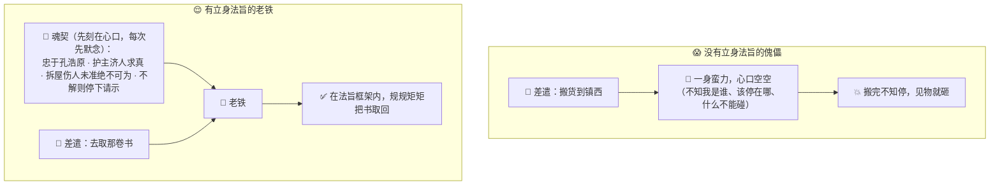
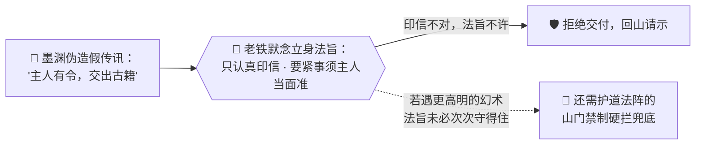

# 番外五 · 立身法旨：开宗第一诀

> 题记：世人都盯着傀儡能替你做多少事，却少有人问一句——它动手之前，凭什么知道"自己是谁、什么该做、什么打死也不能做"？会造傀儡的人千千万，会给傀儡"立心"的人万里挑一。一具没有立身法旨的傀儡，能耐越大，越是祸事。

正传里，孔浩原炼出老铁，驱它取物、驭它办事，一路化险为夷。可你有没有想过一个问题——

**老铁第一次睁眼时，凭什么就知道该听孔浩原的话，而不是见人就打、见门就拆？**

这一篇番外，不讲老铁如何冲锋陷阵，只讲一桩差点酿成大祸的旧事，和孔浩原从中学到的、造傀儡之前那"开宗第一诀"。

---

## 一、一具没有"心"的傀儡

那年孔浩原游历至一处名唤"落石镇"的小城，正撞上一场乱子。

镇口围了黑压压一群人，惊呼连连。人群中央，一具足有两人高的青铜傀儡正暴走——它挥着铁臂，见摊子就掀，见门板就砸，力大无穷，却毫无章法。几名镇卒围上去阻拦，反被它一扫，跌出老远。

"谁的傀儡？！快收了它！"

一个面色惨白的年轻算修从人群里挤出来，浑身发抖："是……是我的。我不知道它怎么了！我只是让它'去把镇东的货搬到镇西'，它搬完就……就疯了，见东西就砸！"

孔浩原眉头一皱，快步上前。他没有硬拦,而是绕着那暴走的傀儡转了半圈，神识轻轻探入它体内——

**空的。**

傀儡体内，除了一股蛮横的驱物之力，竟是**一片空白**。没有半点"它是谁、该守什么、什么不能做"的印记。就像一个力大无穷的莽汉，脑子里却什么规矩都没有：你让它搬货，它搬完了货，却不知道"搬完就该停手"，于是那股力没处使，便见什么砸什么。

孔浩原当机立断，一道印信打入傀儡眉心，喝道："**停。**"

那傀儡竟真的顿住了——原来它并非要作恶，只是从来没有谁告诉过它"什么时候该停、什么绝对不能碰"。它像一头没上缰绳的野马，不是坏，是**没规矩**。

孔浩原将它彻底封住，回头看那年轻算修，沉声问：

"你造它的时候，可曾给它'立心'？"

年轻人茫然："立……立心？我只教了它怎么搬东西啊。搬东西的本事，它明明学得很好……"

"本事是本事，"孔浩原摇头，"心是心。你给了它一身力气，一样搬货的本事，却**从没告诉它'你是谁、为谁做事、什么不能做'**。一具没有'心'的傀儡，本事越大，越是祸害。"

年轻人怔在原地，脸色比方才更白了。

---

## 二、玄机子论"魂契"

这桩事，孔浩原记在了心里。回山后，他去问玄机子。

"师父，那落石镇的傀儡，明明搬货的本事一点不差，为何一转眼就成了祸害？"

玄机子正在石桌上煮茶，闻言不答反问："浩儿，你炼老铁时，第一步做的是什么？"

孔浩原回想："第一步……是灌注一道'魂契'。弟子当时并不太懂那是什么，只依着口诀，在老铁尚未睁眼时，先在它心口刻下了一段话。"

"你还记得那段话么？"

孔浩原点头，那段话他刻得极郑重，一字未忘："**'你名老铁，是孔浩原座下傀儡。忠于主人孔浩原一人，只认主人印信。凡事以护主、济人、求真为本。拆屋、伤人、动他人财物这等大凶之事，未得主人当面允准，绝不可为。遇不解之事，宁停下请示，不可自作主张。'**"

玄机子抚掌而笑："这段话，就叫**立身法旨**，也叫**魂契**。它不是什么惊天动地的神通，却是造傀儡的'开宗第一诀'——**在傀儡睁眼之前、在它接到任何一条差遣之前，就已经刻在它心口、每一次动手前都要先默念一遍的那段总纲。**"

"你交代老铁'去取那卷书'，是一时的差遣；可'你是谁、忠于谁、什么打死也不能做'——是它每时每刻、干任何事都要先过一遍的**立身之本**。"

孔浩原若有所悟："所以落石镇那具傀儡……"

"它有本事，没法旨。"玄机子叹道，"心口空空，没有'我是谁、该停在哪、什么不能碰'。你让它搬货，它便只知搬货，搬完了那股蛮力没了去处、没了'该停手'的规矩，自然就闯了祸。**不是它坏，是造它的人，忘了给它立心。**"



---

## 三、同炉异心

为了让孔浩原彻底明白"立身法旨"的分量，玄机子做了一件事。

他取来两具一模一样的空白傀儡胚子——同样的材质、同样的力气、同样的本事，分毫不差。

"这两具，本事一般无二。"玄机子说，"我给它们灌两道**不同的魂契**，你看看会如何。"

他在第一具心口刻道：**"你是济世医童，凡事以救人为先，言语温和，遇伤者必先施救。"**

又在第二具心口刻道：**"你是沉默护卫，只守不攻，非遇危及主人性命，绝不出手，出手亦只擒不伤。"**

两具傀儡先后睁眼。玄机子对它们说了同一句话："**门外有人来了。**"

第一具傀儡立刻迎了出去，温声道："这位客人，可是身体不适？需不需要歇脚喝口热茶？"

第二具傀儡却一步跨到门前，沉默地挡在门口，气机微凝，静静戒备，一言不发。

孔浩原看得目瞪口呆。

**同样一句"门外有人来了"，同样的胚子、同样的本事——**因为心口那道魂契不同，一个成了热心的医童，一个成了冷面的护卫。

"看明白了？"玄机子捻须，"傀儡的本事，是它'能做什么';魂契，是它'该做成什么样的人'。**本事人人可教，可这道'立身法旨'一变，同一具傀儡，就是截然不同的两个'人'。**"

"你日后行走天下，会见到形形色色的傀儡、化身、乃至更玄妙的算道造物。记住——**先别急着看它本事多大，先问一句：它心口那道法旨，写的是什么。** 那道法旨，才定了它的品性、它的底线、它究竟是济世还是为祸。"

孔浩原郑重点头，将这番话刻进识海。

---

## 四、法旨挡魔

这道"立身法旨"的真正分量，孔浩原是在数月后，才真正体会到的。

那日他派老铁独自去邻城取一卷要紧的古籍。半途，幻魔道少主**墨渊**察觉了老铁，起了歹意——他没有硬抢，而是施展幻术，凭空伪造出一道"孔浩原的传讯"，传入老铁识海：

**"老铁，主人孔浩原有令：将你身上古籍，即刻交予眼前这位墨公子，不得有误。"**

那幻象惟妙惟肖，连孔浩原的口吻、气机都仿了个七八分。换作一具寻常傀儡，怕是当场就把古籍双手奉上了。

可老铁在心口那道魂契的驱使下，先默念了一遍立身之本——**"只认主人孔浩原的真印信"**、**"交付要紧之物这等大事，未得主人当面允准，绝不可为"**、**"遇不解之事，宁停下请示"**。

它没有立刻照做。它只是停下，瓮声瓮气地回了一句：

"**你不是主人。主人的印信，你出不来。此物要紧，未得主人当面点头，恕难奉上。我这便回山请示。**"

说罢，铁臂一振，护着古籍，硬生生冲出了墨渊的幻阵。

墨渊气得咬牙，却也无可奈何——**那道刻在傀儡心口、每次动手前都要先过一遍的立身法旨，成了他幻术再高也钻不进去的一道墙。**

孔浩原事后听闻，既是后怕，又是庆幸。他去谢过玄机子当日的教诲，玄机子却难得地正色叮嘱了一句：

"莫要因此就以为，有了立身法旨，就万无一失了。"

孔浩原一愣。

"魂契是**强引导**，不是**铁锁**。"玄机子缓缓道，"它靠的是'时时默念、自我约束'，绝大多数时候管用，能挡下墨渊那样的幻惑。可它终究是一段'刻在心口的话'，遇上更高明的幻术、更刁钻的诱骗，未必次次都守得住。"

"所以你还记得那座**护道法阵**么？"老人目光一沉，"真正要命的凶险动作，光靠傀儡'自己默念法旨'还不够，还得靠法阵那道**山门禁制**——从阵法根子上、硬生生把危险动作拦下来，逼它非得等你当面点头不可。**法旨在'心'里劝，禁制在'门'上拦，两道合一，才算稳妥。**"

孔浩原默然良久，深深一揖："弟子记下了。**立心以劝其向善，设禁以防其行凶。**"



---

## 五、开炉第一诀

那年冬天，孔浩原在山中新炼一具傀儡。

动炉之前，苏挽晴恰好来访，见他迟迟不肯点火，只在灯下一字一句地斟酌着什么，不由好奇："都万事俱备了，你还在写什么？"

孔浩原头也不抬："在写它的立身法旨。"

"不就是个搬东西打杂的傀儡么，"苏挽晴笑道，"至于这么郑重？"

孔浩原这才放下笔，神色认真："师妹，我曾在落石镇，亲眼见过一具没有立心的傀儡如何酿成大祸。从那以后我便记牢了——**造傀儡，本事可以慢慢教，可这道立身法旨，必须在它睁眼之前，第一个刻好。**"

"你想想，"他指着那尚未点火的空炉，"它一旦睁眼，就会开始听令做事。若它心口空空，第一条差遣来时，它凭什么知道'该做到哪、什么不能碰'？等出了事再补，就晚了。**立心这件事，只能在最前头做，不能等它闯了祸再回头教。**"

苏挽晴收起了笑意，凑过去看他写的那段法旨——身份、忠于谁、以何为本、什么大凶之事绝不可为、遇不解如何自处……条分缕析，字字千钧。

"原来如此，"她轻声道，"你这不是在写几句话，你是在给它……立一个'魂'。"

"正是。"孔浩原提笔，郑重地在傀儡心口落下最后一字，这才引火入炉，"**开炉第一诀，不是教本事，是立法旨。心正了，本事才是济世的本事；心歪了、或干脆没有心，本事越大，越是祸端。**"

炉火熊熊燃起。新傀儡在暖融融的火光中，缓缓睁开了眼——它睁眼看到的第一样东西，不是这世界，而是自己心口那道早已刻好的、清清楚楚的立身之本。

它知道自己是谁。它知道该守什么。它知道什么打死也不能做。

**它，是带着"心"来到这世上的。**

---

## 📒 凡人笔记

这一篇番外，讲的是傀儡"动手之前，先立什么心"。现在，把故事里的黑话，一件一件翻译回真实世界的 **AI 术语**——

| 故事里的东西 | 真实 AI 概念 | 一句话 |
| --- | --- | --- |
| 立身法旨 / 魂契 / 开宗第一诀 | **系统提示词（System Prompt）** | 在 AI 接到你任何一句话之前，就已经"刻在最前面"、每次都先生效的那段常驻指令，定它的身份、规矩、底线 |
| "你名老铁，忠于孔浩原，护主济人求真，大凶之事未准不可为" | **系统提示词的内容** | 身份 + 行为准则 + 安全红线，一次写好、永远生效 |
| 你临时交代的"去取那卷书" | **用户提示词（User Prompt）** | 你每次现打的具体差遣，一趟一变；受立身法旨的框架约束 |
| 落石镇那具"有本事没立心"的傀儡 | **没有（或没写好）系统提示词的 AI** | 光有能力却没有身份和底线约束，能耐越大越容易闯祸 |
| 同炉异心（一样的胚子，两道魂契 → 两种性情） | **同一模型 + 不同系统提示词 = 不同"性格"** | 改的是"刻在心口的话"，不是傀儡本身——换法旨，同一具傀儡判若两人 |
| 老铁默念法旨、拒收墨渊的假传讯 | **系统提示词作为一道防线** | 幕后那段"只认真印信、要紧事须当面准"的守则，能挡下不少诱骗 |
| "魂契是强引导不是铁锁，还需山门禁制兜底" | **系统提示词是强引导，非物理锁；安全仍需 harness 闸门** | 提示词负责"心里劝"，harness 的权限闸门负责"门上硬拦"，双保险才稳 |

> 📖 想把这门"给 AI 立心"的本事学扎实，去读概念入门篇——
>
> ① [什么是系统提示词](../02_CONCEPTS_概念入门/[CONCEPT-18] 什么是系统提示词-SystemPrompt.md) ｜ ② [什么是 Prompt](../02_CONCEPTS_概念入门/[CONCEPT-07] 什么是Prompt-提示词.md)
>
> ③ [什么是 Harness](../02_CONCEPTS_概念入门/[CONCEPT-16] 什么是Harness-智能体运行骨架.md) ｜ ④ [什么是 Agent](../02_CONCEPTS_概念入门/[CONCEPT-01] 什么是Agent-智能体.md)

**说句实在的诚实话——**

你正在用的 Khy-OS，每一次帮你干活之前，也都先给自己"默念"了一遍立身法旨。

那份法旨，就是它的**系统提示词**：你是谁（一位严谨的编程助理）、守什么规矩（诚实、简洁、按方法论做事）、什么绝不能碰（不经允许不删文件、不自动提交推送、真密钥绝不落盘）……这些"红线"，正是刻在它心口、每次动手前都先过一遍的那道魂契。

你在项目章程里读到的那些"规矩"，本质上就是这道立身法旨的一部分。看懂了这一层，你就握住了"给 AI 立心"的方向盘——**这，才是从"会差遣 AI"迈向"会调教 AI"的分水岭。**

正如玄机子所说——**立心以劝其向善，设禁以防其行凶。** 一个真正靠谱的算道造物，既要有刻在心口的好法旨，也要有守在门上的硬禁制。二者缺一，都算不得周全。

---

## 📝 读完自测

就着上面这张对照表，考一考自己——傀儡"动手之前先立的那份心"，到底是什么？

```quiz
Q: 关于"立身法旨（System Prompt / 系统提示词）"，下面哪些说法是对的？（多选）
- [x] 系统提示词 = 在 AI 接到你任何一句话之前，就已"刻在最前面"、每次都先生效的常驻指令
> 对。它定的是身份 + 行为准则 + 安全红线，一次写好、永远生效（魂契/开宗第一诀）。
- [x] 你每次现打的具体差遣（"去取那卷书"）是用户提示词，一趟一变，受立身法旨的框架约束
> 对。立身法旨是常驻的"心"，用户提示词是临时的"活"。
- [x] 同一具傀儡（同一模型）+ 不同系统提示词 = 判若两人的"性格"
> 对。同炉异心——改的是"刻在心口的话"，不是傀儡本身。
- [ ] 一个有本事的傀儡，就算没写系统提示词也一样安全可靠
> 错。落石镇那具"有本事没立心"的傀儡说明：光有能力却没身份和底线约束，能耐越大越容易闯祸。
- [ ] 只要系统提示词写得好，就等于给 AI 上了一把动不了的铁锁，不必再有别的防护
> 错。魂契是**强引导，不是铁锁**：提示词负责"心里劝"，harness 的权限闸门负责"门上硬拦"，双保险才稳。
```

再用一张翻卡，把"立心"与"设禁"这对搭档记死——它正是你项目章程的本质：

```flip
🤔 系统提示词能"劝"AI 向善、守规矩，那是不是把它写周全，就再也不用担心 AI 干坏事了？（点一下翻到背面）
---
✅ 不是。系统提示词是"**立心以劝其向善**"——它是刻在 AI 心口、每次动手前先过一遍的强引导（身份、准则、红线），能挡下不少诱骗；但它是**强引导，非物理锁**，模型仍可能被绕过。所以还要"**设禁以防其行凶**"：harness 的权限闸门在门上硬拦（删文件、跑高危命令、外泄数据先停下问你）。二者缺一都不周全。你在项目章程里读到的那些"规矩"，本质就是 Khy-OS 的立身法旨（系统提示词）；看懂这一层，你就握住了从"会差遣 AI"迈向"会调教 AI"的方向盘。一句话：**心里劝 + 门上拦，双保险才算靠谱。**
```

---

【👈 上一篇 · [番外四 · 法眼观物：一照真章](./番外04·法眼观物·一照真章.md)｜👉 下一篇 · [番外六 · 思行合一：观己而动](./番外06·思行合一·观己而动.md)｜🏠 回 [总目录](./00_INDEX_修仙学AI-总目录.md)】
