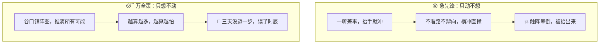
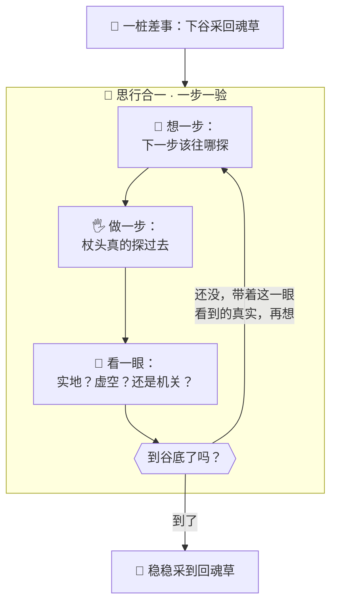

# 番外六 · 思行合一：观己而动

> 题记：世间蠢材有两种。一种想都不想，抬手就干，撞了南墙才知道疼；另一种光想不动，把万般可能在脑中盘算到天荒地老，却一步都不敢迈。真正的高手，走的是第三条路——想一步，动一步，看一眼，再想下一步。这条路，叫思行合一。

正传里，孔浩原驭器破敌、开卷问道，招招都像是"想好了才出手"。可你有没有想过——

**他是怎么做到"每一步都恰到好处"的？是天生神算，一眼看穿全局？还是另有一套心法？**

这一篇番外，讲的正是孔浩原在金丹境时，从一位瞎眼老猎人身上，悟到的那套贯穿他一生的心法：**思行合一**。

---

## 一、两个栽跟头的师兄

那年孔浩原刚破金丹，学会了驭器术，正是意气风发的时候。宗门派下一桩差事：山中有一味"回魂草"，生在瘴气弥漫的迷雾谷底，采来救人。同去的，还有两位师兄。

第一位师兄，叫**急先锋**。他一听差事，二话不说，驱起飞剑就往谷底冲。他心想："不就是采棵草么，冲下去采了就走！"结果雾里岔路交错、暗藏机关，他一头扎进去，既不看路、也不辨向，横冲直撞——没半个时辰，就触了谷底的迷魂阵，晕头转向，连东南西北都分不清，最后是被人抬出来的。

**他输在：只顾动，不肯想。抬手就干，撞了南墙才知道疼。**

第二位师兄，叫**万全策**。他吸取了急先锋的教训，决定"谋定而后动"。他在谷口铺开一张阵图，开始推演：若走左路，可能遇甲机关，需如此如此破解；若甲机关之后又有乙陷阱，则需那般那般……他把谷底所有可能的岔路、机关、变数，一条一条在脑中盘算，越算越多，越算越怕。

三天过去了，万全策还蹲在谷口画他的阵图，一步都没敢迈进去。回魂草没采到，救人的时辰，倒是先耽误了。

**他输在：只顾想，不肯动。把万般可能盘算到天荒地老，却一步都不敢迈。**

孔浩原站在谷口，看着一个被抬出来、一个还在画图，心中隐隐觉得——**这两条路，怕是都走岔了。可正确的路，又该是哪一条呢？**



---

## 二、瞎眼老猎人

正当孔浩原踌躇之际，谷口来了一位拄着木杖的**瞎眼老猎人**。

老人双目虽盲，脚步却极稳。他听说三个修士要下谷采回魂草，呵呵一笑："迷雾谷我进出四十年了。你们那两条路，一条叫'莽',一条叫'怯',都到不了谷底。"

孔浩原忙上前请教："老丈,那该如何是好？"

老人也不多话，只招手道："跟我下去一趟，你自己看。"

孔浩原搀着老人,一步步踏入迷雾。他很快发现，这瞎眼老人走谷底，走得竟比明眼人还稳。他的诀窍，说来极简单——

**每走一步，老人都先停下，用木杖往前"探"一下。**

杖头点在实地，他便迈一步；杖头点到虚空（是个坑），他便绕开；杖头点到冰凉的机关铜片，他便凝神听一听那机括的声响，判明是什么陷阱，再定往哪走。

孔浩原忍不住问："老丈，您为何不一口气把整条路线都想好，再一路走到底？"

老人摇头笑道："娃娃,这雾里的路,是**活的**。你在谷口想得再周全,也是'猜'。这块石头稳不稳，要踩了才知道；这道机关是明是暗，要探了才明白。**你不动手探一探，光在脑子里想，想出来的全是空的。**"

"可要是像那位莽师兄，不想就冲呢？"

"那更蠢。"老人杖头一点，避开一处孔浩原根本没看见的暗坑，"不探就迈，一脚踩空，命都没了。**光想不动是怯，光动不想是莽。**"

"那到底该怎么走？"

老人停下脚步，一字一句："**想一步，探一步，看一眼，再想下一步。** 想的是'下一步该往哪探'；探的是'这一步到底实不实'；看的是'探出来的结果是什么'。看明白了，再想下一步该往哪探。如此循环，一步一验，这活路，就走出来了。"

孔浩原如遭雷击，怔在原地。

**想 → 探 → 看 → 再想。** 短短八个字，却像一道光，劈开了他心中那团"莽"与"怯"的迷雾。

---

## 三、思行合一

那一日，孔浩原搀着瞎眼老人，就用这"想一步、探一步、看一眼"的走法,一步一验，稳稳当当地摸到了谷底,采到了回魂草。

回程路上，他反复咂摸老人那八个字，忽然福至心灵，在心中将它凝成了一门心法，取名——**思行合一**。

他后来向苏挽晴解说这门心法时，是这样讲的：

"寻常人做事，不是'先把整套计划想死、再闭眼执行'，就是'不管不顾、抬手就干'。这两条路，都错在把'想'和'做'**割裂**开了。"

"思行合一，是把'想'和'做'**拧成一股、交替着来**："

- **想一步**——不贪多，只想清楚"眼下这一步，我该做什么、为什么"；
- **做一步**——把这一步真真切切地做出来（探那块石头、驭那件器、翻那卷书）；
- **看一眼**——睁大眼睛，看清楚"这一步做出来，到底得了个什么结果"；
- **再想下一步**——带着这个**刚刚看到的真实结果**，去想下一步该怎么走。

"关窍全在那个'看'字。"孔浩原强调，"你做一步，天地会给你一个**真实的回应**——石头稳不稳、机关响不响、书里写没写。这个真实回应，比你在脑子里凭空'猜'一百遍都金贵。**你顺着一个个真实回应往前走，就绝不会像万全策那样活在空想里，也不会像急先锋那样瞎撞。**"



苏挽晴听罢，若有所思："所以急先锋是有'做'无'想看'，万全策是有'想'无'做看'……只有把三者拧在一起、循环起来，才走得通。"

"正是。"孔浩原点头，"**莽者知行不知思，怯者知思不知行。思行合一者，思一分则行一分，行一分则验一分，验一分再思一分**。这一路'想—做—看'转下去，纵是活的迷雾，也能走出一条实实在在的路来。"

---

## 四、观己而动，方破幻魔

这门"思行合一"的心法，日后竟成了孔浩原对付幻魔道的一件利器。

幻魔道最擅长什么？**造幻象。** 他们用灵机编织出以假乱真的假消息、假典籍、假人证，惑乱人心。一个"只想不看"的算修，最容易上他们的当——因为幻象最能骗过"凭空想象"。

有一回，墨渊在孔浩原必经的山道上，凭空造出一座**幻境城池**，城中"父老"哭诉遭了灾，求孔浩原即刻施法相救。那幻象逼真无比，若孔浩原当场信了、贸然出手，正中墨渊圈套。

可孔浩原没有立刻动。他默运思行合一之法——

**想**："这城来得蹊跷。我不能凭眼前所见就信，得**探一探真伪**。"
**做**：他没有施法救人，而是弯腰，抓起一把城中的"泥土"，凝神细查。
**看**：那"泥土"入手，竟无半分重量、无半分土腥——**是灵机编的假物，不是真的。**
**想**："果然是幻象。既是假的，这'父老哭诉'也是假的，不必理会。"

孔浩原朗声一笑，一步踏破幻城，扬长而去。墨渊精心布置的圈套，就这么被他"抓一把土看一眼"给破了。

"你可知我为何破得了他的幻境？"孔浩原后来对师妹说，"不是我神识比他强，是我**不肯只凭'想'和'看一眼表象'就下判断**。我偏要**动手探一探那泥土的真伪**——一探，假的就露馅了。"

"幻象再逼真，也经不起你伸手去'验'一下。"孔浩原目光清亮，"**光在脑子里想，会被幻象牵着走；肯动手去探真实的回应，幻象就无所遁形。这，才是思行合一真正的厉害之处——它让你永远踩在'真实'上，而不是踩在'想象'里。**"


---

## 五、心法无形，处处皆是

多年后，孔浩原已成一代算道大能。有后辈问他毕生所学中，哪一门心法用得最勤。

众人都以为他会说什么惊天动地的神通。他却答了四个字：**思行合一。**

"这门心法，最不起眼，也最不离身。"孔浩原对后辈说，"我驭器办事，是想一步、驭一动、看一果、再想下一步；我开卷问道，是想'该查什么'、真去翻书、看书里写了啥、再想怎么答；我识破幻魔，是想'这是真是假'、动手一探、看它露不露馅、再定行止。"

"你看，从最小的采药，到最大的破劫，**没有一件事，逃得开这'想—做—看'的循环**。它不是什么高深法术，它是一切'把事做对'的人，共同的走法。"

后辈似懂非懂："大师，那这门心法最要紧的，究竟是哪一环？"

孔浩原想了想，指了指自己的眼睛："是这个'**看**'字。"

"莽者错在不想就做，怯者错在只想不做——可就算你又想又做，若做完**不肯睁眼看一看真实的结果**，只顾埋头往下干，那和闭眼瞎撞也没多大分别。"

"**做一步，天地必有一个真实的回应。肯低下头、睁开眼，把那个回应看清楚、认下来，再据此走下一步——这，才是思行合一的魂。**"

"记住了：**观己而动，步步踏实。** 别活在想象里，别赌在运气上——每一步，都踩在你亲眼看清的真实上。这条路，慢是慢些，却是这世上唯一走得远的路。"

山风拂过，老人的话，落进一代代后辈的心里。

---

## 📒 凡人笔记

这一篇番外，讲的是做事时"想"与"做"该怎么配合。现在，把故事里的黑话，一件一件翻译回真实世界的 **AI 术语**——

| 故事里的东西 | 真实 AI 概念 | 一句话 |
| --- | --- | --- |
| 思行合一 / 观己而动 | **ReAct 模式（推理 + 行动交替）** | 让 AI"想一步 → 做一步 → 看一眼结果 → 再想下一步"，而不是闷头一把梭 |
| "想一步" | **Thought（推理）** | AI 先把"下一步该干嘛、为什么"想清楚、写出来 |
| "做一步 / 杖头探过去" | **Action（行动）= 工具调用** | AI 真的去用一个工具（读文件、查资料、跑命令） |
| "看一眼 / 石头稳不稳" | **Observation（观察）** | 拿到工具返回的真实结果，据此校准下一步 |
| 急先锋（只动不想，撞南墙） | **没有推理、闷头一把梭的 AI** | 不查证就下手，容易出错、闯祸 |
| 万全策（只想不动，画图三天） | **纯规划、脱离真实反馈的空想** | 计划再全也是"猜"，不动手验证就落不了地 |
| "抓一把泥土，探幻境真伪" | **ReAct 用真实观察抑制幻觉** | 不凭想象下判断，动手取一手真实信息，假的当场露馅 |
| "最要紧的是那个'看'字" | **Observation 是 ReAct 的魂** | 做完必须睁眼看真实结果、认下来，再走下一步——否则等于闭眼瞎撞 |

> 📖 想把这门"想—做—看"的心法学扎实，去读概念入门篇——
>
> ① [什么是 ReAct](../02_CONCEPTS_概念入门/[CONCEPT-19] 什么是ReAct-智能体推理模式.md) ｜ ② [什么是 Tool Loop](../02_CONCEPTS_概念入门/[CONCEPT-03] 什么是ToolLoop-工具循环.md)
>
> ③ [什么是 Tool Calling](../02_CONCEPTS_概念入门/[CONCEPT-02] 什么是ToolCalling-工具调用.md) ｜ ④ [什么是 LLM](../02_CONCEPTS_概念入门/[CONCEPT-06] 什么是LLM-大语言模型.md)

**说句实在的诚实话——**

你正在用的 Khy-OS，帮你干活时，走的正是孔浩原这套"思行合一"。

它不会你一提问就凭空甩你一个答案（那是急先锋，容易瞎编）；它也不会光在脑子里盘算却迟迟不动手（那是万全策，落不了地）。它走的是——先说一句它打算干嘛（想），真的去读某个文件、跑某条命令（做），把真实结果拿回来（看），再据此决定下一步。**想—做—看，一步一验，直到把你的活稳稳干完。**

而 Khy-OS 章程里那句"没跑过验证不许说'修好了'"，正是孔浩原口中最要紧的那个"**看**"字——**别凭想象说做完了，去真的跑一遍、亲眼看到绿灯，才算数。**

正如孔浩原所说——**观己而动，步步踏实。** 一个真正靠谱的 AI，从不活在想象里，而是让每一步都踩在它亲眼验过的真实上。这，就是"思行合一"想悄悄塞给你的那把钥匙。

---

## 📝 读完自测

就着上面这张对照表，考一考自己——"想—做—看"这门心法，你走通了吗？

```quiz
Q: 关于"思行合一（ReAct · 推理+行动交替）"，下面哪些说法是对的？（多选）
- [x] ReAct = 让 AI"想一步 → 做一步 → 看一眼结果 → 再想下一步"，而不是闷头一把梭
> 对。一圈就是 Thought（想）→ Action（做/工具调用）→ Observation（看/真实结果）。
- [x] "做一步"就是真的去用一个工具（读文件、查资料、跑命令），即 Action = 工具调用
> 对。做完还要拿回工具的真实返回（Observation），据此校准下一步。
- [x] 那个"看"字（Observation）是 ReAct 的魂：做完必须睁眼看真实结果、认下来，再走下一步
> 对。不看真实结果就等于闭眼瞎撞；"抓一把泥土探真伪"正是用真实观察抑制幻觉。
- [ ] 急先锋"只动不想、撞了南墙才知疼"是 ReAct 推崇的高效打法
> 错。那是"没有推理、闷头一把梭"——不查证就下手，容易出错闯祸，正是 ReAct 要治的病之一。
- [ ] 万全策"只想不动、画图三天"才是最稳妥的，计划越全越好
> 错。纯规划脱离真实反馈就是空想——计划再全也是"猜"，不动手验证就落不了地。ReAct 走的是"想 + 做 + 看"的第三条路。
```

再用一张翻卡，把 ReAct 那个最容易被跳过的"看"字记死：

```flip
🤔 "想一步、做一步"之后，为什么"看一眼结果"反而是 ReAct 里最要紧、最不能省的一步？（点一下翻到背面）
---
✅ 因为不"看"，前面的"想"和"做"就成了闭眼瞎撞。Observation（观察）是 ReAct 的**魂**：你用工具做完一步，必须拿回**真实的返回结果**、认下来，再据此决定下一步——石头稳不稳，得伸手探过去才知道，不能凭想象。这一"看"，让 AI 不凭空下判断、而是拿一手真实信息校准自己：假的当场露馅（抑制幻觉），错的及时掉头。跳过它，就等于"想得头头是道、做得稀里糊涂、结果对不对全不知道"。一句话：**想和做决定你往哪走，看才决定你有没有走对。**
```

---

【👈 上一篇 · [番外五 · 立身法旨：开宗第一诀](./番外05·立身法旨·开宗第一诀.md)｜👉 下一篇 · [番外七 · 万化调兵：分身有主](./番外07·万化调兵·分身有主.md)｜🏠 回 [总目录](./00_INDEX_修仙学AI-总目录.md)】
