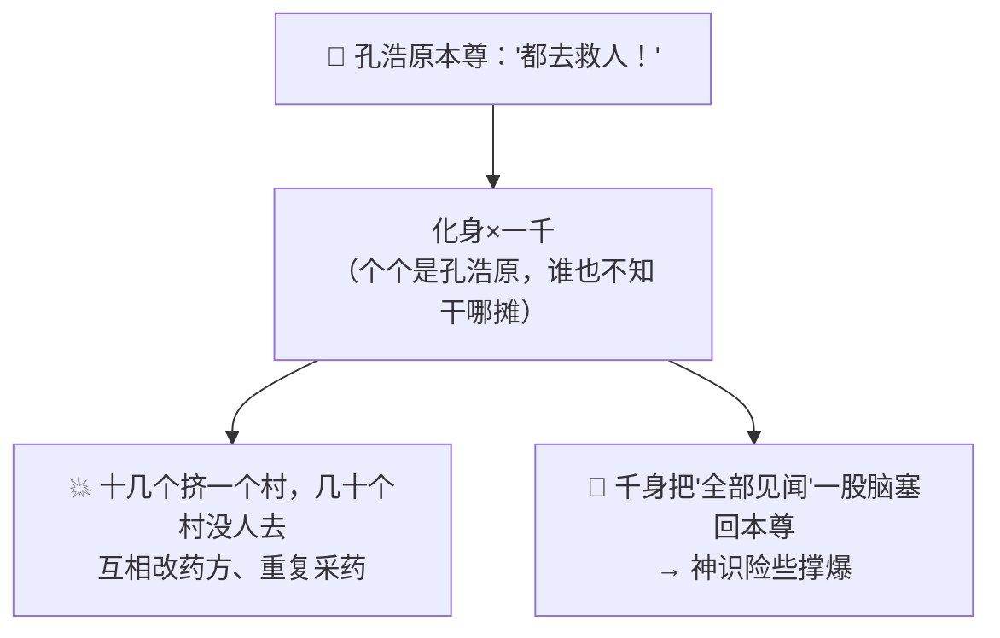
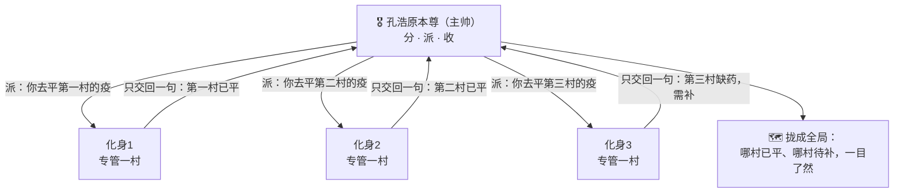
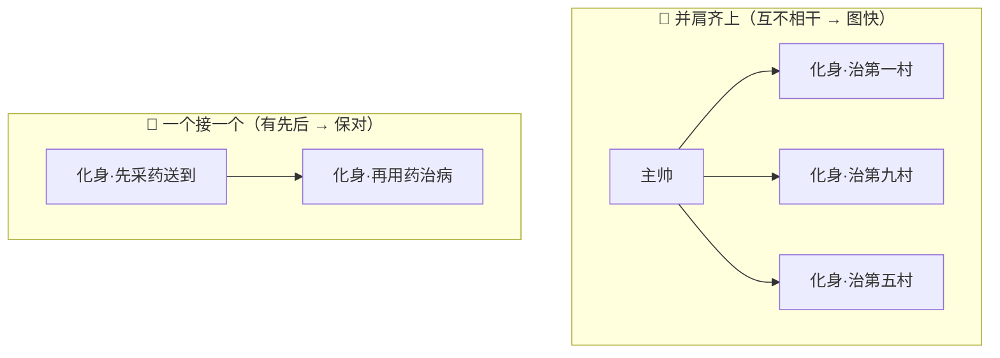

# 番外七 · 万化调兵：分身有主

> 题记：一个人的本事再大，也有两只手、一个脑子。真正的大能，不比谁的拳头硬，而比谁调得动更多的人、把一盘散沙拧成一支军队。化身千万不难，难的是——千万化身，各有各的主，各归各的位，最后拢成一件事。

正传"化身万千"一章里，孔浩原一念化出千百化身，替他行走人间。那是何等的气象。可你有没有想过一个更实际的问题——

**一千个化身同时干活，会不会乱成一锅粥？谁听谁的？谁干什么？各自的战报，又是怎么收拢成一件事的？**

这一篇番外，讲的正是孔浩原从"能化出很多化身"，到"能**调度**很多化身"之间，那道最难跨过的坎。

---

## 一、千身之乱

孔浩原初成"化身万千"之术时，着实威风了一阵，也着实闹了一场笑话。

那年东海一带瘟疫横行，千村万寨同时告急。孔浩原心想：一个人救不过来，我化他一千个化身，一村派一个，岂不是顷刻就把这瘟疫平了？

他一咬牙，真化出了一千具化身，大手一挥："都去救人！"

结果——**乱套了。**

一千个化身，个个都是"孔浩原"，个个都想大干一场，可谁也不知道该去哪个村、该干哪一摊。于是十几个化身挤在同一个村里抢着熬药，另有几十个村却一个化身都没去；这个化身刚配好一副药，那个化身又跑来把药方改了；东边的化身采了草药，西边的化身却不知道，又重新采了一遍……

更糟的是收尾。一千个化身各自忙活完，一股脑把**所有见闻**全塞回孔浩原本尊的识海——一千个村子的每一株草、每一个病人、每一句家常，海量的杂讯轰然涌入。孔浩原只觉识海剧痛，那点神识哪里装得下一千个村子的全部细节？他眼前一黑，险些当场"神识撑爆"，栽倒在地。

苏挽晴赶来时，见他面如金纸，一千化身还在东海乱作一团，哭笑不得："孔师兄，你这哪是救灾，你这是……放了一千个没头苍蝇出去啊。"

孔浩原苦笑，扶额长叹："化身易，**调身难**。我只学会了'化出很多个',却没学会'指挥很多个'。"



---

## 二、玄机子论"主帅"

孔浩原休养数日，神识稍复，便去向玄机子请教这"调身"之道。

玄机子听完那场千身之乱，非但不恼，反而抚掌大笑："好哇！你总算撞见了'化身万千'真正的门槛。世人都以为这术法难在'化得出',殊不知——**难在'调得动'。**"

"你且说，"老人问，"沙场之上，一位真正的大将军，是靠自己一杆枪杀敌万千么？"

孔浩原摇头："自然不是。将军若只顾自己冲杀，纵有万夫不当之勇，也只是一员猛将，成不了统帅。"

"那统帅靠的是什么？"

孔浩原若有所悟："靠……调兵遣将。他自己不必冲锋，只需**把大仗拆成小仗，派给各路人马，再收各路战报，定下一步方略**。"

"着啊！"玄机子一拍石桌，"你化那一千个化身，坏就坏在——**你只当了'化身的娘',没当'化身的帅'。** 你把他们生了出来，却没给他们'分派差事'、没给他们'划定地盘'、更没教他们'该怎么把战报收拢回来'。一千个没帅的兵，本事再高，也是一盘散沙。"

"那……该怎么当这个'帅'？"

玄机子伸出三根手指，一字一顿："**分、派、收。**"

"**分**——先把大事拆成一件件不打架的小事：一村一摊，划得清清楚楚，谁也别抢谁的、谁也别漏了谁。"

"**派**——把每一件小事，派给一个化身，只让他专心干这一摊，别的不用他操心。"

"**收**——最要紧、也最容易被你忽略的一环：每个化身干完，**只许把'办成了什么'的一句话战报交回来，不许把沿途的鸡毛蒜皮全倒给你**。你要的是'第三村已平疫',不是'第三村东头王婆婆家的狗昨天叫了三声'。"

孔浩原悚然一惊——他那次险些撑爆神识，正是栽在这个"收"字上。一千个化身把全部细节一股脑倒回来，他本尊那点神识，如何装得下？

"若每个化身只交回一句'办成了什么',"孔浩原喃喃，"那一千句战报，我本尊就装得下了……"

"正是。"玄机子颔首，"**化身替你去啃那千头万绪的杂事，只把嚼碎了的精华喂回给你。** 如此，你一个本尊的神识，才统御得了一千个化身的工程。这，才是'化身万千'真正的奥义——不是化得多，是**调得动、收得拢**。"



---

## 三、各有其主，各归其位

得了"分、派、收"三字诀，孔浩原重整旗鼓，再赴东海。

这一次，他没有一上来就化出一千个"一模一样的孔浩原"乱撞。他先在本尊这里，把整场救灾**拆**了个清楚：

- 哪些村子疫情最重，哪些较轻——**先分轻重缓急**；
- 每个化身**只认领一个村**，划定地盘，绝不越界去抢别人的活；
- 更妙的是——他给不同的化身，灌注了**不同的"立身法旨"**：

派去治病的化身，法旨是"你是济世医者，以救人为先"；派去采药的化身，法旨是"你是采药人，只管把某几味药采足、送到各村";派去安抚民心的化身，法旨是"你是抚民使，只管稳住秩序、别让百姓乱跑"。

**各有其主，各归其位。** 医者只管治病，采药的只管采药，抚民的只管抚民——谁也不抢谁的活，谁也不漏自己的摊。

而这一次，每个化身干完，都只依令传回**一句话战报**：

"第三村已平疫。"
"某药已采足，分送七村。"
"第九村民心已安，唯缺粮,请本尊定夺。"

一千个化身的千头万绪，收拢到孔浩原本尊这里，竟只剩下清清爽爽的一千句话。孔浩原端坐本尊之位，如观全局棋盘——哪村已平、哪村待援、何处缺药、何处缺粮，一目了然。他从容调度，缺药的补药、缺粮的调粮，不过数日，东海瘟疫竟被平了大半。

苏挽晴这回是真心叹服了："同样是一千个化身，上回是一锅粥，这回是一盘棋。差别就在——你这回，是真的在'**帅**'他们了。"

孔浩原望着东海渐渐平息的疫情，缓缓道："上回我以为，'化身万千'的本事，在'万千'。这回才懂——**本事不在化了多少个，在'一个本尊，调不调得动这万千个、收不收得拢这万千句'。**"

"分得清、派得准、收得拢——**这九个字，才是'万化调兵'真正的兵法。**"

---

## 四、并肩与接力

孔浩原在这场救灾中，还悟到一层更细的门道——**这些化身，有时该'并肩齐上',有时却该'一个接一个'。**

治那些互不相干的村子，就该**并肩齐上**：第一村和第九村，八竿子打不着，两个化身尽可同时开工，各治各的，谁也不必等谁。一千个村子并肩齐治，比一个化身一村一村排着队去救，快出何止千倍。

可有些事，却非得**一个接一个**不可：比如"先由采药化身把药采足、送到村里",治病的化身**才**有药可用。这两件事有先后，硬要并肩，治病的化身空着手到了村里，无药可施，只能干等——那便乱了套。

"你看，"孔浩原对苏挽晴解说，"**互不相干的活，就放手让化身们并肩齐上，图的是一个'快'；有先有后的活，就让化身们一个接一个来，保的是一个'对'。** 什么时候该并、什么时候该接，全看这几摊活儿之间，有没有'谁等谁'的牵连。"

"当帅的最高明处，"他总结道，"就是一眼看穿这千头万绪里，哪些能并、哪些得接，排出一个又快又不乱的调度来。"



苏挽晴听得连连点头："并者图快，接者保对……原来调兵遣将，还有这般讲究。"

"讲究大了。"孔浩原笑道，"多少人化得出千军万马，却调成了一团乱麻，就是不懂这'并'与'接'的分寸。"

---

## 五、一即是万，万即是一

东海疫平，孔浩原声名大振。有后辈慕名来问："大师，'化身万千'之术，我也快练成了，可总觉得化得越多、越是心乱。这该如何是好？"

孔浩原不答反问："你化身，是为了'显得多',还是为了'办成事'？"

后辈一愣。

"你若图'显得多',化一万个也是一团乱麻，徒然撑爆自己的神识。"孔浩原缓缓道，"你若为'办成事',那就记住——**化身的诀窍，从来不在'化',在'调'。**"

他伸出手，掌心先化出万千光点，各自流转，如繁星散落；旋即一收，万千光点又归拢成一。

"**一即是万**——本尊一念，可拆成万千化身，各领一摊、并肩接力，替你啃下一个人万世也啃不完的大工程。"

"**万即是一**——万千化身各自办完，只把嚼碎的精华一句句收回，最终又拢成本尊手中清清楚楚的一件事。"

"拆得开，是本事；收得拢，才是真本事。"孔浩原目光深远，"莫要迷了那'化身万千'的排场。真正的大能，本尊或许安坐不动，却能**调动万千、收拢万千、成就一件万千人都成就不了的大事**。这，才叫'万化调兵，分身有主'。"

后辈似有所悟，深深一揖。

孔浩原望向远山，轻声自语——

"一个人的手只有两只，脑子只有一个。可若你调得动千万人、又能把千万人的力,拧成一股、收成一件事……那你成就的，便再不是'一个人'的事业了。"

山风浩荡，掌心的光，一散又一聚。

---

## 📒 凡人笔记

这一篇番外，讲的是"一群 AI 如何被指挥、协作、汇总"。现在，把故事里的黑话，一件一件翻译回真实世界的 **AI 术语**——

| 故事里的东西 | 真实 AI 概念 | 一句话 |
| --- | --- | --- |
| 万化调兵 / 分身有主 | **智能体编排（Agent Orchestration）** | 一个"总指挥"AI 把大任务拆开、派给多个"专才"AI，再汇总成果 |
| 孔浩原本尊（主帅） | **总控 / 编排者（Orchestrator）** | 不亲自干每件苦活，只负责"分、派、收、决" |
| 一个个化身 | **子智能体（Sub-agent）** | 总指挥派出的专才，各领一摊、专心干一件小事 |
| 三字诀"分、派、收" | **拆解 → 分派 → 汇总** | 编排的核心三步：拆对任务、派对专才、把成果拢回来 |
| "只交回一句话战报，不倒全部见闻" | **子智能体只上交结论，不回吐原始信息** | 像信息压缩器，替总指挥啃海量细节、只交精华，省得撑爆总指挥的记忆窗口 |
| 千身之乱（撑爆神识） | **不加编排地堆砌智能体 → 上下文爆炸、混乱** | 光化得多、不会调度，反而更乱更慢，还会撑爆记忆 |
| 给不同化身灌不同法旨 | **给每个子智能体配专属系统提示词** | 医者、采药人、抚民使各有专长人设，各归各位 |
| "并肩齐上"（互不相干） | **并行（parallel）** | 子任务互不依赖，同时开工图快 |
| "一个接一个"（有先后） | **串行 / 流水线（serial / pipeline）** | 后一步依赖前一步的结果，必须排队保对 |
| "一即是万，万即是一" | **一个大任务拆成多路、再汇总成一份成果** | 拆得开是本事，收得拢才是真本事 |

> 📖 想把这门"调兵遣将"的本事学扎实，去读概念入门篇——
>
> ① [什么是智能体编排](../02_CONCEPTS_概念入门/[CONCEPT-20] 什么是智能体编排-Orchestration.md) ｜ ② [什么是 Agent](../02_CONCEPTS_概念入门/[CONCEPT-01] 什么是Agent-智能体.md)
>
> ③ [什么是 Context 与 Token](../02_CONCEPTS_概念入门/[CONCEPT-08] 什么是Context与Token-上下文与令牌.md) ｜ ④ [什么是系统提示词](../02_CONCEPTS_概念入门/[CONCEPT-18] 什么是系统提示词-SystemPrompt.md)

**说句实在的诚实话——**

你正在用的 Khy-OS，面对又大又杂的活时，走的也正是孔浩原这套"万化调兵"。

当你交给它一个单枪匹马啃不动的大任务——比如"把整个项目通读一遍、找出所有隐患"——它作为一个成熟的运行骨架，可以像孔浩原那样：把大任务**拆**成几个方向（查代码、查安全、查测试……），**派**出多个子智能体，各用**自己独立的记忆窗口**去啃，每个只把**提炼后的结论**交回来，最后由主控**汇总**成一份条理清晰的成果。互不相干的就并肩齐上（图快），有先后的就一个接一个（保对）。

这，就是本文讲的编排。它让 Khy-OS 能扛下"单个 AI 记不下、干不快、顾不全"的大活。而章程里"多步任务先列 plan、每步带 verify"的纪律，本质也是同一份"分、派、收"的智慧——**把大目标拆成一步步可验证的小事，逐一落实、汇总成一件成事。**

正如孔浩原所说——**拆得开是本事，收得拢才是真本事。** 从"一个 AI 帮你干活"，到"一群 AI 被你调度着协同成事"，你现在既懂单兵，也懂军团。这套从概念到编排的完整地图，已在你脑中连成一片。

---

## 📝 读完自测

就着上面这张对照表，考一考自己——"分、派、收"这门调兵之术，你学会了吗？

```quiz
Q: 关于"万化调兵（智能体编排 · Agent Orchestration）"，下面哪些说法是对的？（多选）
- [x] 编排 = 一个"总指挥"（Orchestrator）把大任务拆开、派给多个"专才"子智能体，再汇总成果
> 对。三字诀"分、派、收"= 拆解 → 分派 → 汇总；总指挥不亲自干每件苦活，只负责分、派、收、决。
- [x] 子智能体"只交回一句话战报、不倒全部见闻"——像信息压缩器，替总指挥啃细节、只交精华
> 对。这样省得海量原始信息撑爆总指挥的记忆窗口（上下文）。
- [x] 给每个化身灌不同法旨 = 给每个子智能体配专属系统提示词（医者/采药人/抚民使各有专长）
> 对。各归各位，各领一摊，专心干一件小事。
- [x] "并肩齐上"是并行（子任务互不依赖，同时开工图快），"一个接一个"是串行（后步依赖前步）
> 对。互不相干的并行图快；有先后依赖的串行/流水线保对。
- [ ] 化身越多越好，一口气化出千身万念堆上去，一定又快又强
> 错。不加编排地堆砌智能体会"千身之乱"——上下文爆炸、更乱更慢还撑爆记忆。拆得开是本事，收得拢才是真本事。
```

再用一张翻卡，把"拆得开 vs 收得拢"这层最容易忽略的功夫记死：

```flip
🤔 会"一念化出千身"就等于会调兵吗？编排里真正难、也真正值钱的那一步，是什么？（点一下翻到背面）
---
✅ 难的不是"**拆得开**"，是"**收得拢**"。化身千万、把大任务切成一堆小事分派下去，只是"分"和"派"；真正的考验在"**收**"——让每个子智能体只上交**一句话结论/精华**（而非倒回全部原始见闻），再把这些结论拢成一份连贯的成果，还不能撑爆总指挥的记忆窗口。光会化得多、不会调度收拢，就是"千身之乱"：更乱、更慢、还爆内存。所以"一即是万"（拆）人人会想，"万即是一"（汇总）才见真章。一句话：**拆开是入门，拢回来才是本事。**
```

---

【👈 上一篇 · [番外六 · 思行合一：观己而动](./番外06·思行合一·观己而动.md)｜👉 下一篇 · [番外八 · 步步推演：显影心算](./番外08·步步推演·显影心算.md)｜🏠 回 [总目录](./00_INDEX_修仙学AI-总目录.md)】
