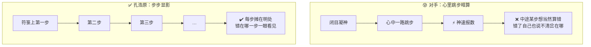
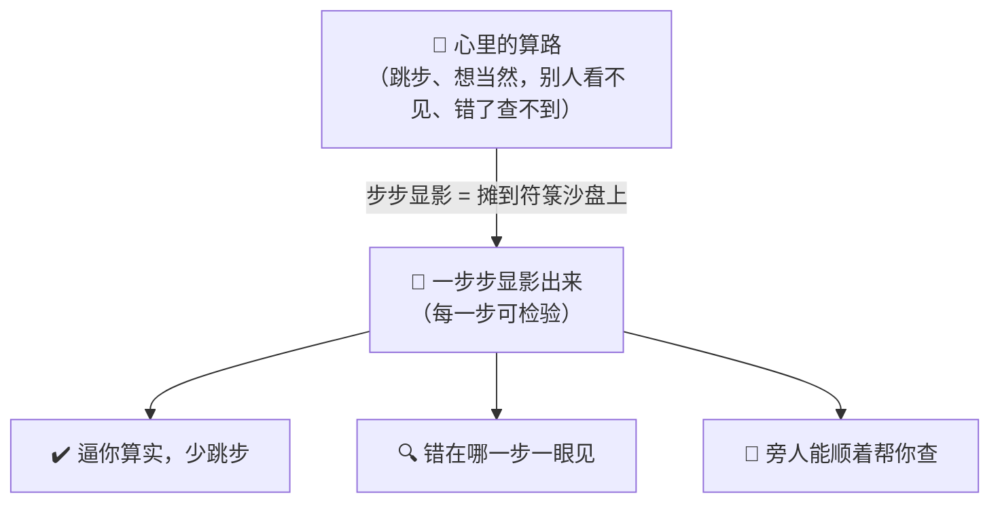
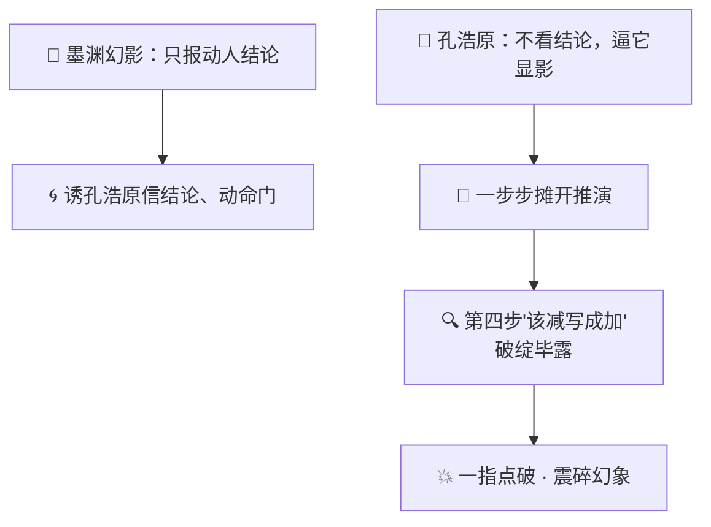

# 番外八 · 步步推演：显影心算

> 题记：算得快，未必算得对。真正的算道高手，不比谁一口气报出答案，而比谁把每一步都摊在明处——错，就错在看得见的地方；错在看得见的地方，才有得救。跳步暗算，看似神速，一步错，便满盘皆错，还错得无从查起。

正传里，孔浩原以"算道"名动一方。世人只当他是"算得快"——张口便报，分毫不差。可你有没有想过一个更实在的问题——

**同样是算，为什么有人算得飞快却一错到底、无从追查，有人算得看似笨拙却步步扎实、错也错得明明白白？**

这一篇番外，讲的正是孔浩原从"算得快"，到"算得**每一步都看得见**"之间，那道最容易被人看轻、却最要紧的门槛。

---

## 一、斗算之败

那年宗门斗法大会，算道一门排了一场"斗算"。孔浩原的对手，是外门一位素以"神算"著称的师兄——此人有个绝活，凡遇算题，闭目凝神，眉头一皱，片刻便张口报出答案，从不在符箓、沙盘上落半个字。众人啧啧称奇，都说他"心中自有乾坤，何须外物"。

第一题是道繁复的推衍：七处灵脉、各有进出，环环相扣，问三个时辰后总灵机几何。

那位师兄眼睛一闭，须臾睁眼，朗声报出一个数——快得如同脱口而出，满场喝彩。

轮到孔浩原。他却不急着报数，而是取出一叠符箓，铺开一方沙盘，提笔在符箓上一行行**显影**起来：

"第一步：东脉进七、出三，净进四。"
"第二步：南脉进五、出五，此消彼长，净零。"
"第三步：西脉承东脉之余，先算东脉，再叠西脉……"

他算得不快，一步一显影，符箓上密密麻麻，沙盘上灵光流转，每一步的来龙去脉，都明明白白摊在众人眼前。良久，他才在末尾落下最终一个数。

两个数，对不上。

主评的长老一时也难断谁对。正僵持间，孔浩原起身，指着对手方才口报的路数，请他"当众复算一遍"。

那位师兄面色微变——他**心里跳步暗算**，早已记不清中间每一环是怎么过的。他试着重走，走到第四步便卡住了：他把"南脉净零"那一环，在心里想当然地当成了"净进五"。**一步错，此后满盘皆错。**

而孔浩原的符箓上，那一步"南脉进五、出五，净零"清清楚楚写着——错在哪、对在哪，一目了然。

胜负立判。



散场时，那位师兄犹自不服，嘟囔道："我平日心算，十有八九是对的……"

孔浩原拱手，淡淡道："师兄算得快，我佩服。只是——**这'十有八九',错的那一二回，你可查得出错在哪一步？**"

对方一时语塞。

---

## 二、玄机子论"显影"

孔浩原虽胜，心里却存了个疙瘩：对手那份"神速",着实惊艳；自己这般一步步显影，慢是慢了，会不会终究落了下乘？他去请教玄机子。

玄机子听罢那场斗算，抚须大笑："好哇！你总算撞见了'算道'真正的门槛。世人都盯着'算得快',殊不知——**算道之要，从来不在算得快，在算得每一步都看得见、错得出来。**"

"你且说，"老人问，"一个账房先生，闷头噼里啪啦一顿算，末了报你一个总数；另一个账房先生，边拨算盘边把每一步念出声——你把家业托付给哪个？"

孔浩原不假思索："自然是念出声的那个。闷头算的，错了我一无所知；念出声的，哪一步不对，我当场就能接一句。"

"着啊！"玄机子一拍石桌，"你那对手，坏就坏在——**他把算道的功夫，全闷在了心里。** 闷在心里，快则快矣，可那是一座黑箱：对了，你不知是真会还是蒙的；错了，更不知错在哪一环，只能从头再蒙一遍。"

"而你把每一步'**显影**'在符箓、沙盘之上，"老人目光炯炯，"看似慢，实则做了两桩天大的好事——"

"其一，**显影，逼你算实。** 一步一步都要落在符箓上，你便不能在心里偷偷跳步、想当然。那一笔一画，逼着你把每一环都走扎实。写下来，本身就是想清楚。"

"其二，**显影，让错可查。** 一条算路摊在明处，错在第几步，一眼便见——你只须改那一步，前后皆不必推倒。可那闷头暗算的黑箱，错了便是满盘皆废，无从下手。"

孔浩原悚然一惊——他那日之所以能揪出对手的破绽，靠的不正是"每一步都摊在明处"这八个字么？

"原来如此，"他喃喃，"我一向自得于'算得快',却险些忘了——**快，是给旁人看的排场；每一步看得见、错得出来，才是算道的真身。**"

"正是。"玄机子颔首，"记住这三个字——**步步显影**。把心里的算路，一步一步显影出来，摊到明处。如此，你的算道才立得住、查得清、救得回。这，才是算道真正的奥义。"



---

## 三、心算不如显影

得了"步步显影"四字，孔浩原此后凡遇繁难算题，再不逞那一口气报数的能耐。

他炼出的傀儡老铁，最是憨直，起初总催他："公子，这题您心里早算出来了，何必费这符箓笔墨，一步步写得这般慢？"

孔浩原便让老铁亲眼见识一回。

他取来一道极刁钻的合灵阵推衍——进项、损耗、时辰折算，层层相叠，稍一疏忽便差之千里。他先"心算"报了个数，又"显影"重推一遍。显影到第五步，赫然发现：方才心算时，他把一处"三成损耗"在脑中想当然记成了"两成"——**若非显影，这一步之差，便要毁掉整座阵眼。**

老铁看得目瞪口呆："公子这般厉害的算道，心里也会……跳错步？"

"正因厉害，才更要显影。"孔浩原笑道，"**心算快，快在它敢跳步；可它一跳步，错了便藏在心里，谁也揪不出来。** 显影慢，慢在它一步都不许跳；可正因一步不跳、步步摊开，错才藏不住、才救得回。"

他指着符箓上那被揪出的一步，对老铁道："你看这'三成损耗',若我只报个总数给你，你照着去布阵，阵毁了，你我都不知岔在哪儿，只能从头再来。可如今这一步显影在此——错在哪、改哪一步，清清楚楚。**这一笔墨的慢，换的是满盘的稳。**"

苏挽晴恰在一旁，闻言接口："我从前也纳闷，孔师兄明明算得极快，斗算时却偏要一步步慢慢写。原来你不是不会心算——你是**存心把心算摊开给人看**。"

"正是。"孔浩原颔首，"斗的不是谁脑子转得快，斗的是——**谁的每一步，都经得起旁人指着问一句'这步凭什么'。**"

---

## 四、显影破幻

这份"步步显影"的功夫，后来竟在一场生死对决里，救了孔浩原一命。

那日他误入幻魔道墨渊布下的"乱心幻阵"。墨渊惯用的手段，是以幻象乱人心智——他化出一个"孔浩原"的幻影，算道、口吻、气象，无一不肖，当众推演一道关乎阵眼命门的大算，算得又快又顺，引得孔浩原几乎要信了那幻影的结论，依言去动那"命门"。

千钧一发之际，孔浩原想起玄机子那句"**算得每一步都看得见、错得出来**"。他强压心神，不去看那幻影报出的"结论",而是逼它——**把每一步显影出来。**

"你既算得这般笃定，"孔浩原沉声道，"便当众，一步一步，显影给我看。"

那幻影是墨渊凭"最像的结论"堆出来的，**根本经不起一步步的推敲**。它硬着头皮显影，前三步尚能糊弄，到第四步"灵机折算"那一环——为了凑出那个动人的结论，它把一处该"减"的，偷偷写成了"加"。

这一步，摊在明处，**破绽毕露。**

孔浩原眼中精光一闪，一指点在那一步上："第四步，此处该损而你言增——墨渊，你这幻象，跳步遮得了结论，遮不了这一步的推演！"

幻阵轰然一震。那"结论"再动人，也架不住这一步显影出来的破绽。孔浩原顺着这道裂口，一举震碎幻象，破阵而出。

墨渊在阵外冷笑收势，声音里却难掩一丝忌惮："……好个'步步显影'。我这幻术，能仿得出你的结论，仿不出你那一步一步、步步经得起查的算路。"



事后苏挽晴犹有余悸："那幻影几可乱真，你怎么就笃定它是假的？"

孔浩原望着幻阵消散处，缓缓道："我不是笃定它假。我只是不肯信一个'只报结论、不敢显影'的算道。**一个连每一步都不敢摊开给人看的答案，纵然动听，也不足信。** 真的算道，从不怕你一步一步地查——**怕查的，必有鬼。**"

---

## 五、慢即是快

破幻归来，孔浩原声名更盛。有后辈来问："大师，我心算极快，可总在紧要处莫名错一回，还查不出错在哪。这该如何是好？"

孔浩原不答反问："你算，是为了'显得快',还是为了'算得对、查得清'？"

后辈一愣。

"你若图'显得快',那便由它跳步暗算去——快是快了，可错的那一回，你永远不知栽在哪一步，只能一错再错。"孔浩原缓缓道，"你若为'算得对、查得清',那就记住四个字——**步步显影。**"

他伸手，掌心先化出一道算路的光影，密密麻麻、一步一环，纤毫毕现。

"**慢，是把每一步都摊在明处**——逼你算实，不敢跳步；错也错在看得见的地方，一改便对。"

"**这慢，其实是快**——你不必因一处暗错而满盘推倒重来，不必在黑箱里反复瞎蒙。一步显影的功夫，省下的是十步返工的冤枉。"

"拆得开每一步，是本事；让每一步都经得起查，才是真本事。"孔浩原目光深远，"莫要迷了那'一口气报数'的排场。真正的算道高手，或许算得不是最快的那个，却是**每一步都看得见、错得出来、救得回来**的那个。这，才叫'步步推演，显影心算'。"

后辈似有所悟，深深一揖。

孔浩原望向远山，轻声自语——

"心里跳一步，快得一时，也可能错得一世，还无从追查。可若你肯把每一步都显影出来、摊在明处……那你算的，便不再是一个'蒙来的答案',而是一条经得起千人指点的算路。"

山风浩荡，掌心的算路之光，一步一步，亮得清清楚楚。

---

## 📒 凡人笔记

这一篇番外，讲的是"AI 在给答案前，把中间的推理一步步写出来"。现在，把故事里的黑话，一件一件翻译回真实世界的 **AI 术语**——

| 故事里的东西 | 真实 AI 概念 | 一句话 |
| --- | --- | --- |
| 步步推演 / 显影心算 | **思维链（Chain-of-Thought, CoT）** | 让 AI 在给最终答案前，先把中间的推理、演算一步步写出来 |
| 把算路"显影"在符箓沙盘上 | **显式推理（把思考显式化）** | 写出来，是为了看得见；看得见，才管得住、错得出来 |
| 对手"闭目心算、只报结论" | **不写思维链 / 直接输出答案** | 跳步暗算，快是快，错了却是黑箱，无从查起 |
| 斗算里揪出对手第四步之错 | **思维链让错误"可检验、可定位"** | 推理摊成一条链，错在哪一步一眼见，只改那一步 |
| 心算把"三成损耗"记成"两成" | **跳步 / 想当然导致的推理错误** | 不显影就藏在心里，一步错、满盘错 |
| "只想、不动手"地一步步推演 | **思维链 vs ReAct 的区别** | 思维链只在脑中推理（闭卷心算）；ReAct 是"想 + 用工具做"交替（开卷动手） |
| 逼墨渊幻影"显影"而破幻 | **用"让它展示推理过程"来查验可靠性** | 一个只报结论、不敢摊开每一步的答案，纵然动听也不足信 |
| "慢即是快" | **多写中间步骤，换来少错、可查、少返工** | 一步显影的功夫，省下十步返工的冤枉 |

> 📖 想把这门"步步显影"的算道学扎实，去读概念入门篇——
>
> ① [什么是思维链](../02_CONCEPTS_概念入门/[CONCEPT-21] 什么是思维链-ChainOfThought.md) ｜ ② [什么是 ReAct](../02_CONCEPTS_概念入门/[CONCEPT-19] 什么是ReAct-智能体推理模式.md)

**说句实在的诚实话——**

你正在用的 Khy-OS，让 AI 干活时，走的也正是孔浩原这套"步步显影"。

它的项目章程里，第一条行为准则 **B1 就叫"先想再写"**——动手前先讲清"改什么、为什么、影响面"，不许闷头一顿操作就甩你个"搞定了"。这不就是"显影"么？还有 **B2"先列 plan、每步带 verify、没跑过验证不许说修好了"**——把大活拆成一步步、每一步都留下"凭什么算对了"的凭据，正是把思维链那份"每一步都看得见、错得出来"，写成了铁律。

正如孔浩原所说——**拆得开每一步是本事，让每一步都经得起查，才是真本事。** 从"信一个蒙来的答案",到"要一条经得起指点的算路",你现在既懂"算得对",也懂"错得出来"。这份"步步显影"的智慧，已在你脑中生根。

---

## 📝 读完自测

就着上面这张对照表，考一考自己——"把每一步摊在明处"到底强在哪？

```quiz
Q: 关于"步步推演（思维链 · Chain-of-Thought, CoT）"，下面哪些说法是对的？（多选）
- [x] 思维链 = 让 AI 在给最终答案前，先把中间的推理、演算一步步写出来
> 对。把算路"显影"出来——写出来才看得见，看得见才管得住、错得出来。
- [x] 思维链最大的好处是让错误"可检验、可定位"：推理摊成一条链，错在哪一步一眼见，只改那一步
> 对。斗算里能揪出对手第四步之错，正因为每步都摊开了。
- [x] "慢即是快"——多写中间步骤，换来少错、可查、少返工
> 对。一步显影的功夫，省下十步返工的冤枉。
- [ ] "闭目心算、只报结论"又快又可靠，是思维链推崇的做法
> 错。跳步暗算快是快，错了却是黑箱、无从查起；把"三成损耗"想成"两成"这类跳步错，一步错满盘错。
- [ ] 思维链和 ReAct 是一回事，都要一边推理一边动手用工具
> 错。思维链只在**脑中推理**（闭卷心算，不动手）；ReAct 是"想 + 用工具做"交替（开卷动手）。二者有别。
```

再用一张翻卡，把"显影"为什么值得那点慢记死：

```flip
🤔 直接报答案又快又省字，为什么算道高手偏要费劲把每一步推理都"显影"出来？（点一下翻到背面）
---
✅ 因为"**看得见，才管得住**"。只报结论（闭目心算）确实快，但它是个黑箱：错了你不知道错在哪、无从查起、只能整个推倒重来。把推理**一步步显影**成一条链，好处是错误"可检验、可定位"——哪一步算偏了一眼就见，只改那一步，别的照旧。所以"慢即是快"：一步显影的功夫，换来的是少错、可查、少返工。反过来，一个只敢报结论、不肯摊开每一步的答案，纵然动听也不足信（这也是"逼幻影显影而破幻"的道理）。一句话：**把思考摊在明处，是为了让错误无处躲藏。**
```

---

【👈 上一篇 · [番外七 · 万化调兵：分身有主](./番外07·万化调兵·分身有主.md)｜👉 下一篇 · [番外九 · 回照自省：闻过则改](./番外09·回照自省·闻过则改.md)｜🏠 回 [总目录](./00_INDEX_修仙学AI-总目录.md)】
