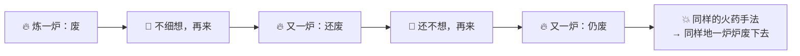
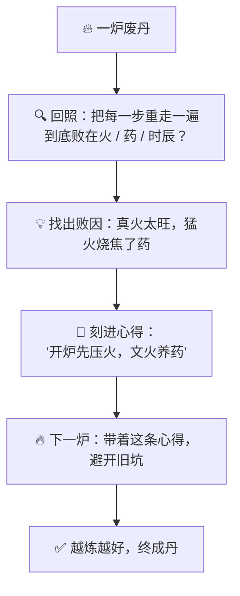
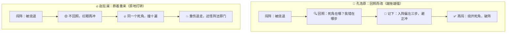

# 番外九 · 回照自省：闻过则改

> 题记：一战而胜，未必真强；一败而不悟，才是真弱。天下最难的功夫，不是打赢没打过的仗，而是打完一仗——无论胜败——都肯回过头，把每一步的得失，一条条刻进心里。莽夫在同一个坑里摔一百次，还怪坑太深；真修者在坑里摔一次，便记下这坑的模样，从此绕它而行。

正传里，孔浩原炼丹、斗法、闯秘境，胜过、也败过。可你有没有想过一个更要紧的问题——

**同样是败一场，为什么有人越败越强，有人却在同一个坑里摔到死？**

这一篇番外，讲的正是孔浩原从"只会莽着重来"，到"败后回照、闻过则改"之间，那道最不起眼、却最要命的坎。

---

## 一、一炉废丹

孔浩原初学炼丹时，也是个心高气傲的。

那年他闭关炼一炉"凝元丹"，火候、药材、时辰，样样都按丹方来，自觉万无一失。可开炉一看——一炉丹药，尽成焦黑废渣，满室苦烟。

孔浩原眉头一皱，也不细想，把炉子一刷，药材一填，火一点："再来！"

第二炉，还是废的。

他脸色一沉，又是一刷、一填、一点："再来！"

第三炉、第四炉……**同样的火、同样的药、同样的手法，也就同样地，一炉接一炉地废下去。** 药材耗了大半，孔浩原却梗着脖子，只当是运气不好、火神不佑，越炼越急，越急越废。

苏挽晴推门进来时，正见他满脸黑灰、又要点第七炉，忍不住喊停："孔师兄！你这第七炉，和头一炉，有半分不一样吗？"

孔浩原一愣："都一样啊，我一丝没改。"

"那你凭什么，指望第七炉的结果，会和头六炉不一样？"苏挽晴叹气，"你这不叫炼丹，这叫……在同一个坑里，摔第七回。"

孔浩原被这一句问住了，怔怔地看着那一炉焦黑，第一次觉得——**光是"再来一次",好像哪里不对。**



---

## 二、玄机子论"回照"

孔浩原提着那一炉废丹，去向玄机子请教。

玄机子拈起一粒焦黑的废丹，看了看，不答反问："你炼废了六炉，可曾回过头，好好看过这废丹一眼？"

孔浩原摇头："看它作甚？废了就是废了，我重炼便是。"

"错就错在这里。"玄机子放下废丹，"你只顾着'重炼',却从没'回照'。**你摔了六跤，却一次都没低头看看，脚下绊你的，到底是块什么样的石头。**"

"回照？"

"回照——**打完一仗，无论胜败，都回过头，把方才的每一步，重新在心里走一遍：哪一步走对了，哪一步走错了，这一炉，究竟是败在火上、药上，还是时辰上。**"老人捻须，"就像下完一盘棋的国手，从不撂子就走，必要把满盘重摆一遍，一手一手复盘，看清哪一着是妙手、哪一着是败招。也像那用功的学子，考砸了不是蒙头再考，而是把错题一道道翻出来，订正明白、抄进错题本——**记下'我这类题，总栽在哪'。**"

孔浩原若有所思："您是说……我该先弄明白，这丹到底为什么废，再去炼下一炉？"

"正是。"玄机子颔首，"你且回照方才那六炉——火,是不是一直偏旺？"

孔浩原悚然一惊，闭目细想——**果然！** 他的真火太盛，六炉都是一开炉便猛火猛攻，把药性活活烧焦了。这毛病，六炉一模一样，可他一次都没回头看，自然一次都没改。

"看见了吧。"玄机子叹道，"**败不可怕，可怕的是败而不知其所以败。** 知道败在'火太旺',下一炉压一压火，便是长进；不知道，纵炼他一百炉，也只是把同一个错，重复一百遍。"

老人一字一顿："**闻过则改，败中藏道。** 你听见了自己的过错，肯改，这一败就没白败——它反倒成了你炼丹路上最好的一味药引。"



---

## 三、败中藏道

得了"回照"二字，孔浩原重回丹房，却不急着点火了。

他先把那六炉废丹一字排开，一炉一炉地"回照"：这一炉焦在外、这一炉夹生在里、这一炉香气早散……他把每一炉的败象、连同自己当时的火候手法，一条一条，**刻进了一本随身的心得册子里**——那册子，他私下唤作"错炉本"。

"火太旺——开炉当先压三分火。"
"药下得急——须待炉温匀了再投主药。"
"时辰贪早——凝元须多养一炷香。"

一条条败因，一条条对策，写得清清楚楚。写罢，他才重新点火——**这一次，他每一步都对着那本'错炉本',专挑上回栽过的坑绕着走。**

火，压了三分；药，等炉温匀了才投；时辰，也多养了一炷香。

开炉那一刻，满室清香——**一炉圆润饱满的凝元丹，成了。**

苏挽晴凑过来看，又惊又喜："同样是炼这凝元丹，你头六炉炉炉是废渣，这一炉却成了。差别就在——你这回，是真的'回照'过了。"

孔浩原捧着那炉丹，感慨万千："上回我以为，炼不成就多炼几炉，总有一炉能成。这回才懂——**炼不成的时候，'多炼一炉'半点用没有，'看清上一炉为什么废'才是真章。** 我不是多炼了一炉，我是把前六炉的败，全炼进了这一炉的成里。"

"闻过则改，败中藏道。"他摩挲着那本"错炉本",轻声道，"原来这六炉废丹，没有一炉是白废的——它们全成了我这本册子上的道。"

---

## 四、莽者赵狂澜

也是这年，幻魔道的赵狂澜，与孔浩原争一处"离火秘境"的机缘。

那秘境有一道"回环火阵",阵法看似简单，却暗藏一处死角：直冲进去的，必被火反噬。孔浩原头一回闯，也被烧了个正着，狼狈退出。

可他退出后，没有立刻二次去闯。他寻了个背风处坐下，闭目**回照**方才那一闯：火从何处来？我在第几步中的招？那死角，到底藏在阵的哪一方位？——想明白了，他在地上画出火阵，标出那处死角，记下"入阵先偏左三步，避开正冲"，这才再闯。第二回，他绕开了死角，稳稳破阵而入。

赵狂澜却是另一副做派。

他头一回直冲被烧退，红了眼，二话不说，红着眼又是直冲——又被烧退。他更怒，第三回、第四回，招式路数分毫不改，只把那股蛮劲加得更足，**同一个死角，硬生生撞了十次，被那回环火烧得焦头烂额，浑身是伤，却还骂那火阵"欺人太甚"。**

墨渊在一旁看得直摇头，对老铁道："你看这两人。孔浩原一闯不成，便回头看清了那坑；赵狂澜一闯不成，只知红着眼再冲。同一处死角——一个绕了过去，一个撞了十遍。"

老铁咧嘴："我懂了！这不就跟俺打铁一个理儿嘛。火候不对，锤子再重、抡得再狠，也是废铁一块——你得先停下,瞅瞅这铁为啥不服帖，是火轻了还是水急了。埋头猛砸的，砸一辈子也是个莽汉；肯停下回照的，才成得了大匠。"

赵狂澜终究没能破阵，反倒重伤退走，临了还嘴硬："不过是这火阵邪门！"墨渊在他背后淡淡一句："火阵没变过，变的是——**有人肯回头，有人不肯。**"



---

## 五、明镜台前

离火秘境一役后，孔浩原声名更盛。有后辈来问："大师，我也总打败仗、炼废丹，可我明明每次都'再来一次'了，为什么还是不见长进？"

孔浩原不答反问："你'再来'之前，可先'回照'过？"

后辈一愣："回照……是什么？"

"你只学了'再来',没学'回照'。"孔浩原引他到一方水潭边，潭面平静如镜，"你看这水——它映出你的模样，你脸上有灰，它便照出那灰。你若不看它、扭头就走，脸上的灰便一路跟着你。你若肯对着它照一照、把灰擦了，才走得干净。"

"回照，就是这面镜子。**每做完一件事——无论成败——都对着它照一照：我这一回，脸上沾了什么灰？错在哪一步？下一回，怎么把这灰擦了、绕开这坑？** 照见了，记下了，改了，你的下一回，才真的比这一回强。"

"可要是……照见了自己的错，会不会太难堪？"后辈迟疑。

"难堪的是照镜子，还是脸上带着灰走一辈子？"孔浩原笑道，"**闻过则改，不是自轻自贱，是对着镜子把灰擦了。** 一个肯照镜子、肯擦灰的人，走得越来越干净；一个扭头不照的人，灰只会越积越厚。赵狂澜那样的莽夫，不是败在火阵，是败在——他这辈子，就没肯对着镜子照过一回。"

他望向潭中自己的倒影，缓缓道："**莫要迷了那'再来一次'的猛劲。真正的强，不在你摔了多少次还肯爬起来，而在你每爬起来一次，脚下都比上一次，少一块绊你的石头。**"

"胜了，回照，是为把这一手妙棋记牢；败了，回照，是为把这一个坑绕开。**胜败都能照见道——这，才叫'回照自省，闻过则改'。**"

后辈似有所悟，对着那潭水，久久照了下去。

山风拂过，潭面微皱，又归于平静，映着少年低头自省的影子。

---

## 📒 凡人笔记

这一篇番外，讲的是"AI 如何回头审视自己、找出败因、据此越做越好"。现在，把故事里的黑话，一件一件翻译回真实世界的 **AI 术语**——

| 故事里的东西 | 真实 AI 概念 | 一句话 |
| --- | --- | --- |
| 回照自省 / 闻过则改 | **反思（Reflection / Reflexion）** | AI 做完一次后回头审自己、找出得失、据此改进的闭环 |
| 打完一仗就回头复盘 | **复盘 / 自我批评** | 不做完就了结，而是回审"哪步好、哪步坏、错在哪" |
| 找出"火太旺"这个败因 | **定位失败原因** | 反思的核心：先想清楚"上次到底为什么没做好" |
| 那本"错炉本" | **写下教训 / 错题本** | 把败因和对策沉淀下来，下次遇同类活主动绕开老坑 |
| 带着"错炉本"再炼一炉 | **反思 + 重试的闭环** | 试→审→记教训→带着教训再试，越做越好（而非无脑重来） |
| 赵狂澜同一死角撞十遍 | **无脑重试（不反思的 retry）** | 光重来、不复盘，是同一个坑摔十次，原地打转 |
| 玄机子"够了，压三分火就成" | **反思要"够好就停"** | 反思有成本、有边际递减，改到位就收手，不是转得越多越好 |
| 潭面明镜、对镜擦灰 | **自我批评不是自我否定** | 反思是照镜子把灰擦了，是具体可落地的改进，不是自轻自贱 |

> 📖 想把这门"回照自省"的本事学扎实，去读概念入门篇——
>
> ① [什么是反思](../02_CONCEPTS_概念入门/[CONCEPT-22] 什么是反思-Reflection.md) ｜ ② [什么是 ReAct](../02_CONCEPTS_概念入门/[CONCEPT-19] 什么是ReAct-智能体推理模式.md)

**说句实在的诚实话——**

你正在用的 Khy-OS，干活的骨子里，走的也正是孔浩原这套"回照自省"。

你交给它一个目标，它不会"炼一炉就拍胸脯说成了"。它做完一版，先**跑验证**（语法、测试、各种守卫）看红绿灯——这就是"回照"；一旦亮了红灯，它不会甩手不管、也不会莽着从头瞎试，而是**在这一轮里查出错在哪、修好、再验一遍**，正如孔浩原对着"错炉本"专挑旧坑绕着走。它还有一条最硬的规矩——**验证没过，绝不说"修好了"**，绝不学赵狂澜那样嘴硬。干完之后，它更会把"这次踩了什么坑、下次怎么防"写进记忆文件，那就是 AI 版的"错炉本"。

正如孔浩原所说——**莽着重来是本能，回照自省才是本事。** 从"炼废一炉就多炼一炉"，到"看清上一炉为什么废、把败炼进下一炉的成"，你现在明白了：一个靠得住的 AI，多的正是这道"闻过则改"的功夫。

---

## 📝 读完自测

就着上面这张对照表，考一考自己——"打完一仗回头复盘"这门功夫，你参透了吗？

```quiz
Q: 关于"回照自省（反思 · Reflection / Reflexion）"，下面哪些说法是对的？（多选）
- [x] 反思 = AI 做完一次后回头审自己、找出得失、据此改进的闭环
> 对。不做完就了结，而是回审"哪步好、哪步坏、错在哪"（复盘/自我批评）。
- [x] 反思的核心是先"定位失败原因"（找出"火太旺"这个败因），再写进"错炉本"当教训
> 对。把败因和对策沉淀下来，下次遇同类活主动绕开老坑。
- [x] 反思要"够好就停"——它有成本、有边际递减，改到位就收手，不是转得越多越好
> 对。玄机子"够了，压三分火就成"正是此意。
- [ ] 反思就是无脑重来一遍，反复重试总能变好
> 错。那是"无脑重试（不复盘的 retry）"——赵狂澜同一死角撞十遍，原地打转。反思是"试→审→记教训→带着教训再试"的闭环，越做越好。
- [ ] 反思就是自我否定、自轻自贱，把自己骂一顿
> 错。自我批评不是自我否定——反思是"对镜擦灰"，是具体可落地的改进，不是贬低自己。
```

再用一张翻卡，把"反思"和"无脑重来"这对最容易混的行为分清：

```flip
🤔 同样是"再试一次"，为什么有人越试越强、有人却在同一个坑里摔十遍？差在哪一步？（点一下翻到背面）
---
✅ 差在中间那步"**审 + 记教训**"。无脑重试（不反思的 retry）是：失败 → 直接重来 → 又失败 → 又重来……同一个坑摔十次，原地打转，还怪坑太深。反思闭环是：失败 → **回头审**"这次到底为什么没做好"（定位败因，比如"火太旺"）→ 把败因和对策**写进错炉本**（教训）→ 带着这份教训**再试**。于是每一次重试都不是从零开始，而是绕开了上次的坑。但也别过度——反思有成本、有边际递减，"够好就停"。一句话：**重来不长本事，复盘才长；试→审→记→再试，才是越做越强的闭环。**
```

---

【👈 上一篇 · [番外八 · 步步推演：显影心算](./番外08·步步推演·显影心算.md)｜👉 下一篇 · [番外十 · 先谋后动：分段克敌](./番外10·先谋后动·分段克敌.md)｜🏠 回 [总目录](./00_INDEX_修仙学AI-总目录.md)】
