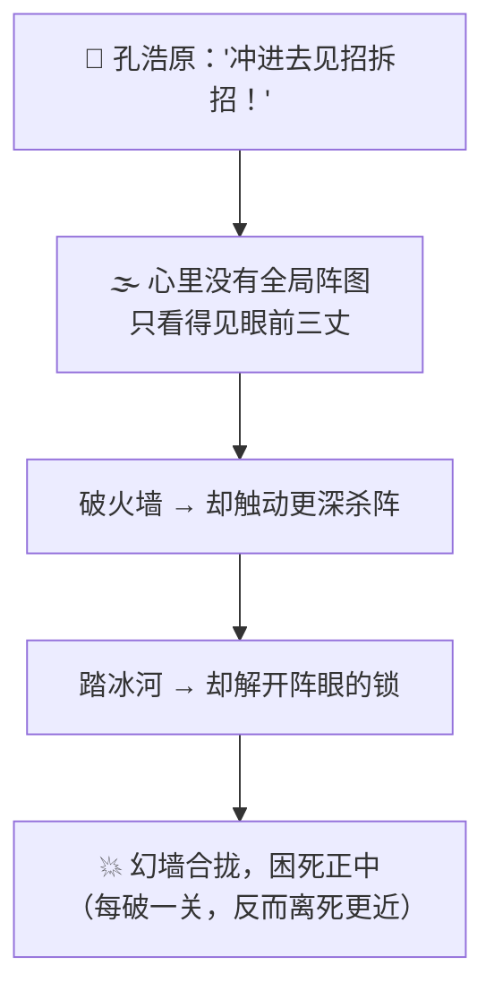
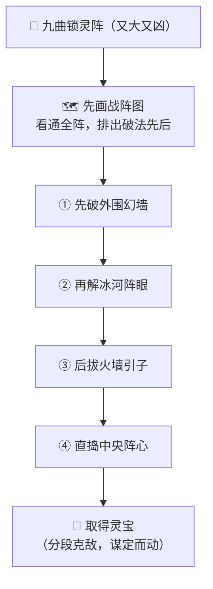

# 番外十 · 先谋后动：分段克敌

> 题记：莽夫见阵便冲，冲进去才发现处处是坑，退无可退，困死当场。真正的高手，临阵先不动手——他先在心里把整座凶阵拆开、画成一张"该先破哪一环、再破哪一环"的战阵图，一段一段地啃。遇变则临阵改图。谋定而后动，动则势如破竹。图在心中，脚下才不慌。

正传里，孔浩原一身通天修为，斩妖除魔，罕逢敌手。可你有没有想过一个更实际的问题——

**面对一座又大又凶、机关重重的法阵，本事再高，若一头莽进去，会怎样？**

这一篇番外，讲的正是孔浩原从"仗着本事高、见阵就冲"，到"临阵先画战阵图、分段克敌"之间，那道用命换来的教训。

---

## 一、莽进凶阵

灵机大陆西境，有一座"九曲锁灵阵",凶名赫赫。传闻阵中藏着一件上古灵宝，可百年来，闯阵者十有九死——那些人无一不是艺高胆大之辈，却全折在了里头。

孔浩原初闻此阵，并未放在心上。他自忖修为通天，一座死阵而已，闯进去一路平推便是。同行的老铁劝他："孔兄，这阵邪门得很，进去的高手比你狂的多了去了，没一个囫囵出来的。要不……咱先探探底？"

孔浩原大手一挥："探什么底？兵贵神速，冲进去见招拆招便是！"说罢，身形一晃，径直莽了进去。

结果——**险些没能出来。**

他一进阵，只顾着眼前：前方一道火墙，他一掌拍灭；刚灭火墙，脚下冰河又起，他运功踏冰而过；才过冰河，头顶落石如雨，他挥袖震开……**他走一步、破一关，全凭眼前所见随机应对，心里却半点"整座阵长什么样"的谱都没有。**

于是他越破越乱：破了火墙，才发现那火墙原是"引子",一灭它，反而触动了更深处的杀阵；他踏冰而过，却不知那冰河正是阵眼的"锁",一过它，四面幻墙轰然合拢，把他困在了正中。**每破一关，非但没近灵宝，反而离死更近一步**——因为他破的顺序，全错了。

幻墙之内，杀机四伏，孔浩原第一次感到了寒意。他运足目力，也只看得见眼前三丈，**根本不知道自己身在阵中何处、下一步该往哪走、这阵到底还有几重**。他像一个摸黑闯进迷宫、还一路乱砸墙的人——砸塌的每一堵墙，都可能是撑着屋顶的那一根。

千钧一发，是墨渊恰好在阵外接应，以秘法开了一道缝，才把他险险捞了出来。

孔浩原跌坐在地，衣袍尽碎，面如死灰，半晌才吐出一句："我修为再高……进去却成了个瞎子。见一关破一关，破到最后，把自己破进了绝地。"

老铁后怕不已："我早说这阵邪门。你这哪是闯阵，你这是……闭着眼睛往刀山上撞啊。"



---

## 二、玄机子论"战阵图"

孔浩原养伤月余，心有余悸，便去向玄机子请教这"闯阵"之道。

玄机子听完那场莽进之险，非但不惊，反而抚须而笑："好哇！你总算撞见了'本事高'的死角。世人都以为，修为够高，便可横冲直撞——殊不知，**再高的本事，若没了'章法'，一头扎进乱局里，也只是个力气大些的瞎子。**"

"你且说，"老人问，"一位真正的大将，攻一座天险坚城，是提着刀第一个冲上去撞城门么？"

孔浩原摇头："自然不是。将若只顾自己往前冲，纵有万夫之勇，也只是一员莽将，破不了坚城。"

"那大将靠什么破城？"

孔浩原若有所悟："靠……**先谋后动**。他必先把整座城看个通透，定下一份完整的方略——**先取哪座箭楼、再断哪条粮道、最后从哪个缺口合围**，一段一段来，谋定于动手之前。"

"着啊！"玄机子一拍石桌，"你闯那九曲锁灵阵，坏就坏在——**你只当了'冲阵的兵',没当'破阵的帅'。** 你仗着本事高，见一关破一关，脚下却没有一张'整座阵该怎么破'的图。那阵的凶险，恰恰就设在'破的顺序'上——你顺序破错了，本事越高，塌得越狠。"

"那……该怎么当这个'帅'？"

玄机子伸出手，在石桌上缓缓画出一座阵图的轮廓，一字一顿："**先画图，再动手；分段破，遇变改。**"

"**先画图**——莫要一进去就打。先站住脚，把整座阵从头到尾看通透，在心里画出一张'战阵图':这阵分几重、各重是什么、哪一环是根、哪一环是引子，**该先破哪、再破哪，排出个先后来**。"

"**分段破**——照着这张图，一段一段地啃。破完这一环，抬头看一眼图，就知道自己走到哪了、下一环在哪、离阵心还有几重。心里有图，脚下自然不慌。"

"**遇变改**——最要紧的一环：图是你'动手前'画的，未必全对。真打起来，若发现某一环和你画的不一样、或冒出图上没有的变数——**莫要硬照旧图撞下去，停一停，就着眼前的新局，把图改一版，再接着破。**"

孔浩原悚然一惊——他那次险些丧命，正是栽在这"先画图"三字上。他心里根本没有阵图，只凭眼前乱破，破错了顺序犹不自知。

"若我进阵前，先画好一张战阵图，"孔浩原喃喃，"照着图分段破，破错了再改图……那这九曲锁灵阵，也未必闯不得。"

"正是。"玄机子颔首，"**谋定而后动。图，替你在动手前把整座凶阵走了一遍；分段，让你无论破到哪一环，都清楚自己身在何处；改图，让你既有章法、又不至于被一张死图困死。** 这，才是破阵真正的兵法——不是本事高就横冲，是**先谋、后动、分段、能改**。"



---

## 三、临阵改图

得了"先画图、分段破、遇变改"的兵法，孔浩原伤愈之后，重赴西境，再闯九曲锁灵阵。

这一次，他没有一进阵就抡拳乱打。他先在阵外的高坡上，凝神静观了整整三日，把这座阵的**大致轮廓**先摸了个七八分，又请精于阵法的苏挽晴在一旁参详，两人合力，在心里**画出了一张战阵图**：

- 这阵共有四重：外围幻墙、中层冰河、内层火引、中央阵心；
- 那看着最唬人的火墙，其实是个"引子",绝不能先碰——**得留到第三步**；
- 真正的锁，是中层的冰河阵眼——**得先破了外围幻墙，才能安然近到冰河边**。

**先破哪、再破哪，一环扣一环，排得清清楚楚。** 孔浩原心里揣着这张图，才一步踏进阵中。

他照着战阵图，**一段一段地破**：先按第一步，稳稳破了外围幻墙——这一回，他没像上次那样乱砸，而是抬头对了对心中的图，确认脚下正是"第一环"，才动的手。破完抬头再看图：好，该走第二环了。

可就在他依图去解冰河阵眼时——**变数来了。** 那冰河阵眼之下，竟还暗藏着一道图上没有的"回魂锁",一碰便要反噬。这要在从前，孔浩原多半又要莽着硬解，重蹈覆辙。

但这一次，他**停住了手。**

"图上没有这道回魂锁。"他沉声道，"硬解必出事。改图——先不碰阵眼，绕去把这道暗锁的锁根找出来、断了它，再回头解阵眼。"

他就着眼前的新局，**当场把战阵图改了一版**：在"解冰河阵眼"之前，硬生生插进了一段"先断回魂暗锁"。改罢，才依着新图，从容破了下去。

苏挽晴在阵外接应，见他这一回进退有据、遇变不乱，心下大为叹服。待孔浩原捧着那件上古灵宝、安然走出阵来，她才由衷道："同样一座九曲锁灵阵，上回你是闭眼撞刀山，这回你是照图分段克。差别就在——你这回，是先谋、后动、还能临阵改图。"

孔浩原望着手中灵宝，缓缓道："上回我以为，闯阵靠的是本事高、胆子大。这回才懂——**本事再高，也怕一头扎进没有图的乱局。先在心里画好一张图，再一段一段地破，遇了变数就改图……**"

"**谋定而后动，动则分段克敌。这十个字，才是破尽天下凶阵的真兵法。**"

远处，那座困死过无数狂徒的九曲锁灵阵，第一次，被人有条不紊地走通了。

---

## 📒 凡人笔记

这一篇番外，讲的是"面对又大又凶的任务，AI 如何先谋后动、分段推进"。现在，把故事里的黑话，一件一件翻译回真实世界的 **AI 术语**——

| 故事里的东西 | 真实 AI 概念 | 一句话 |
| --- | --- | --- |
| 先谋后动 / 分段克敌 | **计划与执行（Plan-and-Execute）** | 面对大任务，先定一份总计划、拆成有序小步，再一步步执行 |
| 进阵前先画的"战阵图" | **总计划（Plan）** | 动手前把整件大事拆成"先破哪、再破哪"的有序步骤 |
| 照图一段一段地破 | **分段推进 / 逐步执行（Execute）** | 照着计划，一步一步落地，随时知道自己走到哪一环 |
| 临阵改图（碰上回魂暗锁） | **重新规划（Re-plan）** | 执行中冒出计划外的变数，就改一版新计划再继续 |
| 心里没图、见一关破一关 | **走一步看一步（与 ReAct 对照）** | 没有全局蓝图、只顾眼前，步骤一多就容易破错顺序、困死自己 |
| 破错顺序反而离死更近 | **步骤有先后，顺序错了就返工/翻车** | 大任务里步骤常有依赖，先后排错，本事再高也白搭 |
| 玄机子"谋定而后动" | **先规划、再执行的全局章法** | 先在动手前把整件事想通，再落地，才既有章法又不迷路 |
| 先画图 + 每破一环对一次图 | **先列 plan、每步带 verify** | 有蓝图指方向，每走一步都核对确认，才敢往下走 |

> 📖 想把这门"先谋后动、分段克敌"的本事学扎实，去读概念入门篇——
>
> ① [什么是计划与执行](../02_CONCEPTS_概念入门/[CONCEPT-23] 什么是计划与执行-PlanAndExecute.md) ｜ ② [什么是 ReAct](../02_CONCEPTS_概念入门/[CONCEPT-19] 什么是ReAct-智能体推理模式.md)

**说句实在的诚实话——**

你正在用的 Khy-OS，面对又大又凶的活时，走的也正是孔浩原这套"先谋后动、分段克敌"。

当你交给它一个一头莽进去准出事的大任务——比如"给这个模块加个新功能，还不许弄坏现有的东西"——它作为一个成熟的运行骨架，不会像初时的孔浩原那样见招拆招地乱冲。它会先把整件事想通、**画一张"战阵图"**（先列一份 plan：改什么、为什么、影响哪几处），再**照图分段推进**（一步步执行），而且**每破一环都对一次图**（每步带 verify，验过了才走下一步）；一旦某一步冒出计划外的变数、验证亮了红灯，它就像孔浩原碰上那道回魂暗锁一样——**停下来、临阵改图、重新规划**，再接着往下破。

这，就是本文讲的计划与执行。它让 Khy-OS 面对再大再险的活，也能进退有据、不慌不乱。正如孔浩原所悟——**本事再高，也怕一头扎进没有图的乱局；先画好图、分段去破、遇变能改，才是破尽凶阵的真兵法。** 从"见招拆招地莽冲"，到"谋定而后动地分段克敌"，你现在既懂每一步怎么破，也懂整张图怎么排。

---

## 📝 读完自测

就着上面这张对照表，考一考自己——"先谋后动、分段克敌"的章法，你握住了吗？

```quiz
Q: 关于"先谋后动（计划与执行 · Plan-and-Execute）"，下面哪些说法是对的？（多选）
- [x] 面对大任务，先定一份总计划（战阵图）、拆成有序小步，再一步步执行
> 对。动手前把整件大事拆成"先破哪、再破哪"的有序步骤，照图一段一段地破。
- [x] 执行中冒出计划外的变数（碰上回魂暗锁），就改一版新计划再继续——这叫重新规划（Re-plan）
> 对。谋定而后动，但不是一图定死；遇变则临阵改图。
- [x] "先画图 + 每破一环对一次图"= 先列 plan、每步带 verify
> 对。有蓝图指方向，每走一步都核对确认，才敢往下走。
- [ ] 心里没图、见一关破一关（走一步看一步）在大任务里最灵活高效
> 错。大任务里步骤常有依赖，没全局蓝图只顾眼前，步骤一多就容易破错顺序、困死自己。
- [ ] 只要每一步都拼命做，顺序无所谓，反正都要做完
> 错。破错顺序反而离死更近——步骤有先后依赖，先后排错，本事再高也白搭/返工。
```

再用一张翻卡，把"先谋后动"和上一门"走一步看一步"的分界记死：

```flip
🤔 都是"一步步推进"，"先谋后动（Plan-and-Execute）"和 ReAct 那种"走一步看一步"到底差在哪？（点一下翻到背面）
---
✅ 差在**有没有一张全局蓝图**。ReAct（走一步看一步）是"想一步、做一步、看一眼、再想下一步"——走到哪算哪，靠即时反馈灵活应变，适合路况不明、边走边探的活。先谋后动（Plan-and-Execute）是**动手前先把整件大事拆成一张有序的战阵图**（先破哪环、再破哪环），然后照图分段执行，随时知道自己走到第几环；遇到计划外的变数就"临阵改图"（Re-plan）再继续。它治的病是"心里没图、见一关破一关"——大任务里步骤常有先后依赖，没蓝图就容易破错顺序、困死自己。一句话：**ReAct 边走边看路，Plan-and-Execute 先画好路再走、走岔了再改图；任务越大、依赖越多，越需要那张图。**
```

---

【👈 上一篇 · [番外九 · 回照自省：闻过则改](./番外09·回照自省·闻过则改.md)｜👉 下一篇 · [番外十一 · 万途并参：择优而行](./番外11·万途并参·择优而行.md)｜🏠 回 [总目录](./00_INDEX_修仙学AI-总目录.md)】
