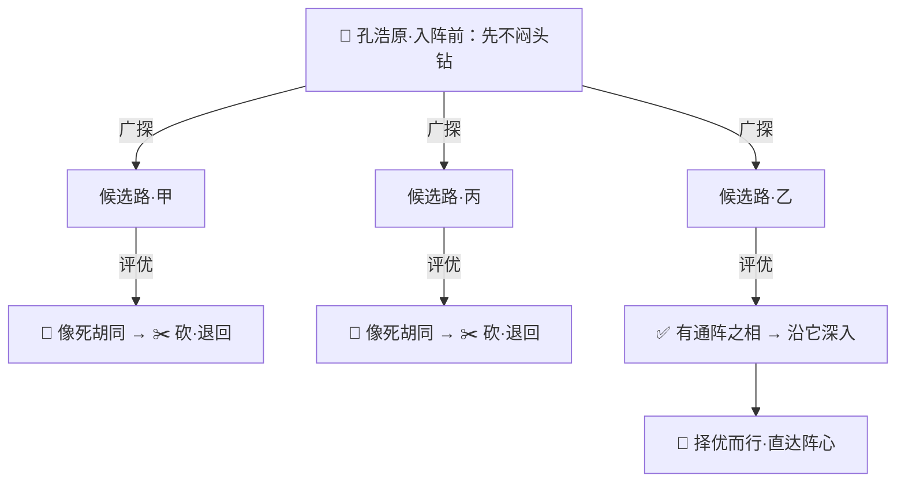
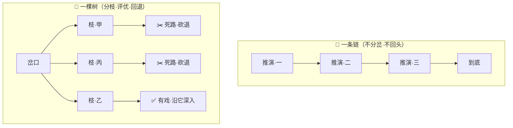

# 番外十一 · 万途并参：择优而行

> 题记：一条道走到黑者，撞了南墙也不回头，纵有天资，也困死在自己选错的第一步。真正的通关之法，不比谁走得快，而比谁——在岔路口敢分头去探，撞了壁敢退回来，试遍百途，才挑那条真能走通的路。歧路亡羊，唯参百途者得其真。

正传里，孔浩原修为渐深，遇到的难关也一道比一道刁钻。可你有没有想过一个问题——

**当一道难关，明明只有一个正解，岔路却多如牛毛，闷头钻一条，八成钻进死胡同。这时候，是该一条道走到黑，还是……该有别的走法？**

这一篇番外，讲的正是孔浩原从"认准一条路就闷头走到底"，到"敢分头探、敢回头、择优而行"之间，那道最容易困死人的坎。

---

## 一、迷阵困龙

那年，孔浩原为求一味"回春古丹"的残方，闯入了幻魔道遗留的"万途迷阵"。

这迷阵邪门得很。阵中岔路千百，条条看着都像正途，可真正能通往阵心的，**只有一条**。走错一步，越走越偏，最后困死阵中，连尸骨都化作阵眼的养料。

孔浩原起初不以为意。他自恃算道精深，认准眼前一条最"顺眼"的路，便一头扎了进去，心想：**只要我一步一步、稳稳当当地推演到底，还怕走不通？**

他走得极稳，每一步都算得清清楚楚，一步扣一步，宛如一条笔直的链子，从入口一直铺向深处。

可他忘了——**路选错了，走得再稳，也是稳稳地走向死胡同。**

三日后，他一头撞上了阵壁。那是一堵幻魔道的绝壁，前无去路。孔浩原回头想退，却发现来时那条"稳稳当当"的路，早已在身后层层合拢——**他一条道走到了黑，连回头的岔口都错过了。**

他这才惊觉：从踏进阵子的第一步起，方向就偏了。**只因他一路只顾着"把这一条路走稳",从没在任何一个岔口停下来问一句："这条，真的是对的那条吗？要不要退回去，换一条试试？"**

孔浩原被困阵中七日，灵力将尽，几乎要交代在这里。


---

## 二、玄机子论"参途"

危急之际，是玄机子循着一缕残存的神识，寻进迷阵，将孔浩原救了出来。

老人看着他狼狈的模样，非但不恼，反而叹了口气："你呀，栽的不是修为的跟头，是**心法**的跟头。"

"弟子……不明白。"孔浩原虚弱地问，"我明明每一步都走得极稳，为何还是困死？"

"错就错在'极稳'二字。"玄机子拈须道，"你把一条路走得再稳，那也只是**一条**路。这万途迷阵，考的从来不是'哪条路你走得稳',而是'**这千百条路里，你敢不敢一条条去试、试错了敢不敢退回来**'。"

他问孔浩原："你可见过高手对弈？落一子之前，他脑中在想什么？"

孔浩原怔了怔："想……对方会如何应，我又如何接。"

"不止。"玄机子摇头，"真正的国手，落子前脑中**同时铺开好几种走法**，一种一种在心里推演几步，看哪种占先、哪种落空，**把落空的那几种在心里就'砍'了，只挑最占先的一手，才真正落下去。** 他不是想一步走一步，是——**万途并参，择优而行。**"

"万途……并参？"

"正是。"玄机子伸出三根手指，一字一顿："**广探、评优、回退。**"

"**广探**——到了岔路口，别急着认准一条闷头钻。先把眼前几条像样的路，都在心里铺开、分头探一探。"

"**评优**——每探一条，就掂量掂量：这条像是通的，还是像死胡同？明摆着走不通的，**当场就在心里砍了，别再耗力气**。"

"**回退**——这是你最缺的一环！探进一条，走着走着发现是死胡同，就**果断退回上一个岔口，换一条还没试的再走**。退，不是认输，是把'此路不通'这四个字，探明白了。"

孔浩原悚然一惊——他困死阵中，正是栽在这个"回退"上。他一路只知向前，撞了壁才发现，自己**从来没给自己留过一条回头路**。

"若我早懂得，走几步觉得不对，就退回岔口换一条……"孔浩原喃喃，"纵有千百条路，我一条条试、试错就退，总能试出那条真的通的。"

"着啊！"玄机子抚掌，"**钻死一条，是莽夫；参遍百途、择优而行，才是通关的真法门。** 记住这九个字——**广探之，评优之，回退之。**"



---

## 三、万途并参

得了"广探、评优、回退"九字诀，孔浩原运转灵机，凝神再探万途迷阵。

这一次，他没有再认准一条"顺眼"的路就闷头钻。他立于入口的第一个岔口前，**心念一动，分出数道推演之枝**——每一道枝，替他去探一条不同的路，各走几步，探一探虚实。

- 一枝探"东南明径"：走了几步，前方灵气紊乱，隐有幻魔道的杀阵之相——**这条像死路**，孔浩原心念一收，果断把这条枝**砍了，退回岔口**。
- 一枝探"正北暗道"：走了几步，越走越窄，尽头竟是死壁——**又一条死胡同**，收枝，退回。
- 一枝探"西行斜路"：走了几步，前方灵气渐顺，隐隐有一线通往阵心的活络之意——**这条有戏！**

孔浩原不慌不忙，收拢那些探到死路的枝，只沿着"西行斜路"这条最有希望的，再往深里探。每到一个新的岔口，他便如法炮制：**分几枝并探，砍掉死路的，退回来，只沿最有希望的那条深入。**

墨渊恰在阵外接应，见孔浩原时而分出数道心念并探、时而果断收枝回退，看得咋舌："孔师兄这哪是闯阵，这是把千百条路，在心里一条条'参'了个遍，专挑那条能通的走啊。"

苏挽晴在旁轻声接道："上回他钻死一条，困了七日；这回他敢分头探、敢回头，反倒……你看，快到阵心了。"

果然，孔浩原一路广探、评优、回退，试遍歧途、择优而行，那条真正通往阵心的路，被他一寸寸"参"了出来。**当他终于立于阵心、取得那味回春古丹的残方时，不过用了一日。**

同样一座迷阵：上回闷头钻一条，困死七日几乎丧命；这回参遍百途、择优而行，一日通关。

孔浩原握着残方，长长舒了一口气，对身旁二人道："我从前总以为，'算道精深'就是把一条路算到最稳。今日才懂——**再稳的一条路，也怕是错的那一条。真正的算道，是敢把千百条路都摊开来参，试错了敢退、择好了敢行。**"

"钻牛角尖的，困死；参遍百途的，通关。"他望向阵心那点幽光，缓缓道，"**歧路亡羊，唯参百途者，得其真。**"

---

## 四、一链之直，一树之广

出阵之后，墨渊仍有不解，问道："孔师兄，你上回也是'一步步稳稳地推演',这回也是'一步步推演',差别究竟在哪？"

孔浩原拾起一根枯枝，在地上先画了一条直线："上回，我是这样——一条**链**，从头走到尾，不分岔，不回头。路对了，走得通；路错了，就困死。它的好处是稳、是快，可它只赌一条路。"

他又在直线旁，画了一棵枝桠纵横的树："这回，我是这样——一棵**树**。每到岔口就分几条枝，同时探；探到死路的枝，砍了、退回；只沿最有希望的枝深入。它慢些、费神些，可它——**不把命赌在一条路上。**"

"你看，"孔浩原点着那条直线，"这条链，其实就是这棵树'从不分岔、从不回头'时，缩成的一根枝。**一条链，是一棵树的特例；一棵树，是一条链加上了'分岔、评优、回退'。**"

"那……岂不是永远该用树？"墨渊问。

"非也。"孔浩原摇头，"路若笔直、没有岔口，一条链走到底最省事，何必费神摆开一棵树？**唯有这般岔路千百、闷头必死的难关，才值得动用'万途并参'的树。** 杀鸡，不必用宰牛的刀。"

他将那些"互不相干"的岔路与"有先有后"的关卡，也一并说与墨渊：**互不相干的几条路，尽可分枝并探，图个快；可若是'非得先探通了这一段、才谈得上探下一段'的，就只能一枝探通、再续下一枝，急不得。**



墨渊听得连连点头："一链之直，图快；一树之广，保对。难关越是岔多易错，越要那一树之广……原来通关，还有这般讲究。"

"讲究大了。"孔浩原笑道，"多少人一身修为，却困死在自己认准的第一条路上，就是不懂这'退一步、换一条'的分寸。"

---

## 五、参百途者，得其真

那味回春古丹的残方，后来救了老铁一命——老铁误服毒丹，命悬一线，正是靠这残方配出的解药，才挺了过来。

老铁病愈后，憨憨地来谢孔浩原，又挠着头问："孔师兄，我也常闯些丹方难关，可我这人一根筋，认准一个法子就往死里试，试不通就急得跳脚。你说我这毛病，咋治？"

孔浩原不答反问："你试一个法子不通时，是急着把它'再试一百遍',还是退回来'换个法子'？"

老铁一愣："自然是……不甘心，再试一百遍。"

"这就是你的结。"孔浩原缓缓道，"**一个法子试过三五遍还不通，多半是这法子本身错了，再试一百遍也是白费。这时候真正的本事，不是'把错法子试得更狠',是'退回来，换一个法子'。**"

他伸出手，掌心先幻出万千条交错的光路，如迷阵纵横；旋即一条条黯淡下去，只余一条最亮的，直通尽头。

"**广探百途**——一个法子行不通，就再想几个，一条条去参，别在一棵歪脖子树上吊死。"

"**评优回退**——试着不对，果断退回来换下一条。退，不丢人；困死在一条错路上，才丢人。"

"**择优而行**——参遍了、试透了，那条真能通的路自会显出来。到那时，认准它，一走到底。"

老铁似懂非懂，却把"试三五遍不通就退回来换一条"这句话，牢牢记在了心里。

孔浩原望向远处的万途迷阵，那阵此刻在暮色里静静盘桓，宛如一棵参天巨树的剪影。他轻声自语——

"一个人的路，从来不止一条。困住你的，往往不是没有路，是你认准了一条，就再不肯回头去看别的。**可只要你敢分头去探、敢撞了壁就退、敢试遍百途再择优而行……**"

"**那这世上，就再没有'只有一条路、还偏偏被你走错'的死局了。**"

山风起处，掌心那条最亮的光路，微微一颤，通向远方。

---

## 📒 凡人笔记

这一篇番外，讲的是"AI 面对难题，如何多路并探、择优而行"。现在，把故事里的黑话，一件一件翻译回真实世界的 **AI 术语**——

| 故事里的东西 | 真实 AI 概念 | 一句话 |
| --- | --- | --- |
| 万途并参 / 择优而行 | **思维树（Tree of Thoughts, ToT）** | 面对难题，同时展开多条候选思路、逐条评估、择优走完，而非一条道走到黑 |
| 岔口分出数道推演之枝 | **广撒思路 / 多候选分枝** | 在每个关口一口气想出好几种走法，同时探 |
| "像死胡同，当场砍了" | **评估剪枝（evaluate & prune）** | 给每条枝掂量好坏，明显走不通的当场砍掉，不再耗力气 |
| 撞死路就退回岔口换一条 | **回退（backtracking）** | 走进死胡同，退回上一个岔口换一条还没试的枝——能认错、能回头 |
| 上回"一条链稳稳走到底" | **思维链（CoT）：一条链走到底** | 从头想到尾、不分岔、不回头；一步错则步步错 |
| "一链之直 vs 一树之广" | **CoT 是特例，ToT = CoT + 分岔 + 评优 + 回退** | 链不分岔不回头时，就缩成树的一根枝 |
| 钻牛角尖、困死一条路 | **不回退地闷头单链 → 被错的第一步困死** | 只赌一条路、撞墙不回头，是思维树要治的病 |
| "并探"（互不相干）与"续探"（有先后） | **并行探索 与 有依赖的顺序探索** | 互不相干的枝并肩探图快；有先后的枝须排队保对 |
| 杀鸡不必用宰牛的刀 | **简单题用链、难题才用树** | 思维树费神费力，只有岔路多、易走错的难题才值得动用 |

> 📖 想把这门"多路并探、择优而行"的本事学扎实，去读概念入门篇——
>
> ① [什么是思维树](../02_CONCEPTS_概念入门/[CONCEPT-24] 什么是思维树-TreeOfThoughts.md) ｜ ② [什么是思维链](../02_CONCEPTS_概念入门/[CONCEPT-21] 什么是思维链-ChainOfThought.md)

**说句实在的诚实话——**

你正在用的 Khy-OS，面对岔路多、开头容易选错的难题时，走的也正是孔浩原这套"万途并参"。

当你交给它一道一头扎进去八成钻死的活——比如"这个 bug 有好几种可能的成因，帮我找出真正那个"——它不一定认准第一个猜想就闷头改到底。作为一个成熟的运行骨架，它可以像孔浩原那样：**广探**几种候选成因（配置错？空指针？并发问题？），逐条去**验、评优**，明显走不通的当场砍掉，某条验着发现是死路就**回退**换下一个——直到锁定真正的成因。互不相干的候选并肩探（图快），有先后的排队探（保对）。

这，就是本文讲的思维树。它让 Khy-OS 不容易被"一个错的第一猜想"带偏。而章程里 **"B2 目标驱动执行：验证通过才回报"** 的纪律，本质也是同一份"走不通就退回来换一条、直到探出真能通过的路"的智慧——**没验证通过，就不算数，就得换个法子再参。**

正如孔浩原所说——**歧路亡羊，唯参百途者，得其真。** 从"一条链闷头走到黑"，到"一棵树多路并探、走错能回头"，你现在既懂"想得直"，也懂"想得广、还能回头"。这套从思维链到思维树的进化地图，已在你脑中连成一片。

---

## 📝 读完自测

就着上面这张对照表，考一考自己——"分头去探、择优而行"这门思维树，你参透了吗？

```quiz
Q: 关于"万途并参（思维树 · Tree of Thoughts, ToT）"，下面哪些说法是对的？（多选）
- [x] 思维树 = 面对难题同时展开多条候选思路、逐条评估、择优走完，而非一条道走到黑
> 对。在每个关口一口气想出好几种走法（多候选分枝），同时探。
- [x] "像死胡同当场砍了"是评估剪枝；"撞死路退回岔口换一条"是回退（backtracking）
> 对。能给每条枝掂量好坏、砍掉走不通的，还能认错、回头换没试过的枝。
- [x] 思维链（CoT）其实是思维树的特例：链不分岔、不回头时，就缩成树的一根枝
> 对。ToT = CoT + 分岔 + 评优 + 回退；一链之直 vs 一树之广。
- [x] 简单题用链、难题才用树——思维树费神费力，只有岔路多、易走错的难题才值得动用
> 对。杀鸡不必用宰牛的刀。
- [ ] 思维树的精髓就是选定一条最像样的路，一口气走到底、绝不回头
> 错。那是"钻牛角尖、单链闷头走"——只赌一条路、撞墙不回头，会被错的第一步困死，正是思维树要治的病。
```

再用一张翻卡，把"思维链"和"思维树"这对亲戚的分界记死：

```flip
🤔 上一门"思维链（一条链走到底）"和这门"思维树（万途并参）"到底什么关系？是两套完全不同的东西吗？（点一下翻到背面）
---
✅ 不是两套，是"**特例与通式**"的关系。思维链（CoT）是从头想到尾、不分岔、不回头的**一根链**——好走、省力，但一步错则步步错，被第一步困死也没法回头。思维树（ToT）= **CoT + 分岔 + 评优 + 回退**：在关口一口气分出几条候选枝同时探，给每条掂量好坏（评估剪枝）、砍掉死胡同，撞了壁还能退回岔口换一条。当一棵树"不分岔、不回头"时，它就缩成了一根链——所以**链是树的特例**。代价是树费神费力，因此"简单题用链、难题才用树"（岔路多、易走错才值得动用）。一句话：**链走直路快，树探歧路稳；难题多歧路，才请得动树。**
```

---

【👈 上一篇 · [番外十 · 先谋后动：分段克敌](./番外10·先谋后动·分段克敌.md)｜👉 下一篇 · [番外十二 · 点化真身：因材塑形](./番外12·点化真身·因材塑形.md)｜🏠 回 [总目录](./00_INDEX_修仙学AI-总目录.md)】
