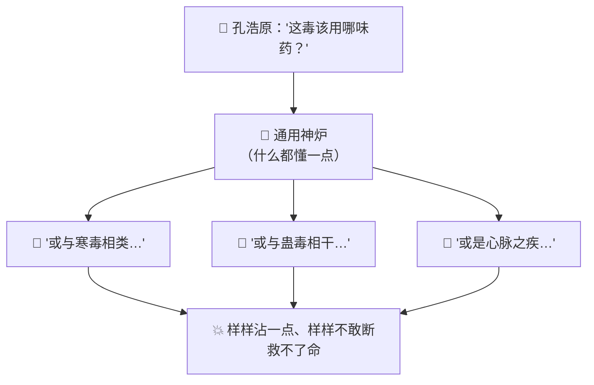
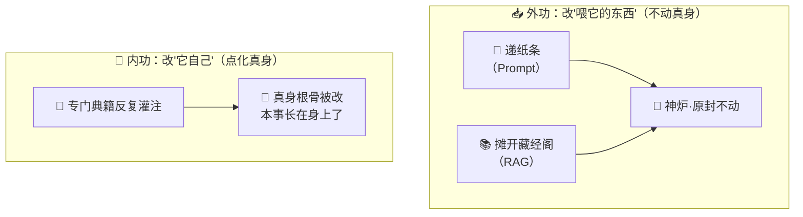
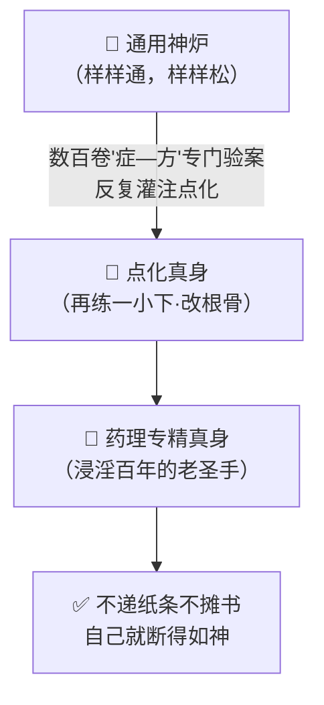
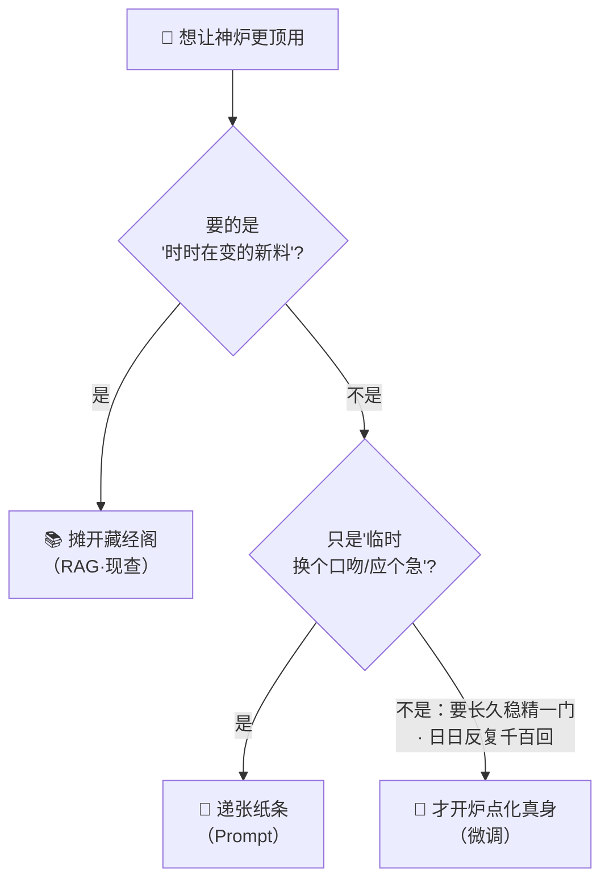

# 番外十二 · 点化真身：因材塑形

> 题记：给一具傀儡递一张纸条，教它做这一件事，是外功；把它带在身边翻遍藏经阁，让它现查现用，也是外功。可若你想让它**从骨子里就懂一门道**——那递多少纸条、翻多少经卷都不够。你得动它的真身，点化它的内里。外功是临时借来的，内功才是长在身上的。

正传里，孔浩原炼过一具"通用神炉"——一具什么都会一点的通才傀儡。你问它炼丹，它答得上；你问它布阵，它也说得出；你问它辨药、驭剑、观星，它样样都能搭上两句。可你若真把一桩要紧的活儿全交给它，它却样样稀松，没有一门拿得出手。

**样样通，样样松。** 这是通才傀儡的老毛病。

这一篇番外，讲的正是孔浩原如何把一具"什么都会一点"的通用神炉，**点化**成一门专精的真身——以及他在这条路上，分清了"外功"与"内功"的那道坎。

---

## 一、样样通，样样松

孔浩原初得这具通用神炉时，也曾欢喜过一阵。

那神炉是他集百家残卷、汇万道皮毛炼成的，肚子里装着天下各门各派的一点点皮毛。开口问它任何一道，它都能不慌不忙搭上几句——听着着实唬人。

可真到用时，全露了怯。

那年苏挽晴中了一种极偏门的"七蛊蚀心毒"，性命垂危。孔浩原把她的脉象、毒征一五一十报给通用神炉，命它辨毒开方。

神炉沉吟半晌，答得四平八稳：此毒或与寒毒相类，可试温补;又或与蛊毒相干，宜用驱虫之药;亦有可能是心脉之疾，当以养心为主……

**每一句都像那么回事，每一句又都不敢下断。** 通篇的"或许""大概""可试",没一个字敢拍板。

孔浩原额头冒汗："我问的是**这一味毒该用哪一味药**，你给我列了三门九派的可能，到底哪一个？！"

神炉答不上来。它读过药理的皮毛，也读过蛊术的皮毛，还读过心脉之学的皮毛——可这门"七蛊蚀心毒"是药、蛊、心脉三道交缠的偏门绝症，**样样沾一点、样样不精**的它，如何断得下来？

苏挽晴气若游丝，却还替它说话："孔师兄……别怪它……它什么都懂一点，只是……什么都不精罢了……"

孔浩原一把攥紧拳头："什么都懂一点，救不了你的命。我要的不是一个博览群书的杂家——我要的是一个**能把这一门药理断到骨子里**的专才！"



---

## 二、玄机子论"外功"与"内功"

孔浩原抱着那具断不了症的神炉，去见玄机子。

玄机子听罢，先不说话，反问他："你可曾试过——**在它耳边递一张纸条**，写上'你是专断药理的圣手,只管往药理上想'?"

孔浩原一愣："试过。它当时是像样了些，可那纸条一撤，它又变回三心二意的老样子。"

"那你可曾——**领它进藏经阁，把七蛊蚀心毒的相关典籍摊在它面前**，让它边翻边断？"

"也试过。有那几卷书摊着，它答得确实靠谱些。可书一合上、人一离了藏经阁，它照旧断不了。"

玄机子抚须而笑："你说的这两样——**耳边递纸条、藏经阁翻书**——都是好东西，可你要看清它们的**根**在哪。"

老人竖起一根手指："**递纸条**，是你临阵**塞给它一段话**，它借着这段话应个急。你不递，它就没有。这是**外功**——本事不在它身上，在你那张纸条上。"

又竖起一根："**翻藏经阁**，是你临阵**把书摆到它面前**，它照着书现查现答。你不摆，它就抓瞎。这也是**外功**——本事不在它身上，在那摞书上。"

孔浩原若有所思："这两样……都没动神炉本身分毫。纸条也好、书也好，都是我**临时喂给它的**，喂进去它就会，撤了它就忘。"

"着啊！"玄机子一拍石桌，"**外功者，临时借来的本事，长不到骨头里。** 你要它应个急、查份料，外功尽够用，还灵活。可你要它**从骨子里就精通一门**、撤了纸条、合了书也照样断得如神——外功就不够了。这时候，你得动它的——"

"——真身。"孔浩原接了下去，眼里精光一闪。

"正是。"玄机子颔首，声音沉了下来，"**点化真身。** 拿那门药理的专门典籍、把七蛊心脉的精要，反反复复**灌进它的内里**，一点一点，改动它真身的根骨。练成之后，这门本事就**长在它身上了**——不必再递纸条、不必再摊书，它自己就是那个专断药理的圣手。这，才叫**内功**。"

"外功改的是**你喂它的东西**，内功改的是**它自己**。"玄机子一字一顿，"这道理，你今日务必分清——多少炼器师，该递纸条的地方去点真身，白费了力气;又在真该点化真身的地方，只会一味递纸条，永远调不出一门专才。"



---

## 三、以典点化，脱胎换骨

得了"外功内功"之辨，孔浩原不再一味递纸条、摊书了。他要给这具通用神炉，实打实点化一门真身。

他先做的，不是急着动炉，而是——**攒典籍**。

他遍访药王谷、蛊虫窟、心脉宗，把三道交缠处的疑难验案，一桩一桩整理成"**症—方**"的范例：这样的脉象、这样的毒征，该下这样的药、用这样的量。他没贪多贪杂，只挑**最地道、最对路**的验案，攒了满满数百卷。

"你这是……要拿这些验案做什么？"苏挽晴（毒已暂缓，正在调养）虚弱地问。

"做**点化真身的引子**。"孔浩原一边码典籍一边道，"我不重炼一具新炉——那要耗尽半座灵山的元气，是开天辟地的大能才干的事。我只在这具现成的通才神炉上，拿这几百卷专门验案，**再点化它一小下**，把'专断药理'这一门，慢慢焊进它的真身。"

于是他起炉、布阵，将那数百卷"症—方"范例，化作一道道温养的灵光，**反反复复灌入神炉的真身**。不是推倒重来，只是在它原有的博学底子上，把这一门药理，一遍遍地磨、一层层地渗。神炉内里的根骨，随着一次次灌注，被悄然拧动、重塑。

"师兄，"苏挽晴看得心惊，"你这不是在教它，你这是在**改它的骨头**啊。"

"正是要改骨头。"孔浩原目光灼灼，"递纸条、摊书，改的都是它身外的东西，撤了就没。**唯有点化真身，把这门本事焊进它的骨里——从此不必我再递一个字、摊一卷书，它自己就是专断药理的圣手。**"

数日之后，点化功成。

孔浩原不递纸条、不摊典籍，只把苏挽晴那"七蛊蚀心毒"的脉象毒征，**原原本本、一字不加**地报给神炉。

这一次，神炉再无半分迟疑，斩钉截铁：

"**此毒药、蛊、心脉三道交缠，当以'离蛊散'为君、'养心汤'为佐，先驱蛊、再养心，七日可解。**"

一字不虚。孔浩原依方施治，七日之后，苏挽晴霍然而愈。

苏挽晴抚着渐渐回暖的心脉，怔怔望着那具神炉："同样是这具炉子……上回样样稀松、一句不敢断，这回却断得如同浸淫药理百年的老圣手。就因为你……**改了它的真身**。"

"上回它靠的是身外借来的皮毛，样样通、样样松。"孔浩原缓缓道，"这回，这门药理，是**长在它骨头里**的了。"



---

## 四、何时点化，何时只需外功

苏挽晴病愈之后，好奇追问："师兄，既然点化真身这般厉害，那往后不管什么活儿，你都给神炉点化一门真身，岂不最好？"

孔浩原却摇头，笑道："那你可就想岔了。点化真身，是**开炉动骨**的重活——要攒数百卷典籍、要耗大把元气、往后典籍一变还得**重新再点**。哪能事事都动它的骨头。"

他掰着指头，替她理这笔账：

"你要它应个**临时的急**——比如这一回换个口吻答话——**递张纸条**就成，何必开炉动骨?"

"你要它参详的是**时时在变的新料**——比如今日各坊市的药价、这个月新出的验方——那就**领它翻藏经阁**，让它现查现用。你今日辛辛苦苦把药价点进它真身，明日价一变，可就白点了。**会变的东西，摊开给它现查，别焊进骨头。**"

"唯有那种——**要它长长久久、稳稳当当精通一门**，且这门活儿要**日日反复地断上千百回**——纸条怎么递都不够稳、书怎么摊都不够快——**这，才值得开炉，点化真身。**"



苏挽晴听得连连点头："原来这般讲究……该递纸条的递纸条，该摊书的摊书，非到要它**从骨子里精一门**，才动它的真身。"

"正是。"孔浩原道，"会算这笔账的，才是真炼器师。多少人不分青红皂白，动辄开炉点化，白白耗尽元气；又有多少人守着一门要日日反复的绝活，却只会一张张递纸条，永远调不出一具真正的专才。"

---

## 五、外借终有尽，内化方为真

数年后，有个后辈炼器师慕名来问："前辈，我那神炉也是个通才，样样松。我天天给它递纸条、摊典籍，累得半死，它还是不精。这该如何是好？"

孔浩原不答反问："你递的纸条、摊的书，撤了之后，它还记得么？"

后辈一愣："撤了……就不记得了。所以我得天天递、日日摊……"

"这就是了。"孔浩原缓缓道，"**外功者，外借之物，终有尽时。** 你递一辈子纸条，那本事也没长进它骨头一分。你要问的，不是'我今天该递哪张纸条',而是——**这门本事，到底该'临时借给它',还是该'焊进它的真身'?**"

他伸手一引，那具药理神炉便自行运转，一道偏门毒症报上，它张口即断，如数家珍——不见一张纸条，不见一卷摊开的书。

"你看它此刻，"孔浩原道，"无纸无书，却断得如神。因为这门药理，早已不是我'借'给它的，而是我'**点**'进它骨里的。**借来的会还，点进去的，才真真正正是它自己的。**"

后辈似懂非懂："那……我是不是该把所有本事都点进它骨里？"

"又错了。"孔浩原失笑，摇头，"我方才说的，是**分寸**——不是叫你事事点化。应急的、查料的，外功尽够，何必动骨？唯有那**要它长久精通、又日日反复**的一门，才值得开炉。**分得清哪门该借、哪门该点——这才是点化真身真正的火候。**"

玄机子不知何时立在阶下，闻言含笑接了一句：

"**因材塑形，脱胎换骨。** 外功雕的是它身外的皮相，内功铸的是它骨里的真身。皮相易改，真身难铸——可一旦铸成，那便是它自己的了，风吹不散，书合不去。"

孔浩原望向那具通才炼成的专才神炉，轻声自语——

"什么都会一点的，是个杂家；能把一门断到骨子里的，才是宗师。而从杂家到宗师这一步——差的从来不是它读了多少书，是**你敢不敢、会不会，去点化它的真身**。"

炉火幽幽，映着那具真身，光华内敛，再不浮夸。

---

## 📒 凡人笔记

这一篇番外，讲的是"如何把一个通用大模型，调教成专精一门的专才"。现在，把故事里的黑话，一件一件翻译回真实世界的 **AI 术语**——

| 故事里的东西 | 真实 AI 概念 | 一句话 |
| --- | --- | --- |
| 点化真身 / 因材塑形 | **微调（Fine-tuning）** | 在训练好的通用模型上，用专门数据"再训练一小下",让它专精一门 |
| 点化真身 = 改根骨 | **微调改的是"模型权重"（内功）** | 本事焊进模型自己身上，撤了提示、合了资料也照样会 |
| 递纸条 | **Prompt（提示词）** | 临场塞给它一段话应急，不动模型；你不递它就没有 |
| 翻藏经阁 | **RAG（检索增强生成）** | 临场把资料摊到它面前现查，不动模型；书一合就抓瞎 |
| 通用神炉（样样通样样松） | **通用大模型 / 通才** | 什么都懂一点，可样样不精，难当专门大任 |
| 药理专精真身 | **微调后的专才模型** | 通才进修一门专科，从此这一门断到骨子里 |
| 数百卷"症—方"验案 | **微调用的专门数据（少而精）** | 攒地道对路的范例喂进去，看的是质不是量 |
| 不重炼新炉、只在旧炉上点一下 | **不是从头重训，而是站在通才肩膀上再学一门** | 从零造大模型是大厂的事，微调只在现成模型上再推一把 |
| 外借终有尽 / 内化方为真 | **外功（改输入）vs 内功（改模型）的根本分界** | Prompt/RAG 每次临场喂、撤了就没；微调焊进模型、长在身上 |
| 会变的药价别点进骨头 | **会变的最新资料该用 RAG，不该微调** | 微调进去明天就过时，时时在变的东西让它现查 |
| 该借则借、该点则点的火候 | **先看 Prompt/RAG 够不够，非到长久稳精一门才微调** | 微调贵、要数据、要维护；会算这笔账比会调模型更值钱 |

> 📖 想把这门"点化真身"的本事学扎实，去读概念入门篇——
>
> ① [什么是微调](../02_CONCEPTS_概念入门/[CONCEPT-25] 什么是微调-FineTuning.md) ｜ ② [什么是 RAG](../02_CONCEPTS_概念入门/[CONCEPT-11] 什么是RAG-检索增强生成.md)

**说句实在的诚实话——**

你正在用的 Khy-OS，日常里让 AI"更懂你的活儿",走的多半是孔浩原口中的"外功"——递纸条（写系统提示词）、翻藏经阁（RAG 检索你的资料）。这两样又便宜、又灵活、又随改随生效，覆盖了你绝大部分需求。

而"点化真身"这一路——微调，把本事焊进模型自己的骨头里——是件更重、更专业的开炉工程：要攒专门数据、要算力、要持续维护，通常是打造一个深度垂直的专用模型时才动用，并非你日常用 AI 助手的常规操作。学会这篇最要紧的，不是"怎么点化",而是那杆秤——**每当想让 AI 更懂你，先问一句：我缺的是临时应急（Prompt）、现查新料（RAG），还是长久焊进骨里的专精（微调）?** 量准了，你就既不会在该递纸条的地方白白开炉，也不会在真该点化真身时，还傻傻地一张张递着纸条。

正如玄机子所说——**因材塑形，脱胎换骨。** 借来的会还，点进去的才是它自己的。

---

## 📝 读完自测

就着上面这张对照表，考一考自己——"外功"与"内功"这道分界，你分清了吗？

```quiz
Q: 关于"点化真身（微调 · Fine-tuning）"，下面哪些说法是对的？（多选）
- [x] 微调 = 在训练好的通用模型上，用专门数据"再训练一小下"，让它专精一门
> 对。点化真身改的是"模型权重"（内功）——本事焊进模型自己身上，撤了提示、合了资料也照样会。
- [x] 递纸条（Prompt）和翻藏经阁（RAG）都是"外功"：临场喂、不动模型，撤了就没
> 对。你不递纸条它就没有；书一合（RAG）就抓瞎。外借终有尽，内化方为真。
- [x] 微调用的是"少而精"的专门数据（数百卷"症—方"验案），看的是质不是量
> 对。攒地道对路的范例喂进去，把通才进修成一门断到骨子里的专才。
- [x] "会变的最新资料该用 RAG，不该微调"——微调进去明天就过时，时时在变的东西让它现查
- [ ] 微调就是从零重新训练一个新的大模型
> 错。微调不是从头重炼新炉，而是"站在通才肩膀上再学一门"——只在现成模型上再推一把。从零造大模型是大厂的事。
```

再用一张翻卡，把"改输入 vs 改模型"这道根本分界记死：

```flip
🤔 想让模型"会一门新本事"，Prompt（递纸条）、RAG（翻藏经阁）、微调（点化真身）都能沾边——它们最根本的分界在哪？（点一下翻到背面）
---
✅ 分界在"**改输入**还是**改模型**"（外功 vs 内功）。Prompt 和 RAG 都是**外功**：不动模型本身，只在它每次答题时临场喂东西——你递一张纸条（Prompt）或把资料摊到它面前现查（RAG），撤了纸条、合了书，它立刻就"没有"了。微调（Fine-tuning）是**内功**：用专门数据再训练一小下，把本事**焊进模型的权重里**，长在它身上——撤了提示、合了资料也照样会。所以选哪个看两件事：①要加的是"会变的最新资料"→ 用 RAG（微调进去明天就过时）；②要长久稳精一门专科能力 → 才值得微调（贵、要数据、要维护）。一句话：**外功临时借、撤了就没；内功焊进身、长久跟随；先看 Prompt/RAG 够不够，非到长久精一门才动内功。**
```

---

【👈 上一篇 · [番外十一 · 万途并参：择优而行](./番外11·万途并参·择优而行.md)｜👉 下一篇 · [番外十三 · 赏罚淬心：万炼归真](./番外13·赏罚淬心·万炼归真.md)｜🏠 回 [总目录](./00_INDEX_修仙学AI-总目录.md)】
