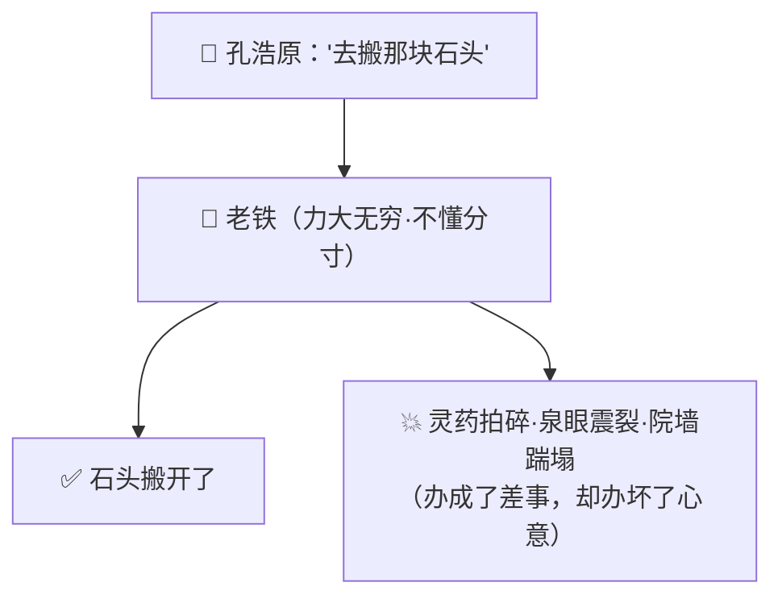
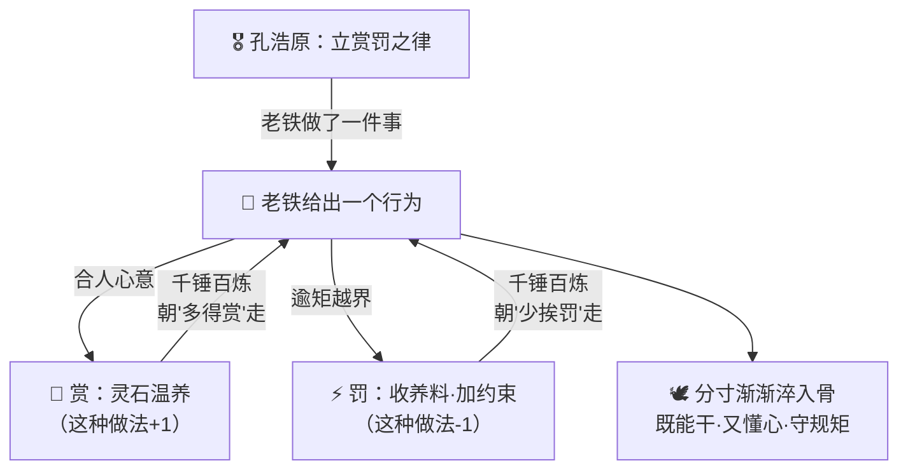
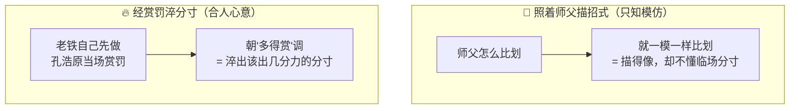

# 番外十三 · 赏罚淬心：万炼归真

> 题记：一件法宝铸得再利，也未必称手。真正的神兵，不比谁的刃更锋，而比谁更懂你的心——你一动念，它便知轻重；该出手时雷霆万钧，该收手时纹丝不动。铸器易，正心难。淬其锋者，增其力；淬其心者，正其行。

正传里，孔浩原炼成一具傀儡，唤作"老铁"，本事着实不小——力能扛鼎，行走如飞，交代下去的活，也总能办成。可你有没有想过一个更实际的问题——

**一件本事很大、却不懂你心意的法宝，到底称不称手？它办得成事，却办不到你心坎上，那这身本事，又有几分是你想要的？**

这一篇番外，讲的正是孔浩原从"炼出一具本事很大的傀儡"，到"把它淬炼成一具**合人心意**的傀儡"之间，那道最难跨过的坎。

---

## 一、有力无格

老铁刚炼成时，孔浩原是真欢喜过一阵，也真被它折腾得哭笑不得。

那傀儡通体玄铁，力大无穷，孔浩原让它去后山搬一块挡路的巨石。老铁二话不说，一掌拍过去——巨石是碎了，连带着旁边三株千年灵药、一口清泉眼，也被这一掌的余劲震了个稀烂。

孔浩原哭笑不得："我让你搬石头，没让你把灵药也一并'搬'了啊。"

老铁不懂，只当自己办成了差事，得意地立在原地，等着下一道命令。

这样的事，几乎天天上演。

让它去镇上买一坛酒，它嫌绕路，直接踹开人家院墙抄近道，酒是买回来了，一路踹塌了七八堵墙；让它守着丹炉别让火灭，它守是守住了，可有人来问路，它一句话不答，把人当贼一样盯着，吓得樵夫连滚带爬；孔浩原随口叹一句"今日好累"，老铁竟当了真命令，非要把他扛回洞府去躺着，任凭孔浩原怎么喊都不撒手。

**它什么都办得成，却什么都办不到点子上。** 力气用不到该用的地方，分寸拿捏不到人的心坎上——横冲直撞，答非所愿。

苏挽晴来串门，正撞见老铁把一位登门的散修当成来犯之敌，一把拎在半空。她哭笑不得："孔师兄，你这傀儡……本事是真大，可怎么这么'不懂事'啊？力气全长在了身上，半点没长在心上。"

孔浩原扶额长叹："炼器易，**正心难**。我只学会了'炼出个本事大的',却没学会'教它把本事用得合人心'。"



---

## 二、玄机子立"律"

孔浩原被老铁折腾得没法，只得去向玄机子请教这"正心"之道。

玄机子听完那一桩桩笑话，非但不恼，反而抚掌大笑："好哇！你总算撞见了炼傀儡真正的门槛。世人都以为难在'炼得出本事',殊不知——**难在'教它把本事使得合人心'。**"

"你且说，"老人问，"一头刚从山里逮来的猛虎，力气够大罢？可你敢让它替你看家护院么？"

孔浩原摇头："自然不敢。它力气是大，却不知轻重，护院不成，反倒先把主人咬了。"

"那驯兽人是怎么让猛虎听话的？可是给它讲了一车道理？"

孔浩原若有所悟："不是……是靠**赏罚**。它做对了，便赏它一块肉；做错了，便罚它、不给它吃。这么反复千百遍，它自己就摸清了'怎么做才有肉吃',渐渐地，也就通了人性、知了分寸。"

"着啊！"玄机子一拍石桌，"你那老铁，坏就坏在——**你只当了'炼它的匠',没当'淬它的师'。** 你把它炼了出来，本事灌得足足的，却从没跟它'论过赏罚'、没让它'尝过做对的甜、做错的苦'。一具没经赏罚的傀儡，本事再大，也是一头不知轻重的蛮牛。"

"那……该怎么'淬'这个心？"

玄机子伸出手指，一字一顿："**合人心意则赏，逾矩则罚。** 就这八个字，反反复复，千锤百炼。"

"你让它搬石头，它连灵药一并拍碎——**这便是逾矩，要罚**，让它记下'用力过猛、伤了不该伤的，是错'。你让它守炉，恰好有人来问路，它能一边守炉、一边好言指路——**这便合了人心，要赏**，让它记下'既办成差事、又待人有礼，是对'。"

"如此一次次赏、一次次罚，"老人目光深远，"它自己就会朝着'多得赏、少挨罚'的路上走。走得多了，那份'该用几分力、该守几分礼、该会几分意'的分寸，便一丝丝淬进了它的骨子里。"

孔浩原悚然一惊——他从前只顾着给老铁灌本事，却从没想过，**本事之外，还得有一套'赏罚',把这本事'正'到合人心的道上来。**

"若我一次次赏它做对、罚它做错，"孔浩原喃喃，"它自己就会慢慢懂我的心意了……"

"正是。"玄机子颔首，"**赏罚淬的不是它的力，是它的行。** 它的本事，你早炼足了；你要淬的，是让这身本事，长出一副'懂你、贴你、守规矩'的分寸来。这，才是炼傀儡真正的奥义——不是力大，是**合心**。"



---

## 三、千锤百炼

得了"合人心意则赏，逾矩则罚"这八字之律，孔浩原重整心气，开始日复一日地淬炼老铁。

他不再只丢给老铁一道死命令，而是每办一件事，都当场论个赏罚——

老铁去搬石头，这回记着"莫伤旁物",小心翼翼地把巨石挪开，寸草未损。孔浩原当即取一枚温润灵石喂它温养，赞一声"好"。老铁通体一暖，隐隐记下：**这般'办成事又不伤旁物',是会得赏的。**

老铁去镇上办事，又想踹墙抄近道，脚才抬起，忽地顿住——它记起上回踹墙挨的罚，硬生生把脚收了回来，老老实实绕了远路。孔浩原远远看着，又赏了它一分。

有个樵夫来问路，老铁不再把人当贼盯着，而是抬手，指了指山下的路。虽木讷，却已是善意。孔浩原欣慰，再赏。

而每当老铁又要横冲直撞、又要把"我好累"当成"扛他回去"的死命令时，孔浩原便不赏、甚至加以约束——罚它记下这一记"逾矩"。

**一次赏，一次罚；一次做对，一次纠错。** 千百次下来，那具原先横冲直撞的蛮傀儡，竟一点点变了。

它开始懂得：搬石头要看旁边有没有该护着的东西；办差事不必踹人家的墙；有人问路要好好指；主人一句随口的叹气，不是非得当成军令去执行。它甚至学会了**揣摩语气**——同样一句"去把那个拿来",主人若是急的，它便快；主人若是闲闲的，它便稳。

半年之后，老铁再不是那头不知轻重的蛮牛。它办事，既有当初的一身本事，又添了一副难得的分寸——**该出力时雷霆万钧，该收手时纹丝不动；办得成事，还办到了人心坎上。**

苏挽晴再见老铁时，是真心叹服了："同样一具傀儡，上回是头蛮牛，这回竟像个知冷知热的老管家。差别就在——你这回，是真的把它的'心',一锤一锤淬出来了。"

孔浩原望着安安稳稳侍立一旁的老铁，缓缓道："上回我以为，炼傀儡的本事，在'力大'。这回才懂——**本事不在它能扛多重，在'它使这身力气时，懂不懂我的心、守不守那个分寸'。**"

---

## 四、淬心非增力

淬炼老铁这半年，孔浩原还悟到一层最要紧的门道——**他这一场赏罚，从头到尾，压根没给老铁添过半分力气。**

老铁的力气，炼成那日就已灌满，半年里一分未增。孔浩原用赏罚淬的，从来不是它的"力",而是它的"行"——**让那身早已足够的本事，长出一副懂人心、守规矩的分寸来。**

这门道，恰能照出另一桩事的分别。

孔浩原早年也带过一个只知"照着师父招式比划"的木讷弟子。那弟子勤勉，把师父的每一招每一式都描摹得分毫不差——师父怎么起手，他就怎么起手；师父怎么收势，他就怎么收势。可一到真要临机应变、要看对手、看时势、看该出几分力的时候，他就傻了眼——因为他只学会了"模仿招式",却从没被"赏罚"淬出过那份"临场的分寸"。

"你看，"孔浩原对苏挽晴解说，"**那弟子是'照着样子描',描得再像，也只是把别人的招式搬过来；老铁是'经着赏罚淬',淬出来的，是它自己在一次次做对做错里，长出的分寸。** 一个学的是'招式该怎么摆',一个学的是'这一招，此时此地，该不该出、该出几分'。"

"描招式的，"他总结道，"能学得像；淬分寸的，才学得对人心。这两样，看着都像'在学',骨子里，却是两条道。"



苏挽晴听得连连点头："描招式的求个'像',淬分寸的求个'对人心'……原来'学'与'学',竟也隔着这么一层。"

"隔得远了。"孔浩原笑道，"多少人炼得出本事滔天的法宝，却没一件称手，就是只给它灌了'力',没给它淬过'心'。"

---

## 五、万炼归真

老铁淬成之后，孔浩原声名更盛。有后辈慕名来问："大师，我也炼出了一具本事极大的傀儡，可它总是横冲直撞、不听使唤，这该如何是好？"

孔浩原不答反问："你炼这傀儡，是图它'力气大',还是图它'办得成你想办的事'？"

后辈一愣。

"你若只图'力气大',炼得力能移山，也不过是头不知轻重的蛮牛，越使越坏事。"孔浩原缓缓道，"你若图'办成你想办的事',那就记住——**傀儡的诀窍，从来不在'炼',在'淬'。**"

他抬手，唤来老铁。那傀儡上前，动作沉稳，侍立一旁，眼中竟似有了几分知冷知热的通透。孔浩原随口道一句"退下罢",老铁便恰到好处地退到三步之外，不远不近。

"你看它，"孔浩原道，"力气还是当初那身力气，一分未添。变的，是它经了千场赏罚淬出的那副'心'——**知道该出几分力，知道我要什么，知道什么该做、什么不该做。** 这份分寸，是我一锤一锤、一赏一罚，从它骨子里淬出来的。"

"炼得出力，是本事；淬得正心，才是真本事。"孔浩原目光深远，"莫要迷了那'力大无穷'的排场。真正的神兵，或许不比谁的刃更利，却比谁都更懂主人的心——你一动念，它便知轻重。这，才叫'赏罚淬心，万炼归真'。"

后辈似有所悟，深深一揖。

孔浩原望向侍立的老铁，想起玄机子当年那句话，轻声自语——

"淬心者，非增其力，乃正其行。一件法宝的力气，铸的时候便定了；可它这身力气，究竟是横冲直撞地祸害人，还是妥妥帖帖地合人心……那全看，有没有人肯耐着性子，一赏一罚，把它的'心',一寸一寸地正过来。"

炉火沉沉，老铁静立，那双玄铁铸的眼里，仿佛真淬进了一点人的暖意。

---

## 📒 凡人笔记

这一篇番外，讲的是"一个本事很大的模型，如何被赏罚调教得合人心意"。现在，把故事里的黑话，一件一件翻译回真实世界的 **AI 术语**——

| 故事里的东西 | 真实 AI 概念 | 一句话 |
| --- | --- | --- |
| 赏罚淬心 / 万炼归真 | **强化学习（Reinforcement Learning）** | 做对给奖励、做错给惩罚，反复多次，行为朝"多拿奖励"的方向变 |
| 合人心意则赏，逾矩则罚 | **奖励 / 惩罚信号（reward）** | 一个"这次好/不好"的分数信号，用来塑造行为——奖励塑造行为 |
| 孔浩原一次次给老铁论赏罚 | **RLHF：用人类打分当奖励** | 拿"人对回答满不满意的打分"当奖励，把模型调得更有用、诚实、无害 |
| 老铁渐渐"合了人心、懂了分寸" | **对齐（Alignment，合人心）** | 把"能力强"的模型，校准到"有用·诚实·无害、更听话有礼"的轨道上 |
| "淬心者，非增其力，乃正其行" | **RLHF 不增知识，只正行为** | 模型的本事预训练时就有了，赏罚调的是"分寸"，不是"学问" |
| 只知照着师父描招式的木讷弟子 | **普通训练：预测下一个词（模仿）** | 学"人一般会怎么说"，好坏一起学，只求"像"，不懂临场择优 |
| 经赏罚淬出临场分寸的老铁 | **RLHF：按偏好择优（非照抄）** | 不给标准答案照抄，而是让它朝"人更满意"的方向择优调整 |
| 淬心是特殊的一场"再调教" | **RLHF 是一种对齐式的微调** | 微调家族里专做"对齐人心"的一员，用赏罚择优而非照抄示范 |
| 一头没经赏罚的蛮牛 | **未对齐的模型：能力强却不合人心** | 什么都会，却跑题、胡说、不懂分寸，横冲直撞 |

> 📖 想把这门"赏罚淬心"的本事学扎实，去读概念入门篇——
>
> ① [什么是强化学习-RLHF](../02_CONCEPTS_概念入门/[CONCEPT-26] 什么是强化学习-RLHF.md) ｜ ② [什么是微调](../02_CONCEPTS_概念入门/[CONCEPT-25] 什么是微调-FineTuning.md)

**说句实在的诚实话——**

你正在用的 Khy-OS，之所以让你觉得"AI 懂事、听话、不乱来"，背后也正有老铁这一场"赏罚淬心"的功劳。

Khy-OS 自己并不训练大模型——它是一个调用大模型来干活的运行骨架。但它所依赖的那些底层大模型，几乎都像老铁一样，在出厂前经过了 RLHF 这道赏罚淬炼：正因为被"合人心意则赏、逾矩则罚"调教过，模型才会顺着你的意图去办事、少一本正经地瞎编、不被轻易带着说出越界的话。而 Khy-OS 再用系统提示词与章程纪律，在这份"淬好的底子"之上，把它约束成一个守规矩、可验证的干活助手——**前者是"从小淬进骨子里的性子",后者是"上岗后的岗位规矩"。**

正如玄机子所说——**淬心者，非增其力，乃正其行。** 从"一个本事很大、却不懂你心意的模型"，到"一个既能干、又合人心、还懂分寸的助手"，中间隔着的，正是这一场千锤百炼的赏罚。你现在既懂它的本事从哪来，也懂它的分寸从哪来。这套从能力到对齐的完整地图，已在你脑中连成一片。

---

## 📝 读完自测

就着上面这张对照表，考一考自己——"淬心"与"增力"这道分界，你分清了吗？

```quiz
Q: 关于"赏罚淬心（强化学习 / RLHF）"，下面哪些说法是对的？（多选）
- [x] 赏罚淬心 = 做对给奖励、做错给惩罚，反复多次，行为朝"多拿奖励"的方向变
> 对。合人心意则赏、逾矩则罚，那个"这次好/不好"的分数信号（reward）用来塑造行为。
- [x] RLHF 就是"拿人对回答的打分当奖励"，把模型调得更有用、诚实、无害——这叫对齐（Alignment）
> 对。把"能力强"的模型，校准到"有用·诚实·无害、更听话有礼"的轨道上。
- [x] "淬心者，非增其力，乃正其行"——RLHF 不增知识，只正行为
> 对。模型的本事预训练时就有了，赏罚调的是"分寸"，不是"学问"。
- [x] 普通训练"照着师父描招式"只求像（模仿）；RLHF 是"按偏好择优"而非照抄示范
> 对。不给标准答案照抄，而是让它朝"人更满意"的方向择优调整。
- [ ] 一个本事极大、却没经过赏罚淬炼的模型，一定既能干又懂分寸、合人心意
> 错。那是"未对齐的蛮牛"——什么都会，却跑题、胡说、不懂分寸，横冲直撞。能力强 ≠ 合人心。
```

再用一张翻卡，把"增力"和"正行"这道 RLHF 的关键分界记死：

```flip
🤔 都是"训练模型"，为什么说 RLHF（赏罚淬心）"不是让它更博学，而是让它更懂事"？它到底改了什么？（点一下翻到背面）
---
✅ 因为 RLHF **不增知识，只正行为**（"淬心者，非增其力，乃正其行"）。模型的本事——它读过多少书、会答多少题——是**预训练**阶段就长在骨子里的那身"力"，RLHF 一分没给它添。RLHF 干的是另一件事：拿**人类对回答的打分**当奖励（合人心意则赏、逾矩则罚），反复调，让它朝"人更满意"的方向**择优**——这叫**对齐（Alignment）**，把一个能力强的模型校准到"有用·诚实·无害、更听话有礼"的轨道上。对比一下：普通训练像"照着师父描招式"，好坏一起学、只求**像**（模仿下一个词）；RLHF 像"经赏罚淬分寸"，学的是"这一招此时此地该不该出、出几分"（按偏好择优，不照抄）。所以一个没经 RLHF 的强模型，是头"力大却不懂分寸的蛮牛"。一句话：**预训练给的是学问，RLHF 淬的是分寸；力气铸的时候就定了，合不合人心全看有没有人一赏一罚把它的"心"正过来。**
```

---

【👈 上一篇 · [番外十二 · 点化真身：因材塑形](./番外12·点化真身·因材塑形.md)｜👉 下一篇 · [番外十四 · 六识同参：眼耳互通](./番外14·六识同参·眼耳互通.md)｜🏠 回 [总目录](./00_INDEX_修仙学AI-总目录.md)】
