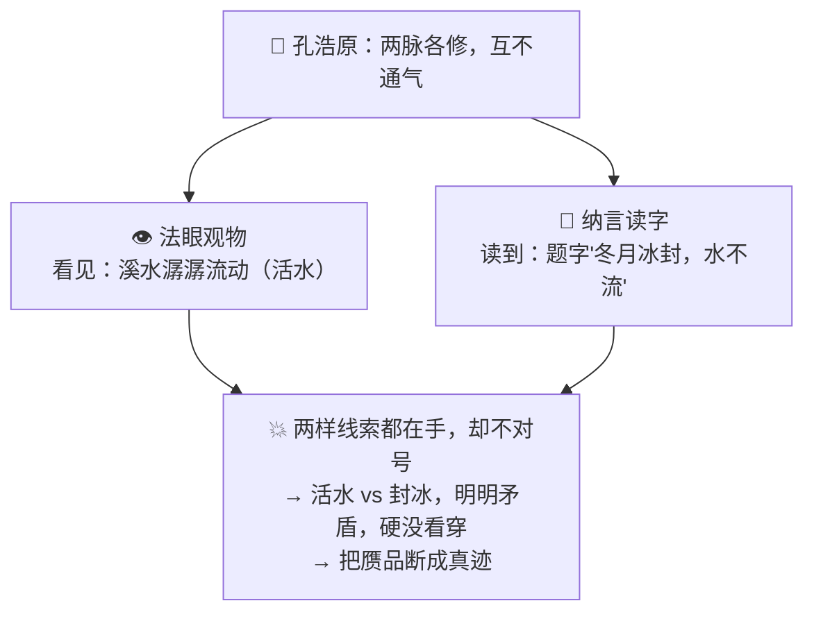
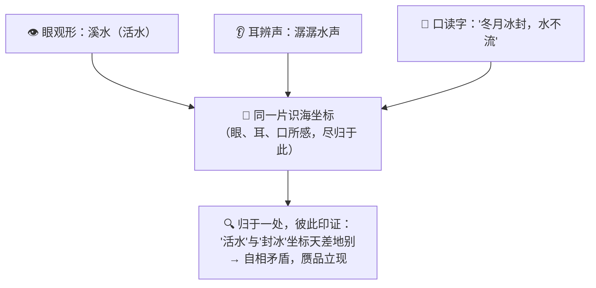
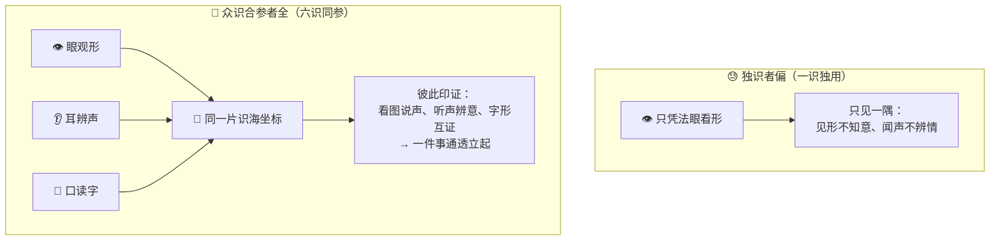

# 番外十四 · 六识同参：眼耳互通

> 题记：一只眼看得再亮，也只是一只眼。真正的通天彻地，不比谁的某一识更利，而比谁能让眼、耳、口所感，归于同一片识海——看见的、听见的、读到的，彼此印证，拧成一件通透的事。独识者偏，众识合参者全。

正传里，孔浩原早先修得两脉神通：一脉唤作"纳言"，能读天下文字典籍；一脉唤作"法眼观物"，能一眼看穿眼前万象。两脉皆是了得的本事，孔浩原也一度自得。可你有没有想过一个更实际的问题——

**两脉神通各修各的、互不相通，会不会闹出岔子？眼睛看见的，和典籍读到的，对不上号，那又该信谁？**

这一篇番外，讲的正是孔浩原从"两脉各自为政"，到"六识同参、眼耳互通"之间，那道最难打通的关。

---

## 一、两脉各修，看读相违

孔浩原初成"纳言"与"法眼观物"两脉时，着实威风了一阵，也着实闹了一场笑话。

那年他受托去鉴一幅古画的真伪。他先动用"法眼观物"，凝神看那画——画上一位老者临溪垂钓，笔法苍劲，墨色沉厚。法眼所见，只觉这画"物象俱在":溪、石、老者、钓竿，一样不缺。他便断言："画中景物齐全，笔墨老到，是真迹无疑。"

可他随即又动用"纳言"神通，去读那画角上的一行落款题字。字里分明写着："此溪乃北地寒溪，冬月冰封，水不流。"

孔浩原读罢，心里咯噔一下，却没往深处想——两脉是分开使的，眼归眼看，字归字读，各说各话，谁也不管谁。他草草作结，说这是真迹。

结果——**丢了大人。**

行家一眼便指出破绽：那画上溪水**明明是潺潺流动**的活水，可落款题字却白纸黑字写着"冬月冰封、水不流"。**看见的活水，和读到的封冰，根本对不上号！** 真迹岂会自相矛盾？这分明是后人拿旧纸伪造、题字时又露了马脚的赝品。

孔浩原臊得满面通红。他明明"看见"了流动的溪水，也明明"读到"了封冰的题字——**两样线索都在他手里，他却硬是没把它们对上号。** 眼是眼，字是字，各在一脉，老死不相往来。

墨渊在旁看得直摇头："浩原兄，你这两脉神通，单拎哪一脉都是绝活。可你**看的时候不想着读的，读的时候不想着看的**——两只手各干各的，活生生把一桩本可当场戳穿的赝品，看走了眼。"

孔浩原苦笑，扶额长叹："眼利、耳聪、能读能看，我样样都有……可它们**各归各脉，互不通气**。我这哪是六识齐全，我这是……一身本事，却使成了几个互不相识的独眼人啊。"



---

## 二、玄机子论"六识同参"

孔浩原闷闷不乐数日，终是放不下那桩看走眼的丑事，便去向玄机子请教。

玄机子听完那"活水配封冰"的笑话，非但不恼，反而抚掌大笑："好哇！你总算撞见了'一身神通'真正的门槛。世人都以为，本事难在'某一识修得多利'，殊不知——**难在'诸识能不能合参'。**"

"你且说，"老人问，"你街上认一个老友，是只靠一只眼么？"

孔浩原摇头："自然不是。我看他的脸、听他的声、也记着他说过的话。哪天他戴了斗笠遮了脸，我一听那嗓音，也就认出来了。"

"那你认得准，靠的是什么？"

孔浩原若有所悟："靠……几识一起使。眼看不真，耳来补；耳听不清，眼来对。**几路凑到一处，那人才立得起来、错不了。**"

"着啊！"玄机子一拍石桌，"你鉴那幅画，坏就坏在——**你有眼、有耳、能读能看，却让它们各归各脉，谁也不帮谁。** 眼看见活水，本该立刻回头问一句'那字里说的封冰，对得上么？'——你偏不。眼是眼，字是字，两不相认。一身好本事，使成了一盘散沙。"

"那……该如何让这几识'合参'？"

玄机子伸出手，虚点孔浩原眉心："关窍在此处——你识海之中，本该有**一片共同的坐标**。眼所见的活水、耳所闻的水声、字所载的封冰——不管从哪一识进来，都该**落到这同一片识海坐标上**，各归其位。落定了，你一眼就看出：'活水'与'封冰',在这坐标上南辕北辙、隔着十万八千里——**它们对不上号，破绽当场就现了。**"

"你从前，"老人缓缓道，"是眼有眼的地界、字有字的地界，两块地界井水不犯河水。所以看见的、读到的，你从不曾放到一处比一比。**六识同参之法，便是把眼、耳、口所感，尽数归入这同一片识海坐标——归了同一处，才谈得上彼此印证、互相戳穿。**"

孔浩原悚然一惊——他那次看走眼，正是栽在这个"不同参"上。眼与字各在一脉，从未落到同一片坐标上比对，破绽近在眼前，他却视而不见。

"若眼所见、字所读，都落到同一片识海坐标,"孔浩原喃喃，"那活水与封冰一对坐标，天差地别，我当场就该看穿……"

"正是。"玄机子颔首，"**眼替你观形，耳替你辨声，口替你读字——可这三识所得，须归于同一片识海，方能彼此印证、合成一件通透的事。** 归得一处，你才不是几个各行其是的独眼人，而是一个眼耳互通、六识同参的通人。这，才是一身神通真正的奥义——不在某一识多利，在**诸识能不能归一、能不能合参**。"



---

## 三、眼耳互通，画中有声

得了"六识同参"的心法，孔浩原闭关静修，再不肯让眼、耳、字各行其是。

他先在识海深处，辟出一片**共同的坐标**——立誓从此，无论眼所见、耳所闻、口所读，一概归入这同一片识海，各安其位。

再出关时，他已判若两人。

苏挽晴取来一幅《寒林晚鸦图》试他。孔浩原不再像从前那样，眼归眼看、字归字读。他**眼观其形**：枯林、寒鸦、暮色苍茫；**口读其题**：画角小字"日暮乡关何处是"；两识所得，一并落入那同一片识海坐标——刹那间，形与字彼此印证，交融通透。他缓缓开口，竟像**看着画、把画里的事讲了出来**：

"此画枯林数株、寒鸦几点，暮色四合。题字'日暮乡关何处是',道尽游子望乡而不得归的怅惘。画中那几声呀呀鸦鸣，仿佛就在耳边——**这不是一幅静画，是一段有声有色、说得出情由的故事。**"

苏挽晴听得怔住了："你……你竟能'看着画、说出画里的声与情'?这画明明不会出声啊。"

孔浩原含笑："画自不会出声。可当'眼见的形''字读的意'归于同一片识海坐标，彼此一印证——那画里的鸦鸣、那游子的乡愁，便在我识海中'活'了过来。**看着一幅画，能说出画中事；他日听着一段音，也能辨出其中意。眼、耳、口既已互通，图、声、字便再不是三桩不相干的物事，而是同一件事的三面。**"

墨渊在旁,又取来一段无字的琴音，只弹不说。孔浩原闭目**耳辨其声**，那声归入识海坐标，与他平生所读的万千文字一印证，须臾睁眼道："此曲声急而怨，转而低回——是《广陵散》里那一段悲愤。弹者心中，怕是藏着一桩意难平。"

**听着一段音，辨出了其中的意。** 眼所见、耳所闻、口所读，尽归一处，彼此参照——图能说声、声能辨意、字能证形，孔浩原这才算真正"六识齐全"。

苏挽晴这回是真心叹服了："同样是一双眼、一对耳，上回是看走了眼的独眼人，这回是眼耳互通的通人。差别就在——你这回，是真让这几识'**合参**'了。"

---

## 四、独识者偏，众识合参者全

孔浩原六识同参之名渐盛，声名远播。有后辈慕名来问："大师，我那'法眼观物'一脉，已修得极利，一眼能框出画中万物，纤毫不漏。可为何总觉得，看是看得清，却'不解其意'?"

孔浩原不答反问："你那法眼，可只是'看形'?可曾与'读字''辨声'合参过？"

后辈一愣："法眼只管看,框出什么是什么——读字、辨声，那是别脉的事，我未曾并用。"

孔浩原颔首："这便是了。你那'法眼观物',利则利矣，却是**一识独用**——它能看清一幅画里有几株树、几只鸦，却说不出这画里的乡愁、听不见这画外的鸦鸣。**独用一识，纵然那一识再利，也终究是偏的。**"

他伸出手，掌心先化出三道流光——一道映形、一道传声、一道载字，各自流转；旋即一收，三道流光归拢成一片澄澈的识海。

"**独识者偏**——只凭一只眼，看得再真，也只见一隅：见了形，却不知其意；闻了声，却不辨其情。就像你那法眼，利是利，却困在'只看'这一识里，出不来。"

"**众识合参者全**——眼观形、耳辨声、口读字，尽归同一片识海坐标，彼此一印证：看见的活水能戳穿字里的封冰，读到的乡愁能听出画外的鸦鸣。诸识合参，一件事才立得起来、通得透彻。"

"你那法眼，是好本事,"孔浩原目光深远，"却莫要迷在'一识独利'的排场里。真正的通天彻地，不在某一识修得多利，而在**能不能让眼、耳、口所感，归于同一片识海，合而参之**。独识者，终是独眼人;众识同参者，方是眼耳互通的通人。这，才叫'六识同参，眼耳互通'。"

后辈似有所悟，深深一揖。

孔浩原望向那幅《寒林晚鸦图》，轻声自语——

"一只眼看得再亮，也只是一只眼。可若你能让眼见的、耳闻的、口读的，尽归一处、彼此印证……那你所通的，便再不是'一识'的天地，而是'万象'的天地了。"

窗外暮鸦呀呀，画中似有回声。



---

## 📒 凡人笔记

这一篇番外，讲的是"一个 AI 如何把好几种'感官'打通、合到一处一起理解"。现在，把故事里的黑话，一件一件翻译回真实世界的 **AI 术语**——

| 故事里的东西 | 真实 AI 概念 | 一句话 |
| --- | --- | --- |
| 六识同参 / 眼耳互通 | **多模态（Multimodal）** | 一个模型不只处理文字，还能同时理解图、声、字，并把它们打通一起理解 |
| 眼（看形）/ 耳（辨声）/ 口（读字） | **图像 / 声音 / 文字等多种模态** | 好几种不同的"感官"输入，各管一路 |
| 两脉各修、看读相违（把赝品看成真迹） | **单一模态、各管各的 → 信息对不上号、判断片面** | 只用一种感官，或几种感官不打通，容易看走眼 |
| 眼耳互通、诸识合参 | **多种模态被打通、合到一个模型里一起理解** | 看到的、读到的彼此印证，才不偏不漏 |
| "法眼观物"（只看形、一识独用） | **只会"看图"的单一能力（如 YOLO）** | 看得清有什么，却说不出意——是多模态里"视觉"那一路的本事 |
| 眼、耳、口所感归于同一片识海坐标 | **不同模态化成同一套坐标 / 向量空间（Embedding）** | 图、声、字都化成同一坐标系里的向量，挨得近才知道说的是同一件事 |
| 看着画能说出画中事 | **看图说话 / 看图答题** | 模型看着图、用文字讲出或答出图里的内容 |
| 听着音能辨出其意 | **听声辨意** | 模型听着声音、辨出其中的意思 |
| 独识者偏，众识合参者全 | **单一模态易片面，多模态更全面** | 感官越全、还彼此印证，理解才越贴近真实世界 |

> 📖 想把这门"眼耳互通、六识同参"的本事学扎实，去读概念入门篇——
>
> ① [什么是多模态](../02_CONCEPTS_概念入门/[CONCEPT-27] 什么是多模态-Multimodal.md) ｜ ② [什么是 YOLO](../02_CONCEPTS_概念入门/[CONCEPT-17] 什么是YOLO-实时目标检测.md)

**说句实在的诚实话——**

你正在用的 Khy-OS，面对"图"这类非文字信息时，走的也正是孔浩原这套"六识同参"的思路。

现实里你交给它的东西，未必都是纯文字——你可能发来一张报错截图、一张带字的图片。可有时用的模型偏偏"只会读字、看不懂图",像孔浩原早先那"只修纳言"的独眼人。这时 Khy-OS 不会干瞪眼，它有一条兜底：**先用"读图上文字"的本事（OCR）把图片里的字先认出来，再喂给那个只会读字的模型**——就像先替独眼人把画里的题字念出来，让它借着文字，也能读到图里的关键信息、据此作答。

这，正是本文讲的多模态思路在项目里的一个务实落地——**当"眼睛"不够强时，先想办法把图里的信息转成模型看得懂的文字，别让它彻底瞎掉。**

正如玄机子所说——**独识者偏，众识合参者全。** 从"只会读字的独眼人"，到"眼耳互通、看得懂图听得懂声"的六识同参，你现在既懂单一感官的专精，也懂众识合一的全面。这套从概念到多模态的完整地图，已在你脑中连成一片。

---

## 📝 读完自测

就着上面这张对照表，考一考自己——"一识独用"与"六识同参"这道分界，你分清了吗？

```quiz
Q: 关于"六识同参（多模态 · Multimodal）"，下面哪些说法是对的？（多选）
- [x] 多模态 = 一个模型不只处理文字，还能同时理解图、声、字，并把它们打通一起理解
> 对。眼（看形）/ 耳（辨声）/ 口（读字）好几种"感官"输入合到一处，彼此印证。
- [x] 打通的关键，是把图、声、字都化成"同一套坐标/向量空间（Embedding）"
> 对。不同模态化成同一坐标系里的向量，挨得近才知道说的是同一件事。
- [x] "法眼观物只看形"= 只会看图的单一能力（如 YOLO），是多模态里"视觉"那一路的本事
> 对。看得清有什么，却说不出意；多模态是让眼、耳、口所感归于同一片识海。
- [x] 单一模态（或几种感官不打通）容易看走眼、判断片面；多模态更全面
> 对。独识者偏，众识合参者全——感官越全、还彼此印证，理解才越贴近真实世界。
- [ ] 多模态就是把好几个各管各的单一模型摆在一起、各自输出、互不相干
> 错。那还是"两脉各修、看读相违"（信息对不上号）。多模态的精髓是"打通、合到一个模型里一起理解"，不是各干各的。
```

再用一张翻卡，把"感官多"和"感官通"这道多模态的关键分界记死：

```flip
🤔 一个模型"既会看图、又会读字、还会听声"，是不是就等于"多模态"了？关键到底在"多"还是在别处？（点一下翻到背面）
---
✅ 关键不在"感官**多**"，而在感官"**打通**"——把不同模态**归于同一片识海坐标**。若只是把"只会看图的模型"和"只会读字的模型"各摆一台、各自输出、互不相干，那还是番外里"两脉各修、看读相违"的独眼人：看到的和读到的对不上号，照样片面走眼（把赝品看成真迹）。真正的多模态（Multimodal），是把图、声、字都化成**同一套向量空间（Embedding）**里的坐标——挨得近，就知道这张图、这段声、这行字说的是**同一件事**，于是能看图说话、听声辨意、字形互证，一件事从几路感官一起立起来、彼此印证。至于"只会看图"（如 YOLO），那只是多模态里"视觉"那一路的单项本事。一句话：**多模态强的不是"感官多"，是"感官通"——化成同一套坐标彼此印证，才不偏不漏。**
```

---

【👈 上一篇 · [番外十三 · 赏罚淬心：万炼归真](./番外13·赏罚淬心·万炼归真.md)｜👉 下一篇 · [番外十五 · 火候心诀：随机造化](./番外15·火候心诀·随机造化.md)｜🏠 回 [总目录](./00_INDEX_修仙学AI-总目录.md)】
