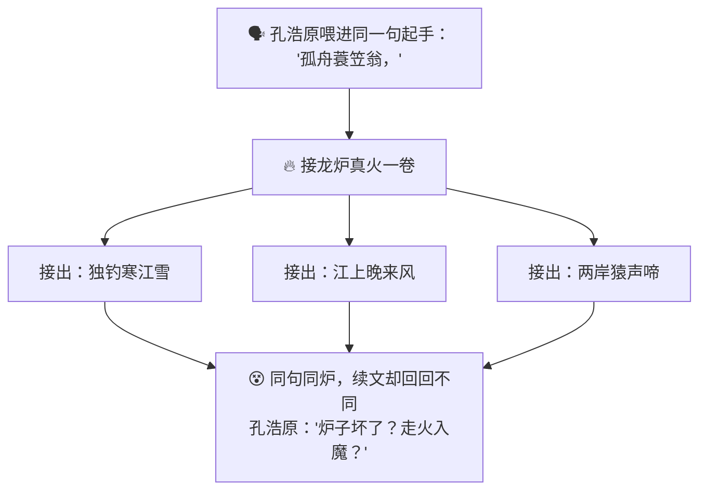
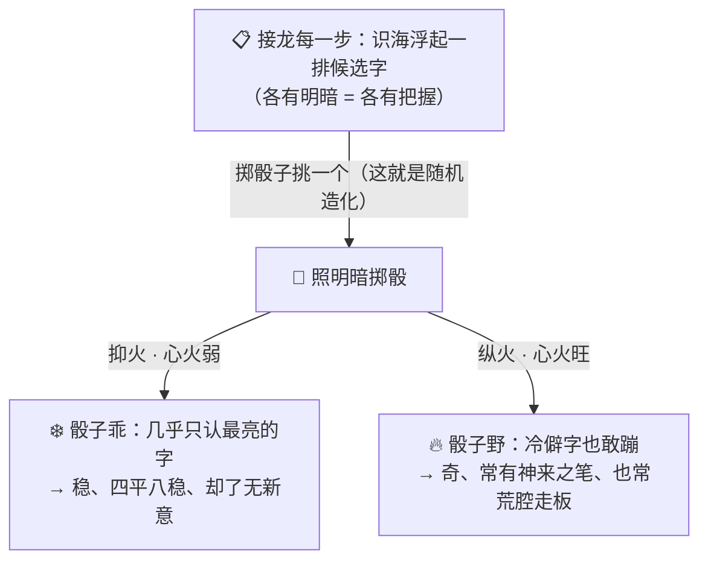
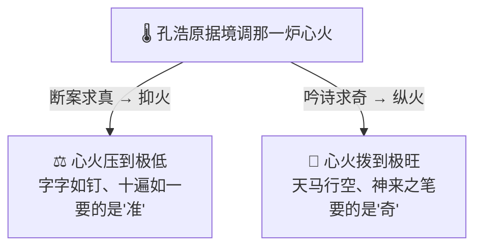

# 番外十五 · 火候心诀：随机造化

> 题记：同一句起手，同一炉真火，接出的下文却每回都不一样。世人只当是炉子"心不定"，殊不知——那一点点飘忽，正是"活气"所在。火太弱，字字四平八稳却了无生气；火太旺，句句天马行空却常常荒腔走板。一念之温，判文章之死活。

正传"接龙诀"一章里，孔浩原习得那门"你起半句、炉子接半句"的推衍神通。那是何等的通灵。可他练着练着，撞见一桩怪事——

**同一句起手，我一字不差地喂进炉里两遍，炉子接出的下文，怎么每回都略有不同？** 明明是同一炉真火、同一句话，怎么就像掷了骰子似的，飘忽不定？

这一篇番外，讲的正是孔浩原从"会接龙"，到参透那接龙背后一点"随机造化"之间，玄机子传他的一门心诀——**火候心诀**。

---

## 一、同句异续

孔浩原初成"接龙诀"时，欢喜得很，日日对着丹炉推衍诗文。

可没几日，他就犯了嘀咕。

那日他喂进炉中一句起手："孤舟蓑笠翁，"想看它接个什么。炉火一卷，接出："独钓寒江雪。"——好句！他大喜，想再看一遍这灵光，便又原样喂进同一句"孤舟蓑笠翁，"。

这一回，炉子接的却是："江上晚来风。"

孔浩原愣住。他不信邪，一连喂了七八遍，那"孤舟蓑笠翁"底下，竟接出七八个不同的下文：有"独钓寒江雪",有"江上晚来风",有"两岸猿声啼"，还有一句莫名其妙的"忽闻岸上踏歌声"……

**同一句起手，同一炉火，接出的下文竟无一雷同。**

他心下大骇，只当是这炉子"火性不定、走火入魔"了，急急去寻玄机子："师父！这接龙诀的炉子怕是坏了——我喂它同一句话，它每回接的都不一样，莫非是心魔作祟、真火不稳？"



---

## 二、玄机子传"火候心诀"

玄机子听罢，非但不忧，反而捋须大笑："坏了？我看是你，才刚摸着这接龙诀真正的门槛哩。"

"你且想，"老人不答反问，"你那炉子接龙之时，心里浮出的，是**唯一一个**下文，还是**一大片**候选的字句？"

孔浩原一怔，凝神回想那接龙的一瞬——可不是么！每要接下一个字，他识海里从不是"蹦出唯一答案",而是**浮起一整排候选字**，每个字还各自明灭着一点光晕，有的亮、有的暗。接"寒江"底下，"雪"字最亮，"月""风""水"也各自幽幽亮着……

"那……那是一片字，不是一个字。"孔浩原喃喃，"每个字还亮得不一样。"

"着啊！"玄机子一拍石桌，"那点'亮',便是这字'接得上的把握'——越亮，越顺理成章;越暗，越是冷僻偏门。可炉子到底接哪个字呢？**它不是死认最亮的那个，而是照着那明暗,掷一回骰子去挑。**亮的字，被掷中的机会大；暗的字，机会小，却也不是全然没有。"

孔浩原恍然——**正因是"掷骰子",同一句起手,两回掷出的字才可能不同！** 那"同句异续"哪里是炉子坏了，分明是**每一步都在掷一颗看不见的骰子。**

"那……"他追问,"这骰子的性子，能不能管？"

"能。"玄机子伸出一指,"管它的，是一样东西——**心火。**"

老人缓缓道来：**"心火者，火候也。这一炉真火,你可拨旺,可压弱——**"

"**心火旺时**,那骰子便野了性子：连那些幽暗冷僻的字，也敢大胆蹦出来。于是接出的句子天马行空、常有神来之笔——可也常有荒腔走板、不知所云。"

"**心火弱时**,那骰子便乖了性子:几乎只认那最亮的字。于是接出的句子四平八稳、滴水不漏——可也了无新意，翻来覆去那几句老话。"

"**欲稳则抑火**——把火压到近乎熄，那骰子乖得每回都咬死那最稳的一续,你喂它十遍'孤舟蓑笠翁',它十遍都还你'独钓寒江雪',一字不改。"

"**欲奇则纵火**——把火拨得极旺，那骰子野得敢接出'忽闻岸上踏歌声'这般出人意表之语,妙则惊为天人,败则狗屁不通。"

孔浩原听得悚然——原来那"同句异续"里飘忽的一点点,不是走火入魔，正是这**心火的火候**在暗中拨弄那颗骰子。



---

## 三、据境调火

得了这门"火候心诀",孔浩原如获至宝，却不急着用，先揣摩了三日——**这火,到底该旺该弱?**

揣摩到第三日,他忽然拍案:**火候本无定数,全看你要做什么文章!**

于是他试着"据境调火"。

那年他受托替一桩疑案写"断案文书"。此事最重一个"真"字,半点错不得、半点飘忽不得。孔浩原凝神,将心火压到极低——那骰子乖得纹丝不敢野,每一句都咬住那最稳妥、最经得起推敲的续法。写出的文书字字如钉,前后严丝合缝,你叫他重写十遍,十遍都是同一副滴水不漏的模样。苏挽晴看过直点头:"断案就该这样——**要的是准,不是巧。**"

可没过几日,城中诗会,众人起哄要他即兴赋诗。这一回,他反其道而行,将心火拨得极旺——那骰子野了性子,专往那些旁人想不到的字上蹦。一首诗吟出,满座皆惊:那意象天马行空,"山会挪步去追海""月光冷得能磨墨",闻所未闻,妙不可言。墨渊在旁抚掌:"好一个纵火求奇!这般句子,压着火可写不出来。"

孔浩原对苏挽晴笑道:"你看——**断案求真时,我压火求稳;吟诗作赋时,我纵火求奇。** 同一炉火,同一门诀,火候一变,文章的性子就全变了。"



苏挽晴听得入神:"原来这火候,不是越旺越好,也不是越弱越好——是**看你要写什么样的文章,配什么样的火。**"

"正是。"孔浩原颔首,"文火炖不出爆炒的镬气,猛火也熬不出文火的绵长。**没有一炉'最好的火',只有一炉'配得上这篇文章的火'。**"

---

## 四、一念之温

诗会之后,孔浩原名声更盛。有个愣头青后辈找上门来,一脸苦恼:"孔前辈,我这接龙诀也快练成了,可总嫌它接得太闷、太没意思,便一味把心火往死里拨旺——结果接出的东西越来越离谱,前言不搭后语,这是怎么了?"

孔浩原不答反问:"你把火拨那么旺,是图它'看着热闹',还是图它'写成好文章'?"

后辈一愣。

"你若只图'热闹',那火拨得再旺,也不过是一炉乱窜的野火,烧出满纸荒唐。"孔浩原缓缓道,"你若图'写成好文章'——那就得记住:**这火候的诀窍,从不在'一味求旺'或'一味求稳',而在'一念之温,应境而变'。**"

他伸出手,掌心先燃起一簇跳脱的旺火,字句纷飞、绚烂却杂乱;旋即将火一压,火苗温驯下来,字句立时齐整如军阵。

"**心火即造化。**"孔浩原目光深远,"你这一念之温,拨的哪里是火——拨的是那篇文章的**死活**。火候对了,平稳处见沉稳,飞扬处见灵光;火候错了,该稳的地方飘了、该奇的地方闷了,一篇好文章就这么毁在一念之间。"

"那……到底该多旺、多弱呢?"后辈追问。

"这可没个定数。"孔浩原摇头一笑,"要准就压,要奇就纵,写什么文章配什么火——**全在你临炉那一念的拿捏。这拿捏的分寸,才是'火候心诀'真正的心法,不是那火本身。**"

后辈似有所悟,深深一揖。

孔浩原望向炉中那一簇明灭不定的火光,轻声自语——

"世人都怕这炉子'心不定',总想把那点飘忽摁死。殊不知——**那一点随机的造化,正是死字里透出的活气。** 全摁死了,是死水;全放开了,是野火。**能在这死水与野火之间,一念拿捏出恰到好处的一炉温火……那才叫真正参透了'火候'二字。**"

炉火明灭,一旺一弱,如呼吸,如心跳。

---

## 📒 凡人笔记

这一篇番外,讲的是"大模型生成时那一点'随机造化',以及拨弄它的'火候旋钮'"。现在,把故事里的黑话,一件一件翻译回真实世界的 **AI 术语**——

| 故事里的东西 | 真实 AI 概念 | 一句话 |
| --- | --- | --- |
| 接龙每一步"照明暗掷骰子挑一个字" | **采样（Sampling）** | 模型每步在"候选词+概率"里按概率掷骰子挑一个，这是"同句异续"的根源 |
| 心火 / 火候 | **温度（Temperature）** | 调节那颗骰子有多随机的旋钮，不改学识、只改挑法 |
| 纵火求奇（火旺，句子天马行空） | **高温 → 更随机、更有创意** | 温度高，冷门词也敢蹦，妙笔多、也更容易跑偏荒腔走板 |
| 抑火求稳（火弱，四平八稳） | **低温 → 更确定、更保守** | 温度低更稳、可复现，压到近乎熄近乎每回都选最亮的字 |
| 同句异续（喂同句每回不同） | **采样的随机性 = 每次输出可能不同** | 不是炉子坏了，是每步都在掷骰子，是设计出来的"活气" |
| 识海浮起一排候选字、各有明暗 | **每步预测出一张"候选词+概率"清单** | 模型面对的是概率清单，不是唯一标准答案 |
| 据境调火（断案压火、吟诗纵火） | **按任务调温度：求准压低、求奇拨高** | 没有万能火候，只有配得上这件活的火候 |
| 先只从"最亮的一小撮字"里掷骰 | **top-p / top-k（只在概率高的一小撮里采样）** | 掷骰前先踢掉不靠谱的冷僻字，给"敢冒险"上个保险 |

> 📖 想把这门"火候"的本事学扎实,去读概念入门篇——
>
> ① [什么是采样与温度](../02_CONCEPTS_概念入门/[CONCEPT-28] 什么是采样与温度-Sampling.md) ｜ ② [什么是 LLM](../02_CONCEPTS_概念入门/[CONCEPT-06] 什么是LLM-大语言模型.md)

**说句实在的诚实话——**

你正在用的 Khy-OS,让 AI 干活时那一点"忽严谨、忽活泼",走的也正是孔浩原这套"火候心诀"。

当你让它做一件求"准"的活——比如生成一段要能跑的代码、抽一个确切的字段、下一个严谨的判断——它就该像孔浩原断案那样**压低心火**,让那颗骰子乖乖咬住最靠谱的续法,稳、可复现、不乱来;当你让它做一件求"奇"的活——比如头脑风暴、给方案起名、写点活泼文案——它才该**纵起心火**,让骰子野一点,多来些创意和惊喜。

这也解释了那桩你或许纳闷的怪事:**为什么它改代码时稳稳当当,想点子时又天马行空?** ——不是它"火性不定",而是**据境调火**:该稳的活压了火,该奇的活纵了火。而章程里 **B2"目标驱动、每步可验证"** 的纪律,本质也在说同一件事——**越是'红灯会亮、错了就停'的关键处,越要抑火求稳、求那份可复现**,把骰子牢牢按在最靠谱的那个点数上。

正如孔浩原所说——**心火即造化,一念之温,判文章之死活。** 从此你再不必被 AI 的"忽冷忽热"吓一跳:你知道那不过是一颗骰子在动,而你手里,就攥着那个叫"温度"的火候旋钮。要它靠谱就压火,要它有灵气就纵火——这份"看菜下火"的分寸,你已经握在手里了。

---

## 📝 读完自测

就着上面这张对照表，考一考自己——"采样"与"温度"这道火候心诀，你拿捏住了吗？

```quiz
Q: 关于"火候心诀（采样 Sampling 与温度 Temperature）"，下面哪些说法是对的？（多选）
- [x] 采样 = 模型每步在"候选词+概率"里按概率掷骰子挑一个，这是"同句异续"的根源
> 对。模型面对的是一张"候选词+概率"清单，不是唯一标准答案；每步都在掷骰子。
- [x] 温度是"调那颗骰子有多随机"的旋钮——不改学识、只改挑法
> 对。心火即造化：高温更随机更有创意（也易跑偏），低温更确定更保守（可复现）。
- [x] 喂同一句每回续得不一样，不是炉子坏了，而是采样的随机性——是设计出来的"活气"
> 对。同句异续是设计使然，不是 bug。
- [x] top-p / top-k = 掷骰前先踢掉概率低的冷僻字，只在"最亮的一小撮字"里采样
> 对。给"敢冒险"上个保险，避免蹦出太离谱的字。
- [ ] 温度越高、越随机，输出质量就一定越好，所以任何任务都该把温度拉满
> 错。没有万能火候，只有"配得上这件活的火候"——求准的活（写能跑的代码、抽确切字段）该压低温度求可复现，求奇的活（头脑风暴、起名）才拨高。据境调火。
```

再用一张翻卡，把"采样"和"温度"这对火候心诀的关系记死：

```flip
🤔 大模型面对同一句话，为什么有时每回续得都不一样？"采样"和"温度"到底谁管什么？（点一下翻到背面）
---
✅ 分两层看。**采样（Sampling）**管"怎么挑字"：模型每一步并不是吐出唯一标准答案，而是先算出一张**"候选词+概率"清单**（识海里浮起一排候选字、各有明暗），再**按概率掷骰子挑一个**。正因为每步都在掷骰子，喂同一句话每回可能续得不一样——这叫**同句异续**，是设计出来的"活气"，不是炉子坏了。**温度（Temperature）**则是"调那颗骰子有多随机"的旋钮：**高温**→ 冷门字也敢蹦，更随机、更有创意，也更容易跑偏荒腔走板（纵火求奇）；**低温**→ 更确定保守、可复现，压到近乎每回都选最亮的那个字（抑火求稳）。它只改"挑法"，不改模型的"学识"。另外 **top-p / top-k** 是掷骰前先把概率太低的冷僻字踢掉、只在"最亮的一小撮"里采样，给冒险上个保险。所以关键是**据境调火**：求准的活压低温度（代码、抽字段、严谨判断），求奇的活拨高（头脑风暴、起名、活泼文案）。一句话：**采样是"掷骰挑字"，温度是"骰子多野"；没有万能火候，只有配得上这件活的火候。**
```

---

【👈 上一篇 · [番外十四 · 六识同参：眼耳互通](./番外14·六识同参·眼耳互通.md)｜👉 回 [概念入门总览](../02_CONCEPTS_概念入门/00_INDEX_概念入门-总览.md)｜🏠 回 [总目录](./00_INDEX_修仙学AI-总目录.md)】
