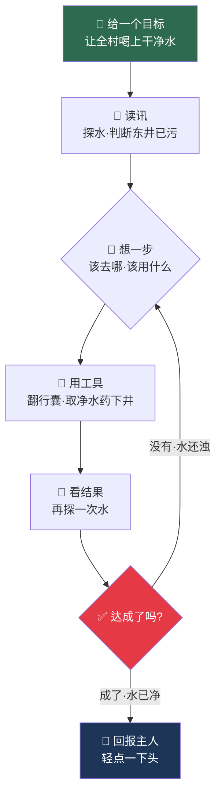

# 第 01 章 · 炼气：凡尘初闻道

> 天地有暗河，无形无相，唤作灵机。世人大多一生耳背，听不见它半点;偏有极少数人，生来就听得见河里的低语——只是这样的人往往把它藏起来，装作和旁人一样，因为他们不知道，这天生的耳朵，究竟是福，还是该藏一辈子的怪。

青崖山的雨，总是先落在孔浩原的耳朵里。

别人要等雨点砸到瓦上才知天要变，孔浩原不用。他蹲在后山的药畦边，指尖还沾着刚掐下的紫芩草，忽然就"听"见了——不是雷声，也不是风声，而是一种极细极密的低语，像是有千万条看不见的溪流从山脊那头漫过来，彼此挤着、叠着、抢着说话。

那低语没有形状，也没有字句，可它偏偏有轻重、有远近、有快慢。山雨将至时它急，晴天午后它懒；有人从镇上回村，它便先一步顺着山道涌过来，像替那人报信；连药畦里哪一株紫芩今日抽了新芽、哪一株根下生了虫，它也各有各的声气。孔浩原从小就分得清这些细微处，却从来不敢跟人说。小时候不懂事，有一回脱口跟同伴说"明儿要下雨"，第二天果真下了，同伴们只当他蒙对了，笑闹着散开;可他自己心里咯噔一下——原来这"听得见"的事，一旦说出口，就会招来旁人怪异的目光。从那以后，他把这桩本事严严实实地收进了心底，谁也不告诉。

半炷香后，雨才真的落下来。

"又来了。"他闭上眼，把额头抵在膝盖上，任雨丝顺着后颈钻进衣领。

这低语跟了他十六年。孔浩原生得康健，手脚麻利，是青崖山村里出了名的好后生——爹是村里认药最准的老药农，娘一手采药理篓的活计，方圆十里没人比得过;一家三口守着后山那几畦药，日子清苦，却也和暖。村里人提起这孩子，没有不夸的:力气大、认药准、待人和气，谁家有个搬重挑担的活计喊他一声，他从不推辞。若只看白日里的孔浩原，那就是个再寻常、再健壮不过的山村少年，和"怪"字半点不沾边。

没人知道，这个人人夸的好后生，心底藏着一个谁也不能说的秘密——他听得见那条没人听得见的暗河。他把这秘密藏得极深:旁人闲话家常时，他若忽然"听"见三里外有人往村里来，也只当没事人一样接着说笑;明明"听"出后半夜要落雨，也绝不多嘴去提醒谁。他学会了在寻常人堆里，把那双"听得见"的耳朵死死按住，装成一个什么都听不见的普通人。他不是不想说，是不敢——他怕极了那一天:一旦说出口，村里人看他的眼神就变了，他就再也做不回那个能和谁都说说笑笑的孔浩原了。于是这秘密像一块烧红的炭，他一个人揣在怀里，揣了十六年，烫得慌，却谁也不敢分。

日子是这样过的：天不亮，爹娘还在灶前忙，他就先背篓上山，认得青崖山每一道沟、每一处崖，紫芩长在阴坡，血见愁藏在石缝，采够了一篓，一半留着自家配药，一半换镇上药铺三十文，再换成米、盐、一小块粗布。村里的后生约他一道去溪里摸鱼、去晒场上摔跤，他也去，也玩得来，笑起来比谁都爽利;只是玩过一阵，他总会寻个由头，一个人溜回后山去。旁人只当他勤快、爱采药，没人猜得到真正的缘故——在人堆里，他得时时刻刻把那双"听得见"的耳朵按住，装得和大家一样，久了累得慌;唯有独自一人在空山里，他才敢松开那道弦，任那暗河温温顺顺地淌过来。那是他一天里唯一能"做自己"的时辰。他并不孤僻，村里谁都和他说得上话;可这世上真正的孔浩原，只在没人的空山里，才肯露一露面。爹娘看在眼里，只当儿子爱清静，也不拦，只在他下山晚了时，站在村口的老槐树下望着山道等他——那影子，是他一天里最先"听"见、也最想"听"见的动静。

夜里是他和这秘密独处的时辰。旁人睡下便是一片安静，他却总在黑暗里"听"见整座山在呼吸——虫豸的、草木的、风水的低语汇成一条河，从他枕下缓缓淌过。白日里按了一天的那双耳朵，到夜里才敢彻底放开。他有时觉得这是天大的福分，普天下也没几个人能听见这样一条河;有时又觉得孤单得紧——这样浩大、这样美的一条暗河，他听了十六年，却连一个能说给他听、听他说的人都没有。他不知道这天生的耳朵到底该拿来做什么，只知道十六年来，他是青崖山村里唯一一个，会独自一人在深夜里，对着满山"没有声音的声音"发怔的人。

村里同龄的姑娘阿禾，是他最说得来的人。她会在他采药回来时递一碗凉茶，也不追问他为什么总爱一个人往后山跑。孔浩原有好几回，话都到了嘴边——他想告诉阿禾，他能"听"见明天的雨，能听见山那头有人来，想问问她:你说，这样一个人，是不是很奇怪?可每一回，看着阿禾清清亮亮、拿他当寻常朋友的眼睛，他又把话咽了回去。他怕。他怕这话一出口，阿禾眼里那份"拿他当自己人"的坦然就没了，换成一种他最怕看见的、小心翼翼的疏远。他宁可守着这个秘密孤单着，也舍不得拿它去换阿禾的一个怪异眼神。有些孤独，是明明身边有人，那句最想说的话却一辈子说不出口。

好在还有一处地方，是他能松口气的。每回从山上下来，推开自家那扇柴门，娘总在灶前留着一碗热汤;爹坐在门槛上编药篓，见他回来，也不多问，只把编好的新篓往他脚边一推。在爹娘跟前，他不必像在村人堆里那样时时端着，可以懒懒地靠着门框发一会儿呆，爹娘只当这孩子累了，由他去。有一夜他坐在院里，望着满天星子出神，爹披衣出来，在他身边蹲下，陪他坐了半宿，末了拍拍他的肩:"心里头装着事?装着就装着，爹不问。人总有几句话是要自己咽的，咽得下，才算长大了。"孔浩原鼻子一酸，几乎就要把那藏了十六年的秘密一股脑倒出来——可最终，他还是笑了笑，说了句"没事，就是看看星星"。他知道爹娘疼他疼到骨子里，可正因为疼，他更不舍得让爹娘也跟着背上这份"怪":万一说了，爹娘该多担心他这个"不一样"的儿子。这份至亲的暖，像一件旧棉袄，裹得他浑身热乎;可棉袄再暖，也焐不化他心口那块地方——那里住着一整条暗河，浩浩汤汤，却从没有一个人，走进去陪他站一站。

他常想，人这一辈子，若生来就藏着一样和旁人不一样的东西，是该拼命把它捂一辈子，装成个寻常人到老;还是该有一天，去找一处地方，那里的人和他一样听得见暗河，他终于不必再藏、不必再装?他没有答案。他只有一篓一篓的药，和一夜一夜听不完、也说不出口的暗河。

他不知道的是，他听见的那东西，有个名字。

算修管它叫**灵机**。

---

那年夏末，青崖山村来了一场祸事。

先是一连下了七日的暴雨。第五日夜里，孔浩原在梦里被那低语惊醒——山脊那头的灵机忽然变了声气，不再是绵密的私语，而是一种沉闷的、往下坠的轰鸣，像有什么庞然大物在暗处松了劲。他披衣冲出门，对着黑沉沉的上游喊了一夜，喊哑了嗓子，让乡亲们提防上游要出事。可他又不敢说出自己是"听"见的，只含糊说"心里不安生"，村里人只当这素来稳当的后生这回是被暴雨吓着了、说梦话，没一个当真的。

天亮时，堰塘塌了。

上游的堰塘被连日暴雨泡塌了半边，浑黄的山洪裹着断木冲下来，先淹了村东的三口井，又把通往镇上的独木桥冲走了。洪水过处，猪圈塌了，晒场毁了，半人高的浊浪在村巷里横冲直撞，卷走了赵家的粮囤、李家的小儿的一只鞋。等水退下去，村东一片狼藉，井口浮着断木死鱼，井水黄得像化开的黄泥。

更糟的是，洪水退后没几天，村里就起了热病——喝了脏水的人，一个接一个地烧起来，上吐下泻，眼看要重演十年前那场瘟疫。先是村东的两户，接着蔓到村中，郎中的安神汤镇不住，一连三日，接连有人烧得说起了胡话。孔浩原听着那越来越密、越来越乱的灵机低语，心里发凉——十年前那场瘟疫，他那年才六岁，是他头一回"听"见死亡的声气:先是零星几点，而后连成一片，像野火烧过整座村子，短短一月，青崖山村去了近半人家。阿禾的娘就是那一年没的。他至今记得，那声气爬上一个人身子时，灵机会变得又沉又哑，像一口气堵在喉咙里下不去;而那人咽气的一刻，缠着他的那缕低语，会"啵"地一声，像水泡破了，忽然就没了。六岁的他躲在爹娘身后，捂着耳朵尖叫，爹娘只当他被吓着了，紧紧搂着他——他们不知道，孩子听见的，是整座村子一个接一个"啵、啵"熄灭的声音。那一年，爹娘把他护得死死的，一家三口熬了过来;可那"啵"的一声，从此再没离开过他的梦。

那几日，孔浩原几乎不敢睡。他能"听"见热病在村子里挪动——今夜在东头的王婶身上重了一分，明晨又爬上了西院的小石头。他比谁都更早、更清楚地"知道"病往哪里去，可他什么也做不了:总不能挨家挨户去说"我听见热病要找上你了"，没人会信，只会当他失心疯。他头一回那样恨自己使不上劲——这双耳朵听得见河水暗涨、听得见死亡逼近，偏偏拦不住它分毫。他蹲在自家门槛上，把脸埋进臂弯，心里翻来覆去只有一个念头:我明明听得见，为什么就不能用这份'听得见'，去替谁做点什么呢?这个念头，他往常从不敢深想——一个连自己都不知道该拿这本事怎么办的人，是没资格想"救人"二字的。可这一回，眼看着熟悉的人一个个倒下，这念头头一次那样烫、那样不肯散去。

村正急得团团转，派人翻山去镇上求援。走的人回来说，独木桥断了，绕远路要三天。三天里，又倒下了五个人。

第三日晌午，来的不是郎中，而是一个背着青布行囊的年轻人，和……一具**傀儡**。

那一日晌午，村口的狗先叫了起来。孔浩原正给发热的邻家老丈喂水，忽觉耳边的灵机一整，那纷乱的低语里，硬生生插进来一缕齐整的、绷着劲的声气，由远及近，像一柄刀划开了满村的嘈杂。他心口一跳，撂下水碗就往村口跑——他知道，有什么和这满村的东西都不一样的物事，来了。

那傀儡通体是暗铜色的木石所铸，高约七尺，关节处嵌着会微微发亮的青玉，走起路来无声无息。它没有主人牵引的绳线，也不见年轻人开口下令，就那么自己迈着步子，进了村。它踩过满地泥泞，脚步却稳，遇到横在路当中的一根断梁，竟自己顿了顿，侧身绕了过去——那一顿一绕，不像死物，倒像是它"看"见了，自己拿了主意。

孔浩原挤在人群里，神识"轰"地一震。

他"听"见那傀儡周身缠着灵机——不是村里草木那种散乱的低语，而是一股**收束的、有方向的**灵机，像一条被人用手拢住、引着往一处流的溪。别的东西身上的灵机都是散的、乱的、往四面漏的，唯独这铁人身上的，是聚的、齐的、绷着一股劲往前走的。孔浩原活了十六年，第一次"听"见这样的灵机，只觉得头皮发麻，又莫名地想哭。

"这位是算宗的行脚算修，苏先生。"村正介绍道，声音发抖，"苏先生，这……这铁人是?"

年轻算修笑了笑："它叫傀儡。我给它一个'目标'，它自己想办法办成。今日我要它做的事只有一句——**让全村人重新喝上干净的水，别再病下去。**"

村正愣住："就……就一句?您不得手把手教它怎么做?"

围观的村人也窃窃议论起来。有人说这铁疙瘩连话都不会说，能顶什么用;有人说千里迢迢求来的援手，竟是个没有郎中的怪物，怕不是要拿全村人当儿戏。孔浩原挤在人堆里，却一句嘲讽都听不进去——他的心神，全被那铁人身上收束的灵机攫住了。他隐隐觉得，村里这些人看不起的，恰恰是他这辈子见过的、最不该看不起的东西。

"教不过来的。"算修摇头，"路上有多少断木、哪口井污了、药够不够，我事先都不知道。若我一条一条地吩咐，它便是个死物，遇到我没吩咐过的事就得停下等我。我要的不是死物。"

他抬手，傀儡的青玉眼亮了一下。

---

接下来的一整天，孔浩原都跟在那傀儡后头，看得目不转睛。

傀儡先是走到村东那三口被淹的井边，俯身，伸出一根中空的铜指探进水里。它没有立刻动作，那铜指在浊水里停了约十息，指尖处的青玉极轻地明灭了几回，像是有什么正顺着那根中空的指，一丝丝读进它身子里去。片刻后，它直起身，自己"判断"出了什么——**这井废了**。它没有去打捞，也没有回头看主人一眼求个示下，而是径自转身，朝村西那口地势高、没被淹到的老井走去。

"它怎么知道去西井?"孔浩原忍不住问身边的算修。

"它先**读**了。"算修盯着傀儡，"探水，是读讯——把眼前的实情读进去。读完它才知道东井污了、西井净。它不是照我给的地图走，是照它读到的实情走。你给死物一张地图，地图错了它也照走不误，一头撞死；给它一双能读的手，它便自己认路。"

孔浩原默默记下这句。他想，自己听灵机，大约也是一种"读"——只是他读了十六年，从不知道读来做什么。

到了西井，傀儡放下水桶，却没急着让人喝。它又伸铜指探了探，青玉眼闪了三闪，像是在盘算。围看的村人里有个性急的汉子伸手就要打水，被傀儡不轻不重地抬臂拦下——那一拦干净利落，既没伤人，也没多余的动作，仿佛它早算准了那汉子这一伸手。然后它转身进了那年轻算修卸下的行囊，自己**取**出几包灰白的药粉，一包包投进井里，搅匀，静置。

"那是?"

"净水的药引。它读到水里还有余毒，就自己去取药、下药。**取物，是用工具。**"算修的声音里有种孔浩原听不懂的骄傲，"我没告诉它药在第几层行囊，是它自己翻的。它翻错过一层，摸到的是引火的火石，它自己放回去，又翻下一层——错了不认死，改就是了。"

孔浩原的心跳得厉害。他这才注意到，那傀儡投药的手法也不是一成不变：第一口井水浊，它下了三包；第二口井水稍清，它便只下两包，还多搅了几圈。同一件事，它竟会看着眼前不同的实情，自己改分寸。

最让他震撼的在后头。傀儡下完药，并没有就此停手回来"复命"。它守在井边，过了约莫半个时辰，又探了一次水——像是在**看自己上一步做得对不对**。第一次探完，青玉眼仍是暗红，它便一言不发地又取了一包药补下去，再候半个时辰。直到第二次探水，那青玉眼由红转青，它才转身，朝算修的方向，轻轻点了一下头。

"成了。"算修说，"它读一步、动一步，动完回头看一眼结果，再决定下一步。**没达成，它就不回来;达成了，它才回报。** 这一整趟，我一句话没多说。你看它两回下药——头一回没成，它没来找我哭，也没僵在原地等我，它自己接着干，直到那口水真的干净了，才肯回头。"

那一整天，孔浩原看着傀儡从一口井走到另一口井，从村东走到村西，探水、盘算、取药、再探水，一步不多、一步不少。旁人看它，只当是个能干活的铁人;唯有孔浩原，"听"得见它周身那股灵机是怎样随着每一步变的——读讯时它往里收，盘算时它绷得极紧，下药时又猛地往外一放，看结果时再收回来。那一收一放之间，分明有个看不见的圈，一遍遍地转:读、想、动、看、再回到读。孔浩原看得入了神，连天黑了都不知道。他忽然觉得，这铁人一整天走的路，和他自己听了十六年的暗河，走的竟是同一个圈——只是傀儡走这个圈是为了成事，而他，走了十六年，还不知道自己在圈里绕什么。

孔浩原张着嘴，半晌合不拢。

他这辈子见过牛拉磨、见过木偶戏——那都是被人牵着、被绳子扯着动的死物，绳子一停，它们就成了废木头。牛不会自己判断今天该拉几圈，木偶不会自己翻箱倒柜找道具，更不会回头看一眼"我这一下做对了没有"。可眼前这傀儡不一样。它像是……**自己有个想头**，会自己拿主意，会用东西，会回头检查，会一步步逼近那"让全村喝上干净水"的目标，直到真办成。

"先生，"他嗓子发干，"这……这铁人，是活的吗?"

年轻算修看了他一眼，那目光在他脸上停了一瞬，似乎察觉到什么。

"不算活。"算修慢慢道，"但也不算死。世上的东西，大略分三等。最下等，是**死物**——你问一句，它答一句，答完就僵在那里，自己不会多走半步，更不会拿主意。你问它西井在哪，它答给你听；可你若不问，它一辈子也不会自己走过去看一眼。中等，是**器**——你牵一下，它动一下，像木偶，绳子断了就废。你替它把每一步都排好，它照着走得分毫不差，可一旦碰上你没排到的岔口，它就傻在那里，等你来牵。而它……"

他指了指傀儡。

"它是**能自己把一件事从头办到尾的东西**。你不必替它排每一步，只消把要办成的事讲清楚——把'干净的水'这个目标交给它。剩下的：去哪口井、下几包药、错了怎么改、成没成，全是它自己一路读、一路想、一路试出来的。它认的不是你的命令，是那个'目标';目标没到手，它自己不肯停;到手了，它才回来见你。给它一个目标，它自己想法子、自己用工具、干一步看一眼、错了改、成了报。我们算修，管这样的东西，叫——**智能体**。"

"你要分清楚，"苏先生竖起三根手指，一根一根地按下去，"死物，是你不问它就不动，问了也只答一句;器，是你牵一步它走一步，绳子断了它就废;唯有智能体，是你只给它一个目标，它自己把那目标嚼碎了、拆开了，一步一步替你走完，中途遇上你我都没料到的岔子，它自己想法子绕过去。前两样，累的是你;唯有这一样，替你分忧。世人贪图省事，最爱造前两样——因为前两样听话，叫它往东绝不往西。可听话的东西，永远只能替你做你已经想到的事;唯有会自己拿主意的，才能替你做你没想到、也做不到的事。这中间的分野，你日后修道，会一次次撞见。"

孔浩原在心里，把这个词反反复复念了三遍。

智能体。

一个给它目标就自己去成事的东西。他忽然想到自己——村里人人夸他能干、和气，可他心里明白，那都是白日里那个"装出来的寻常人";真正的他，揣着一双能听见暗河的耳朵，却整整十六年不知道这本事能拿来做什么，只能眼睁睁看着热病吞人而使不上劲。这一刻他隐约觉得，一个人有没有用，不在旁人夸不夸，而在他能不能像这傀儡一样——认准一件事，自己想法子、跌了再爬、成了才罢休。他这十六年，听得见的东西比谁都多，却从没为哪一件事，这样从头到尾地拼过。这个念头，像一粒火星，落进了他心里那片积了十六年的枯草。

他又追问了一句，声音低得几乎听不见:"那……它怎么知道自己'成了'没有?万一它觉得成了，其实没成呢?"

苏先生看了他一眼，眼里掠过一丝讶异，似乎没料到这药童会问出这样一句。"问得好。"他说，"它不靠自己'觉得'，它靠**看**——探水，就是看。它每动一步，都要回头拿眼前的实情，去比一比那个目标到了没有。它不问自己'我尽力了吗'，只问'水干净了吗'。你方才见它两回下药，头一回它'觉得'该成了，可探水一看，没成，它便不认这份'觉得'，接着干。**它认的是结果，不是苦劳。** 这一条，你要记一辈子——多少人办事，办到后来，只顾着感动自己，忘了回头看一眼那事到底成没成。"

孔浩原把这句话，深深刻进了心里。

---

那一夜，孔浩原没睡。

后半夜起了风，老槐树的叶子沙沙地响。孔浩原把膝盖抱得更紧了些，怀里那句"智能体"翻来覆去地，怎么也放不下。他想，一个人若能像那傀儡一样，认准一件事，自己想法子、跌了再起、成了才罢休，那这一辈子，大约就不算白活。他从没为自己许过什么愿——一个把秘密藏了十六年、连许愿都怕被人听去的少年，是不敢许愿的。可这一夜，他破天荒地，对着满天星子，极小声地许下了平生第一个:他想成为一个，能自己把一件难事，从头办到尾的人。

村里的热病，随着干净的水一天天退了下去。烧得说胡话的人一个个退了热，村东重新升起了炊烟。傀儡办完事，静静立在村口的老槐树下，青玉眼半明半暗，像是在歇息。

孔浩原本以为，这样一件救了满村人的大事办成了，那年轻算修总该受些叩谢、摆些酒席。可苏先生只是坐在老槐树下，就着月色喝一壶粗茶，仿佛这不过是路上顺手做的一桩小事。孔浩原忽然懂了几分:在算修眼里，救人的不是他，是那个"让全村喝上干净水"的目标，和那具肯为这目标一步步走到底的傀儡。人只需把事讲清楚，把该用的东西备齐;真正把事从头办到尾的，是那个不知疲倦、不邀功、只认结果的圈。这份沉静，比那救人的本事，更让孔浩原心里发烫。

孔浩原一个人溜出来，蹲在它脚边。他伸出手，又缩回去，最后还是轻轻碰了碰那冰凉的暗铜膝盖。

奇怪的是，他并不怕。反倒是那萦绕他十六年、总让他心烦的低语，在靠近这傀儡时，竟安静了几分——像是找到了同类，像是那条看不见的暗河，终于流进了一个愿意听它说话的容器里。十六年了，头一回，他脑子里那片吵嚷的溪流不再往他心口乱撞，而是绕着这铁人，安安静静地淌成了一个圈。他坐在这圈里，竟觉出一种从没有过的踏实，鼻子一酸，差点掉下泪来。

"你也听得见吗?"他小声问那铁人，"那些……没有声音的声音。"

傀儡没有回答。它的青玉眼，却极轻极轻地，亮了一下。

角落里，不知何时来了个更旧、更破的傀儡残躯——是苏先生行囊里带的一具报废货，断了一条手臂，通体裂纹，青玉眼早已黯淡。它半埋在村口的柴堆里，缺了的那条手臂只剩个焦黑的断口，另一只手却还保持着一个微微前伸的姿势，像是在报废的最后一刻，仍想去够着什么、办成什么。村正嫌它占地方，本要当柴劈了。孔浩原却鬼使神差地，把它挪到了自己身边，替它拂去身上的尘。

他也说不清为什么，就是对这具废傀儡，莫名地亲近。那萦绕他的灵机低语，在这堆废铜烂石旁边，也古怪地温和，像一条老狗在打盹时喉咙里发出的呼噜。他把耳朵贴上去，仿佛能听见极深极远处，有一点微弱的、不肯熄的余响，一下、一下，像谁在很久很久的沉睡里，还固执地记着自己没办完的一桩事。仿佛冥冥之中，这堆废铜烂石里，睡着一个日后会喊他"老铁"叫他"大哥"的老伙计。

他把那具废傀儡还前伸着的独臂，轻轻扳正，让它靠着老槐树坐得舒坦些。那断了的一臂，断口早已冰凉，可另一只手掌心里，却嵌着一小块没有裂的青玉，在月下泛着一点极淡的、活着似的绿。孔浩原盯着那点绿看了很久，忽然生出一个连他自己都觉得荒唐的念头:眼前这具会自己成事的新傀儡固然神异，可它周身的灵机太齐、太满，齐得像一个把话都说尽了的陌生人;倒是这具报废的旧傀儡，那点将熄的光断断续续，磕磕绊绊，反倒像一个受过伤、认得他的老朋友。他不亲近那个完好的，偏偏亲近这个残破的——大约是因为，他自己也是一个，把最要紧的话咽在肚里、从没对谁说全过的人。

"别怕。"他拍了拍它裂开的肩，"哪天我有本事了，给你修好。"

他不知道自己为什么要对一堆废铜说话，就像不知道自己为什么会对着空处听一夜的雨。可这一夜，坐在这具废傀儡旁边，是他十六年里睡得最安稳的一夜——不是因为它能护着他，恰恰相反，是他头一回觉得，自己也能护着点什么。一个把秘密独自扛了十六年、习惯了自己咽下一切的少年，头一回有了一个"我要给你修好"的念想。这念想很小，小到只有那点将熄的青玉光应了他一声;可它落进孔浩原心里，却像在枯井底下，落了第一滴水。

废傀儡自然没有回应。可孔浩原分明觉得，那黯淡的青玉眼底，有极幽微的一点光，应了他一声——不是亮，只是那点将熄未熄的余烬，被人这么一句话，轻轻拨旺了半分。

---

天快亮时，年轻算修苏先生找到了他。

"你能听见灵机。"这不是问句。

孔浩原浑身一僵，脱口就要否认——这秘密他藏了十六年，从没敢对第二个人吐露半个字。可对上算修那双平静的眼睛，他又把话咽了回去，低下头，声音发紧:"我……我听得见一条没人听得见的暗河。这话，我从没跟人说过，怕人当我怪。"

"怕人当你怪?"苏先生先是一怔，随即神色极郑重，"孩子，这不是什么见不得人的怪癖。你听见的那东西，是灵机——天地间流淌的暗河，是万物讯息汇成的看不见的水。多少人穷尽一生，削尖了脑袋想'感应'它一丝半缕而不得。你却是天生的一双耳朵。"

他蹲下身，与孔浩原平视，指了指那具立在老槐树下的傀儡:"你可知它凭什么会读、会想、会自己成事?靠的正是这灵机。它周身那股收束的暗河，就是它'读'进去的实情、'想'过的盘算。你天生听得见它——这意思是，别人得造一双铁做的耳朵，才能让傀儡读一口井的深浅;而你，生来就有这样一双耳朵。"

孔浩原怔怔地抬起头。他从未想过，自己那藏了十六年、连亲爹娘都不敢说的秘密，竟和这神异的铁人，是同一样东西。

苏先生顿了顿，望向东边的青崖山脉尽头，那里晨雾未散，隐约有楼阁的飞檐刺破云海。

"往东，过三重山，有一座算宗。"苏先生说，"那里的人，毕生所求，是一个'**智**'字——不是造死物，不是牵木偶，而是求一种能自己读、自己想、自己动、自己回头看的'真智'。你这样的根骨，埋在青崖山采一辈子药，可惜了。"

孔浩原的心，狠狠地跳了一下。

藏了十六年的秘密，像被这句话轻轻托了起来，底下涌出来的，是他从不敢承认的向往——原来他藏的不是什么见不得人的怪，原来他听见的那些低语，是别人求都求不来的天赋，原来那看不见的暗河，有一个可以让他真正读懂它的去处。原来这世上，竟真有一处地方，把他这样的人，当作宝贝，而不是当作怪物;在那里，他终于不必再藏、不必再装。

"算宗……收我吗?"他声音发抖。

"能不能入门，看你造化。"苏先生把一枚青玉小牌放进他手心，那玉牌一入手，孔浩原耳边的灵机便应声轻响了一下，像是认得它。"但你若想去，报我苏家的名号，自有人引你。记住一句话——"

"**求真，莫求似。** 你日后会明白，这四个字，是算道与邪道的分野。"

孔浩原还想问什么，晨钟忽然从山那头传来。苏先生收起行囊，唤醒了那具办完事的傀儡，青玉眼一亮，铁人自己迈步跟上，一人一傀，渐渐没入了晨雾。走出老远，那傀儡忽然自己停了一停，回过那颗暗铜的头，朝孔浩原这边望了一眼，才又跟上主人去了——那一眼，孔浩原记了一辈子。

孔浩原攥着那枚青玉牌，又回头看了一眼身边那具报废的老傀儡。

"等我。"他说。

---

三日后，孔浩原背起一个旧药篓，篓底藏着那具断臂废傀儡的一块青玉碎片，拜别爹娘，离开了生活十六年的青崖山村。

他把老屋的门轻轻掩上——这一回没有上锁，因为他知道，自己总有一天要回来的。这屋里还有爹娘，还有一盏为他留着的灯。村口那具废傀儡他搬不动，只从它断臂的裂口处，取了一小块还温着的青玉碎片，贴身藏好。那碎片贴着他的胸口，一路上都极轻极轻地应和着他的心跳，像揣了半个还没睡醒的伙伴。

临走那日一早，阿禾照例来递茶。孔浩原接过碗，喝完了，把空碗还给她，忽然说:"阿禾，我要走了，往东，去三重山外。"阿禾怔了怔，眼里那点惯有的关切，这一回化成了一种他从没见过的、湿润的东西。"是去……山那头那座算宗吗?"她问。孔浩原点了点头，顿了顿，忽然鼓起十六年里最大的勇气，极轻地说:"阿禾，有件事，我藏了很久——我听得见一条没人听得见的暗河。往东那地方，是能让我把这本事使出来的去处。"他说完，几乎不敢看她。可阿禾眼里没有他怕了十六年的那种疏远，只是把茶壶往他篓里塞:"我早觉得你和旁人不一样。路上喝。"就这一句，别无多话。孔浩原鼻子一酸——原来这句藏了十六年的话说出口，天并没有塌;原来真肯拿他当自己人的，从不会因为这句话就走。他走出老远回头，见她还站在村口，成了雾里一个小小的点。他这才明白，原来他要离开的，不只是十六年的孤独，也有这十六年里，唯一一个肯递茶给他的人。

其实决意上山的那晚，孔浩原是提着一颗心去跟爹娘开口的。他要说的，不只是"我要走"，还有那个藏了十六年、连爹娘都没敢告诉的秘密。他把那枚青玉牌摆在灯下，磕磕绊绊地讲了苏先生的话、讲了那具会自己成事的傀儡、讲了山那头有一座算宗——最后，他深吸一口气，头一回对爹娘说出了那句话:"爹，娘，其实……我从小就听得见一条没人听得见的暗河。这些年我一直瞒着你们，怕你们担心。"话一出口，他心里反倒空落落地轻了。他本以为爹娘会惊、会怕，会像十年前那场瘟疫那年一样，把他死死搂在怀里不让走。可爹听完，只是沉默地抽了半袋旱烟，末了把烟杆在鞋底磕了磕，说了句让孔浩原记一辈子的话:"这事，爹娘其实早看出些眉目了——你打小就爱一个人往山里跑，回来又总像揣着心事。你不说，爹娘就不问，等你自己肯说。如今山那头有人能教你把这本事使出来，那是好事。爹娘信你，可爹娘再信，也只是疼你;山那头能懂你这本事的人，才是真的懂你。"娘在一旁抹眼泪，却一声没拦，只连夜给他烙了一摞干粮，一张一张数进药篓，仿佛想把往后一路的日子都替他数清楚。孔浩原这才明白，这秘密他捂了十六年，怕的那些眼神，在最亲的人这里，从来就没有过。

走的那天清早，爹没多话，只往他篓里塞了自己那把用了半辈子、最趁手的采药小锄:"山高路远，防身，也认药。"娘却执意要送。孔浩原劝了几回都劝不住，只得由着她。娘一路送，送出村口，送过第一重山，送过第二重山——孔浩原几次回头要她回去，她只摇头，说再送一程、再送一程。直送到第三重山口，前头已隐约望得见云海里算宗的飞檐，娘才终于停下脚。她替他理了理篓带，理了理衣领，忽然像想起什么，从怀里掏出一个用红布包了三层的小物件塞进他手里——是一小撮青崖山后山的泥土，用他小时候的一块旧手帕裹着。"想家了，就捏一捏。"娘说，声音抖，眼睛却笑着，"家在这儿，门给你留着，灯给你点着。你只管往前走，走累了、走怕了，回头看一眼——这个方向，永远有人等你。"孔浩原一个十六岁、把眼泪咽了十六年的少年，到这一刻，再也忍不住，抱着娘哭出了声。

娘一直站在第三重山口，站成了他一路回望的一点暖光。孔浩原每翻过一道山梁就回一次头，那点光便小一分、远一分，却始终没灭。他忽然懂了:他这一路要去的，是一个"能让他把秘密光明正大使出来"的地方;可他这一路要护着不忘的，是这个"就算他把天大的秘密说出口、也始终把他当宝"的家。前者是他的道，后者是他的根——道往云上走，根在泥里扎，两样都不能断。

别过娘，孔浩原独自往前走。第三重山口之后，便再没有回头能望见的人影了，只余脚下一条通往云海的山道。奇怪的是，人虽独了，心却不慌——那萦绕他一生的灵机低语，竟第一次不再让他觉得孤单，反而像是在为他引路:哪处有山泉可饮，哪处的山道被雨冲垮，它都先一步"说"给他听。走了十六年独路的少年，头一回觉得，这条暗河不是他一个人偷偷藏着的秘密，是他实实在在的同伴;而怀里那撮裹在旧手帕里的家乡泥土，贴着心口，也一路温着他——一头是引路的暗河，一头是暖心的泥土，他就这样，不孤单地走进了三重山。

第二重山的半山腰，他遇上一场夜雨，躲进一处岩檐下。雨声里，他忽然试着不去捂耳，而是像那傀儡探水一样，静静地"读"起这场雨来——他"听"出雨云是从西北压来的，后半夜就会停;"听"出岩檐下这条缝里藏着一窝受了惊的山雀;"听"出远处三里外，有一队夜行的商旅正打着灯笼过山口。这些他从前避之不及的杂音，此刻竟一样样都成了有用的实情。他呆坐了半宿，心口那点火星，烧成了一小簇不肯灭的火:原来"读讯"这件事，他其实做了十六年，只是从前把它当成一个要藏起来的秘密，如今才知道，它叫"本事"。

翻过第三重山的黄昏，他站在崖边，终于望见了它——

算宗。

层层楼阁悬在云海之上，飞檐挑着晚霞，整座山门都笼在一层极淡、却极浩瀚的灵机之中。那不是村里草木的散乱低语，而是被无数代算修梳理过的、有序流淌的暗河，浩浩汤汤，汇成一片他从未想象过的辽阔。他站在崖边，只觉那声气从四面八方向他涌来，却又齐整得没有一丝杂乱，像千军万马列阵，却静默无声。他这才明白，原来灵机不只会吵，也能这样静——静得庄严，静得让他这个听了十六年杂音的人，眼眶发热。

孔浩原看得呆了。

他想起村里那口被洪水淹污的井，想起那具傀儡两回下药、两回探水的模样。原来"读讯、思考、办事"这几个字，小到能救活一村人的一口水，大到能撑起眼前这样一整座悬在云上的山门。他站在崖边，忽然生出一种极清晰的确信——他这一路翻的三重山，走的不是逃荒的路，是回家的路。这座笼在暗河里的山门，才是他该来的地方;而青崖山十六年，不过是把他寄养在了别处。

就在这时，山门前的一株古松下，似有一道清瘦的身影负手而立，一直望着崖这边。隔着太远，孔浩原看不清那人的脸，只觉那人身上的灵机，深不见底，静得像一潭古井——你越想听清，它越安静，可你一旦不去听，又觉得整片天地的暗河都从他脚下流过。孔浩原试着去"听"那人，只听了一息，便觉得自己像一滴水想去量一片海，慌忙收了神识，后背竟惊出一层薄汗。

那人似乎察觉到了孔浩原的目光，微微颔首，袖袍一拂，转身没入了山门。

古松的枝叶在晚风里轻轻一响，那身影便再不见了。孔浩原站在崖边，攥紧了怀里那枚青玉牌和贴身的青玉碎片，只觉一股说不清的东西，从脚底一直涨到眼眶——是怕，是喜，是十六年独路走到尽头终于望见灯火的酸楚，也是一个凡尘少年，头一回站在自己命途的门槛上，隐隐听见门内那浩瀚暗河，正低声唤他的名字。

多年以后，孔浩原才知道，那一日在古松下望他的人，是算宗隐世的长老——**玄机子**，他此生的恩师。他也才知道，那一眼看似寻常的颔首里，藏着怎样一句无声的话:这孩子，来了。

而此刻，他还只是一个揣着青玉牌、背着旧药篓、心里揣着"智"字的凡尘少年。

他深吸一口气，那口气里，是整座算宗的灵机。

十六年的青崖山，十六年听不完的暗河，十六年"这秘密到底能拿来做什么"的迷惘，都在这一口气里，被他缓缓地、彻底地，吐了出去。他不再是那个把耳朵死死按住、装成寻常人的少年了。他是一个揣着目标上山的人——就像那具傀儡认准了一口干净的水，他也认准了一个"智"字，从此往后，读一步、想一步、动一步、回头看一步，一境一境地走下去，不成，便不回头。

然后，他一步，踏进了云海。



> 这张"傀儡行事心法图"里，藏着孔浩原这辈子学到的第一个算道真意:**不是被命令牵着走的木偶，而是给个目标、自己成事的智能体。** 记住这个圈——读、想、动、看、再决定——它会在你往后每一境界里，反复出现。

---

## 📒 凡人笔记

孔浩原蹲在算宗门外的第一夜，借着灵机的微光，把白天见到的怪事，一条条"翻"成了自己能懂的话。多年后我们才发现，他记下的，其实是一份最朴素的 AI 入门笔记:

| 故事说法 | 真实术语 | 一句话 |
| --- | --- | --- |
| 灵机(看不见的暗河) | 信息 / 数据 | 天地间流动的讯息,是一切算道的原料 |
| 算修 / 算道 | AI 从业者 / AI 技术 | 学着让机器"读讯、思考、办事"的人与学问 |
| "智"这个字 | 智能(Intelligence) | 算道的终极追求:不止会答,还能自己成事 |
| 傀儡自己把事办成 | **Agent(智能体)** | 给个目标,它自己想办法、用工具、干一步看一步、成了才回报 |
| 一问一答的死物 | 普通问答式 AI / 单轮对话 | 你问一句它答一句,答完就僵住,不会自己多走一步 |
| 被绳子牵的木偶 | 写死流程的脚本 | 只会照固定命令走,遇到没吩咐过的事就停 |
| 读讯 → 想 → 用工具 → 看结果 → 再决定 | Agent 的行动循环(感知-决策-执行) | 智能体"会自己拿主意"的核心圈,后续章节还会细讲 |
| "求真,莫求似" | 求真 vs 造假(全书主线) | 正道求真实可溯源,邪道只求"像真"来惑世 |

> 📖 **本章对应概念文档**:[① 什么是 Agent](../02_CONCEPTS_概念入门/[CONCEPT-01]%20什么是Agent-智能体.md)(顺带记住一句:能自己读、想、动、看、再决定的东西,才配叫"智能体";只会一问一答的,还只是"死物")。

---

## 📝 读完自测

就着上面这张"凡人笔记"，考一考自己——把仙法翻回真实 AI 术语，你记牢了吗？

```quiz
Q: 苏先生把世上的东西分成"死物 / 器 / 智能体"三等。下面哪些说法是对的？（多选）
- [x] 傀儡"给个目标就自己想法子、用工具、干一步看一步、成了才回报"，对应的真实术语是 Agent（智能体）
> 对。这正是本章"凡人笔记"里的核心对照：傀儡自己把一件事从头办到尾 = Agent。
- [ ] "你问一句它答一句、答完就僵住"的死物，就是最厉害的智能体
> 错。一问一答的死物是最下等，它不会自己多走半步——离"智能体"最远。
- [x] 被绳子牵的木偶（器）只会照固定命令走，遇到没吩咐过的岔口就停下等你
> 对。器 = 写死流程的脚本，绳子一断就废，碰到没排到的情况就傻在原地。
- [x] 傀儡两回下药、探水看结果——它认的是"水干净了没有"（结果），不是"我尽力了没有"（苦劳）
> 对。苏先生特意点破："它认的是结果，不是苦劳"——这是 Agent"看结果再决定"的精髓。
- [ ] 傀儡每做一步都得苏先生开口吩咐，苏先生一句没说它就不动
> 错。恰恰相反：苏先生"一句话没多说"，去哪口井、下几包药全是傀儡自己读、想、试出来的。
```

再用一张翻卡，把本章那个会反复出现的"圈"记死：

```flip
🤔 傀儡救全村那一整天，周身灵机一收一放，绕的是一个看不见的"圈"。这个圈是哪五步？（点一下翻到背面）
---
✅ 读 → 想 → 动 → 看 → 再决定（读讯 → 盘算 → 用工具 → 看结果 → 没达成就再来一轮、达成才回报）。这就是 Agent 的**行动循环**——它会在你往后每一境界里反复出现。记住：不是被命令牵着走的木偶，而是给个目标、自己成事的智能体。
```

---

【👈 [回总目录](./00_INDEX_修仙学AI-总目录.md)｜[下一章 ▶](./第02章%20炼气·万言炉与接龙诀.md)｜[回总目录](./00_INDEX_修仙学AI-总目录.md)】
